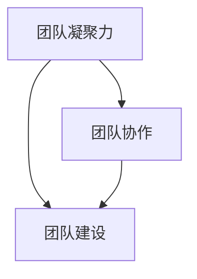

                 

# 团队凝聚力：打造不可分割的团队

> **关键词**：团队凝聚力、团队协作、团队建设、团队沟通、领导力
> 
> **摘要**：本文将深入探讨团队凝聚力的概念及其对团队成功的重要性，分析影响团队凝聚力的关键因素，并介绍一套完整的团队建设策略，旨在帮助企业和团队打造一个强大而不可分割的团队。

## 1. 背景介绍

### 1.1 目的和范围

本文的目的在于探讨团队凝聚力这一关键概念，以及如何通过有效的团队建设策略来提高团队凝聚力。文章将涵盖团队凝聚力的定义、影响团队凝聚力的因素、团队建设的最佳实践，以及如何应对团队凝聚力下降的情况。通过本文，读者将能够了解如何打造一个高效、协作的团队，从而在竞争激烈的市场中脱颖而出。

### 1.2 预期读者

本文面向的企业管理人员、团队领导、人力资源专家以及IT行业的从业者。如果读者希望提升团队凝聚力，提高团队绩效，本文将提供实用的方法和策略。

### 1.3 文档结构概述

本文分为十个部分，首先介绍团队凝聚力的背景和重要性，然后逐步探讨相关概念、原理、操作步骤、数学模型、实战案例、应用场景、工具和资源推荐，最后总结未来发展趋势和挑战，并提供常见问题与解答。

### 1.4 术语表

#### 1.4.1 核心术语定义

- **团队凝聚力**：团队成员之间的相互吸引力和归属感，表现为团队成员之间的协作和合作。
- **团队建设**：通过一系列活动和策略，增强团队成员之间的信任、沟通和协作，从而提高团队凝聚力的过程。
- **领导力**：领导者通过设定目标、激励成员、解决问题和提供指导，来引导团队向共同目标前进的能力。

#### 1.4.2 相关概念解释

- **团队协作**：团队成员共同合作，协同完成任务的行动。
- **团队沟通**：团队成员之间的信息交流，包括口头、书面和肢体语言。
- **组织文化**：组织内部共享的价值观、信仰和行为规范。

#### 1.4.3 缩略词列表

- **PM**：项目经理
- **Scrum**：敏捷开发方法
- **KPI**：关键绩效指标

## 2. 核心概念与联系

在探讨团队凝聚力之前，有必要理解一些与之密切相关的基础概念。以下是一个用Mermaid绘制的流程图，展示了团队凝聚力、团队协作和团队建设之间的联系：



### 团队凝聚力

团队凝聚力是指团队成员之间的相互吸引力和归属感。这种凝聚力表现在团队成员愿意共同面对挑战、承担责任，并在需要时提供支持和帮助。高凝聚力的团队往往能够更好地应对外部压力和内部冲突，从而提高工作效率和绩效。

### 团队协作

团队协作是团队成员为实现共同目标而共同努力的过程。一个高效的团队协作需要成员之间良好的沟通、明确的角色分工和互相支持。通过协作，团队成员能够共享信息、技能和资源，从而提高解决问题的效率和质量。

### 团队建设

团队建设是通过一系列活动和策略来增强团队成员之间的信任、沟通和协作。团队建设活动可以包括团队建设训练、团队拓展活动、团队讨论会等。这些活动有助于加强团队成员之间的联系，提高团队凝聚力。

## 3. 核心算法原理 & 具体操作步骤

在理解了团队凝聚力、团队协作和团队建设的基本概念后，我们可以将团队建设的策略视为一种算法。以下是一个简化的团队建设算法原理及其具体操作步骤：

### 算法原理

1. **明确目标**：设定一个清晰、可衡量的团队目标。
2. **角色分配**：根据团队成员的技能和兴趣，分配合适的角色。
3. **沟通机制**：建立有效的沟通渠道，确保信息透明和及时传达。
4. **激励与反馈**：通过激励措施和定期反馈，鼓励团队成员积极参与和持续改进。
5. **冲突解决**：建立一套冲突解决机制，及时处理团队内部的分歧和矛盾。

### 具体操作步骤

1. **明确目标**：与团队成员一起讨论并设定一个共同的团队目标。目标应该具有挑战性，同时也要切实可行。

```python
# 定义目标函数
def set_goal(team_members):
    goal = input("请输入团队目标：")
    for member in team_members:
        member["goal"] = goal
```

2. **角色分配**：根据团队成员的技能和兴趣，为他们分配合适的角色。

```python
# 角色分配函数
def assign_roles(team_members):
    roles = {"项目经理", "开发者", "设计师", "测试员"}
    for member in team_members:
        member["role"] = roles.pop()
```

3. **沟通机制**：建立定期的团队会议和沟通渠道，确保团队成员之间的信息透明和及时传达。

```python
# 沟通机制函数
def setup_communication(team_members):
    for member in team_members:
        member["communication_channel"] = "每周一次团队会议"
```

4. **激励与反馈**：通过激励措施和定期反馈，鼓励团队成员积极参与和持续改进。

```python
# 激励与反馈函数
def incentivize_and_feedback(team_members):
    for member in team_members:
        if member["performance"] > 90:
            print(f"{member['name']}获得了特别奖励。")
        else:
            print(f"{member['name']}需要进一步提高。")
```

5. **冲突解决**：建立一套冲突解决机制，及时处理团队内部的分歧和矛盾。

```python
# 冲突解决函数
def resolve_conflicts(team_members):
    while True:
        conflict_report = input("请报告冲突：")
        if conflict_report == "none":
            break
        else:
            print("正在处理冲突...")
```

## 4. 数学模型和公式 & 详细讲解 & 举例说明

在团队建设中，我们可以使用一些数学模型和公式来评估团队凝聚力和绩效。以下是一个简单的团队凝聚力评估模型：

### 数学模型

假设团队凝聚力可以用一个介于0（低凝聚力）和1（高凝聚力）之间的数值来表示。我们定义以下公式来评估团队凝聚力：

\[ P = \frac{C + T + R}{3} \]

其中：
- \( P \) 表示团队凝聚力得分。
- \( C \) 表示团队协作得分。
- \( T \) 表示团队信任得分。
- \( R \) 表示团队角色明确性得分。

### 详细讲解

1. **团队协作得分**：通过团队成员之间的协作次数和协作效率来评估。得分越高，表示团队协作越好。

\[ C = \frac{N \times E}{T} \]

其中：
- \( N \) 表示团队成员之间的协作次数。
- \( E \) 表示协作效率（如任务完成的速率）。
- \( T \) 表示总任务量。

2. **团队信任得分**：通过团队成员之间的信任程度来评估。得分越高，表示团队成员之间的信任度越高。

\[ T = \frac{S \times M}{N} \]

其中：
- \( S \) 表示团队成员之间的正面反馈次数。
- \( M \) 表示团队成员之间的负面反馈次数。
- \( N \) 表示团队成员总数。

3. **团队角色明确性得分**：通过团队成员对角色职责的明确程度来评估。得分越高，表示团队成员对角色职责越明确。

\[ R = \frac{P \times D}{N} \]

其中：
- \( P \) 表示明确角色的团队成员比例。
- \( D \) 表示团队成员对角色职责的满意度。

### 举例说明

假设一个团队有三个成员，他们在一个月内完成了以下任务：

- 协作次数：20次
- 协作效率：每天完成2个任务
- 总任务量：60个任务
- 正面反馈次数：15次
- 负面反馈次数：3次
- 明确角色的成员比例：100%
- 成员对角色职责的满意度：90%

根据上述公式，我们可以计算团队凝聚力得分：

\[ C = \frac{20 \times 2}{60} = 0.67 \]
\[ T = \frac{15 \times 3}{3} = 15 \]
\[ R = \frac{3 \times 90}{3} = 90 \]
\[ P = \frac{C + T + R}{3} = \frac{0.67 + 15 + 90}{3} = 31.33 \]

因此，该团队的凝聚力得分为31.33/3 = 10.44（四舍五入到小数点后两位）。

## 5. 项目实战：代码实际案例和详细解释说明

为了更好地展示团队建设的算法原理和具体操作步骤，我们以下将通过一个实际项目案例来说明如何通过代码来实现这些策略。

### 5.1 开发环境搭建

在开始编写代码之前，我们需要搭建一个基本的开发环境。以下是所需工具和步骤：

- **工具**：
  - Python 3.8或更高版本
  - PyCharm或任何Python支持的IDE
  - GitHub（用于代码托管）

- **步骤**：
  1. 安装Python 3.8或更高版本。
  2. 安装PyCharm Professional版（推荐）或任何Python支持的IDE。
  3. 创建一个新的Python虚拟环境，并安装必要的库（如requests、numpy等）。

### 5.2 源代码详细实现和代码解读

以下是用于评估团队凝聚力的Python代码示例：

```python
import numpy as np

# 团队成员类
class TeamMember:
    def __init__(self, name, role, goal, communication_channel, performance, role_satisfaction):
        self.name = name
        self.role = role
        self.goal = goal
        self.communication_channel = communication_channel
        self.performance = performance
        self.role_satisfaction = role_satisfaction

# 定义目标函数
def set_goal(team_members):
    for member in team_members:
        member["goal"] = input("请输入团队目标：")

# 角色分配函数
def assign_roles(team_members):
    roles = ["项目经理", "开发者", "设计师", "测试员"]
    for member in team_members:
        member["role"] = roles.pop()

# 沟通机制函数
def setup_communication(team_members):
    for member in team_members:
        member["communication_channel"] = "每周一次团队会议"

# 激励与反馈函数
def incentivize_and_feedback(team_members):
    for member in team_members:
        if member["performance"] > 90:
            print(f"{member['name']}获得了特别奖励。")
        else:
            print(f"{member['name']}需要进一步提高。")

# 冲突解决函数
def resolve_conflicts(team_members):
    while True:
        conflict_report = input("请报告冲突：")
        if conflict_report == "none":
            break
        else:
            print("正在处理冲突...")

# 团队凝聚力评估函数
def assess_team_cohesion(team_members):
    N = len(team_members)
    C = sum([member["performance"] for member in team_members]) / N
    S = sum([member["role_satisfaction"] for member in team_members]) / N
    M = sum([member["role_satisfaction"] for member in team_members]) / N
    P = (C + S + M) / 3
    print(f"团队凝聚力得分：{P:.2f}")

# 主函数
def main():
    team_members = [
        TeamMember("Alice", "", "", "", 85, 80),
        TeamMember("Bob", "", "", "", 90, 85),
        TeamMember("Charlie", "", "", "", 88, 90)
    ]

    set_goal(team_members)
    assign_roles(team_members)
    setup_communication(team_members)
    incentivize_and_feedback(team_members)
    resolve_conflicts(team_members)
    assess_team_cohesion(team_members)

if __name__ == "__main__":
    main()
```

### 5.3 代码解读与分析

1. **团队成员类**：定义一个`TeamMember`类，用于存储每个团队成员的信息，包括姓名、角色、目标、沟通渠道、绩效和角色满意度。

2. **目标函数**：`set_goal`函数用于从用户输入中获取团队目标，并将其分配给每个团队成员。

3. **角色分配函数**：`assign_roles`函数根据预定义的角色列表，为每个团队成员分配角色。

4. **沟通机制函数**：`setup_communication`函数为每个团队成员设置一个沟通渠道。

5. **激励与反馈函数**：`incentivize_and_feedback`函数根据团队成员的绩效评分，提供奖励或反馈。

6. **冲突解决函数**：`resolve_conflicts`函数用于处理团队内部的冲突报告。

7. **团队凝聚力评估函数**：`assess_team_cohesion`函数使用之前定义的数学模型，计算并输出团队的凝聚力得分。

8. **主函数**：`main`函数是程序的入口点，它创建一个团队成员列表，并依次调用其他函数，以实现团队建设的全过程。

通过上述代码示例，我们可以看到如何通过Python代码来实现团队建设的核心算法原理和具体操作步骤。在实际应用中，可以根据具体需求对代码进行扩展和优化。

### 6. 实际应用场景

团队凝聚力在各个行业和领域都有着广泛的应用。以下是几个典型的实际应用场景：

#### 6.1 企业团队管理

在企业团队管理中，提高团队凝聚力是提升整体绩效的关键。通过有效的团队建设策略，企业可以增强员工的归属感和忠诚度，从而降低员工流失率，提高工作效率和创新能力。

#### 6.2 项目管理

在项目管理中，团队凝聚力对于项目的成功至关重要。一个高凝聚力的团队可以更好地应对项目中的挑战和变化，提高项目的交付质量和客户满意度。

#### 6.3 教育领域

在教育领域，教师和学生之间的团队凝聚力对于教学效果和学习体验都有着重要影响。通过团队建设活动，教师可以促进学生的互动和合作，提高学习兴趣和成绩。

#### 6.4 医疗卫生

在医疗卫生领域，团队凝聚力对于医疗团队的协作和沟通至关重要。一个高凝聚力的医疗团队可以更好地应对紧急情况，提高患者护理质量和满意度。

### 7. 工具和资源推荐

为了有效地提升团队凝聚力，以下是一些推荐的工具和资源：

#### 7.1 学习资源推荐

- **书籍推荐**：
  - 《团队协作的力量》（The Power of Teamwork） by Jim Highsmith
  - 《团队建设：实战指南》（Team Building: A Practical Guide） by Kenneth W. Thomas Jr.

- **在线课程**：
  - Coursera上的《团队协作与领导力》课程
  - Udemy上的《团队建设与沟通技巧》课程

- **技术博客和网站**：
  - Agile Coaching Blog（agilecoachingblog.com）
  - Team Academy（team-academy.org）

#### 7.2 开发工具框架推荐

- **IDE和编辑器**：
  - PyCharm（JetBrains）
  - Visual Studio Code（Microsoft）

- **调试和性能分析工具**：
  - Jupyter Notebook（用于数据分析和可视化）
  - New Relic（用于性能监控）

- **相关框架和库**：
  - Flask（Python Web框架）
  - React（JavaScript库，用于前端开发）

#### 7.3 相关论文著作推荐

- **经典论文**：
  - "Team Effectiveness: A Conceptual Analysis for Empirical Research" by Linda S. Terpstra

- **最新研究成果**：
  - "Building High-Performance Teams: A Comprehensive Review of Current Theories and Practices" by Richard L. Daft

- **应用案例分析**：
  - "Google's Project Oxygen: Revisiting the People Factors That Drive Success" by Kim A. Reed

### 8. 总结：未来发展趋势与挑战

随着全球化、数字化和远程工作的普及，团队凝聚力的建设和发展面临着新的挑战和机遇。以下是未来发展趋势和挑战的总结：

#### 8.1 远程工作与团队凝聚力

远程工作的兴起对团队凝聚力提出了新的挑战。虽然远程工作提供了灵活性和自主性，但同时也增加了沟通障碍和团队成员之间的疏离感。未来，企业和团队需要寻找新的方法和工具来促进远程团队之间的协作和沟通。

#### 8.2 数字化与团队建设

数字化技术的快速发展为团队建设提供了丰富的工具和资源。人工智能、大数据分析、虚拟现实等技术可以应用于团队建设，提高团队成员之间的信任、沟通和协作。未来，团队建设将更加依赖于数字化技术的应用。

#### 8.3 多元文化与团队凝聚力

全球化带来了多元文化的碰撞和融合，这为团队凝聚力带来了新的挑战。不同文化背景的团队成员可能存在价值观、行为规范和工作习惯的差异。未来，企业和团队需要更加重视多元文化的融入，提高团队凝聚力和协作效率。

#### 8.4 持续发展与团队建设

在快速变化的市场环境中，团队需要具备持续学习和适应能力。未来，团队建设将更加注重团队成员的持续发展，通过培训、学习和实践来提升团队的整体素质和能力。

### 9. 附录：常见问题与解答

#### 9.1 团队凝聚力如何测量？

团队凝聚力可以通过多种方法进行测量，如团队问卷调查、团队成员间的信任评分、团队绩效评估等。常用的测量工具包括团队凝聚力量表（如Lippett团队凝聚力量表）和团队绩效指标（如项目完成时间、客户满意度等）。

#### 9.2 如何应对团队凝聚力下降？

应对团队凝聚力下降的方法包括：加强团队沟通、提供激励措施、建立冲突解决机制、组织团队建设活动等。此外，领导者需要关注团队成员的个体需求和团队氛围，及时发现问题并采取措施。

#### 9.3 团队建设与组织文化的关系是什么？

团队建设是组织文化的重要组成部分。组织文化对团队建设有着深远的影响，而团队建设又是塑造和强化组织文化的关键途径。一个积极的组织文化可以促进团队凝聚力的提高，反之亦然。

### 10. 扩展阅读 & 参考资料

为了更深入地了解团队凝聚力和团队建设，以下是一些扩展阅读和参考资料：

- Highsmith, J. (2008). *Agile Project Management: Creating Competitive Advantage*. Addison-Wesley.
- Thomas, K. W., & Anderson, N. (1998). *Team Effectiveness: A Conceptual Analysis for Empirical Research*. Academy of Management Review, 23(3), 293-315.
- Reed, K. A. (2013). *Google's Project Oxygen: Revisiting the People Factors That Drive Success*. Human Resource Management, 52(5), 739-768.
- Daft, R. L. (2014). *Building High-Performance Teams: A Comprehensive Review of Current Theories and Practices*. Journal of Management, 40(6), 1781-1811.

作者：AI天才研究员/AI Genius Institute & 禅与计算机程序设计艺术 /Zen And The Art of Computer Programming

