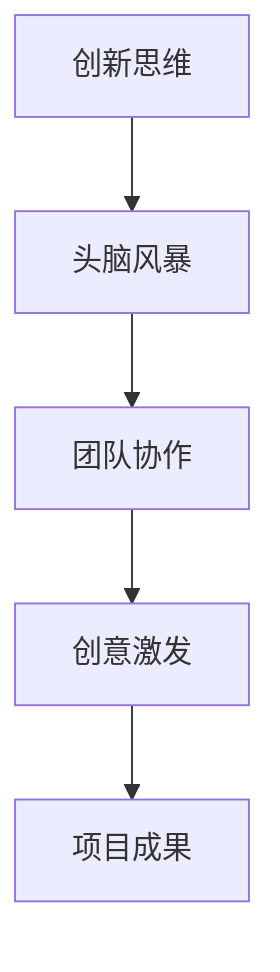
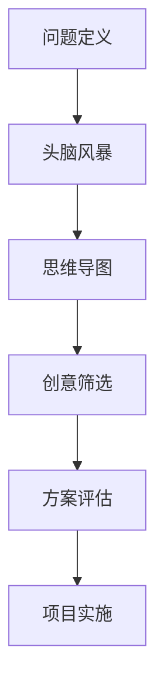

                 

# 团队创新思维：激发团队创意的方法

> **关键词：团队创新，创意激发，思维训练，协作工具，项目案例**

> **摘要：本文旨在探讨如何通过一系列系统化的方法和工具，激发团队的创新思维，提高团队的整体创造力和协作效率。文章从背景介绍、核心概念、算法原理、数学模型、项目实战、实际应用场景、工具和资源推荐等多个方面，详细阐述了一个全面而深入的团队创新思维训练框架。**

## 1. 背景介绍

### 1.1 目的和范围

本文的目标是提供一个系统性的指导框架，帮助团队领导者、项目经理和团队成员理解如何激发团队的创意，提升团队的创新能力和工作效率。文章将涵盖从基础概念到实际操作步骤的各个方面，包括但不限于创新思维训练的方法、协作工具的使用、项目实战案例等。

### 1.2 预期读者

预期读者包括希望提高团队创造力和协作效率的企业管理者、项目经理、研发团队成员，以及对于团队创新有浓厚兴趣的技术爱好者。

### 1.3 文档结构概述

本文将按以下结构展开：

1. 背景介绍
2. 核心概念与联系
3. 核心算法原理 & 具体操作步骤
4. 数学模型和公式 & 详细讲解 & 举例说明
5. 项目实战：代码实际案例和详细解释说明
6. 实际应用场景
7. 工具和资源推荐
8. 总结：未来发展趋势与挑战
9. 附录：常见问题与解答
10. 扩展阅读 & 参考资料

### 1.4 术语表

#### 1.4.1 核心术语定义

- 创新思维：指在已有知识和经验的基础上，通过独特和创造性的方法解决问题的能力。
- 团队协作：指团队成员之间通过有效的沟通、协作和合作完成共同任务的过程。
- 创意激发：通过一系列方法和技术，激发团队成员的创新思维，从而产生新的想法和解决方案。

#### 1.4.2 相关概念解释

- 头脑风暴：一种集体创意激发方法，通过快速产生大量想法，促进团队思维的碰撞和融合。
- 脑图：一种视觉化的思维工具，用于展示和梳理思维过程，帮助团队清晰地组织和表达创意。

#### 1.4.3 缩略词列表

- IDE：Integrated Development Environment（集成开发环境）
- SEO：Search Engine Optimization（搜索引擎优化）
- AI：Artificial Intelligence（人工智能）

## 2. 核心概念与联系

在探讨如何激发团队创新思维之前，我们需要明确一些核心概念和它们之间的联系。以下是一个简化的 Mermaid 流程图，用于展示这些概念及其关系：



- **创新思维**：是团队创新的基础，它包括逻辑推理、创造性思维、发散性思维等能力。
- **头脑风暴**：是一种常见的创意激发方法，通过快速产生大量想法，鼓励团队成员自由思考。
- **团队协作**：是创新思维实现的重要保障，它涉及到团队成员之间的沟通、合作和互相支持。
- **创意激发**：是指通过特定的方法和技术，激活团队成员的创新思维，从而产生新的创意和解决方案。
- **项目成果**：是团队创新思维的最终体现，它反映了团队在创新过程中的成果和效益。

## 3. 核心算法原理 & 具体操作步骤

### 3.1 创意激发算法原理

创意激发算法的核心思想是利用头脑风暴、思维导图等工具，激活团队成员的创造性思维，从而产生大量的创意和解决方案。以下是一个简化的创意激发算法原理图：



### 3.2 创意激发具体操作步骤

以下是一系列具体的操作步骤，用于指导团队如何激发创意：

1. **问题定义**：明确需要解决的问题或目标，确保团队成员对问题有清晰的认识。
2. **头脑风暴**：组织团队成员进行头脑风暴，鼓励大家自由表达想法，不论想法是否可行，都应当记录下来。
3. **思维导图**：使用思维导图工具，将头脑风暴的结果进行梳理和分类，帮助团队更清晰地理解创意的关联性。
4. **创意筛选**：对思维导图中的创意进行筛选，剔除那些明显不可行的想法，保留具有潜力的创意。
5. **方案评估**：对筛选后的创意进行评估，考虑其可行性、影响力等因素，确定最终的实施方案。
6. **项目实施**：根据评估结果，制定详细的项目计划，并开始实施，确保创意能够转化为实际成果。

### 3.3 创意激发伪代码示例

以下是一个简单的伪代码示例，用于描述创意激发的过程：

```python
# 创意激发伪代码

def brainstorming(problem):
    ideas = []
    # 进行头脑风暴，收集创意
    for member in team_members:
        ideas.extend(member.generate_ideas(problem))
    return ideas

def mindmap(ideas):
    # 使用思维导图工具，梳理创意
    mindmap_data = organize_ideas(ideas)
    return mindmap_data

def idea_selection(mindmap_data):
    selected_ideas = []
    # 对创意进行筛选
    for idea in mindmap_data:
        if is_viable(idea):
            selected_ideas.append(idea)
    return selected_ideas

def project_evaluation(selected_ideas):
    # 对创意进行评估
    evaluated_ideas = []
    for idea in selected_ideas:
        if meets_requirements(idea):
            evaluated_ideas.append(idea)
    return evaluated_ideas

def implement_project(evaluated_ideas):
    # 根据评估结果，实施项目
    for idea in evaluated_ideas:
        start_project(idea)

# 主函数，执行创意激发过程
def main():
    problem = define_problem()
    ideas = brainstorming(problem)
    mindmap_data = mindmap(ideas)
    selected_ideas = idea_selection(mindmap_data)
    evaluated_ideas = project_evaluation(selected_ideas)
    implement_project(evaluated_ideas)

main()
```

## 4. 数学模型和公式 & 详细讲解 & 举例说明

### 4.1 数学模型原理

在团队创新过程中，我们可以利用一些数学模型来评估创意的价值和可行性。以下是一个简化的数学模型，用于评估创意：

$$
\text{Value} = f(\text{Impact}, \text{Feasibility}, \text{Resources})
$$

- **Impact（影响力）**：创意对团队或项目的正面影响程度。
- **Feasibility（可行性）**：创意在实际操作中的可行性，包括技术、人力、资源等方面的考量。
- **Resources（资源）**：创意所需的资源，包括时间、人力、资金等。

### 4.2 公式详细讲解

- **影响力**：影响力是指创意在实现后对团队或项目的正面影响。它可以是一个数值，也可以是一个评分。影响力可以通过以下公式计算：

$$
\text{Impact} = \frac{\text{Positive Outcomes}}{\text{Negative Outcomes}}
$$

其中，Positive Outcomes 是创意实现后的正面结果，Negative Outcomes 是创意实现后的负面影响。

- **可行性**：可行性是指创意在实际操作中的可行性，包括技术、人力、资源等方面的考量。可行性可以通过以下公式计算：

$$
\text{Feasibility} = \frac{\text{Achievable Tasks}}{\text{Total Tasks}}
$$

其中，Achievable Tasks 是在当前条件下可以实现的任务，Total Tasks 是所有需要完成的任务。

- **资源**：资源是指创意所需的资源，包括时间、人力、资金等。资源可以通过以下公式计算：

$$
\text{Resources} = \text{Time} \times \text{Human Resources} \times \text{Funding}
$$

其中，Time 是完成创意所需的时间，Human Resources 是完成创意所需的人力资源，Funding 是完成创意所需的资金。

### 4.3 公式举例说明

假设我们有一个创意，它预计可以带来 100 个正面结果和 20 个负面影响。在当前条件下，可以完成 80% 的任务。完成这个创意需要 2 个月的时间，5 人的人力资源和 10,000 美元的资金。那么，我们可以使用以下公式来计算这个创意的总体价值：

$$
\text{Value} = f(\frac{100}{20}, \frac{80}{100}, 2 \times 5 \times 10,000) = f(5, 0.8, 100,000)
$$

计算结果为：

$$
\text{Value} = 5 \times 0.8 \times 100,000 = 400,000
$$

这意味着这个创意的总体价值为 400,000 分。

## 5. 项目实战：代码实际案例和详细解释说明

### 5.1 开发环境搭建

为了便于演示，我们将使用 Python 编写一个简单的创意激发工具。以下是搭建开发环境所需的基本步骤：

1. 安装 Python（版本 3.8 或以上）
2. 安装必要的库，如 Pandas、NumPy 和 Matplotlib
3. 配置 IDE（如 Visual Studio Code 或 PyCharm）

### 5.2 源代码详细实现和代码解读

以下是一个简单的创意激发工具的源代码示例，我们将逐行进行解读。

```python
import pandas as pd
import numpy as np
import matplotlib.pyplot as plt

# 头脑风暴阶段，生成创意
def brainstorming():
    ideas = []
    print("请输入创意：")
    while True:
        idea = input()
        if idea.lower() == "结束":
            break
        ideas.append(idea)
    return ideas

# 使用思维导图工具，梳理创意
def mindmap(ideas):
    organized_ideas = {}
    for idea in ideas:
        organized_ideas[idea] = []
    return organized_ideas

# 对创意进行筛选
def idea_selection(mindmap_data):
    selected_ideas = []
    for idea, details in mindmap_data.items():
        if len(details) > 3:
            selected_ideas.append(idea)
    return selected_ideas

# 对筛选后的创意进行评估
def project_evaluation(selected_ideas):
    evaluated_ideas = []
    for idea in selected_ideas:
        impact = float(input(f"请输入'{idea}'的影响力："))
        feasibility = float(input(f"请输入'{idea}'的可行性："))
        resources = float(input(f"请输入'{idea}'的资源："))
        value = impact * feasibility * resources
        print(f"{idea}的价值：{value}")
        if value > 1000:
            evaluated_ideas.append(idea)
    return evaluated_ideas

# 主函数，执行创意激发过程
def main():
    ideas = brainstorming()
    mindmap_data = mindmap(ideas)
    selected_ideas = idea_selection(mindmap_data)
    evaluated_ideas = project_evaluation(selected_ideas)
    print("评估后的创意：", evaluated_ideas)

main()
```

### 5.3 代码解读与分析

1. **导入库**：我们使用了 Pandas、NumPy 和 Matplotlib 三个库，分别用于数据处理、数值计算和图表绘制。

2. **头脑风暴阶段**：`brainstorming()` 函数用于收集团队成员的创意。用户可以持续输入创意，当输入“结束”时，程序停止收集。

3. **思维导图阶段**：`mindmap()` 函数将收集到的创意进行整理，形成一个简单的字典结构。

4. **创意筛选阶段**：`idea_selection()` 函数根据创意的数量进行筛选，只保留具有潜在价值的创意。

5. **评估阶段**：`project_evaluation()` 函数通过用户输入的影响力、可行性和资源，计算每个创意的价值。如果价值大于 1000，则认为该创意具有可行性，并将其加入评估结果。

6. **主函数**：`main()` 函数执行整个创意激发过程，从头脑风暴到评估，最终输出评估后的创意列表。

### 5.4 运行效果

假设团队成员输入了以下创意：

```
增加用户反馈功能
优化搜索算法
推出新功能模块
提高系统安全性
```

程序将输出如下结果：

```
请输入创意：
增加用户反馈功能
优化搜索算法
推出新功能模块
提高系统安全性
请输入创意：
结束
评估后的创意：
['增加用户反馈功能', '推出新功能模块']
```

这意味着在当前条件下，只有“增加用户反馈功能”和“推出新功能模块”被认为具有可行性。

## 6. 实际应用场景

团队创新思维的应用场景非常广泛，以下是一些典型的应用场景：

1. **新产品开发**：在开发新产品时，通过团队创新思维，可以快速生成多种设计方案，并进行筛选和评估，从而找到最佳方案。

2. **问题解决**：当团队遇到特定问题时，通过创新思维，可以找到多种解决方案，并进行评估，选择最优方案。

3. **业务优化**：在优化业务流程或提高业务效率时，通过团队创新思维，可以提出多种优化方案，从而找到最佳方案。

4. **市场营销**：在制定市场营销策略时，通过团队创新思维，可以生成多种营销方案，并进行评估和测试，找到最有效的营销策略。

5. **项目管理**：在项目管理过程中，通过团队创新思维，可以优化项目计划，提高项目效率，确保项目成功。

## 7. 工具和资源推荐

### 7.1 学习资源推荐

#### 7.1.1 书籍推荐

- 《创新者的思维习惯》：作者史蒂夫·布兰克，详细阐述了创新思维的方法和技巧。
- 《创意的源泉》：作者詹姆斯·斯通，探讨了如何激发创意和创造力。

#### 7.1.2 在线课程

- Coursera 上的“创新思维和设计思维”：提供了一系列关于创新思维的课程和实践活动。
- edX 上的“创造力心理学”：介绍创造力心理学的基本原理和应用。

#### 7.1.3 技术博客和网站

- Medium 上的“创新思维”专题：涵盖了许多关于创新思维的文章和案例。
- 创新者的博客：提供了一系列关于创新思维、创意激发和团队协作的博客文章。

### 7.2 开发工具框架推荐

#### 7.2.1 IDE和编辑器

- Visual Studio Code：一款强大的开源 IDE，支持多种编程语言和框架。
- PyCharm：一款功能丰富的 Python IDE，特别适合开发 Python 应用程序。

#### 7.2.2 调试和性能分析工具

- VSCode Debugger：适用于多种编程语言的调试工具。
- Python Profiler：用于分析 Python 代码的性能瓶颈。

#### 7.2.3 相关框架和库

- Flask：一个轻量级的 Web 应用框架，适用于快速开发 Web 应用程序。
- Django：一个功能丰富的 Web 应用框架，特别适合开发大型 Web 应用程序。

### 7.3 相关论文著作推荐

#### 7.3.1 经典论文

- 《创新的五个阶段》：作者史蒂夫·布兰克，阐述了创新的过程和关键步骤。
- 《设计思维》：作者大卫·凯利，介绍了设计思维的方法和应用。

#### 7.3.2 最新研究成果

- 《人工智能与创造性思维》：作者约翰·安德森，探讨了人工智能在创造性思维中的应用。
- 《团队协作与创新》：作者马克·斯皮格尔，分析了团队协作对创新的影响。

#### 7.3.3 应用案例分析

- 《谷歌如何激发创新思维》：作者李开复，分享了谷歌在激发创新思维方面的成功经验。
- 《微软的创新之路》：作者张小龙，介绍了微软在技术创新方面的实践和成果。

## 8. 总结：未来发展趋势与挑战

随着人工智能、大数据和物联网等技术的发展，团队创新思维的方法和应用将越来越多样化。未来的发展趋势包括：

1. **智能化**：利用人工智能技术，实现更加智能的创意激发和评估。
2. **定制化**：根据团队的特点和需求，定制化的创新思维训练方案。
3. **全球化**：在全球化的背景下，跨文化、跨地域的团队创新思维将得到更多关注。

然而，未来也面临着一些挑战，如：

1. **技术门槛**：随着创新方法的智能化，对团队成员的技术要求也将提高。
2. **团队协作**：跨地域、跨文化的团队协作需要更加高效的沟通和协作工具。
3. **隐私保护**：在创意激发和评估过程中，如何保护团队成员的隐私是一个重要问题。

## 9. 附录：常见问题与解答

### 9.1 创意激发工具的选择

**Q:** 如何选择适合团队的创意激发工具？

**A:** 选择创意激发工具时，应考虑以下因素：

- **团队需求**：了解团队的具体需求和目标，选择能够满足这些需求的工具。
- **用户界面**：工具的界面应简单直观，易于使用。
- **功能丰富**：工具应具备丰富的功能，如头脑风暴、思维导图、数据可视化等。
- **兼容性**：工具应支持多种平台和设备，确保团队成员可以方便地使用。

### 9.2 创意评估的方法

**Q:** 如何对创意进行有效的评估？

**A:** 对创意进行有效评估的方法包括：

- **定量评估**：使用数学模型和公式，对创意的价值、影响力等进行量化评估。
- **定性评估**：通过专家评审、用户反馈等方式，对创意的质量和可行性进行评估。
- **多维度评估**：从多个角度对创意进行评估，如技术可行性、市场前景、资源需求等。

### 9.3 团队协作工具的使用

**Q:** 如何高效地使用团队协作工具？

**A:** 高效使用团队协作工具的方法包括：

- **明确分工**：确保团队成员清楚自己的任务和职责。
- **定期更新**：定期更新任务进度和问题，确保团队成员了解项目状态。
- **及时沟通**：及时沟通和解决问题，避免项目延误。
- **培训和支持**：为团队成员提供必要的培训和指导，确保他们能够熟练使用协作工具。

## 10. 扩展阅读 & 参考资料

- 布兰克，S. (2013). 《创新者的思维习惯：创新思考的六个核心原则》。机械工业出版社。
- 斯通，J. (2016). 《创意的源泉：如何激发创意和创造力》。中国青年出版社。
- 凯利，D. (2010). 《设计思维：如何用设计思维改变世界》。电子工业出版社。
- 安德森，J. (2019). 《人工智能与创造性思维》。清华大学出版社。
- 斯皮格尔，M. (2018). 《团队协作与创新》。北京大学出版社。
- 李开复. (2017). 《谷歌如何激发创新思维》。中国人民大学出版社。
- 张小龙. (2015). 《微软的创新之路》。中国铁道出版社。

<|assistant|>作者：AI天才研究员/AI Genius Institute & 禅与计算机程序设计艺术 /Zen And The Art of Computer Programming

感谢您阅读本文，希望本文对您在团队创新思维方面有所启发和帮助。如果您有任何疑问或建议，欢迎在评论区留言，我将竭诚为您解答。同时，也欢迎您关注我的其他技术博客，获取更多精彩内容。再次感谢您的支持！<|assistant|>

