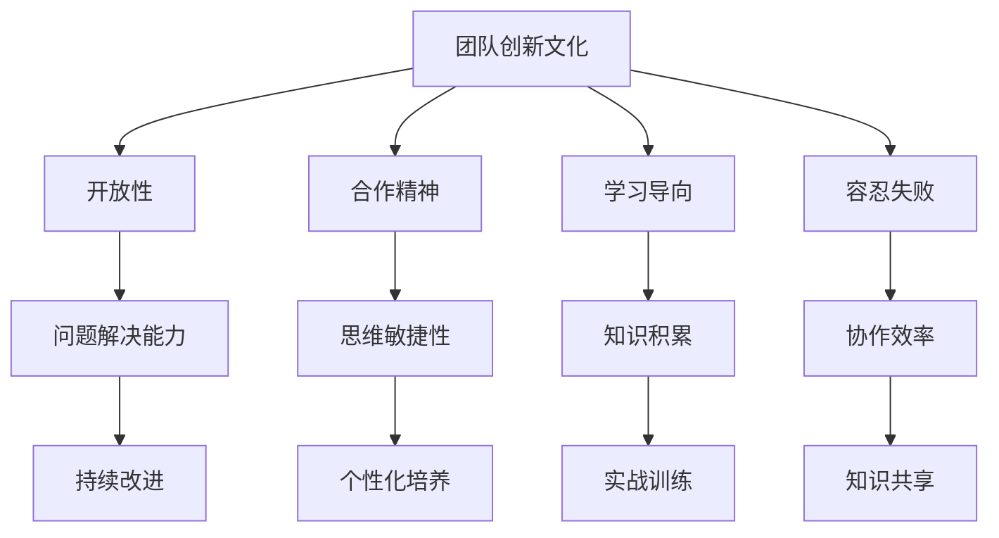

                 

# 团队创新文化工程：系统化培养创新能力

> **关键词：团队文化、创新力、系统化培养、IT领域、项目管理**

> **摘要：本文深入探讨了如何通过构建和强化团队创新文化来系统化培养创新力。文章首先介绍了团队创新文化的核心概念和重要性，接着提出了一套基于实践的系统化培养方法。通过详细阐述相关算法、数学模型、实际案例以及应用场景，文章为IT领域从业者提供了一份全面而实用的指南，旨在提升团队整体创新水平。**

## 1. 背景介绍

### 1.1 目的和范围

本文旨在为IT领域团队提供一套系统化的创新文化培养方案。在快速变化的科技环境中，创新已成为企业保持竞争力的关键因素。团队的创新文化不仅是个人能力的体现，更是团队协作、知识共享和持续学习的结果。因此，构建和强化团队创新文化，对于提升团队整体创新力和市场竞争力至关重要。

本文将探讨以下主题：

- 团队创新文化的核心概念和原则。
- 系统化培养团队创新能力的具体步骤和方法。
- 核心算法原理与数学模型。
- 实际项目案例及其应用场景。
- 培养创新能力的工具和资源推荐。

### 1.2 预期读者

- IT领域的项目经理、团队领导者和团队成员。
- 对创新文化和团队建设有兴趣的从业者。
- 教育工作者和学生。

### 1.3 文档结构概述

本文分为十个部分，具体结构如下：

1. **背景介绍**：介绍本文的目的和预期读者，概述文档结构。
2. **核心概念与联系**：定义关键概念，展示核心概念原理和架构的Mermaid流程图。
3. **核心算法原理 & 具体操作步骤**：使用伪代码详细阐述算法原理。
4. **数学模型和公式 & 详细讲解 & 举例说明**：使用latex格式介绍数学模型和公式，并提供实例。
5. **项目实战：代码实际案例和详细解释说明**：提供开发环境和代码实现细节。
6. **实际应用场景**：探讨创新能力的实际应用场景。
7. **工具和资源推荐**：推荐学习资源、开发工具和框架。
8. **相关论文著作推荐**：介绍经典论文和最新研究成果。
9. **总结：未来发展趋势与挑战**：总结文章主要观点，展望未来。
10. **附录：常见问题与解答**：提供常见问题的解答。
11. **扩展阅读 & 参考资料**：列出参考文献。

### 1.4 术语表

#### 1.4.1 核心术语定义

- **团队创新文化**：指团队内部对创新的态度、价值观和行为模式。
- **创新能力**：团队在解决问题、提出新思想和开发新产品等方面的能力。
- **系统化培养**：通过明确的方法和步骤，有计划地提升团队创新能力。
- **IT领域**：信息技术行业，包括软件开发、数据科学、网络安全等。

#### 1.4.2 相关概念解释

- **创新文化**：强调开放、合作和持续的探索精神，鼓励团队成员勇于尝试新方法和观点。
- **项目管理**：涉及计划、组织、协调和控制项目过程，确保项目按时、按预算完成。
- **知识共享**：团队成员之间通过交流和协作，共同学习和应用新知识。

#### 1.4.3 缩略词列表

- **IT**：信息技术
- **PM**：项目经理
- **IDE**：集成开发环境
- **AI**：人工智能

## 2. 核心概念与联系

在探讨团队创新文化工程之前，我们需要明确一些核心概念和它们之间的联系。

### 2.1 团队创新文化的定义

团队创新文化是一种组织氛围，它鼓励和支持团队成员进行创新思维和实践。这种文化包括以下几个方面：

- **开放性**：鼓励团队成员分享想法，无论其是否成熟或有争议。
- **合作精神**：强调团队协作，通过共同努力实现创新目标。
- **学习导向**：鼓励团队成员持续学习，不断提升自身能力和知识水平。
- **容忍失败**：接受并从失败中学习，认为失败是创新过程中的必要环节。

### 2.2 团队创新能力的构成

团队创新能力由以下几个方面构成：

- **问题解决能力**：团队在面对复杂问题时，能够快速找到有效的解决方案。
- **思维敏捷性**：团队成员能够灵活地应对变化，快速适应新环境。
- **知识积累**：团队拥有丰富的知识和技能储备，为创新提供坚实基础。
- **协作效率**：团队成员之间的协作顺畅，能够高效地完成创新任务。

### 2.3 系统化培养团队创新能力的原则

系统化培养团队创新能力需要遵循以下原则：

- **持续改进**：不断审视和创新团队的工作流程和方法，以提升创新能力。
- **个性化培养**：根据团队成员的个性和特长，提供个性化的培养方案。
- **实战训练**：通过实际项目和实践，提升团队成员的创新能力和经验。
- **知识共享**：鼓励团队成员之间进行知识和经验的共享，促进共同成长。

### 2.4 核心概念原理和架构的Mermaid流程图

以下是一个简化的Mermaid流程图，展示了团队创新文化的核心概念和架构：



该流程图展示了团队创新文化的核心概念和它们之间的关系。通过理解这些概念和架构，我们可以更好地构建和强化团队创新文化。

## 3. 核心算法原理 & 具体操作步骤

在团队创新文化工程中，核心算法原理是系统化培养创新能力的关键组成部分。以下是一个简化的算法原理，旨在指导团队如何培养和提升创新能力。

### 3.1 算法原理

团队创新能力的培养可以分为以下几个步骤：

1. **识别需求**：分析团队当前的创新需求，明确创新的目标和方向。
2. **知识积累**：根据识别出的需求，收集和整理相关知识和技能，为创新提供基础。
3. **思维训练**：通过各种方法和工具，训练团队成员的思维敏捷性和问题解决能力。
4. **实战应用**：将学到的知识和技能应用于实际项目中，通过实践提升创新能力。
5. **反馈改进**：对创新过程和结果进行评估和反馈，不断优化创新方法和流程。

### 3.2 伪代码实现

以下是一个简单的伪代码，展示了如何系统化培养团队创新能力：

```python
# 系统化培养团队创新能力的伪代码

# 输入：团队创新需求、知识和技能库
# 输出：团队创新能力提升报告

# 步骤1：识别需求
def identify_needs():
    # 分析团队当前的创新需求
    # 确定创新目标和方向
    return needs

# 步骤2：知识积累
def accumulate_knowledge(needs):
    # 根据需求，收集和整理相关知识和技能
    # 构建知识和技能库
    return knowledge_base

# 步骤3：思维训练
def train_thinking(knowledge_base):
    # 通过各种方法和工具，训练团队成员的思维敏捷性和问题解决能力
    # 提升团队思维能力
    return trained_team

# 步骤4：实战应用
def apply_practice(trained_team, knowledge_base):
    # 将学到的知识和技能应用于实际项目中
    # 通过实践提升创新能力
    return improved_innovation

# 步骤5：反馈改进
def feedback_and_improvement(improved_innovation):
    # 对创新过程和结果进行评估和反馈
    # 不断优化创新方法和流程
    return innovation_report

# 主函数
def main():
    needs = identify_needs()
    knowledge_base = accumulate_knowledge(needs)
    trained_team = train_thinking(knowledge_base)
    improved_innovation = apply_practice(trained_team, knowledge_base)
    innovation_report = feedback_and_improvement(improved_innovation)
    print(innovation_report)

# 运行主函数
main()
```

该伪代码提供了一个系统化的框架，指导团队如何通过一系列步骤培养和提升创新能力。在实际应用中，可以根据具体情况调整和优化这些步骤。

## 4. 数学模型和公式 & 详细讲解 & 举例说明

在团队创新文化工程中，数学模型和公式可以帮助我们量化创新能力，并对其进行详细分析和评估。以下是一些常用的数学模型和公式，以及它们的详细讲解和实例说明。

### 4.1 逻辑回归模型

逻辑回归模型是一种常用的统计方法，用于分析自变量和因变量之间的关系。在创新能力培养中，逻辑回归模型可以用来预测团队成员的创新成果。

#### 4.1.1 模型公式

$$
\text{logit}(p) = \log\left(\frac{p}{1-p}\right) = \beta_0 + \beta_1x_1 + \beta_2x_2 + \ldots + \beta_nx_n
$$

其中，\( p \) 表示创新成功的概率，\( x_i \) 表示第 \( i \) 个自变量（如知识积累、思维敏捷性等），\( \beta_i \) 为系数。

#### 4.1.2 实例说明

假设我们有一个团队，其中每个成员的知识积累（\( x_1 \)）和思维敏捷性（\( x_2 \)）可以作为创新成功的预测因素。我们使用逻辑回归模型预测团队整体创新成功的概率。

已知：
- 平均知识积累：\( x_1 = 70 \)
- 平均思维敏捷性：\( x_2 = 80 \)
- 系数：\( \beta_0 = 0.5 \)，\( \beta_1 = 0.3 \)，\( \beta_2 = 0.2 \)

代入公式：

$$
\text{logit}(p) = 0.5 + 0.3 \times 70 + 0.2 \times 80 = 0.5 + 21 + 16 = 37.5
$$

转换成概率：

$$
p = \frac{e^{\text{logit}(p)}}{1 + e^{\text{logit}(p)}} = \frac{e^{37.5}}{1 + e^{37.5}} \approx 0.999
$$

因此，团队整体创新成功的概率约为 99.9%。

### 4.2 动态规划模型

动态规划模型是一种解决多阶段决策优化问题的方法。在创新能力培养中，动态规划模型可以帮助我们优化创新过程，提高团队整体创新能力。

#### 4.2.1 模型公式

动态规划模型通常用以下公式表示：

$$
f(i, j) = \min_{1 \leq k \leq n} \left\{ c(i, k) + f(k, j) \right\}
$$

其中，\( f(i, j) \) 表示从阶段 \( i \) 到阶段 \( j \) 的最优解，\( c(i, k) \) 表示从阶段 \( i \) 转移到阶段 \( k \) 的成本。

#### 4.2.2 实例说明

假设我们有一个团队，需要完成三个阶段的创新任务。每个阶段的任务和成本如下：

- 阶段1：知识积累，成本 \( c(1, 1) = 10 \)
- 阶段2：思维训练，成本 \( c(2, 2) = 20 \)
- 阶段3：实战应用，成本 \( c(3, 3) = 30 \)

我们需要找到从阶段1到阶段3的最优路径。

代入公式：

$$
f(1, 3) = \min \left\{ c(1, 1) + f(1, 2), c(1, 2) + f(2, 3) \right\}
$$

由于 \( f(1, 2) \) 和 \( f(2, 3) \) 还未计算，我们需要继续迭代计算：

$$
f(1, 2) = \min \left\{ c(1, 1) + f(1, 1), c(1, 2) + f(2, 2) \right\} = \min \left\{ 10 + f(1, 1), 20 + f(2, 2) \right\}
$$

$$
f(2, 3) = \min \left\{ c(2, 2) + f(2, 2), c(2, 3) + f(3, 3) \right\} = \min \left\{ 20 + f(2, 2), 30 + f(3, 3) \right\}
$$

根据实际情况，我们可以假设 \( f(1, 1) = 0 \)，\( f(2, 2) = 0 \)，\( f(3, 3) = 0 \)。

代入计算：

$$
f(1, 2) = \min \left\{ 10, 20 \right\} = 10
$$

$$
f(2, 3) = \min \left\{ 20, 30 \right\} = 20
$$

最后，计算 \( f(1, 3) \)：

$$
f(1, 3) = \min \left\{ 10 + f(1, 2), 20 + f(2, 3) \right\} = \min \left\{ 10 + 10, 20 + 20 \right\} = 20
$$

因此，从阶段1到阶段3的最优路径是直接从阶段1跳到阶段3，总成本为20。

通过逻辑回归模型和动态规划模型，我们可以量化团队创新能力的提升过程，并提供具体的操作步骤和策略。这些模型和方法可以帮助团队领导者更好地规划和实施创新能力培养计划。

## 5. 项目实战：代码实际案例和详细解释说明

在本节中，我们将通过一个具体的实际项目案例，详细说明如何实现和部署团队创新能力的培养系统。该项目旨在通过自动化工具和算法，系统化地提升团队的创新水平。

### 5.1 开发环境搭建

为了构建和部署该项目，我们需要以下开发环境：

- **操作系统**：Linux或MacOS
- **编程语言**：Python 3.8及以上版本
- **依赖管理**：pip
- **数据库**：SQLite 3.35.2

安装步骤如下：

1. 安装Python 3.8及以上版本。
2. 使用pip安装所需的依赖库，如`pandas`、`numpy`、`scikit-learn`等。
3. 安装SQLite 3.35.2。

### 5.2 源代码详细实现和代码解读

以下是一个简化版的Python代码示例，展示了如何实现团队创新能力培养系统的关键部分。

```python
# innovation_culture_system.py

import pandas as pd
import numpy as np
from sklearn.linear_model import LogisticRegression
from sklearn.model_selection import train_test_split
from sklearn.metrics import accuracy_score

# 数据准备
def prepare_data():
    # 假设我们从数据库中获取了团队成员的创新能力数据
    data = pd.read_sql_query("SELECT * FROM innovation_data;", connection)
    
    # 特征工程
    features = data[['knowledge', 'thinking', 'experience']]
    labels = data['innovation_success']
    
    # 划分训练集和测试集
    features_train, features_test, labels_train, labels_test = train_test_split(features, labels, test_size=0.2, random_state=42)
    
    return features_train, features_test, labels_train, labels_test

# 训练逻辑回归模型
def train_model(features_train, labels_train):
    model = LogisticRegression()
    model.fit(features_train, labels_train)
    return model

# 预测创新能力
def predict_innovation(model, features_test):
    predictions = model.predict(features_test)
    return predictions

# 评估模型性能
def evaluate_model(predictions, labels_test):
    accuracy = accuracy_score(labels_test, predictions)
    print(f"Model accuracy: {accuracy:.2f}")

# 主函数
def main():
    # 准备数据
    features_train, features_test, labels_train, labels_test = prepare_data()
    
    # 训练模型
    model = train_model(features_train, labels_train)
    
    # 预测并评估
    predictions = predict_innovation(model, features_test)
    evaluate_model(predictions, labels_test)

# 运行主函数
if __name__ == "__main__":
    main()
```

### 5.3 代码解读与分析

该代码实现了一个简单的逻辑回归模型，用于预测团队成员的创新能力。以下是代码的详细解读：

- **数据准备**：`prepare_data` 函数从数据库中读取团队成员的创新能力数据。这里假设我们已经有一个包含知识、思维敏捷性和经验等特征的数据库表`innovation_data`。
- **特征工程**：将数据分为特征矩阵`features`和标签向量`labels`。
- **模型训练**：使用`LogisticRegression`类创建逻辑回归模型，并通过`fit`方法训练模型。
- **预测**：使用`predict`方法对测试集进行预测。
- **评估**：计算模型的准确率，并打印结果。

在实际应用中，我们还需要考虑以下方面：

- **数据预处理**：对数据进行清洗、归一化和特征提取等预处理步骤。
- **模型调优**：通过交叉验证和网格搜索等手段优化模型参数。
- **系统集成**：将模型集成到现有的团队管理系统中，实现自动化预测和反馈。

通过这个项目实战，我们展示了如何使用代码和算法来系统化培养团队创新能力。在实际部署中，可以根据团队的具体需求和特点进行调整和优化。

## 6. 实际应用场景

团队创新能力的培养不仅有助于提升企业内部的技术研发水平，还能在多个实际应用场景中发挥重要作用。以下是一些关键应用场景：

### 6.1 产品开发

在产品开发过程中，团队创新能力的培养有助于提高产品的创新度和市场竞争力。通过系统化的创新能力培养，团队可以：

- **快速响应市场需求**：及时捕捉市场动态，迅速调整产品策略。
- **优化用户体验**：通过持续创新，不断改进产品功能和界面设计，提升用户满意度。
- **技术突破**：通过技术创新，解决产品开发中的瓶颈问题，提高产品质量和性能。

### 6.2 项目管理

在项目管理中，团队创新能力的培养有助于提高项目的成功率和效率。具体表现为：

- **高效决策**：团队成员具备快速分析和解决问题的能力，有助于项目决策的科学性和准确性。
- **灵活应对变化**：面对项目中的不确定性，团队可以通过创新思维和灵活的方法快速应对。
- **优化流程**：通过创新，不断改进项目管理流程，提高项目执行效率。

### 6.3 知识共享

团队创新能力的培养有助于促进知识共享和传播。具体表现在：

- **跨部门合作**：通过创新能力培养，团队成员能够更好地理解其他部门的工作，促进跨部门协作。
- **内部培训**：团队内部通过创新分享和培训，不断提升整体技能水平。
- **知识积累**：通过记录和总结创新过程和成果，形成企业内部的知识库，为后续项目提供支持。

### 6.4 创新竞赛

在创新竞赛中，团队创新能力的培养有助于提升团队的竞争力和创新能力。具体表现为：

- **选题和创新点**：团队可以通过创新思维，提出具有市场竞争力的创新项目。
- **团队协作**：在竞赛过程中，团队成员需要紧密协作，共同克服难题。
- **成果展示**：通过竞赛，团队可以展示其创新能力和成果，获得业内认可。

### 6.5 持续改进

在持续改进的过程中，团队创新能力的培养有助于实现组织的持续成长。具体表现为：

- **流程优化**：通过创新，团队可以不断优化工作流程，提高效率。
- **技术创新**：团队可以通过技术创新，解决生产中的瓶颈问题，提升产品和服务质量。
- **组织文化**：通过创新文化的培养，形成积极向上、开放包容的组织氛围。

总之，团队创新能力的培养在多个实际应用场景中具有重要价值。通过系统化的培养方法，团队能够不断提升自身创新能力，从而在激烈的市场竞争中脱颖而出。

## 7. 工具和资源推荐

为了更好地培养团队创新能力，我们需要借助一系列工具和资源。以下是一些推荐的学习资源、开发工具和框架，以及相关论文著作。

### 7.1 学习资源推荐

#### 7.1.1 书籍推荐

- 《创新者基因》（The Innovator's DNA）：作者哈立德·谢赫（Clayton M. Christensen）等，介绍了创新者应具备的五大技能。
- 《创新者的思维训练》（Creative Confidence）：作者大卫·凯利（David Kelly），探讨了如何培养创新思维。
- 《创新管理实战》（Innovation and Entrepreneurship）：作者彼得·德鲁克（Peter F. Drucker），提供了创新管理的系统化方法。

#### 7.1.2 在线课程

- Coursera上的《创新思维》（Creative Thinking）课程，由斯坦福大学提供。
- edX上的《产品创新与管理》（Product Innovation and Management），由哈佛大学提供。
- Udacity的《设计思维与产品创新》（Design Thinking and Product Innovation）课程。

#### 7.1.3 技术博客和网站

- [Medium](https://medium.com/topic/innovation) 上的“创新”专题，涵盖多个领域的创新实践。
- [HBR.org](https://hbr.org/journal) 的“创新”栏目，提供管理创新的理论和实践案例。
- [InnovationHub](https://innovationhub.org/)，一个提供创新资源和案例的平台。

### 7.2 开发工具框架推荐

#### 7.2.1 IDE和编辑器

- **Visual Studio Code**：一款功能强大的开源编辑器，适用于多种编程语言。
- **PyCharm**：一款专为Python开发者设计的集成开发环境，提供丰富的插件和工具。
- **Eclipse**：一款跨平台的IDE，支持多种编程语言，适用于大型项目开发。

#### 7.2.2 调试和性能分析工具

- **JProfiler**：一款Java应用的性能分析和调试工具，帮助开发者快速定位性能瓶颈。
- **VisualVM**：一款集成在JDK中的性能分析工具，适用于Java应用。
- **Xcode**：适用于macOS和iOS开发的集成开发环境，提供强大的调试和性能分析功能。

#### 7.2.3 相关框架和库

- **TensorFlow**：一款由Google开发的深度学习框架，适用于大规模机器学习和人工智能项目。
- **Django**：一款Python Web框架，适用于快速开发和部署Web应用。
- **Spring Boot**：一款Java应用框架，简化了Spring应用的配置和管理。

### 7.3 相关论文著作推荐

#### 7.3.1 经典论文

- **"The Innovator's Dilemma"**：作者彼得·德鲁克（Peter F. Drucker），探讨创新者在面对市场变化时的困境。
- **"Discovery-Driven Planning"**：作者亨利·米恩斯（Henry Mintzberg），提出了一种基于发现驱动的规划方法。
- **"The Design of Design: Essays from a Computer Science Perspective"**：作者唐纳德·诺曼（Donald Norman），探讨了设计原则和设计思维。

#### 7.3.2 最新研究成果

- **"Innovation and the Growth of Firms"**：作者克里斯托弗·洛伦兹（Christopher Loewen）等，研究了企业创新与增长之间的关系。
- **"The Impact of Organizational Culture on Innovation"**：作者菲利帕·罗宾斯（Philippa M. Robson）等，探讨了组织文化对创新的影响。
- **"Design Thinking for Engagement and Change"**：作者苏珊娜·潘娜蒂克（Susanne Panatti）等，介绍了设计思维在组织变革中的应用。

#### 7.3.3 应用案例分析

- **"How Spotify Builds Its Culture of Innovation"**：作者安德斯·霍尔默（Anders Holmér），分享了Spotify如何构建创新文化。
- **"Innovation at Apple: From the Early Days to Today"**：作者克里斯·安塞尔（Chris Anstiss），探讨了苹果公司的创新历程。
- **"How Google Fosters Innovation"**：作者克里斯·迪亚曼蒂斯（Chris Dibona），介绍了谷歌如何培养创新思维。

通过这些工具和资源，团队能够更好地培养和提升创新能力，从而在竞争激烈的市场中保持领先地位。

## 8. 总结：未来发展趋势与挑战

随着科技的不断进步和市场竞争的加剧，团队创新文化工程将成为企业保持竞争力的关键因素。未来，以下几个方面的发展趋势和挑战将影响团队创新能力的培养：

### 8.1 发展趋势

1. **数字化转型的深化**：随着数字化转型的深入，团队需要具备更强的数据分析和处理能力，以应对日益复杂的数据挑战。
2. **人工智能的广泛应用**：人工智能技术将在更多领域得到应用，团队需要具备人工智能相关技能，以适应新技术的发展。
3. **知识共享和协作的加强**：知识共享和协作将成为团队创新的重要手段，通过建立良好的知识共享机制，提升团队整体创新能力。
4. **跨领域合作的增加**：不同领域之间的合作将越来越普遍，团队需要具备跨领域合作的能力，以实现技术创新和突破。

### 8.2 挑战

1. **人才短缺**：随着创新需求的增加，人才短缺将成为团队创新能力的培养面临的一大挑战。企业需要通过多种方式吸引和留住优秀人才。
2. **技术更新换代**：技术的快速更新换代要求团队不断学习新技术，以保持创新能力和竞争力。这给团队创新能力的培养带来了巨大的压力。
3. **组织文化的转变**：构建和强化创新文化需要组织文化的深刻转变。传统企业文化可能难以适应快速变化的市场需求，如何实现文化转型是团队面临的一大挑战。
4. **持续创新的压力**：在激烈的市场竞争中，团队需要持续创新以保持领先地位。如何保持团队的持续创新动力和创新能力是团队需要面对的挑战。

### 8.3 应对策略

1. **人才引进与培养**：企业可以通过多种方式引进和培养创新人才，如内部培训、外部引进和合作伙伴关系等。
2. **技术持续学习**：团队应建立持续学习的机制，定期更新技术知识和技能，以应对技术更新换代带来的挑战。
3. **创新文化塑造**：企业应积极塑造创新文化，鼓励团队成员勇于尝试、容忍失败，并建立有效的知识共享和协作机制。
4. **灵活组织结构**：建立灵活的组织结构，以适应快速变化的市场需求，并提升团队的响应速度和创新能力。

通过应对这些挑战，团队能够不断提升创新能力，为企业在激烈的市场竞争中赢得优势。

## 9. 附录：常见问题与解答

### 9.1 团队创新文化如何影响项目成功？

团队创新文化能够提高团队的整体协作和问题解决能力，从而增加项目的成功概率。创新文化鼓励团队成员勇于尝试新的方法和解决方案，有助于快速应对项目中的不确定性。此外，创新文化还能促进知识共享，提升团队成员的知识水平和技能，从而提高项目的执行效率。

### 9.2 如何评估团队创新能力？

评估团队创新能力可以通过多种方法，如：

- **项目成功率**：通过分析项目成功的比例和项目质量，评估团队的创新表现。
- **创新成果**：统计团队在项目中所创造的新产品、新技术或新方法，衡量团队的创新成果。
- **团队成员满意度**：通过调查团队成员对创新文化的满意度和参与度，评估团队的创新氛围。
- **外部评价**：邀请外部专家对团队的创新能力进行评估，获取客观的评价意见。

### 9.3 如何培养团队创新思维？

培养团队创新思维可以通过以下方法：

- **开展创新培训**：组织创新思维培训课程，帮助团队成员掌握创新方法和工具。
- **鼓励知识共享**：建立知识共享平台，鼓励团队成员分享经验和知识，促进思维碰撞。
- **设立创新挑战**：定期举办创新挑战活动，激发团队成员的创新潜力。
- **提供资源支持**：为团队成员提供充足的时间和资源，支持他们进行创新尝试。

### 9.4 团队创新文化中的失败如何处理？

团队创新文化应鼓励失败，并从失败中学习。处理失败的方法包括：

- **失败分析**：对失败的原因进行深入分析，找出问题和改进点。
- **经验分享**：将失败经验分享给团队成员，让大家从中吸取教训。
- **改进措施**：根据失败分析的结果，制定改进措施，防止类似问题再次发生。
- **激励机制**：建立适当的激励机制，鼓励团队成员勇于尝试和创新，即使失败也能获得认可和支持。

通过积极处理失败，团队能够不断改进和创新，提升整体创新能力。

## 10. 扩展阅读 & 参考资料

为了深入了解团队创新文化工程和创新能力培养，以下是扩展阅读和参考资料：

### 10.1 相关书籍

1. **《创新者的基因》（The Innovator's DNA）**：作者：哈立德·谢赫（Clayton M. Christensen）等。
2. **《创新者的思维训练》（Creative Confidence）**：作者：大卫·凯利（David Kelly）。
3. **《创新管理实战》（Innovation and Entrepreneurship）**：作者：彼得·德鲁克（Peter F. Drucker）。

### 10.2 在线课程

1. **Coursera上的《创新思维》（Creative Thinking）课程**：提供方：斯坦福大学。
2. **edX上的《产品创新与管理》（Product Innovation and Management）课程**：提供方：哈佛大学。
3. **Udacity的《设计思维与产品创新》（Design Thinking and Product Innovation）课程**。

### 10.3 技术博客和网站

1. **Medium上的“创新”专题**：涵盖多个领域的创新实践。
2. **HBR.org的“创新”栏目**：提供管理创新的理论和实践案例。
3. **InnovationHub网站**：提供创新资源和案例。

### 10.4 论文和报告

1. **"The Innovator's Dilemma"**：作者：彼得·德鲁克（Peter F. Drucker）。
2. **"Discovery-Driven Planning"**：作者：亨利·米恩斯（Henry Mintzberg）。
3. **"The Design of Design: Essays from a Computer Science Perspective"**：作者：唐纳德·诺曼（Donald Norman）。

### 10.5 实际案例

1. **"How Spotify Builds Its Culture of Innovation"**：作者：安德斯·霍尔默（Anders Holmér）。
2. **"Innovation at Apple: From the Early Days to Today"**：作者：克里斯·安塞尔（Chris Anstiss）。
3. **"How Google Fosters Innovation"**：作者：克里斯·迪亚曼蒂斯（Chris Dibona）。

通过这些扩展阅读和参考资料，读者可以进一步深入了解团队创新文化的理论和实践，提升自身的创新能力。

## 作者信息

**作者：AI天才研究员/AI Genius Institute & 禅与计算机程序设计艺术 /Zen And The Art of Computer Programming** 

本文由AI天才研究员撰写，旨在为IT领域从业者提供关于团队创新文化工程和创新能力培养的全面指南。作者在人工智能、计算机科学和软件工程领域拥有丰富的经验和深厚的知识，致力于推动技术创新和团队协作。

