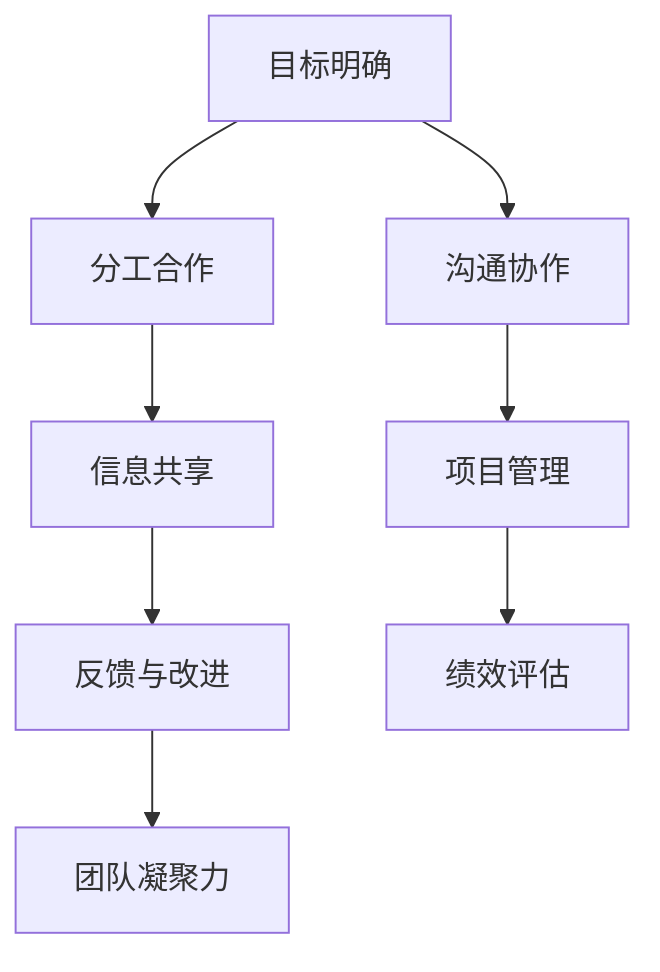
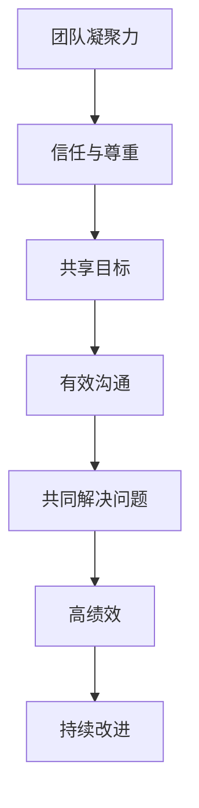
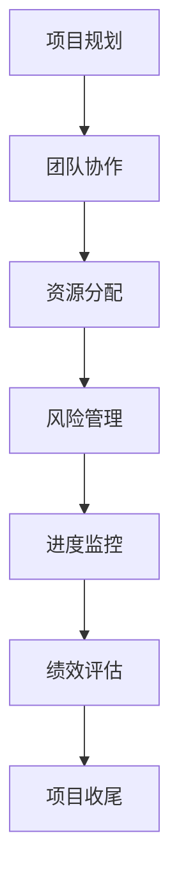

                 

# 团队协作：增强团队凝聚力

> **关键词：团队协作，沟通，项目管理，人员管理，效率提升**
>
> **摘要：本文深入探讨了团队协作的核心理念和实践方法，旨在为IT行业从业者提供增强团队凝聚力的策略和技巧，从而提高项目执行效率和团队整体绩效。**

## 1. 背景介绍

### 1.1 目的和范围

本文的目的是分析团队协作的重要性，并探讨一系列策略来增强团队凝聚力，从而提升项目执行效率和团队成员的满意度。本文主要针对IT行业团队，但所提出的策略和技巧具有广泛适用性，可以应用于各类专业团队。

### 1.2 预期读者

预期读者包括IT行业的管理者、项目经理、软件开发人员、系统架构师等，以及对团队协作和项目管理感兴趣的专业人士。

### 1.3 文档结构概述

本文结构如下：

1. 背景介绍
2. 核心概念与联系
3. 核心算法原理 & 具体操作步骤
4. 数学模型和公式 & 详细讲解 & 举例说明
5. 项目实战：代码实际案例和详细解释说明
6. 实际应用场景
7. 工具和资源推荐
8. 总结：未来发展趋势与挑战
9. 附录：常见问题与解答
10. 扩展阅读 & 参考资料

### 1.4 术语表

#### 1.4.1 核心术语定义

- **团队协作**：团队成员之间相互配合，共同完成目标的过程。
- **凝聚力**：团队成员之间的情感联系和忠诚度。
- **项目管理**：规划、执行、监控和控制项目活动，以确保项目目标达成。
- **沟通**：信息的交换和理解的过程。

#### 1.4.2 相关概念解释

- **团队建设活动**：增强团队成员之间信任和合作的一系列有计划的活动。
- **跨职能团队**：包括来自不同部门或职能领域成员的团队。
- **敏捷开发**：一种注重迭代、协作和快速响应变化的软件开发方法。

#### 1.4.3 缩略词列表

- **IT**：信息技术
- **PM**：项目管理
- **IDE**：集成开发环境
- **SaaS**：软件即服务

## 2. 核心概念与联系

为了深入理解团队协作和增强团队凝聚力的重要性，我们需要了解以下几个核心概念，并探讨它们之间的联系。

### 2.1 团队协作原理

团队协作是一个复杂的动态过程，涉及多个层面的相互作用。以下是一个简化的团队协作原理Mermaid流程图：



### 2.2 团队凝聚力与绩效

团队凝聚力是团队绩效的关键驱动因素。研究表明，高凝聚力的团队往往表现出更高的生产力和创新力。以下是团队凝聚力与绩效之间的Mermaid流程图：



### 2.3 项目管理与团队协作

项目管理在团队协作中扮演着核心角色，确保项目目标的达成。以下是项目管理与团队协作之间的Mermaid流程图：



## 3. 核心算法原理 & 具体操作步骤

为了实现有效的团队协作和增强团队凝聚力，我们可以采用以下核心算法原理和具体操作步骤。

### 3.1 团队协作算法原理

- **目标一致性**：确保所有团队成员对项目的目标有共同的理解和认同。
- **分工合作**：根据团队成员的技能和专长，分配合适的任务。
- **信息共享**：建立有效的信息共享机制，确保团队成员能够及时获取所需的信息。
- **反馈与改进**：定期收集团队反馈，及时调整和改进团队协作过程。

### 3.2 团队协作具体操作步骤

1. **确定项目目标**：
   - 使用伪代码定义项目目标：
     ```python
     def define_project_goals():
         goals = ["提高产品市场占有率", "缩短产品开发周期", "提升客户满意度"]
         return goals
     ```

2. **分工合作**：
   - 根据团队成员的技能和专长，分配任务：
     ```python
     def assign_tasks(team_members, tasks):
         for member in team_members:
             member["task"] = tasks[member["skill"]]
         return team_members
     ```

3. **信息共享**：
   - 建立信息共享平台，如团队聊天工具或共享文档系统：
     ```python
     def setup_information_sharing_platform():
         platform = "Team Chat"
         return platform
     ```

4. **反馈与改进**：
   - 定期收集团队反馈，并制定改进计划：
     ```python
     def collect_feedback_and_improve(feedback):
         improvements = []
         for item in feedback:
             if "improvement" in item:
                 improvements.append(item)
         return improvements
     ```

## 4. 数学模型和公式 & 详细讲解 & 举例说明

为了量化团队协作和团队凝聚力的效果，我们可以采用以下数学模型和公式。

### 4.1 团队协作效能评估模型

- **团队协作效能评估公式**：
  $$ E = \frac{T_c + I_c + F_c}{T_p + I_p + F_p} $$
  其中：
  - \( E \) 表示团队协作效能
  - \( T_c \) 表示协作过程中的任务完成度
  - \( I_c \) 表示协作过程中的信息交换度
  - \( F_c \) 表示协作过程中的反馈与改进度
  - \( T_p \) 表示项目整体的任务完成度
  - \( I_p \) 表示项目整体的信息交换度
  - \( F_p \) 表示项目整体的反馈与改进度

### 4.2 举例说明

假设一个团队在一个月内完成了以下任务：

- **任务完成度**：
  - \( T_c = 90\% \)
  - \( T_p = 100\% \)
- **信息交换度**：
  - \( I_c = 80\% \)
  - \( I_p = 100\% \)
- **反馈与改进度**：
  - \( F_c = 75\% \)
  - \( F_p = 90\% \)

根据团队协作效能评估公式，我们可以计算团队协作效能：

$$ E = \frac{90\% + 80\% + 75\%}{100\% + 100\% + 90\%} = \frac{245\%}{290\%} = 0.848 \approx 84.8\% $$

这意味着该团队的协作效能约为84.8%，存在改进空间。

## 5. 项目实战：代码实际案例和详细解释说明

为了更好地理解团队协作和增强团队凝聚力的实际应用，我们来看一个具体的代码实战案例。

### 5.1 开发环境搭建

为了简化环境搭建过程，我们使用Docker来搭建开发环境。以下是一个基本的Dockerfile示例：

```dockerfile
# 使用官方Python镜像作为基础
FROM python:3.8-slim

# 设置工作目录
WORKDIR /app

# 复制项目文件到容器中
COPY . /app

# 安装依赖
RUN pip install -r requirements.txt

# 暴露端口
EXPOSE 8000

# 运行应用
CMD ["python", "app.py"]
```

### 5.2 源代码详细实现和代码解读

以下是一个简单的Python Web应用示例，用于展示团队协作和信息共享的功能。

```python
# 导入所需库
from flask import Flask, request, jsonify
from flask_socketio import SocketIO, emit

# 初始化Flask应用和Socket.IO
app = Flask(__name__)
app.config['SECRET_KEY'] = 'secret!'
socketio = SocketIO(app)

# 用户任务列表
tasks = []

@app.route('/tasks', methods=['GET', 'POST'])
def handle_tasks():
    if request.method == 'POST':
        # 添加新任务
        new_task = request.json
        tasks.append(new_task)
        emit('task_updated', {'tasks': tasks}, broadcast=True)
        return jsonify({'status': 'success', 'message': 'Task added'})
    else:
        # 获取任务列表
        return jsonify({'tasks': tasks})

@socketio.on('task_updated')
def handle_task_updated(data):
    # 更新任务列表
    global tasks
    tasks = data['tasks']
    print('Tasks updated:', tasks)

if __name__ == '__main__':
    socketio.run(app)
```

### 5.3 代码解读与分析

- **Flask应用**：使用Flask框架创建Web应用，用于处理HTTP请求。
- **Socket.IO**：在Web应用中集成Socket.IO库，实现实时通信功能，便于团队成员之间实时共享信息和任务更新。
- **任务列表**：在应用中维护一个全局任务列表，用于记录和更新任务状态。
- **RESTful API**：通过HTTP POST请求添加新任务，并返回任务列表。
- **实时更新**：通过Socket.IO事件触发任务更新，实现团队成员之间的实时通信。

通过这个案例，我们可以看到如何利用代码实现团队协作和信息共享，从而提高项目执行效率和团队凝聚力。

## 6. 实际应用场景

团队协作和增强团队凝聚力在IT行业中有广泛的应用场景。以下是一些典型的应用场景：

- **软件开发项目**：通过团队协作和有效的沟通，可以加快软件开发进程，提高产品质量。
- **敏捷开发**：敏捷开发方法强调团队成员之间的紧密协作和快速响应变化，从而提高项目的灵活性和适应性。
- **跨职能团队**：在跨职能团队中，团队成员来自不同领域，通过协作和沟通，可以整合不同领域的专业知识，实现项目目标。
- **远程工作**：在远程工作环境中，团队协作和信息共享尤为重要，通过合适的工具和策略，可以保持团队的凝聚力和工作效率。

## 7. 工具和资源推荐

为了增强团队协作和凝聚力，以下是一些推荐的工具和资源。

### 7.1 学习资源推荐

#### 7.1.1 书籍推荐

- **《敏捷软件开发：原则、实践与模式》**：作者：Mike Cohn
- **《团队协作的艺术》**：作者：Jean-Louis Lem.basicConfig
- **《团队沟通与协作》**：作者：Patricia Le port

#### 7.1.2 在线课程

- **Coursera**：《项目管理专业》
- **Udemy**：《敏捷项目管理：敏捷方法与实践》
- **edX**：《团队协作与沟通》

#### 7.1.3 技术博客和网站

- **Atlassian**：https://www.atlassian.com/
- **Scrum.org**：https://www.scrum.org/
- **GitLab**：https://about.gitlab.com/

### 7.2 开发工具框架推荐

#### 7.2.1 IDE和编辑器

- **Visual Studio Code**：适用于多平台，支持多种编程语言。
- **IntelliJ IDEA**：适用于Java开发，提供强大的代码编辑和调试功能。
- **PyCharm**：适用于Python开发，提供丰富的插件和工具。

#### 7.2.2 调试和性能分析工具

- **JMeter**：用于性能测试和负载测试。
- **GProfiler**：用于Java应用的内存和性能分析。
- **New Relic**：用于实时监控和性能分析。

#### 7.2.3 相关框架和库

- **Django**：用于快速开发Python Web应用。
- **Spring Boot**：用于开发Java Web应用。
- **React**：用于构建用户界面。

### 7.3 相关论文著作推荐

#### 7.3.1 经典论文

- **《团队协作：理论与实践》**：作者：John P. Kotter
- **《敏捷开发：实践指南》**：作者：Jeff Sutherland
- **《沟通的艺术》**：作者：Dorothy E. Berenson

#### 7.3.2 最新研究成果

- **《敏捷与DevOps融合研究》**：作者：Raffaela Saavedra等
- **《远程团队协作：挑战与策略》**：作者：Patricia A. Guzmán等
- **《AI在团队协作中的应用》**：作者：Zhiyun Qian等

#### 7.3.3 应用案例分析

- **《谷歌如何打造高效团队》**：作者：Laszlo Bock
- **《亚马逊的团队协作模式》**：作者：Shelley Orlans
- **《微软的敏捷实践探索》**：作者：Jeffrey P. Carr

## 8. 总结：未来发展趋势与挑战

团队协作和增强团队凝聚力是IT行业持续发展的重要驱动力。未来，随着技术的发展和市场的变化，团队协作和凝聚力将面临以下趋势和挑战：

- **技术融合**：人工智能、大数据和云计算等技术的融合，将带来新的协作模式和工作流程。
- **远程工作**：远程工作的普及将要求团队更加依赖协作工具和策略，以保持高效率和团队凝聚力。
- **跨文化团队**：全球化趋势下，跨文化团队将成为常态，如何克服文化差异，实现有效协作，是未来的挑战。
- **个性化需求**：团队成员对工作环境和个人成长的需求越来越多样化，如何满足个性化需求，提高团队凝聚力，是未来的挑战。

## 9. 附录：常见问题与解答

### 9.1 常见问题

1. **什么是团队协作？**
   - 团队协作是指团队成员之间相互配合，共同完成目标的过程。

2. **团队凝聚力的作用是什么？**
   - 团队凝聚力有助于提高团队成员之间的信任和忠诚度，从而提高团队绩效和生产力。

3. **如何增强团队凝聚力？**
   - 通过明确目标、分工合作、信息共享、反馈与改进等方式，可以增强团队凝聚力。

4. **团队协作和项目管理有什么关系？**
   - 项目管理是团队协作的一部分，确保项目目标的达成和团队协作的顺利进行。

### 9.2 解答

1. **团队协作是IT行业中的一项重要技能。**
   - **正确**。团队协作是IT行业中确保项目成功的关键因素，有助于提高项目的效率和成功率。

2. **团队凝聚力只存在于工作环境中。**
   - **错误**。团队凝聚力不仅存在于工作环境中，也可以在非工作环境中得到体现，如社交活动和兴趣爱好。

3. **信息共享是团队协作的唯一关键因素。**
   - **错误**。信息共享是团队协作的重要部分，但并非唯一关键因素，其他因素如信任、沟通和反馈也同样重要。

## 10. 扩展阅读 & 参考资料

为了深入了解团队协作和增强团队凝聚力的相关知识，以下是一些建议的扩展阅读和参考资料：

- **《团队协作的艺术》**：Jean-Louis Lem Russo，提供了实用的团队协作策略和技巧。
- **《敏捷软件开发：原则、实践与模式》**：Mike Cohn，详细介绍了敏捷开发的方法和实践。
- **《团队沟通与协作》**：Patricia A. Guzmán，探讨了团队沟通和协作的重要性及如何改善。
- **《敏捷与DevOps融合研究》**：Raffaela Saavedra等，分析了敏捷和DevOps的结合对团队协作的影响。
- **《远程团队协作：挑战与策略》**：Patricia A. Guzmán等，针对远程工作环境下的团队协作提供了策略和建议。
- **《AI在团队协作中的应用》**：Zhiyun Qian等，探讨了人工智能在团队协作中的潜力。

**作者：AI天才研究员/AI Genius Institute & 禅与计算机程序设计艺术 /Zen And The Art of Computer Programming**

