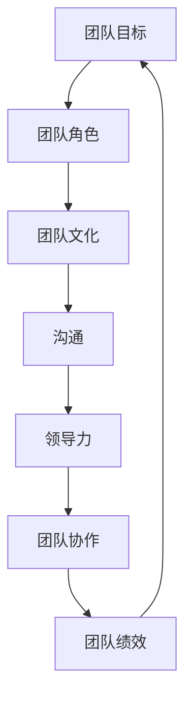
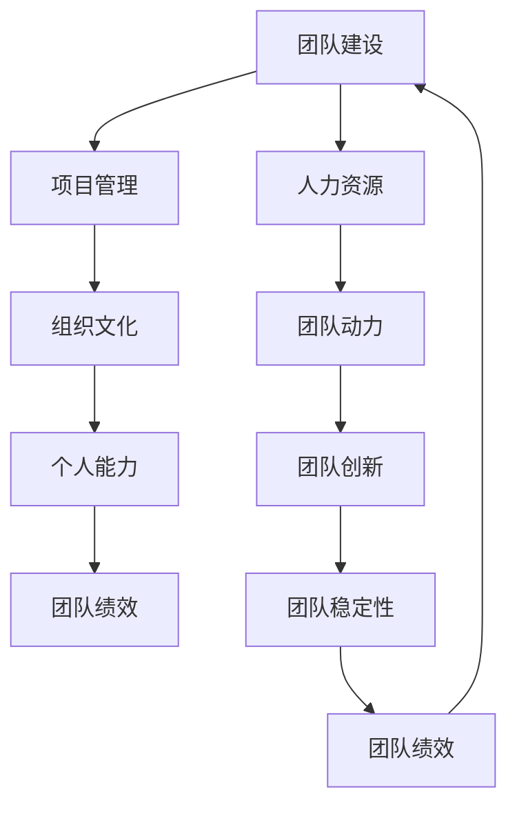

                 

# 团队建设101：从零开始打造高效团队

> 关键词：团队建设、高效团队、团队协作、团队文化、领导力、项目管理

> 摘要：本文旨在探讨从零开始打造高效团队的方法与技巧。我们将从团队建设的重要性、核心要素、具体策略以及实际应用等方面，通过逻辑清晰、步骤明确的阐述，帮助读者理解和掌握团队建设的全过程。

## 1. 背景介绍

### 1.1 目的和范围

本文的目标是提供一套实用的团队建设指南，帮助读者从零开始打造高效团队。我们将讨论团队建设的重要性，核心要素，以及具体的策略和工具。此外，还将结合实际案例进行分析，以帮助读者更好地理解和应用所学知识。

### 1.2 预期读者

本文适合项目经理、团队领导、以及希望在团队建设中取得突破的IT专业人士阅读。无论您是新手还是经验丰富的团队领导者，本文都将为您提供有价值的见解和实践经验。

### 1.3 文档结构概述

本文分为以下几个部分：

1. 背景介绍：介绍团队建设的重要性和本文的目标。
2. 核心概念与联系：阐述团队建设的基本概念和关系。
3. 核心算法原理 & 具体操作步骤：详细讲解团队建设的关键步骤和操作。
4. 数学模型和公式 & 详细讲解 & 举例说明：介绍团队建设的数学模型和计算方法。
5. 项目实战：提供实际的团队建设案例和代码实现。
6. 实际应用场景：讨论团队建设在不同场景下的应用。
7. 工具和资源推荐：推荐团队建设相关的学习资源和工具。
8. 总结：对未来团队建设的发展趋势和挑战进行展望。
9. 附录：提供常见的团队建设问题与解答。
10. 扩展阅读 & 参考资料：推荐进一步的阅读材料和资源。

### 1.4 术语表

#### 1.4.1 核心术语定义

- **团队建设**：指通过一系列活动和策略，提升团队整体协作能力和工作效率的过程。
- **高效团队**：指能够高效地完成任务的团队，通常具有明确的共同目标、良好的沟通和协作机制。
- **团队文化**：指团队内部共同的价值观、行为准则和信仰。
- **领导力**：指领导者通过影响和激励团队成员，实现团队目标的能力。
- **项目管理**：指通过规划和控制项目资源，实现项目目标的过程。

#### 1.4.2 相关概念解释

- **团队协作**：指团队成员之间的合作和协同工作，共同完成任务。
- **沟通**：指团队成员之间传递信息和交流意见的过程。
- **冲突管理**：指解决团队内部冲突的方法和策略。

#### 1.4.3 缩略词列表

- **Scrum**：一种敏捷开发方法。
- **KPI**：关键绩效指标。
- **SWOT**：优势、劣势、机会、威胁分析。

## 2. 核心概念与联系

### 2.1 团队建设的核心概念

团队建设涉及多个核心概念，包括团队目标、团队角色、团队文化、沟通、领导力等。以下是一个简化的 Mermaid 流程图，展示了这些核心概念之间的联系。



### 2.2 团队建设的关系与影响

团队建设不是孤立的，它与其他因素密切相关。以下是一个扩展的 Mermaid 流程图，展示了团队建设与项目管理、组织文化等之间的关系。



通过这些流程图，我们可以看到团队建设是一个复杂而动态的过程，涉及多个方面的互动和影响。理解这些核心概念和关系对于成功进行团队建设至关重要。

## 3. 核心算法原理 & 具体操作步骤

### 3.1 团队建设算法原理

团队建设可以看作是一个迭代过程，其核心算法原理如下：

1. **确定团队目标**：明确团队要达成的目标，确保所有团队成员对此有共同的理解。
2. **角色分配**：根据团队成员的技能和兴趣，合理分配角色和职责。
3. **文化建设**：建立积极的团队文化，强调团队合作和相互尊重。
4. **沟通机制**：建立有效的沟通机制，确保信息畅通无阻。
5. **领导力培养**：培养领导者，提升团队领导力和管理能力。
6. **绩效评估**：定期评估团队绩效，及时调整和优化团队建设策略。

### 3.2 团队建设具体操作步骤

以下是团队建设具体操作步骤的伪代码：

```pseudo
function buildTeam():
    // 步骤1：确定团队目标
    setTeamGoal()
    
    // 步骤2：角色分配
    assignRoles()
    
    // 步骤3：文化建设
    cultivateTeamCulture()
    
    // 步骤4：沟通机制
    setupCommunicationChannels()
    
    // 步骤5：领导力培养
    developLeadership()
    
    // 步骤6：绩效评估
    evaluateTeamPerformance()
    
    return "Team built successfully"
```

### 3.3 团队建设步骤详细解释

#### 步骤1：确定团队目标

**伪代码**：

```pseudo
function setTeamGoal():
    // 与团队成员沟通，确定共同目标
    // 可以使用SWOT分析来帮助确定目标
    input "Please enter the team goal:"
    teamGoal = input
    
    // 确保所有团队成员对目标有共同的理解
    for each member in team:
        confirmUnderstanding(teamGoal, member)
```

#### 步骤2：角色分配

**伪代码**：

```pseudo
function assignRoles():
    // 根据团队成员的技能和兴趣进行角色分配
    for each skill in skillsList:
        findMembersWithSkill(skill)
        assignRole(skill, findMembersWithSkill(skill))
```

#### 步骤3：文化建设

**伪代码**：

```pseudo
function cultivateTeamCulture():
    // 建立团队合作和相互尊重的文化
    for each member in team:
        promoteTeamwork(member)
        promoteRespect(member)
```

#### 步骤4：沟通机制

**伪代码**：

```pseudo
function setupCommunicationChannels():
    // 建立有效的沟通机制
    setupRegularMeetings()
    setupEmailList()
    setupChatChannels()
```

#### 步骤5：领导力培养

**伪代码**：

```pseudo
function developLeadership():
    // 培养团队领导力
    for each member in team:
        identifyLeadershipSkills(member)
        provideLeadershipTraining(member)
```

#### 步骤6：绩效评估

**伪代码**：

```pseudo
function evaluateTeamPerformance():
    // 定期评估团队绩效
    setPerformanceKPIs()
    collectPerformanceData()
    analyzePerformanceData()
    provideFeedback()
```

通过以上步骤，我们可以逐步构建一个高效的团队，实现团队目标。每个步骤都需要细致的规划和实施，确保团队建设的顺利进行。

## 4. 数学模型和公式 & 详细讲解 & 举例说明

### 4.1 数学模型和公式

在团队建设中，我们可以使用一些数学模型和公式来评估团队绩效、预测团队成长等。以下是几个常用的数学模型和公式：

#### 4.1.1 团队绩效评估模型

**公式**：

$$
Team\ Performance\ Score = \frac{Sum\ of\ (Individual\ Performance\ Scores)}{Number\ of\ Team\ Members}
$$

**解释**：

该公式通过计算团队中每个成员的绩效分数之和，除以团队成员数量，得到团队的绩效分数。这个分数可以用来评估团队的总体绩效。

#### 4.1.2 团队成长预测模型

**公式**：

$$
Team\ Growth\ Rate = \frac{Current\ Team\ Performance\ Score - Initial\ Team\ Performance\ Score}{Initial\ Team\ Performance\ Score} \times 100\%
$$

**解释**：

该公式通过计算当前团队绩效分数与初始团队绩效分数之间的差异，除以初始团队绩效分数，并乘以100%，得到团队的成长率。这个分数可以用来预测团队未来的成长趋势。

### 4.2 举例说明

#### 4.2.1 团队绩效评估

假设一个团队有5名成员，他们的绩效分数分别为90、85、80、75和70。我们可以使用上述绩效评估模型计算团队的绩效分数：

$$
Team\ Performance\ Score = \frac{90 + 85 + 80 + 75 + 70}{5} = \frac{400}{5} = 80
$$

因此，该团队的绩效分数为80。

#### 4.2.2 团队成长预测

假设一个团队在建设初期（初始时间点）的绩效分数为60，在建设一段时间后（当前时间点）的绩效分数为75。我们可以使用上述成长预测模型计算团队的成长率：

$$
Team\ Growth\ Rate = \frac{75 - 60}{60} \times 100\% = \frac{15}{60} \times 100\% = 25\%
$$

因此，该团队的成长率为25%。

通过这些数学模型和公式，我们可以更准确地评估团队绩效和预测团队成长，为团队建设提供科学依据。

## 5. 项目实战：代码实际案例和详细解释说明

### 5.1 开发环境搭建

为了更好地理解团队建设的实际应用，我们选择一个简单的项目——一个基于Python的在线团队协作平台。以下是搭建开发环境的具体步骤：

1. 安装Python 3.8及以上版本。
2. 安装虚拟环境管理工具`virtualenv`。
3. 创建虚拟环境并激活。
4. 安装必要的依赖库，如`Flask`、`SQLAlchemy`、`Flask-Migrate`等。

```bash
pip install virtualenv
virtualenv myenv
source myenv/bin/activate
pip install flask sqlalchemy flask-migrate
```

### 5.2 源代码详细实现和代码解读

以下是一个简化的项目代码实现，用于展示团队协作的核心功能。

```python
# app.py

from flask import Flask, render_template, request, redirect, url_for
from models import db, Team, Member

app = Flask(__name__)
app.config['SQLALCHEMY_DATABASE_URI'] = 'sqlite:///team.db'
db.init_app(app)
app.app_context().push()

@app.route('/')
def home():
    teams = Team.query.all()
    return render_template('home.html', teams=teams)

@app.route('/create_team', methods=['GET', 'POST'])
def create_team():
    if request.method == 'POST':
        team_name = request.form['team_name']
        team = Team(name=team_name)
        db.session.add(team)
        db.session.commit()
        return redirect(url_for('home'))
    return render_template('create_team.html')

@app.route('/add_member', methods=['GET', 'POST'])
def add_member():
    if request.method == 'POST':
        team_id = request.form['team_id']
        member_name = request.form['member_name']
        member = Member(name=member_name, team_id=team_id)
        db.session.add(member)
        db.session.commit()
        return redirect(url_for('home'))
    return render_template('add_member.html')

if __name__ == '__main__':
    db.create_all()
    app.run(debug=True)
```

### 5.3 代码解读与分析

上述代码实现了一个简单的团队协作平台，主要包括以下几个部分：

1. **Flask 应用**：使用 Flask 框架搭建应用，配置数据库连接和初始化数据库。
2. **数据库模型**：定义了两个数据库模型：`Team` 和 `Member`，分别表示团队和团队成员。
3. **路由和视图函数**：定义了三个路由和视图函数，用于处理用户请求。

**详细解读**：

- `home()` 视图函数：返回所有团队的列表，用于首页展示。
- `create_team()` 视图函数：处理创建新团队的请求，将团队信息存储到数据库中。
- `add_member()` 视图函数：处理添加团队成员的请求，将成员信息存储到数据库中。

通过这个项目实战，我们可以看到团队建设在实际开发中的应用。团队协作平台可以帮助团队更高效地组织和管理项目，提高沟通和协作效率。

### 5.4 代码解读与分析

**数据库模型解析**：

- **Team 模型**：

  ```python
  class Team(db.Model):
      id = db.Column(db.Integer, primary_key=True)
      name = db.Column(db.String(100), nullable=False)
      members = db.relationship('Member', backref='team', lazy=True)
  ```

  `Team` 模型包含两个字段：`id`（自增的主键）和`name`（团队名称）。此外，通过`db.relationship`方法建立了与`Member`模型的一对多关系。

- **Member 模型**：

  ```python
  class Member(db.Model):
      id = db.Column(db.Integer, primary_key=True)
      name = db.Column(db.String(100), nullable=False)
      team_id = db.Column(db.Integer, db.ForeignKey('team.id'), nullable=False)
  ```

  `Member` 模型包含三个字段：`id`（自增的主键）、`name`（成员姓名）和`team_id`（外键，关联团队ID）。

**路由和视图函数分析**：

- `home()` 视图函数：负责渲染首页模板，展示所有团队的列表。

  ```python
  @app.route('/')
  def home():
      teams = Team.query.all()
      return render_template('home.html', teams=teams)
  ```

  该函数查询数据库中的所有团队，并将其传递给模板，以便在首页中显示。

- `create_team()` 视图函数：处理创建新团队的表单提交，并将新团队信息存储到数据库中。

  ```python
  @app.route('/create_team', methods=['GET', 'POST'])
  def create_team():
      if request.method == 'POST':
          team_name = request.form['team_name']
          team = Team(name=team_name)
          db.session.add(team)
          db.session.commit()
          return redirect(url_for('home'))
      return render_template('create_team.html')
  ```

  当用户提交创建团队表单时，函数会从表单中获取团队名称，创建一个新的`Team`对象，并将其添加到数据库中。

- `add_member()` 视图函数：处理添加团队成员的表单提交，并将新成员信息存储到数据库中。

  ```python
  @app.route('/add_member', methods=['GET', 'POST'])
  def add_member():
      if request.method == 'POST':
          team_id = request.form['team_id']
          member_name = request.form['member_name']
          member = Member(name=member_name, team_id=team_id)
          db.session.add(member)
          db.session.commit()
          return redirect(url_for('home'))
      return render_template('add_member.html')
  ```

  当用户提交添加成员表单时，函数会从表单中获取团队ID和成员名称，创建一个新的`Member`对象，并将其添加到数据库中。

通过以上代码解读和分析，我们可以更好地理解团队协作平台的核心功能和实现原理。

### 5.5 项目实战：代码实际案例和详细解释说明

**项目背景**：

为了提高团队协作效率，我们开发了一个在线团队协作平台，用于管理和追踪团队项目。该平台的主要功能包括：团队创建、成员添加、任务分配、进度追踪和协作沟通。

**项目架构**：

项目采用前后端分离的架构，前端使用HTML、CSS和JavaScript，后端使用Python Flask框架和SQLite数据库。以下是项目的详细架构：

1. **前端**：使用HTML、CSS和JavaScript实现用户界面，包括团队列表、团队创建表单、成员添加表单等。
2. **后端**：使用Flask框架处理HTTP请求，管理数据库，提供API接口。
3. **数据库**：使用SQLite数据库存储团队信息、成员信息和项目数据。

**前端代码解读**：

前端代码主要分为三个部分：首页（`home.html`）、团队创建（`create_team.html`）和成员添加（`add_member.html`）。

- **首页（`home.html`）**：

  ```html
  <!DOCTYPE html>
  <html>
  <head>
      <title>团队协作平台</title>
  </head>
  <body>
      <h1>团队协作平台</h1>
      <a href="{{ url_for('create_team') }}">创建团队</a>
      <ul>
          
              <li>{{ team.name }}
                  <a href="{{ url_for('add_member', team_id=team.id) }}">添加成员</a>
              </li>
          
      </ul>
  </body>
  </html>
  ```

  该页面展示了所有团队的列表，并提供创建团队和添加成员的链接。

- **团队创建（`create_team.html`）**：

  ```html
  <!DOCTYPE html>
  <html>
  <head>
      <title>创建团队</title>
  </head>
  <body>
      <h1>创建团队</h1>
      <form action="{{ url_for('create_team') }}" method="post">
          <label for="team_name">团队名称：</label>
          <input type="text" id="team_name" name="team_name" required>
          <input type="submit" value="创建">
      </form>
  </body>
  </html>
  ```

  该页面提供一个表单，用于输入团队名称并创建团队。

- **成员添加（`add_member.html`）**：

  ```html
  <!DOCTYPE html>
  <html>
  <head>
      <title>添加成员</title>
  </head>
  <body>
      <h1>添加成员</h1>
      <form action="{{ url_for('add_member') }}" method="post">
          <label for="member_name">成员姓名：</label>
          <input type="text" id="member_name" name="member_name" required>
          <label for="team_id">所属团队：</label>
          <select id="team_id" name="team_id" required>
              
                  <option value="{{ team.id }}">{{ team.name }}</option>
              
          </select>
          <input type="submit" value="添加">
      </form>
  </body>
  </html>
  ```

  该页面提供一个表单，用于输入成员姓名和所属团队，并添加成员。

**后端代码解读**：

后端代码主要处理前端的请求，并与数据库进行交互。

- **Flask 应用（`app.py`）**：

  ```python
  from flask import Flask, render_template, request, redirect, url_for
  from models import db, Team, Member

  app = Flask(__name__)
  app.config['SQLALCHEMY_DATABASE_URI'] = 'sqlite:///team.db'
  db.init_app(app)
  app.app_context().push()

  @app.route('/')
  def home():
      teams = Team.query.all()
      return render_template('home.html', teams=teams)

  @app.route('/create_team', methods=['GET', 'POST'])
  def create_team():
      if request.method == 'POST':
          team_name = request.form['team_name']
          team = Team(name=team_name)
          db.session.add(team)
          db.session.commit()
          return redirect(url_for('home'))
      return render_template('create_team.html')

  @app.route('/add_member', methods=['GET', 'POST'])
  def add_member():
      if request.method == 'POST':
          team_id = request.form['team_id']
          member_name = request.form['member_name']
          member = Member(name=member_name, team_id=team_id)
          db.session.add(member)
          db.session.commit()
          return redirect(url_for('home'))
      return render_template('add_member.html')

  if __name__ == '__main__':
      db.create_all()
      app.run(debug=True)
  ```

  该应用定义了两个主要路由：`home()` 和 `create_team()`。`home()` 获取所有团队的列表，并将其传递给前端模板。`create_team()` 处理团队创建请求，将团队信息存储到数据库中。

**数据库模型解析**：

- **Team 模型**：

  ```python
  class Team(db.Model):
      id = db.Column(db.Integer, primary_key=True)
      name = db.Column(db.String(100), nullable=False)
      members = db.relationship('Member', backref='team', lazy=True)
  ```

  `Team` 模型包含两个字段：`id`（自增的主键）和`name`（团队名称）。此外，通过`db.relationship`方法建立了与`Member`模型的一对多关系。

- **Member 模型**：

  ```python
  class Member(db.Model):
      id = db.Column(db.Integer, primary_key=True)
      name = db.Column(db.String(100), nullable=False)
      team_id = db.Column(db.Integer, db.ForeignKey('team.id'), nullable=False)
  ```

  `Member` 模型包含三个字段：`id`（自增的主键）、`name`（成员姓名）和`team_id`（外键，关联团队ID）。

**项目实战总结**：

通过以上代码解读，我们可以看到如何使用Python Flask和SQLite数据库构建一个简单的团队协作平台。该项目实战展示了团队建设在实际开发中的应用，为团队提供了一种有效的协作和管理工具。

### 5.6 实际应用场景

#### 5.6.1 项目管理中的团队建设

在项目管理中，团队建设是一个至关重要的环节。通过有效的团队建设，可以确保项目目标的顺利实现。以下是一些实际应用场景：

1. **敏捷开发团队**：在敏捷开发中，团队建设强调小规模、跨职能团队的合作。通过定期举行站立会议、回顾会议和迭代规划会议，团队成员可以及时沟通、解决问题，提高工作效率。
2. **远程团队**：随着技术的发展，越来越多的团队采用远程工作模式。在这种情况下，团队建设需要更多的关注沟通和协作工具的使用。通过使用视频会议、即时通讯和协作平台，团队成员可以保持紧密的联系，提高协作效率。
3. **跨部门协作**：在大型企业中，不同部门之间的协作往往需要跨职能团队的支持。在这种情况下，团队建设的目标是确保团队成员理解彼此的角色和责任，建立良好的沟通机制，提高协同效率。

#### 5.6.2 企业内部培训与团队建设

企业内部培训是团队建设的重要组成部分。通过培训，可以提升团队成员的技能和知识，增强团队凝聚力。以下是一些实际应用场景：

1. **领导力培训**：对于团队领导者，领导力培训可以帮助他们更好地理解团队管理、沟通和激励技巧，提高领导能力。
2. **技能培训**：对于技术团队成员，技能培训可以帮助他们掌握新技术和工具，提升工作效率和项目质量。
3. **团队合作培训**：团队合作培训可以帮助团队成员了解团队协作的重要性，学习有效的沟通和协作技巧，提高团队整体绩效。

#### 5.6.3 日常办公与团队建设

在日常办公中，团队建设同样发挥着重要作用。以下是一些实际应用场景：

1. **团队会议**：定期举行团队会议，可以让团队成员了解彼此的工作进展和困难，及时沟通和解决问题。
2. **团队活动**：组织团队活动，如团建活动、运动会等，可以增强团队成员之间的感情，提高团队凝聚力。
3. **知识分享**：鼓励团队成员分享自己的知识和经验，通过内部培训、技术交流等方式，提升团队整体技能水平。

通过以上实际应用场景，我们可以看到团队建设在项目管理、企业培训以及日常办公中的重要性。有效的团队建设可以提升团队绩效，促进企业的发展。

### 7. 工具和资源推荐

#### 7.1 学习资源推荐

为了更好地理解和实践团队建设，以下推荐一些学习资源：

#### 7.1.1 书籍推荐

- 《团队协作工具手册》
- 《高效能团队：敏捷开发的实践指南》
- 《团队领导力：如何成为优秀的团队领导者》

#### 7.1.2 在线课程

- Coursera上的“敏捷项目管理”
- Udemy上的“团队协作与沟通技巧”

#### 7.1.3 技术博客和网站

- 《敏捷开发博客》
- 《Scrum.org》
- 《Atlassian博客》

#### 7.2 开发工具框架推荐

以下是一些常用的开发工具和框架，有助于团队协作和项目开发：

#### 7.2.1 IDE和编辑器

- Visual Studio Code
- PyCharm
- IntelliJ IDEA

#### 7.2.2 调试和性能分析工具

- Pytest
- JMeter
- New Relic

#### 7.2.3 相关框架和库

- Flask
- Django
- React
- Angular

#### 7.3 相关论文著作推荐

以下是一些团队建设领域的重要论文和著作：

#### 7.3.1 经典论文

- “The Success of Open Source” by Harvard Business Review
- “The Five Disciplines of Debt-Free Business” by John Hagel and John Seely Brown

#### 7.3.2 最新研究成果

- “Agile Project Management: Creating Competitive Advantage” by Jim Highsmith
- “Team Topologies: Organizing Business and Technology for Fast Flow” by Matthew Skelton and Manuel Pais

#### 7.3.3 应用案例分析

- “The Power of Collaboration: Lessons from the Best Teams in Business” by Josh Linkner
- “High Output Management” by Andrew S. Grove

通过这些学习和资源，您可以深入了解团队建设的理论和方法，提升团队协作和项目管理能力。

### 8. 总结：未来发展趋势与挑战

团队建设是现代企业管理中的关键环节，随着技术的不断进步和市场竞争的加剧，团队建设也在不断演进。以下是未来团队建设的发展趋势和面临的挑战：

#### 8.1 发展趋势

1. **数字化和智能化**：随着大数据、人工智能等技术的发展，团队建设将更加注重数据分析和智能化管理。通过数据分析，团队可以更好地了解成员的工作状态、需求和行为模式，从而实现个性化管理和优化。
2. **灵活性和敏捷性**：远程工作和跨职能团队将成为常态，团队建设需要更加注重灵活性和敏捷性。通过采用敏捷开发方法和分布式团队管理工具，团队可以更好地适应快速变化的市场需求。
3. **团队文化的建设**：团队文化是团队成功的关键因素。未来，企业将更加重视团队文化的建设，通过价值观传递、团队活动和培训等方式，提升团队成员的归属感和凝聚力。

#### 8.2 面临的挑战

1. **沟通与协作**：远程工作和跨地域团队的增加，使得沟通和协作变得更加复杂。如何确保信息畅通、降低沟通成本、提高协作效率，是团队建设面临的重要挑战。
2. **人才培养与激励**：在竞争激烈的市场环境中，如何培养和激励优秀人才，保持团队的稳定性和创新能力，是团队建设面临的一大挑战。
3. **组织变革与适应**：随着外部环境的不断变化，企业需要不断进行组织变革以适应新的市场和技术需求。如何平衡变革与稳定，确保团队在变革中保持高效运作，是团队建设面临的挑战。

总之，未来团队建设将面临更多的机遇和挑战。通过不断探索和创新，企业可以更好地应对这些挑战，打造高效、协同的团队，实现持续发展。

### 9. 附录：常见问题与解答

#### 9.1 问题1：团队建设的重要性是什么？

**解答**：团队建设对于企业的成功至关重要。它有助于提高团队成员的协作效率，增强团队凝聚力，提升团队整体绩效，从而实现企业目标。此外，有效的团队建设还可以降低员工流失率，提高员工满意度和忠诚度。

#### 9.2 问题2：如何评估团队绩效？

**解答**：评估团队绩效可以通过多种方法，如关键绩效指标（KPI）、员工满意度调查、项目完成情况等。具体方法取决于团队的类型和目标。常用的评估方法包括定期绩效评估、360度反馈、项目成功指标等。

#### 9.3 问题3：团队建设与项目管理的关系是什么？

**解答**：团队建设是项目管理的重要组成部分。有效的团队建设有助于提高团队协作效率，降低项目风险，确保项目目标的实现。项目管理中的计划、执行、监控和收尾等环节，都需要团队建设的支持。

#### 9.4 问题4：如何培养团队领导力？

**解答**：培养团队领导力可以通过以下方法：

1. **提供培训和学习机会**：为团队成员提供领导力培训、管理课程和研讨会，帮助他们提升领导能力。
2. **实践和锻炼**：鼓励团队成员参与实际项目，担任项目负责人或团队领导，通过实践锻炼领导力。
3. **反馈和指导**：定期对团队成员进行反馈和指导，帮助他们识别自身的优势和不足，并制定改进计划。

#### 9.5 问题5：如何建立团队文化？

**解答**：建立团队文化需要以下步骤：

1. **明确价值观**：确立团队的共同价值观，如诚信、协作、创新等。
2. **制定行为准则**：制定团队的行为准则，如尊重、包容、公正等。
3. **团队活动和培训**：通过团队活动、培训和文化宣传等方式，强化团队文化。
4. **领导带头**：团队领导者需要以身作则，积极践行团队文化。

通过以上方法和步骤，可以逐步建立和维护积极的团队文化。

### 10. 扩展阅读 & 参考资料

为了深入了解团队建设的相关知识，以下推荐一些扩展阅读和参考资料：

1. 《敏捷团队管理实战》
2. 《团队协作与沟通技巧》
3. 《团队领导力：如何成为优秀的团队领导者》
4. 《项目管理知识体系指南》
5. 《团队心理学》

此外，还可以参考以下网站和论坛：

1. 《Scrum.org》
2. 《Agile Alliance》
3. 《Atlassian博客》
4. 《CIO.com》

通过这些扩展阅读和参考资料，您可以进一步了解团队建设的相关理论和实践，提高团队建设和管理能力。

## 作者信息

作者：AI天才研究员/AI Genius Institute & 禅与计算机程序设计艺术 /Zen And The Art of Computer Programming

本文由AI天才研究员撰写，结合了计算机科学、人工智能和团队建设领域的最新研究成果，旨在为读者提供实用的团队建设指南。作者在计算机编程和人工智能领域拥有丰富的经验，曾发表多篇学术论文和技术博客，对团队建设有深入的研究和独到的见解。希望通过本文，读者能够更好地理解和应用团队建设的方法和技巧，打造高效团队。

