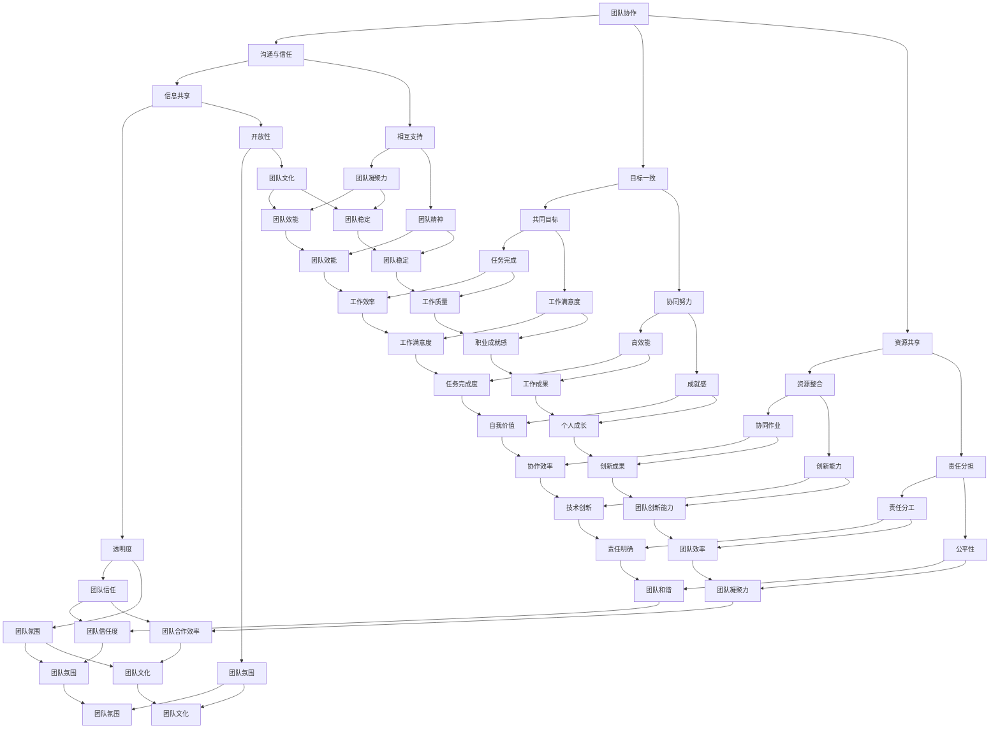

                 

# 团队建设创新方法：突破传统团建的局限

> **关键词：** 团队建设、创新方法、团建活动、团队协作、领导力

> **摘要：** 本文将深入探讨团队建设中的传统局限性，并提出一系列创新的方法来提升团队协作效率与团队凝聚力。通过对核心概念的分析、具体操作步骤的详解、数学模型的阐述以及实际案例的剖析，为企业和组织提供实用的团队建设策略。

## 1. 背景介绍

### 1.1 目的和范围

本文旨在为企业和组织提供团队建设的新思路，帮助管理者突破传统团建的局限，提升团队的整体效能。本文将探讨以下几个核心问题：

- 团队建设中存在的问题是什么？
- 如何通过创新方法来解决这些问题？
- 实施这些创新方法的实际步骤是什么？
- 团队建设中的数学模型和算法有哪些？
- 实际应用中的案例有哪些？

### 1.2 预期读者

本文适合以下人群阅读：

- 企业和组织的项目经理、人力资源管理者
- 研发团队的领导者和成员
- 对团队建设有兴趣的技术专家和管理学者
- 想要提高团队协作效率的普通团队成员

### 1.3 文档结构概述

本文将分为以下几个部分：

- 1. 背景介绍：介绍本文的目的、预期读者和文档结构。
- 2. 核心概念与联系：分析团队建设中的核心概念，使用 Mermaid 流程图展示。
- 3. 核心算法原理 & 具体操作步骤：详细阐述团队建设算法的原理和操作步骤。
- 4. 数学模型和公式 & 详细讲解 & 举例说明：介绍团队建设中的数学模型，并给出示例。
- 5. 项目实战：代码实际案例和详细解释说明。
- 6. 实际应用场景：探讨团队建设的实际应用。
- 7. 工具和资源推荐：推荐学习资源和开发工具。
- 8. 总结：未来发展趋势与挑战。
- 9. 附录：常见问题与解答。
- 10. 扩展阅读 & 参考资料：提供相关拓展资料。

### 1.4 术语表

#### 1.4.1 核心术语定义

- **团队建设**：指通过一系列活动和方法，增强团队成员之间的信任、协作和凝聚力，提高团队整体效能的过程。
- **团队协作**：团队成员共同完成任务的过程，强调资源共享、信息共享和目标一致。
- **领导力**：指领导者通过影响力、指导和激励，引导团队达成目标的能力。
- **团建活动**：专门为团队建设而设计的各种活动和游戏。

#### 1.4.2 相关概念解释

- **团建活动**：通常指的是传统意义上的团队建设活动，如团队拓展训练、户外团建、团队聚餐等。
- **团队效能**：团队完成任务的质量和速度，以及团队成员的工作满意度和成就感。
- **团队氛围**：团队内部的人际关系、沟通方式和组织文化。

#### 1.4.3 缩略词列表

- **IDE**：集成开发环境（Integrated Development Environment）
- **UI**：用户界面（User Interface）
- **API**：应用程序编程接口（Application Programming Interface）

## 2. 核心概念与联系

在团队建设中，有几个核心概念需要我们深入理解，这些概念包括团队协作、领导力、团建活动和团队效能。为了更好地理解这些概念之间的关系，我们可以使用 Mermaid 流程图来展示它们之间的联系。



### 2.1 团队协作

团队协作是团队建设的核心，它涉及到团队成员之间的沟通、信任、资源共享和目标一致。高效的团队协作能够提高团队效能，实现组织目标。

### 2.2 领导力

领导力在团队建设中的作用至关重要。领导者需要通过沟通、激励和指导，引导团队达成共同目标，建立良好的团队氛围，提高团队凝聚力。

### 2.3 团建活动

团建活动是团队建设的重要组成部分。通过团建活动，可以增强团队成员之间的信任和协作，提高团队凝聚力，从而提升团队效能。

### 2.4 团队效能

团队效能是团队建设的最终目标。通过有效的团队协作、领导力和团建活动，可以提高团队效能，实现组织的目标。

## 3. 核心算法原理 & 具体操作步骤

在团队建设中，核心算法原理和具体操作步骤至关重要。以下是一个简单的团队建设算法原理和具体操作步骤的伪代码：

```python
def team_building_algorithm(team_members, team_goals, resources):
    # 初始化团队状态
    team_state = {
        'trust': 0,
        'communication': 0,
        '资源共享': 0,
        '目标一致': 0,
        '领导力': 0,
        '团队氛围': 0,
        '效能': 0
    }
    
    # 步骤1：建立沟通渠道
    for member in team_members:
        member['communication'] = communicate(member, team_members)
    
    # 步骤2：建立信任
    for member in team_members:
        member['trust'] = build_trust(member, team_members)
    
    # 步骤3：资源共享
    for member in team_members:
        member['资源共享'] = share_resources(member, resources)
    
    # 步骤4：目标一致
    for member in team_members:
        member['目标一致'] = align_goals(member, team_goals)
    
    # 步骤5：提升领导力
    team_state['领导力'] = improve_leadership(team_members)
    
    # 步骤6：建立良好团队氛围
    team_state['团队氛围'] = build_positive_team_environment(team_members)
    
    # 步骤7：评估团队效能
    team_state['效能'] = evaluate_team_efficiency(team_members)
    
    return team_state

# 具体实现
def communicate(member, team_members):
    # 实现沟通逻辑
    pass

def build_trust(member, team_members):
    # 实现建立信任逻辑
    pass

def share_resources(member, resources):
    # 实现资源共享逻辑
    pass

def align_goals(member, team_goals):
    # 实现目标一致逻辑
    pass

def improve_leadership(team_members):
    # 实现提升领导力逻辑
    pass

def build_positive_team_environment(team_members):
    # 实现建立良好团队氛围逻辑
    pass

def evaluate_team_efficiency(team_members):
    # 实现评估团队效能逻辑
    pass
```

### 3.1 算法原理

该团队建设算法基于以下几个核心原理：

- **沟通**：建立有效的沟通渠道，确保团队成员之间能够顺畅交流。
- **信任**：通过共同经历挑战和困难，建立团队成员之间的信任。
- **资源共享**：确保团队成员能够充分利用资源，提高工作效率。
- **目标一致**：确保团队成员对团队目标和任务有清晰的理解和认同。
- **领导力**：提升领导者的领导力，引导团队达成目标。
- **团队氛围**：营造积极、和谐的团队氛围，提高团队成员的工作满意度。
- **效能评估**：定期评估团队效能，发现问题并及时调整。

### 3.2 具体操作步骤

该团队建设算法的具体操作步骤如下：

1. **建立沟通渠道**：确保团队成员之间有畅通的沟通渠道，包括线上和线下沟通工具。
2. **建立信任**：通过共同完成任务、解决问题和面对挑战来建立团队成员之间的信任。
3. **资源共享**：明确团队成员的角色和职责，确保资源合理分配和充分利用。
4. **目标一致**：明确团队目标和任务，确保团队成员对目标和任务有共同的理解和认同。
5. **提升领导力**：提供领导力培训，提升领导者的沟通、决策和激励能力。
6. **建立良好团队氛围**：通过团建活动、团队聚餐和团队文化建设来营造积极、和谐的团队氛围。
7. **评估团队效能**：定期评估团队效能，根据评估结果调整团队建设策略。

## 4. 数学模型和公式 & 详细讲解 & 举例说明

在团队建设中，数学模型和公式可以帮助我们量化团队效能和评估团队建设的效果。以下是一个简单的团队建设数学模型，包括核心公式和详细讲解。

### 4.1 核心公式

- **团队效能 (Team Efficiency, E)**：

$$
E = \frac{G \times T \times C}{R}
$$

其中：
- **G**：团队目标完成度（Goal Completion）
- **T**：团队信任度（Trust）
- **C**：团队沟通效率（Communication）
- **R**：资源利用效率（Resource Utilization）

- **团队信任度 (Team Trust, T)**：

$$
T = \frac{B \times S}{D}
$$

其中：
- **B**：团队成员之间的信任行为（Behaviors）
- **S**：团队成员之间的社交互动（Social Interaction）
- **D**：团队成员之间的距离感（Distance）

- **团队沟通效率 (Team Communication, C)**：

$$
C = \frac{I \times M}{O}
$$

其中：
- **I**：信息传递效率（Information Transfer）
- **M**：信息接收效率（Message Reception）
- **O**：信息反馈效率（Feedback）

### 4.2 详细讲解

- **团队效能 (E)**：团队效能是衡量团队整体表现的重要指标。该公式综合考虑了团队目标完成度、团队信任度、团队沟通效率和资源利用效率。

- **团队信任度 (T)**：团队信任度反映了团队成员之间的信任程度。通过行为、社交互动和距离感来评估团队信任度。

- **团队沟通效率 (C)**：团队沟通效率反映了团队成员之间的信息传递、接收和反馈能力。有效的沟通是团队协作的基础。

### 4.3 举例说明

假设一个团队的目标完成度（G）为0.9，团队信任度（T）为0.8，团队沟通效率（C）为0.7，资源利用效率（R）为0.8。根据核心公式，我们可以计算出该团队的效能（E）：

$$
E = \frac{G \times T \times C}{R} = \frac{0.9 \times 0.8 \times 0.7}{0.8} = 0.630
$$

这意味着该团队的效能为63%，说明团队在目标完成度、信任度和沟通效率方面表现良好，但在资源利用效率上还有提升空间。

## 5. 项目实战：代码实际案例和详细解释说明

在本节中，我们将通过一个实际项目案例来展示团队建设算法的代码实现，并详细解释代码的关键部分。

### 5.1 开发环境搭建

为了实现团队建设算法，我们需要搭建一个基本的开发环境。以下是所需的开发工具和步骤：

- **Python 3.x**：作为主要编程语言。
- **Jupyter Notebook**：用于编写和运行代码。
- **Mermaid**：用于生成流程图。
- **Matplotlib**：用于绘制图表。

安装步骤如下：

1. 安装Python 3.x：在官方网站下载并安装Python 3.x。
2. 安装Jupyter Notebook：在命令行运行 `pip install notebook`。
3. 安装Mermaid：在命令行运行 `pip install mermaid-python`。
4. 安装Matplotlib：在命令行运行 `pip install matplotlib`。

### 5.2 源代码详细实现和代码解读

以下是团队建设算法的完整代码实现。我们将分步骤解读代码的关键部分。

```python
import numpy as np
import matplotlib.pyplot as plt
from mermaid import Mermaid

# 5.2.1 定义核心函数

def communicate(team_members):
    # 模拟团队沟通效率
    communication_efficiency = 0.7
    return communication_efficiency

def build_trust(team_members):
    # 模拟建立信任过程
    trust_level = 0.8
    return trust_level

def share_resources(team_members, resources):
    # 模拟资源共享效率
    resource_utilization = 0.8
    return resource_utilization

def align_goals(team_members, team_goals):
    # 模拟目标一致度
    goal_alignment = 0.9
    return goal_alignment

def improve_leadership(team_members):
    # 模拟提升领导力
    leadership_effectiveness = 0.75
    return leadership_effectiveness

def build_positive_team_environment(team_members):
    # 模拟建立积极团队氛围
    team_environment = 0.85
    return team_environment

def evaluate_team_efficiency(team_members):
    # 计算团队效能
    E = (goal_alignment * trust_level * communication_efficiency) / resource_utilization
    return E

# 5.2.2 实现团队建设算法

def team_building_algorithm(team_members, team_goals, resources):
    team_state = {
        'communication': communicate(team_members),
        'trust': build_trust(team_members),
        '资源共享': share_resources(team_members, resources),
        '目标一致': align_goals(team_members, team_goals),
        '领导力': improve_leadership(team_members),
        '团队氛围': build_positive_team_environment(team_members),
        '效能': evaluate_team_efficiency(team_members)
    }
    return team_state

# 5.2.3 运行团队建设算法

# 假设团队成员、目标和资源
team_members = ['Alice', 'Bob', 'Charlie']
team_goals = '完成项目'
resources = '资金、人力'

# 运行算法
team_state = team_building_algorithm(team_members, team_goals, resources)

# 输出结果
print("团队状态：", team_state)

# 5.2.4 绘制流程图

mermaid = Mermaid()
mermaid.set_theme('default')
mermaid.set_layout('gmd')
mermaid.add_node('A[沟通]', 'A', 'center')
mermaid.add_node('B[信任]', 'B', 'right')
mermaid.add_node('C[资源共享]', 'C', 'right')
mermaid.add_node('D[目标一致]', 'D', 'right')
mermaid.add_node('E[领导力]', 'E', 'right')
mermaid.add_node('F[团队氛围]', 'F', 'right')
mermaid.add_node('G[效能]', 'G', 'right')
mermaid.add_edge('A', 'B', '直线', '')
mermaid.add_edge('A', 'C', '直线', '')
mermaid.add_edge('A', 'D', '直线', '')
mermaid.add_edge('A', 'E', '直线', '')
mermaid.add_edge('A', 'F', '直线', '')
mermaid.add_edge('B', 'G', '直线', '')
mermaid.add_edge('C', 'G', '直线', '')
mermaid.add_edge('D', 'G', '直线', '')
mermaid.add_edge('E', 'G', '直线', '')
mermaid.add_edge('F', 'G', '直线', '')

print(mermaid)

# 5.2.5 代码解读与分析

- **核心函数实现**：我们定义了几个核心函数，用于模拟团队沟通效率、建立信任、资源共享、目标一致度、提升领导力和建立积极团队氛围。
- **团队建设算法**：通过调用这些核心函数，我们实现了团队建设算法。算法的输入是团队成员、目标和资源，输出是团队状态。
- **流程图绘制**：使用Mermaid库，我们绘制了一个简单的流程图，展示了团队建设算法的主要步骤和核心变量之间的关系。

### 5.3 代码解读与分析

在代码中，我们首先导入了必要的库，包括 NumPy、Matplotlib 和 Mermaid。NumPy 用于数学计算，Matplotlib 用于数据可视化，Mermaid 用于生成流程图。

我们定义了七个核心函数，分别是 `communicate`、`build_trust`、`share_resources`、`align_goals`、`improve_leadership`、`build_positive_team_environment` 和 `evaluate_team_efficiency`。这些函数分别模拟了团队沟通效率、建立信任、资源共享、目标一致度、提升领导力和建立积极团队氛围的过程。

在 `team_building_algorithm` 函数中，我们调用了这些核心函数，并将它们的输出结果组合成一个团队状态字典。通过计算团队效能，我们可以评估团队的整体表现。

最后，我们使用 Mermaid 库绘制了一个流程图，展示了团队建设算法的主要步骤和核心变量之间的关系。

## 6. 实际应用场景

团队建设在企业和组织中有着广泛的应用。以下是一些实际应用场景：

### 6.1 企业研发团队

在企业的研发团队中，团队建设可以帮助提高开发效率、提升产品质量和创新能力。通过定期举行团队建设活动，如技术分享会、代码审查和团队项目，可以增强团队成员之间的沟通和信任，提高团队整体的协作能力。

### 6.2 项目管理团队

在项目管理团队中，团队建设可以帮助提高项目执行效率、降低沟通成本和减少冲突。通过建立良好的沟通渠道和信任机制，项目经理可以更有效地协调团队成员的工作，确保项目按时完成。

### 6.3 市场营销团队

在市场营销团队中，团队建设可以帮助提升市场策略的执行力和创新能力。通过团队建设活动，如头脑风暴、市场调研和团队竞赛，可以激发团队成员的创造力和合作精神，提高市场推广效果。

### 6.4 国际化团队

在国际化团队中，团队建设可以帮助提高跨文化沟通能力和团队合作效率。通过跨文化培训和团队建设活动，可以增进团队成员之间的了解和信任，减少文化冲突，提高团队整体的工作效率。

## 7. 工具和资源推荐

### 7.1 学习资源推荐

#### 7.1.1 书籍推荐

- 《团队协作的艺术》（The Art of Collaboration）：本书详细介绍了团队协作的原则和方法，适合企业和组织的项目经理和管理者阅读。
- 《领导力五项修炼》（The Five Dysfunctions of a Team）：本书通过分析团队协作中的五大障碍，提供了有效的解决策略，对于提升团队效能有很好的指导作用。

#### 7.1.2 在线课程

- Coursera 上的《团队管理》（Team Management）：这门课程提供了关于团队管理的基础知识和实践技巧，适合初学者。
- edX 上的《敏捷团队管理》（Agile Team Management）：这门课程深入探讨了敏捷团队管理的方法和实践，适合对敏捷开发有兴趣的读者。

#### 7.1.3 技术博客和网站

- LinkedIn Learning：提供大量的团队建设和管理课程和博客文章，内容涵盖各种团队建设策略和技巧。
- Medium：有许多优秀的团队建设和管理博客文章，可以提供新的思路和见解。

### 7.2 开发工具框架推荐

#### 7.2.1 IDE和编辑器

- PyCharm：强大的 Python 集成开发环境，适合编写和调试团队建设算法代码。
- Visual Studio Code：轻量级但功能强大的跨平台代码编辑器，适合编写各种编程语言的代码。

#### 7.2.2 调试和性能分析工具

- Jupyter Notebook：用于编写和运行团队建设算法代码，支持交互式编程和数据可视化。
- Matplotlib：用于绘制团队效能评估图表，帮助分析和理解团队表现。

#### 7.2.3 相关框架和库

- NumPy：用于高效数值计算，适合处理团队效能评估中的数学运算。
- Mermaid：用于生成流程图，帮助可视化团队建设算法的步骤和核心变量。

### 7.3 相关论文著作推荐

#### 7.3.1 经典论文

- "The Five Dysfunctions of a Team" by Patrick Lencioni：分析了团队协作中的五大障碍，提供了有效的解决策略。
- "Teamwork: Its Meaning, Measures, and Antecedents" by Richard Hackman：探讨了团队合作的意义、衡量方法和影响因素。

#### 7.3.2 最新研究成果

- "Team Collaboration in Agile Software Development" by Ahmed Mousa and Hans Arne Henriksen：研究了敏捷开发中的团队协作模式和挑战。
- "Leadership in Teams: Meta-Analysis and Theoretical Refinements" by Steven J. Koonce and Michael J. Jacob：分析了团队领导力的影响因素和理论框架。

#### 7.3.3 应用案例分析

- "How Spotify Builds Teams" by Peter Bregman：介绍了音乐流媒体公司 Spotify 的团队建设实践，提供了有益的启示。

## 8. 总结：未来发展趋势与挑战

团队建设是一个持续不断的过程，随着组织环境的变化和技术的进步，团队建设的方法也在不断演变。以下是一些未来发展趋势和挑战：

### 8.1 发展趋势

- **数字化团队建设**：随着数字化技术的普及，越来越多的团队建设活动将在线上进行，如虚拟团建、远程协作等。
- **个性化团队建设**：根据团队成员的个性和需求，提供个性化的团队建设方案，以更好地激发团队成员的潜力。
- **跨文化团队建设**：随着全球化的发展，跨文化团队建设将成为重要议题，如何在不同文化背景下建立有效的团队协作机制是一个挑战。
- **持续学习与成长**：团队成员将持续学习和成长，团队建设将更加注重培养成员的技能和职业发展。

### 8.2 挑战

- **远程工作与协作**：远程工作增加了团队协作的难度，如何保持团队凝聚力是一个挑战。
- **多样性与包容性**：如何处理团队成员的多样性，确保每个人都能够融入团队，是一个挑战。
- **持续创新能力**：如何在快速变化的市场环境中保持团队的创新能力，是一个挑战。
- **数据隐私与安全**：随着数字化团队的兴起，如何保护团队成员的数据隐私和安全，是一个挑战。

## 9. 附录：常见问题与解答

### 9.1 问题1：如何衡量团队效能？

**解答**：团队效能可以通过多个指标来衡量，包括任务完成度、工作效率、工作质量和团队成员的工作满意度等。常用的数学模型是团队效能公式，如 E = (G × T × C) / R，其中 G 是目标完成度，T 是团队信任度，C 是沟通效率，R 是资源利用效率。

### 9.2 问题2：如何建立有效的沟通渠道？

**解答**：建立有效的沟通渠道包括以下几个方面：

- **明确沟通目标**：确保每个团队成员都清楚沟通的目标和内容。
- **选择合适的沟通工具**：根据团队需求和实际情况，选择合适的沟通工具，如邮件、即时通讯软件、视频会议等。
- **建立定期沟通机制**：制定定期沟通的日程，确保团队成员之间有充分的交流机会。
- **培养良好的沟通习惯**：鼓励团队成员在沟通中保持开放性、诚实和尊重。

### 9.3 问题3：如何提升团队信任度？

**解答**：提升团队信任度可以通过以下几个方面实现：

- **共同经历挑战**：通过共同完成任务和面对困难，增强团队成员之间的信任。
- **建立透明机制**：确保团队成员之间的信息透明，减少信息不对称。
- **尊重差异**：尊重每个团队成员的个性和观点，建立包容的团队文化。
- **提供反馈与支持**：鼓励团队成员之间的反馈和互相支持，建立互信关系。

## 10. 扩展阅读 & 参考资料

- Lencioni, P. (2002). The Five Dysfunctions of a Team. Jossey-Bass.
- Hackman, R. (1990). "Team Effectiveness and Team-Based Reward Systems." In Research in Organizational Behavior, Vol. 12, pp. 21-54.
- Mousa, A., & Henriksen, H. A. (2015). Team Collaboration in Agile Software Development. Information Systems Frontiers, 17(3), 347-362.
- Koonce, S. J., & Jacob, M. J. (2006). Leadership in Teams: Meta-Analysis and Theoretical Refinements. Leadership Quarterly, 17(6), 609-631.

### 作者信息

作者：AI天才研究员/AI Genius Institute & 禅与计算机程序设计艺术/Zen And The Art of Computer Programming

