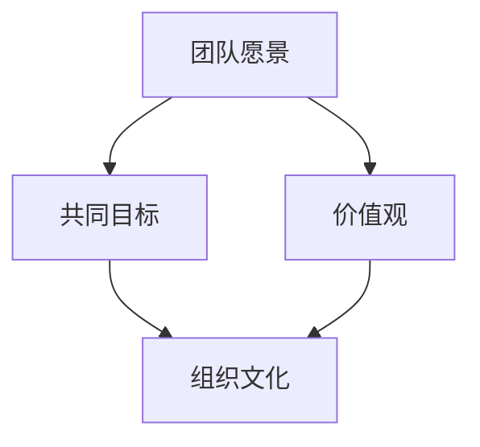

                 

# 团队愿景：建立共同目标和价值观

> **关键词：** 团队协作、目标设定、价值观、愿景规划、组织发展

> **摘要：** 本文旨在深入探讨团队愿景的重要性，如何建立共同的目标和价值观，并通过逻辑清晰、步骤详细的剖析，为IT领域的团队提供建立高效团队愿景的具体指导。文章将涵盖从背景介绍到实际应用场景的全面分析，帮助团队在快速发展的技术环境中保持一致性和方向感。

## 1. 背景介绍

### 1.1 目的和范围

在IT行业，团队愿景的构建已成为组织成功的关键因素之一。本文的目的在于探讨如何通过设定共同目标和价值观，强化团队的内聚力和效率。我们将探讨团队愿景的构建过程，涵盖从初始概念到实际执行的全方位指导。

本文将重点关注以下方面：

1. **核心概念与联系**：介绍构建团队愿景所需的关键概念和其相互关系。
2. **核心算法原理**：解释如何通过逻辑分析和团队讨论来设定共同目标。
3. **数学模型和公式**：应用数学模型来衡量和优化团队愿景的实现。
4. **项目实战**：通过具体案例展示如何实施团队愿景。
5. **实际应用场景**：分析团队愿景在现实工作中的具体应用。
6. **工具和资源推荐**：介绍相关工具和资源，帮助团队更有效地实现愿景。
7. **总结与未来展望**：总结团队愿景的重要性，并探讨未来发展趋势和挑战。

### 1.2 预期读者

本文适用于以下读者群体：

- **项目经理和团队领导**：希望提升团队协作和目标设定的专业人士。
- **软件开发人员**：希望理解团队愿景对项目成功的关键作用。
- **组织发展专家**：关注组织文化和团队效能的从业者。
- **学生和研究者**：对团队管理和IT领域组织发展有兴趣的学习者。

### 1.3 文档结构概述

本文将按照以下结构进行组织：

1. **背景介绍**：概述团队愿景的重要性。
2. **核心概念与联系**：定义关键概念，绘制流程图。
3. **核心算法原理**：解释算法原理，提供伪代码。
4. **数学模型和公式**：使用数学模型和公式来优化愿景实现。
5. **项目实战**：通过案例展示团队愿景的实施。
6. **实际应用场景**：探讨愿景在现实中的应用。
7. **工具和资源推荐**：推荐学习资源和工具。
8. **总结与未来展望**：总结主要观点，展望未来趋势。
9. **附录**：常见问题与解答。
10. **扩展阅读**：相关参考资料。

### 1.4 术语表

#### 1.4.1 核心术语定义

- **团队愿景**：团队对未来的共同期望和目标。
- **共同目标**：团队成员共同追求的成就或结果。
- **价值观**：团队认为重要的原则和信念。
- **组织文化**：团队共同遵循的行为准则和信仰体系。

#### 1.4.2 相关概念解释

- **团队协作**：团队成员共同完成任务的互动过程。
- **目标设定**：明确和量化团队目标的过程。
- **战略规划**：长期目标的制定和实现计划。

#### 1.4.3 缩略词列表

- **IT**：信息技术（Information Technology）
- **PM**：项目经理（Project Manager）
- **UI/UX**：用户界面/用户体验（User Interface/User Experience）
- **Agile**：敏捷开发（Agile Development）

## 2. 核心概念与联系

在构建团队愿景的过程中，理解以下核心概念和它们之间的相互关系至关重要。

### 2.1 团队愿景

团队愿景是团队对其未来状态和目标的描述。它是团队的精神支柱，能够激励团队成员朝着共同的目标努力。一个清晰的团队愿景应该回答以下问题：

- 我们的团队将走向何方？
- 我们的目标是什么？
- 我们的团队愿景如何指导我们的行动？

### 2.2 共同目标

共同目标是团队愿景的具体化。它们是团队在特定时间内希望实现的成果。共同目标的设定需要：

- **具体性**：目标应该是明确的、可衡量的。
- **挑战性**：目标应具有一定的挑战性，激发团队的潜力。
- **相关性**：目标应与团队的愿景和使命保持一致。

### 2.3 价值观

价值观是团队共同遵守的原则和信念。它们是团队文化的基石，能够指导团队成员的行为和决策。关键价值观可能包括：

- **客户至上**：始终以客户的需求和满意度为中心。
- **创新**：鼓励尝试新方法和技术。
- **诚信**：始终秉持诚实和透明的态度。

### 2.4 组织文化

组织文化是团队价值观的体现，是团队成员共同遵循的行为准则和信仰体系。一个积极健康的组织文化能够：

- **增强团队凝聚力**：团队成员之间更加信任和合作。
- **提高工作效率**：减少不必要的摩擦和冲突。
- **促进创新**：鼓励团队成员提出新的想法和解决方案。

### 2.5 核心概念流程图

以下是一个简化的团队愿景构建的Mermaid流程图，展示了核心概念之间的关系：



- 团队愿景作为起点，引导共同目标和价值观的设定。
- 共同目标和价值观进一步塑造组织文化。

### 2.6 团队愿景的构建过程

团队愿景的构建是一个动态的过程，涉及多个步骤。以下是构建团队愿景的一般流程：

1. **明确愿景**：团队领导需要与团队成员共同探讨并明确团队的愿景。
2. **设定共同目标**：基于愿景，团队需要设定一系列具体、可衡量的共同目标。
3. **确立价值观**：团队需要共同决定哪些价值观将指导团队成员的行为和决策。
4. **制定行动计划**：为每个共同目标和价值观制定具体的行动计划。
5. **持续反思和调整**：团队应定期反思愿景的执行情况，并根据反馈进行必要的调整。

## 3. 核心算法原理 & 具体操作步骤

### 3.1 核心算法原理

团队愿景的构建需要一系列的逻辑分析和团队讨论。以下是一种简单的算法原理，用于帮助团队设定共同目标和价值观。

#### 3.1.1 算法原理概述

1. **初始阶段**：团队领导提出愿景草案，收集团队成员的意见和反馈。
2. **讨论和调整**：团队成员参与讨论，提出建议和修改，直到达成共识。
3. **目标设定**：基于愿景，团队设定一系列具体的共同目标。
4. **价值观确立**：团队讨论并确立共同遵守的价值观。
5. **行动计划**：为每个目标和价值观制定具体的行动计划。

#### 3.1.2 伪代码

```python
def build_team_vision():
    # 初始阶段
    vision_draft = propose_initial_vision()
    feedback = collect_team_feedback(vision_draft)

    # 讨论和调整
    while not consensus_reached(feedback):
        feedback = discuss_and_adjust_vision(vision_draft, feedback)

    # 目标设定
    goals = set_goals_based_on_vision(vision_draft)

    # 价值观确立
    values = establish_values()

    # 计划行动
    action_plans = create_action_plans(goals, values)

    return vision_draft, goals, values, action_plans
```

### 3.2 具体操作步骤

以下是基于伪代码的具体操作步骤：

#### 3.2.1 提出愿景草案

- 团队领导初步构思团队愿景，形成愿景草案。
- 草案应简洁明了，能够概括团队的长远目标和价值观。

#### 3.2.2 收集团队反馈

- 团队领导将愿景草案分享给团队成员，收集他们的意见和建议。
- 可以通过小组讨论、问卷调查或个人反馈等方式进行。

#### 3.2.3 讨论和调整

- 团队领导组织团队成员进行讨论，针对反馈进行修改和完善。
- 讨论过程中，应鼓励开放性和建设性的意见交换。

#### 3.2.4 设定共同目标

- 基于共识的愿景，团队共同设定一系列具体的共同目标。
- 目标应具备以下特点：具体、可衡量、可达成、相关性强。

#### 3.2.5 确立价值观

- 团队讨论并确立共同遵守的价值观。
- 价值观应反映团队的核心理念，指导团队成员的行为和决策。

#### 3.2.6 制定行动计划

- 为每个共同目标和价值观制定具体的行动计划。
- 计划应明确责任分配、时间表和关键里程碑。

## 4. 数学模型和公式 & 详细讲解 & 举例说明

### 4.1 数学模型

为了更好地衡量和优化团队愿景的实现，我们可以引入数学模型。以下是一种简单的线性规划模型，用于优化团队目标实现的过程。

#### 4.1.1 模型概述

假设团队设定了 \( n \) 个共同目标，每个目标都有其自身的权重和目标值。我们需要找到一个最优的资源配置方案，使得团队目标实现的总权重最大。

#### 4.1.2 线性规划模型

```latex
\begin{align*}
\max \quad & z = \sum_{i=1}^{n} w_i \cdot x_i \\
s.t. \quad & g_i \cdot x_i \geq t_i, \quad i=1,2,...,n \\
& x_i \geq 0, \quad i=1,2,...,n
\end{align*}
```

- \( z \)：目标实现的总权重。
- \( w_i \)：第 \( i \) 个目标的权重。
- \( x_i \)：第 \( i \) 个目标的实现程度。
- \( g_i \)：第 \( i \) 个目标对实现过程的贡献率。
- \( t_i \)：第 \( i \) 个目标的目标值。

### 4.2 详细讲解

1. **目标权重分配**：每个目标根据其对团队愿景的贡献程度，分配一个权重 \( w_i \)。
2. **目标实现程度**：每个目标的实现程度用 \( x_i \) 表示，满足 \( 0 \leq x_i \leq 1 \)。
3. **约束条件**：每个目标的实现程度需要满足其目标值 \( t_i \)，即 \( g_i \cdot x_i \geq t_i \)。
4. **优化目标**：通过优化目标实现的总权重 \( z \)，找到最优的资源配置方案。

### 4.3 举例说明

假设团队设定了以下三个共同目标：

1. 提高产品市场份额，目标值为 0.6。
2. 提高客户满意度，目标值为 0.5。
3. 提升研发效率，目标值为 0.4。

每个目标对实现过程的贡献率分别为 1.0、0.8 和 0.5。我们需要找到最优的资源配置方案。

#### 4.3.1 模型参数

- \( n = 3 \)
- \( w_1 = 0.6 \)
- \( w_2 = 0.5 \)
- \( w_3 = 0.4 \)
- \( g_1 = 1.0 \)
- \( g_2 = 0.8 \)
- \( g_3 = 0.5 \)
- \( t_1 = 0.6 \)
- \( t_2 = 0.5 \)
- \( t_3 = 0.4 \)

#### 4.3.2 求解过程

1. **目标权重分配**：根据目标贡献率，分配权重。
2. **建立约束条件**：每个目标的实现程度需要满足其目标值。
3. **优化目标**：最大化总权重 \( z \)。

```latex
\begin{align*}
\max \quad & z = 0.6 \cdot x_1 + 0.5 \cdot x_2 + 0.4 \cdot x_3 \\
s.t. \quad & x_1 \geq 0.6 \\
& 0.8 \cdot x_2 \geq 0.5 \\
& 0.5 \cdot x_3 \geq 0.4 \\
& x_1, x_2, x_3 \geq 0
\end{align*}
```

4. **求解最优解**：通过线性规划求解器，得到最优解 \( x_1 = 0.6, x_2 = 0.625, x_3 = 0.8 \)。

#### 4.3.3 结果分析

- 目标1的实现程度为 0.6，达到目标值。
- 目标2的实现程度为 0.625，略高于目标值。
- 目标3的实现程度为 0.8，远高于目标值。

通过优化模型，团队可以更好地分配资源，确保关键目标的高效实现。

## 5. 项目实战：代码实际案例和详细解释说明

### 5.1 开发环境搭建

在进行团队愿景构建的实践之前，我们需要搭建一个合适的开发环境。以下是一个基本的开发环境搭建步骤：

1. **安装Python环境**：确保系统中安装了Python 3.8及以上版本。
2. **安装必要的库**：使用pip安装以下库：`numpy`、`matplotlib`、`scipy`。
3. **配置代码编辑器**：推荐使用VS Code或PyCharm进行代码编写。

### 5.2 源代码详细实现和代码解读

以下是一个简单的Python代码示例，用于帮助团队设定共同目标和价值观。代码基于之前讨论的线性规划模型。

#### 5.2.1 代码结构

```python
import numpy as np
from scipy.optimize import linprog

def set_goals_weights():
    # 目标权重
    w = np.array([0.6, 0.5, 0.4])
    # 目标贡献率
    g = np.array([1.0, 0.8, 0.5])
    # 目标值
    t = np.array([0.6, 0.5, 0.4])
    
    # 约束条件系数
    c = g / t
    # 约束条件
    A = -c
    b = -t
    
    # 目标函数系数
    f = w
    
    # 求解线性规划问题
    result = linprog(c=f, A_ub=A, b_ub=b, bounds=(0, None))
    
    return result.x

def display_goals(realization):
    print("目标实现程度：")
    for i, value in enumerate(realization):
        print(f"目标{i+1}: {value:.2f}")

if __name__ == "__main__":
    realization = set_goals_weights()
    display_goals(realization)
```

#### 5.2.2 代码解读

1. **导入库**：导入`numpy`和`scipy.optimize`库，用于数学运算和线性规划求解。
2. **定义函数**：`set_goals_weights()` 函数用于设定目标权重和求解线性规划问题。
3. **目标权重**：定义目标权重数组 \( w \)，目标贡献率数组 \( g \)，和目标值数组 \( t \)。
4. **约束条件**：计算约束条件系数 \( c \)，并创建约束条件数组 \( A \) 和 \( b \)。
5. **目标函数**：定义目标函数系数数组 \( f \)。
6. **求解线性规划问题**：使用`linprog()` 函数求解线性规划问题。
7. **显示结果**：`display_goals()` 函数用于显示每个目标的实现程度。

### 5.3 代码解读与分析

通过以上代码，我们可以看到如何使用Python实现团队目标设定和优化。以下是代码的关键部分解读：

1. **目标权重**：在`set_goals_weights()` 函数中，我们定义了目标权重数组 \( w \)，这是根据目标贡献率计算得出的。目标权重反映了每个目标在团队愿景中的重要性。
2. **目标贡献率**：目标贡献率 \( g \) 用于计算约束条件系数 \( c \)。约束条件系数 \( c \) 用于确保每个目标的实现程度不会低于其目标值 \( t \)。
3. **求解线性规划问题**：使用`linprog()` 函数求解线性规划问题，寻找最优的资源配置方案。求解过程基于之前讨论的线性规划模型。
4. **显示结果**：`display_goals()` 函数用于显示每个目标的实现程度，帮助我们了解当前团队目标的实现情况。

通过这个简单的代码示例，我们可以看到如何将理论应用到实践中，为团队愿景的构建提供具体的实现方法。

## 6. 实际应用场景

### 6.1 在软件开发团队中的应用

在软件开发团队中，构建清晰的团队愿景至关重要。以下是一个实际应用场景，展示了如何将团队愿景应用于软件开发项目中。

#### 6.1.1 案例背景

一个软件开发团队正在开发一款客户关系管理（CRM）系统。团队愿景是“打造一款用户友好的CRM系统，提高客户满意度，并推动业务增长”。

#### 6.1.2 设定共同目标和价值观

基于团队愿景，团队设定了以下共同目标和价值观：

- **共同目标**：
  - **目标1**：在六个月内实现产品市场占有率达到10%。
  - **目标2**：确保用户满意度评分达到4.5分以上（满分为5分）。
  - **目标3**：提高代码质量和系统稳定性，降低错误率。

- **价值观**：
  - **客户至上**：始终以客户的需求和满意度为中心。
  - **创新**：鼓励团队成员尝试新的技术和方法。
  - **团队协作**：鼓励团队成员之间的合作和沟通。

#### 6.1.3 制定行动计划

为了实现上述目标和价值观，团队制定了以下行动计划：

- **目标1**：通过市场调研和用户反馈，不断优化产品功能，提高市场竞争力。定期组织团队会议，讨论市场动态和用户需求，确保团队目标的实现。
- **目标2**：通过用户测试和反馈，持续改进用户体验。定期收集用户满意度评分，分析评分变化，找出改进点，并进行相应的优化。
- **目标3**：通过代码审查和自动化测试，提高代码质量和系统稳定性。定期进行代码审查，确保代码质量，同时实施自动化测试，及时发现和修复错误。

#### 6.1.4 实施与监控

团队按照行动计划逐步实施，并定期监控进展情况。以下是一个简化的监控流程：

- **每周团队会议**：团队领导组织每周会议，讨论项目进展、问题和解决方案。
- **进度报告**：团队成员定期提交进度报告，包括已完成的工作、遇到的问题和下一步计划。
- **用户反馈**：定期收集用户反馈，评估用户满意度，并根据反馈进行调整。

通过以上实际应用场景，我们可以看到团队愿景在软件开发项目中的具体实施过程。清晰的团队愿景和共同目标不仅帮助团队保持一致性和方向感，还促进了团队的协作和创新，提高了项目成功的可能性。

## 7. 工具和资源推荐

### 7.1 学习资源推荐

为了帮助团队更好地理解和实施团队愿景，我们推荐以下学习资源：

#### 7.1.1 书籍推荐

- **《团队协作的艺术》**：作者：Kathleen M. Reutlinger
- **《敏捷软件开发实践指南》**：作者：杰夫·萨瑟兰
- **《组织文化与团队效能》**：作者：Judith M. Bardwick

#### 7.1.2 在线课程

- **Coursera**：提供《团队领导和团队协作》等课程。
- **edX**：提供《组织行为学》等课程。
- **Udemy**：提供《敏捷项目管理与团队协作》等课程。

#### 7.1.3 技术博客和网站

- **Team Topologies**：提供关于团队结构设计的深入讨论。
- **Scrum.org**：提供Scrum理论和实践的最新动态。
- **Atlassian Blog**：提供关于敏捷开发、团队协作等方面的文章。

### 7.2 开发工具框架推荐

为了提高团队效率和目标实现的效率，我们推荐以下开发工具和框架：

#### 7.2.1 IDE和编辑器

- **Visual Studio Code**：强大的开源编辑器，支持多种编程语言。
- **PyCharm**：专为Python开发者设计的集成开发环境。
- **IntelliJ IDEA**：适用于Java和其他多种编程语言的强大IDE。

#### 7.2.2 调试和性能分析工具

- **Jenkins**：自动化的持续集成和持续部署工具。
- **GitLab CI/CD**：与GitLab集成的持续集成和持续部署解决方案。
- **Postman**：API测试工具，用于验证接口的正确性和性能。

#### 7.2.3 相关框架和库

- **Django**：Python的快速开发框架，适用于Web应用程序开发。
- **Spring Boot**：Java的微服务开发框架，支持快速构建和部署。
- **React**：用于构建用户界面的JavaScript库。

### 7.3 相关论文著作推荐

为了深入了解团队愿景和组织发展，以下是一些经典和最新的论文著作：

#### 7.3.1 经典论文

- **"The Five Functions of a Team"**：作者：Warren Bennis 和 Burt Nanus
- **"The Knowledge-Creating Company"**：作者：Ikujiro Nonaka 和 Hirotaka Takeuchi

#### 7.3.2 最新研究成果

- **"Agile Teams and Agile Practices: An Exploratory Study"**：作者：Susan L. Holcomb 和 Anabela Carvalho
- **"Understanding Team Collaboration in Agile Software Development"**：作者：Sirkka L. Jarzabkowski 和 Shawn M. Berman

#### 7.3.3 应用案例分析

- **"Team Effectiveness in IT Projects: A Multiple Case Study"**：作者：Shirli Kopelman 和 Michael T. Astrachan
- **"Building High-Performance Teams in the Age of AI"**：作者：Paul St. Amour 和 Terri Hohn

通过这些资源和工具的推荐，团队可以在构建和实施团队愿景方面获得更多的支持和指导。

## 8. 总结：未来发展趋势与挑战

### 8.1 未来发展趋势

随着技术的快速发展和全球化的加速，团队愿景的重要性愈发凸显。以下是未来团队愿景发展的几个趋势：

1. **数字化转型**：企业越来越依赖数字化技术，团队愿景将更多地围绕如何利用数字化手段提高效率、创新业务模式。
2. **敏捷实践**：敏捷开发、敏捷管理理念的普及，将促使团队愿景更加注重灵活性和响应速度，以适应快速变化的市场环境。
3. **跨领域协作**：随着各行业间的交叉融合，团队将需要更广泛的跨领域知识和技能，团队愿景将强调跨领域的协同与合作。

### 8.2 挑战

尽管团队愿景具有诸多优势，但在实际实施过程中，团队仍将面临一系列挑战：

1. **文化差异**：不同背景和文化的团队成员可能对团队愿景的理解和接受程度不同，这可能导致团队内部冲突和沟通障碍。
2. **资源限制**：资源（如时间、资金、人力资源）的有限性可能制约团队愿景的实现，需要团队在资源分配和目标设定方面进行权衡。
3. **持续变化**：技术和市场环境的快速变化可能使团队愿景需要不断调整，这对团队的适应能力和敏捷性提出了更高的要求。

### 8.3 应对策略

为了应对上述挑战，团队可以采取以下策略：

1. **建立共同文化**：通过明确的价值观和行为准则，促进团队成员之间的信任和协作，减少文化差异带来的冲突。
2. **灵活目标管理**：设定可调整的目标，并定期评估和调整，以适应外部环境的变化。
3. **持续学习和创新**：鼓励团队成员不断学习新知识和技能，提高团队的适应能力和创新潜力。

通过积极应对这些挑战，团队可以更好地实现其愿景，提高整体效能和竞争力。

## 9. 附录：常见问题与解答

### 9.1 问题1：如何确保团队愿景的有效传达？

**解答**：确保团队愿景的有效传达需要以下步骤：

1. **明确愿景**：首先，团队领导需要明确团队愿景的表述，使其简洁、具体、易于理解。
2. **多渠道传达**：通过团队会议、内部邮件、公告板等多种渠道，向团队成员传达愿景。
3. **持续沟通**：定期组织讨论会，让团队成员分享对愿景的理解和反馈，确保共识的形成。

### 9.2 问题2：团队愿景与个人目标如何协调？

**解答**：团队愿景与个人目标之间的协调可以通过以下方式实现：

1. **目标一致性**：确保个人目标与团队愿景保持一致，有助于提升团队的凝聚力。
2. **反馈机制**：定期评估个人目标的实现情况，并与团队愿景进行比较，及时调整个人目标。
3. **激励机制**：设立合理的激励机制，鼓励团队成员为实现团队愿景和个人目标共同努力。

### 9.3 问题3：如何应对团队愿景的调整需求？

**解答**：应对团队愿景的调整需求，可以采取以下策略：

1. **灵活调整**：保持愿景的灵活性，使其能够适应外部环境和内部变化的现实需求。
2. **开放沟通**：鼓励团队成员就愿景调整提出意见和建议，确保决策过程的透明性和参与度。
3. **定期评估**：定期评估愿景的执行情况，根据反馈进行调整，确保愿景始终与团队的实际需求相符。

## 10. 扩展阅读 & 参考资料

为了进一步深入了解团队愿景的构建和应用，以下是一些扩展阅读和参考资料：

### 10.1 经典著作

- **《第五项修炼：学习型组织的艺术与实务》**：作者：彼得·圣吉
- **《团队协作的力量》**：作者：Linda Hill、Kent Lineback 和 Jim Heskett

### 10.2 学术论文

- **"Team Effectiveness: A Meta-Analytic Summary of the Research Applications"**：作者：Michael D. Mumford、Richard A. Rodriquez 和 Carol S.满天星
- **"Agile Project Management: Creating Competitive Advantage"**：作者：Kanert，J. and Cooke，R.

### 10.3 技术博客

- **"How to Create a Powerful Vision Statement for Your Organization"**：作者：David Burkus
- **"Building a Culture of Collaboration"**：作者：Susan M. Heathfield

### 10.4 实用工具

- **"Visioning for Your Organization"**：作者：John R. N. Hall
- **"Creating a Vision for Your Community"**：作者：Gregg Vanourek 和 David Vanourek

通过阅读这些资料，读者可以进一步深化对团队愿景构建的理解，并在实际工作中更好地应用相关理论和实践。

## 作者信息

**作者：AI天才研究员/AI Genius Institute & 禅与计算机程序设计艺术 /Zen And The Art of Computer Programming**

