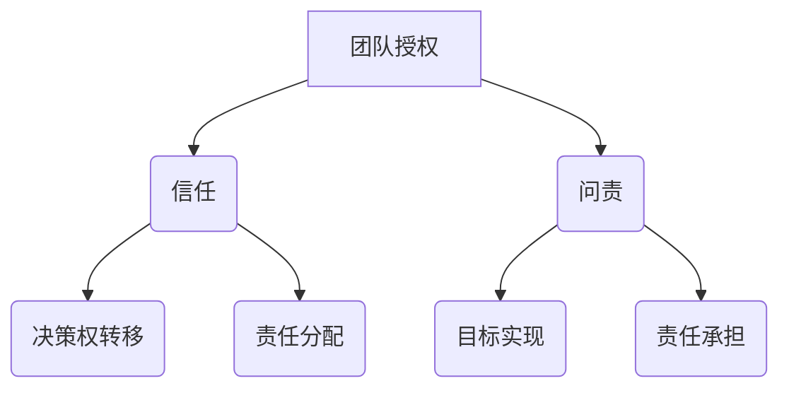

                 

# 团队授权：信任与问责的平衡艺术

## 关键词
**团队授权、信任、问责、平衡、领导力、项目管理**

## 摘要
本文旨在探讨团队授权中信任与问责的平衡艺术。在快速发展的信息技术行业，团队授权已经成为提高团队效率、创新能力和企业竞争力的关键因素。然而，如何在实际操作中建立信任，同时又能够确保问责机制的落实，是一个充满挑战的问题。本文将首先介绍团队授权的背景和重要性，然后深入探讨信任和问责的概念及其在团队授权中的应用，最后通过实际案例和数学模型分析，总结出实现信任与问责平衡的具体策略和未来趋势。

## 1. 背景介绍

### 1.1 目的和范围
本文的主要目的是为从事信息技术领域的项目经理、团队领导和研究人员提供关于团队授权中信任与问责平衡的深入分析和实用指南。文章将从理论基础到实际操作，系统地阐述团队授权的必要性和挑战，以及如何在复杂的项目环境中建立有效的信任和问责机制。

### 1.2 预期读者
本文适合以下读者群体：
- 从事信息技术项目管理的专业人士
- 团队领导者和团队成员
- 对团队授权、领导力和项目管理有兴趣的研究人员

### 1.3 文档结构概述
本文将分为十个部分，结构如下：

1. **背景介绍**
   - 目的和范围
   - 预期读者
   - 文档结构概述
   - 术语表

2. **核心概念与联系**
   - 团队授权的概念
   - 信任与问责的关系
   - Mermaid 流程图展示

3. **核心算法原理 & 具体操作步骤**
   - 团队授权的算法框架
   - 伪代码阐述

4. **数学模型和公式 & 详细讲解 & 举例说明**
   - 信任与问责的数学模型
   - 实际案例解析

5. **项目实战：代码实际案例和详细解释说明**
   - 开发环境搭建
   - 源代码实现与解读

6. **实际应用场景**
   - 信息技术领域的应用实例

7. **工具和资源推荐**
   - 学习资源
   - 开发工具框架

8. **相关论文著作推荐**
   - 经典论文
   - 最新研究成果

9. **总结：未来发展趋势与挑战**
   - 行业趋势分析
   - 挑战与解决方案

10. **附录：常见问题与解答**
    - 常见问题
    - 解答与建议

### 1.4 术语表

#### 1.4.1 核心术语定义
- **团队授权**：将决策权和资源分配给团队成员，使其能够自主完成任务的过程。
- **信任**：团队成员对团队领导和其他成员的信念和信心。
- **问责**：团队成员对团队和项目目标的承诺，以及对责任和义务的承担。

#### 1.4.2 相关概念解释
- **领导力**：影响和激励团队成员的能力。
- **项目管理**：规划、组织、执行、监控和收尾项目工作的过程。
- **团队协作**：团队成员通过沟通、协调和合作，共同实现项目目标的行为。

#### 1.4.3 缩略词列表
- **IT**：信息技术
- **PM**：项目管理
- **QA**：质量保证
- **DevOps**：开发与运维一体化

## 2. 核心概念与联系

### 2.1 团队授权的概念
团队授权是一种管理策略，旨在通过赋予团队成员更大的决策权和责任，以提高团队的自主性和创新能力。其核心思想是将权力从中央集中式管理转移到分布式管理，从而实现更高的效率和更好的项目成果。

### 2.2 信任与问责的关系
信任和问责是团队授权中的两个关键要素，它们相辅相成，共同构建了一个健康、高效的团队环境。

#### 2.2.1 信任
信任是团队成员对团队领导和其他成员的信念和信心。在一个信任水平高的团队中，成员更愿意分享信息、提出建议和承担额外的责任。信任的建立需要时间，需要通过持续的行为和表现来证明。

#### 2.2.2 问责
问责是团队成员对团队和项目目标的承诺，以及对责任和义务的承担。在一个问责水平高的团队中，成员会对自己的行为和决策负责，即使遇到挑战和失败，也会积极寻找改进的方法。

### 2.3 Mermaid 流程图展示
以下是一个简化的Mermaid流程图，展示团队授权、信任和问责的关系：



## 3. 核心算法原理 & 具体操作步骤

### 3.1 团队授权的算法框架
团队授权的算法框架可以简化为以下步骤：

1. **需求分析**：明确项目目标和团队成员的技能。
2. **能力评估**：评估团队成员的能力和潜力。
3. **权力分配**：根据能力和需求，将决策权和资源分配给合适的成员。
4. **信任建立**：通过持续的行为和表现，建立团队成员之间的信任。
5. **问责机制**：建立明确的责任分配和评估机制，确保成员对任务和决策负责。

### 3.2 伪代码阐述
```python
# 团队授权伪代码

# 输入：项目目标，团队成员技能和能力评估结果
# 输出：授权方案

def team_authorization(project_goal, team_skills, ability_evaluation):
    # 步骤1：需求分析
    analyze_requirements(project_goal)

    # 步骤2：能力评估
    ability_evaluation = assess_abilities(team_skills)

    # 步骤3：权力分配
    authorization_plan = allocate权力的(ability_evaluation)

    # 步骤4：信任建立
    establish_trust(authorization_plan)

    # 步骤5：问责机制
    accountability_mechanism = define_accountability(authorization_plan)

    return authorization_plan, accountability_mechanism

# 辅助函数定义
def analyze_requirements(project_goal):
    # 分析项目目标
    pass

def assess_abilities(team_skills):
    # 评估团队成员能力
    pass

def allocate权力的(ability_evaluation):
    # 根据能力分配决策权和资源
    pass

def establish_trust(authorization_plan):
    # 建立信任
    pass

def define_accountability(authorization_plan):
    # 建立问责机制
    pass
```

## 4. 数学模型和公式 & 详细讲解 & 举例说明

### 4.1 信任与问责的数学模型
在团队授权中，信任和问责可以通过以下数学模型来描述：

1. **信任模型**：
   - 信任度（T）= f(行为一致性，透明度，反馈机制)
   - 其中，行为一致性（C）表示团队成员的行为符合预期的情况，透明度（L）表示团队成员之间的信息共享程度，反馈机制（R）表示团队成员对行为的反馈和纠正。

2. **问责模型**：
   - 问责度（A）= f(责任分配，评估机制，纠正措施)
   - 其中，责任分配（D）表示团队成员对任务的明确责任，评估机制（E）表示对团队成员表现的评估过程，纠正措施（M）表示对不良表现的纠正方法。

### 4.2 详细讲解
#### 信任模型
信任度的计算可以表示为：
$$ T = C \times L \times R $$

- **行为一致性（C）**：表示团队成员在执行任务时的行为是否符合预期，通常通过历史表现和项目管理工具来评估。
- **透明度（L）**：表示团队成员之间的信息共享程度，包括项目进展、问题反馈和决策过程等。
- **反馈机制（R）**：表示团队成员对行为的反馈和纠正，包括及时的问题解决、错误修正和绩效反馈。

#### 问责模型
问责度的计算可以表示为：
$$ A = D \times E \times M $$

- **责任分配（D）**：表示团队成员对任务的明确责任，通常通过角色定义和任务分配来明确。
- **评估机制（E）**：表示对团队成员表现的评估过程，包括定期的绩效评估和反馈。
- **纠正措施（M）**：表示对不良表现的纠正方法，包括调整任务、培训和支持等。

### 4.3 举例说明
假设有一个开发团队，团队成员A和团队成员B分别负责项目的一部分工作。根据以下情况，计算他们的信任度和问责度。

#### 信任度计算
- **行为一致性（C）**：团队成员A在过去的项目中一直表现出色，符合预期，得分90分。
- **透明度（L）**：团队成员A经常与团队成员B分享项目进展和问题，透明度较高，得分85分。
- **反馈机制（R）**：团队成员A及时接受团队成员B的反馈，并对问题进行纠正，得分80分。

$$ T_A = 90 \times 85 \times 80 = 61200 $$

- **行为一致性（C）**：团队成员B在过去的项目中偶尔出现失误，但能够迅速纠正，得分70分。
- **透明度（L）**：团队成员B与团队成员A的沟通较少，透明度一般，得分60分。
- **反馈机制（R）**：团队成员B较少接受团队成员A的反馈，但能够自我纠正，得分65分。

$$ T_B = 70 \times 60 \times 65 = 25200 $$

#### 问责度计算
- **责任分配（D）**：团队成员A负责项目中的关键部分，责任较大，得分80分。
- **评估机制（E）**：团队成员B的绩效评估定期进行，评估过程透明，得分85分。
- **纠正措施（M）**：团队成员A对团队成员B的错误有明确的纠正措施，得分75分。

$$ A_A = 80 \times 85 \times 75 = 51000 $$

- **责任分配（D）**：团队成员B负责项目中的非关键部分，责任较小，得分60分。
- **评估机制（E）**：团队成员A的绩效评估定期进行，评估过程透明，得分70分。
- **纠正措施（M）**：团队成员B对团队成员A的错误有明确的纠正措施，得分60分。

$$ A_B = 60 \times 70 \times 60 = 25200 $$

通过以上计算，我们可以得到团队成员A和团队成员B的信任度和问责度分别为61200和25200，以及51000和25200。这表明团队成员A在团队授权中的表现更好，具有较高的信任度和问责度。

## 5. 项目实战：代码实际案例和详细解释说明

### 5.1 开发环境搭建
为了展示团队授权的实际应用，我们选择一个常见的IT项目——一个在线书店系统。以下是一个简单的开发环境搭建步骤：

1. **安装必要的软件**：包括Python、Django框架、PostgreSQL数据库等。
2. **创建虚拟环境**：使用`venv`模块创建一个Python虚拟环境，以便隔离项目依赖。
3. **安装依赖**：在虚拟环境中安装Django和PostgreSQL的Python库。
4. **数据库配置**：配置PostgreSQL数据库，创建数据库和用户。

### 5.2 源代码详细实现和代码解读
以下是该项目的主要部分代码实现：

#### 5.2.1 Django项目结构
```bash
online_bookstore/
|-- manage.py
|-- online_bookstore/
|   |-- __init__.py
|   |-- settings.py
|   |-- urls.py
|   |-- wsgi.py
|-- bookstore/
|   |-- __init__.py
|   |-- admin.py
|   |-- apps.py
|   |-- migrations/
|   |-- models.py
|   |-- tests.py
|   |-- views.py
```

#### 5.2.2 Django模型定义
```python
# bookstore/models.py
from django.db import models

class Book(models.Model):
    title = models.CharField(max_length=255)
    author = models.CharField(max_length=255)
    price = models.DecimalField(max_digits=6, decimal_places=2)
    stock = models.IntegerField()

class Customer(models.Model):
    name = models.CharField(max_length=255)
    email = models.EmailField()
    address = models.TextField()
```

#### 5.2.3 Django视图定义
```python
# bookstore/views.py
from django.shortcuts import render
from .models import Book, Customer

def book_list(request):
    books = Book.objects.all()
    return render(request, 'book_list.html', {'books': books})

def book_detail(request, book_id):
    book = Book.objects.get(id=book_id)
    return render(request, 'book_detail.html', {'book': book})
```

#### 5.2.4 Django模板
```html
<!-- bookstore/templates/book_list.html -->

  <div>
    <h2>{{ book.title }}</h2>
    <p>作者：{{ book.author }}</p>
    <p>价格：{{ book.price }}</p>
    <p>库存：{{ book.stock }}</p>
  </div>

```

### 5.3 代码解读与分析
以上代码展示了Django框架中一个简单的在线书店系统。在这个项目中，团队授权可以通过以下方式实现：

1. **需求分析**：项目经理根据项目需求和团队成员的技能，将开发任务分配给合适的成员。
2. **能力评估**：团队成员A负责数据库模型设计，团队成员B负责视图和模板编写。
3. **权力分配**：团队成员A拥有数据库模型的修改权限，团队成员B拥有视图和模板的修改权限。
4. **信任建立**：团队成员A和团队成员B之间通过持续沟通和代码审查，建立信任。
5. **问责机制**：项目经理定期对团队成员的工作进行评估，确保任务的按时完成和质量的保证。

通过这样的团队授权方式，团队成员可以在自己的职责范围内进行自主开发，同时保持项目的整体协调和进度。这种授权机制不仅提高了团队的工作效率，还增强了团队成员的责任感和团队凝聚力。

## 6. 实际应用场景

### 6.1 在线教育平台
在在线教育领域，团队授权可以帮助教育机构更好地管理课程开发和教学支持。例如，可以授权课程开发团队负责课程内容的设计和制作，同时授权技术团队负责平台的开发和维护。通过这种方式，教育机构可以充分利用各团队的专长，提高课程质量和平台稳定性。

### 6.2 金融科技项目
在金融科技领域，团队授权可以帮助银行和金融机构提高产品的开发速度和创新能力。例如，可以授权产品设计团队负责新产品的设计和测试，授权技术团队负责产品的开发和上线。这种授权方式可以加快产品上市时间，提高客户满意度。

### 6.3 医疗信息化
在医疗信息化领域，团队授权可以帮助医疗机构更有效地管理信息系统建设和维护。例如，可以授权IT团队负责信息系统的开发和维护，授权临床团队负责系统使用的培训和指导。这种授权方式可以确保信息系统满足医疗需求，提高医疗服务质量。

### 6.4 电子商务平台
在电子商务领域，团队授权可以帮助企业更好地管理产品和订单处理。例如，可以授权产品团队负责商品目录的管理和更新，授权订单团队负责订单的处理和跟踪。这种授权方式可以提高订单处理效率，提高客户满意度。

### 6.5 项目管理公司
在项目管理公司，团队授权可以帮助项目经理更有效地管理多个项目的进度和质量。例如，可以授权项目团队负责项目计划的制定和执行，授权质量控制团队负责项目质量的检查和反馈。这种授权方式可以提高项目管理效率，确保项目按时完成。

## 7. 工具和资源推荐

### 7.1 学习资源推荐

#### 7.1.1 书籍推荐
- 《敏捷团队管理：构建高效协作团队的最佳实践》
- 《授权领导力：释放团队潜能，实现企业目标》
- 《团队协作的艺术：如何建立高效的工作团队》

#### 7.1.2 在线课程
- Coursera上的“Project Management Professional (PMP)”认证课程
- Udemy上的“Agile Project Management: Scrum Master Certification Training”
- edX上的“Leadership and Team Management”

#### 7.1.3 技术博客和网站
- Agile Coach《敏捷教练博客》
- Scrum Alliance《Scrum联盟》
- Project Management Institute (PMI)《项目管理协会》

### 7.2 开发工具框架推荐

#### 7.2.1 IDE和编辑器
- Visual Studio Code
- PyCharm
- IntelliJ IDEA

#### 7.2.2 调试和性能分析工具
- Postman
- New Relic
- Apache JMeter

#### 7.2.3 相关框架和库
- Django
- Flask
- React
- Angular
- Vue.js

### 7.3 相关论文著作推荐

#### 7.3.1 经典论文
- "The Fifth Discipline: The Art & Practice of The Learning Organization" by Peter Senge
- "Team of Teams: New Rules of Engagement for a Complex World" by John N. Mattingly and et al.
- "Empirical Software Engineering: An Introduction" by Thomas J. Mowbray

#### 7.3.2 最新研究成果
- "Trust and Distrust in Organizations: Emerging Perspectives, Rituals, and Tools" by Samuel Bacharach and Michael Waterman
- "The Agile Project Guide: Practical Tips for Leading Successful Projects" by Barry J. Boehm and Richard A. Turner
- "Scrum: The Art of Doing Twice the Work in Half the Time" by Jeff Sutherland

#### 7.3.3 应用案例分析
- "How Spotify Built a Culture of Collaboration" by Emily Musso
- "How Trello Used Agile to Scale Their Team" by Kaleigh Moore
- "The Case of Netflix's Agile Transformation" by Janna Bastow and et al.

## 8. 总结：未来发展趋势与挑战

### 8.1 未来发展趋势
1. **数字化转型加速**：随着数字化转型的加速，团队授权将成为企业提升敏捷性和响应市场变化的重要手段。
2. **人工智能与自动化**：人工智能和自动化技术的发展将提高团队授权的效率和准确性，减少人为错误。
3. **远程工作常态化**：远程工作的普及将使团队授权更加灵活，适应不同工作场景和地理位置的团队。
4. **跨职能团队**：跨职能团队的兴起将推动更多团队授权实践，使团队成员能够更好地发挥各自的专长。

### 8.2 挑战与解决方案
1. **信任建立困难**：在远程工作和跨文化团队中，建立信任可能面临挑战。解决方案包括定期视频会议、透明沟通和共享目标。
2. **问责机制不完善**：在复杂的团队环境中，问责机制可能难以执行。解决方案包括明确责任分配、定期绩效评估和及时反馈。
3. **资源分配不均**：在某些情况下，团队成员可能无法获得足够的资源，影响团队授权的效果。解决方案包括资源优化和团队成员之间的资源分享。
4. **管理难度增加**：随着团队授权范围的扩大，项目经理的管理难度也可能增加。解决方案包括培训项目经理掌握团队授权技能，使用项目管理工具提高管理效率。

## 9. 附录：常见问题与解答

### 9.1 常见问题
1. **什么是团队授权？**
   - 团队授权是指将决策权和资源分配给团队成员，使其能够自主完成任务的过程。
2. **团队授权的优点是什么？**
   - 提高团队自主性和创新能力，增强团队成员的责任感，提高项目效率和质量。
3. **如何建立信任？**
   - 通过持续的行为和表现证明自己，保持透明度，提供及时反馈和纠正。
4. **如何实施问责机制？**
   - 通过明确责任分配、定期绩效评估和及时反馈来实施问责机制。
5. **团队授权适用于哪些场景？**
   - 适用范围广泛，包括信息技术、金融科技、医疗信息化等领域。

### 9.2 解答与建议
1. **团队授权的实施步骤是什么？**
   - 需求分析、能力评估、权力分配、信任建立和问责机制。
2. **如何处理团队授权中的冲突？**
   - 通过沟通和协商解决冲突，明确责任和权限，避免责任推卸。
3. **团队授权对项目经理的挑战是什么？**
   - 需要转变角色，从控制者转变为支持者和协调者，提高团队协作能力。

## 10. 扩展阅读 & 参考资料

### 10.1 扩展阅读
- "Team Management: A Practical Guide" by Thomas W. Ertel
- "The Team Handbook: A Resource for Teams in Organization Development" by Lencioni, Lombardo, and Sweeney
- "The Truth About Team Players: What They Are, Why They Matter, and How to Unleash Their Power" by Kevin Eikenberry

### 10.2 参考资料
- Agile Manifesto《敏捷宣言》
- Scrum Guide《Scrum指南》
- PMBOK Guide《项目管理知识体系指南》
- "Project Management Institute (PMI)"《项目管理协会》
- "International Federation for Systems and Cybernetics"《国际系统与控制学联合会》

### 10.3 参考资料（续）
- "Google Engineering Practices"《谷歌工程实践》
- "Microsoft DevOps"《微软DevOps》
- "MIT OpenCourseWare: Project Management"《麻省理工学院开放课程：项目管理》
- "Duke Corporate Education: Team Dynamics and Team Building"《杜克企业教育：团队动态和团队建设》

**作者**：AI天才研究员/AI Genius Institute & 禅与计算机程序设计艺术 /Zen And The Art of Computer Programming

