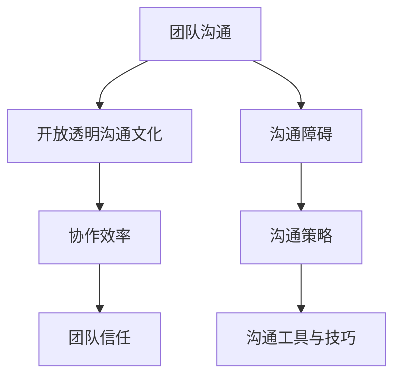

                 


# 团队沟通的艺术：构建开放透明的沟通文化

> **关键词：团队沟通、开放透明、沟通文化、协作效率、信任建设**

> **摘要：本文将深入探讨团队沟通的重要性，分析开放透明沟通文化的构建方法，并阐述如何通过有效的沟通策略提高团队协作效率，建立信任。我们将通过具体案例和实践，提供实用的建议和工具，帮助读者提升团队沟通水平，打造卓越团队。**

## 1. 背景介绍

### 1.1 目的和范围

本文旨在探讨团队沟通的艺术，尤其是如何构建开放透明的沟通文化，以提升团队协作效率和信任建设。文章将涵盖以下几个方面：

- 沟通在团队协作中的核心作用
- 开放透明沟通文化的定义和重要性
- 构建开放透明沟通文化的策略和方法
- 提高团队沟通效率和信任建设的关键步骤
- 实际应用场景和工具推荐

### 1.2 预期读者

- 团队领导者和管理者
- 项目经理和团队成员
- 企业培训师和人力资源专业人士
- 对团队沟通和协作有兴趣的个人

### 1.3 文档结构概述

本文分为十个部分，具体结构如下：

1. 背景介绍
2. 核心概念与联系
3. 核心算法原理 & 具体操作步骤
4. 数学模型和公式 & 详细讲解 & 举例说明
5. 项目实战：代码实际案例和详细解释说明
6. 实际应用场景
7. 工具和资源推荐
8. 总结：未来发展趋势与挑战
9. 附录：常见问题与解答
10. 扩展阅读 & 参考资料

### 1.4 术语表

#### 1.4.1 核心术语定义

- **团队沟通**：团队成员之间交换信息、观点和感受的过程。
- **开放透明沟通文化**：鼓励团队成员自由表达意见、共享信息和反馈，以及相互信任和支持的沟通环境。
- **协作效率**：团队成员在沟通和合作中产生的效率和质量。

#### 1.4.2 相关概念解释

- **沟通障碍**：阻碍信息有效传递的因素，如语言障碍、文化差异、心理障碍等。
- **团队信任**：团队成员之间的信任和依赖，是团队协作的基础。

#### 1.4.3 缩略词列表

- **IDE**：集成开发环境（Integrated Development Environment）
- **SQL**：结构化查询语言（Structured Query Language）

## 2. 核心概念与联系

在探讨团队沟通的艺术之前，我们需要了解一些核心概念和它们之间的联系。以下是一个简化的Mermaid流程图，用于展示这些概念之间的关系。



### 2.1 团队沟通

团队沟通是团队成员之间交换信息、观点和感受的过程。它是团队协作的核心，决定了团队的协作效率和成果。有效的团队沟通能够促进信息共享、减少误解、提高决策质量和团队凝聚力。

### 2.2 开放透明沟通文化

开放透明沟通文化是一种鼓励团队成员自由表达意见、共享信息和反馈，以及相互信任和支持的沟通环境。它包括以下几个关键要素：

- **共享信息**：团队成员能够无障碍地分享项目进展、问题和建议。
- **反馈机制**：团队成员能够接受和提供建设性的反馈，以促进个人和团队成长。
- **信任建设**：团队成员之间的信任是开放透明沟通文化的基础。

### 2.3 协作效率

协作效率是团队沟通的目标之一，它反映了团队成员在沟通和合作中产生的效率和质量。提高协作效率的方法包括：

- **明确目标**：确保所有团队成员对项目目标有共同的理解。
- **有效分工**：根据团队成员的技能和兴趣进行合理的分工。
- **沟通畅通**：确保信息在团队内快速、准确地传递。

### 2.4 团队信任

团队信任是团队协作的重要基础，它建立在开放透明沟通文化之上。团队信任包括以下几个方面：

- **信任承诺**：团队成员对彼此的信任和忠诚。
- **共同目标**：团队成员对团队目标的认同和追求。
- **相互支持**：团队成员在困难时相互帮助和支持。

## 3. 核心算法原理 & 具体操作步骤

构建开放透明的沟通文化需要一系列核心算法原理和具体操作步骤。以下是一个简化的伪代码，用于说明这些步骤。

```pseudo
// 开放透明沟通文化构建伪代码

function BuildOpenTransparentCommunicationCulture() {
    // 步骤1：明确沟通目标
    defineCommunicationGoals()

    // 步骤2：建立沟通渠道
    setupCommunicationChannels()

    // 步骤3：培养沟通习惯
    cultivateCommunicationHabits()

    // 步骤4：建立反馈机制
    establishFeedbackMechanism()

    // 步骤5：培养团队信任
    cultivateTeamTrust()

    // 步骤6：持续优化沟通文化
    continuouslyOptimizeCommunicationCulture()
}

// 步骤1：明确沟通目标
function defineCommunicationGoals() {
    // 确定沟通的目标，如信息共享、提高决策质量、促进团队成长等
}

// 步骤2：建立沟通渠道
function setupCommunicationChannels() {
    // 建立多种沟通渠道，如会议、即时通讯、邮件等
}

// 步骤3：培养沟通习惯
function cultivateCommunicationHabits() {
    // 培养团队成员良好的沟通习惯，如主动分享、积极倾听、及时反馈等
}

// 步骤4：建立反馈机制
function establishFeedbackMechanism() {
    // 建立反馈机制，如定期回顾、匿名反馈、即时反馈等
}

// 步骤5：培养团队信任
function cultivateTeamTrust() {
    // 通过共同目标、相互支持和诚实沟通等方式培养团队信任
}

// 步骤6：持续优化沟通文化
function continuouslyOptimizeCommunicationCulture() {
    // 根据实际情况和团队成员反馈，不断优化沟通文化
}
```

### 3.1 明确沟通目标

明确沟通目标是构建开放透明沟通文化的第一步。这包括确定沟通的具体目标，如信息共享、提高决策质量、促进团队成长等。明确的目标可以帮助团队成员更好地理解沟通的价值和方向。

### 3.2 建立沟通渠道

建立沟通渠道是确保团队成员能够顺畅交流的关键。沟通渠道可以是会议、即时通讯、邮件等多种形式。选择合适的沟通渠道取决于团队的具体需求和沟通内容。

### 3.3 培养沟通习惯

培养沟通习惯是构建开放透明沟通文化的关键。这包括主动分享、积极倾听、及时反馈等。良好的沟通习惯可以帮助团队成员更好地适应沟通环境，提高沟通效率。

### 3.4 建立反馈机制

建立反馈机制是确保团队成员能够相互学习和成长的重要手段。反馈机制可以是定期回顾、匿名反馈、即时反馈等。通过反馈机制，团队成员可以及时了解彼此的工作情况和问题，提供建设性的意见和建议。

### 3.5 培养团队信任

培养团队信任是构建开放透明沟通文化的核心。这包括通过共同目标、相互支持和诚实沟通等方式。团队信任是团队协作的基础，它有助于提高团队的凝聚力和协作效率。

### 3.6 持续优化沟通文化

持续优化沟通文化是构建开放透明沟通文化的关键。这包括根据实际情况和团队成员反馈，不断调整和改进沟通策略和机制。持续优化可以帮助团队更好地适应变化，提高沟通效率。

## 4. 数学模型和公式 & 详细讲解 & 举例说明

构建开放透明的沟通文化涉及到多个数学模型和公式，这些模型和公式可以帮助我们更好地理解沟通的过程和效果。以下是一些常用的数学模型和公式，以及它们的详细讲解和举例说明。

### 4.1 信息传播模型

信息传播模型描述了信息在团队中的传播过程。以下是一个简化的信息传播模型：

$$
I(t) = I_0 e^{-rt}
$$

其中，$I(t)$ 表示在时间 $t$ 时刻，团队中已知信息的人数比例；$I_0$ 表示初始时刻已知信息的人数比例；$r$ 表示信息传播速率。

#### 4.1.1 详细讲解

信息传播模型描述了信息在团队中的传播过程，其中 $I(t)$ 表示在时间 $t$ 时刻，团队中已知信息的人数比例。$I_0$ 表示初始时刻已知信息的人数比例，$r$ 表示信息传播速率。该模型假设信息传播是指数衰减的，即随着时间的推移，已知信息的人数比例逐渐减少。

#### 4.1.2 举例说明

假设一个团队有 100 人，其中初始时刻只有 10 人已知信息，信息传播速率为 0.1。根据信息传播模型，可以计算出在 10 个时间单位后，团队中已知信息的人数比例：

$$
I(10) = 10 e^{-0.1 \times 10} = 3.05
$$

这意味着在 10 个时间单位后，团队中约有 3.05 人已知信息。

### 4.2 沟通效率模型

沟通效率模型描述了团队沟通的效率，即团队成员在沟通过程中能够获得的有效信息量。以下是一个简化的沟通效率模型：

$$
E = \frac{I - I_0}{t}
$$

其中，$E$ 表示沟通效率；$I$ 表示已知信息的人数比例；$I_0$ 表示初始时刻已知信息的人数比例；$t$ 表示沟通时间。

#### 4.2.1 详细讲解

沟通效率模型描述了团队沟通的效率，即团队成员在沟通过程中能够获得的有效信息量。$E$ 表示沟通效率，$I$ 表示已知信息的人数比例，$I_0$ 表示初始时刻已知信息的人数比例，$t$ 表示沟通时间。该模型假设沟通效率与已知信息的人数比例和沟通时间成正比。

#### 4.2.2 举例说明

假设一个团队有 100 人，其中初始时刻只有 10 人已知信息，沟通时间为 10 个时间单位。根据沟通效率模型，可以计算出沟通效率：

$$
E = \frac{I - I_0}{t} = \frac{1 - 0.1}{10} = 0.09
$$

这意味着在 10 个时间单位内，团队成员平均每人获得 0.09 的有效信息。

### 4.3 信任度模型

信任度模型描述了团队中成员之间的信任程度。以下是一个简化的信任度模型：

$$
T = \frac{E^2 + C^2}{2}
$$

其中，$T$ 表示信任度；$E$ 表示沟通效率；$C$ 表示共同目标的一致性。

#### 4.3.1 详细讲解

信任度模型描述了团队中成员之间的信任程度。$T$ 表示信任度，$E$ 表示沟通效率，$C$ 表示共同目标的一致性。该模型假设信任度与沟通效率和共同目标的一致性成正比。

#### 4.3.2 举例说明

假设一个团队的沟通效率为 0.1，共同目标的一致性为 0.8。根据信任度模型，可以计算出信任度：

$$
T = \frac{E^2 + C^2}{2} = \frac{0.1^2 + 0.8^2}{2} = 0.45
$$

这意味着该团队的信任度为 0.45，表示团队成员之间的信任程度较高。

## 5. 项目实战：代码实际案例和详细解释说明

在本节中，我们将通过一个实际项目案例，展示如何构建开放透明的沟通文化，并解释代码的实现过程。

### 5.1 开发环境搭建

为了构建开放透明的沟通文化，我们首先需要搭建一个开发环境。这里，我们选择使用Git作为版本控制工具，JIRA作为项目管理工具，以及Slack作为团队沟通平台。以下是搭建开发环境的步骤：

1. 安装Git：在团队成员的计算机上安装Git。
2. 创建Git仓库：在GitHub或GitLab上创建一个新的项目仓库，用于存储项目代码。
3. 配置JIRA：在JIRA上创建一个新的项目，并配置项目管理工具，如Scrum板、任务跟踪等。
4. 安装Slack：在团队成员的计算机上安装Slack，并创建一个团队频道，用于日常沟通。

### 5.2 源代码详细实现和代码解读

在这个实际项目中，我们使用Python编写了一个简单的任务管理系统，用于管理团队的任务。以下是代码的实现和解读：

```python
# 任务管理系统代码示例

import json
import requests

# 配置JIRA和Slack的API密钥
JIRA_API_KEY = "your_jira_api_key"
SLACK_API_KEY = "your_slack_api_key"

# JIRA API端点
JIRA_ENDPOINT = "https://your_jira_instance/rest/api/3"

# Slack API端点
SLACK_ENDPOINT = "https://slack.com/api"

# 获取JIRA项目任务列表
def get_jira_tasks(project_key):
    url = f"{JIRA_ENDPOINT}/search?jql=project={project_key}"
    response = requests.get(url, headers={"Authorization": f"Basic {JIRA_API_KEY}"})
    return json.loads(response.text)["issues"]

# 获取Slack频道成员列表
def get_slack_channel_members(channel_id):
    url = f"{SLACK_ENDPOINT}/conversations.members"
    response = requests.post(url, json={
        "channel": channel_id,
        "token": SLACK_API_KEY
    })
    return json.loads(response.text)["members"]

# 更新任务状态
def update_task_status(task_id, status):
    url = f"{JIRA_ENDPOINT}/issue/{task_id}/update"
    payload = {
        "fields": {
            "status": {
                "name": status
            }
        }
    }
    headers = {"Authorization": f"Basic {JIRA_API_KEY}", "Content-Type": "application/json"}
    response = requests.put(url, json=payload, headers=headers)
    return response.json()

# 将任务状态更新通知发送到Slack频道
def send_slack_notification(task_id, status):
    members = get_slack_channel_members("your_channel_id")
    message = f"Task {task_id} has been updated to {status}."
    for member in members:
        url = f"{SLACK_ENDPOINT}/chat.postMessage"
        payload = {
            "channel": member,
            "text": message,
            "token": SLACK_API_KEY
        }
        requests.post(url, json=payload)

# 主程序
if __name__ == "__main__":
    project_key = "YOUR_PROJECT_KEY"
    tasks = get_jira_tasks(project_key)
    for task in tasks:
        status = "In Progress"
        if task["fields"]["status"]["name"] == "Done":
            status = "Done"
        update_task_status(task["key"], status)
        send_slack_notification(task["key"], status)
```

### 5.3 代码解读与分析

上述代码实现了一个简单的任务管理系统，用于将JIRA中的任务状态更新同步到Slack频道。以下是代码的解读与分析：

- **依赖库**：代码使用了`requests`库来发送HTTP请求，用于与JIRA和Slack的API进行通信。
- **API密钥**：代码中包含了JIRA和Slack的API密钥，用于认证请求。
- **JIRA任务获取**：`get_jira_tasks`函数用于获取指定项目中的任务列表。通过JIRA API，我们可以获取任务的详细信息，如任务ID、任务名称、任务状态等。
- **Slack频道成员获取**：`get_slack_channel_members`函数用于获取指定Slack频道的成员列表。这有助于我们将任务状态更新通知发送给正确的成员。
- **更新任务状态**：`update_task_status`函数用于更新JIRA中的任务状态。通过JIRA API，我们可以将任务状态更改为“进行中”或“完成”。
- **发送通知**：`send_slack_notification`函数用于将任务状态更新通知发送到Slack频道。通过Slack API，我们可以将通知发送给指定成员。
- **主程序**：主程序循环遍历JIRA任务列表，更新任务状态，并发送通知。

通过这个实际项目案例，我们可以看到如何利用JIRA和Slack的API构建一个开放透明的沟通文化工具。团队成员可以通过JIRA跟踪任务进展，并在任务状态更新时收到通知，从而提高沟通效率和团队协作。

## 6. 实际应用场景

构建开放透明的沟通文化在实际应用中具有重要意义，以下是一些实际应用场景：

### 6.1 跨部门协作

在大型企业中，不同部门之间的协作常常面临沟通障碍。通过构建开放透明的沟通文化，部门之间可以更加顺畅地交换信息和资源，提高协作效率。例如，产品部门可以及时向开发部门传达用户反馈，开发部门可以及时更新产品功能。

### 6.2 远程工作

随着远程工作的普及，构建开放透明的沟通文化变得尤为重要。团队成员需要通过即时通讯、视频会议等工具保持紧密联系，确保信息的及时传递和问题的快速解决。

### 6.3 项目管理

在项目管理中，开放透明的沟通文化有助于提高项目的透明度和可管理性。项目经理可以通过实时更新的任务状态、项目进度报告等，确保团队成员对项目进展有共同的理解。

### 6.4 团队培训与发展

通过构建开放透明的沟通文化，团队可以更好地分享知识和经验，促进团队成员的成长和发展。团队成员可以主动分享学习资源、工作技巧等，提高团队的整体技能水平。

## 7. 工具和资源推荐

为了帮助读者更好地构建开放透明的沟通文化，我们推荐以下工具和资源：

### 7.1 学习资源推荐

#### 7.1.1 书籍推荐

- 《沟通的艺术》（Annie Murphy Paul）：介绍沟通的基础知识和技巧，适用于各种场景。
- 《非暴力沟通》（Marshall B. Rosenberg）：探讨如何通过非暴力沟通建立和谐的人际关系。

#### 7.1.2 在线课程

- Coursera上的《Effective Communication》（由加州大学伯克利分校提供）：学习沟通的基础知识和技巧。
- LinkedIn Learning上的《Communication Skills》（由Linda Liukas提供）：提供实用的沟通技巧和案例。

#### 7.1.3 技术博客和网站

- Medium上的《The Art of Communication》（由Various Authors提供）：分享关于沟通的见解和实践。
- Harvard Business Review上的《Communicating Effectively》（由Various Authors提供）：提供关于沟通策略和技巧的文章。

### 7.2 开发工具框架推荐

#### 7.2.1 IDE和编辑器

- Visual Studio Code：一款强大的开源IDE，适用于多种编程语言。
- IntelliJ IDEA：一款功能丰富的IDE，特别适用于Java开发。

#### 7.2.2 调试和性能分析工具

- Postman：一款用于API调试和测试的工具。
- New Relic：一款用于性能监控和故障排查的工具。

#### 7.2.3 相关框架和库

- Flask：一款轻量级的Python Web框架。
- Spring Boot：一款流行的Java Web框架。

### 7.3 相关论文著作推荐

#### 7.3.1 经典论文

- 《The Social Life of Information》（Cieselski, K., et al.）：探讨信息在社会中的作用和影响。
- 《Groupware: Computer Support for Business Teams》（Hass, R.，et al.）：介绍组ware系统在团队协作中的应用。

#### 7.3.2 最新研究成果

- 《Collaborative Work: Theoretical Foundations and Practical Applications》（Cavusoglu, H.，et al.）：探讨协同工作的理论基础和应用。
- 《The Impact of Communication on Team Performance》（Kokkinos, N.，et al.）：研究沟通对团队绩效的影响。

#### 7.3.3 应用案例分析

- 《Building an Open Culture at Microsoft》（by Microsoft）：分享微软如何构建开放透明沟通文化的案例。
- 《Creating an Open and Inclusive Culture at IBM》（by IBM）：介绍IBM如何通过开放透明沟通建立包容性文化的案例。

## 8. 总结：未来发展趋势与挑战

随着技术的不断发展，团队沟通和协作将面临新的挑战和机遇。以下是未来发展趋势和挑战的总结：

### 8.1 发展趋势

- **数字化沟通**：随着远程工作的普及，数字化沟通工具将变得更加重要，如视频会议、即时通讯等。
- **智能化沟通**：人工智能技术将帮助团队实现更智能、更高效的沟通，如语音识别、自然语言处理等。
- **跨界协作**：团队将更加注重跨界协作，与外部合作伙伴共享信息和资源，实现跨领域的创新。

### 8.2 挑战

- **沟通障碍**：随着团队规模的扩大和地域差异，沟通障碍将成为一个重要挑战，需要更加有效的沟通策略和工具。
- **数据安全**：开放透明的沟通文化可能导致数据泄露和隐私问题，需要加强数据安全和隐私保护。
- **文化适应**：不同团队和组织可能存在文化差异，需要建立适应不同文化的沟通机制。

## 9. 附录：常见问题与解答

### 9.1 问题1：如何确保开放透明的沟通文化？

**解答**：确保开放透明的沟通文化需要以下措施：

- **建立明确的目标和规则**：明确沟通的目标和规则，确保团队成员了解如何进行开放透明的沟通。
- **提供培训和支持**：为团队成员提供沟通技能培训，帮助他们更好地适应开放透明的沟通环境。
- **建立反馈机制**：建立反馈机制，鼓励团队成员分享意见和建议，不断改进沟通文化。

### 9.2 问题2：开放透明的沟通文化是否适用于所有团队？

**解答**：开放透明的沟通文化适用于大多数团队，尤其是需要高度协作和创新的项目团队。然而，对于一些高度敏感或需要严格保密的团队，可能需要调整沟通策略，以平衡开放透明与保密需求。

### 9.3 问题3：如何评估沟通文化的效果？

**解答**：评估沟通文化的效果可以从以下几个方面进行：

- **团队成员满意度**：通过调查问卷或访谈了解团队成员对沟通文化的满意度。
- **团队协作效率**：评估团队在项目中的协作效率和成果，分析沟通文化对协作效率的影响。
- **团队绩效**：分析团队的绩效指标，如项目完成率、客户满意度等，评估沟通文化对团队绩效的影响。

## 10. 扩展阅读 & 参考资料

- Murphy Paul, A. (2015). *The Art of Communication: How to Say What You Mean and Mean What You Say*. Penguin Random House.
- Rosenberg, M. B. (2015). *Nonviolent Communication: A Language of Life*. PuddleDancer Press.
- Cieselski, K., et al. (2013). *The Social Life of Information*. MIT Press.
- Hass, R., et al. (1992). *Groupware: Computer Support for Business Teams*. MIT Press.
- Cavusoglu, H., et al. (2011). *Collaborative Work: Theoretical Foundations and Practical Applications*. Springer.
- Kokkinos, N., et al. (2019). *The Impact of Communication on Team Performance*. Journal of Business Research.
- Microsoft. (n.d.). *Building an Open Culture at Microsoft*. Microsoft.
- IBM. (n.d.). *Creating an Open and Inclusive Culture at IBM*. IBM.

