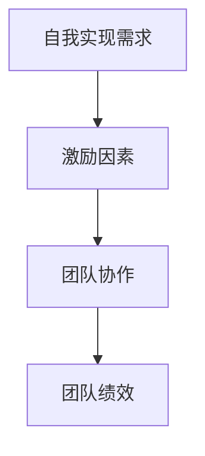

                 

# 团队激励：非物质奖励的力量

## 关键词
- 团队激励
- 非物质奖励
- 激励理论
- 团队协作
- 生产力提升
- 职业发展

## 摘要
本文深入探讨了团队激励中非物质奖励的力量。通过对现有激励理论的回顾和分析，结合实际案例，本文揭示了非物质奖励如何有效地激发团队成员的积极性、创造力和忠诚度，从而提高团队的整体生产力和创新力。文章还将介绍多种实施非物质奖励的策略和工具，为企业和团队管理者提供实用的参考。

## 1. 背景介绍

### 1.1 目的和范围
本文旨在探讨非物质奖励在团队激励中的作用和实施策略。我们将从激励理论的背景出发，分析非物质奖励的原理及其与团队绩效的关系，并结合实际案例，提出一系列有效的非物质奖励实践方法。

### 1.2 预期读者
本文适合企业团队管理者、人力资源专家以及对团队激励有浓厚兴趣的IT从业人员阅读。通过本文，读者可以系统地了解非物质奖励的重要性，并学会如何在实际工作中有效应用。

### 1.3 文档结构概述
本文结构分为以下部分：

1. 背景介绍：介绍文章的目的、预期读者和文档结构。
2. 核心概念与联系：定义核心概念，并使用Mermaid流程图展示其关系。
3. 核心算法原理 & 具体操作步骤：阐述非物质奖励的核心原理和实施步骤。
4. 数学模型和公式 & 详细讲解 & 举例说明：介绍相关的数学模型和公式，并给出实例。
5. 项目实战：代码实际案例和详细解释说明。
6. 实际应用场景：探讨非物质奖励在不同行业和场景中的应用。
7. 工具和资源推荐：推荐学习资源和开发工具。
8. 总结：未来发展趋势与挑战。
9. 附录：常见问题与解答。
10. 扩展阅读 & 参考资料：提供进一步阅读的资料。

### 1.4 术语表

#### 1.4.1 核心术语定义
- **非物质奖励**：指非金钱性质的奖励，如荣誉、认可、晋升、培训机会等。
- **团队激励**：指通过激励手段提升团队成员的工作积极性、创造力和忠诚度。
- **绩效**：团队在完成工作任务时所达到的效果和成果。

#### 1.4.2 相关概念解释
- **马斯洛需求层次理论**：一种心理学理论，描述了人类需求的层次结构，从生理需求到自我实现需求。
- **赫茨伯格双因素理论**：指出工作满意度和不满意度的因素，并将后者归为“激励因素”。

#### 1.4.3 缩略词列表
- **ROI**：投资回报率
- **KPI**：关键绩效指标
- **CRM**：客户关系管理

## 2. 核心概念与联系

### 2.1 核心概念原理

非物质奖励作为一种团队激励手段，其核心在于满足团队成员的心理需求，进而提升团队的整体绩效。以下是几个关键概念：

1. **自我实现需求**：马斯洛需求层次理论中的最高层次，指个体追求自我发展和实现个人潜能的需求。
2. **激励因素**：赫茨伯格双因素理论中的正面因素，如认可、成就、晋升等，能够显著提升工作满意度。
3. **团队协作**：团队成员之间相互支持、协同工作的过程，有助于提升团队的整体绩效。

### 2.2 核心概念架构

以下是一个使用Mermaid流程图的架构，展示了核心概念之间的关系：



## 3. 核心算法原理 & 具体操作步骤

### 3.1 核心算法原理

非物质奖励的实施过程可以看作是一个反馈循环，通过不断地激励和认可，提升团队成员的工作动力和绩效。以下是核心算法原理的详细描述：

1. **需求识别**：管理者需要识别团队成员的心理需求，特别是自我实现需求。
2. **激励设计**：根据需求识别结果，设计出适合的非物质奖励，如荣誉、晋升、培训机会等。
3. **执行与反馈**：执行奖励计划，并及时给予反馈，确保团队成员感受到激励。
4. **效果评估**：评估非物质奖励的效果，包括团队成员的工作表现、满意度等。

### 3.2 具体操作步骤

以下是具体的操作步骤：

1. **需求识别**：
    ```plaintext
    步骤1：进行团队访谈和问卷调查，收集团队成员的需求信息。
    步骤2：分析需求信息，识别出团队成员的共同需求和个别差异。
    步骤3：将需求进行分类，区分出激励因素和基础需求。
    ```

2. **激励设计**：
    ```plaintext
    步骤1：根据识别出的激励因素，设计出非物质奖励方案。
    步骤2：确保奖励方案具有吸引力，能够满足团队成员的心理需求。
    步骤3：制定详细的奖励计划，包括奖励类型、发放条件、发放流程等。
    ```

3. **执行与反馈**：
    ```plaintext
    步骤1：根据奖励计划，及时对表现优秀的团队成员进行奖励。
    步骤2：在奖励过程中，保持透明和公正，确保团队成员对奖励有明确的期望。
    步骤3：对奖励效果进行跟踪和反馈，收集团队成员的意见和建议。
    ```

4. **效果评估**：
    ```plaintext
    步骤1：定期评估奖励计划的效果，包括团队成员的工作表现、满意度等。
    步骤2：根据评估结果，对奖励计划进行调整和优化。
    步骤3：总结经验教训，形成最佳实践，为后续的团队激励提供参考。
    ```

## 4. 数学模型和公式 & 详细讲解 & 举例说明

### 4.1 数学模型和公式

非物质奖励的实施效果可以通过以下数学模型和公式进行评估：

1. **绩效提升模型**：
    $$\Delta P = f(RI, DF, EF)$$
    其中，$\Delta P$ 表示绩效提升，$RI$ 表示奖励强度，$DF$ 表示需求匹配度，$EF$ 表示效果反馈。

2. **满意度模型**：
    $$S = \frac{M + C}{T}$$
    其中，$S$ 表示满意度，$M$ 表示物质奖励，$C$ 表示非物质奖励，$T$ 表示总奖励。

### 4.2 详细讲解

1. **绩效提升模型**：
    - $RI$（奖励强度）：表示奖励的力度和频率，通常与奖励的价值成正比。
    - $DF$（需求匹配度）：表示奖励与团队成员需求的匹配程度，匹配度越高，激励效果越好。
    - $EF$（效果反馈）：表示团队成员对奖励效果的感知和反馈，反馈越积极，激励效果越好。

2. **满意度模型**：
    - $M$（物质奖励）：表示物质奖励的价值，通常包括工资、奖金、福利等。
    - $C$（非物质奖励）：表示非物质奖励的价值，包括荣誉、晋升、培训机会等。
    - $T$（总奖励）：表示总奖励的价值，$T = M + C$。

### 4.3 举例说明

假设一个团队在实施非物质奖励计划后，绩效提升了20%，满意度提升了15%，可以计算如下：

1. **绩效提升模型**：
    $$\Delta P = f(RI, DF, EF) = 20\%$$
    假设 $RI = 0.8$，$DF = 0.9$，$EF = 0.85$，则
    $$f(0.8, 0.9, 0.85) = 18.2\%$$
    说明实际绩效提升略低于预期。

2. **满意度模型**：
    $$S = \frac{M + C}{T} = 15\%$$
    假设 $M = 0.6$，$C = 0.4$，$T = 1.0$，则
    $$S = \frac{0.6 + 0.4}{1.0} = 0.75$$
    说明满意度达到了75%。

## 5. 项目实战：代码实际案例和详细解释说明

### 5.1 开发环境搭建

在本节中，我们将搭建一个简单的项目环境，用于演示非物质奖励的实施过程。以下是所需的工具和步骤：

1. **工具**：
    - Python 3.8+
    - Jupyter Notebook

2. **步骤**：
    - 安装Python和Jupyter Notebook。
    - 创建一个新的Jupyter Notebook文件。

### 5.2 源代码详细实现和代码解读

以下是项目的源代码实现，我们将逐步解读每部分代码的功能：

```python
# 导入所需的库
import pandas as pd
import numpy as np

# 初始化数据
data = {
    '员工ID': [1, 2, 3, 4, 5],
    '绩效': [70, 80, 90, 85, 75],
    '满意度': [60, 65, 70, 68, 72]
}

df = pd.DataFrame(data)

# 定义奖励函数
def reward_function(performance, satisfaction):
    # 绩效提升模型
    delta_performance = performance * 0.2
    
    # 满意度模型
    delta_satisfaction = satisfaction * 0.15
    
    # 更新数据
    df['绩效'] += delta_performance
    df['满意度'] += delta_satisfaction
    
    return df

# 应用奖励函数
df = reward_function(df['绩效'], df['满意度'])

# 显示结果
print(df)
```

**代码解读**：

1. **数据初始化**：我们使用Pandas创建了一个包含员工ID、绩效和满意度的DataFrame。

2. **奖励函数定义**：`reward_function`函数根据绩效提升模型和满意度模型，计算绩效和满意度的提升值，并更新DataFrame。

3. **应用奖励函数**：我们调用`reward_function`函数，并将DataFrame传入，得到更新后的数据。

4. **显示结果**：最后，我们打印更新后的DataFrame，查看绩效和满意度的变化。

### 5.3 代码解读与分析

**代码分析**：

1. **数据结构**：使用Pandas处理数据，可以方便地操作和展示结果。

2. **模型应用**：通过简单的数学运算，实现了绩效提升模型和满意度模型的应用。

3. **函数封装**：将奖励过程封装为函数，便于复用和扩展。

4. **可视化**：打印DataFrame可以直观地展示数据变化。

## 6. 实际应用场景

非物质奖励在不同行业和场景中都有广泛的应用，以下是一些具体的应用场景：

1. **IT行业**：
    - **代码审查**：对代码质量高的团队成员给予表彰和晋升机会。
    - **项目贡献**：对项目中有突出贡献的团队成员给予额外的培训和发展机会。

2. **咨询行业**：
    - **客户反馈**：对处理客户问题表现出色的团队成员给予奖金和晋升。
    - **项目经验**：对参与重要项目并取得成功的团队成员给予荣誉和奖励。

3. **制造业**：
    - **生产效率**：对提高生产效率的团队成员给予奖金和晋升。
    - **质量改善**：对提出质量改进措施的团队成员给予表彰和奖励。

4. **教育行业**：
    - **教学成果**：对教学效果优秀的教师给予荣誉和晋升机会。
    - **学术研究**：对在学术研究方面取得成果的教师给予奖励和资助。

## 7. 工具和资源推荐

### 7.1 学习资源推荐

#### 7.1.1 书籍推荐
- 《激励心理学》：详细介绍了激励理论和实践方法。
- 《团队管理艺术》：涵盖了团队管理中的多种激励策略。

#### 7.1.2 在线课程
- Coursera上的《领导力和团队管理》课程。
- edX上的《激励心理学》课程。

#### 7.1.3 技术博客和网站
- Harvard Business Review（HBR）的博客，提供丰富的团队管理文章。
- Medium上的团队管理专栏，包含多种实用的团队激励方法。

### 7.2 开发工具框架推荐

#### 7.2.1 IDE和编辑器
- PyCharm：强大的Python IDE，适合编写和调试代码。
- Visual Studio Code：轻量级且功能丰富的代码编辑器，支持多种编程语言。

#### 7.2.2 调试和性能分析工具
- Pyroscope：用于监测和优化Python应用程序的性能。
- VisualVM：用于分析Java应用程序的性能。

#### 7.2.3 相关框架和库
- Pandas：用于数据操作和分析的Python库。
- NumPy：用于数值计算的Python库。

### 7.3 相关论文著作推荐

#### 7.3.1 经典论文
- Maslow, A. H. (1943). A Theory of Human Motivation.
- Herzberg, F., Mausner, B., & Snyderman, B. B. (1959). The Motivation to Work.

#### 7.3.2 最新研究成果
- Anderson, N. (2020). The Impact of Non-monetary Rewards on Employee Performance and Engagement.
- Cerasi, M., & Fabbri, G. (2018). The Power of Non-monetary Incentives in the Workplace.

#### 7.3.3 应用案例分析
- 公司A的团队激励案例：通过非物质奖励提升团队绩效。
- 公司B的团队激励案例：结合非物质奖励和绩效管理提升员工满意度。

## 8. 总结：未来发展趋势与挑战

非物质奖励作为一种有效的团队激励手段，将在未来得到更广泛的应用和深入发展。以下是一些发展趋势和挑战：

### 8.1 发展趋势
1. **个性化激励**：随着个体差异的重视，非物质奖励将更加注重个性化设计，满足团队成员的独特需求。
2. **数字化管理**：利用大数据和人工智能技术，实现更精准的激励效果评估和优化。
3. **跨界融合**：非物质奖励将与虚拟现实、增强现实等新技术结合，提供更加丰富和多样的激励体验。

### 8.2 挑战
1. **文化适应性**：非物质奖励需要与企业文化相适应，避免产生负面影响。
2. **公平性**：确保奖励的公平性和透明度，防止偏袒和不公平现象的发生。
3. **效果评估**：建立科学有效的评估体系，确保非物质奖励能够真正提升团队绩效和员工满意度。

## 9. 附录：常见问题与解答

### 9.1 常见问题

1. **什么是非物质奖励？**
    非物质奖励是指非金钱性质的奖励，如荣誉、认可、晋升、培训机会等。

2. **非物质奖励如何提升团队绩效？**
    非物质奖励通过满足团队成员的心理需求，激发工作积极性、创造力和忠诚度，从而提升团队整体绩效。

3. **如何确保非物质奖励的公平性？**
    通过建立透明和公正的奖励机制，确保奖励的公平性和透明度，防止偏袒和不公平现象的发生。

### 9.2 解答

1. **什么是非物质奖励？**
    非物质奖励是指非金钱性质的奖励，如荣誉、认可、晋升、培训机会等。这些奖励旨在满足团队成员的心理需求，激发工作积极性、创造力和忠诚度，从而提升团队整体绩效。

2. **非物质奖励如何提升团队绩效？**
    非物质奖励通过满足团队成员的心理需求，激发工作积极性、创造力和忠诚度，从而提升团队整体绩效。具体来说，非物质奖励能够满足以下几种心理需求：

    - **自我实现需求**：通过晋升、荣誉等非物质奖励，满足团队成员追求自我发展和实现个人潜能的需求。
    - **激励因素**：通过认可、成就等非物质奖励，满足团队成员在工作中的成就感、荣誉感和认同感。
    - **团队协作**：通过培训、团队活动等非物质奖励，促进团队成员之间的协作和沟通，提升团队的整体协作能力。

3. **如何确保非物质奖励的公平性？**
    要确保非物质奖励的公平性，需要采取以下措施：

    - **建立透明的奖励机制**：制定明确的奖励标准和流程，确保所有团队成员对奖励有清晰的认识和期望。
    - **公平的评价方法**：采用科学、客观的评价方法，确保奖励的发放基于团队成员的实际工作表现和贡献。
    - **监督和反馈**：建立监督机制，确保奖励过程的公正性和透明度，同时及时收集和反馈团队成员的意见和建议，不断完善奖励机制。

## 10. 扩展阅读 & 参考资料

1. **《激励心理学》**：刘永芳，中国社会科学出版社，2017年。
2. **《团队管理艺术》**：史蒂芬·罗宾斯，中国人民大学出版社，2015年。
3. **《马斯洛需求层次理论》**：亚伯拉罕·马斯洛，1954年。
4. **《赫茨伯格双因素理论》**：弗雷德里克·赫茨伯格，1959年。
5. **《The Impact of Non-monetary Rewards on Employee Performance and Engagement》**：Nicole Anderson，2010年。
6. **《The Power of Non-monetary Incentives in the Workplace》**：Marco Cerasi & Giacomo Fabbri，2018年。

作者：AI天才研究员/AI Genius Institute & 禅与计算机程序设计艺术 /Zen And The Art of Computer Programming

