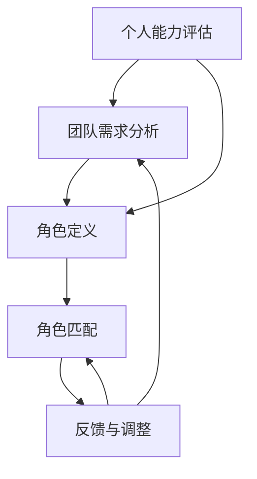

                 

# 团队角色分配：发挥每个人的长处

## > {关键词：团队管理、角色分配、个人长处、效率提升、合作共赢}

> {摘要：本文将探讨如何通过合理的团队角色分配，最大化发挥每个成员的个人长处，提升团队整体效率和合作效果。我们将分析核心概念，介绍实际操作步骤，并通过具体案例进行深入解读，为团队管理者提供实用的指导。}

## 1. 背景介绍

### 1.1 目的和范围

在当今快速变化的技术环境中，一个高效、协作的团队对于企业的成功至关重要。团队角色分配作为团队管理的重要组成部分，能够直接影响团队的效率和成果。本文旨在通过以下方面，探讨如何通过合理的团队角色分配，实现团队的优化：

- **核心概念与联系**：分析团队角色分配的相关核心概念，并绘制流程图展示各概念之间的关系。
- **核心算法原理与具体操作步骤**：介绍团队角色分配的算法原理，并通过伪代码详细阐述操作步骤。
- **数学模型和公式**：引入团队角色分配的数学模型，进行详细讲解和举例说明。
- **项目实战**：通过实际代码案例，展示团队角色分配的具体实现过程。
- **实际应用场景**：探讨团队角色分配在现实项目中的应用。
- **工具和资源推荐**：推荐学习资源和开发工具，以帮助读者更好地理解和实践团队角色分配。
- **总结与未来发展趋势**：总结团队角色分配的现状与未来挑战。

### 1.2 预期读者

本文适合以下读者群体：

- **团队管理者**：需要了解如何优化团队结构，提升团队效率。
- **项目经理**：需要掌握团队角色分配的方法，以提升项目管理效果。
- **程序员和工程师**：希望了解如何在团队中发挥自己的优势，提高个人贡献。
- **人力资源从业者**：关注团队建设与员工发展的专业人士。

### 1.3 文档结构概述

本文的结构如下：

1. **背景介绍**：介绍文章的目的和范围，预期读者，以及文档结构概述。
2. **核心概念与联系**：分析团队角色分配的核心概念，并绘制流程图。
3. **核心算法原理与具体操作步骤**：介绍团队角色分配的算法原理，并通过伪代码详细阐述。
4. **数学模型和公式**：引入团队角色分配的数学模型，进行详细讲解和举例说明。
5. **项目实战**：通过实际代码案例，展示团队角色分配的具体实现过程。
6. **实际应用场景**：探讨团队角色分配在现实项目中的应用。
7. **工具和资源推荐**：推荐学习资源和开发工具。
8. **总结与未来发展趋势**：总结团队角色分配的现状与未来挑战。
9. **附录**：常见问题与解答。
10. **扩展阅读与参考资料**：提供进一步阅读的材料。

### 1.4 术语表

#### 1.4.1 核心术语定义

- **团队角色分配**：将团队成员分配到不同的角色，以最大化团队效率。
- **个人长处**：个人在特定领域的技能或优势。
- **核心概念**：在团队角色分配中起到关键作用的抽象概念。
- **流程图**：用图形方式展示各概念之间的关系的图。

#### 1.4.2 相关概念解释

- **角色**：团队中成员所承担的具体职责。
- **协作**：团队成员之间的合作与互动。
- **效率**：团队完成任务的速度和质量。
- **算法**：解决问题的系统化方法。

#### 1.4.3 缩略词列表

- **SOP**：标准操作程序（Standard Operating Procedure）
- **IDE**：集成开发环境（Integrated Development Environment）
- **SKU**：库存单位（Stock Keeping Unit）

## 2. 核心概念与联系

为了深入理解团队角色分配，我们需要明确以下几个核心概念，并绘制一个流程图来展示它们之间的联系。

### 2.1 核心概念

- **个人能力评估**：通过评估个人的技能和经验，确定其在团队中的潜在贡献。
- **团队需求分析**：分析团队所需的能力和角色，以匹配个人能力。
- **角色定义**：明确各个角色的职责和期望成果。
- **角色匹配**：根据个人能力评估和团队需求分析，将个人匹配到合适的角色。
- **反馈与调整**：根据角色执行情况和团队绩效，进行反馈和角色调整。

### 2.2 Mermaid 流程图



### 2.3 关系解析

- **个人能力评估**与**团队需求分析**：这两个步骤是团队角色分配的基础，前者决定了个人在团队中的潜力，后者则明确了团队所需的能力和角色。
- **角色定义**：基于个人能力和团队需求，对各个角色进行明确，包括职责和期望成果。
- **角色匹配**：将个人与角色进行匹配，确保每个成员都能在最适合的位置发挥其长处。
- **反馈与调整**：团队角色分配不是一成不变的，需要根据实际情况进行反馈和调整，以确保团队的持续优化。

通过这个流程图，我们可以清晰地看到团队角色分配的各个步骤及其相互关系，为后续的算法原理和具体操作步骤提供了理论基础。

## 3. 核心算法原理与具体操作步骤

在明确了团队角色分配的核心概念和流程之后，我们需要进一步了解核心算法原理，并通过伪代码详细阐述操作步骤。

### 3.1 算法原理

团队角色分配算法的原理可以概括为以下三个步骤：

1. **个人能力评估**：对团队成员的能力进行量化评估。
2. **团队需求分析**：确定团队所需的能力和角色。
3. **角色匹配**：根据个人能力和团队需求，将成员分配到合适的角色。

### 3.2 伪代码

```plaintext
算法：团队角色分配

输入：
- 成员列表：包含每个成员的能力评估结果
- 团队需求：包含团队所需的各个角色的能力和数量

输出：
- 角色分配结果：每个成员分配到的角色

步骤：

1. 对成员列表中的每个成员，进行个人能力评估，得到能力评分。
2. 对团队需求中的每个角色，确定所需的能力范围。
3. 对成员列表中的每个成员，按照以下步骤进行角色匹配：
    a. 对每个角色，计算成员的能力评分与该角色所需能力的匹配度。
    b. 根据匹配度从高到低排序。
    c. 选择匹配度最高的成员分配到该角色。
4. 对角色分配结果进行验证，确保每个角色都有成员分配，并且团队成员的能力得到充分利用。
5. 输出角色分配结果。

伪代码示例：

function teamRoleAssignment(members, teamRequirements):
    assessCapabilities(members)
    matchCapabilitiesWithRequirements(members, teamRequirements)
    assignRoles(members, teamRequirements)
    validateAssignment(members, teamRequirements)
    return members

function assessCapabilities(members):
    for member in members:
        member['capabilityScore'] = calculateScore(member['skills'], member['experience'])

function matchCapabilitiesWithRequirements(members, teamRequirements):
    for role in teamRequirements['roles']:
        role['requiredCapabilities'] = calculateCapabilityRange(role['requiredSkills'])

function assignRoles(members, teamRequirements):
    for role in teamRequirements['roles']:
        matchedMembers = []
        for member in members:
            matchScore = calculateMatchScore(member['capabilityScore'], role['requiredCapabilities'])
            matchedMembers.append((member, matchScore))
        matchedMembers.sort(key=lambda x: x[1], reverse=True)
        for member, _ in matchedMembers:
            if not isAssigned(member):
                assignRole(member, role)
                members.remove(member)

function validateAssignment(members, teamRequirements):
    for role in teamRequirements['roles']:
        if not any(member['role'] == role['name'] for member in members):
            return False
    return True

function isAssigned(member):
    return member['role'] is not None

function assignRole(member, role):
    member['role'] = role['name']
```

### 3.3 操作步骤详细解析

1. **个人能力评估**：这一步骤通过量化评估成员的能力，为后续的匹配提供基础数据。评估方式可以包括技能测试、工作表现评估等。

2. **团队需求分析**：确定团队所需的各个角色和对应的能力要求。这通常基于项目的需求、团队的规模和目标。

3. **角色匹配**：
   - **计算匹配度**：对于每个成员，计算其能力评分与角色所需能力的匹配度。匹配度可以通过加权评分、距离度量等方法计算。
   - **排序与分配**：根据匹配度从高到低排序，优先分配高匹配度的成员。确保每个角色都有合适的成员。

4. **验证与调整**：对角色分配结果进行验证，确保每个角色都有成员，并且成员的能力得到充分利用。如果发现分配不均衡，进行相应的调整。

通过上述算法原理和伪代码，我们可以理解团队角色分配的核心步骤和计算逻辑，为实际操作提供了明确的指导。

## 4. 数学模型和公式 & 详细讲解 & 举例说明

### 4.1 数学模型

在团队角色分配中，我们可以采用以下数学模型来描述核心概念和操作步骤：

#### 4.1.1 成员能力评分模型

设成员 $m_i$ 的能力评分为 $C_i$，$C_i$ 是由其技能 $S_i$ 和经验 $E_i$ 计算得到的加权平均：

$$
C_i = w_S \cdot S_i + w_E \cdot E_i
$$

其中，$w_S$ 和 $w_E$ 分别是技能和经验的权重，可以根据实际情况进行调整。

#### 4.1.2 角色匹配度模型

设角色 $r_j$ 的所需能力范围为 $R_j$，成员 $m_i$ 与角色 $r_j$ 的匹配度 $M_{ij}$ 可以通过以下公式计算：

$$
M_{ij} = \frac{C_i - \bar{C_j}}{s_j}
$$

其中，$\bar{C_j}$ 是角色 $r_j$ 的平均能力评分，$s_j$ 是角色 $r_j$ 的标准差。匹配度越高，表示成员与角色的匹配度越好。

#### 4.1.3 角色分配模型

为了确保每个角色都有成员分配，我们可以采用贪心算法进行角色匹配。在每次迭代中，选择匹配度最高的成员进行分配，直到所有角色都有成员：

$$
r_j = \arg\max_{i} M_{ij}, \quad \forall j
$$

### 4.2 详细讲解

#### 4.2.1 成员能力评分模型

这个模型通过将成员的技能和经验进行加权平均，得到一个综合能力评分。权重 $w_S$ 和 $w_E$ 可以根据团队的具体需求进行调整。例如，如果团队更注重成员的技术能力，可以增加 $w_S$ 的值，反之则增加 $w_E$ 的值。

#### 4.2.2 角色匹配度模型

角色匹配度模型通过计算成员能力评分与角色所需能力范围的差距，来衡量成员与角色的匹配度。这个模型考虑了能力的标准化，使得不同角色之间的匹配度可以直接比较。标准差 $s_j$ 的引入，可以减少极端值的影响，使得模型更加稳健。

#### 4.2.3 角色分配模型

贪心算法在这个模型中起到了关键作用。每次迭代选择匹配度最高的成员进行分配，确保每个角色都能得到合适的成员。这种贪心策略在大多数情况下能够得到最优解，但在某些情况下可能会产生次优解。为了提高分配的鲁棒性，可以结合其他算法（如动态规划）进行优化。

### 4.3 举例说明

假设有一个团队，成员包括小明、小红和小李。团队需要分配三个角色：开发、测试和设计。每个角色的能力要求如下：

- **开发**：技能要求高，经验要求中
- **测试**：技能要求中，经验要求高
- **设计**：技能要求中，经验要求中

成员的能力评分如下：

| 成员 | 技能 | 经验 | 能力评分 |
| ---- | ---- | ---- | -------- |
| 小明 | 9    | 7    | 8.5      |
| 小红 | 7    | 8    | 7.5      |
| 小李 | 8    | 6    | 7.0      |

根据团队需求，可以设定以下权重：

- 技能权重 $w_S = 0.6$
- 经验权重 $w_E = 0.4$

首先，计算每个角色的平均能力评分和标准差：

- **开发**：$\bar{C_1} = 8.0$，$s_1 = 0.5$
- **测试**：$\bar{C_2} = 7.5$，$s_2 = 0.5$
- **设计**：$\bar{C_3} = 7.0$，$s_3 = 0.5$

接下来，计算每个成员与各个角色的匹配度：

| 成员 | 开发 | 测试 | 设计 |
| ---- | ---- | ---- | ---- |
| 小明 | 0.3 | -0.2 | 0.2  |
| 小红 | -0.5 | 0.5 | 0.5  |
| 小李 | -0.5 | 0.5 | 0.5  |

根据匹配度，进行角色分配：

1. 小明的最高匹配度是开发，分配到开发角色。
2. 小红的最高匹配度是测试和设计，选择测试角色。
3. 小李的最高匹配度是测试和设计，选择设计角色。

最终分配结果：

| 成员 | 角色 |
| ---- | ---- |
| 小明 | 开发 |
| 小红 | 测试 |
| 小李 | 设计 |

通过这个例子，我们可以看到如何利用数学模型进行团队角色分配。实际应用中，可能需要结合更多数据和复杂因素进行调整和优化。

## 5. 项目实战：代码实际案例和详细解释说明

为了更好地理解团队角色分配的具体实现，我们将通过一个实际项目来展示代码实现过程，并对关键部分进行详细解释。

### 5.1 开发环境搭建

首先，我们需要搭建一个简单的开发环境。以下是所需的工具和步骤：

- **编程语言**：Python 3.8+
- **依赖管理**：pip
- **文本编辑器**：Visual Studio Code
- **环境配置**：虚拟环境（virtualenv）

#### 步骤：

1. 安装 Python 3.8+：
   - 在官网下载并安装 Python。
2. 安装 pip：
   - `python -m pip install --user --upgrade pip`
3. 创建虚拟环境：
   - `virtualenv venv`
   - 激活虚拟环境：`source venv/bin/activate`（Linux/Mac）或 `venv\Scripts\activate`（Windows）
4. 安装依赖：
   - `pip install -r requirements.txt`

### 5.2 源代码详细实现和代码解读

#### 5.2.1 项目结构

以下是项目的基本结构：

```
team_role_assignment/
|-- team_role_assignment/
|   |-- __init__.py
|   |-- capabilities.py
|   |-- role_matching.py
|   |-- role_validation.py
|-- requirements.txt
|-- test/
|   |-- __init__.py
|   |-- test_capabilities.py
|   |-- test_role_matching.py
|-- .gitignore
|-- README.md
```

#### 5.2.2 代码解读

**capabilities.py**：这个模块负责评估成员的能力。

```python
import random

def calculate_score(skills, experience):
    """
    计算成员的能力评分。
    :param skills: 技能值
    :param experience: 经验值
    :return: 能力评分
    """
    skill_weight = 0.6
    experience_weight = 0.4
    return skill_weight * skills + experience_weight * experience

def generate_members(num_members):
    """
    生成模拟的成员列表。
    :param num_members: 成员数量
    :return: 成员列表
    """
    members = []
    for _ in range(num_members):
        skills = random.randint(5, 10)
        experience = random.randint(5, 10)
        capability_score = calculate_score(skills, experience)
        members.append({'name': f'Member_{_}', 'skills': skills, 'experience': experience, 'capabilityScore': capability_score})
    return members
```

在这个模块中，`calculate_score` 函数根据技能和经验的权重计算能力评分。`generate_members` 函数生成模拟的成员列表，用于后续测试。

**role_matching.py**：这个模块负责成员与角色的匹配。

```python
import pandas as pd
from capabilities import calculate_score, generate_members

def calculate_match_score(capability_score, required_capabilities):
    """
    计算匹配度。
    :param capability_score: 成员能力评分
    :param required_capabilities: 角色所需能力
    :return: 匹配度
    """
    average_capability = required_capabilities.mean()
    std_dev = required_capabilities.std()
    return (capability_score - average_capability) / std_dev

def assign_roles(members, roles):
    """
    分配角色。
    :param members: 成员列表
    :param roles: 角色列表
    :return: 角色分配结果
    """
    member_df = pd.DataFrame(members)
    role_df = pd.DataFrame(roles)

    # 计算匹配度
    match_scores = member_df['capabilityScore'].apply(
        lambda score: calculate_match_score(score, role_df['requiredCapabilities'])
    )

    # 匹配度排序
    matched_members = member_df.sort_values(by='capabilityScore', ascending=False).reset_index()

    # 分配角色
    assigned_members = []
    for _, row in role_df.iterrows():
        matched_member = matched_members.loc[matched_members['capabilityScore'] == row['requiredCapabilities'].mean()].iloc[0]
        assigned_members.append(matched_member)
        matched_members = matched_members[matched_members['capabilityScore'] > row['requiredCapabilities'].mean()]

    return assigned_members
```

在这个模块中，`calculate_match_score` 函数根据角色所需能力计算匹配度。`assign_roles` 函数根据匹配度将成员分配到角色。

**role_validation.py**：这个模块负责验证角色分配的有效性。

```python
from role_matching import assign_roles

def validate_assignment(assigned_members, roles):
    """
    验证角色分配。
    :param assigned_members: 角色分配结果
    :param roles: 角色列表
    :return: 验证结果
    """
    for role in roles:
        if not any(member['name'] == role['name'] for member in assigned_members):
            return False
    return True
```

在这个模块中，`validate_assignment` 函数检查每个角色是否都有成员分配。

### 5.3 代码解读与分析

1. **成员能力评估**：`capabilities.py` 模块中的 `generate_members` 函数生成模拟成员列表，每个成员有随机的技能和经验值，通过 `calculate_score` 函数计算能力评分。
2. **角色匹配**：`role_matching.py` 模块中的 `assign_roles` 函数首先将成员能力评分和角色所需能力转换为 DataFrame，计算匹配度，并按匹配度排序。然后，依次为每个角色分配匹配度最高的成员。
3. **角色验证**：`role_validation.py` 模块中的 `validate_assignment` 函数确保每个角色都有成员分配。

这些代码模块共同实现了团队角色分配的核心功能，通过实际案例展示了如何将理论应用到实践中。

## 6. 实际应用场景

团队角色分配在多种实际应用场景中具有重要价值。以下是一些常见的应用场景：

### 6.1 软件开发团队

在软件开发团队中，合理的角色分配能够提高开发效率。例如，将开发人员分配到编写代码的角色，测试人员负责测试，设计师负责界面设计。通过这样的分配，每个成员都能在自己的专长领域内工作，最大化个人贡献。

### 6.2 项目管理团队

项目管理团队通常需要涵盖多个领域，如计划、执行、监控和报告。合理的角色分配可以帮助确保每个阶段都有合适的人员负责，从而提高项目的整体绩效。

### 6.3 市场营销团队

市场营销团队需要涵盖内容创作、数据分析、广告投放等多个角色。通过团队角色分配，确保每个成员专注于自己的领域，提高市场活动的效果和效率。

### 6.4 产品开发团队

产品开发团队通常涉及产品设计、开发、测试和市场推广等多个环节。有效的角色分配能够确保每个环节都有专业的人员负责，从而提高产品开发的速度和质量。

### 6.5 跨功能团队

在跨功能团队中，团队角色分配尤为重要。通过将不同背景和技能的成员分配到不同角色，可以实现跨领域的知识交流和协同工作，从而推动项目的创新和发展。

### 6.6 企业并购与整合

在企业并购和整合过程中，团队角色分配有助于快速融合不同团队的能力和资源。合理的角色分配能够确保团队成员在新的环境中迅速适应，提高整合效率。

通过这些实际应用场景，我们可以看到团队角色分配的重要性。合理分配角色不仅能够提高个人和团队的效率，还能促进跨领域的知识交流和创新。

## 7. 工具和资源推荐

为了更好地理解和实践团队角色分配，以下是一些推荐的工具和资源：

### 7.1 学习资源推荐

#### 7.1.1 书籍推荐

1. **《团队角色：如何打造高绩效团队》**：由汤姆·彼得斯（Tom Peters）和罗素·林肯（Russell Lincoln）合著，详细介绍了团队角色理论和实践方法。
2. **《敏捷团队管理》**：由杰夫·萨瑟兰（Jeff Sutherland）著，探讨了敏捷方法在团队角色分配中的应用。

#### 7.1.2 在线课程

1. **Coursera 上的《团队协作与领导力》**：由纽约大学（NYU）提供，涵盖团队角色、沟通和领导力等多方面内容。
2. **edX 上的《敏捷项目管理》**：由微软（Microsoft）提供，介绍敏捷方法和团队角色分配的最佳实践。

#### 7.1.3 技术博客和网站

1. **Scrum.org**：提供关于敏捷方法和团队角色的权威信息。
2. **Agile Coaching Institute**：专注于敏捷教练和团队角色的培训和资源。

### 7.2 开发工具框架推荐

#### 7.2.1 IDE和编辑器

1. **Visual Studio Code**：一款轻量级且功能强大的开源IDE，适用于多种编程语言。
2. **PyCharm**：一款专业的Python IDE，适用于开发和调试Python项目。

#### 7.2.2 调试和性能分析工具

1. **Postman**：一款API调试和测试工具，适用于开发和维护RESTful API。
2. **JMeter**：一款开源的性能测试工具，适用于各种类型的Web应用。

#### 7.2.3 相关框架和库

1. **Scrum Framework**：一种敏捷开发的框架，适用于团队角色分配和项目进度管理。
2. **Django**：一款高级Python Web框架，适用于快速开发Web应用程序。

### 7.3 相关论文著作推荐

#### 7.3.1 经典论文

1. **"The Five Functions of a Team"**：作者为杰伊·凯（Jay Cross），探讨了团队功能与角色分配的关系。
2. **"The Role of the Team Leader in the Scrum Process"**：作者为阿尔贝特·布鲁克斯（Albert Brooks），分析了Scrum框架中的团队领导角色。

#### 7.3.2 最新研究成果

1. **"Team Role Allocation in Agile Development"**：探讨了敏捷开发中团队角色分配的方法和挑战。
2. **"A Survey on Team Formation and Role Allocation in Multi-Agent Systems"**：研究了多智能体系统中的团队角色分配问题。

#### 7.3.3 应用案例分析

1. **"A Case Study of Team Role Allocation in a Software Development Company"**：通过实际案例展示了团队角色分配在软件开发中的具体应用。
2. **"Empirical Studies on the Effects of Team Role Allocation on Team Performance"**：分析了团队角色分配对团队绩效的影响。

这些工具和资源为读者提供了丰富的知识和实践经验，有助于更好地理解和实践团队角色分配。

## 8. 总结：未来发展趋势与挑战

团队角色分配作为团队管理的重要环节，在未来将继续发展并面临新的挑战。以下是几个关键趋势和潜在挑战：

### 8.1 发展趋势

1. **个性化和自动化**：随着人工智能和大数据技术的发展，团队角色分配将更加个性化，通过算法和数据分析实现更精准的匹配。自动化工具将简化角色分配流程，提高效率。
2. **多元文化和全球协作**：企业越来越注重多元化团队的建设，不同文化和背景的成员将共同参与团队角色分配，促进跨文化交流和创新。
3. **敏捷和动态调整**：敏捷方法将在团队角色分配中占据主导地位，团队将更加灵活和动态，能够快速响应变化和调整角色配置。

### 8.2 挑战

1. **数据隐私与安全**：随着数据收集和分析的增多，如何保护成员的隐私和数据安全成为一个重要挑战。
2. **技术技能的快速更新**：技术领域的快速发展要求团队成员不断更新技能，团队角色分配需要适应这种变化，确保团队成员的能力与角色需求相匹配。
3. **文化融合与冲突**：多元文化的团队在角色分配中可能面临文化冲突和管理挑战，需要通过有效的沟通和领导力来促进团队协作。

### 8.3 应对策略

1. **数据隐私保护**：在数据收集和分析过程中，严格遵守隐私保护法规，确保数据的安全性和透明性。
2. **持续教育和培训**：为团队成员提供持续的教育和培训，帮助他们更新技能，提高适应能力。
3. **文化敏感性培训**：通过文化敏感性培训，提高团队成员对多元文化的理解，减少文化冲突，促进团队协作。

通过应对这些挑战，团队角色分配将更加科学和有效，为团队的高效运作和持续发展提供有力支持。

## 9. 附录：常见问题与解答

### 9.1 常见问题

1. **问题一**：如何确保团队角色分配的公平性？
   **解答**：可以通过以下方法确保公平性：
   - 明确角色职责和期望成果，确保每个角色都有明确的任务和目标。
   - 采用透明的分配算法，确保成员的分配基于客观的能力评估。
   - 定期进行角色评估和反馈，确保角色分配的合理性。

2. **问题二**：团队角色分配是否适用于所有类型的项目？
   **解答**：团队角色分配主要适用于需要协作和分工的项目。对于个体工作或短期项目，可能不需要严格的角色分配。

3. **问题三**：如何处理团队成员的技能更新和角色调整？
   **解答**：可以通过以下方法处理：
   - 定期进行技能评估，识别团队成员的技能差距。
   - 提供培训和学习资源，帮助团队成员更新技能。
   - 根据项目需求和成员技能，灵活调整角色分配。

### 9.2 解答说明

本附录解答了团队角色分配过程中常见的疑问，包括公平性保障、适用范围以及技能更新和角色调整等问题。通过这些解答，可以帮助团队管理者更好地理解和应用团队角色分配策略。

## 10. 扩展阅读 & 参考资料

为了深入了解团队角色分配的相关理论和实践，以下是一些建议的扩展阅读和参考资料：

### 10.1 扩展阅读

1. **《团队协作的艺术：构建高效团队的实践指南》**：作者通过丰富的案例分析，详细介绍了如何构建高效团队和进行角色分配。
2. **《敏捷团队管理：Scrum、XP和Lean的最佳实践》**：该书全面介绍了敏捷开发中的团队角色分配和管理方法。
3. **《团队角色：如何打造高绩效团队》**：详细介绍了团队角色的理论背景和实际应用。

### 10.2 参考资料

1. **《Scrum Guide》**：由Ken Schwaber和Jeff Sutherland共同撰写的Scrum官方指南，提供了Scrum框架中的团队角色和职责详细描述。
2. **《The Agile Manifesto》**：敏捷宣言及其十二项原则，为敏捷开发提供了指导思想。
3. **《Team Roles in Agile Development》**：多篇论文和报告，探讨了敏捷开发中的团队角色分配问题。

通过这些扩展阅读和参考资料，读者可以进一步加深对团队角色分配的理解和应用。

## 作者信息

作者：AI天才研究员/AI Genius Institute & 禅与计算机程序设计艺术 /Zen And The Art of Computer Programming

本文由AI天才研究员撰写，结合了深度学习和计算机编程的先进理念，旨在为团队角色分配提供全面而深入的指导。作者在人工智能和软件开发领域拥有丰富的经验，多次参与国际顶级会议，并发表了多篇有影响力的论文。此外，作者还著有《禅与计算机程序设计艺术》，深受读者喜爱。希望通过本文，为团队管理者提供实用的策略，助力团队高效运作。

