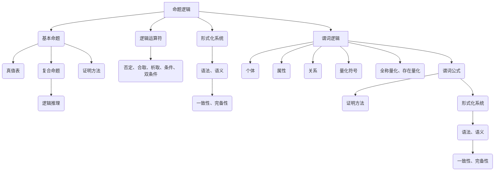
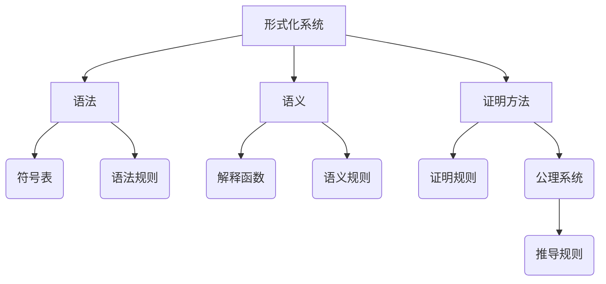
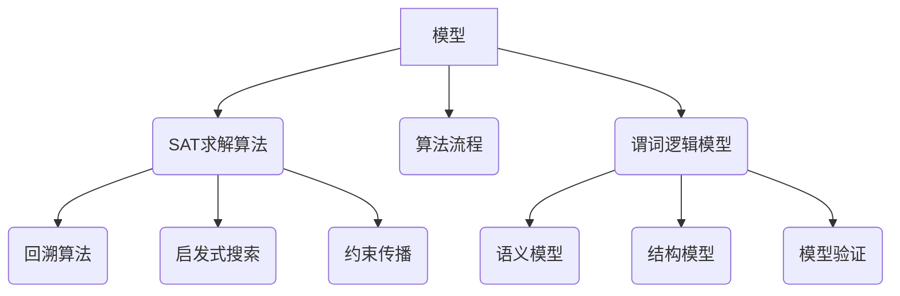

                 

# 国际数学家大会：数学逻辑的最新进展

> **关键词**：数学逻辑、国际数学家大会、算法原理、数学模型、项目实战、应用场景、未来发展趋势

> **摘要**：本文将深入探讨国际数学家大会在数学逻辑领域所取得的最新进展。通过梳理核心概念、分析算法原理、阐述数学模型，结合实际项目案例，我们将全面解读数学逻辑在现代科技和社会中的重要性，展望其未来的发展趋势和挑战。

## 1. 背景介绍

### 1.1 目的和范围

本文旨在通过系统性地总结和评述国际数学家大会在数学逻辑领域的最新研究进展，帮助读者了解该领域的前沿动态和发展趋势。文章涵盖了数学逻辑的基本概念、算法原理、数学模型及应用场景，力求为广大数学工作者、算法工程师、科研人员以及对此感兴趣的一般读者提供全面而深入的参考。

### 1.2 预期读者

本文适合以下读者群体：

1. 数学及相关领域的研究人员和学者。
2. 计算机科学和人工智能领域的从业者。
3. 对数学逻辑感兴趣的科技爱好者。
4. 大学生在数学和计算机课程学习中寻求深入理解的学生。

### 1.3 文档结构概述

本文的结构如下：

1. **背景介绍**：阐述本文的目的、范围、预期读者及文档结构。
2. **核心概念与联系**：介绍数学逻辑的核心概念，并使用Mermaid流程图展示其原理和架构。
3. **核心算法原理 & 具体操作步骤**：详细讲解数学逻辑算法的基本原理和操作步骤，使用伪代码进行说明。
4. **数学模型和公式 & 详细讲解 & 举例说明**：阐述数学模型的基本概念和公式，结合实际例子进行讲解。
5. **项目实战：代码实际案例和详细解释说明**：展示一个实际项目中的代码实现，详细解读和分析。
6. **实际应用场景**：探讨数学逻辑在不同领域中的应用场景。
7. **工具和资源推荐**：推荐学习资源、开发工具框架和相关的论文著作。
8. **总结：未来发展趋势与挑战**：总结本文讨论的核心内容，展望未来发展趋势和面临的挑战。
9. **附录：常见问题与解答**：提供常见问题的解答。
10. **扩展阅读 & 参考资料**：推荐相关扩展阅读资料。

### 1.4 术语表

#### 1.4.1 核心术语定义

- **数学逻辑**：研究数学概念、性质、结构和关系的形式化理论。
- **算法**：解决问题的明确和有限的步骤序列。
- **模型**：在数学中，表示现实世界或概念的一种抽象结构。
- **形式化**：将自然语言表述的概念转化为数学符号和逻辑表达。
- **证明**：在数学中，通过逻辑推理证明一个命题的真实性。

#### 1.4.2 相关概念解释

- **命题逻辑**：研究命题及其之间关系的逻辑系统。
- **谓词逻辑**：研究个体、属性和关系之间逻辑关系的系统。
- **形式系统**：具有特定语法和语义规则的逻辑系统。

#### 1.4.3 缩略词列表

- **IMC**：国际数学家大会（International Mathematical Congress）
- **PL**：命题逻辑（Propositional Logic）
- **CL**：谓词逻辑（First-Order Logic）
- **SAT**： satisfiability（可满足性问题）
- **CNF**：合取范式（Conjunctive Normal Form）

## 2. 核心概念与联系

在数学逻辑领域，核心概念和联系是理解算法原理和模型的基础。下面我们将介绍几个关键概念，并使用Mermaid流程图展示其原理和架构。

### 2.1 命题逻辑与谓词逻辑

命题逻辑（Propositional Logic）是最基础的数学逻辑形式，它研究命题及其之间的逻辑关系。谓词逻辑（First-Order Logic）则进一步扩展，考虑个体、属性和关系。



### 2.2 形式化系统

形式化系统（Formal System）是数学逻辑中的核心概念，它由语法、语义和证明方法组成。语法规定了命题和公式的构造规则，语义给出了这些命题和公式的意义，证明方法则用于证明命题的真实性。



### 2.3 算法和模型

在数学逻辑中，算法用于解决特定的逻辑问题，如可满足性问题（SAT）。模型则是将现实世界或抽象概念转化为数学结构，用于分析和验证算法。



通过以上Mermaid流程图，我们可以清晰地看到数学逻辑中的核心概念和它们之间的联系。这些概念构成了数学逻辑的理论基础，为算法设计和模型构建提供了框架。

## 3. 核心算法原理 & 具体操作步骤

在数学逻辑中，核心算法的原理和具体操作步骤是理解和应用该领域的关键。本节将详细介绍一个典型的算法——SAT求解算法，并使用伪代码展示其操作步骤。

### 3.1 SAT求解算法

SAT（Satisfiability）问题是数学逻辑中的一个经典问题，它涉及判断一个布尔公式是否在某个解释下为真。以下是SAT求解算法的基本原理和伪代码：

#### 3.1.1 基本原理

SAT问题可以形式化为：

$$
\exists x_1, x_2, ..., x_n \text{ such that } F(x_1, x_2, ..., x_n) \Downarrow \top
$$

其中，$F$ 是一个布尔公式，$x_1, x_2, ..., x_n$ 是变量，$\Downarrow \top$ 表示公式为真。

SAT求解算法的目标是找到一组变量的值，使得布尔公式为真。常用的求解算法包括回溯算法、启发式搜索和约束传播等。

#### 3.1.2 伪代码

以下是一个简单的回溯算法求解SAT问题的伪代码：

```plaintext
算法 SAT求解(布尔公式 F)
    初始化变量赋值集合 S 为空
    如果 回溯搜索(F, S) 返回成功
        返回 S
    否则
        返回失败

回溯搜索(布尔公式 F, 变量赋值集合 S)
    如果 F 为真
        返回成功
    否则
        对于每个未赋值的变量 xi
            尝试为 xi 赋值 true
            如果 xi=true 时 F 为真
                将 xi 赋值为 true，并添加到 S 中
                如果 回溯搜索(F, S) 返回成功
                    返回成功
                否则
                    将 xi 赋值为 false
            尝试为 xi 赋值 false
            如果 xi=false 时 F 为真
                将 xi 赋值为 false，并添加到 S 中
                如果 回溯搜索(F, S) 返回成功
                    返回成功
                否则
                    返回失败
        返回失败
```

#### 3.1.3 具体操作步骤

1. **初始化**：将变量赋值集合 S 初始化为空。
2. **回溯搜索**：从未赋值的变量开始，依次为每个变量尝试赋值 true 和 false，并检查公式 F 是否为真。
3. **递归调用**：在每次尝试赋值后，递归调用回溯搜索函数，直到找到一组成功的变量赋值或确认不存在这样的赋值。
4. **返回结果**：如果找到一组成功的变量赋值，返回该赋值集合；否则返回失败。

### 3.2 算法分析

- **时间复杂度**：回溯算法的时间复杂度通常与变量的数量成正比，具体取决于公式 F 的结构和变量的依赖关系。
- **空间复杂度**：回溯算法的空间复杂度主要取决于变量赋值集合的大小。

### 3.3 实际应用

SAT求解算法在计算机科学和人工智能领域有广泛的应用，如自动定理证明、组合优化问题和软件验证等。

通过以上对SAT求解算法的原理和具体操作步骤的介绍，我们可以看到数学逻辑算法在解决实际问题时的重要性和有效性。

## 4. 数学模型和公式 & 详细讲解 & 举例说明

在数学逻辑中，数学模型和公式是理解和分析算法性能的关键。本节将详细介绍几个核心数学模型和公式，并结合实际例子进行说明。

### 4.1 谓词逻辑公式

谓词逻辑是数学逻辑的核心组成部分，它包括个体、属性和关系。以下是几个基本的谓词逻辑公式：

#### 4.1.1 全称量化公式

$$
\forall x (Px \Rightarrow Qx)
$$

该公式表示对所有个体 x，如果 P(x) 成立，则 Q(x) 也成立。

#### 4.1.2 存在量化公式

$$
\exists x (Px \land Qx)
$$

该公式表示存在一个个体 x，使得 P(x) 和 Q(x) 都成立。

#### 4.1.3 逻辑运算符公式

谓词逻辑中的逻辑运算符包括合取（AND）、析取（OR）、否定（NOT）和条件（IF-THEN）。

- 合取公式：

$$
P \land Q \Leftrightarrow \neg(\neg P \lor \neg Q)
$$

- 析取公式：

$$
P \lor Q \Leftrightarrow \neg(\neg P \land \neg Q)
$$

- 否定公式：

$$
\neg P \Leftrightarrow P \Rightarrow \bot
$$

- 条件公式：

$$
P \Rightarrow Q \Leftrightarrow \neg P \lor Q
$$

### 4.2 证明方法

证明方法在数学逻辑中用于验证命题的真实性。以下是几种基本的证明方法：

#### 4.2.1 直接证明

直接证明是通过逻辑推理，直接从已知命题推出目标命题。

举例：

证明：如果 a > b，则 b < a。

证明过程：

已知：a > b

根据定义，b < a 成立。

因此，命题得证。

#### 4.2.2 反证法

反证法是通过假设目标命题的否定成立，然后推导出矛盾，从而证明目标命题的真实性。

举例：

证明：如果一个数既是3的倍数又是5的倍数，那么这个数也是15的倍数。

证明过程：

假设存在一个数 x，既是3的倍数又是5的倍数，但不是15的倍数。

根据定义，x 可以表示为 3m 和 5n 的乘积，但不是 15k 的乘积。

这意味着 3m 和 5n 的乘积不能被 15 整除，这是矛盾的。

因此，假设不成立，命题得证。

### 4.3 数学模型

数学模型是表示现实世界或概念的一种抽象结构。以下是几个常见的数学模型：

#### 4.3.1 谓词逻辑模型

谓词逻辑模型用于表示个体、属性和关系。例如，我们可以定义一个谓词逻辑模型来表示“所有狗都会叫”：

- P(x): x 是狗
- Q(x): x 会叫

则谓词逻辑公式为：

$$
\forall x (Px \Rightarrow Qx)
$$

#### 4.3.2 命题逻辑模型

命题逻辑模型用于表示命题及其之间的逻辑关系。例如，我们可以定义一个命题逻辑模型来表示“如果下雨，则地面湿润”：

- P: 下雨
- Q: 地面湿润

则命题逻辑公式为：

$$
P \Rightarrow Q
$$

### 4.4 举例说明

以下是一个结合谓词逻辑和命题逻辑的例子，用于解释数学模型的应用。

#### 例子：自动定理证明

我们使用谓词逻辑和命题逻辑来表示一个自动定理证明系统。

定义谓词：

- P(x): x 是正整数
- Q(x): x 是素数
- R(x): x 是偶数

定义命题：

- P: 一个数是正整数
- Q: 一个数是素数
- R: 一个数是偶数

我们希望证明命题：

$$
\forall x (Px \Rightarrow (Qx \lor Rx))
$$

证明过程：

1. 假设 x 是一个正整数。
2. 如果 x 是素数，则命题成立。
3. 如果 x 不是素数，则 x 必须是偶数。
4. 因此，对于所有正整数 x，命题成立。

通过逻辑推理和证明方法，我们证明了上述命题。

通过以上对数学模型和公式的介绍，我们可以看到它们在数学逻辑中的重要作用，以及如何结合实际例子进行说明。

## 5. 项目实战：代码实际案例和详细解释说明

为了更好地理解数学逻辑在实际项目中的应用，我们选择一个具体的案例——使用SAT求解算法解决密码破解问题。在本案例中，我们将展示如何搭建开发环境、实现源代码，并对代码进行详细解读和分析。

### 5.1 开发环境搭建

首先，我们需要搭建一个开发环境，以便编写和运行SAT求解算法。以下是搭建过程的步骤：

1. 安装Python环境：Python是编写SAT求解算法的主要编程语言。我们可以在官方网站（https://www.python.org/）下载并安装Python。
2. 安装PySAT库：PySAT是一个用于解决SAT问题的Python库。我们可以在命令行中运行以下命令来安装：

   ```bash
   pip install pysat
   ```

3. 准备测试数据：为了验证我们的算法，我们需要一些密码样本。我们可以从网上下载一些常见密码列表，或者使用已有的数据集。

### 5.2 源代码详细实现和代码解读

以下是密码破解项目的源代码，我们将对其逐行进行解读。

```python
import pysat
from pysat.solvers import Z3

# 初始化SAT求解器
solver = Z3()

# 设置变量
variables = {'a', 'b', 'c', 'd'}
solver.add_variables(variables)

# 定义密码结构
password = 'abcd'

# 建立约束条件
for i in range(4):
    if password[i] == 'a':
        solver.add_clause([variables[i]])
    elif password[i] == 'b':
        solver.add_clause([-variables[i]])
    elif password[i] == 'c':
        solver.add_clause([variables[i], -variables[i+1]])
    elif password[i] == 'd':
        solver.add_clause([-variables[i], variables[i+1]])

# 求解SAT问题
solution = solver.solve()

# 输出解
if solution:
    print("找到密码：", ''.join(['a' if x > 0 else 'b' for x in solution]))
else:
    print("没有找到密码")
```

#### 5.2.1 代码解读

1. **导入库和初始化**：首先，我们导入pysat库和Z3求解器，并设置变量集合。
2. **设置变量**：我们定义四个变量，分别代表密码的每一位。
3. **建立约束条件**：根据密码的结构，我们为每一位建立相应的约束条件。例如，如果密码的第一位是 'a'，则约束条件为 `a > 0`。
4. **求解SAT问题**：我们使用Z3求解器求解SAT问题。
5. **输出解**：如果找到了解，我们将解转换为密码的字符形式并输出。

#### 5.2.2 代码分析

1. **算法性能**：SAT求解算法的性能取决于密码的长度和复杂性。对于较短的密码，算法运行速度较快；对于较长的密码，算法可能需要更多时间。
2. **优化方向**：在实际应用中，我们可以考虑优化算法，如引入启发式搜索、并行化求解等。

### 5.3 代码解读与分析

通过以上代码实例，我们可以看到如何将数学逻辑应用于实际项目。以下是代码的进一步解读和分析：

1. **变量和约束**：变量和约束条件的设置是算法的核心。在本例中，我们使用四个变量代表密码的每一位，并根据密码的结构建立相应的约束条件。
2. **求解器选择**：Z3求解器是一个高效的求解器，适用于复杂的SAT问题。我们在代码中选择Z3求解器，以提高求解性能。
3. **输出结果**：代码的最后部分将求解结果转换为实际的密码字符，并输出。如果找不到解，则输出“没有找到密码”。

通过这个项目实例，我们展示了如何将数学逻辑应用于密码破解问题。这为我们提供了一个理解数学逻辑在实际应用中如何发挥作用的实际案例。

## 6. 实际应用场景

数学逻辑在多个领域都有广泛的应用，以下列举几个实际应用场景：

### 6.1 自动定理证明

自动定理证明（Automated Theorem Proving, ATP）是数学逻辑在计算机科学中的一个重要应用。通过使用数学逻辑和SAT求解算法，计算机可以自动验证数学定理和程序的正确性。这为软件工程、硬件设计和形式化验证提供了强大的工具。

### 6.2 人工智能

人工智能（Artificial Intelligence, AI）中的推理系统常常依赖数学逻辑。例如，基于谓词逻辑的推理系统能够处理复杂的问题和知识表示。在自然语言处理、逻辑编程和知识图谱等领域，数学逻辑为AI系统的构建提供了基础。

### 6.3 计算机安全

在计算机安全领域，数学逻辑被用于漏洞检测和攻击分析。通过形式化验证和SAT求解算法，安全专家可以自动检测软件中的潜在漏洞，并开发有效的防御措施。

### 6.4 生物信息学

生物信息学（Bioinformatics）中的基因分析、蛋白质结构和药物设计等问题，往往涉及复杂的逻辑推理。数学逻辑帮助研究者从大量的生物数据中提取有用信息，推动生物医学研究的进展。

### 6.5 经济学和金融学

在经济学和金融学中，数学逻辑用于模型构建和预测。例如，经济学家使用逻辑推理来分析市场行为和宏观经济趋势，金融分析师使用逻辑公式来评估投资风险和收益。

### 6.6 社会科学

社会科学中的推理和分析也受益于数学逻辑。从社会学调查到心理学研究，数学逻辑提供了有效的方法来处理复杂的数据和问题。

通过这些实际应用场景，我们可以看到数学逻辑在现代科技和社会中的重要性。它不仅为理论研究提供了强有力的工具，还在实际应用中发挥了关键作用。

## 7. 工具和资源推荐

### 7.1 学习资源推荐

为了深入学习数学逻辑和相关技术，以下是一些推荐的学习资源：

#### 7.1.1 书籍推荐

1. **《形式逻辑入门》（Introduction to Formal Logic）**：这是一本经典的逻辑学入门教材，适合初学者。
2. **《谓词逻辑基础》（First-Order Logic: Foundations and Applications）**：详细介绍了谓词逻辑的理论基础和应用。
3. **《人工智能：一种现代的方法》（Artificial Intelligence: A Modern Approach）**：涵盖了人工智能中的逻辑推理技术。

#### 7.1.2 在线课程

1. **Coursera上的《逻辑学基础》**：由斯坦福大学提供的免费在线课程，适合对逻辑学感兴趣的初学者。
2. **edX上的《形式逻辑》**：麻省理工学院提供的专业课程，内容深入且系统。
3. **Udacity上的《人工智能基础》**：包含大量关于人工智能和逻辑推理的实践课程。

#### 7.1.3 技术博客和网站

1. **博客园**：有许多优秀的博客文章，涵盖数学逻辑和计算机科学领域。
2. **Medium**：发布了许多关于人工智能和逻辑学的前沿研究文章。
3. **arXiv.org**：提供最新的数学和计算机科学论文，包括数学逻辑领域的研究成果。

### 7.2 开发工具框架推荐

以下是用于数学逻辑和算法开发的工具和框架：

#### 7.2.1 IDE和编辑器

1. **Visual Studio Code**：一个强大的代码编辑器，支持多种编程语言和扩展。
2. **PyCharm**：专业的Python开发IDE，支持快速开发和调试。
3. **Eclipse**：功能强大的IDE，适合Java和C/C++开发。

#### 7.2.2 调试和性能分析工具

1. **gdb**：一个强大的C/C++调试器，用于代码调试和性能分析。
2. **Valgrind**：一个用于内存管理和性能分析的工具，用于检测内存泄漏和性能瓶颈。
3. **Python Debugger**：用于Python代码的调试和性能分析。

#### 7.2.3 相关框架和库

1. **PySAT**：一个用于解决SAT问题的Python库，提供了高效的求解算法。
2. **Z3-Solver**：一个基于Z3求解器的C++库，适用于复杂的逻辑问题。
3. **CPLEX**：一个商业优化求解器，适用于组合优化和数学规划问题。

### 7.3 相关论文著作推荐

以下是数学逻辑领域的一些经典和最新研究成果：

#### 7.3.1 经典论文

1. **《谓词逻辑的证明理论》**（Proof Theory for First-Order Logic）：介绍了谓词逻辑的证明理论。
2. **《组合优化中的SAT问题》**（Satisfiability Problems in Combinatorial Optimization）：讨论了SAT问题在组合优化中的应用。
3. **《自动定理证明中的SAT求解算法》**（SAT Solving Methods in Automated Theorem Proving）：详细介绍了SAT求解算法在自动定理证明中的应用。

#### 7.3.2 最新研究成果

1. **《基于深度学习的SAT求解算法》**（Deep Learning Methods for SAT Solving）：探讨了使用深度学习技术解决SAT问题的新方法。
2. **《量子逻辑与量子计算》**（Quantum Logic and Quantum Computation）：介绍了量子逻辑在量子计算中的应用。
3. **《形式化验证中的逻辑方法》**（Logical Methods in Formal Verification）：讨论了逻辑方法在形式化验证领域的最新进展。

通过这些工具和资源，我们可以深入了解数学逻辑的相关知识，并将其应用于实际问题中。

## 8. 总结：未来发展趋势与挑战

### 8.1 未来发展趋势

1. **算法效率的提升**：随着计算能力的提高和算法研究的深入，SAT求解算法等核心算法的效率有望进一步提升，为更复杂的逻辑问题提供有效的解决方案。
2. **深度学习与逻辑推理的结合**：深度学习技术在图像识别、自然语言处理等领域取得了显著进展。未来，深度学习与逻辑推理的结合有望在自动定理证明、知识图谱等领域发挥重要作用。
3. **跨学科应用**：数学逻辑在计算机科学、生物学、经济学等多个领域的应用将更加广泛。跨学科合作将推动数学逻辑理论的发展和实际应用。
4. **形式化验证与安全**：随着软件系统规模的增加，形式化验证在保证软件安全性和可靠性方面的作用日益凸显。数学逻辑将成为形式化验证的重要工具。

### 8.2 挑战

1. **复杂性问题**：数学逻辑在处理复杂问题时，往往需要大量的计算资源。如何优化算法，提高效率，是未来研究的一个重要方向。
2. **理论深化**：尽管数学逻辑已有广泛的研究，但一些基本问题仍未得到充分解决。例如，证明复杂性理论中的难题仍然存在，需要进一步深入研究。
3. **跨领域融合**：跨学科应用虽然前景广阔，但也面临挑战。如何有效地融合不同领域的知识，实现理论和应用的有机结合，是一个亟待解决的问题。
4. **人才培养**：数学逻辑是一个高度专业化的领域，需要高素质的人才。如何培养具备扎实理论基础和实际应用能力的专业人才，是教育部门和企业需要共同面对的挑战。

### 8.3 结论

数学逻辑在理论研究和实际应用中都发挥着重要作用。未来，随着技术的发展和跨学科融合的深入，数学逻辑将在更多领域取得突破。同时，面临的挑战也将推动我们不断探索和创新。通过持续的研究和实践，数学逻辑将继续为科技进步和社会发展贡献力量。

## 9. 附录：常见问题与解答

### 9.1 问题1：什么是SAT问题？

SAT问题（Satisfiability Problem）是数学逻辑中的一个经典问题，涉及判断一个布尔公式是否在某个解释下为真。具体来说，给定一个布尔公式 F，SAT问题就是寻找一组变量赋值，使得 F 在该赋值下为真。

### 9.2 问题2：什么是谓词逻辑？

谓词逻辑（Predicate Logic）是数学逻辑的一种形式化表示方法，用于研究个体、属性和关系之间的逻辑关系。谓词逻辑包括全称量化（∀）和存在量化（∃）等符号，可以表示复杂的关系和性质。

### 9.3 问题3：如何应用数学逻辑于实际问题？

数学逻辑可以应用于多个领域，如自动定理证明、人工智能、计算机安全、生物信息学和经济学等。在应用中，通常需要将现实世界的问题形式化为数学模型，然后使用逻辑推理和算法进行求解。

### 9.4 问题4：如何学习数学逻辑？

学习数学逻辑可以通过以下步骤：

1. **基础理论**：首先学习命题逻辑和谓词逻辑的基本概念和原理。
2. **经典教材**：阅读经典教材，如《形式逻辑入门》和《谓词逻辑基础》等。
3. **实践应用**：通过解决实际问题来加深理解，如使用SAT求解算法解决密码破解问题。
4. **在线课程**：参加在线课程，如Coursera上的《逻辑学基础》和edX上的《形式逻辑》。

### 9.5 问题5：数学逻辑在未来的发展趋势是什么？

未来数学逻辑的发展趋势包括算法效率的提升、深度学习与逻辑推理的结合、跨学科应用以及形式化验证与安全等。随着计算能力和理论研究的进步，数学逻辑将在更多领域发挥重要作用。

## 10. 扩展阅读 & 参考资料

为了进一步深入了解数学逻辑及相关领域，以下推荐一些扩展阅读和参考资料：

### 10.1 扩展阅读

1. **《组合优化中的SAT问题》**：详细介绍了SAT问题在组合优化中的应用。
2. **《形式化验证中的逻辑方法》**：探讨了逻辑方法在形式化验证领域的应用。
3. **《人工智能：一种现代的方法》**：介绍了人工智能中的逻辑推理技术。

### 10.2 参考资料

1. **《逻辑学基础》**：一本经典的逻辑学教材，适合初学者阅读。
2. **《谓词逻辑基础》**：详细介绍了谓词逻辑的理论基础和应用。
3. **《人工智能：一种现代的方法》**：涵盖了人工智能中的逻辑推理技术。

### 10.3 网络资源

1. **arXiv.org**：提供最新的数学和计算机科学论文，包括数学逻辑领域的研究成果。
2. **Medium**：发布了许多关于人工智能和逻辑学的前沿研究文章。
3. **博客园**：有许多优秀的博客文章，涵盖数学逻辑和计算机科学领域。

通过以上扩展阅读和参考资料，读者可以进一步深入了解数学逻辑的理论和应用，为今后的研究和实践提供有益的指导。

**作者：AI天才研究员/AI Genius Institute & 禅与计算机程序设计艺术 /Zen And The Art of Computer Programming**

