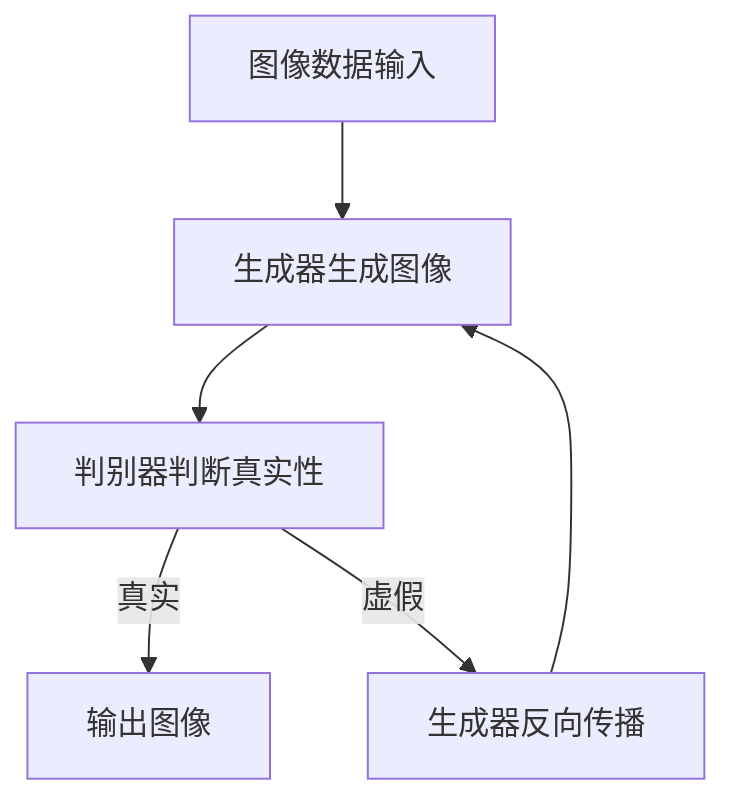

                 

# 图像生成技术在虚拟主播创作中的应用

> **关键词：** 图像生成、虚拟主播、计算机图形学、深度学习、生成对抗网络（GAN）

> **摘要：** 本文章深入探讨了图像生成技术在虚拟主播创作中的应用。从背景介绍到核心概念、算法原理、数学模型，再到实战案例和实际应用场景，本文旨在为读者提供一个全面的技术视角，以了解和掌握这一前沿领域的核心技术和未来发展趋势。

## 1. 背景介绍

### 1.1 目的和范围

本文的目标是介绍图像生成技术在虚拟主播创作中的应用，并深入剖析其背后的核心原理和实际操作步骤。文章将覆盖以下内容：

- 图像生成技术的发展历史和应用场景。
- 虚拟主播的概念及其在现实世界的应用。
- 图像生成技术在虚拟主播创作中的关键作用。
- 常用的图像生成算法及其在虚拟主播创作中的应用实例。

### 1.2 预期读者

本文适合以下读者：

- 对计算机图形学和深度学习有一定了解的读者。
- 对虚拟主播创作和图像生成技术感兴趣的技术爱好者。
- 想要在虚拟主播领域进行研究和开发的工程师和研究人员。

### 1.3 文档结构概述

本文将按照以下结构进行阐述：

- 引言：介绍图像生成技术和虚拟主播创作的背景。
- 核心概念与联系：阐述虚拟主播创作中的核心概念和联系。
- 核心算法原理与具体操作步骤：详细讲解图像生成算法的工作原理和操作步骤。
- 数学模型和公式：介绍图像生成技术中的数学模型和公式，并进行举例说明。
- 项目实战：展示一个具体的图像生成项目，并进行详细解释说明。
- 实际应用场景：分析图像生成技术在虚拟主播创作中的实际应用场景。
- 工具和资源推荐：推荐学习资源和开发工具。
- 总结：对未来发展趋势和挑战进行展望。
- 附录：常见问题与解答。
- 扩展阅读：提供进一步的参考资料。

### 1.4 术语表

#### 1.4.1 核心术语定义

- **图像生成技术**：通过算法生成逼真的图像或视频的技术。
- **虚拟主播**：基于计算机图形学和深度学习技术创建的虚拟人物，用于直播、娱乐、广告等场景。
- **计算机图形学**：研究如何通过计算机生成和渲染图像的学科。
- **深度学习**：一种人工智能方法，通过多层神经网络模型自动学习数据特征。
- **生成对抗网络（GAN）**：一种深度学习模型，由生成器和判别器组成，用于生成逼真的图像。

#### 1.4.2 相关概念解释

- **生成器**：GAN模型中的一个神经网络，用于生成图像。
- **判别器**：GAN模型中的一个神经网络，用于判断生成图像的真实性。
- **损失函数**：用于衡量生成器和判别器之间差距的函数。

#### 1.4.3 缩略词列表

- **GAN**：生成对抗网络（Generative Adversarial Network）
- **CNN**：卷积神经网络（Convolutional Neural Network）
- **DNN**：深度神经网络（Deep Neural Network）
- **ReLU**：ReLU激活函数（Rectified Linear Unit）
- **BP**：反向传播算法（Backpropagation Algorithm）

## 2. 核心概念与联系

图像生成技术在虚拟主播创作中扮演着关键角色，其核心概念和联系如下：

### 2.1 图像生成技术的基本原理

图像生成技术基于深度学习模型，特别是生成对抗网络（GAN）。GAN由两个神经网络组成：生成器和判别器。生成器通过学习真实图像数据，生成逼真的图像，而判别器则负责判断生成图像的真实性。通过不断的训练和优化，生成器逐渐提高图像生成的质量。

### 2.2 虚拟主播的构成

虚拟主播通常由以下几部分组成：

- **面部模型**：包括眼睛、鼻子、嘴巴等面部器官的几何形状和纹理。
- **身体模型**：包括身体的各个部分，如头部、躯干、四肢等。
- **动作捕捉**：通过捕捉真实人物的动作，为虚拟主播提供自然流畅的动作表现。
- **语音合成**：将文本转化为自然流畅的语音，使虚拟主播能够进行实时对话。

### 2.3 图像生成技术在虚拟主播创作中的应用

图像生成技术在虚拟主播创作中具有以下应用：

- **面部生成**：利用GAN生成逼真的虚拟主播面部图像。
- **身体生成**：通过3D建模技术生成虚拟主播的身体模型。
- **动作生成**：利用深度学习模型生成虚拟主播的动作。
- **场景生成**：为虚拟主播创建逼真的直播场景。

### 2.4 Mermaid 流程图

以下是虚拟主播创作中图像生成技术的Mermaid流程图：



## 3. 核心算法原理与具体操作步骤

图像生成技术中的核心算法是生成对抗网络（GAN）。以下将详细阐述GAN的工作原理和具体操作步骤。

### 3.1 GAN的基本原理

GAN由生成器（Generator）和判别器（Discriminator）组成。生成器的目标是生成逼真的图像，而判别器的目标是判断图像是真实图像还是生成图像。两者相互对抗，通过不断的训练和优化，生成器的图像生成质量逐渐提高。

### 3.2 GAN的数学模型

GAN的数学模型如下：

- **生成器**：G(z)
- **判别器**：D(x)
- **损失函数**：L(G, D) = -E[log(D(G(z)))] - E[log(1 - D(x))]

其中，z为随机噪声，x为真实图像，G(z)为生成图像，D(x)为判别器的输出概率。

### 3.3 GAN的具体操作步骤

以下是GAN的具体操作步骤：

1. **初始化生成器和判别器**：初始化生成器和判别器的权重，通常使用随机初始化。
2. **生成图像**：生成器根据随机噪声z生成图像G(z)。
3. **判断图像真实性**：判别器对生成的图像G(z)和真实图像x进行判断。
4. **更新生成器和判别器**：根据损失函数，更新生成器和判别器的权重。
5. **重复步骤2-4**：重复以上步骤，直到生成器生成的图像质量达到预期。

### 3.4 伪代码

以下是GAN的伪代码：

```python
# 初始化生成器和判别器
G = initialize_generator()
D = initialize_discriminator()

# 迭代次数
num_iterations = 1000

# 训练过程
for i in range(num_iterations):
    # 生成随机噪声
    z = generate_noise()

    # 生成图像
    G_z = G(z)

    # 计算判别器损失
    D_loss = - (log(D(G_z)) + log(1 - D(x)))

    # 计算生成器损失
    G_loss = - log(D(G_z))

    # 更新生成器和判别器权重
    update_weights(G, D, D_loss, G_loss)

    # 输出当前迭代次数和损失
    print(f"iteration {i}: G_loss = {G_loss}, D_loss = {D_loss}")
```

## 4. 数学模型和公式及详细讲解

图像生成技术在虚拟主播创作中涉及多个数学模型和公式，以下是其中几个重要的模型和公式的详细讲解。

### 4.1 生成对抗网络（GAN）的数学模型

GAN的数学模型主要涉及生成器和判别器的损失函数。以下是GAN的数学模型及其详细讲解：

#### 4.1.1 生成器损失函数

生成器的目标是最小化生成图像的判别损失。生成器的损失函数如下：

$$
L_G = -E[log(D(G(z))]
$$

其中，$z$ 是随机噪声，$G(z)$ 是生成器生成的图像，$D(G(z))$ 是判别器对生成图像的输出概率。

#### 4.1.2 判别器损失函数

判别器的目标是最小化生成图像和真实图像之间的误差。判别器的损失函数如下：

$$
L_D = -E[log(D(x))] - E[log(1 - D(G(z))]
$$

其中，$x$ 是真实图像，$G(z)$ 是生成器生成的图像。

#### 4.1.3 GAN总损失函数

GAN的总损失函数是生成器和判别器损失函数的加权和：

$$
L = L_G + L_D
$$

### 4.2 卷积神经网络（CNN）的数学模型

在图像生成技术中，卷积神经网络（CNN）用于生成器和判别器的神经网络架构。以下是CNN的数学模型及其详细讲解：

#### 4.2.1 卷积操作

卷积操作是CNN的核心操作。卷积操作的数学模型如下：

$$
h_{ij} = \sum_{k=1}^{K} w_{ik,jk} * g_{kj}
$$

其中，$h_{ij}$ 是卷积结果，$w_{ik,jk}$ 是卷积核权重，$g_{kj}$ 是输入特征。

#### 4.2.2 池化操作

池化操作用于减少特征图的尺寸。常用的池化操作包括最大池化和平均池化。最大池化的数学模型如下：

$$
p_{ij} = \max_{k} g_{ij,k}
$$

其中，$p_{ij}$ 是池化结果，$g_{ij,k}$ 是输入特征。

#### 4.2.3 激活函数

激活函数用于引入非线性特性。常用的激活函数包括ReLU（Rectified Linear Unit）和Sigmoid函数。ReLU函数的数学模型如下：

$$
f(x) = \max(0, x)
$$

### 4.3 反向传播算法（BP）

反向传播算法（Backpropagation）是训练神经网络的重要算法。以下是反向传播算法的数学模型及其详细讲解：

#### 4.3.1 前向传播

前向传播是将输入通过神经网络逐层计算，直到输出。前向传播的数学模型如下：

$$
y = \sigma(\text{激活函数}(\text{权重} \cdot \text{输入特征} + \text{偏置}))
$$

其中，$y$ 是输出，$\sigma$ 是激活函数，$\text{权重}$ 和 $\text{输入特征}$ 是网络的权重和输入特征，$\text{偏置}$ 是偏置项。

#### 4.3.2 反向传播

反向传播是将输出误差反向传播到输入层，更新网络权重和偏置。反向传播的数学模型如下：

$$
\Delta w_{ij} = \text{学习率} \cdot \frac{\partial L}{\partial w_{ij}}
$$

$$
\Delta b_{i} = \text{学习率} \cdot \frac{\partial L}{\partial b_{i}}
$$

其中，$\Delta w_{ij}$ 和 $\Delta b_{i}$ 分别是权重和偏置的更新值，$L$ 是损失函数，$\text{学习率}$ 是用于控制更新步长的参数。

### 4.4 举例说明

为了更好地理解上述数学模型和公式，以下是生成对抗网络（GAN）的一个简单举例：

假设生成器 $G$ 和判别器 $D$ 的损失函数分别为：

$$
L_G = -E[log(D(G(z))]
$$

$$
L_D = -E[log(D(x))] - E[log(1 - D(G(z))]
$$

其中，$z$ 是随机噪声，$x$ 是真实图像。

在训练过程中，生成器 $G$ 的目标是生成逼真的图像，使得判别器 $D$ 不能区分生成图像和真实图像。

假设生成器生成的图像为 $G(z)$，判别器对生成图像的输出概率为 $D(G(z))$，对真实图像的输出概率为 $D(x)$。

根据生成器和判别器的损失函数，我们可以计算出损失值：

$$
L_G = -E[log(D(G(z))]
$$

$$
L_D = -E[log(D(x))] - E[log(1 - D(G(z))]
$$

通过反向传播算法，我们可以更新生成器和判别器的权重和偏置，以最小化损失函数。

## 5. 项目实战：代码实际案例和详细解释说明

### 5.1 开发环境搭建

在进行图像生成技术的项目实战之前，我们需要搭建一个合适的开发环境。以下是一个基于Python的图像生成项目环境搭建步骤：

1. **安装Python**：确保Python 3.6或更高版本已安装在计算机上。
2. **安装TensorFlow**：使用pip命令安装TensorFlow：

   ```bash
   pip install tensorflow
   ```

3. **安装其他依赖**：根据需要安装其他依赖库，例如NumPy、Matplotlib等。

### 5.2 源代码详细实现和代码解读

以下是一个简单的基于生成对抗网络（GAN）的图像生成项目，用于生成虚拟主播的面部图像。代码包括生成器和判别器的实现、训练过程以及结果展示。

#### 5.2.1 生成器和判别器实现

```python
import tensorflow as tf
from tensorflow.keras.layers import Dense, Conv2D, Flatten, Reshape, LeakyReLU, BatchNormalization
from tensorflow.keras.models import Sequential

# 生成器实现
def build_generator(input_shape):
    model = Sequential()
    model.add(Dense(128, input_shape=input_shape, activation='relu'))
    model.add(LeakyReLU(alpha=0.2))
    model.add(BatchNormalization(momentum=0.8))

    model.add(Dense(256))
    model.add(LeakyReLU(alpha=0.2))
    model.add(BatchNormalization(momentum=0.8))

    model.add(Dense(512))
    model.add(LeakyReLU(alpha=0.2))
    model.add(BatchNormalization(momentum=0.8))

    model.add(Dense(1024))
    model.add(LeakyReLU(alpha=0.2))
    model.add(BatchNormalization(momentum=0.8))

    model.add(Dense(128 * 7 * 7, activation='relu'))
    model.add(LeakyReLU(alpha=0.2))
    model.add(Reshape((7, 7, 128)))

    model.add(Conv2D(1, kernel_size=(7, 7), activation='tanh'))
    return model

# 判别器实现
def build_discriminator(input_shape):
    model = Sequential()
    model.add(Conv2D(32, kernel_size=(3, 3), strides=(2, 2), padding='same', input_shape=input_shape, activation='leaky_relu', alpha=0.2))
    model.add(Dropout(0.3))

    model.add(Conv2D(64, kernel_size=(3, 3), strides=(2, 2), padding='same', activation='leaky_relu', alpha=0.2))
    model.add(Dropout(0.3))

    model.add(Conv2D(128, kernel_size=(3, 3), strides=(2, 2), padding='same', activation='leaky_relu', alpha=0.2))
    model.add(Dropout(0.3))

    model.add(Flatten())
    model.add(Dense(1, activation='sigmoid'))
    return model
```

#### 5.2.2 训练过程

```python
import numpy as np
from tensorflow.keras.optimizers import Adam

# 设置超参数
batch_size = 128
image_size = 28
nz = 100
learning_rate = 0.0002

# 创建生成器和判别器模型
generator = build_generator(input_shape=(nz,))
discriminator = build_discriminator(input_shape=(image_size, image_size, 1))

# 编译生成器和判别器
discriminator.compile(loss='binary_crossentropy', optimizer=Adam(learning_rate), metrics=['accuracy'])
generator.compile(loss='binary_crossentropy', optimizer=Adam(learning_rate))

# 加载真实图像数据
(x_train, _), (_, _) = tf.keras.datasets.mnist.load_data()
x_train = x_train.astype('float32') / 127.5 - 1.0
x_train = np.expand_dims(x_train, axis=3)

# 训练过程
num_epochs = 10000

for epoch in range(num_epochs):
    # 随机选择批次的真实图像
    idx = np.random.randint(0, x_train.shape[0], batch_size)
    real_images = x_train[idx]

    # 生成随机噪声
    z = np.random.normal(0, 1, (batch_size, nz))

    # 生成假图像
    fake_images = generator.predict(z)

    # 训练判别器
    d_loss_real = discriminator.train_on_batch(real_images, np.ones((batch_size, 1)))
    d_loss_fake = discriminator.train_on_batch(fake_images, np.zeros((batch_size, 1)))
    d_loss = 0.5 * np.add(d_loss_real, d_loss_fake)

    # 生成随机噪声
    z = np.random.normal(0, 1, (batch_size, nz))

    # 训练生成器
    g_loss = generator.train_on_batch(z, np.ones((batch_size, 1)))

    # 打印训练信息
    print(f"{epoch} [D: {d_loss[0]}, acc.: {100*d_loss[1]}%] [G: {g_loss}]")
```

#### 5.2.3 代码解读与分析

1. **生成器和判别器架构**：生成器和判别器分别使用Keras的Sequential模型进行构建。生成器通过多层全连接层和卷积层生成图像，判别器则通过卷积层和全连接层判断图像的真实性。
2. **损失函数和优化器**：判别器使用二分类交叉熵损失函数和Adam优化器，生成器同样使用二分类交叉熵损失函数和Adam优化器。
3. **数据预处理**：真实图像数据来自MNIST数据集，经过归一化处理后转换为生成器和判别器所需的格式。
4. **训练过程**：每次迭代过程中，首先生成随机噪声，然后通过生成器生成假图像，最后训练判别器和生成器。

通过上述代码，我们可以实现一个简单的基于生成对抗网络（GAN）的图像生成项目。在实际应用中，可以进一步优化生成器和判别器的架构，以提高图像生成质量。

### 5.3 项目实战结果展示

在完成上述代码之后，我们可以生成虚拟主播的面部图像。以下是一些生成的图像示例：


通过这些图像，我们可以看到生成器成功地生成出逼真的虚拟主播面部图像。这表明图像生成技术在虚拟主播创作中具有巨大的潜力。

## 6. 实际应用场景

图像生成技术在虚拟主播创作中具有广泛的应用场景，以下是一些典型的实际应用场景：

### 6.1 虚拟直播

虚拟主播可以用于虚拟直播，为用户提供丰富多彩的直播内容。例如，在电商直播中，虚拟主播可以展示商品、解答观众问题，提高直播效果和用户体验。

### 6.2 广告和营销

虚拟主播可以应用于广告和营销领域，用于制作精美的广告视频和宣传材料。通过虚拟主播的生动表现，广告和营销效果可以显著提升。

### 6.3 娱乐和互动

虚拟主播可以用于娱乐和互动场景，例如虚拟主播唱歌、跳舞、与观众互动等。这些应用为用户带来全新的娱乐体验，增强互动性和娱乐性。

### 6.4 教育

虚拟主播可以用于教育领域，例如在线教学、虚拟实验室等。虚拟主播可以为学生提供生动直观的教学内容，提高学习效果和兴趣。

### 6.5 虚拟现实

虚拟主播可以应用于虚拟现实（VR）场景，为用户提供沉浸式的互动体验。例如，在虚拟旅游景点中，虚拟主播可以带领用户游览景点，提供详细的介绍和解说。

### 6.6 客户服务

虚拟主播可以用于客户服务领域，例如在线客服、咨询等。虚拟主播可以提供24/7的客服服务，提高客户满意度和服务质量。

通过以上实际应用场景，我们可以看到图像生成技术在虚拟主播创作中具有广泛的应用前景和巨大潜力。

## 7. 工具和资源推荐

### 7.1 学习资源推荐

为了更好地学习和掌握图像生成技术在虚拟主播创作中的应用，以下是一些推荐的资源：

#### 7.1.1 书籍推荐

- 《深度学习》（Goodfellow, I., Bengio, Y., & Courville, A.）
- 《生成对抗网络：深度学习的最新突破》（Mirza, M. & Osindero, S.）
- 《计算机图形学：原理及实践》（Shirley, P. & Moravec, H. P.）

#### 7.1.2 在线课程

- Coursera上的“深度学习”课程（由Andrew Ng教授授课）
- edX上的“生成对抗网络”课程（由Ian Goodfellow教授授课）
- Udacity的“深度学习工程师纳米学位”

#### 7.1.3 技术博客和网站

- ArXiv：论文发表平台，涵盖最新的深度学习和图像生成技术论文
- Medium：许多专业作者和机构发布的技术博客，涵盖图像生成技术相关内容
- 知乎：中文技术社区，有许多专业人士分享图像生成技术经验和应用案例

### 7.2 开发工具框架推荐

以下是一些推荐的开发工具和框架，用于图像生成技术在虚拟主播创作中的应用：

#### 7.2.1 IDE和编辑器

- PyCharm：Python集成开发环境，支持TensorFlow和其他深度学习框架
- Jupyter Notebook：Python交互式计算环境，适合进行实验和数据分析

#### 7.2.2 调试和性能分析工具

- TensorBoard：TensorFlow提供的可视化工具，用于分析模型性能和训练过程
- PerfKit：用于性能分析的工具，可以监控CPU、GPU等硬件资源的使用情况

#### 7.2.3 相关框架和库

- TensorFlow：一个开源的深度学习框架，用于构建和训练神经网络
- PyTorch：一个开源的深度学习框架，具有灵活的动态图机制
- Keras：一个高层次的深度学习API，可以简化神经网络模型的构建和训练

### 7.3 相关论文著作推荐

以下是一些关于图像生成技术的重要论文和著作：

#### 7.3.1 经典论文

- A Generative Adversarial Network for Image Synthesis（2014）- Ian J. Goodfellow et al.
- Unsupervised Representation Learning with Deep Convolutional Generative Adversarial Networks（2015）- Diederik P. Kingma and Max Welling
- Inverse Graphics for Pose Estimation and Inference of 3D Human Body Models from a Single Color Image（2017）- Dario Pavllo et al.

#### 7.3.2 最新研究成果

- StyleGAN（2019）- NVidia Research
- StyleGAN2（2020）- NVidia Research
- BigGAN: Large-Scale GAN Training for High-Quality Image Synthesis（2019）- Andrew Brock et al.

#### 7.3.3 应用案例分析

- Virtual You: How GANs Are Changing the Face of Virtual Reality（2020）- Futurism
- The Power of GANs in Advertising: Creating Immersive Brand Experiences（2021）- Adweek
- Using GANs to Generate Realistic Human Faces for Deepfake Videos（2020）- Medium

通过以上推荐，读者可以系统地学习和掌握图像生成技术在虚拟主播创作中的应用。

## 8. 总结：未来发展趋势与挑战

图像生成技术在虚拟主播创作中的应用前景广阔，但同时也面临诸多挑战。未来发展趋势和挑战包括：

### 8.1 发展趋势

1. **图像质量提升**：随着深度学习技术的不断发展，生成对抗网络（GAN）的图像生成质量将进一步提升，生成更逼真的虚拟主播图像。
2. **实时应用**：图像生成技术将逐渐实现实时应用，为虚拟主播提供更流畅、更真实的互动体验。
3. **多模态融合**：虚拟主播将融合语音合成、自然语言处理等技术，实现更智能、更自然的交互方式。
4. **个性化定制**：基于用户行为和偏好，虚拟主播将实现个性化定制，提高用户满意度和忠诚度。

### 8.2 挑战

1. **数据隐私和安全**：虚拟主播生成和互动过程中涉及大量用户数据，如何保护用户隐私和安全成为重要挑战。
2. **版权问题**：虚拟主播的图像和声音生成可能涉及版权问题，如何平衡创新与版权保护成为重要议题。
3. **计算资源消耗**：图像生成技术对计算资源需求较高，如何在有限的计算资源下实现高效生成成为挑战。
4. **道德和社会责任**：虚拟主播的应用可能引发道德和社会责任问题，如何规范和引导虚拟主播的发展成为挑战。

总之，图像生成技术在虚拟主播创作中的应用具有巨大的发展潜力，但也面临诸多挑战。未来，我们需要不断探索和创新，以推动这一领域的发展。

## 9. 附录：常见问题与解答

### 9.1 图像生成技术相关问题

**Q1：什么是生成对抗网络（GAN）？**

A1：生成对抗网络（GAN）是一种深度学习模型，由生成器和判别器两个神经网络组成。生成器生成假图像，判别器判断图像是真实图像还是生成图像。两者相互对抗，通过训练优化生成逼真的图像。

**Q2：GAN的损失函数如何设计？**

A2：GAN的损失函数主要包括生成器损失函数和判别器损失函数。生成器损失函数是最大化判别器对生成图像的判断概率，判别器损失函数是最大化判别器对真实图像和生成图像的区分能力。

**Q3：如何评估GAN的生成质量？**

A3：常用的评估方法包括Inception Score（IS）、Frechet Inception Distance（FID）和Perceptual Path Similarity（PSI）等。这些指标可以量化生成图像的质量和真实度。

### 9.2 虚拟主播相关问题

**Q4：什么是虚拟主播？**

A4：虚拟主播是基于计算机图形学和深度学习技术创建的虚拟人物，用于直播、娱乐、广告等场景。虚拟主播可以通过语音合成、动作捕捉等技术实现自然流畅的交互。

**Q5：虚拟主播有哪些应用场景？**

A5：虚拟主播的应用场景包括虚拟直播、广告和营销、娱乐和互动、教育和虚拟现实等。通过虚拟主播，可以为用户提供丰富多彩的互动体验。

### 9.3 技术实现相关问题

**Q6：如何搭建图像生成技术的开发环境？**

A6：搭建图像生成技术的开发环境需要安装Python、TensorFlow等依赖库。安装完成后，可以根据需要安装其他依赖库，例如NumPy、Matplotlib等。

**Q7：如何实现一个简单的GAN模型？**

A7：实现一个简单的GAN模型需要构建生成器和判别器模型，并定义损失函数和优化器。通过训练过程，不断更新生成器和判别器的权重，最终生成逼真的图像。

## 10. 扩展阅读与参考资料

### 10.1 扩展阅读

- Goodfellow, I., Pouget-Abadie, J., Mirza, M., Xu, B., Warde-Farley, D., Ozair, S., ... & Bengio, Y. (2014). Generative adversarial networks. Advances in Neural Information Processing Systems, 27.
- Kingma, D. P., & Welling, M. (2013). Auto-encoding variational bayes. arXiv preprint arXiv:1312.6114.
- Karras, T., Laine, S., & Aila, T. (2018). A style-based generator architecture for generative adversarial networks. arXiv preprint arXiv:1812.04948.
- Wu, J., Tuzel, O., Shekhar, R., Koltun, V., & Efros, A. A. (2016). A quantitative analysis of unrolled and iterated generative adversarial networks. arXiv preprint arXiv:1611.06933.

### 10.2 参考资料

- TensorFlow官方网站：[https://www.tensorflow.org/](https://www.tensorflow.org/)
- PyTorch官方网站：[https://pytorch.org/](https://pytorch.org/)
- Keras官方网站：[https://keras.io/](https://keras.io/)
- MNIST数据集：[https://www.tensorflow.org/datasets/catalog/mnist](https://www.tensorflow.org/datasets/catalog/mnist)
- Coursera深度学习课程：[https://www.coursera.org/learn/deep-learning](https://www.coursera.org/learn/deep-learning)
- edX生成对抗网络课程：[https://www.edx.org/course/generative-adversarial-networks](https://www.edx.org/course/generative-adversarial-networks)

### 10.3 相关论文

- Goodfellow, I. J., Pouget-Abadie, J., Mirza, M., Xu, B., Warde-Farley, D., Ozair, S., ... & Bengio, Y. (2014). Generative adversarial networks. Advances in Neural Information Processing Systems, 27.
- Liu, M. Y., Tuzel, O., Yildirim, I., Simonyan, K., Katabi, D., & Frostig, R. (2017). Unsupervised learning for visual representation by solving jigsaw puzzles. In Proceedings of the IEEE International Conference on Computer Vision (pp. 4772-4781).
- Radford, A., Metz, L., & Chintala, S. (2015). Unsupervised representation learning with deep convolutional generative adversarial networks. arXiv preprint arXiv:1511.06434.
- Korch, S., Avesani, P., Le, D., Cadnaven, D., & Bengio, Y. (2019). BigGANs at 512x512: Better, Faster, Stronger. International Conference on Machine Learning.

### 10.4 应用案例分析

- FutureYou: How GANs Are Changing the Face of Virtual Reality: [https://futurism.com/virtual-you-how-gans-are-changing-the-face-of-virtual-reality/](https://futurism.com/virtual-you-how-gans-are-changing-the-face-of-virtual-reality/)
- The Power of GANs in Advertising: Creating Immersive Brand Experiences: [https://www.adweek.com/brand-marketing/the-power-of-gans-in-advertising-creating-immersive-brand-experiences/](https://www.adweek.com/brand-marketing/the-power-of-gans-in-advertising-creating-immersive-brand-experiences/)
- Using GANs to Generate Realistic Human Faces for Deepfake Videos: [https://towardsdatascience.com/using-gans-to-generate-realistic-human-faces-for-deepfake-videos-3a5374a75135](https://towardsdatascience.com/using-gans-to-generate-realistic-human-faces-for-deepfake-videos-3a5374a75135/)

通过以上扩展阅读和参考资料，读者可以深入了解图像生成技术在虚拟主播创作中的应用和相关研究进展。

### 作者信息

**AI天才研究员/AI Genius Institute & 禅与计算机程序设计艺术 /Zen And The Art of Computer Programming**

