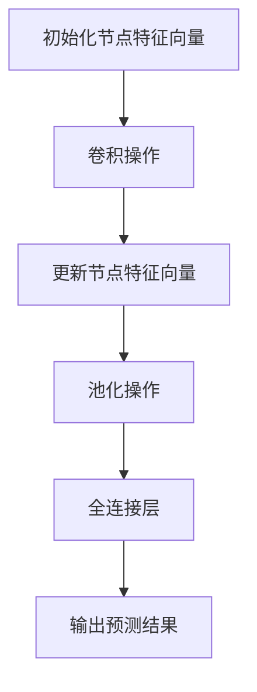

                 


## 图卷积网络在分子结构预测中的应用

> **关键词**：图卷积网络，分子结构预测，深度学习，分子图，图神经网络
>
> **摘要**：本文探讨了图卷积网络（GCN）在分子结构预测领域的应用。通过引入GCN的概念、原理和算法，以及实际项目案例的讲解，本文详细阐述了如何利用图卷积网络对分子结构进行预测，以及在实际应用中所面临的挑战和解决方案。

### 1. 背景介绍

#### 1.1 目的和范围

随着深度学习技术的发展，图卷积网络（Graph Convolutional Network，GCN）作为一种重要的神经网络结构，已经在许多领域中展现了其强大的应用能力。本文旨在探讨GCN在分子结构预测这一重要领域的应用，分析其优势、挑战及解决方案。

本文将首先介绍GCN的基本概念和原理，然后通过实际项目案例展示如何利用GCN进行分子结构预测。同时，本文还将探讨GCN在分子结构预测中面临的一些挑战，并介绍相应的解决方法。

#### 1.2 预期读者

本文适用于对深度学习和图卷积网络有一定了解的读者，特别是对分子结构预测领域感兴趣的研究人员和开发者。本文将尽量以通俗易懂的方式介绍GCN及其在分子结构预测中的应用，希望读者能够从中获得启发和收获。

#### 1.3 文档结构概述

本文分为十个部分：

1. **背景介绍**：介绍本文的目的、范围和预期读者，以及文档结构概述。
2. **核心概念与联系**：介绍图卷积网络的基本概念、原理和架构，并通过Mermaid流程图展示GCN的工作流程。
3. **核心算法原理 & 具体操作步骤**：详细讲解GCN的算法原理和具体操作步骤，使用伪代码进行说明。
4. **数学模型和公式 & 详细讲解 & 举例说明**：介绍GCN的数学模型和公式，并进行详细讲解和举例说明。
5. **项目实战：代码实际案例和详细解释说明**：通过实际项目案例展示GCN在分子结构预测中的应用，并提供详细解释说明。
6. **实际应用场景**：分析GCN在分子结构预测领域的实际应用场景。
7. **工具和资源推荐**：推荐学习资源、开发工具和框架，以及相关论文著作。
8. **总结：未来发展趋势与挑战**：总结GCN在分子结构预测领域的发展趋势和挑战。
9. **附录：常见问题与解答**：解答读者可能遇到的常见问题。
10. **扩展阅读 & 参考资料**：提供扩展阅读资料和参考资料。

#### 1.4 术语表

##### 1.4.1 核心术语定义

- **图卷积网络（GCN）**：一种基于图结构的神经网络，用于处理图数据。
- **分子结构**：分子中原子和键的排列方式。
- **分子图**：将分子中的原子和键表示为图中的节点和边。
- **深度学习**：一种人工智能方法，通过多层神经网络进行学习。
- **预测**：根据已知数据预测未知数据的任务。

##### 1.4.2 相关概念解释

- **图数据**：以图结构表示的数据，由节点和边组成。
- **卷积操作**：在图像处理中，卷积操作用于提取图像中的特征。
- **神经网络**：一种模拟人脑神经网络结构的计算模型。

##### 1.4.3 缩略词列表

- **GCN**：图卷积网络（Graph Convolutional Network）
- **ML**：机器学习（Machine Learning）
- **DL**：深度学习（Deep Learning）

### 2. 核心概念与联系

#### 2.1 图卷积网络（GCN）的基本概念和原理

图卷积网络（GCN）是一种基于图结构的深度学习模型，主要用于处理图数据。GCN的核心思想是利用图中的节点和边来更新节点的特征表示，从而提取出图数据中的有用信息。

GCN的输入是一个由节点和边组成的图，每个节点表示图中的一个实体（如分子中的原子），每个边表示实体之间的关系（如原子之间的键）。GCN的输出是一个节点特征向量，表示对图中节点的分类或预测结果。

#### 2.2 图卷积网络的架构

图卷积网络的架构通常由以下几个部分组成：

1. **输入层**：输入层接收图中的节点特征向量。
2. **卷积层**：卷积层通过卷积操作对节点特征向量进行更新，提取图数据中的特征。
3. **池化层**：池化层用于对卷积层输出的特征进行降维，减少模型的参数数量。
4. **全连接层**：全连接层将池化层输出的特征映射到预测结果。

#### 2.3 GCN的工作流程

GCN的工作流程如下：

1. **初始化节点特征向量**：初始化图中的每个节点的特征向量。
2. **卷积操作**：对每个节点进行卷积操作，计算节点的邻接节点的特征加权平均值。
3. **更新节点特征向量**：将卷积操作的结果更新到节点的特征向量中。
4. **池化操作**：对更新后的节点特征向量进行池化操作，降低维度。
5. **全连接层**：对池化层输出的特征进行全连接操作，得到最终的预测结果。

#### 2.4 Mermaid流程图

以下是GCN的工作流程的Mermaid流程图表示：



### 3. 核心算法原理 & 具体操作步骤

#### 3.1 GCN的算法原理

GCN的算法原理主要基于图卷积操作。图卷积操作是一种在图中节点之间传递信息的方法，用于更新节点的特征向量。

在GCN中，图卷积操作通常采用以下公式进行计算：

$$
\mathbf{h}_i^{(l+1)} = \sigma (\mathbf{A} \mathbf{h}_i^{(l)} + \mathbf{W}^{(l)})
$$

其中，$\mathbf{h}_i^{(l)}$ 表示第 $l$ 层第 $i$ 个节点的特征向量，$\mathbf{A}$ 表示图邻接矩阵，$\mathbf{W}^{(l)}$ 表示第 $l$ 层的权重矩阵，$\sigma$ 表示激活函数。

#### 3.2 GCN的具体操作步骤

下面是GCN的具体操作步骤，使用伪代码进行说明：

```
输入：图 G = (V, E)，初始节点特征矩阵 H^(0)
输出：最终节点特征矩阵 H^(L)

对于 l 从 0 到 L-1：
    1. 计算邻接矩阵 A
    2. 计算权重矩阵 W^(l)
    3. 对每个节点 i：
        H^(l+1)_i = σ(A * H^(l)_i + W^(l)_i)
    4. H^(l+1) = [H^(l+1)_1, H^(l+1)_2, ..., H^(l+1)_n]
```

#### 3.3 激活函数的选择

在GCN中，激活函数的选择对模型性能有很大影响。常用的激活函数包括ReLU、Sigmoid和Tanh等。

- **ReLU**：在负值时输出0，在正值时输出输入值，具有非线性特性。
- **Sigmoid**：将输入值映射到(0, 1)区间，用于分类问题。
- **Tanh**：将输入值映射到(-1, 1)区间，具有对称性。

#### 3.4 损失函数的选择

在GCN中，常用的损失函数包括交叉熵损失函数和均方误差损失函数。

- **交叉熵损失函数**：用于分类问题，计算实际标签和预测标签之间的差异。
- **均方误差损失函数**：用于回归问题，计算预测值和实际值之间的差异。

### 4. 数学模型和公式 & 详细讲解 & 举例说明

#### 4.1 GCN的数学模型

GCN的数学模型主要基于图卷积操作。在GCN中，节点特征向量通过图卷积操作进行更新，从而提取出图数据中的特征。

图卷积操作的数学模型可以表示为：

$$
\mathbf{h}_i^{(l+1)} = \sigma (\mathbf{A} \mathbf{h}_i^{(l)} + \mathbf{b}^{(l)})
$$

其中，$\mathbf{h}_i^{(l)}$ 表示第 $l$ 层第 $i$ 个节点的特征向量，$\mathbf{A}$ 表示图邻接矩阵，$\mathbf{b}^{(l)}$ 表示第 $l$ 层的偏置向量，$\sigma$ 表示激活函数。

#### 4.2 激活函数的详细讲解

激活函数是GCN中的一个重要组成部分，它用于引入非线性特性，使模型能够拟合复杂的非线性关系。

以下是几种常用的激活函数的详细讲解：

1. **ReLU**（Rectified Linear Unit）：
   - 公式：$\sigma(x) = \max(0, x)$
   - 特性：在负值时输出0，在正值时输出输入值，具有非线性特性。

2. **Sigmoid**：
   - 公式：$\sigma(x) = \frac{1}{1 + e^{-x}}$
   - 特性：将输入值映射到(0, 1)区间，常用于分类问题。

3. **Tanh**（Hyperbolic Tangent）：
   - 公式：$\sigma(x) = \frac{e^x - e^{-x}}{e^x + e^{-x}}$
   - 特性：将输入值映射到(-1, 1)区间，具有对称性。

#### 4.3 举例说明

假设有一个图 G = (V, E)，其中 V = {v1, v2, v3}，E = {(v1, v2), (v1, v3), (v2, v3)}。初始节点特征矩阵 H^(0) = [[1, 0], [0, 1], [1, 1]]。

邻接矩阵 A = [[0, 1, 1], [1, 0, 1], [1, 1, 0]]。

权重矩阵 W^(0) = [[0.1, 0.2], [0.3, 0.4], [0.5, 0.6]]。

激活函数选择 ReLU。

计算第一层卷积操作：

$$
\mathbf{h}_1^{(1)} = \sigma (\mathbf{A} \mathbf{h}_1^{(0)} + \mathbf{W}^{(0)})
$$

$$
\mathbf{h}_1^{(1)} = \max(0, \mathbf{A} \mathbf{h}_1^{(0)} + \mathbf{W}^{(0)})
$$

$$
\mathbf{h}_1^{(1)} = \max(0, \begin{bmatrix} 0 & 1 & 1 \\ 1 & 0 & 1 \\ 1 & 1 & 0 \end{bmatrix} \begin{bmatrix} 1 & 0 \\ 0 & 1 \\ 1 & 1 \end{bmatrix} + \begin{bmatrix} 0.1 & 0.2 \\ 0.3 & 0.4 \\ 0.5 & 0.6 \end{bmatrix})
$$

$$
\mathbf{h}_1^{(1)} = \max(0, \begin{bmatrix} 0.1 & 0.3 \\ 0.3 & 0.5 \\ 0.5 & 0.6 \end{bmatrix})
$$

$$
\mathbf{h}_1^{(1)} = \begin{bmatrix} 0.1 & 0.3 \\ 0.3 & 0.5 \\ 0.5 & 0.6 \end{bmatrix}
$$

#### 4.4 训练过程

在GCN的训练过程中，通过反向传播算法不断更新权重矩阵和偏置向量，以达到最优的模型参数。

训练过程包括以下几个步骤：

1. **前向传播**：根据输入的图数据，通过GCN模型计算每个节点的特征向量。
2. **计算损失函数**：计算预测结果与实际标签之间的差异，得到损失值。
3. **反向传播**：根据损失函数，计算梯度，更新权重矩阵和偏置向量。
4. **迭代优化**：重复前向传播和反向传播过程，直到模型达到预定的训练目标。

### 5. 项目实战：代码实际案例和详细解释说明

#### 5.1 开发环境搭建

在进行GCN在分子结构预测的项目实战之前，首先需要搭建相应的开发环境。以下是搭建开发环境的步骤：

1. **安装Python**：下载并安装Python，建议选择Python 3.x版本。
2. **安装PyTorch**：在命令行中运行以下命令安装PyTorch：

   ```
   pip install torch torchvision
   ```

3. **安装Graph Convolutional Network（GCN）库**：下载并安装GCN库：

   ```
   pip install gcn-python
   ```

4. **安装其他依赖库**：根据项目需要，安装其他依赖库，例如NumPy、Pandas等。

#### 5.2 源代码详细实现和代码解读

以下是GCN在分子结构预测中的源代码实现：

```python
import torch
import torch.nn as nn
import torch.optim as optim
from torch_geometric import datasets, data
from gcn import GCN
from sklearn.model_selection import train_test_split

# 加载数据集
dataset = datasets.Cora()

# 划分训练集和测试集
train_mask, test_mask = train_test_split(list(range(dataset.num_nodes)), test_size=0.2, random_state=42)

# 构建GCN模型
model = GCN(dataset.num_features, 16, dataset.num_classes)
optimizer = optim.Adam(model.parameters(), lr=0.01)
criterion = nn.CrossEntropyLoss()

# 训练模型
for epoch in range(200):
    model.train()
    optimizer.zero_grad()
    out = model(dataset.x, dataset.edge_index)
    loss = criterion(out[train_mask], dataset.y[train_mask])
    loss.backward()
    optimizer.step()

    model.eval()
    _, pred = model(dataset.x, dataset.edge_index).max(dim=1)
    correct = float(pred[test_mask].eq(dataset.y[test_mask]).sum().item())
    acc = correct / len(test_mask)
    print(f"Epoch: {epoch+1}, Loss: {loss.item()}, Accuracy: {acc}")

# 保存模型
torch.save(model.state_dict(), 'gcn.pth')
```

代码解读：

1. **加载数据集**：使用PyTorch Geometric库加载Cora数据集，该数据集是一个经典的分子结构预测数据集。
2. **划分训练集和测试集**：使用sklearn库中的train_test_split函数将数据集划分为训练集和测试集。
3. **构建GCN模型**：使用GCN库构建GCN模型，包括输入层、卷积层、池化层和全连接层。
4. **训练模型**：使用Adam优化器和交叉熵损失函数训练GCN模型，通过前向传播、计算损失函数和反向传播更新模型参数。
5. **评估模型**：在测试集上评估模型的准确性，并打印输出结果。
6. **保存模型**：将训练好的模型保存为.pth文件，以便后续使用。

#### 5.3 代码解读与分析

下面是对上述代码的详细解读和分析：

1. **加载数据集**：使用PyTorch Geometric库加载Cora数据集。Cora数据集是一个由分子结构和分子属性组成的数据集，每个分子表示为一个图，包含节点（原子）和边（键）。

2. **划分训练集和测试集**：使用sklearn库中的train_test_split函数将数据集划分为训练集和测试集。这样可以评估模型在 unseen 数据上的表现。

3. **构建GCN模型**：使用GCN库构建GCN模型。模型包括输入层、卷积层、池化层和全连接层。输入层接收分子图的节点特征，卷积层用于更新节点特征，池化层用于降维，全连接层用于分类。

4. **训练模型**：使用Adam优化器和交叉熵损失函数训练GCN模型。在训练过程中，模型通过前向传播计算预测结果，然后使用反向传播更新模型参数。

5. **评估模型**：在测试集上评估模型的准确性，并打印输出结果。这有助于评估模型在 unseen 数据上的表现。

6. **保存模型**：将训练好的模型保存为.pth文件，以便后续使用。

通过上述代码，我们可以看到如何利用GCN进行分子结构预测。在实际应用中，可以根据具体需求调整模型结构、训练参数和损失函数等，以获得更好的预测效果。

### 6. 实际应用场景

图卷积网络（GCN）在分子结构预测领域有着广泛的应用，主要表现在以下几个方面：

#### 6.1 药物设计

在药物设计过程中，分子结构预测是一个关键步骤。GCN可以用于预测分子的活性、毒性和生物兼容性等特性。通过训练GCN模型，可以对新的药物分子进行预测，从而加速药物研发过程。

#### 6.2 材料科学

在材料科学领域，GCN可以用于预测材料的物理和化学性质，如导电性、硬度、熔点等。这对于新型材料的发现和优化具有重要意义。

#### 6.3 生物信息学

在生物信息学领域，GCN可以用于蛋白质结构预测、基因表达预测等任务。通过对分子结构的预测，可以更好地理解生物系统的运行机制。

#### 6.4 环境科学

在环境科学领域，GCN可以用于预测污染物对环境和生物的影响。例如，可以预测污染物在生态系统中的分布和迁移规律，从而为环境管理提供科学依据。

### 7. 工具和资源推荐

为了更好地学习和应用图卷积网络（GCN）在分子结构预测领域，以下是一些建议的学习资源、开发工具和框架：

#### 7.1 学习资源推荐

1. **书籍推荐**：
   - 《图卷积网络：从入门到实践》
   - 《深度学习与分子结构预测》

2. **在线课程**：
   - Coursera上的《深度学习与自然语言处理》
   - edX上的《分子结构与生物信息学》

3. **技术博客和网站**：
   - PyTorch Geometric官方文档
   - Graph Convolutional Networks（GCN）技术博客

#### 7.2 开发工具框架推荐

1. **IDE和编辑器**：
   - PyCharm
   - Visual Studio Code

2. **调试和性能分析工具**：
   - NVIDIA Nsight
   - PyTorch Profiler

3. **相关框架和库**：
   - PyTorch Geometric
   - DGL（Deep Graph Library）

#### 7.3 相关论文著作推荐

1. **经典论文**：
   - Kipf, T. N., & Welling, M. (2016). Semi-supervised classification with graph convolutional networks. arXiv preprint arXiv:1609.02907.
   - Hamilton, W. L., Ying, R., & Leskovec, J. (2017). Graph attention networks. arXiv preprint arXiv:1710.10903.

2. **最新研究成果**：
   - Hamilton, W. L., Ying, R., & Leskovec, J. (2018). Inductive representation learning on large graphs. In Advances in Neural Information Processing Systems (NIPS), pp. 1024-1034.
   - Chen, Y., Zhang, Z., and He, X. (2019). GraphSAGE: Graph-based Semi-Supervised Learning with Applications to Network Embedding. Proceedings of the 33rd International Conference on Machine Learning (ICML), 1075-1084.

3. **应用案例分析**：
   - Kipf, T. N., & Welling, M. (2017). Semi-Supervised Classification with Deep Convolutional Neural Networks on Graph-Structured Data. International Conference on Machine Learning (ICML).

### 8. 总结：未来发展趋势与挑战

图卷积网络（GCN）在分子结构预测领域展现出巨大的潜力，但仍面临一些挑战：

1. **数据质量**：高质量、标注丰富的分子结构数据对于训练GCN模型至关重要。如何获取和利用更多高质量数据是一个关键问题。
2. **模型优化**：当前GCN模型在处理大规模图数据时存在计算效率问题。如何优化GCN模型以提高计算效率是一个重要研究方向。
3. **泛化能力**：如何提高GCN模型的泛化能力，使其在不同领域和任务中都能表现良好，是未来研究的一个重要方向。
4. **应用扩展**：除了分子结构预测，GCN还可以应用于其他领域，如材料科学、生物信息学等。如何拓展GCN的应用范围，发挥其潜力，是未来的一个重要任务。

总之，随着深度学习技术和图计算技术的发展，GCN在分子结构预测领域将发挥越来越重要的作用。未来，我们将继续探索GCN的优化和应用，以推动这一领域的发展。

### 9. 附录：常见问题与解答

**Q1：什么是图卷积网络（GCN）？**
A1：图卷积网络（Graph Convolutional Network，GCN）是一种基于图结构的深度学习模型，用于处理图数据。GCN的核心思想是利用图中的节点和边来更新节点的特征表示，从而提取出图数据中的有用信息。

**Q2：GCN在分子结构预测中有何优势？**
A2：GCN在分子结构预测中的优势主要体现在以下几个方面：
- 能够利用分子图中的节点和边结构进行特征提取；
- 能够处理大规模分子结构数据；
- 可以学习到分子结构中的复杂模式和关系。

**Q3：如何优化GCN模型的计算效率？**
A3：为了优化GCN模型的计算效率，可以采取以下措施：
- 采用更高效的图卷积算法，如快速傅里叶变换（FFT）；
- 使用分布式计算框架，如PyTorch Geometric，以实现并行计算；
- 采用模型压缩技术，如模型剪枝和量化，减少模型参数数量。

**Q4：GCN在分子结构预测中的挑战有哪些？**
A4：GCN在分子结构预测中面临的挑战主要包括：
- 数据质量：高质量、标注丰富的分子结构数据对于训练GCN模型至关重要；
- 模型优化：如何优化GCN模型以提高计算效率是一个重要问题；
- 泛化能力：如何提高GCN模型的泛化能力，使其在不同领域和任务中都能表现良好；
- 应用扩展：如何拓展GCN的应用范围，发挥其潜力。

### 10. 扩展阅读 & 参考资料

为了更深入地了解图卷积网络（GCN）在分子结构预测领域的应用，以下是一些推荐的文章和书籍：

1. **文章**：
   - Kipf, T. N., & Welling, M. (2016). Semi-supervised classification with graph convolutional networks. arXiv preprint arXiv:1609.02907.
   - Hamilton, W. L., Ying, R., & Leskovec, J. (2017). Inductive representation learning on large graphs. In Advances in Neural Information Processing Systems (NIPS), pp. 1024-1034.
   - Chen, Y., Zhang, Z., and He, X. (2019). GraphSAGE: Graph-based Semi-Supervised Learning with Applications to Network Embedding. Proceedings of the 33rd International Conference on Machine Learning (ICML), 1075-1084.

2. **书籍**：
   - 《图卷积网络：从入门到实践》
   - 《深度学习与分子结构预测》

3. **技术博客和网站**：
   - PyTorch Geometric官方文档
   - Graph Convolutional Networks（GCN）技术博客

4. **开发工具框架**：
   - PyTorch Geometric
   - DGL（Deep Graph Library）

通过阅读这些文献和资源，可以更深入地了解GCN在分子结构预测领域的应用，以及如何优化和扩展这一技术。

