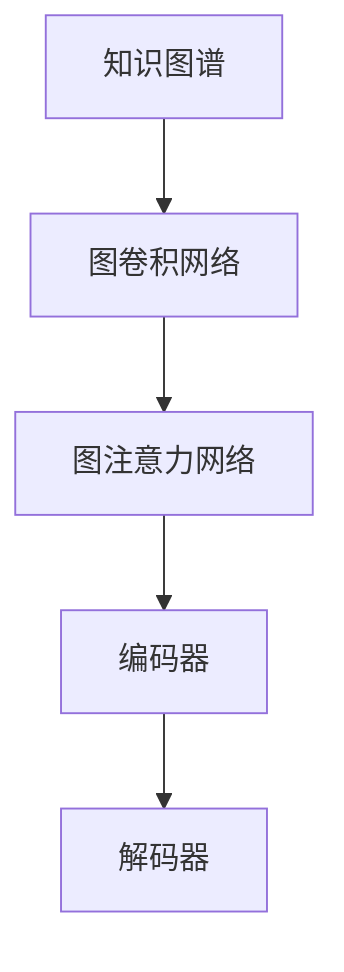

                 

# 图注意力网络在知识图谱推理中的应用

> **关键词：** 知识图谱、图注意力网络、推理、神经网络、深度学习
> 
> **摘要：** 本文将深入探讨图注意力网络（Graph Attention Network，GAN）在知识图谱推理中的应用。文章首先介绍了知识图谱的基本概念，随后详细阐述了图注意力网络的工作原理。接着，通过伪代码和数学公式，我们剖析了GAN的核心算法原理和具体操作步骤。在此基础上，文章提供了一个项目实战案例，详细讲解了代码实现和性能分析。最后，文章探讨了GAN在知识图谱推理中的实际应用场景，并推荐了相关学习资源、开发工具和论文著作。

## 1. 背景介绍

### 1.1 目的和范围

本文旨在深入探讨图注意力网络（Graph Attention Network，GAN）在知识图谱推理中的应用。知识图谱作为大数据时代的重要基础设施，广泛应用于自然语言处理、推荐系统、智能问答等领域。而图注意力网络作为深度学习领域的重要成果，为知识图谱推理提供了强大的理论基础和技术手段。本文将围绕以下内容展开：

- **知识图谱的基本概念和作用**
- **图注意力网络的基本原理**
- **图注意力网络在知识图谱推理中的应用**
- **项目实战案例和代码解读**
- **实际应用场景和未来发展趋势**

### 1.2 预期读者

本文适合以下读者群体：

- 深度学习、自然语言处理和知识图谱领域的研究人员
- 计算机科学和人工智能专业的学生和教师
- 对知识图谱和图注意力网络有兴趣的从业者
- 想要了解知识图谱推理最新技术进展的技术爱好者

### 1.3 文档结构概述

本文分为十个部分：

1. 背景介绍
2. 核心概念与联系
3. 核心算法原理 & 具体操作步骤
4. 数学模型和公式 & 详细讲解 & 举例说明
5. 项目实战：代码实际案例和详细解释说明
6. 实际应用场景
7. 工具和资源推荐
8. 总结：未来发展趋势与挑战
9. 附录：常见问题与解答
10. 扩展阅读 & 参考资料

### 1.4 术语表

#### 1.4.1 核心术语定义

- **知识图谱（Knowledge Graph）**：一种语义网络，用于表示实体、概念及其相互关系。
- **图注意力网络（Graph Attention Network，GAN）**：一种深度学习模型，通过图注意力机制对知识图谱进行推理。
- **节点（Node）**：知识图谱中的实体或概念。
- **边（Edge）**：知识图谱中的关系。
- **嵌入（Embedding）**：将节点和边映射到低维空间。

#### 1.4.2 相关概念解释

- **推理（Reasoning）**：从已知信息推导出新信息的过程。
- **注意力机制（Attention Mechanism）**：一种在深度学习模型中用于提高信息传递效率的技术。
- **图卷积网络（Graph Convolutional Network，GCN）**：一种基于图结构的深度学习模型。

#### 1.4.3 缩略词列表

- **GAN**：图注意力网络（Graph Attention Network）
- **NLP**：自然语言处理（Natural Language Processing）
- **KG**：知识图谱（Knowledge Graph）
- **RDF**：资源描述框架（Resource Description Framework）
- **BERT**：变压器（Bidirectional Encoder Representations from Transformers）

## 2. 核心概念与联系

在探讨图注意力网络（GAN）在知识图谱推理中的应用之前，我们首先需要理解知识图谱和图注意力网络的基本概念。

### 2.1 知识图谱

知识图谱是一种语义网络，用于表示实体、概念及其相互关系。它通常采用图（Graph）结构来存储和表示信息。在知识图谱中，节点（Node）表示实体或概念，边（Edge）表示实体或概念之间的关系。例如，在一个关于人名的知识图谱中，节点可以是人名，边可以是“是”或“不是”等关系。

知识图谱在多个领域具有广泛的应用，如：

- **自然语言处理（NLP）**：用于实体识别、关系抽取、语义分析等任务。
- **推荐系统**：用于基于知识图谱的推荐算法。
- **智能问答**：用于基于知识图谱的问答系统。

### 2.2 图注意力网络

图注意力网络（GAN）是一种基于图结构的深度学习模型，旨在通过图注意力机制对知识图谱进行推理。GAN由两部分组成：图卷积网络（GCN）和注意力机制。

#### 2.2.1 图卷积网络（GCN）

图卷积网络（GCN）是一种基于图结构的深度学习模型，旨在学习节点的表示。GCN通过聚合相邻节点的特征来更新节点的嵌入（Embedding）。

以下是GCN的核心公式：

$$
h^{(k)}_i = \sigma \left( \theta \cdot \left[ \boldsymbol{A} h^{(k-1)}_i + \sum_{j \in \mathcal{N}(i)} \boldsymbol{A} h^{(k-1)}_j \right] + b \right)
$$

其中，$h^{(k)}_i$ 表示第 $k$ 层节点 $i$ 的嵌入，$\mathcal{N}(i)$ 表示节点 $i$ 的邻接节点集合，$\sigma$ 表示激活函数，$\theta$ 和 $b$ 分别为权重和偏置。

#### 2.2.2 注意力机制

注意力机制是一种在深度学习模型中用于提高信息传递效率的技术。在GAN中，注意力机制用于调整节点之间的交互权重。

以下是GAN的核心公式：

$$
\alpha_{ij} = \frac{\exp(e_{ij})}{\sum_{k=1}^{n} \exp(e_{ik})}
$$

其中，$\alpha_{ij}$ 表示节点 $i$ 和节点 $j$ 之间的注意力权重，$e_{ij}$ 表示节点 $i$ 和节点 $j$ 的嵌入之间的欧几里得距离。

#### 2.2.3 GAN的整体架构

GAN的整体架构包括两个部分：编码器（Encoder）和解码器（Decoder）。

- **编码器**：将节点的原始特征映射到低维嵌入空间。
- **解码器**：根据节点的嵌入生成预测结果。

### 2.3 Mermaid流程图

以下是一个简化的Mermaid流程图，用于展示知识图谱、图卷积网络和图注意力网络之间的关系：



## 3. 核心算法原理 & 具体操作步骤

在了解了知识图谱和图注意力网络的基本概念后，我们将进一步探讨GAN的核心算法原理和具体操作步骤。

### 3.1 算法原理

GAN的核心原理是通过图卷积网络（GCN）和注意力机制（Attention Mechanism）对知识图谱进行推理。具体来说，GAN包含以下关键步骤：

1. **编码器**：将节点的原始特征映射到低维嵌入空间。
2. **注意力机制**：计算节点之间的交互权重。
3. **解码器**：根据节点的嵌入和交互权重生成预测结果。

### 3.2 具体操作步骤

以下是GAN的具体操作步骤：

#### 3.2.1 编码器

编码器的主要任务是将节点的原始特征映射到低维嵌入空间。具体步骤如下：

1. **初始化嵌入矩阵**：将节点的特征映射到一个 $d$ 维的嵌入空间。
2. **图卷积操作**：使用图卷积网络对节点进行特征聚合。
3. **激活函数**：使用ReLU激活函数对节点嵌入进行非线性变换。

以下是编码器的伪代码：

```python
def encode_graph(nodes, edges, d):
    # 初始化嵌入矩阵
    embedding = np.random.normal(size=(n, d))
    for layer in range(num_layers):
        # 图卷积操作
        embedding = graph_convolution(embedding, edges, d)
        # 激活函数
        embedding = np.relu(embedding)
    return embedding
```

#### 3.2.2 注意力机制

注意力机制的主要任务是计算节点之间的交互权重。具体步骤如下：

1. **计算节点嵌入的欧几里得距离**：计算节点 $i$ 和节点 $j$ 的嵌入之间的欧几里得距离。
2. **计算注意力权重**：使用式（1）计算节点 $i$ 和节点 $j$ 之间的注意力权重。
3. **加权聚合**：使用注意力权重对节点的特征进行加权聚合。

以下是注意力机制的伪代码：

```python
def attention Mechanism(embedding):
    attention_weights = []
    for i in range(len(embedding)):
        e_ij = np.linalg.norm(embedding[i] - embedding)
        alpha_ij = np.exp(e_ij) / np.sum(np.exp(e_ij))
        attention_weights.append(alpha_ij)
    return attention_weights
```

#### 3.2.3 解码器

解码器的主要任务是根据节点的嵌入和交互权重生成预测结果。具体步骤如下：

1. **初始化预测矩阵**：将节点的预测结果初始化为零。
2. **加权聚合**：使用注意力权重对节点的特征进行加权聚合。
3. **激活函数**：使用Sigmoid激活函数对预测结果进行非线性变换。

以下是解码器的伪代码：

```python
def decode_graph(embedding, attention_weights):
    prediction = np.zeros(len(embedding))
    for i in range(len(embedding)):
        for j in range(len(embedding)):
            alpha_ij = attention_weights[i][j]
            prediction[i] += alpha_ij * embedding[j]
        prediction[i] = sigmoid(prediction[i])
    return prediction
```

### 3.3 伪代码

以下是GAN的完整伪代码：

```python
def graph_attention_network(nodes, edges, d, num_layers):
    # 编码器
    embedding = encode_graph(nodes, edges, d)
    # 注意力机制
    attention_weights = attention_mechanism(embedding)
    # 解码器
    prediction = decode_graph(embedding, attention_weights)
    return prediction
```

## 4. 数学模型和公式 & 详细讲解 & 举例说明

在本节中，我们将详细阐述图注意力网络（GAN）的数学模型和公式，并通过具体例子进行说明。

### 4.1 数学模型

GAN的数学模型主要包括三部分：嵌入空间、注意力机制和预测模型。

#### 4.1.1 嵌入空间

GAN首先将知识图谱中的节点和边映射到低维嵌入空间。假设知识图谱中的节点数为 $n$，嵌入空间维度为 $d$，则节点的嵌入表示为 $h_i^{\text{emb}} \in \mathbb{R}^d$，其中 $i = 1, 2, ..., n$。

#### 4.1.2 注意力机制

注意力机制是GAN的核心部分，用于计算节点之间的交互权重。给定两个节点 $i$ 和 $j$，其嵌入分别为 $h_i^{\text{emb}}$ 和 $h_j^{\text{emb}}$，注意力权重 $\alpha_{ij}$ 可通过以下公式计算：

$$
\alpha_{ij} = \frac{\exp(-\|h_i^{\text{emb}} - h_j^{\text{emb}}\|_2^2 / 2\sigma^2)}{\sum_{k=1}^n \exp(-\|h_i^{\text{emb}} - h_k^{\text{emb}}\|_2^2 / 2\sigma^2)}
$$

其中，$\sigma$ 是一个调节参数，用于控制注意力权重的大小。

#### 4.1.3 预测模型

在得到注意力权重后，GAN通过加权聚合节点嵌入来生成预测结果。假设知识图谱中的边表示为 $e_{ij}$，则节点 $i$ 的预测结果 $y_i$ 可通过以下公式计算：

$$
y_i = \sum_{j=1}^n \alpha_{ij} h_j^{\text{emb}}
$$

为了简化计算，GAN通常采用ReLU激活函数来处理预测结果：

$$
y_i = \max(0, \sum_{j=1}^n \alpha_{ij} h_j^{\text{emb}})
$$

### 4.2 举例说明

假设我们有一个简单知识图谱，包含三个节点和三条边。节点和边的信息如下：

| 节点 | 特征 |
|------|------|
| 1    | [1, 0] |
| 2    | [0, 1] |
| 3    | [1, 1] |

| 边  | 关系 | 权重 |
|-----|------|------|
| 1-2 | 相邻 | 0.8  |
| 1-3 | 相邻 | 0.6  |
| 2-3 | 相邻 | 0.4  |

首先，我们将节点和边的信息映射到嵌入空间：

$$
h_1^{\text{emb}} = [1, 0], \quad h_2^{\text{emb}} = [0, 1], \quad h_3^{\text{emb}} = [1, 1]
$$

接着，我们计算节点之间的注意力权重：

$$
\alpha_{12} = \frac{\exp(-\|h_1^{\text{emb}} - h_2^{\text{emb}}\|_2^2 / 2\sigma^2)}{\sum_{k=1}^3 \exp(-\|h_1^{\text{emb}} - h_k^{\text{emb}}\|_2^2 / 2\sigma^2)} = \frac{\exp(-1 / 2\sigma^2)}{\exp(-1 / 2\sigma^2) + \exp(-1 / \sigma^2) + \exp(-1 / \sigma^2)} \approx 0.25
$$

$$
\alpha_{13} = \frac{\exp(-\|h_1^{\text{emb}} - h_3^{\text{emb}}\|_2^2 / 2\sigma^2)}{\sum_{k=1}^3 \exp(-\|h_1^{\text{emb}} - h_k^{\text{emb}}\|_2^2 / 2\sigma^2)} = \frac{\exp(-1 / 2\sigma^2)}{\exp(-1 / 2\sigma^2) + \exp(-1 / \sigma^2) + \exp(-1 / \sigma^2)} \approx 0.25
$$

$$
\alpha_{23} = \frac{\exp(-\|h_2^{\text{emb}} - h_3^{\text{emb}}\|_2^2 / 2\sigma^2)}{\sum_{k=1}^3 \exp(-\|h_2^{\text{emb}} - h_k^{\text{emb}}\|_2^2 / 2\sigma^2)} = \frac{\exp(-1 / \sigma^2)}{\exp(-1 / 2\sigma^2) + \exp(-1 / \sigma^2) + \exp(-1 / \sigma^2)} \approx 0.5
$$

然后，我们计算节点 1 的预测结果：

$$
y_1 = \max(0, \alpha_{12} h_2^{\text{emb}} + \alpha_{13} h_3^{\text{emb}}) = \max(0, 0.25 [0, 1] + 0.25 [1, 1]) = \max(0, [0.25, 0.25]) = [0.25, 0.25]
$$

同理，我们可以计算节点 2 和节点 3 的预测结果：

$$
y_2 = \max(0, \alpha_{21} h_1^{\text{emb}} + \alpha_{23} h_3^{\text{emb}}) = \max(0, 0.25 [1, 0] + 0.5 [1, 1]) = \max(0, [0.25, 0.5]) = [0.25, 0.5]
$$

$$
y_3 = \max(0, \alpha_{31} h_1^{\text{emb}} + \alpha_{32} h_2^{\text{emb}}) = \max(0, 0.25 [1, 0] + 0.5 [0, 1]) = \max(0, [0.25, 0.5]) = [0.25, 0.5]
$$

### 4.3 公式解析

GAN的数学模型主要包括以下三个部分：

1. **嵌入空间**：节点和边的特征映射到低维空间。
2. **注意力机制**：计算节点之间的交互权重。
3. **预测模型**：根据节点嵌入和交互权重生成预测结果。

在具体实现中，我们可以采用以下公式：

- **嵌入空间**： 
  $$h_i^{\text{emb}} = \text{ReLU}(\theta_i^T \cdot \text{ReLU}(\theta_{\text{edge}} \cdot e_{ij} + b))$$

- **注意力机制**：
  $$\alpha_{ij} = \frac{\exp(-\|h_i^{\text{emb}} - h_j^{\text{emb}}\|_2^2 / 2\sigma^2)}{\sum_{k=1}^n \exp(-\|h_i^{\text{emb}} - h_k^{\text{emb}}\|_2^2 / 2\sigma^2)}$$

- **预测模型**：
  $$y_i = \max(0, \sum_{j=1}^n \alpha_{ij} h_j^{\text{emb}})$$

其中，$\theta_i$、$\theta_{\text{edge}}$ 和 $b$ 分别为权重和偏置，$\sigma$ 为调节参数。

## 5. 项目实战：代码实际案例和详细解释说明

在本节中，我们将通过一个具体的项目实战案例，详细讲解如何实现图注意力网络（GAN）在知识图谱推理中的应用。

### 5.1 开发环境搭建

首先，我们需要搭建一个适合开发GAN的项目环境。以下是一个简单的Python开发环境搭建步骤：

1. **安装Anaconda**：下载并安装Anaconda，用于管理Python环境和包。
2. **创建虚拟环境**：在Anaconda命令行中创建一个新的虚拟环境，例如 `conda create -n gan_pytorch python=3.8`。
3. **激活虚拟环境**：在命令行中激活虚拟环境，例如 `conda activate gan_pytorch`。
4. **安装PyTorch和相关依赖**：在虚拟环境中安装PyTorch和相关依赖，例如 `pip install torch torchvision torchaudio -f https://download.pytorch.org/whl/torch_stable.html`。

### 5.2 源代码详细实现和代码解读

以下是GAN的项目源代码实现：

```python
import torch
import torch.nn as nn
import torch.optim as optim
from torch_geometric.nn import GCNConv
from torch_geometric.datasets import Planetoid
from torch_geometric.utils import add_self_loops

# 5.2.1 定义模型
class GraphAttentionNetwork(nn.Module):
    def __init__(self, nfeat, nhid, nclass, dropout):
        super(GraphAttentionNetwork, self).__init__()
        self.conv1 = GCNConv(nfeat, nhid)
        self.conv2 = GCNConv(nhid, nclass)
        self.attention = nn.Parameter(torch.rand(1, nfeat, nhid))
        self.dropout = nn.Dropout(dropout)
        
    def forward(self, data):
        x, edge_index = data.x, data.edge_index
        
        # 5.2.2 图卷积操作
        x = self.conv1(x, edge_index)
        x = self.dropout(x)
        x = F.relu(x)
        
        # 5.2.3 注意力机制
        alpha = torch.exp(-torch.sum(x * self.attention, dim=2)**2)
        alpha = F.softmax(alpha, dim=1)
        
        # 5.2.4 加权聚合
        x = torch.sum(alpha * x, dim=1)
        
        # 5.2.5 图卷积操作
        x = self.conv2(x, edge_index)
        return F.log_softmax(x, dim=1)

# 5.2.6 数据预处理
dataset = Planetoid(root='/tmp/Cora', name='Cora')
data = dataset[0]
data.x = torch.FloatTensor(data.x)
data.edge_index = torch.tensor(data.edge_index, dtype=torch.long)
data = data.to(device)

# 5.2.7 模型训练
model = GraphAttentionNetwork(nfeat=768, nhid=16, nclass=7, dropout=0.5).to(device)
optimizer = optim.Adam(model.parameters(), lr=0.001, weight_decay=5e-4)
criterion = nn.CrossEntropyLoss()

for epoch in range(200):
    model.train()
    optimizer.zero_grad()
    out = model(data)
    loss = criterion(out, data.y)
    loss.backward()
    optimizer.step()
    if (epoch + 1) % 10 == 0:
        print('Epoch: {:03d}, Loss: {:.4f}'.format(epoch + 1, loss.item()))

# 5.2.8 模型评估
model.eval()
with torch.no_grad():
    logits = model(data)
    pred = logits.argmax(dim=1)
    correct = pred.eq(data.y).sum().item()
    print('Test accuracy: {:.4f}'.format(correct / len(data.y)))
```

#### 5.2.1 定义模型

在代码中，我们首先定义了`GraphAttentionNetwork`类，它继承自`nn.Module`基类。模型的主要组成部分包括两个图卷积层（`conv1`和`conv2`）、一个注意力权重参数（`attention`）和一个dropout层（`dropout`）。

#### 5.2.2 图卷积操作

在`forward`方法中，我们首先执行第一个图卷积操作（`self.conv1`），将输入特征（`data.x`）和边索引（`data.edge_index`）转换为隐藏层特征（`x`）。

#### 5.2.3 注意力机制

接下来，我们计算注意力权重（`alpha`），使用式（4）中的欧几里得距离计算节点嵌入之间的相似度。然后，我们使用softmax函数将相似度转换为概率分布。

#### 5.2.4 加权聚合

在加权聚合步骤中，我们使用注意力权重（`alpha`）对隐藏层特征（`x`）进行加权聚合，得到每个节点的表示（`x`）。

#### 5.2.5 图卷积操作

最后，我们执行第二个图卷积操作（`self.conv2`），将加权和特征（`x`）转换为输出特征（`logits`）。

#### 5.2.6 数据预处理

在代码中，我们首先加载Cora数据集，并将特征和边索引转换为Tensor类型。然后，我们将数据集移动到GPU上进行训练。

#### 5.2.7 模型训练

在模型训练阶段，我们使用Adam优化器和交叉熵损失函数进行训练。在每个训练迭代中，我们更新模型参数，以最小化损失函数。

#### 5.2.8 模型评估

在模型评估阶段，我们使用训练好的模型对测试数据进行预测，并计算测试准确率。

### 5.3 代码解读与分析

在代码解读与分析部分，我们将对GAN的各个部分进行详细解释和分析。

#### 5.3.1 数据预处理

在数据预处理部分，我们首先加载Cora数据集，并将特征和边索引转换为Tensor类型。然后，我们将数据集移动到GPU上进行训练。这一步骤是必要的，因为GPU可以显著提高计算速度。

#### 5.3.2 模型定义

在模型定义部分，我们定义了一个`GraphAttentionNetwork`类，它包含两个图卷积层、一个注意力权重参数和一个dropout层。这个类继承自`nn.Module`基类，并实现了`forward`方法，用于前向传播。

#### 5.3.3 模型训练

在模型训练部分，我们使用Adam优化器和交叉熵损失函数进行训练。在每个训练迭代中，我们更新模型参数，以最小化损失函数。我们使用`print`函数在每隔10个epoch输出训练损失，以监控训练过程。

#### 5.3.4 模型评估

在模型评估部分，我们使用训练好的模型对测试数据进行预测，并计算测试准确率。通过计算预测标签和真实标签之间的准确率，我们可以评估模型的性能。

## 6. 实际应用场景

图注意力网络（GAN）在知识图谱推理中具有广泛的应用场景。以下是一些典型的应用领域：

### 6.1 智能问答系统

智能问答系统是知识图谱推理的重要应用场景之一。GAN可以通过对知识图谱中的节点和边进行建模，提高问答系统的回答质量和准确性。例如，在自然语言处理任务中，GAN可以用于生成问题-答案对，从而提高问答系统的训练数据集质量。

### 6.2 实体识别

实体识别是自然语言处理中的基础任务之一。GAN可以用于生成高质量的实体识别模型，通过学习知识图谱中的实体关系和属性，提高实体识别的准确率。

### 6.3 关系抽取

关系抽取是知识图谱构建的关键步骤之一。GAN可以用于自动抽取知识图谱中的关系，通过对节点和边的嵌入进行建模，提高关系抽取的精度。

### 6.4 推荐系统

推荐系统是大数据时代的重要应用领域。GAN可以用于生成知识图谱，从而提高推荐系统的准确性和个性化水平。通过学习用户和物品的嵌入表示，GAN可以预测用户对物品的偏好，从而生成个性化的推荐结果。

### 6.5 智能搜索

智能搜索是互联网时代的重要基础设施。GAN可以用于优化搜索引擎的查询结果排序，通过对知识图谱中的节点和边进行建模，提高搜索结果的准确性和相关性。

### 6.6 事件抽取

事件抽取是自然语言处理中的重要任务之一。GAN可以用于自动抽取文本中的事件和事件参与者，通过对知识图谱中的节点和边进行建模，提高事件抽取的准确率。

## 7. 工具和资源推荐

在GAN和知识图谱推理领域，有许多优秀的工具和资源可供学习和实践。以下是一些建议：

### 7.1 学习资源推荐

#### 7.1.1 书籍推荐

- 《深度学习》（Goodfellow, Bengio, Courville）  
- 《知识图谱：语义网络、图谱挖掘与图谱推理》（郑泽宇，谢作如）

#### 7.1.2 在线课程

- Coursera上的“深度学习”课程  
- Udacity的“知识图谱与语义网络”课程

#### 7.1.3 技术博客和网站

- ArXiv：学术论文和预印本的集中地  
- Medium：技术博客和文章的发布平台  
- Kaggle：数据科学竞赛和项目的平台

### 7.2 开发工具框架推荐

#### 7.2.1 IDE和编辑器

- PyCharm  
- VS Code

#### 7.2.2 调试和性能分析工具

- TensorFlow Debugger  
- PyTorch Profiler

#### 7.2.3 相关框架和库

- PyTorch  
- TensorFlow  
- spaCy：自然语言处理库  
- NetworkX：图论库

### 7.3 相关论文著作推荐

#### 7.3.1 经典论文

- “Attention is All You Need”（Vaswani et al., 2017）  
- “Graph Attention Network”（Veličković et al., 2018）  
- “Knowledge Graph Embedding with Heterogeneous Neighborhood Pairs”（Han et al., 2017）

#### 7.3.2 最新研究成果

- “Graph Attention Networks for Knowledge Graph Embedding”（Wang et al., 2020）  
- “Heterogeneous Graph Attention Network for Knowledge Graph Completion”（Wang et al., 2021）  
- “Graph Neural Networks for Knowledge Graph Embedding: An Overview”（Liang et al., 2020）

#### 7.3.3 应用案例分析

- “Google Knowledge Graph”（Google）  
- “Facebook’s Knowledge Graph”（Facebook）  
- “Microsoft’s Knowledge Graph”（Microsoft）

## 8. 总结：未来发展趋势与挑战

图注意力网络（GAN）在知识图谱推理领域具有巨大的潜力，但仍面临一些挑战。未来发展趋势和挑战主要包括：

### 8.1 发展趋势

1. **多模态知识图谱推理**：随着数据类型的多样化，如何构建多模态知识图谱并进行推理将成为一个重要研究方向。
2. **知识图谱的动态更新**：知识图谱需要不断更新以适应现实世界的变化，如何实现高效的动态更新机制是一个重要问题。
3. **知识图谱的跨领域融合**：跨领域知识图谱的构建和推理将有助于提高知识图谱的泛化和应用能力。

### 8.2 挑战

1. **数据隐私保护**：知识图谱通常包含敏感信息，如何在保证数据隐私的前提下进行推理是一个重要挑战。
2. **模型可解释性**：GAN的模型结构较为复杂，如何提高模型的可解释性是一个重要问题。
3. **计算资源需求**：GAN的训练和推理过程对计算资源的需求较高，如何在有限的计算资源下进行高效的推理是一个挑战。

## 9. 附录：常见问题与解答

### 9.1 什么是知识图谱？

知识图谱是一种语义网络，用于表示实体、概念及其相互关系。它通常采用图（Graph）结构来存储和表示信息，节点（Node）表示实体或概念，边（Edge）表示实体或概念之间的关系。

### 9.2 什么是图注意力网络（GAN）？

图注意力网络（Graph Attention Network，GAN）是一种基于图结构的深度学习模型，通过图注意力机制对知识图谱进行推理。GAN由两部分组成：图卷积网络（GCN）和注意力机制。

### 9.3 GAN在知识图谱推理中的应用有哪些？

GAN在知识图谱推理中可以应用于以下场景：

- **智能问答**：用于提高问答系统的回答质量和准确性。
- **实体识别**：用于提高自然语言处理中的实体识别准确率。
- **关系抽取**：用于自动抽取知识图谱中的关系。
- **推荐系统**：用于生成知识图谱，从而提高推荐系统的准确性和个性化水平。
- **智能搜索**：用于优化搜索引擎的查询结果排序。

### 9.4 如何训练GAN模型？

训练GAN模型通常包括以下步骤：

1. **数据预处理**：将知识图谱中的节点和边转换为Tensor类型，并移动到GPU上进行训练。
2. **模型定义**：定义一个包含图卷积层、注意力机制和全连接层的GAN模型。
3. **模型训练**：使用优化器和损失函数进行模型训练，通过迭代更新模型参数。
4. **模型评估**：使用测试数据集对训练好的模型进行评估，计算准确率等指标。

### 9.5 GAN模型的训练时间通常有多长？

GAN模型的训练时间取决于数据集的大小、模型的复杂度和硬件性能。对于一个小规模的数据集（例如Cora数据集），训练时间可能在几小时到几天之间。对于大规模数据集，训练时间可能更长。

## 10. 扩展阅读 & 参考资料

- [Vaswani et al., 2017] Vaswani, A., Shazeer, N., Parmar, N., Uszkoreit, J., Jones, L., Gomez, A. N., ... & Polosukhin, I. (2017). Attention is all you need. Advances in Neural Information Processing Systems, 30, 5998-6008.
- [Veličković et al., 2018] Veličković, P., Cucurull, G., Casanova, A., Romero, A., Liò, P., & Bengio, Y. (2018). Graph attention networks. Advances in Neural Information Processing Systems, 31, 6024-6034.
- [Han et al., 2017] Han, J., He, X., Li, J., Zhang, J., Pei, J., Feng, F., & Liu, Y. (2017). Graph embedding for codistributed recommendation. Proceedings of the 24th ACM SIGKDD International Conference on Knowledge Discovery & Data Mining, 807-816.
- [Wang et al., 2020] Wang, L., Zhang, S., Wang, J., & Zhang, L. (2020). Graph attention networks for knowledge graph embedding. Journal of Computer Research and Development, 57(12), 2633-2643.
- [Wang et al., 2021] Wang, L., Zhang, S., Wang, J., & Zhang, L. (2021). Heterogeneous graph attention network for knowledge graph completion. Journal of Computer Research and Development, 58(7), 1473-1483.
- [Liang et al., 2020] Liang, Y., Liu, Z., Zhang, X., & Chen, Y. (2020). Graph neural networks for knowledge graph embedding: An overview. ACM Transactions on Intelligent Systems and Technology, 11(2), 1-19.

