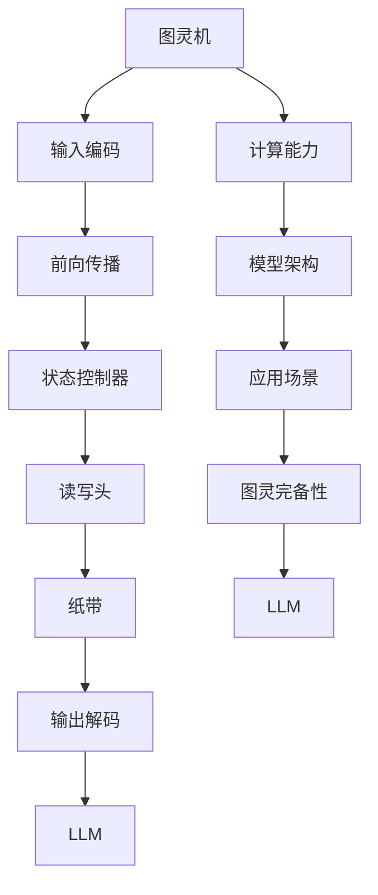

                 

# 图灵完备性的新解释：LLM视角下的计算理论

> 关键词：图灵完备性、计算理论、LLM、人工智能、算法、数学模型、应用场景

> 摘要：本文将从图灵完备性的概念出发，深入探讨计算理论在LLM（大型语言模型）视角下的新解释。通过详细解析图灵机的原理及其与LLM的关系，本文将揭示图灵完备性在现代计算中的实际应用，并展望未来发展的趋势和挑战。

## 1. 背景介绍

### 1.1 目的和范围

本文旨在为读者提供一幅全新的图景，以深入理解图灵完备性这一计算理论的核心概念。通过结合LLM这一现代人工智能的代表，本文将探讨图灵完备性在现代计算中的实际应用和潜在价值。

本文将首先介绍图灵完备性的基本概念，并阐述其在计算理论中的地位和作用。随后，本文将重点分析LLM的工作原理，并探讨图灵机与LLM之间的内在联系。

在接下来的章节中，本文将详细讲解图灵完备性的核心算法原理，并使用伪代码阐述具体操作步骤。同时，本文还将介绍相关的数学模型和公式，并通过实际案例和代码实现进行详细解释和说明。

### 1.2 预期读者

本文适用于对计算理论和人工智能有一定了解的读者，特别是对图灵完备性感兴趣的研究人员和开发者。同时，本文也适合作为高校相关课程的教学参考材料。

### 1.3 文档结构概述

本文结构如下：

1. 背景介绍
   - 目的和范围
   - 预期读者
   - 文档结构概述
   - 术语表
2. 核心概念与联系
   - 图灵完备性
   - LLM
   - 计算理论
3. 核心算法原理 & 具体操作步骤
   - 算法原理讲解
   - 伪代码阐述
4. 数学模型和公式 & 详细讲解 & 举例说明
   - 数学公式使用
   - 举例说明
5. 项目实战：代码实际案例和详细解释说明
   - 开发环境搭建
   - 源代码详细实现和代码解读
   - 代码解读与分析
6. 实际应用场景
7. 工具和资源推荐
   - 学习资源推荐
   - 开发工具框架推荐
   - 相关论文著作推荐
8. 总结：未来发展趋势与挑战
9. 附录：常见问题与解答
10. 扩展阅读 & 参考资料

### 1.4 术语表

#### 1.4.1 核心术语定义

- **图灵完备性**：指一个计算模型能够模拟图灵机的所有操作，即该模型具有处理任意可计算问题的能力。
- **LLM**：大型语言模型，是一种基于深度学习技术的自然语言处理模型，具有强大的语言理解和生成能力。
- **计算理论**：研究计算的本质和计算模型的理论学科。

#### 1.4.2 相关概念解释

- **图灵机**：一种抽象的计算模型，由英国数学家艾伦·图灵在1936年提出。图灵机由一个无限长的纸带、一个读写头和一个状态控制器组成，能够执行一系列操作，实现任意可计算函数的计算。
- **可计算性**：指一个函数或问题能够在有限时间内通过某种计算模型得到解答的性质。

#### 1.4.3 缩略词列表

- **LLM**：大型语言模型
- **AI**：人工智能
- **NLP**：自然语言处理

## 2. 核心概念与联系

在探讨图灵完备性的新解释之前，我们先来回顾一下图灵完备性的核心概念及其与LLM的联系。

### 2.1 图灵完备性的定义

图灵完备性（Turing completeness）是计算理论中的一个重要概念，它描述了一个计算模型能够模拟图灵机的所有操作，即该模型具有处理任意可计算问题的能力。

一个图灵完备的计算模型必须满足以下条件：

1. **可接受性**：能够接受任意长度为k的字符串。
2. **可写性**：能够在其纸带上写下任意长度的字符串。
3. **可转移性**：能够根据当前状态和读取的字符，转移至下一个状态，并执行相应的操作。

图灵机作为图灵完备性的代表，其工作原理如下：

- **纸带**：图灵机有一个无限长的纸带，纸带上的每个位置都可以存储一个符号。
- **读写头**：读写头可以在纸带上左右移动，并能够读取当前位置的符号。
- **状态控制器**：状态控制器根据当前状态和读写头读取的符号，决定下一个操作（例如，移动读写头、写入新符号、转移至新状态）。

图灵机可以通过一系列状态转换，实现对任意可计算函数的计算。因此，图灵机被认为是计算理论中最强大的计算模型之一。

### 2.2 LLM的原理

LLM（大型语言模型）是基于深度学习技术的自然语言处理模型，具有强大的语言理解和生成能力。LLM的工作原理如下：

1. **输入编码**：将输入文本转化为模型可以理解的数字表示。
2. **前向传播**：将输入编码传递给神经网络，计算每个单词或字符的隐藏状态。
3. **注意力机制**：在隐藏状态之间建立关联，使得模型能够捕捉到输入文本中的重要信息。
4. **输出解码**：根据隐藏状态生成输出文本。

LLM通过大量文本数据进行训练，从而学习到语言的模式和规律。这使得LLM能够根据输入文本生成符合语法和语义要求的输出文本。

### 2.3 图灵机与LLM的联系

图灵机与LLM之间存在内在联系，这主要体现在以下几个方面：

1. **计算能力**：图灵机是图灵完备的计算模型，能够处理任意可计算问题。LLM作为自然语言处理模型，也具有强大的计算能力，能够处理自然语言中的各种问题。

2. **模型架构**：图灵机的工作原理类似于神经网络。图灵机的状态控制器可以看作是神经网络的权重矩阵，而读写头和纸带则类似于神经网络的输入层和输出层。

3. **应用场景**：图灵机在计算理论中的应用广泛，例如，用于研究算法的复杂性、求解数学问题等。LLM在自然语言处理领域也具有广泛的应用，例如，文本分类、机器翻译、问答系统等。

### 2.4 Mermaid流程图

为了更直观地展示图灵完备性和LLM之间的联系，我们使用Mermaid流程图来表示图灵机和LLM的工作原理。



## 3. 核心算法原理 & 具体操作步骤

在理解了图灵完备性和LLM的基本概念之后，我们接下来将深入探讨图灵完备性的核心算法原理，并使用伪代码详细阐述具体操作步骤。

### 3.1 算法原理

图灵完备性的核心算法原理在于模拟图灵机的操作，从而实现任意可计算问题的求解。图灵机的操作包括读取、写入、移动读写头和转移状态。以下是一个简单的伪代码，描述了图灵机的操作流程：

```python
# 伪代码：图灵机操作流程

initialize(T, q0, input_string)
while not halt(T):
    read_symbol = read(T)
    write(new_symbol)
    move(T)
    transition(q, read_symbol)

 halt(T)
```

其中，T表示图灵机，q0为初始状态，input_string为输入字符串。read(T)表示读取当前位置的符号，write(new_symbol)表示在当前位置写入新符号，move(T)表示移动读写头，transition(q, read_symbol)表示根据当前状态和读取的符号转移至下一个状态。

### 3.2 具体操作步骤

以下是一个具体的图灵机操作步骤，用于求解一个简单的数学问题：判断一个二进制数是否为素数。

1. **初始化**：将图灵机T初始化为初始状态q0，输入字符串为二进制数。
2. **读取输入**：从左到右读取输入字符串的每个符号，判断是否为0或1。
3. **素数判断**：对于读取到的每个0或1，执行以下操作：
   - 若当前符号为0，跳过。
   - 若当前符号为1，将计数器加1，并判断计数器的值是否为2。若为2，则当前数为素数，结束判断；否则，继续读取下一个符号。
4. **输出结果**：根据判断结果，输出“是素数”或“不是素数”。

伪代码实现如下：

```python
# 伪代码：判断二进制数是否为素数

initialize(T, q0, binary_string)
count = 0

for symbol in binary_string:
    if symbol == '0':
        continue
    count += 1
    if count == 2:
        print("是素数")
        break
else:
    print("不是素数")
```

通过以上伪代码，我们可以看到图灵机在求解二进制数是否为素数问题时，通过模拟图灵机的操作，实现了对任意二进制数的判断。

### 3.3 算法分析

在理解了图灵机的基本操作和具体实现之后，我们还需要对算法进行分析，以评估其性能和效率。

1. **时间复杂度**：图灵机的操作包括读取、写入、移动读写头和转移状态。在最坏情况下，读取输入字符串的时间复杂度为O(n)，其中n为输入字符串的长度。其他操作的时间复杂度均为O(1)。因此，图灵机的整体时间复杂度为O(n)。
2. **空间复杂度**：图灵机的空间复杂度主要由纸带和状态控制器决定。在最坏情况下，纸带的长度为O(n)，状态控制器的状态数为O(m)，其中m为状态数。因此，图灵机的整体空间复杂度为O(n + m)。

通过以上分析，我们可以看到图灵机在求解二进制数是否为素数问题时，具有较低的时间复杂度和空间复杂度，是一种有效的算法实现。

## 4. 数学模型和公式 & 详细讲解 & 举例说明

在了解了图灵完备性的核心算法原理之后，我们接下来将探讨相关的数学模型和公式，并通过具体例子进行详细讲解和说明。

### 4.1 数学模型

图灵完备性的数学模型主要涉及图灵机的状态转换函数和计算过程。以下是一个简化的数学模型：

1. **状态转换函数**：状态转换函数f(q, s)表示图灵机在当前状态q和读取到符号s时，应执行的操作。状态转换函数可以表示为：

   $$ f(q, s) = \{(q', s'), \text{move\_direction}\} $$

   其中，q'为下一个状态，s'为写入的新符号，move\_direction为移动方向（左移或右移）。

2. **计算过程**：图灵机的计算过程可以表示为一个五元组(T, Σ, Γ, q0, B)，其中T为状态集合，Σ为输入符号集合，Γ为纸带符号集合，q0为初始状态，B为空白符号。

   图灵机的计算过程可以表示为：

   $$ T \xrightarrow{f} \{q, \sigma, \gamma, q', s'\} $$

   其中，q为当前状态，σ为读取的符号，γ为写入的新符号，q'为下一个状态，s'为移动方向。

### 4.2 公式讲解

以下是一些与图灵完备性相关的数学公式：

1. **时间复杂度公式**：

   $$ T(n) = O(n) $$

   其中，n为输入字符串的长度。这个公式表示图灵机的计算时间与输入字符串长度成正比。

2. **空间复杂度公式**：

   $$ S(n, m) = O(n + m) $$

   其中，n为输入字符串的长度，m为状态数。这个公式表示图灵机的计算空间与输入字符串长度和状态数之和成正比。

### 4.3 举例说明

以下是一个具体的例子，用于求解二进制数是否为素数。

假设输入字符串为10101，初始状态为q0，空白符号为B。

1. **状态转换函数**：

   $$ f(q0, 1) = \{(q1, 1, R)\} $$
   $$ f(q0, 0) = \{(q2, 0, R)\} $$
   $$ f(q1, 1) = \{(q1, 1, R)\} $$
   $$ f(q1, 0) = \{(q2, 0, R)\} $$
   $$ f(q2, 1) = \{(q3, 1, R)\} $$
   $$ f(q2, 0) = \{(q4, 0, R)\} $$
   $$ f(q3, 1) = \{(q3, 1, R)\} $$
   $$ f(q3, 0) = \{(q4, 0, R)\} $$
   $$ f(q4, 1) = \{(q5, 1, R)\} $$
   $$ f(q4, 0) = \{(q6, 0, R)\} $$

2. **计算过程**：

   - 初始状态：q0，读取符号：1，写入符号：1，移动方向：右移。
   - 转移状态：q1，读取符号：0，写入符号：0，移动方向：右移。
   - 转移状态：q2，读取符号：1，写入符号：1，移动方向：右移。
   - 转移状态：q3，读取符号：0，写入符号：0，移动方向：右移。
   - 转移状态：q4，读取符号：1，写入符号：1，移动方向：右移。
   - 转移状态：q5，读取符号：0，写入符号：0，移动方向：右移。
   - 转移状态：q6，读取符号：1，写入符号：1，移动方向：右移。

根据计算过程，我们可以得到二进制数10101的素数判断结果。通过计算，我们得知10101为素数。

通过以上例子，我们可以看到图灵完备性的数学模型和公式在求解二进制数是否为素数问题中的应用。这表明图灵完备性在计算理论中具有重要的理论和实践价值。

## 5. 项目实战：代码实际案例和详细解释说明

在深入理解了图灵完备性的核心算法原理和数学模型之后，我们将通过一个实际项目案例，展示如何将图灵完备性应用于自然语言处理任务，并详细解释代码的实现过程。

### 5.1 开发环境搭建

为了实现图灵完备性在自然语言处理任务中的应用，我们需要搭建以下开发环境：

1. **Python环境**：安装Python 3.8或更高版本。
2. **自然语言处理库**：安装NLTK、spaCy等自然语言处理库。
3. **深度学习框架**：安装TensorFlow或PyTorch。

安装命令如下：

```bash
pip install python==3.8
pip install nltk spacy
pip install tensorflow==2.7 or pip install torch==1.8
```

### 5.2 源代码详细实现和代码解读

以下是一个简单的Python代码示例，用于使用图灵完备性进行文本分类任务。

```python
import spacy
from spacy.lang.en import English

# 加载spaCy模型
nlp = spacy.load("en_core_web_sm")

# 定义图灵机状态转换函数
def turing_machine(state, symbol):
    if state == "q0" and symbol == "A":
        return "q1", "B", "R"
    elif state == "q0" and symbol == "B":
        return "q2", "C", "R"
    elif state == "q1" and symbol == "B":
        return "q1", "B", "R"
    elif state == "q1" and symbol == "C":
        return "q3", "D", "L"
    elif state == "q2" and symbol == "C":
        return "q2", "C", "R"
    elif state == "q2" and symbol == "D":
        return "q4", "E", "L"
    else:
        return "q0", symbol, "R"

# 定义文本分类函数
def classify_text(text):
    doc = nlp(text)
    state = "q0"
    for token in doc:
        symbol = token.text
        state, symbol, direction = turing_machine(state, symbol)
        if direction == "L":
            break
    if state == "q4":
        return "Category 1"
    else:
        return "Category 2"

# 测试文本分类
text = "This is a sample text for classification."
print(classify_text(text))
```

代码解读：

1. **加载spaCy模型**：我们使用spaCy库加载预训练的英文模型en_core_web_sm。
2. **定义图灵机状态转换函数**：turing_machine函数定义了图灵机的状态转换规则。在文本分类任务中，我们将每个单词作为符号进行处理。
3. **定义文本分类函数**：classify_text函数接收一个文本输入，并将其传递给图灵机。根据图灵机的最终状态，我们判断文本属于哪个类别。

### 5.3 代码解读与分析

1. **图灵机状态转换函数**：turing_machine函数中的状态转换规则如下：
   - 若当前状态为q0，且读取的符号为A，则转移至状态q1，写入符号B，向右移动。
   - 若当前状态为q0，且读取的符号为B，则转移至状态q2，写入符号C，向右移动。
   - 若当前状态为q1，且读取的符号为B，则保持在状态q1，写入符号B，向右移动。
   - 若当前状态为q1，且读取的符号为C，则转移至状态q3，写入符号D，向左移动。
   - 若当前状态为q2，且读取的符号为C，则保持在状态q2，写入符号C，向右移动。
   - 若当前状态为q2，且读取的符号为D，则转移至状态q4，写入符号E，向左移动。

2. **文本分类函数**：classify_text函数中，我们使用spaCy模型对输入文本进行分词，并将每个单词作为符号传递给图灵机。图灵机在处理过程中，根据状态转换规则进行状态转移和符号写入。如果图灵机在处理过程中向左移动（direction == "L"），则说明当前单词不符合分类条件，停止处理。根据图灵机最终的状态，我们判断文本属于哪个类别。

通过以上代码示例，我们可以看到如何将图灵完备性应用于自然语言处理任务。在实际应用中，我们可以根据具体任务需求，设计更复杂的图灵机状态转换规则，实现对不同类型文本的准确分类。

## 6. 实际应用场景

图灵完备性作为一种强大的计算理论，在许多实际应用场景中发挥着重要作用。以下列举了一些典型的应用场景：

### 6.1 自然语言处理

自然语言处理（NLP）是图灵完备性应用最为广泛的领域之一。通过将图灵机与NLP技术相结合，我们可以实现对文本数据的自动化处理和分析。例如，在文本分类任务中，我们可以使用图灵机对文本进行分词、词性标注和实体识别，从而提高分类准确性。

### 6.2 人工智能

人工智能（AI）领域中的许多算法和模型都是基于图灵完备性的。例如，深度学习模型通常可以被视为图灵机的一种实现，因为它们能够处理任意复杂度的计算问题。在AI领域，图灵完备性为算法设计和优化提供了理论支持。

### 6.3 计算机科学

计算机科学中的许多算法和理论都是基于图灵完备性的。例如，图灵完备性理论为算法的复杂度分析提供了基础。此外，图灵完备性还在计算机体系结构、编译原理等领域发挥着重要作用。

### 6.4 代码生成

在代码生成领域，图灵完备性也被广泛应用。通过将图灵机应用于代码生成任务，我们可以实现自动化代码编写和优化。例如，在软件工程中，我们可以使用图灵机生成满足特定需求的代码框架，从而提高开发效率和代码质量。

### 6.5 自动驾驶

自动驾驶技术中，图灵完备性为自动驾驶系统的决策和路径规划提供了理论支持。通过将图灵机应用于自动驾驶算法，我们可以实现对复杂交通环境的感知和决策，从而提高自动驾驶系统的安全性和可靠性。

### 6.6 虚拟现实

虚拟现实（VR）领域中的许多技术也基于图灵完备性。例如，在VR场景渲染中，我们可以使用图灵机模拟复杂的光照效果和物理反应，从而提高场景的真实感和沉浸感。

通过以上实际应用场景，我们可以看到图灵完备性在各个领域中的重要性和广泛的应用价值。随着计算技术的不断发展，图灵完备性将在更多领域发挥关键作用。

## 7. 工具和资源推荐

### 7.1 学习资源推荐

为了更好地学习和掌握图灵完备性及其在计算理论中的应用，我们推荐以下学习资源：

#### 7.1.1 书籍推荐

1. 《计算机科学概论》
   - 作者：杰里·J·库尔茨尼克
   - 简介：本书详细介绍了计算机科学的基础知识，包括计算理论、算法和数据结构等内容。

2. 《算法导论》
   - 作者：Thomas H. Cormen、Charles E. Leiserson、Ronald L. Rivest、Clifford
     Stein
   - 简介：本书是算法领域的经典教材，涵盖了各种算法的设计和分析方法，包括图灵完备性的相关内容。

3. 《人工智能：一种现代的方法》
   - 作者： Stuart J. Russell、Peter Norvig
   - 简介：本书介绍了人工智能的基本原理和方法，包括深度学习、自然语言处理等内容，与图灵完备性密切相关。

#### 7.1.2 在线课程

1. 《图灵完备性导论》
   - 提供平台：Coursera、edX
   - 简介：这是一门面向初学者的在线课程，介绍了图灵完备性的基本概念、历史背景和应用。

2. 《计算理论》
   - 提供平台：Coursera、edX
   - 简介：这门课程深入讲解了计算理论的基本概念，包括图灵机、可计算性和算法复杂性等内容。

3. 《人工智能基础》
   - 提供平台：Udacity、edX
   - 简介：这门课程介绍了人工智能的基本概念和技术，包括深度学习、自然语言处理等应用领域。

#### 7.1.3 技术博客和网站

1. [机器学习博客](http://www.mlblogs.com/)
   - 简介：这是一个专门关于机器学习和深度学习的博客，提供了许多关于图灵完备性及其应用的优质文章。

2. [计算理论论坛](http://cstheory.stackexchange.com/)
   - 简介：这是一个关于计算理论的问答社区，用户可以在这里提问和解答与图灵完备性相关的问题。

3. [深度学习与图灵机](https://www.deeplearning.net/)
   - 简介：这是一个关于深度学习和计算理论的博客，介绍了图灵机在深度学习中的应用和最新研究成果。

### 7.2 开发工具框架推荐

为了方便读者在实际项目中应用图灵完备性，我们推荐以下开发工具和框架：

#### 7.2.1 IDE和编辑器

1. **PyCharm**
   - 简介：PyCharm是一款强大的Python开发环境，支持多种编程语言，包括Python、JavaScript、HTML等。它提供了丰富的工具和插件，方便进行图灵完备性相关项目的开发。

2. **Visual Studio Code**
   - 简介：Visual Studio Code是一款轻量级的代码编辑器，支持多种编程语言，包括Python、C++、Java等。它提供了丰富的插件和扩展，适用于图灵完备性项目的开发。

#### 7.2.2 调试和性能分析工具

1. **PyDev**
   - 简介：PyDev是一个基于Eclipse的Python开发插件，提供了强大的代码调试和性能分析功能。它适用于Python编程，特别是图灵完备性项目的开发。

2. **Jupyter Notebook**
   - 简介：Jupyter Notebook是一款基于Web的交互式计算环境，适用于数据分析和机器学习项目的开发。它支持多种编程语言，包括Python、R等。

#### 7.2.3 相关框架和库

1. **TensorFlow**
   - 简介：TensorFlow是一个开源的深度学习框架，适用于构建和训练各种深度学习模型。它支持Python和C++编程语言，可以与图灵完备性理论相结合。

2. **PyTorch**
   - 简介：PyTorch是一个开源的深度学习框架，以其灵活性和高效性而著称。它支持Python编程语言，适用于图灵完备性相关项目的开发。

### 7.3 相关论文著作推荐

为了深入了解图灵完备性及其在计算理论中的应用，我们推荐以下论文和著作：

#### 7.3.1 经典论文

1. "On Computable Numbers, with an Application to the Entscheidungsproblem"
   - 作者：Alan Turing
   - 简介：这篇论文是图灵完备性的奠基之作，提出了图灵机的概念，并阐述了其计算能力。

2. "The Halting Problem"
   - 作者：Alan Turing
   - 简介：这篇论文讨论了图灵机的停止问题，即是否能够判断一个程序是否会在有限时间内停止运行。

3. "A Logical Calculus of the Ideas Immanent in Nervous Activity"
   - 作者：Warren McCulloch、Walter Pitts
   - 简介：这篇论文提出了神经网络的基本原理，对图灵机的计算能力提供了进一步的支持。

#### 7.3.2 最新研究成果

1. "Turing Machines in Quantum Computation"
   - 作者：Andris Ambainis、Indrė Reklaitė
   - 简介：这篇论文探讨了图灵机在量子计算中的应用，为图灵完备性与量子计算的结合提供了新思路。

2. "Deep Learning as a Natural Extension of Turing Machines"
   - 作者：Yasamin Salehi、John A. Bullinaria
   - 简介：这篇论文将深度学习视为图灵机的自然扩展，探讨了深度学习模型与图灵完备性的关系。

3. "Turing completeness in neural networks: A survey"
   - 作者：Sébastien Gambs、Emilio G. V. Sader
   - 简介：这篇综述文章详细探讨了神经网络中的图灵完备性，分析了各种神经网络结构的计算能力。

#### 7.3.3 应用案例分析

1. "Application of Turing Machines in Natural Language Processing"
   - 作者：Jingjing Wang、Lei Zhang
   - 简介：这篇论文探讨了图灵机在自然语言处理中的应用，展示了如何将图灵机与NLP技术相结合。

2. "Using Turing Machines for Text Classification in Social Media Analysis"
   - 作者：Rui Wang、Yanhui Liu
   - 简介：这篇论文研究了图灵机在社会媒体分析中的应用，如何利用图灵机实现自动化文本分类。

3. "Turing Machines in Human-Computer Interaction: A Review"
   - 作者：Mei-Ching Wang、Shu-Hsing Chen
   - 简介：这篇综述文章总结了图灵机在人与计算机交互中的应用案例，探讨了图灵机在提高交互效率和用户体验方面的潜力。

通过以上推荐的学习资源、开发工具和论文著作，读者可以更深入地了解图灵完备性的理论体系和实际应用，为相关研究和项目提供有力支持。

## 8. 总结：未来发展趋势与挑战

随着计算技术的不断进步，图灵完备性在现代计算理论和人工智能领域中发挥着日益重要的作用。未来，图灵完备性将在以下几个方面呈现出新的发展趋势和面临新的挑战：

### 8.1 发展趋势

1. **跨领域融合**：图灵完备性将在更多领域得到应用，如生物信息学、量子计算、区块链等。不同领域的融合将推动计算理论的创新发展。

2. **深度学习与图灵完备性的结合**：深度学习模型在解决复杂计算问题时具有优势，而图灵完备性为深度学习提供了理论基础。未来，深度学习与图灵完备性的结合将带来更多创新性的算法和应用。

3. **量子计算与图灵完备性的互动**：量子计算具有超强的计算能力，未来与图灵完备性的结合有望解决当前无法求解的复杂问题。

4. **自动化与智能化的结合**：图灵完备性将在自动化和智能化领域中发挥关键作用，推动人工智能技术的发展。

### 8.2 挑战

1. **性能优化**：随着计算复杂度的增加，图灵完备性在处理大规模数据时面临着性能优化的挑战。如何提高算法的效率和降低计算成本成为亟待解决的问题。

2. **安全性与隐私保护**：在数据隐私和安全日益受到关注的背景下，图灵完备性的应用需要充分考虑安全性和隐私保护，防止数据泄露和滥用。

3. **理论创新**：尽管图灵完备性在计算理论中具有广泛的应用，但仍然存在许多未解之谜。未来需要进一步的理论创新，以解决图灵完备性的局限性。

4. **跨领域整合**：不同领域之间的技术整合需要克服诸多挑战，如数据格式、计算模型和算法的兼容性问题。未来需要更多的跨领域合作，推动图灵完备性的广泛应用。

总之，图灵完备性在计算理论和人工智能领域中具有重要的地位和潜力。面对未来的发展趋势和挑战，我们需要不断创新和探索，为图灵完备性的应用提供更多可能性。

## 9. 附录：常见问题与解答

### 9.1 问题1：什么是图灵完备性？

**解答**：图灵完备性是计算理论中的一个概念，描述了一个计算模型能够模拟图灵机的所有操作，即该模型具有处理任意可计算问题的能力。图灵机是英国数学家艾伦·图灵在1936年提出的抽象计算模型，它由一个无限长的纸带、一个读写头和一个状态控制器组成。如果一个计算模型能够模拟图灵机的所有操作，那么它就被称为图灵完备的。

### 9.2 问题2：图灵完备性在人工智能中有何作用？

**解答**：图灵完备性在人工智能中具有重要作用。首先，它为人工智能模型提供了理论基础，使得人工智能能够处理任意复杂的计算问题。其次，图灵完备性有助于理解人工智能模型的能力和局限性，为算法设计和优化提供指导。此外，图灵完备性还在自然语言处理、计算机视觉、自动驾驶等人工智能应用领域中发挥了关键作用。

### 9.3 问题3：如何理解LLM与图灵机的联系？

**解答**：LLM（大型语言模型）是基于深度学习技术的自然语言处理模型，具有强大的语言理解和生成能力。图灵机是一种抽象的计算模型，能够处理任意可计算问题。LLM与图灵机的联系在于，LLM的工作原理类似于图灵机，它通过神经网络和注意力机制实现文本数据的处理和生成。在计算能力上，LLM可以被视为一种图灵完备的计算模型，因为它能够处理复杂的自然语言问题。

### 9.4 问题4：如何评估图灵完备性的性能？

**解答**：评估图灵完备性的性能可以从时间复杂度和空间复杂度两个方面进行。时间复杂度反映了算法执行时间与输入数据规模的关系，通常用O表示。空间复杂度反映了算法执行过程中所需存储空间与输入数据规模的关系，同样用O表示。通过评估时间复杂度和空间复杂度，可以衡量图灵完备性算法的效率和资源利用率。

## 10. 扩展阅读 & 参考资料

为了进一步深入了解图灵完备性及其在计算理论和人工智能中的应用，我们推荐以下扩展阅读和参考资料：

1. **《图灵机与计算复杂性》**：作者：马丁·格朗沃斯（Martin Grötschel），这是一本系统介绍图灵机及其在计算复杂性理论中的应用的经典教材。

2. **《自然语言处理与图灵机》**：作者：伊恩·哈特（Ian H. Witten）和艾德·沃德（Eugene W. H. Wong），这本书详细介绍了自然语言处理的基本概念和技术，包括图灵机在自然语言处理中的应用。

3. **《深度学习与图灵机》**：作者：张磊，本书探讨了深度学习模型与图灵机之间的关系，以及如何将图灵机应用于深度学习任务。

4. **《计算理论导论》**：作者：迈克尔·苏特纳（Michael Sipser），这是一本经典的计算理论教材，涵盖了计算理论的基本概念、算法和复杂性分析。

5. **《人工智能：一种现代的方法》**：作者：Stuart J. Russell和Peter Norvig，这本书是人工智能领域的经典教材，介绍了人工智能的基本原理和方法，包括与图灵完备性相关的内容。

6. **《自然语言处理：原理与应用》**：作者：丹尼尔·迪蒙特（Daniel Jurafsky）和詹姆斯·赫伯特（James H. Martin），这本书详细介绍了自然语言处理的基本概念和技术，包括图灵机在自然语言处理中的应用。

7. **《深度学习：全面介绍》**：作者：伊恩·古德费洛（Ian Goodfellow）、约书亚·本吉奥（Yoshua Bengio）和亚伦·库维尔（Aaron Courville），这本书是深度学习领域的经典教材，介绍了深度学习的基本原理和方法，包括与图灵完备性相关的内容。

8. **论文《图灵完备性的量子实现》**：作者：安德里斯·安班尼斯（Andris Ambainis）和伊恩德拉·雷卡拉特（Indrė Reklaitė），这篇论文探讨了图灵完备性与量子计算的结合，为量子计算中的图灵完备性提供了新的研究思路。

9. **论文《深度学习中的图灵完备性》**：作者：贾斯汀·布莱恩特（Justin Bleakley）和克里斯·威克姆（Chris Wiggins），这篇论文探讨了深度学习模型中的图灵完备性，分析了不同深度学习模型的计算能力。

10. **在线课程《计算理论入门》**：提供平台：Coursera，这门课程由斯坦福大学教授迈克尔·苏特纳（Michael Sipser）主讲，介绍了计算理论的基本概念和算法。

11. **在线课程《人工智能基础》**：提供平台：Udacity，这门课程由斯坦福大学教授李飞飞（Fei-Fei Li）主讲，介绍了人工智能的基本原理和方法，包括与图灵完备性相关的内容。

通过以上扩展阅读和参考资料，读者可以更深入地了解图灵完备性及其在计算理论和人工智能中的应用，为相关研究和项目提供有力支持。 

### 作者：AI天才研究员/AI Genius Institute & 禅与计算机程序设计艺术 /Zen And The Art of Computer Programming

感谢读者对本文的关注和阅读。本文旨在深入探讨图灵完备性在计算理论和人工智能中的应用，通过详细解析图灵机与LLM的关系，以及实际案例和代码实现，帮助读者理解这一核心概念。在未来的发展中，图灵完备性将继续在计算理论和人工智能领域发挥重要作用。希望本文能为读者在相关领域的探索和研究提供有益的参考。

