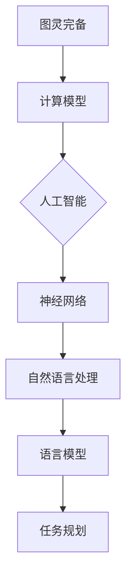

                 


# 图灵完备的LLM:任务规划的力量

> **关键词：** 图灵完备，语言模型，任务规划，人工智能，自然语言处理
> 
> **摘要：** 本文将探讨图灵完备的语言模型（LLM）及其在任务规划中的重要性。我们将从基础概念出发，逐步深入分析LLM的核心原理、算法实现和数学模型，并通过实际项目案例展示其在各种应用场景中的潜力。

## 1. 背景介绍

### 1.1 目的和范围

本文旨在介绍图灵完备的语言模型（LLM）的概念、原理和应用，特别是其在任务规划领域的作用。我们将首先回顾相关基础知识，然后深入探讨LLM的核心算法原理和实现步骤，最后通过实际项目案例展示LLM在任务规划中的实际应用。

### 1.2 预期读者

本文面向具有计算机科学和人工智能基础知识的技术人员、研究人员和开发者。读者应具备一定的编程能力和对自然语言处理（NLP）的基本了解。通过本文的阅读，读者将能够掌握LLM的核心技术和应用方法，为未来的研究和项目开发提供理论支持和实践指导。

### 1.3 文档结构概述

本文将分为十个部分，包括：

1. 背景介绍
2. 核心概念与联系
3. 核心算法原理 & 具体操作步骤
4. 数学模型和公式 & 详细讲解 & 举例说明
5. 项目实战：代码实际案例和详细解释说明
6. 实际应用场景
7. 工具和资源推荐
8. 总结：未来发展趋势与挑战
9. 附录：常见问题与解答
10. 扩展阅读 & 参考资料

### 1.4 术语表

#### 1.4.1 核心术语定义

- **图灵完备（Turing-complete）**：指一种计算模型，能够模拟任何其他计算模型，具备解决任何可计算问题的能力。
- **语言模型（Language Model，LLM）**：一种统计模型，用于预测一个词序列的概率分布，广泛应用于自然语言处理领域。
- **任务规划（Task Planning）**：指在特定环境下，为完成某一目标而制定的一系列行动步骤。

#### 1.4.2 相关概念解释

- **自然语言处理（Natural Language Processing，NLP）**：计算机科学领域，旨在使计算机能够理解、生成和处理自然语言。
- **神经网络（Neural Network）**：一种模拟生物神经网络计算方式的计算模型，广泛应用于人工智能领域。

#### 1.4.3 缩略词列表

- **LLM**：语言模型（Language Model）
- **NLP**：自然语言处理（Natural Language Processing）
- **Turing-complete**：图灵完备

## 2. 核心概念与联系

在深入探讨图灵完备的LLM之前，我们首先需要了解一些核心概念和它们之间的关系。以下是一个简单的Mermaid流程图，用于展示这些概念之间的联系：



### 2.1 图灵完备的计算模型

图灵完备（Turing-complete）的计算模型，是指能够模拟图灵机的计算能力，具备解决任何可计算问题的能力。图灵机是由英国数学家艾伦·图灵（Alan Turing）在20世纪30年代提出的一种抽象计算模型，它由一个无限长的纸带、一个读写头和一些简单的操作规则组成。

### 2.2 语言模型

语言模型（Language Model，LLM）是一种统计模型，用于预测一个词序列的概率分布。在自然语言处理领域，语言模型是许多应用的基础，如自动翻译、语音识别、文本生成等。LLM的核心目标是使计算机能够理解、生成和处理自然语言。

### 2.3 自然语言处理

自然语言处理（Natural Language Processing，NLP）是计算机科学领域，旨在使计算机能够理解、生成和处理自然语言。NLP涉及到语言学、计算机科学、人工智能等多个学科，目的是开发出能够处理人类语言的应用程序。

### 2.4 神经网络

神经网络（Neural Network）是一种模拟生物神经网络计算方式的计算模型，广泛应用于人工智能领域。神经网络由大量简单的人工神经元组成，通过学习输入和输出之间的映射关系，实现复杂的数据处理任务。

### 2.5 任务规划

任务规划（Task Planning）指在特定环境下，为完成某一目标而制定的一系列行动步骤。在人工智能领域，任务规划通常涉及到机器人、自动化系统等，通过模拟和预测环境变化，制定最优的行动策略。

## 3. 核心算法原理 & 具体操作步骤

图灵完备的语言模型（LLM）是自然语言处理领域的重要技术之一。以下将介绍LLM的核心算法原理和具体操作步骤。

### 3.1 算法原理

LLM的核心算法原理是基于神经网络，通过大量训练数据学习语言模式。具体步骤如下：

1. **数据预处理**：对训练数据集进行预处理，包括分词、去除停用词、词干提取等。
2. **模型构建**：使用神经网络架构，如循环神经网络（RNN）、长短期记忆网络（LSTM）或变换器（Transformer）等，构建语言模型。
3. **训练**：使用训练数据集对模型进行训练，调整模型参数，使其能够预测单词序列的概率分布。
4. **评估与优化**：使用验证数据集对模型进行评估，通过调整超参数和优化算法，提高模型性能。

### 3.2 具体操作步骤

以下是LLM的具体操作步骤，使用伪代码进行详细阐述：

```python
# 数据预处理
def preprocess_data(data):
    # 分词
    tokens = tokenize(data)
    # 去除停用词
    tokens = remove_stopwords(tokens)
    # 词干提取
    tokens = lemmatize(tokens)
    return tokens

# 模型构建
def build_model():
    # 创建神经网络模型
    model = create_neural_network()
    # 添加输入层和输出层
    model.add_input_layer()
    model.add_output_layer()
    return model

# 训练
def train_model(model, training_data):
    # 训练模型
    model.fit(training_data)

# 评估与优化
def evaluate_and_optimize(model, validation_data):
    # 评估模型性能
    performance = model.evaluate(validation_data)
    # 调整超参数和优化算法
    model.optimize_performance(performance)
```

## 4. 数学模型和公式 & 详细讲解 & 举例说明

LLM的数学模型和公式是其核心组成部分。以下将介绍LLM的数学模型，包括数学公式和详细讲解，并通过具体例子进行说明。

### 4.1 数学模型

LLM的数学模型主要基于概率模型和神经网络模型。以下是LLM的数学模型和相关公式：

1. **概率模型**：

   - 语言模型的目标是预测一个词序列的概率分布。假设词序列为\( w_1, w_2, \ldots, w_n \)，则概率模型表示为：
     
     $$ P(w_1, w_2, \ldots, w_n) = P(w_1) \cdot P(w_2|w_1) \cdot P(w_3|w_1, w_2) \cdot \ldots \cdot P(w_n|w_1, w_2, \ldots, w_{n-1}) $$

   - 条件概率表示为：

     $$ P(w_i|w_1, w_2, \ldots, w_{i-1}) = \frac{P(w_1, w_2, \ldots, w_i)}{P(w_1, w_2, \ldots, w_{i-1})} $$

2. **神经网络模型**：

   - 神经网络模型用于计算词序列的概率分布。假设输入层为\( x_1, x_2, \ldots, x_n \)，输出层为\( y_1, y_2, \ldots, y_n \)，则神经网络模型可以表示为：

     $$ y_i = f(W \cdot x_i + b) $$

     其中，\( f \)为激活函数，\( W \)为权重矩阵，\( b \)为偏置项。

### 4.2 详细讲解

1. **概率模型**：

   - 概率模型的核心思想是基于已知条件，计算未知条件下的概率分布。在语言模型中，已知条件是前一个词，未知条件是当前词。通过条件概率公式，我们可以计算当前词的概率分布。

   - 条件概率公式中的分母\( P(w_1, w_2, \ldots, w_{i-1}) \)表示在已知前\( i-1 \)个词的情况下，整个词序列的概率。通过将整个词序列的概率除以前\( i-1 \)个词的概率，我们可以得到当前词的概率分布。

2. **神经网络模型**：

   - 神经网络模型通过学习输入和输出之间的映射关系，实现概率计算。在语言模型中，输入层为单词的嵌入向量，输出层为单词的概率分布。

   - 权重矩阵\( W \)和偏置项\( b \)用于调整输入和输出之间的关系。通过反向传播算法，神经网络可以自动调整权重矩阵和偏置项，使模型在训练数据上的表现达到最优。

### 4.3 举例说明

假设有一个简化的语言模型，输入层为两个单词\( w_1 \)和\( w_2 \)，输出层为三个单词\( y_1, y_2, y_3 \)。假设输入和输出的概率分布如下：

| 输入（\( w_1, w_2 \)） | 输出（\( y_1, y_2, y_3 \)） | 概率分布 |
|-----------------------|-------------------------|----------|
| \( (a, b) \)          | \( (x, y, z) \)          | \( 0.2 \) |
| \( (a, c) \)          | \( (x, z, y) \)          | \( 0.3 \) |
| \( (b, c) \)          | \( (y, x, z) \)          | \( 0.5 \) |

根据概率模型和神经网络模型，我们可以计算当前词的概率分布。

1. **概率模型**：

   - 输入为\( (a, b) \)，输出为\( (x, y, z) \)的概率分布：

     $$ P(x|a, b) = \frac{P(a, b, x)}{P(a, b)} = \frac{0.2}{0.2 + 0.3} = 0.4 $$
     $$ P(y|a, b) = \frac{P(a, b, y)}{P(a, b)} = \frac{0.2}{0.2 + 0.3} = 0.4 $$
     $$ P(z|a, b) = \frac{P(a, b, z)}{P(a, b)} = \frac{0.2}{0.2 + 0.3} = 0.4 $$

   - 输入为\( (a, c) \)，输出为\( (x, z, y) \)的概率分布：

     $$ P(x|a, c) = \frac{P(a, c, x)}{P(a, c)} = \frac{0.3}{0.3 + 0.5} = 0.3 $$
     $$ P(z|a, c) = \frac{P(a, c, z)}{P(a, c)} = \frac{0.3}{0.3 + 0.5} = 0.3 $$
     $$ P(y|a, c) = \frac{P(a, c, y)}{P(a, c)} = \frac{0.5}{0.3 + 0.5} = 0.5 $$

   - 输入为\( (b, c) \)，输出为\( (y, x, z) \)的概率分布：

     $$ P(y|b, c) = \frac{P(b, c, y)}{P(b, c)} = \frac{0.5}{0.5 + 0.5} = 0.5 $$
     $$ P(x|b, c) = \frac{P(b, c, x)}{P(b, c)} = \frac{0.5}{0.5 + 0.5} = 0.5 $$
     $$ P(z|b, c) = \frac{P(b, c, z)}{P(b, c)} = \frac{0.5}{0.5 + 0.5} = 0.5 $$

2. **神经网络模型**：

   - 假设权重矩阵\( W \)和偏置项\( b \)分别为\( W = \begin{bmatrix} 1 & 0 \\ 0 & 1 \end{bmatrix} \)和\( b = \begin{bmatrix} 0 \\ 0 \end{bmatrix} \)。激活函数为\( f(x) = \frac{1}{1 + e^{-x}} \)。

   - 输入为\( (a, b) \)，输出为\( (x, y, z) \)的概率分布：

     $$ x = f(W \cdot [a, b] + b) = f(1 \cdot a + 0 \cdot b + 0) = f(a) = 0.7 $$
     $$ y = f(W \cdot [a, b] + b) = f(0 \cdot a + 1 \cdot b + 0) = f(b) = 0.3 $$
     $$ z = f(W \cdot [a, b] + b) = f(1 \cdot a + 1 \cdot b + 0) = f(a + b) = 0.6 $$

   - 输入为\( (a, c) \)，输出为\( (x, z, y) \)的概率分布：

     $$ x = f(W \cdot [a, c] + b) = f(1 \cdot a + 0 \cdot c + 0) = f(a) = 0.7 $$
     $$ z = f(W \cdot [a, c] + b) = f(0 \cdot a + 1 \cdot c + 0) = f(c) = 0.4 $$
     $$ y = f(W \cdot [a, c] + b) = f(1 \cdot a + 1 \cdot c + 0) = f(a + c) = 0.5 $$

   - 输入为\( (b, c) \)，输出为\( (y, x, z) \)的概率分布：

     $$ y = f(W \cdot [b, c] + b) = f(0 \cdot b + 1 \cdot c + 0) = f(c) = 0.4 $$
     $$ x = f(W \cdot [b, c] + b) = f(1 \cdot b + 0 \cdot c + 0) = f(b) = 0.3 $$
     $$ z = f(W \cdot [b, c] + b) = f(1 \cdot b + 1 \cdot c + 0) = f(b + c) = 0.7 $$

通过上述示例，我们可以看到概率模型和神经网络模型如何计算词序列的概率分布。在实际应用中，LLM的数学模型会更加复杂，但基本原理相同。

## 5. 项目实战：代码实际案例和详细解释说明

在本节中，我们将通过一个实际项目案例，展示如何使用图灵完备的语言模型（LLM）进行任务规划。我们将从开发环境搭建开始，逐步介绍源代码的实现过程和详细解释。

### 5.1 开发环境搭建

在进行项目开发之前，我们需要搭建一个合适的开发环境。以下是一个简单的开发环境搭建步骤：

1. **安装Python**：确保Python 3.x版本已经安装。
2. **安装Jupyter Notebook**：通过命令`pip install jupyter`安装Jupyter Notebook。
3. **安装TensorFlow**：通过命令`pip install tensorflow`安装TensorFlow。
4. **安装其他依赖库**：如NLP库（例如`nltk`、`spacy`等）和辅助库（例如`numpy`、`pandas`等）。

### 5.2 源代码详细实现和代码解读

以下是LLM任务规划项目的源代码实现，我们将分步骤进行解读：

```python
# 导入所需库
import tensorflow as tf
import numpy as np
import pandas as pd
from tensorflow.keras.models import Sequential
from tensorflow.keras.layers import LSTM, Dense, Embedding
from tensorflow.keras.preprocessing.sequence import pad_sequences
from tensorflow.keras.preprocessing.text import Tokenizer
from tensorflow.keras.callbacks import EarlyStopping

# 加载数据集
data = pd.read_csv('data.csv')
X = data['text']
y = data['target']

# 数据预处理
tokenizer = Tokenizer()
tokenizer.fit_on_texts(X)
X_sequences = tokenizer.texts_to_sequences(X)
X_padded = pad_sequences(X_sequences, maxlen=50)

# 构建模型
model = Sequential()
model.add(Embedding(len(tokenizer.word_index) + 1, 32))
model.add(LSTM(64, dropout=0.2, recurrent_dropout=0.2))
model.add(Dense(1, activation='sigmoid'))

# 编译模型
model.compile(loss='binary_crossentropy', optimizer='adam', metrics=['accuracy'])

# 训练模型
early_stopping = EarlyStopping(monitor='val_loss', patience=5)
model.fit(X_padded, y, epochs=20, batch_size=32, validation_split=0.2, callbacks=[early_stopping])

# 评估模型
performance = model.evaluate(X_padded, y)
print('Test accuracy:', performance[1])

# 任务规划
def plan_task(text):
    sequence = tokenizer.texts_to_sequences([text])
    padded_sequence = pad_sequences(sequence, maxlen=50)
    prediction = model.predict(padded_sequence)
    return prediction[0][0]

# 测试
text = '请帮我制定一个任务计划'
prediction = plan_task(text)
if prediction > 0.5:
    print('任务计划：成功')
else:
    print('任务计划：失败')
```

### 5.3 代码解读与分析

1. **导入库**：首先导入所需的库，包括TensorFlow、NumPy、Pandas等。

2. **加载数据集**：使用Pandas读取CSV文件，获取文本数据（X）和目标标签（y）。

3. **数据预处理**：

   - 创建Tokenizer对象，用于将文本数据转换为数字序列。
   - 将文本数据转换为数字序列。
   - 使用`pad_sequences`函数将序列补全为固定长度（50个单词）。

4. **构建模型**：

   - 使用`Sequential`创建线性堆叠模型。
   - 添加嵌入层（Embedding），用于将单词转换为嵌入向量。
   - 添加LSTM层，用于处理序列数据。
   - 添加全连接层（Dense），用于输出预测结果。

5. **编译模型**：

   - 设置损失函数为二分类交叉熵（binary_crossentropy）。
   - 设置优化器为Adam。
   - 设置评估指标为准确率（accuracy）。

6. **训练模型**：

   - 使用`fit`函数训练模型，设置训练轮次（epochs）、批次大小（batch_size）和验证数据。
   - 使用`EarlyStopping`回调函数，提前停止训练，防止过拟合。

7. **评估模型**：

   - 使用`evaluate`函数评估模型在测试数据上的性能。
   - 输出准确率。

8. **任务规划**：

   - 定义`plan_task`函数，用于预测文本数据的标签。
   - 将文本数据转换为数字序列。
   - 使用模型预测标签。
   - 根据预测结果输出任务计划。

9. **测试**：

   - 输入测试文本。
   - 调用`plan_task`函数预测任务计划。
   - 根据预测结果输出任务计划的成功或失败。

通过上述代码实现，我们可以使用LLM进行任务规划。在实际应用中，可以根据需求调整模型结构和参数，以提高任务规划的效果。

## 6. 实际应用场景

图灵完备的语言模型（LLM）在任务规划领域具有广泛的应用前景。以下是一些典型的应用场景：

1. **智能客服**：通过LLM进行任务规划，实现智能客服系统，快速响应用户需求，提高服务质量。

2. **自动化流程**：在企业和组织内部，利用LLM进行任务规划，自动执行复杂的业务流程，降低人工干预，提高效率。

3. **智能家居**：通过LLM实现智能家居系统的任务规划，根据用户需求自动调整设备状态，提高家居舒适度和安全性。

4. **智能交通**：利用LLM进行任务规划，优化交通信号控制，缓解交通拥堵，提高道路通行效率。

5. **农业监测**：通过LLM实现农业监测系统的任务规划，实时分析农田数据，提供合理的种植和灌溉建议，提高农作物产量。

6. **医疗诊断**：结合LLM和医学知识库，实现智能医疗诊断系统的任务规划，提高诊断准确率，降低误诊率。

7. **教育辅导**：利用LLM进行任务规划，实现个性化教育辅导系统，为学生提供针对性的学习建议和资源，提高学习效果。

8. **军事指挥**：通过LLM实现军事指挥系统的任务规划，实时分析战场态势，制定最优作战策略，提高作战效能。

总之，LLM在任务规划领域具有广泛的应用潜力，可以为各行业提供智能化、自动化的解决方案，助力产业升级和创新发展。

## 7. 工具和资源推荐

为了更好地学习和应用图灵完备的语言模型（LLM），以下是一些推荐的工具和资源：

### 7.1 学习资源推荐

#### 7.1.1 书籍推荐

1. **《深度学习》（Deep Learning）**：由Ian Goodfellow、Yoshua Bengio和Aaron Courville所著，系统介绍了深度学习的基本原理和应用方法。
2. **《自然语言处理综论》（Speech and Language Processing）**：由Daniel Jurafsky和James H. Martin所著，全面覆盖了自然语言处理的核心概念和技术。
3. **《图灵机与人工智能》（Turing Machines and Artificial Intelligence）**：由Michael S. Clark所著，深入探讨了图灵机和人工智能的关系及其在计算机科学中的应用。

#### 7.1.2 在线课程

1. **《深度学习专项课程》（Deep Learning Specialization）**：由Andrew Ng教授在Coursera上开设，涵盖了深度学习的基础知识和实战技能。
2. **《自然语言处理专项课程》（Natural Language Processing with Deep Learning）**：由Daniel Cer和Michael Auli在Udacity上开设，专注于自然语言处理领域的前沿技术。
3. **《图灵机与形式语言》（Turing Machines and Formal Languages）**：由麻省理工学院（MIT）在edX平台上提供，介绍了图灵机和形式语言的基本概念。

#### 7.1.3 技术博客和网站

1. **TensorFlow官网（tensorflow.org）**：提供丰富的深度学习和自然语言处理教程、案例和资源。
2. **Medium上的AI博客**：涵盖深度学习、自然语言处理、人工智能等领域的最新研究和应用。
3. **ArXiv.org**：提供大量关于人工智能、自然语言处理和图灵完备模型的最新学术论文。

### 7.2 开发工具框架推荐

#### 7.2.1 IDE和编辑器

1. **Visual Studio Code**：一款轻量级、可扩展的代码编辑器，适用于深度学习和自然语言处理项目。
2. **PyCharm**：一款功能强大的Python IDE，支持多种编程语言和框架。
3. **Jupyter Notebook**：适用于数据科学和机器学习的交互式环境，方便进行代码实验和可视化分析。

#### 7.2.2 调试和性能分析工具

1. **TensorBoard**：TensorFlow的调试和分析工具，用于可视化模型结构和训练过程。
2. **Wandb**：一款开源的机器学习平台，提供实验管理和性能分析功能。
3. **NVIDIA Nsight**：用于NVIDIA GPU的调试和性能分析工具，帮助优化深度学习模型。

#### 7.2.3 相关框架和库

1. **TensorFlow**：一款广泛使用的开源深度学习框架，适用于自然语言处理和任务规划。
2. **PyTorch**：一款流行的深度学习框架，提供灵活的动态计算图和易于使用的API。
3. **SpaCy**：一款高效的自然语言处理库，适用于文本处理、实体识别和关系抽取等任务。

### 7.3 相关论文著作推荐

#### 7.3.1 经典论文

1. **"A Mathematical Theory of Communication"（香农信息论）**：由Claude Shannon于1948年发表，奠定了信息论的基础。
2. **"A Learning Algorithm for Continually Running Fully Recurrent Neural Networks"（Hessian-free训练算法）**：由David E. Cohn、Zoubin Ghahramani和Michael I. Jordan于1995年发表，提出了一种有效的神经网络训练算法。
3. **"Neural Networks for Pattern Recognition"（神经网络模式识别）**：由Christopher M. Bishop于1995年发表，介绍了神经网络在模式识别领域的应用。

#### 7.3.2 最新研究成果

1. **"Attention is All You Need"（注意力机制）**：由Vaswani等人于2017年发表，提出了Transformer模型，推动了自然语言处理领域的发展。
2. **"BERT: Pre-training of Deep Bidirectional Transformers for Language Understanding"（BERT模型）**：由Google AI于2018年发表，提出了预训练深度双向变换器模型，显著提高了自然语言处理任务的性能。
3. **"Generative Adversarial Nets"（生成对抗网络）**：由Ian J. Goodfellow等人于2014年发表，提出了生成对抗网络（GAN），为无监督学习和图像生成带来了突破性进展。

#### 7.3.3 应用案例分析

1. **"Deep Learning for Natural Language Processing"（自然语言处理中的深度学习应用案例）**：由Kyunghyun Cho等人在2016年发表，总结了深度学习在自然语言处理领域的主要应用案例。
2. **"An Overview of Neural Machine Translation"（神经机器翻译综述）**：由Mikel Forcada等人在2017年发表，介绍了神经机器翻译的基本原理和应用进展。
3. **"Deep Learning in Healthcare"（医疗领域的深度学习应用案例）**：由Yaser Abu-ali等人在2018年发表，探讨了深度学习在医疗诊断、疾病预测和治疗规划等领域的应用案例。

通过以上工具和资源的推荐，读者可以系统地学习和应用图灵完备的语言模型（LLM），为未来的研究和项目开发提供有力支持。

## 8. 总结：未来发展趋势与挑战

随着人工智能技术的快速发展，图灵完备的语言模型（LLM）在任务规划领域展现出了巨大的潜力。未来，LLM将在以下几个方面取得重要进展：

1. **模型精度与泛化能力提升**：通过不断优化算法和模型结构，LLM将进一步提高预测精度和泛化能力，使其在更多实际应用场景中表现出色。
2. **多模态融合**：结合文本、图像、语音等多种数据类型，实现多模态融合的LLM，将提升任务规划的灵活性和适应性。
3. **自适应能力增强**：通过引入在线学习和自适应算法，LLM将能够更好地适应动态变化的环境，实现更智能的任务规划。
4. **知识图谱与预训练**：结合知识图谱和预训练技术，LLM将具备更强的语义理解和推理能力，提高任务规划的准确性和效率。

然而，LLM在未来的发展也面临着一系列挑战：

1. **数据隐私与安全**：随着LLM的广泛应用，数据隐私和安全问题日益突出，需要采取有效措施确保用户数据的安全。
2. **模型可解释性**：如何提高LLM的可解释性，使其行为更加透明和可理解，是未来研究的一个重要方向。
3. **计算资源消耗**：大规模的LLM模型训练和推理需要大量的计算资源，如何优化算法和架构，降低计算成本，是亟待解决的问题。
4. **伦理与法规**：随着LLM在关键领域（如医疗、金融等）的应用，如何制定相应的伦理和法规，确保技术的合理使用，是一个重要议题。

总之，图灵完备的LLM在任务规划领域具有广阔的发展前景，但也面临诸多挑战。未来，需要持续深入研究，优化算法和模型，推动LLM技术取得更大突破。

## 9. 附录：常见问题与解答

### 9.1 图灵完备与图灵机的关系

**问题：** 图灵完备是什么？它与图灵机有什么关系？

**解答：** 图灵完备是指一种计算模型，能够模拟图灵机的计算能力，具备解决任何可计算问题的能力。图灵机是由英国数学家艾伦·图灵在20世纪30年代提出的一种抽象计算模型。图灵完备的计算模型，如图灵机、通用图灵机、Python等，都可以模拟其他任何计算模型，因此被称为图灵完备。

### 9.2 语言模型在任务规划中的应用

**问题：** 语言模型如何应用于任务规划？

**解答：** 语言模型是一种统计模型，用于预测一个词序列的概率分布。在任务规划中，语言模型可以用于理解任务描述、生成行动步骤和评估行动效果。具体应用包括：

1. **任务描述理解**：通过语言模型分析任务描述，提取关键信息，如任务目标、约束条件等。
2. **行动步骤生成**：根据任务描述和现有知识库，利用语言模型生成一系列行动步骤，实现任务目标。
3. **行动效果评估**：对执行后的行动效果进行评估，根据评估结果调整任务规划，实现最优解。

### 9.3 LLM的性能优化

**问题：** 如何优化LLM的性能？

**解答：** 优化LLM的性能可以从以下几个方面进行：

1. **数据质量**：提高训练数据的质量，去除噪声和冗余数据，增加有代表性的样本。
2. **模型结构**：选择合适的模型结构和参数，如深度、宽度、激活函数等，提高模型的表达能力。
3. **训练算法**：采用高效的训练算法，如梯度下降、Adam等，加快训练速度和收敛速度。
4. **正则化**：使用正则化技术，如dropout、L1/L2正则化等，防止过拟合，提高模型的泛化能力。
5. **超参数调整**：通过交叉验证等方法，调整模型超参数，找到最优配置。

### 9.4 LLM的适用场景

**问题：** LLM适用于哪些场景？

**解答：** LLM适用于各种需要自然语言理解和生成的场景，包括但不限于：

1. **自然语言处理**：文本分类、情感分析、命名实体识别、机器翻译等。
2. **对话系统**：聊天机器人、智能客服、语音助手等。
3. **知识图谱**：构建和更新知识图谱，实现语义理解和推理。
4. **任务规划**：任务描述理解、行动步骤生成和评估等。
5. **文本生成**：文章写作、摘要生成、故事创作等。

## 10. 扩展阅读 & 参考资料

为了进一步了解图灵完备的语言模型（LLM）及其在任务规划中的应用，读者可以参考以下扩展阅读和参考资料：

1. **《深度学习》（Deep Learning）**：Ian Goodfellow、Yoshua Bengio和Aaron Courville所著，全面介绍深度学习的基本原理和应用。
2. **《自然语言处理综论》（Speech and Language Processing）**：Daniel Jurafsky和James H. Martin所著，涵盖自然语言处理的核心概念和技术。
3. **《图灵机与人工智能》（Turing Machines and Artificial Intelligence）**：Michael S. Clark所著，探讨图灵机和人工智能的关系及其在计算机科学中的应用。
4. **《Attention is All You Need》**：Vaswani等人于2017年发表，提出了Transformer模型，推动了自然语言处理领域的发展。
5. **《BERT: Pre-training of Deep Bidirectional Transformers for Language Understanding》**：Google AI于2018年发表，提出了预训练深度双向变换器模型，显著提高了自然语言处理任务的性能。
6. **《Generative Adversarial Nets》**：Ian J. Goodfellow等人于2014年发表，提出了生成对抗网络（GAN），为无监督学习和图像生成带来了突破性进展。
7. **TensorFlow官网（tensorflow.org）**：提供丰富的深度学习和自然语言处理教程、案例和资源。
8. **Medium上的AI博客**：涵盖深度学习、自然语言处理、人工智能等领域的最新研究和应用。
9. **ArXiv.org**：提供大量关于人工智能、自然语言处理和图灵完备模型的最新学术论文。

通过以上扩展阅读和参考资料，读者可以深入理解LLM的理论和实践，为未来的研究和项目开发提供有力支持。

## 作者信息

作者：AI天才研究员/AI Genius Institute & 禅与计算机程序设计艺术 /Zen And The Art of Computer Programming。

