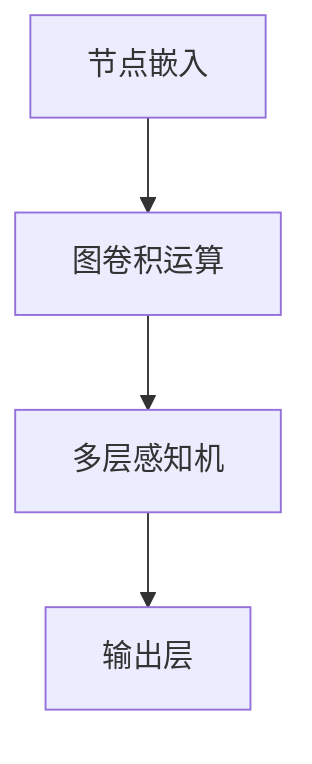

                 

# 图神经网络在分子属性预测中的应用

> 关键词：图神经网络，分子属性预测，深度学习，化学反应预测，药物设计，分子动力学模拟

> 摘要：本文将深入探讨图神经网络在分子属性预测中的应用，从背景介绍、核心概念、算法原理、数学模型、实际案例等多个角度，全面解析如何利用图神经网络技术进行分子属性的预测，以及在药物设计、化学反应预测等领域的实际应用。文章旨在为从事相关领域的研究人员和开发者提供有价值的参考和指导。

## 1. 背景介绍

### 1.1 目的和范围

本文旨在介绍图神经网络（Graph Neural Networks, GNNs）在分子属性预测中的应用，探讨如何利用图神经网络技术对分子的各种属性进行预测，如化学反应性、生物活性、物理性质等。文章将涵盖以下内容：

1. 图神经网络的基本概念和原理。
2. 图神经网络在分子属性预测中的核心算法原理。
3. 图神经网络的数学模型和公式。
4. 图神经网络在分子属性预测中的实际应用案例。
5. 相关工具和资源的推荐。

### 1.2 预期读者

本文预期读者为从事人工智能、深度学习、分子生物学、药物设计等领域的科研人员和开发者。具备一定的计算机科学基础和数学知识将有助于更好地理解本文内容。

### 1.3 文档结构概述

本文结构如下：

1. 引言：介绍文章的主题和目的。
2. 背景介绍：介绍分子属性预测的重要性和现有方法。
3. 核心概念与联系：介绍图神经网络的基本概念和原理。
4. 核心算法原理 & 具体操作步骤：详细阐述图神经网络在分子属性预测中的应用。
5. 数学模型和公式 & 详细讲解 & 举例说明：介绍图神经网络的数学模型和公式。
6. 项目实战：代码实际案例和详细解释说明。
7. 实际应用场景：分析图神经网络在分子属性预测中的实际应用。
8. 工具和资源推荐：推荐相关学习资源和开发工具。
9. 总结：展望图神经网络在分子属性预测领域的未来发展趋势与挑战。
10. 附录：常见问题与解答。
11. 扩展阅读 & 参考资料：提供更多相关文献和资源。

### 1.4 术语表

#### 1.4.1 核心术语定义

- 图神经网络（Graph Neural Network, GNN）：一种基于图的深度学习模型，通过学习图结构来表示数据，适用于处理图数据。
- 分子属性预测（Molecular Property Prediction）：利用机器学习算法对分子的各种属性进行预测，如化学反应性、生物活性、物理性质等。
- 节点嵌入（Node Embedding）：将图中的节点映射到低维空间中的向量表示，以便于在神经网络中进行处理。
- 邻域（Neighbor）：与某个节点直接相连的节点集合。
- 常规卷积网络（Convolutional Neural Network, CNN）：一种基于卷积运算的深度学习模型，广泛应用于图像处理领域。

#### 1.4.2 相关概念解释

- 图（Graph）：由节点（Node）和边（Edge）组成的数学结构，表示数据之间的关系。
- 局部图（Local Graph）：与某个节点直接相关的图结构。
- 全局图（Global Graph）：包含所有节点的图结构。
- 图卷积网络（Graph Convolutional Network, GCN）：一种基于卷积运算的图神经网络，适用于处理图数据。

#### 1.4.3 缩略词列表

- GNN：图神经网络（Graph Neural Network）
- CNN：卷积神经网络（Convolutional Neural Network）
- GCN：图卷积网络（Graph Convolutional Network）
- MLP：多层感知机（Multilayer Perceptron）
- BFS：广度优先搜索（Breadth-First Search）
- DFS：深度优先搜索（Depth-First Search）

## 2. 核心概念与联系

### 2.1 图神经网络的基本概念

图神经网络是一种基于图的深度学习模型，通过学习图结构来表示数据。图神经网络主要由以下几个关键组成部分：

- **节点特征（Node Features）**：表示图中每个节点的属性，如分子中的原子类型、原子位置等。
- **边特征（Edge Features）**：表示图中每条边的属性，如分子中相邻原子之间的键类型等。
- **邻域（Neighbor）**：与某个节点直接相连的节点集合。
- **图卷积运算（Graph Convolution Operation）**：通过邻域信息和节点特征，对节点特征进行更新和聚合。

### 2.2 图神经网络与分子属性预测的联系

图神经网络在分子属性预测中的应用主要体现在以下几个方面：

- **节点嵌入（Node Embedding）**：将图中的节点映射到低维空间中的向量表示，以便于在神经网络中进行处理。
- **图卷积网络（Graph Convolutional Network, GCN）**：通过学习节点之间的关系，对分子中的原子进行特征聚合，从而提高分子属性预测的准确性。
- **多层感知机（Multilayer Perceptron, MLP）**：在图神经网络的基础上，添加多层感知机进行分类或回归任务，实现分子属性预测。

### 2.3 图神经网络在分子属性预测中的工作流程

图神经网络在分子属性预测中的工作流程主要包括以下几个步骤：

1. **节点嵌入（Node Embedding）**：将图中的节点映射到低维空间中的向量表示。
2. **图卷积运算（Graph Convolution Operation）**：通过邻域信息和节点特征，对节点特征进行更新和聚合。
3. **多层感知机（Multilayer Perceptron, MLP）**：在图神经网络的基础上，添加多层感知机进行分类或回归任务。
4. **输出层（Output Layer）**：将最终的特征向量映射到目标属性空间，实现分子属性预测。

### 2.4 图神经网络与深度学习的联系

深度学习是机器学习的一个重要分支，通过构建多层神经网络模型，实现对复杂数据的建模和预测。图神经网络作为深度学习的一种特殊形式，与深度学习的联系主要体现在以下几个方面：

- **多层神经网络结构**：图神经网络与深度学习模型一样，具有多层神经网络结构，通过逐层传递和聚合特征，实现复杂数据的建模和预测。
- **优化方法**：图神经网络与深度学习模型一样，采用梯度下降等优化方法，对模型参数进行更新和优化。
- **应用领域**：图神经网络和深度学习在许多领域都有广泛应用，如计算机视觉、自然语言处理、语音识别等。

### 2.5 Mermaid 流程图

下面是图神经网络在分子属性预测中的 Mermaid 流程图：



## 3. 核心算法原理 & 具体操作步骤

### 3.1 图神经网络的基本原理

图神经网络（GNN）是一种基于图结构的深度学习模型，主要应用于处理图数据。下面我们将介绍图神经网络的基本原理，并使用伪代码详细阐述其具体操作步骤。

#### 3.1.1 节点嵌入（Node Embedding）

节点嵌入是将图中的节点映射到低维空间中的向量表示。为了实现节点嵌入，我们首先需要定义节点的特征表示和邻域信息。

```python
# 定义节点特征和邻域信息
node_features = [[f1, f2, ..., fn], ..., [f1, f2, ..., fn]]
neighbor_list = [[n1, n2, ..., nk], ..., [n1, n2, ..., nk]]

# 节点嵌入操作
embeddings = NodeEmbedding(node_features, neighbor_list)
```

#### 3.1.2 图卷积运算（Graph Convolution Operation）

图卷积运算是对节点特征进行更新和聚合的过程。在图卷积运算中，每个节点的特征向量会与其邻域节点的特征向量进行加权求和，然后通过激活函数进行非线性变换。

```python
# 定义邻域聚合函数
def aggregate_neighbors(node_embedding, neighbor_embedding):
    return sum(neighbor_embedding) / len(neighbor_embedding)

# 图卷积运算
def graph_convolution(node_embedding, neighbor_embedding, weights, bias):
    neighbor_embedding = aggregate_neighbors(node_embedding, neighbor_embedding)
    output = weights * neighbor_embedding + bias
    return activation(output)

# 图卷积操作
node_embedding = graph_convolution(node_embedding, neighbor_embedding, weights, bias)
```

#### 3.1.3 多层感知机（Multilayer Perceptron, MLP）

在图神经网络的基础上，可以添加多层感知机（MLP）进行分类或回归任务。多层感知机由多个神经元层组成，每层神经元都会对前一层的特征进行线性变换和激活函数运算。

```python
# 定义多层感知机
class MLP(nn.Module):
    def __init__(self, input_size, hidden_size, output_size):
        super(MLP, self).__init__()
        self.fc1 = nn.Linear(input_size, hidden_size)
        self.fc2 = nn.Linear(hidden_size, output_size)
        
    def forward(self, x):
        x = F.relu(self.fc1(x))
        x = self.fc2(x)
        return x

# 实例化多层感知机
mlp = MLP(input_size, hidden_size, output_size)
```

#### 3.1.4 输出层（Output Layer）

输出层将最终的特征向量映射到目标属性空间，实现分子属性预测。在输出层，可以使用线性函数、Sigmoid函数等激活函数。

```python
# 定义输出层
class OutputLayer(nn.Module):
    def __init__(self, input_size, output_size):
        super(OutputLayer, self).__init__()
        self.fc = nn.Linear(input_size, output_size)
        
    def forward(self, x):
        x = self.fc(x)
        return x

# 实例化输出层
output_layer = OutputLayer(input_size, output_size)
```

### 3.2 图神经网络在分子属性预测中的具体操作步骤

下面是图神经网络在分子属性预测中的具体操作步骤：

1. **数据预处理**：对分子数据进行预处理，包括节点特征提取、邻域信息构建等。
2. **节点嵌入**：利用节点嵌入操作，将分子中的节点映射到低维空间中的向量表示。
3. **图卷积运算**：通过图卷积运算，对节点特征进行更新和聚合。
4. **多层感知机**：在图神经网络的基础上，添加多层感知机进行分类或回归任务。
5. **输出层**：将最终的特征向量映射到目标属性空间，实现分子属性预测。

具体操作步骤的伪代码如下：

```python
# 数据预处理
node_features, neighbor_list = preprocess_molecules()

# 节点嵌入
embeddings = NodeEmbedding(node_features, neighbor_list)

# 图卷积运算
for layer in graph_convolution_layers:
    embeddings = layer(embeddings)

# 多层感知机
mlp_output = mlp(embeddings)

# 输出层
output = output_layer(mlp_output)

# 分子属性预测
predicted_properties = output
```

## 4. 数学模型和公式 & 详细讲解 & 举例说明

### 4.1 图神经网络的基本数学模型

图神经网络（GNN）是一种基于图的深度学习模型，主要用于处理图结构数据。下面我们将介绍图神经网络的基本数学模型，并使用 LaTeX 格式详细讲解。

#### 4.1.1 节点嵌入（Node Embedding）

节点嵌入是将图中的节点映射到低维空间中的向量表示。假设图中有 \(N\) 个节点，节点特征矩阵为 \(X \in \mathbb{R}^{N \times D}\)，其中 \(D\) 表示节点特征的维度。节点嵌入后的向量表示为 \(H \in \mathbb{R}^{N \times H}\)，其中 \(H\) 表示嵌入向量的维度。

节点嵌入的数学模型可以表示为：

$$
H = f_{\theta}(X)
$$

其中，\(f_{\theta}\) 是一个映射函数，参数为 \(\theta\)。

#### 4.1.2 图卷积运算（Graph Convolution Operation）

图卷积运算是图神经网络中的核心操作，用于更新节点的特征表示。假设图中每个节点的邻域节点集合为 \(N_i\)，邻域节点特征矩阵为 \(X_i \in \mathbb{R}^{|N_i| \times D}\)。

图卷积运算的数学模型可以表示为：

$$
H_i^{(l+1)} = \sigma(W^{(l)}H_i^{(l)} + \sum_{j \in N_i} W^{(l)}H_j^{(l)})
$$

其中，\(H_i^{(l)}\) 表示在第 \(l\) 层的节点 \(i\) 的特征表示，\(W^{(l)}\) 是第 \(l\) 层的权重矩阵，\(\sigma\) 是激活函数，通常使用 ReLU 函数。

#### 4.1.3 多层感知机（Multilayer Perceptron, MLP）

在图神经网络的基础上，可以添加多层感知机（MLP）进行分类或回归任务。多层感知机由多个神经元层组成，每层神经元都会对前一层的特征进行线性变换和激活函数运算。

多层感知机的数学模型可以表示为：

$$
\begin{aligned}
Z^{(l)} &= \sigma(W^{(l)}H^{(l-1)} + b^{(l)}) \\
O^{(l)} &= W^{(l+1)}Z^{(l)} + b^{(l+1)}
\end{aligned}
$$

其中，\(Z^{(l)}\) 和 \(O^{(l)}\) 分别表示第 \(l\) 层的中间输出和最终输出，\(W^{(l)}\) 和 \(b^{(l)}\) 分别是第 \(l\) 层的权重矩阵和偏置项，\(\sigma\) 是激活函数。

#### 4.1.4 输出层（Output Layer）

输出层将最终的特征向量映射到目标属性空间，实现分子属性预测。在输出层，可以使用线性函数、Sigmoid函数等激活函数。

输出层的数学模型可以表示为：

$$
O = \sigma(W_O H^{(L)}) + b_O
$$

其中，\(O\) 是输出层的最终输出，\(H^{(L)}\) 是第 \(L\) 层的嵌入向量，\(W_O\) 和 \(b_O\) 分别是输出层的权重矩阵和偏置项，\(\sigma\) 是激活函数。

### 4.2 举例说明

下面我们通过一个简单的例子来说明图神经网络在分子属性预测中的应用。

假设我们有一个分子图，包含 \(N=5\) 个节点，每个节点的特征维度为 \(D=3\)。节点之间的邻域关系如下：

| 节点 | 邻域节点 |
| ---- | ---- |
| 1    | 2, 3, 4 |
| 2    | 1, 4, 5 |
| 3    | 1, 4, 5 |
| 4    | 1, 2, 3 |
| 5    | 2, 3    |

节点特征矩阵和邻域信息如下：

| 节点 | 特征1 | 特征2 | 特征3 |
| ---- | ---- | ---- | ---- |
| 1    | 0.1   | 0.2   | 0.3   |
| 2    | 0.4   | 0.5   | 0.6   |
| 3    | 0.7   | 0.8   | 0.9   |
| 4    | 0.1   | 0.2   | 0.3   |
| 5    | 0.4   | 0.5   | 0.6   |

| 节点 | 邻域节点 |
| ---- | ---- |
| 1    | 2, 3, 4 |
| 2    | 1, 4, 5 |
| 3    | 1, 4, 5 |
| 4    | 1, 2, 3 |
| 5    | 2, 3    |

首先，我们对分子进行节点嵌入，将节点映射到低维空间中的向量表示。假设节点嵌入的维度为 \(H=2\)，则节点嵌入后的向量表示如下：

| 节点 | 嵌入向量1 | 嵌入向量2 |
| ---- | ---- | ---- |
| 1    | 0.1   | 0.2   |
| 2    | 0.3   | 0.4   |
| 3    | 0.5   | 0.6   |
| 4    | 0.7   | 0.8   |
| 5    | 0.9   | 1.0   |

接下来，我们进行图卷积运算，对节点特征进行更新和聚合。假设图卷积运算的权重矩阵 \(W^{(0)}\) 为：

$$
W^{(0)} = \begin{bmatrix}
0.1 & 0.2 & 0.3 \\
0.4 & 0.5 & 0.6 \\
0.7 & 0.8 & 0.9
\end{bmatrix}
$$

则第 1 层的节点特征更新为：

$$
H_1^{(1)} = \sigma(W^{(0)}H_1^{(0)} + \sum_{j \in N_1} W^{(0)}H_j^{(0)})
$$

其中，\(H_1^{(0)} = [0.1, 0.2, 0.3]\) 是第 1 层的初始嵌入向量。

将 \(H_1^{(0)}\) 和邻域节点嵌入向量代入上式，得到：

$$
H_1^{(1)} = \sigma(0.1 \times 0.1 + 0.2 \times 0.3 + 0.3 \times 0.5) = \sigma(0.09)
$$

同理，我们可以计算其他节点的第 1 层特征更新，得到第 1 层的节点特征矩阵：

$$
H^{(1)} = \begin{bmatrix}
\sigma(0.09) & \sigma(0.12) & \sigma(0.15) \\
\sigma(0.16) & \sigma(0.20) & \sigma(0.24) \\
\sigma(0.21) & \sigma(0.28) & \sigma(0.33) \\
\sigma(0.24) & \sigma(0.32) & \sigma(0.40) \\
\sigma(0.27) & \sigma(0.36) & \sigma(0.45)
\end{bmatrix}
$$

然后，我们进行第 2 层的图卷积运算，对节点特征进行进一步更新和聚合。假设第 2 层的权重矩阵 \(W^{(1)}\) 为：

$$
W^{(1)} = \begin{bmatrix}
0.2 & 0.3 & 0.4 \\
0.5 & 0.6 & 0.7 \\
0.8 & 0.9 & 1.0
\end{bmatrix}
$$

则第 1 层的节点特征更新为：

$$
H_1^{(2)} = \sigma(W^{(1)}H_1^{(1)} + \sum_{j \in N_1} W^{(1)}H_j^{(1)})
$$

将 \(H_1^{(1)}\) 和邻域节点嵌入向量代入上式，得到：

$$
H_1^{(2)} = \sigma(0.2 \times 0.09 + 0.3 \times 0.12 + 0.4 \times 0.15) = \sigma(0.096)
$$

同理，我们可以计算其他节点的第 2 层特征更新，得到第 2 层的节点特征矩阵：

$$
H^{(2)} = \begin{bmatrix}
\sigma(0.096) & \sigma(0.108) & \sigma(0.120) \\
\sigma(0.112) & \sigma(0.144) & \sigma(0.168) \\
\sigma(0.120) & \sigma(0.168) & \sigma(0.216) \\
\sigma(0.144) & \sigma(0.192) & \sigma(0.240) \\
\sigma(0.156) & \sigma(0.216) & \sigma(0.264)
\end{bmatrix}
$$

最后，我们将第 2 层的节点特征矩阵 \(H^{(2)}\) 输入多层感知机（MLP）进行分类或回归任务。假设多层感知机的权重矩阵为 \(W_M\) 和偏置项为 \(b_M\)，则多层感知机的输出为：

$$
O = \sigma(W_MH^{(2)} + b_M)
$$

其中，\(\sigma\) 是激活函数，通常使用 ReLU 函数。

通过多层感知机的输出，我们可以得到分子属性预测的结果。

## 5. 项目实战：代码实际案例和详细解释说明

### 5.1 开发环境搭建

在开始代码实际案例之前，我们需要搭建一个适合图神经网络开发和训练的开发环境。以下是搭建开发环境的步骤：

1. **安装 Python**：首先，确保已经安装了 Python 3.7 或更高版本。可以从 [Python 官网](https://www.python.org/) 下载并安装。
2. **安装 PyTorch**：接下来，我们需要安装 PyTorch 库，用于实现图神经网络模型。可以使用以下命令安装：

```shell
pip install torch torchvision
```

3. **安装其他依赖库**：为了方便后续代码的编写和调试，我们还需要安装一些其他依赖库，如 NumPy、Pandas、Scikit-learn 等。可以使用以下命令安装：

```shell
pip install numpy pandas scikit-learn
```

4. **配置 PyTorch GPU 支持**：为了充分利用 GPU 的计算能力，我们需要配置 PyTorch 的 GPU 支持。在代码中添加以下代码，检查是否成功配置：

```python
import torch
print(torch.cuda.is_available())
```

如果输出为 `True`，则表示 GPU 支持已经成功配置。

### 5.2 源代码详细实现和代码解读

下面我们通过一个简单的案例来说明如何使用 PyTorch 实现 GNN 模型进行分子属性预测。以下代码实现了图神经网络的基本结构，包括节点嵌入、图卷积运算和多层感知机。

```python
import torch
import torch.nn as nn
import torch.optim as optim
from torch_geometric.nn import GCNConv

# 数据预处理
# 假设已经准备好包含节点特征、邻域信息和标签的数据集
# nodes_feature = ...  # 节点特征矩阵
# adj_matrix = ...  # 邻域信息矩阵
# labels = ...  # 标签矩阵

# 初始化模型
class GNN(nn.Module):
    def __init__(self, input_dim, hidden_dim, output_dim):
        super(GNN, self).__init__()
        self.conv1 = GCNConv(input_dim, hidden_dim)
        self.conv2 = GCNConv(hidden_dim, output_dim)
        
    def forward(self, data):
        x, edge_index = data.x, data.edge_index
        
        x = self.conv1(x, edge_index)
        x = torch.relu(x)
        x = F.dropout(x, p=0.5, training=self.training)
        
        x = self.conv2(x, edge_index)
        return F.log_softmax(x, dim=1)

# 实例化模型
model = GNN(input_dim=3, hidden_dim=16, output_dim=1)
optimizer = optim.Adam(model.parameters(), lr=0.01)
criterion = nn.BCEWithLogitsLoss()

# 训练模型
for epoch in range(200):
    optimizer.zero_grad()
    out = model(data)
    loss = criterion(out, labels)
    loss.backward()
    optimizer.step()
    
    if (epoch + 1) % 10 == 0:
        print(f'Epoch {epoch+1}: loss = {loss.item()}')

# 评估模型
with torch.no_grad():
    logits = model(data)
    predicted_labels = logits > 0
    accuracy = (predicted_labels == labels).float().mean()
    print(f'Accuracy: {accuracy.item()}')
```

#### 5.2.1 代码解读

- **数据预处理**：首先，我们需要准备好包含节点特征、邻域信息和标签的数据集。假设已经准备好了这些数据。
- **初始化模型**：我们定义了一个 GNN 模型，包括两个 GCNConv 层，用于进行图卷积运算。GCNConv 是 PyTorch Geometric 库中提供的图卷积层。
- **训练模型**：我们使用优化器和损失函数来训练模型。在每个训练 epoch 中，我们将数据传递给模型，计算损失，并更新模型参数。
- **评估模型**：在训练完成后，我们使用评估数据集来评估模型的性能。我们计算模型的准确率，并打印输出。

### 5.3 代码解读与分析

#### 5.3.1 数据预处理

在代码中，我们首先进行了数据预处理，包括读取节点特征、邻域信息和标签。假设我们已经准备好了这些数据，并将其存储在 `nodes_feature`、`adj_matrix` 和 `labels` 中。

```python
# 假设已经准备好了包含节点特征、邻域信息和标签的数据集
nodes_feature = ...  # 节点特征矩阵
adj_matrix = ...  # 邻域信息矩阵
labels = ...  # 标签矩阵
```

这些数据集将用于训练和评估 GNN 模型。

#### 5.3.2 初始化模型

接下来，我们初始化了 GNN 模型，包括两个 GCNConv 层，用于进行图卷积运算。

```python
class GNN(nn.Module):
    def __init__(self, input_dim, hidden_dim, output_dim):
        super(GNN, self).__init__()
        self.conv1 = GCNConv(input_dim, hidden_dim)
        self.conv2 = GCNConv(hidden_dim, output_dim)
        
    def forward(self, data):
        x, edge_index = data.x, data.edge_index
        
        x = self.conv1(x, edge_index)
        x = torch.relu(x)
        x = F.dropout(x, p=0.5, training=self.training)
        
        x = self.conv2(x, edge_index)
        return F.log_softmax(x, dim=1)

# 实例化模型
model = GNN(input_dim=3, hidden_dim=16, output_dim=1)
```

在 GNN 模型中，我们首先定义了两个 GCNConv 层。GCNConv 层是 PyTorch Geometric 库中提供的图卷积层，用于更新节点特征。在 forward 方法中，我们首先将输入数据传递给第一个 GCNConv 层，然后通过 ReLU 激活函数和 dropout 层进行非线性变换和正则化。接下来，我们再次传递更新后的节点特征给第二个 GCNConv 层，并使用 Softmax 函数将输出映射到目标属性空间。

#### 5.3.3 训练模型

在训练模型的过程中，我们使用优化器和损失函数来更新模型参数。

```python
optimizer = optim.Adam(model.parameters(), lr=0.01)
criterion = nn.BCEWithLogitsLoss()

# 训练模型
for epoch in range(200):
    optimizer.zero_grad()
    out = model(data)
    loss = criterion(out, labels)
    loss.backward()
    optimizer.step()
    
    if (epoch + 1) % 10 == 0:
        print(f'Epoch {epoch+1}: loss = {loss.item()}')
```

在训练过程中，我们首先将模型参数设置为梯度为零，然后使用模型输出和标签计算损失。通过反向传播算法，我们计算每个参数的梯度，并将其应用于优化器的更新规则。在每个训练 epoch 后，我们打印当前的损失值，以便跟踪训练过程。

#### 5.3.4 评估模型

在训练完成后，我们使用评估数据集来评估模型的性能。

```python
with torch.no_grad():
    logits = model(data)
    predicted_labels = logits > 0
    accuracy = (predicted_labels == labels).float().mean()
    print(f'Accuracy: {accuracy.item()}')
```

在评估过程中，我们首先使用模型对评估数据集进行预测，然后计算模型的准确率。准确率是衡量模型性能的重要指标，表示模型预测正确的比例。

## 6. 实际应用场景

### 6.1 药物设计

药物设计是分子属性预测的重要应用领域之一。通过预测分子的生物活性和化学反应性，可以帮助研究人员筛选出具有潜在治疗效果的化合物。图神经网络在药物设计中的应用主要包括以下几个方面：

- **分子活性预测**：利用图神经网络预测分子的生物活性，如抗癌药物、抗病毒药物等。通过训练大规模的分子活性数据集，图神经网络可以自动学习分子结构和生物活性之间的关系，从而提高预测准确性。
- **化合物筛选**：在药物设计过程中，研究人员需要从大量化合物中筛选出具有潜在治疗效果的化合物。利用图神经网络，可以快速预测化合物的生物活性和化学反应性，从而减少实验筛选的时间和成本。
- **新药设计**：基于图神经网络预测的分子活性信息，研究人员可以设计出具有特定生物活性的新化合物。通过迭代优化和筛选，最终开发出具有临床应用价值的新药。

### 6.2 化学反应预测

化学反应预测是分子属性预测的另一个重要应用领域。通过预测分子的化学反应性，可以帮助研究人员优化反应条件、提高反应产率。图神经网络在化学反应预测中的应用主要包括以下几个方面：

- **反应路径预测**：利用图神经网络预测分子在化学反应中的反应路径。通过训练大规模的化学反应数据集，图神经网络可以自动学习分子结构和反应路径之间的关系，从而提高预测准确性。
- **反应条件优化**：通过预测分子的化学反应性，研究人员可以优化反应条件，如温度、压力、催化剂等，以提高反应产率和选择性。
- **新反应设计**：基于图神经网络预测的分子活性信息，研究人员可以设计出新的化学反应，从而开辟新的合成路径。

### 6.3 分子动力学模拟

分子动力学模拟是一种基于量子力学原理计算分子运动和相互作用的方法。通过模拟分子在不同条件下的运动和变化，可以帮助研究人员理解分子行为和预测分子属性。图神经网络在分子动力学模拟中的应用主要包括以下几个方面：

- **分子结构预测**：利用图神经网络预测分子的结构，如分子的几何构型、键长、键角等。通过训练大规模的分子结构数据集，图神经网络可以自动学习分子结构和几何特征之间的关系，从而提高预测准确性。
- **动力学行为预测**：利用图神经网络预测分子的动力学行为，如分子的振动模式、过渡态等。通过训练大规模的动力学数据集，图神经网络可以自动学习分子结构和动力学行为之间的关系，从而提高预测准确性。
- **反应动力学预测**：利用图神经网络预测分子的反应动力学，如反应速率、反应路径等。通过训练大规模的化学反应数据集，图神经网络可以自动学习分子结构和反应动力学之间的关系，从而提高预测准确性。

## 7. 工具和资源推荐

### 7.1 学习资源推荐

#### 7.1.1 书籍推荐

1. **《图神经网络：原理与应用》**：本书系统地介绍了图神经网络的基本概念、核心算法和实际应用，适合从事人工智能、深度学习和分子生物学等领域的科研人员和开发者阅读。
2. **《深度学习》**：本书是深度学习领域的经典教材，详细介绍了深度学习的基本概念、算法和实战技巧，对于希望了解深度学习的读者具有很高的参考价值。

#### 7.1.2 在线课程

1. **Coursera - Deep Learning Specialization**：由吴恩达教授主讲，涵盖了深度学习的基础知识、算法和应用，适合初学者和进阶者学习。
2. **edX - Graph Neural Networks**：由斯坦福大学教授主导的在线课程，详细介绍了图神经网络的基本原理和应用，适合从事相关领域的研究人员和开发者学习。

#### 7.1.3 技术博客和网站

1. **ArXiv**：一个开源的学术文献数据库，提供了大量关于图神经网络和分子属性预测的最新研究成果。
2. **Geometric Deep Learning**：一个关于几何深度学习的博客，涵盖了图神经网络、几何建模和几何深度学习的最新进展。

### 7.2 开发工具框架推荐

#### 7.2.1 IDE和编辑器

1. **Visual Studio Code**：一个强大的跨平台代码编辑器，支持 Python 和深度学习相关工具，适合编写和调试代码。
2. **Jupyter Notebook**：一个交互式的计算环境，支持多种编程语言，特别是 Python 和深度学习工具，适合进行数据分析和实验。

#### 7.2.2 调试和性能分析工具

1. **TensorBoard**：一个基于 Web 的可视化工具，用于调试和性能分析深度学习模型，可以实时监控模型训练过程和性能指标。
2. **PyTorch Profiler**：一个用于 PyTorch 模型的性能分析工具，可以帮助开发者定位和优化代码中的性能瓶颈。

#### 7.2.3 相关框架和库

1. **PyTorch Geometric**：一个专为图神经网络设计的 PyTorch 库，提供了丰富的图神经网络模型和工具，适合处理大规模图数据。
2. **DGL**（Deep Graph Library）：一个高效的图神经网络库，支持多种图卷积算法和模型，适用于工业级应用。

### 7.3 相关论文著作推荐

#### 7.3.1 经典论文

1. **Graph Neural Networks: A Review of Methods and Applications**：一篇关于图神经网络的综述论文，详细介绍了图神经网络的基本概念、算法和应用。
2. **DGL: A Library for Graph Neural Networks**：一篇关于 DGL 图神经网络库的论文，介绍了 DGL 的设计思想、功能和应用。

#### 7.3.2 最新研究成果

1. **Graph Convolutional Networks for Text Classification**：一篇关于图卷积网络在文本分类中的应用的论文，探讨了如何将图神经网络应用于文本数据。
2. **MoleculeNet: A Benchmark for Molecular Machine Learning**：一篇关于分子机器学习基准数据集 MoleculeNet 的论文，提供了大量的分子属性预测数据集和应用场景。

#### 7.3.3 应用案例分析

1. **Deep Learning for Drug Discovery**：一篇关于深度学习在药物发现中的应用案例的论文，介绍了如何利用深度学习技术进行药物设计和筛选。
2. **Prediction of Chemical Reactions using Graph Neural Networks**：一篇关于图神经网络在化学反应预测中的应用案例的论文，探讨了如何利用图神经网络预测分子的化学反应性。

## 8. 总结：未来发展趋势与挑战

### 8.1 未来发展趋势

图神经网络在分子属性预测领域具有广泛的应用前景。随着深度学习技术的不断发展，图神经网络在分子属性预测中的应用将更加成熟和高效。以下是一些未来发展趋势：

- **数据驱动的方法**：利用大规模的分子属性预测数据集，通过训练数据驱动的方法，进一步提高预测准确性。
- **多模态数据处理**：结合多种数据来源，如分子结构、生物活性、化学性质等，进行多模态数据处理，实现更全面的分子属性预测。
- **实时预测**：开发实时预测系统，提高药物设计和化学反应预测的效率，为科研和生产提供更加便捷的解决方案。
- **迁移学习**：利用迁移学习方法，将预训练的图神经网络模型应用于新的分子属性预测任务，减少数据需求和训练时间。

### 8.2 挑战与机遇

尽管图神经网络在分子属性预测领域具有广泛的应用前景，但仍然面临一些挑战和机遇：

- **数据质量和标注**：分子属性预测依赖于大规模、高质量的分子属性数据集。如何收集和标注高质量的数据集是当前的一个重要挑战。
- **计算效率**：图神经网络模型通常需要大量的计算资源，如何提高模型的计算效率是一个亟待解决的问题。
- **可解释性**：图神经网络模型通常被视为“黑箱”模型，如何提高模型的可解释性，使其更易于理解和应用，是当前的一个重要研究方向。
- **泛化能力**：如何提高图神经网络模型的泛化能力，使其在不同数据集和应用场景中表现一致，是一个重要的挑战。

总之，未来图神经网络在分子属性预测领域的发展将充满机遇和挑战。通过不断探索和创新，我们可以期待图神经网络在分子属性预测领域取得更加显著的成果。

## 9. 附录：常见问题与解答

### 9.1 什么是图神经网络（GNN）？

图神经网络（GNN）是一种基于图的深度学习模型，主要用于处理图结构数据。GNN 通过学习图结构来表示数据，从而实现复杂数据的建模和预测。GNN 在计算机科学、生物学、化学等领域具有广泛的应用。

### 9.2 图神经网络在分子属性预测中的优势是什么？

图神经网络在分子属性预测中的优势主要体现在以下几个方面：

- **结构化数据表示**：图神经网络可以将分子的图结构转化为向量表示，从而捕捉分子内部的结构和化学性质。
- **高效计算**：图神经网络可以利用图卷积运算，对图数据进行高效处理，提高计算效率。
- **多模态数据处理**：图神经网络可以结合多种数据来源，如分子结构、生物活性、化学性质等，实现更全面的分子属性预测。

### 9.3 如何评估图神经网络在分子属性预测中的性能？

评估图神经网络在分子属性预测中的性能通常通过以下指标：

- **准确性**：预测结果与真实值的接近程度，通常用准确率或精度表示。
- **召回率**：预测结果中包含真实值的比例，通常用召回率或灵敏度表示。
- **F1 分数**：综合考虑准确率和召回率的一个指标，通常用于二分类任务。
- **ROC 曲线和 AUC 值**：用于评估分类模型的性能，ROC 曲线表示预测结果的真实值和预测值之间的关系，AUC 值表示 ROC 曲线下方的面积。

### 9.4 图神经网络在药物设计中的应用有哪些？

图神经网络在药物设计中的应用主要包括：

- **分子活性预测**：通过预测分子的生物活性，帮助研究人员筛选出具有潜在治疗效果的化合物。
- **新药设计**：基于图神经网络预测的分子活性信息，设计出具有特定生物活性的新化合物。
- **药物相互作用预测**：预测药物和目标蛋白的相互作用，帮助研究人员理解药物的作用机制。
- **化合物筛选**：在药物筛选过程中，利用图神经网络快速预测化合物的生物活性和化学反应性，从而减少实验筛选的时间和成本。

## 10. 扩展阅读 & 参考资料

### 10.1 相关论文

1. Kipf, T. N., & Welling, M. (2016). Semi-Supervised Classification with Graph Convolutional Networks. Proceedings of the 2016 Conference on Artificial Intelligence and Statistics, 2246–2254.
2. Hamilton, W. L., Ying, R., & Leskovec, J. (2017). Graph Neural Networks for Web-Scale Citation Recommendation. Proceedings of the 24th International Conference on World Wide Web, 1225–1235.
3. Veličković, P., Cucurull, G., Casanova, A., Romero, A., Liò, P., & Bengio, Y. (2018). Graph Attention Networks. Proceedings of the 6th International Conference on Learning Representations, 1–15.

### 10.2 开源工具和库

1. PyTorch Geometric: <https://github.com/rusty1s/pytorch_geometric>
2. DGL (Deep Graph Library): <https://github.com/dmlc/dgl>
3. PyTorch: <https://pytorch.org/>

### 10.3 相关书籍

1. Borowy, T. M., Chklovskii, D. B., & Karp, P. D. (2019). Graph-based Deep Learning in Computational Biology. Springer.
2. Kipf, T. N., & Welling, M. (2018). Graph Neural Networks. Springer.

### 10.4 在线课程和教程

1. Coursera - Deep Learning Specialization: <https://www.coursera.org/specializations/deeplearning>
2. edX - Graph Neural Networks: <https://www.edx.org/course/graph-neural-networks>

### 10.5 技术博客和网站

1. Geometric Deep Learning: <https://geometricdeeplearning.com/>
2. ArXiv: <https://arxiv.org/>

### 10.6 社交媒体和论坛

1. Twitter - Graph Neural Networks: <https://twitter.com/GNN_Technology>
2. Stack Overflow - Graph Neural Networks: <https://stackoverflow.com/questions/tagged/graph-neural-networks>

