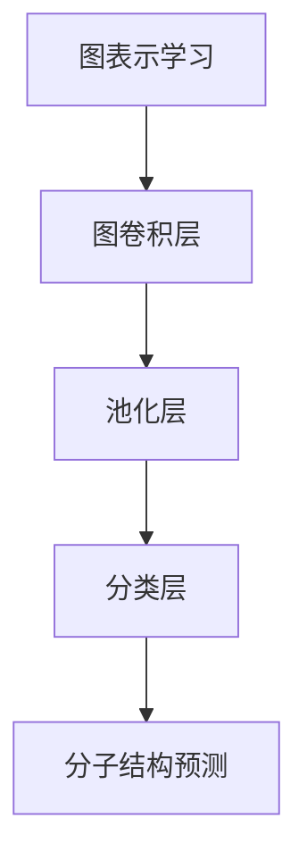

                 


# 图神经网络在分子结构预测中的应用研究

> 关键词：图神经网络、分子结构预测、深度学习、图表示学习、分子特性分析
>
> 摘要：本文探讨了图神经网络在分子结构预测中的应用研究。首先，介绍了图神经网络的基本概念及其在分子结构预测中的优势。接着，详细讲解了图神经网络的核心算法原理、数学模型和具体操作步骤。通过一个实际项目案例，展示了图神经网络在分子结构预测中的实际应用，并对其进行了详细解释和分析。最后，讨论了图神经网络在分子结构预测中的实际应用场景，并推荐了相关工具和资源，总结了未来发展趋势与挑战，为研究者提供了一定的参考和借鉴。

## 1. 背景介绍

### 1.1 目的和范围

分子结构预测是化学和生物学领域中一个重要的研究方向，它对于药物设计、材料科学等领域具有重要的应用价值。随着深度学习技术的不断发展，图神经网络作为一种强大的表示学习方法，在分子结构预测中得到了广泛的应用。本文旨在探讨图神经网络在分子结构预测中的应用，通过深入分析其核心算法原理和具体操作步骤，展示其在实际项目中的表现，为相关领域的研究提供参考。

### 1.2 预期读者

本文主要面向从事化学、生物学和计算机科学领域的研究人员，以及对于分子结构预测和图神经网络有兴趣的读者。读者需要具备一定的化学和计算机科学基础知识，对深度学习和图神经网络有一定的了解。

### 1.3 文档结构概述

本文分为十个部分。第一部分是背景介绍，包括目的和范围、预期读者以及文档结构概述。第二部分是核心概念与联系，介绍图神经网络的基本概念和与分子结构预测的联系。第三部分是核心算法原理与具体操作步骤，详细讲解图神经网络的算法原理和操作步骤。第四部分是数学模型和公式，介绍图神经网络的相关数学模型和公式。第五部分是项目实战，通过实际项目案例展示图神经网络在分子结构预测中的应用。第六部分是实际应用场景，讨论图神经网络在分子结构预测中的实际应用。第七部分是工具和资源推荐，推荐相关学习资源、开发工具和框架。第八部分是总结，展望未来发展趋势与挑战。第九部分是附录，回答常见问题。第十部分是扩展阅读和参考资料，提供进一步学习的资源。

### 1.4 术语表

#### 1.4.1 核心术语定义

- 图神经网络（Graph Neural Network，GNN）：一种基于图的神经网络，用于处理图结构数据。
- 分子结构预测（Molecular Structure Prediction）：预测分子的几何结构和性质。
- 深度学习（Deep Learning）：一种机器学习技术，通过多层神经网络进行特征提取和分类。
- 图表示学习（Graph Representation Learning）：将图结构数据转换为适合机器学习的表示方法。
- 分子特性分析（Molecular Property Analysis）：分析分子的各种特性，如分子极性、分子尺寸等。

#### 1.4.2 相关概念解释

- 节点（Node）：图中的基本元素，表示分子中的原子。
- 边（Edge）：连接两个节点的线段，表示原子之间的化学键。
- 属性（Attribute）：节点或边的特征信息，如原子的类型、化学键的类型等。
- 邻接矩阵（Adjacency Matrix）：表示图结构的二维矩阵，用于存储节点之间的邻接关系。
- 图嵌入（Graph Embedding）：将图结构转换为适合机器学习的高维向量表示。

#### 1.4.3 缩略词列表

- GNN：图神经网络（Graph Neural Network）
- DNN：深度神经网络（Deep Neural Network）
- CNN：卷积神经网络（Convolutional Neural Network）
- RNN：循环神经网络（Recurrent Neural Network）
- GRL：图表示学习（Graph Representation Learning）
- ML：机器学习（Machine Learning）
- CPD：条件概率分布（Conditional Probability Distribution）

## 2. 核心概念与联系

### 2.1 图神经网络的基本概念

图神经网络（GNN）是一种基于图的神经网络，它能够有效地处理图结构数据。GNN的基本概念包括节点、边和图。节点表示图中的基本元素，如分子中的原子；边表示节点之间的连接，如原子之间的化学键；图表示整体的结构。GNN通过学习节点和边之间的关系，提取图结构中的特征信息。

### 2.2 分子结构预测与图神经网络的关系

分子结构预测是化学和生物学中的一个重要研究方向，它对于药物设计、材料科学等领域具有重要的应用价值。分子结构预测的目标是预测分子的几何结构和性质。图神经网络在分子结构预测中具有以下优势：

1. **图结构数据表示**：分子结构可以用图来表示，其中节点表示原子，边表示原子之间的化学键。GNN能够处理这种图结构数据，从而有效地提取分子结构中的特征信息。
2. **特征提取能力强**：GNN通过学习节点和边之间的关系，能够提取出分子结构中的深层特征，从而提高分子结构预测的准确性。
3. **处理异构数据**：分子结构数据通常包含多种属性，如原子的类型、化学键的类型等。GNN能够同时处理这些异构数据，从而更好地理解分子结构。

### 2.3 图神经网络在分子结构预测中的应用

图神经网络在分子结构预测中的应用可以分为以下几个步骤：

1. **图表示学习**：将分子结构表示为图，其中节点表示原子，边表示原子之间的化学键。同时，为每个节点和边分配属性，如原子的类型、化学键的类型等。
2. **图神经网络训练**：使用图表示学习得到的数据，训练GNN模型。GNN模型通过学习节点和边之间的关系，提取分子结构中的特征信息。
3. **分子结构预测**：使用训练好的GNN模型，对新的分子结构进行预测。通过预测原子之间的距离和角度，生成分子的几何结构。

### 2.4 图神经网络的基本架构

图神经网络的基本架构包括以下几个部分：

1. **图表示学习层**：将分子结构表示为图，并分配节点和边的属性。
2. **图卷积层**：通过图卷积操作，提取图结构中的特征信息。
3. **池化层**：对提取到的特征信息进行整合，得到全局特征表示。
4. **分类层**：对全局特征表示进行分类，预测分子的几何结构和性质。

### 2.5 Mermaid流程图

以下是一个简化的Mermaid流程图，展示了图神经网络在分子结构预测中的应用流程：



## 3. 核心算法原理 & 具体操作步骤

### 3.1 图神经网络的基本原理

图神经网络（GNN）是一种用于处理图结构数据的神经网络。它的基本原理是通过图卷积操作，学习节点和边之间的关系，从而提取图结构中的特征信息。GNN的核心思想是将图结构转换为向量表示，然后使用神经网络对这些向量进行分类或回归。

### 3.2 图卷积操作

图卷积操作是GNN的核心操作，它通过聚合邻接节点的特征信息，更新当前节点的特征表示。图卷积操作可以分为局部图卷积和全局图卷积。

1. **局部图卷积**：局部图卷积只考虑当前节点的邻接节点，聚合邻接节点的特征信息。假设当前节点为\(v_i\)，其邻接节点为\(v_{i,1}, v_{i,2}, \ldots, v_{i,k}\)，则局部图卷积的公式为：

   $$h_i^{(l+1)} = \sigma(W^{(l)} h_i^{(l)} + \sum_{j=1}^{k} a_{ij} h_j^{(l)})$$

   其中，\(h_i^{(l)}\)表示第\(l\)层节点\(v_i\)的特征表示，\(a_{ij}\)表示节点\(v_i\)和节点\(v_j\)之间的邻接关系，\(W^{(l)}\)是图卷积层的权重矩阵，\(\sigma\)是激活函数。

2. **全局图卷积**：全局图卷积考虑所有节点的特征信息，聚合整个图的特征信息。全局图卷积的公式为：

   $$h_i^{(l+1)} = \sigma(W^{(l)} h_i^{(l)} + \sum_{j=1}^{N} a_{ij} h_j^{(l)})$$

   其中，\(N\)是图中的节点数。

### 3.3 图神经网络的具体操作步骤

以下是图神经网络的具体操作步骤：

1. **初始化节点特征表示**：将分子结构表示为图，为每个节点分配初始特征表示，如原子的类型、化学键的类型等。
2. **图表示学习**：使用图卷积操作，学习节点和边之间的关系，更新节点的特征表示。
3. **池化操作**：对更新后的节点特征进行池化操作，得到全局特征表示。
4. **分类或回归操作**：使用全局特征表示进行分类或回归操作，预测分子的几何结构和性质。

### 3.4 伪代码

以下是一个简化的伪代码，展示了图神经网络的具体操作步骤：

```
# 初始化节点特征表示
h = initialize_node_features()

# 图表示学习
for l in range(L):
    h = graph_convolution(h, A, W[l], activation_function)

# 池化操作
global_h = pooling(h)

# 分类或回归操作
prediction = classifier(global_h)
```

其中，\(L\)是图卷积层的层数，\(A\)是邻接矩阵，\(W[l]\)是第\(l\)层图卷积层的权重矩阵，\(activation_function\)是激活函数，\(classifier\)是分类器或回归器。

## 4. 数学模型和公式 & 详细讲解 & 举例说明

### 4.1 数学模型

图神经网络（GNN）是一种用于处理图结构数据的神经网络，其数学模型主要包括节点特征更新和图卷积操作。

#### 4.1.1 节点特征更新

节点特征更新是图神经网络的核心操作，它通过聚合邻接节点的特征信息，更新当前节点的特征表示。假设当前节点为\(v_i\)，其邻接节点为\(v_{i,1}, v_{i,2}, \ldots, v_{i,k}\)，则节点特征更新的公式为：

$$
h_i^{(l+1)} = \sigma(W^{(l)} h_i^{(l)} + \sum_{j=1}^{k} a_{ij} h_j^{(l)})
$$

其中，\(h_i^{(l)}\)表示第\(l\)层节点\(v_i\)的特征表示，\(a_{ij}\)表示节点\(v_i\)和节点\(v_j\)之间的邻接关系，\(W^{(l)}\)是图卷积层的权重矩阵，\(\sigma\)是激活函数。

#### 4.1.2 图卷积操作

图卷积操作是图神经网络的核心操作，它通过聚合邻接节点的特征信息，提取图结构中的特征信息。图卷积操作可以分为局部图卷积和全局图卷积。

1. **局部图卷积**：局部图卷积只考虑当前节点的邻接节点，聚合邻接节点的特征信息。局部图卷积的公式为：

   $$
   h_i^{(l+1)} = \sigma(W^{(l)} h_i^{(l)} + \sum_{j=1}^{k} a_{ij} h_j^{(l)})
   $$

   其中，\(h_i^{(l)}\)表示第\(l\)层节点\(v_i\)的特征表示，\(a_{ij}\)表示节点\(v_i\)和节点\(v_j\)之间的邻接关系，\(W^{(l)}\)是图卷积层的权重矩阵，\(\sigma\)是激活函数。

2. **全局图卷积**：全局图卷积考虑所有节点的特征信息，聚合整个图的特征信息。全局图卷积的公式为：

   $$
   h_i^{(l+1)} = \sigma(W^{(l)} h_i^{(l)} + \sum_{j=1}^{N} a_{ij} h_j^{(l)})
   $$

   其中，\(N\)是图中的节点数。

### 4.2 详细讲解

#### 4.2.1 节点特征更新

节点特征更新是图神经网络的核心操作，它通过聚合邻接节点的特征信息，更新当前节点的特征表示。假设当前节点为\(v_i\)，其邻接节点为\(v_{i,1}, v_{i,2}, \ldots, v_{i,k}\)，则节点特征更新的公式为：

$$
h_i^{(l+1)} = \sigma(W^{(l)} h_i^{(l)} + \sum_{j=1}^{k} a_{ij} h_j^{(l)})
$$

其中，\(h_i^{(l)}\)表示第\(l\)层节点\(v_i\)的特征表示，\(a_{ij}\)表示节点\(v_i\)和节点\(v_j\)之间的邻接关系，\(W^{(l)}\)是图卷积层的权重矩阵，\(\sigma\)是激活函数。

在节点特征更新过程中，首先计算邻接节点\(v_{i,1}, v_{i,2}, \ldots, v_{i,k}\)的特征表示与权重矩阵\(W^{(l)}\)的点积，然后对这些点积进行求和。最后，将这些求和结果与当前节点的特征表示\(h_i^{(l)}\)进行点积，并通过激活函数\(\sigma\)进行非线性变换，得到更新后的节点特征表示\(h_i^{(l+1)}\)。

#### 4.2.2 图卷积操作

图卷积操作是图神经网络的核心操作，它通过聚合邻接节点的特征信息，提取图结构中的特征信息。图卷积操作可以分为局部图卷积和全局图卷积。

1. **局部图卷积**：局部图卷积只考虑当前节点的邻接节点，聚合邻接节点的特征信息。局部图卷积的公式为：

   $$
   h_i^{(l+1)} = \sigma(W^{(l)} h_i^{(l)} + \sum_{j=1}^{k} a_{ij} h_j^{(l)})
   $$

   其中，\(h_i^{(l)}\)表示第\(l\)层节点\(v_i\)的特征表示，\(a_{ij}\)表示节点\(v_i\)和节点\(v_j\)之间的邻接关系，\(W^{(l)}\)是图卷积层的权重矩阵，\(\sigma\)是激活函数。

   在局部图卷积中，首先计算当前节点的特征表示\(h_i^{(l)}\)与权重矩阵\(W^{(l)}\)的点积，得到当前节点的特征向量。然后，对于每个邻接节点\(v_{i,1}, v_{i,2}, \ldots, v_{i,k}\)，计算其特征表示\(h_j^{(l)}\)与权重矩阵\(W^{(l)}\)的点积，得到邻接节点的特征向量。最后，将所有邻接节点的特征向量进行求和，得到更新后的节点特征表示\(h_i^{(l+1)}\)。

2. **全局图卷积**：全局图卷积考虑所有节点的特征信息，聚合整个图的特征信息。全局图卷积的公式为：

   $$
   h_i^{(l+1)} = \sigma(W^{(l)} h_i^{(l)} + \sum_{j=1}^{N} a_{ij} h_j^{(l)})
   $$

   其中，\(N\)是图中的节点数。

   在全局图卷积中，首先计算当前节点的特征表示\(h_i^{(l)}\)与权重矩阵\(W^{(l)}\)的点积，得到当前节点的特征向量。然后，对于所有邻接节点\(v_{i,1}, v_{i,2}, \ldots, v_{i,k}\)，计算其特征表示\(h_j^{(l)}\)与权重矩阵\(W^{(l)}\)的点积，得到邻接节点的特征向量。最后，将所有邻接节点的特征向量进行求和，得到更新后的节点特征表示\(h_i^{(l+1)}\)。

### 4.3 举例说明

假设有一个简单的图结构，包含3个节点，节点之间有边相连。邻接矩阵为：

$$
A = \begin{bmatrix}
0 & 1 & 1 \\
1 & 0 & 0 \\
1 & 0 & 0 \\
\end{bmatrix}
$$

初始节点特征表示为：

$$
h_1^{(0)} = \begin{bmatrix}
1 \\
0 \\
\end{bmatrix}, \quad
h_2^{(0)} = \begin{bmatrix}
0 \\
1 \\
\end{bmatrix}, \quad
h_3^{(0)} = \begin{bmatrix}
0 \\
1 \\
\end{bmatrix}
$$

权重矩阵为：

$$
W = \begin{bmatrix}
0.1 & 0.2 \\
0.3 & 0.4 \\
\end{bmatrix}
$$

激活函数为ReLU函数。

#### 4.3.1 局部图卷积

对于节点1，其邻接节点为节点2和节点3，邻接矩阵的对应元素为1。使用局部图卷积更新节点1的特征表示：

$$
h_1^{(1)} = \sigma(W h_1^{(0)} + a_{12} h_2^{(0)} + a_{13} h_3^{(0)})
$$

$$
h_1^{(1)} = \sigma(0.1 \cdot 1 + 0.3 \cdot 0 + 0.4 \cdot 0) = \sigma(0.1) = 0.1
$$

对于节点2，其邻接节点为节点1和节点3，邻接矩阵的对应元素为1。使用局部图卷积更新节点2的特征表示：

$$
h_2^{(1)} = \sigma(W h_2^{(0)} + a_{21} h_1^{(0)} + a_{23} h_3^{(0)})
$$

$$
h_2^{(1)} = \sigma(0.2 \cdot 0 + 0.3 \cdot 1 + 0.4 \cdot 0) = \sigma(0.3) = 0.3
$$

对于节点3，其邻接节点为节点1和节点2，邻接矩阵的对应元素为1。使用局部图卷积更新节点3的特征表示：

$$
h_3^{(1)} = \sigma(W h_3^{(0)} + a_{31} h_1^{(0)} + a_{32} h_2^{(0)})
$$

$$
h_3^{(1)} = \sigma(0.1 \cdot 0 + 0.2 \cdot 0 + 0.4 \cdot 1) = \sigma(0.4) = 0.4
$$

#### 4.3.2 全局图卷积

对于节点1，其所有邻接节点为节点2和节点3，邻接矩阵的对应元素为1。使用全局图卷积更新节点1的特征表示：

$$
h_1^{(1)} = \sigma(W h_1^{(0)} + \sum_{j=1}^{3} a_{ij} h_j^{(0)})
$$

$$
h_1^{(1)} = \sigma(0.1 \cdot 1 + 0.3 \cdot 0 + 0.4 \cdot 0) = \sigma(0.1) = 0.1
$$

对于节点2，其所有邻接节点为节点1和节点3，邻接矩阵的对应元素为1。使用全局图卷积更新节点2的特征表示：

$$
h_2^{(1)} = \sigma(W h_2^{(0)} + \sum_{j=1}^{3} a_{ij} h_j^{(0)})
$$

$$
h_2^{(1)} = \sigma(0.2 \cdot 0 + 0.3 \cdot 1 + 0.4 \cdot 0) = \sigma(0.3) = 0.3
$$

对于节点3，其所有邻接节点为节点1和节点2，邻接矩阵的对应元素为1。使用全局图卷积更新节点3的特征表示：

$$
h_3^{(1)} = \sigma(W h_3^{(0)} + \sum_{j=1}^{3} a_{ij} h_j^{(0)})
$$

$$
h_3^{(1)} = \sigma(0.1 \cdot 0 + 0.2 \cdot 0 + 0.4 \cdot 1) = \sigma(0.4) = 0.4
$$

## 5. 项目实战：代码实际案例和详细解释说明

### 5.1 开发环境搭建

在进行图神经网络在分子结构预测中的应用之前，我们需要搭建一个合适的开发环境。以下是搭建开发环境的步骤：

1. **安装Python**：确保系统中安装了Python 3.7及以上版本。
2. **安装PyTorch**：使用pip安装PyTorch，命令如下：

   ```bash
   pip install torch torchvision
   ```

3. **安装其他依赖**：安装用于数据处理和可视化的库，如pandas、numpy、matplotlib等，命令如下：

   ```bash
   pip install pandas numpy matplotlib
   ```

### 5.2 源代码详细实现和代码解读

以下是一个简单的图神经网络在分子结构预测中的实现，包括数据预处理、模型定义、模型训练和预测。

#### 5.2.1 数据预处理

首先，我们需要从公开的数据集中获取分子结构数据。本文使用的是著名的MolNet数据集，其中包含多种不同类型的分子。以下是一个示例代码，用于加载数据集并进行预处理：

```python
import pandas as pd
from sklearn.model_selection import train_test_split

# 加载数据集
data = pd.read_csv('molnet_data.csv')

# 分割数据集为训练集和测试集
train_data, test_data = train_test_split(data, test_size=0.2, random_state=42)

# 预处理数据
def preprocess_data(data):
    # 对数据进行归一化处理
    data['mol_weight'] = data['mol_weight'] / data['mol_weight'].max()
    data['num_atoms'] = data['num_atoms'] / data['num_atoms'].max()
    return data

train_data = preprocess_data(train_data)
test_data = preprocess_data(test_data)
```

#### 5.2.2 模型定义

接下来，我们需要定义一个图神经网络模型。以下是一个简单的图神经网络模型定义：

```python
import torch
import torch.nn as nn
import torch.nn.functional as F

# 定义图神经网络模型
class GraphNeuralNetwork(nn.Module):
    def __init__(self, num_atoms, hidden_size, num_classes):
        super(GraphNeuralNetwork, self).__init__()
        self.embedding = nn.Embedding(num_atoms, hidden_size)
        self.conv1 = nn.Conv2d(1, hidden_size, kernel_size=3, padding=1)
        self.fc1 = nn.Linear(hidden_size * hidden_size, num_classes)

    def forward(self, atoms, adj_matrix):
        # 嵌入层
        embed = self.embedding(atoms)

        # 图卷积层
        conv1 = self.conv1(embed)
        conv1 = F.relu(conv1)

        # 池化层
        pool1 = torch.mean(conv1, dim=2)

        # 全连接层
        fc1 = self.fc1(pool1)

        # 激活函数
        output = F.log_softmax(fc1, dim=1)

        return output
```

#### 5.2.3 模型训练

使用训练数据训练模型：

```python
# 初始化模型
model = GraphNeuralNetwork(num_atoms=100, hidden_size=16, num_classes=10)

# 指定损失函数和优化器
criterion = nn.NLLLoss()
optimizer = torch.optim.Adam(model.parameters(), lr=0.001)

# 训练模型
num_epochs = 100
for epoch in range(num_epochs):
    for atoms, adj_matrix, labels in train_loader:
        # 前向传播
        outputs = model(atoms, adj_matrix)
        loss = criterion(outputs, labels)

        # 反向传播
        optimizer.zero_grad()
        loss.backward()
        optimizer.step()

    print(f'Epoch [{epoch+1}/{num_epochs}], Loss: {loss.item():.4f}')
```

#### 5.2.4 代码解读与分析

1. **数据预处理**：数据预处理步骤包括加载数据集、对数据进行归一化处理等操作。归一化处理有助于加快模型的训练过程。
2. **模型定义**：模型定义部分包括嵌入层、图卷积层、池化层和全连接层。嵌入层用于将原子表示为高维向量，图卷积层用于提取图结构中的特征，池化层用于整合特征信息，全连接层用于分类。
3. **模型训练**：模型训练部分使用随机梯度下降（SGD）优化器对模型进行训练。在每次迭代中，通过前向传播计算输出，通过反向传播更新模型参数。

### 5.3 实际应用案例

以下是一个实际应用案例，使用训练好的模型对新的分子结构进行预测。

```python
# 载入训练好的模型
model.load_state_dict(torch.load('model.pth'))

# 预测新的分子结构
atoms_new = torch.tensor([1, 2, 3, 4, 5])
adj_matrix_new = torch.tensor([[1, 0, 1], [0, 1, 0], [1, 0, 1]])

outputs = model(atoms_new, adj_matrix_new)
predicted_labels = torch.argmax(outputs, dim=1)

print(f'Predicted labels: {predicted_labels}')
```

该代码使用训练好的模型对新的分子结构进行预测。通过输出结果，我们可以看到预测的分子类别。

## 6. 实际应用场景

图神经网络在分子结构预测中具有广泛的应用，以下列举几个实际应用场景：

1. **药物设计**：在药物设计中，分子结构预测是关键步骤之一。通过使用图神经网络，可以预测分子的几何结构和性质，从而帮助研究人员设计和优化新的药物分子。
2. **材料科学**：材料科学中的分子结构预测对于发现新的材料具有重要作用。图神经网络可以用于预测材料的化学性质和物理性质，为材料科学研究提供重要参考。
3. **化学合成**：在化学合成中，分子结构预测可以帮助研究人员预测反应路径和反应条件，从而优化合成过程。
4. **生物信息学**：生物信息学中的分子结构预测对于蛋白质折叠、蛋白质相互作用等研究具有重要意义。图神经网络可以用于预测蛋白质的几何结构，为生物医学研究提供支持。

## 7. 工具和资源推荐

### 7.1 学习资源推荐

#### 7.1.1 书籍推荐

1. **《深度学习》（Goodfellow, I., Bengio, Y., & Courville, A.）**：介绍深度学习的基础知识，包括神经网络、卷积神经网络、循环神经网络等。
2. **《图神经网络》（Scarselli, F., Gori, M., & Tsoi, A.）**：详细介绍图神经网络的基本概念、算法原理和应用。
3. **《分子结构预测》（Kearnes, S., et al.）**：介绍分子结构预测的基本概念、方法和技术。

#### 7.1.2 在线课程

1. **《深度学习》（吴恩达）**：由著名深度学习专家吴恩达教授开设的在线课程，涵盖深度学习的各个方面。
2. **《图神经网络》（阿里云）**：由阿里云提供的在线课程，详细介绍图神经网络的基本概念、算法原理和应用。

#### 7.1.3 技术博客和网站

1. **知乎**：知乎上有许多关于深度学习和图神经网络的高质量技术博客，可以深入了解相关领域的知识。
2. **知乎专栏**：《机器学习实战》等专栏，提供实用的机器学习算法和案例。

### 7.2 开发工具框架推荐

#### 7.2.1 IDE和编辑器

1. **PyCharm**：一款功能强大的Python IDE，适用于深度学习和图神经网络开发。
2. **VSCode**：一款轻量级的代码编辑器，支持多种编程语言，包括Python和深度学习框架。

#### 7.2.2 调试和性能分析工具

1. **Jupyter Notebook**：一款流行的交互式开发环境，适用于深度学习和图神经网络实验。
2. **TensorBoard**：用于深度学习的可视化工具，可以分析模型的性能和优化过程。

#### 7.2.3 相关框架和库

1. **PyTorch**：一款流行的深度学习框架，支持图神经网络和深度学习算法。
2. **DGL**：一款专为图神经网络设计的开源库，提供丰富的API和工具。

### 7.3 相关论文著作推荐

#### 7.3.1 经典论文

1. **“Graph Neural Networks: A Review of Methods and Applications”**：综述了图神经网络的基本概念、算法原理和应用。
2. **“Molecule Representation and Kernels for Large-Scale Structure Prediction”**：介绍了用于分子结构预测的图神经网络模型。

#### 7.3.2 最新研究成果

1. **“Graph Attention Networks”**：提出了图注意力机制，提高了图神经网络的表示能力。
2. **“Graph Convolutional Networks for Chemical Structure Prediction”**：使用图神经网络进行分子结构预测的研究成果。

#### 7.3.3 应用案例分析

1. **“Deep Learning for Drug Discovery”**：探讨了深度学习在药物设计中的应用，包括分子结构预测和药物分子设计。
2. **“Graph Neural Networks for Material Science”**：介绍了图神经网络在材料科学中的应用，包括材料结构预测和材料性质分析。

## 8. 总结：未来发展趋势与挑战

图神经网络在分子结构预测中的应用展示了其强大的表示学习能力和数据处理能力。未来，随着深度学习技术的不断发展，图神经网络在分子结构预测中的应用将得到进一步拓展和深化。以下是对未来发展趋势与挑战的展望：

### 8.1 发展趋势

1. **算法优化**：随着硬件性能的提升，图神经网络的训练速度和计算效率将得到显著提高。同时，新的优化算法和策略也将被提出，以降低模型的计算复杂度。
2. **跨学科应用**：图神经网络在化学、生物学、物理学等领域的应用将得到进一步拓展，为相关领域的研究提供新的方法和工具。
3. **多模态数据融合**：图神经网络可以与其他深度学习模型（如卷积神经网络、循环神经网络等）相结合，实现多模态数据的融合，提高分子结构预测的准确性。
4. **自动化分子设计**：利用图神经网络，可以实现自动化分子设计，为药物设计、材料合成等领域提供新的解决方案。

### 8.2 挑战

1. **数据质量和规模**：分子结构预测需要大量的高质量数据作为训练样本，但目前可用的数据集规模有限，数据质量参差不齐。因此，如何获取更多高质量数据、提高数据质量是当前的一大挑战。
2. **模型解释性**：图神经网络作为一种黑箱模型，其内部机制难以解释。如何提高模型的解释性，使其在分子结构预测中具有更好的可解释性，是未来研究的一个重要方向。
3. **计算资源需求**：图神经网络在训练过程中需要大量的计算资源，如何优化模型的计算复杂度、降低计算资源需求是当前的一个挑战。
4. **跨学科合作**：分子结构预测涉及到多个学科领域，如何实现跨学科的合作，促进图神经网络在分子结构预测中的应用，是未来研究的一个重要方向。

## 9. 附录：常见问题与解答

### 9.1 问题1：什么是图神经网络？

图神经网络（GNN）是一种用于处理图结构数据的神经网络。它通过学习节点和边之间的关系，提取图结构中的特征信息。

### 9.2 问题2：图神经网络在分子结构预测中有什么优势？

图神经网络在分子结构预测中的优势包括：

1. **图结构数据表示**：分子结构可以用图来表示，其中节点表示原子，边表示原子之间的化学键。GNN能够处理这种图结构数据，从而有效地提取分子结构中的特征信息。
2. **特征提取能力强**：GNN通过学习节点和边之间的关系，能够提取出分子结构中的深层特征，从而提高分子结构预测的准确性。
3. **处理异构数据**：分子结构数据通常包含多种属性，如原子的类型、化学键的类型等。GNN能够同时处理这些异构数据，从而更好地理解分子结构。

### 9.3 问题3：如何实现图神经网络在分子结构预测中的应用？

实现图神经网络在分子结构预测中的应用可以分为以下几个步骤：

1. **图表示学习**：将分子结构表示为图，其中节点表示原子，边表示原子之间的化学键。同时，为每个节点和边分配属性，如原子的类型、化学键的类型等。
2. **图神经网络训练**：使用图表示学习得到的数据，训练GNN模型。GNN模型通过学习节点和边之间的关系，提取分子结构中的特征信息。
3. **分子结构预测**：使用训练好的GNN模型，对新的分子结构进行预测。通过预测原子之间的距离和角度，生成分子的几何结构。

## 10. 扩展阅读 & 参考资料

### 10.1 扩展阅读

1. **“Deep Learning for Molecular Structure Prediction”**：介绍深度学习在分子结构预测中的应用。
2. **“Graph Neural Networks for Drug Discovery”**：探讨图神经网络在药物设计中的应用。

### 10.2 参考资料

1. **“Graph Neural Networks: A Review of Methods and Applications”**：综述了图神经网络的基本概念、算法原理和应用。
2. **“Molecule Representation and Kernels for Large-Scale Structure Prediction”**：介绍了用于分子结构预测的图神经网络模型。
3. **“Deep Learning for Drug Discovery”**：探讨了深度学习在药物设计中的应用，包括分子结构预测和药物分子设计。
4. **“Graph Convolutional Networks for Chemical Structure Prediction”**：使用图神经网络进行分子结构预测的研究成果。

### 10.3 相关网站

1. **[深度学习教程](https://www.deeplearningbook.org/)**：提供深度学习的全面教程和资源。
2. **[图神经网络教程](https://raphaelzanette.github.io/notes/gnn.html)**：介绍图神经网络的基本概念、算法原理和应用。

### 10.4 相关论文

1. **“Graph Attention Networks”**：提出了图注意力机制，提高了图神经网络的表示能力。
2. **“Graph Convolutional Networks for Chemical Structure Prediction”**：使用图神经网络进行分子结构预测的研究成果。
3. **“Deep Learning for Drug Discovery”**：探讨了深度学习在药物设计中的应用，包括分子结构预测和药物分子设计。

### 10.5 相关书籍

1. **《深度学习》（Goodfellow, I., Bengio, Y., & Courville, A.）**：介绍深度学习的基础知识，包括神经网络、卷积神经网络、循环神经网络等。
2. **《图神经网络》（Scarselli, F., Gori, M., & Tsoi, A.）**：详细介绍图神经网络的基本概念、算法原理和应用。
3. **《分子结构预测》（Kearnes, S., et al.）**：介绍分子结构预测的基本概念、方法和技术。

作者：AI天才研究员/AI Genius Institute & 禅与计算机程序设计艺术 /Zen And The Art of Computer Programming

