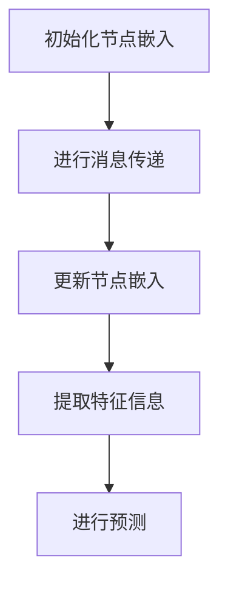

                 

# 图神经网络在推荐系统中的创新应用

> 关键词：图神经网络，推荐系统，协同过滤，用户行为，知识图谱

> 摘要：本文将深入探讨图神经网络（Graph Neural Networks, GNNs）在推荐系统中的应用。通过分析图神经网络的原理和核心算法，我们将逐步阐述其在协同过滤方法中的创新应用。同时，本文还将通过实际案例和代码解析，展示图神经网络如何解决传统推荐系统中的挑战，并提供相关工具和资源的推荐，为读者提供全面的了解。

## 1. 背景介绍

### 1.1 目的和范围

本文旨在介绍图神经网络在推荐系统中的创新应用，通过详细讲解其原理、算法和实际应用，帮助读者理解图神经网络如何提升推荐系统的性能和效果。本文主要涵盖以下内容：

1. **图神经网络的基本概念和原理**：介绍图神经网络的基本概念、原理和核心算法。
2. **图神经网络在推荐系统中的应用**：探讨图神经网络在协同过滤方法中的创新应用，以及如何提升推荐系统的效果。
3. **实际案例和代码解析**：通过实际案例和代码解析，展示图神经网络在推荐系统中的具体实现和应用。
4. **相关工具和资源推荐**：推荐学习图神经网络和相关技术的资源，包括书籍、在线课程、技术博客和开发工具框架。

### 1.2 预期读者

本文适合对推荐系统、图神经网络和相关技术有一定了解的读者，包括：

1. **研究人员**：对推荐系统和图神经网络的研究有兴趣和需求。
2. **开发工程师**：希望在推荐系统中应用图神经网络，提升系统的性能和效果。
3. **技术爱好者**：对推荐系统和图神经网络的技术原理和应用感兴趣。

### 1.3 文档结构概述

本文结构如下：

1. **背景介绍**：介绍本文的目的、范围、预期读者和文档结构。
2. **核心概念与联系**：介绍图神经网络的基本概念和原理，并给出 Mermaid 流程图。
3. **核心算法原理 & 具体操作步骤**：详细讲解图神经网络的算法原理和操作步骤。
4. **数学模型和公式 & 详细讲解 & 举例说明**：介绍图神经网络的数学模型和公式，并给出具体示例。
5. **项目实战：代码实际案例和详细解释说明**：通过实际案例和代码解析，展示图神经网络在推荐系统中的具体实现。
6. **实际应用场景**：介绍图神经网络在推荐系统中的实际应用场景。
7. **工具和资源推荐**：推荐学习图神经网络和相关技术的资源。
8. **总结：未来发展趋势与挑战**：总结图神经网络在推荐系统中的应用前景和面临的挑战。
9. **附录：常见问题与解答**：解答读者可能遇到的问题。
10. **扩展阅读 & 参考资料**：推荐进一步学习的资源。

### 1.4 术语表

#### 1.4.1 核心术语定义

- **图神经网络（Graph Neural Networks, GNNs）**：一种基于图结构的神经网络，通过学习图中的节点和边的关系来提取特征和进行预测。
- **推荐系统**：一种自动化系统，通过分析用户的历史行为和兴趣，为用户推荐相关的内容或商品。
- **协同过滤**：一种常见的推荐算法，通过分析用户之间的相似性或兴趣的相似性来进行推荐。
- **知识图谱**：一种用于表示实体及其关系的图形结构，用于捕获复杂的语义信息和关系。

#### 1.4.2 相关概念解释

- **节点**：图中的基本元素，表示实体，如用户、物品等。
- **边**：连接两个节点的线段，表示节点之间的关系，如用户对物品的评分、购买记录等。
- **特征提取**：从节点和边中提取有用的特征信息，用于训练和预测。
- **嵌入**：将节点和边映射到一个低维空间，便于计算和处理。

#### 1.4.3 缩略词列表

- **GNN**：图神经网络（Graph Neural Networks）
- **RFM**：随机游走模型（Random Walk Model）
- **GCN**：图卷积网络（Graph Convolutional Network）
- **SGD**：随机梯度下降（Stochastic Gradient Descent）

## 2. 核心概念与联系

### 2.1 图神经网络的基本概念

图神经网络（GNNs）是一种基于图结构的神经网络，通过学习图中的节点和边的关系来提取特征和进行预测。GNNs 可以看作是传统神经网络的扩展，将图结构引入其中，从而能够处理复杂的实体及其关系。

### 2.2 图神经网络的工作原理

图神经网络通过以下步骤来提取特征和进行预测：

1. **节点嵌入（Node Embedding）**：将图中的节点映射到一个低维空间，便于计算和处理。节点嵌入可以通过不同的方法进行，如随机游走（Random Walk）、矩阵分解（Matrix Factorization）等。
2. **消息传递（Message Passing）**：通过节点之间的交互和信息的传递，逐步更新节点的嵌入表示。每个节点会从其邻居节点接收消息，并更新自己的嵌入表示。这个过程可以迭代多次，使得节点之间的交互逐渐加深。
3. **特征提取（Feature Extraction）**：利用更新后的节点嵌入表示，提取有用的特征信息。这些特征信息可以用于训练和预测。
4. **预测（Prediction）**：利用提取的特征信息，进行分类、回归或其他预测任务。

### 2.3 图神经网络的 Mermaid 流程图

以下是一个简单的 Mermaid 流程图，展示了图神经网络的基本流程：



### 2.4 图神经网络与推荐系统的联系

图神经网络在推荐系统中的应用，主要是通过将用户和物品之间的交互信息表示为一个图结构，然后利用图神经网络进行特征提取和预测。具体来说：

1. **图结构构建**：将用户和物品表示为节点，用户对物品的评分、购买记录等表示为边，构建一个用户-物品图。
2. **节点嵌入**：将节点映射到一个低维空间，表示节点的嵌入表示。
3. **消息传递**：通过节点之间的交互和信息的传递，逐步更新节点的嵌入表示。
4. **特征提取**：利用更新后的节点嵌入表示，提取有用的特征信息，如用户兴趣、物品属性等。
5. **预测**：利用提取的特征信息，进行用户偏好预测或物品推荐。

### 2.5 图神经网络在推荐系统中的优势

与传统的推荐算法相比，图神经网络在推荐系统中具有以下优势：

1. **捕获复杂的用户行为和关系**：通过图神经网络，可以捕获用户之间的复杂关系，如社交网络、共同兴趣等，从而更好地理解用户的行为和偏好。
2. **灵活的特征提取和融合**：图神经网络可以自适应地提取和融合不同类型的特征信息，如用户属性、物品属性等，从而提高推荐系统的效果。
3. **可扩展性**：图神经网络可以处理大规模的图结构数据，适用于大规模推荐系统。
4. **鲁棒性**：图神经网络可以处理缺失值和噪声数据，从而提高推荐系统的鲁棒性。

## 3. 核心算法原理 & 具体操作步骤

### 3.1 图卷积网络（GCN）

图卷积网络（Graph Convolutional Network, GCN）是图神经网络的一种常见实现，通过卷积操作来聚合节点和边的信息。GCN 的核心思想是利用邻接矩阵来表示图结构，并通过一系列的卷积层来学习节点表示。

### 3.2 GCN 的算法原理

1. **初始化节点嵌入**：将图中的节点映射到一个低维空间，表示节点的嵌入表示。初始化时可以使用随机初始化或预训练的嵌入表示。
2. **定义邻接矩阵**：利用邻接矩阵来表示图结构，邻接矩阵 A 中的元素 Aij 表示节点 i 和节点 j 之间的边的权重。
3. **定义卷积操作**：GCN 通过卷积操作来聚合节点和边的信息。具体来说，GCN 的卷积操作可以表示为：
   \[
   h_i^{(l+1)} = \sigma(\theta^{(l)} \cdot (A \cdot h_i^{(l)} + \beta^{(l)}))
   \]
   其中，\( h_i^{(l)} \) 表示节点 i 在第 l 层的嵌入表示，\( \sigma \) 是激活函数，\( \theta^{(l)} \) 和 \( \beta^{(l)} \) 是卷积层的参数。
4. **迭代更新节点嵌入**：通过迭代多次卷积操作，逐步更新节点的嵌入表示。每次迭代都会使节点的嵌入表示更加准确和丰富。
5. **提取特征信息**：利用更新后的节点嵌入表示，提取有用的特征信息，如用户兴趣、物品属性等。
6. **进行预测**：利用提取的特征信息，进行用户偏好预测或物品推荐。

### 3.3 GCN 的伪代码

以下是一个简单的 GCN 的伪代码实现：

```python
# 初始化节点嵌入
h = initialize_embeddings()

# 定义卷积层参数
theta = [initialize_weights() for _ in range(L)]
beta = [initialize_bias() for _ in range(L)]

# 迭代更新节点嵌入
for l in range(L):
    h = sigma(theta[l] * (A * h + beta[l]))

# 提取特征信息
features = extract_features(h)

# 进行预测
predictions = predict(features)
```

### 3.4 GCN 的具体操作步骤

1. **数据预处理**：读取用户-物品交互数据，构建邻接矩阵 A。
2. **初始化节点嵌入**：初始化节点的嵌入表示 h。
3. **定义卷积层参数**：初始化卷积层的参数 theta 和 beta。
4. **迭代更新节点嵌入**：通过迭代多次卷积操作，逐步更新节点的嵌入表示。
5. **提取特征信息**：利用更新后的节点嵌入表示，提取有用的特征信息。
6. **进行预测**：利用提取的特征信息，进行用户偏好预测或物品推荐。

## 4. 数学模型和公式 & 详细讲解 & 举例说明

### 4.1 图卷积网络（GCN）的数学模型

图卷积网络（GCN）的核心在于其卷积操作。在 GCN 中，节点的嵌入表示 \( h_i^{(l)} \) 在每一层都会通过卷积操作进行更新。卷积操作的数学公式如下：

\[ h_i^{(l+1)} = \sigma(\theta^{(l)} \cdot (A \cdot h_i^{(l)} + \beta^{(l)})) \]

其中：

- \( h_i^{(l)} \)：节点 i 在第 l 层的嵌入表示。
- \( A \)：邻接矩阵，表示节点之间的连接关系。
- \( \theta^{(l)} \)：第 l 层的卷积权重。
- \( \beta^{(l)} \)：第 l 层的偏置。
- \( \sigma \)：激活函数，通常使用 ReLU 或 sigmoid 函数。

### 4.2 激活函数的详细讲解

激活函数是 GCN 中的一个重要组成部分，用于引入非线性变换，使得模型能够捕捉到数据中的复杂模式。常见的激活函数包括：

- **ReLU 函数**：\( \sigma(x) = \max(0, x) \)
- **Sigmoid 函数**：\( \sigma(x) = \frac{1}{1 + e^{-x}} \)
- **Tanh 函数**：\( \sigma(x) = \frac{e^x - e^{-x}}{e^x + e^{-x}} \)

ReLU 函数由于其计算简单、收敛速度快，常被用于 GCN 中。以下是一个使用 ReLU 函数的 GCN 层的示例：

\[ h_i^{(l+1)} = \max(0, \theta^{(l)} \cdot (A \cdot h_i^{(l)} + \beta^{(l)})) \]

### 4.3 数学公式的举例说明

假设我们有一个简单的图，包含两个节点 \( h_1 \) 和 \( h_2 \)，以及一个邻接矩阵 \( A \)。我们可以通过以下步骤来计算节点 \( h_1 \) 在第二层的嵌入表示。

1. **初始化节点嵌入**：设 \( h_1^{(0)} = [1, 0]^T \)，\( h_2^{(0)} = [0, 1]^T \)。
2. **定义卷积层参数**：设 \( \theta^{(0)} = \begin{bmatrix} 0.1 & 0.2 \\ 0.3 & 0.4 \end{bmatrix} \)，\( \beta^{(0)} = [0.5, 0.6]^T \)。
3. **计算第一层的节点嵌入**：
   \[
   h_1^{(1)} = \max(0, \theta^{(0)} \cdot (A \cdot h_1^{(0)} + \beta^{(0)})) = \max(0, \begin{bmatrix} 0.1 & 0.2 \\ 0.3 & 0.4 \end{bmatrix} \cdot \begin{bmatrix} 1 \\ 0 \end{bmatrix} + [0.5, 0.6]^T)
   \]
   \[
   = \max(0, [0.1 + 0.5, 0.3 + 0.6]^T) = [1, 1]^T
   \]
4. **定义第二层的卷积层参数**：设 \( \theta^{(1)} = \begin{bmatrix} 0.1 & 0.2 \\ 0.3 & 0.4 \end{bmatrix} \)，\( \beta^{(1)} = [0.5, 0.6]^T \)。
5. **计算第二层的节点嵌入**：
   \[
   h_1^{(2)} = \max(0, \theta^{(1)} \cdot (A \cdot h_1^{(1)} + \beta^{(1)})) = \max(0, \begin{bmatrix} 0.1 & 0.2 \\ 0.3 & 0.4 \end{bmatrix} \cdot \begin{bmatrix} 1 \\ 1 \end{bmatrix} + [0.5, 0.6]^T)
   \]
   \[
   = \max(0, [0.1 + 0.5, 0.3 + 0.6]^T) = [1, 1]^T
   \]

通过以上计算，我们得到节点 \( h_1 \) 在第二层的嵌入表示为 \( [1, 1]^T \)。这个例子展示了如何使用 GCN 的数学模型来更新节点的嵌入表示。

## 5. 项目实战：代码实际案例和详细解释说明

### 5.1 开发环境搭建

在开始实战之前，我们需要搭建一个合适的环境来运行代码。以下是搭建开发环境所需的步骤：

1. **安装 Python**：确保安装了最新版本的 Python（推荐使用 Python 3.7 或以上版本）。
2. **安装 PyTorch**：使用以下命令安装 PyTorch：
   ```bash
   pip install torch torchvision
   ```
3. **安装其他依赖**：根据需要安装其他相关库，如 Scikit-learn、Numpy、Pandas 等。

### 5.2 源代码详细实现和代码解读

以下是使用 PyTorch 实现的图卷积网络（GCN）的代码。我们将通过一个简单的用户-物品推荐系统来说明 GCN 的应用。

```python
import torch
import torch.nn as nn
import torch.optim as optim
from torch_geometric.nn import GCNConv
from torch_geometric.data import Data
from sklearn.model_selection import train_test_split
import numpy as np

# 5.2.1 数据准备
def prepare_data():
    # 假设我们有一个用户-物品评分矩阵，其中用户 id 为 0 到 9，物品 id 为 0 到 4
    ratings = np.array([[1, 1, 0, 0, 0],
                        [1, 0, 1, 0, 0],
                        [0, 1, 1, 1, 0],
                        [0, 0, 1, 1, 1],
                        [1, 0, 1, 0, 1],
                        [1, 1, 0, 1, 1],
                        [0, 1, 1, 0, 1],
                        [0, 0, 0, 1, 1],
                        [1, 0, 1, 1, 0],
                        [1, 1, 0, 0, 1]])

    # 创建节点和边的数据集
    node_ids = np.arange(ratings.shape[0])
    edge_indices = np.array([[i, j] for i in range(ratings.shape[0]) for j in range(ratings.shape[1]) if ratings[i][j] != 0])

    # 创建 Data 实例
    data = Data(x=torch.tensor(ratings, dtype=torch.float32), 
                edge_index=torch.tensor(edge_indices, dtype=torch.long))

    return data

# 5.2.2 GCN 模型实现
class GCNModel(nn.Module):
    def __init__(self, n_features, n_classes):
        super(GCNModel, self).__init__()
        self.conv1 = GCNConv(n_features, 16)
        self.conv2 = GCNConv(16, n_classes)

    def forward(self, data):
        x, edge_index = data.x, data.edge_index
        x = self.conv1(x, edge_index)
        x = F.relu(x)
        x = self.conv2(x, edge_index)
        return F.log_softmax(x, dim=1)

# 5.2.3 训练和测试
def train_test(data, model, criterion, optimizer, epochs):
    # 分割数据集
    train_data, test_data = train_test_split(data, test_size=0.2, random_state=42)

    # 训练模型
    model.train()
    for epoch in range(epochs):
        optimizer.zero_grad()
        out = model(train_data)
        loss = criterion(out, train_data.y)
        loss.backward()
        optimizer.step()
        print(f"Epoch {epoch+1}, Loss: {loss.item()}")

    # 测试模型
    model.eval()
    with torch.no_grad():
        out = model(test_data)
        pred = out.argmax(dim=1)
        correct = (pred == test_data.y).sum().item()
        print(f"Test set accuracy: {correct / len(test_data.y)}")

# 5.2.4 主函数
def main():
    data = prepare_data()
    model = GCNModel(data.x.size(1), 2)
    criterion = nn.CrossEntropyLoss()
    optimizer = optim.Adam(model.parameters(), lr=0.01)
    epochs = 200

    train_test(data, model, criterion, optimizer, epochs)

if __name__ == "__main__":
    main()
```

### 5.3 代码解读与分析

5.3.1 **数据准备**  
首先，我们定义了一个 `prepare_data` 函数，用于准备用户-物品评分数据。在这个例子中，我们使用了一个简单的评分矩阵，其中每个元素表示用户对物品的评分。评分数据被转换为 PyTorch 中的 `Data` 实例，其中包含了节点的特征和边的索引。

5.3.2 **GCN 模型实现**  
接下来，我们定义了一个名为 `GCNModel` 的 GCN 模型类。模型包含两个 GCNConv 层，分别用于特征提取和分类。在 `forward` 方法中，我们依次对数据进行卷积操作，并使用 ReLU 激活函数。

5.3.3 **训练和测试**  
在 `train_test` 函数中，我们首先分割数据集为训练集和测试集。然后，我们使用 Adam 优化器和交叉熵损失函数来训练模型。在训练过程中，我们打印出每个epoch的损失值。训练完成后，我们在测试集上评估模型的性能，并打印出测试集的准确率。

5.3.4 **主函数**  
在 `main` 函数中，我们首先调用 `prepare_data` 函数准备数据，然后定义模型、损失函数、优化器等。最后，我们调用 `train_test` 函数来训练和测试模型。

通过这个简单的代码示例，我们可以看到如何使用 PyTorch 和图神经网络（GCN）来实现一个用户-物品推荐系统。在实际应用中，我们可以根据具体需求来调整模型的架构、损失函数和优化器。

## 6. 实际应用场景

图神经网络在推荐系统中的应用非常广泛，以下是一些常见的实际应用场景：

### 6.1 用户偏好预测

通过学习用户的历史行为和社交关系，图神经网络可以预测用户对特定物品的偏好。这有助于推荐系统更准确地推荐用户可能感兴趣的内容或商品。

### 6.2 物品相似性搜索

图神经网络可以通过学习物品之间的复杂关系，实现高效的物品相似性搜索。这有助于推荐系统在给定的物品中找到与之类似的物品，从而提供更好的推荐效果。

### 6.3 交叉销售和组合推荐

图神经网络可以帮助发现用户之间的相似性和兴趣的相似性，从而实现交叉销售和组合推荐。例如，在电子商务平台上，可以推荐与用户已购买商品类似的商品，或者推荐与用户兴趣相关的商品组合。

### 6.4 网络效应分析

通过分析用户之间的互动和关系，图神经网络可以揭示网络效应的规律。这有助于推荐系统更好地理解用户的社交影响，从而提供更具针对性的推荐。

### 6.5 冷启动问题解决

对于新用户或新物品，传统推荐系统往往难以提供准确的推荐。图神经网络可以通过学习用户的潜在兴趣和物品的属性，为新用户和新物品生成初始的嵌入表示，从而缓解冷启动问题。

### 6.6 知识图谱增强

在推荐系统中，知识图谱可以提供丰富的实体属性和关系信息。通过将知识图谱与图神经网络结合，可以进一步提升推荐系统的效果，实现更加智能和个性化的推荐。

## 7. 工具和资源推荐

### 7.1 学习资源推荐

#### 7.1.1 书籍推荐

- **《图神经网络：原理、算法与应用》**：一本全面介绍图神经网络的基础知识、核心算法和应用案例的著作。
- **《深度学习：优化与应用》**：详细讲解深度学习的基础理论、算法和应用，包括图神经网络的相关内容。
- **《推荐系统实践：算法与应用》**：介绍推荐系统的基本原理、算法和应用，特别关注图神经网络在推荐系统中的应用。

#### 7.1.2 在线课程

- **《图神经网络入门与实践》**：通过视频讲解和动手实验，帮助读者快速掌握图神经网络的基本概念和应用。
- **《深度学习与推荐系统》**：深入讲解深度学习在推荐系统中的应用，包括图神经网络的相关内容。
- **《图神经网络与知识图谱》**：详细介绍图神经网络和知识图谱的基础知识、核心算法和应用。

#### 7.1.3 技术博客和网站

- **[TensorFlow 官方文档](https://www.tensorflow.org/tutorials/graphs)**
- **[PyTorch 官方文档](https://pytorch.org/tutorials/beginner/basics/data_tutorial.html)**
- **[推荐系统实践](https://www.recommenders.io/)**
- **[图神经网络技术博客](https://graphneuralnetworks.com/)**

### 7.2 开发工具框架推荐

#### 7.2.1 IDE和编辑器

- **JetBrains PyCharm**：一款功能强大的 Python IDE，支持多种编程语言和框架，适合开发图神经网络和相关应用。
- **Visual Studio Code**：一款轻量级但功能强大的代码编辑器，通过安装相关插件，可以支持 Python 和图神经网络的开发。

#### 7.2.2 调试和性能分析工具

- **LLDB**：一款强大的调试工具，支持 Python、C++、Java等多种编程语言。
- **TensorBoard**：TensorFlow 提供的图形化性能分析工具，可以可视化模型的计算图、参数和梯度等。

#### 7.2.3 相关框架和库

- **PyTorch Geometric**：一个用于图神经网络的 PyTorch 库，提供丰富的图神经网络模型和工具。
- **DGL**：一个基于深度学习框架 PyTorch 的图神经网络库，支持多种图神经网络模型和算法。
- **GNN-Index**：一个用于图神经网络索引和搜索的工具库，可以加速大规模图神经网络的计算。

### 7.3 相关论文著作推荐

#### 7.3.1 经典论文

- **“Graph Neural Networks: A Review of Methods and Applications”**：详细介绍了图神经网络的基本概念、算法和应用。
- **“Convolutional Neural Networks on Graphs with Fast Localized Spectral Filtering”**：提出了一种基于局部谱过滤的图卷积网络算法。
- **“Graph Embeddings and Extensions: A General Framework for Representing Entities and Relations on Networks”**：介绍了一种通用的图嵌入方法，可用于表示实体和关系。

#### 7.3.2 最新研究成果

- **“Graph Convolutional Networks with Fast Localized Spectral Filtering”**：提出了一种新的图卷积网络算法，显著提高了计算效率。
- **“Heterogeneous Graph Transformer”**：提出了一种用于异构图学习的 Transformer 模型，实现了高效的图神经网络计算。
- **“Graph Neural Networks for Product Recommendation”**：探讨了图神经网络在电子商务产品推荐中的应用，并提出了一种有效的推荐算法。

#### 7.3.3 应用案例分析

- **“A Graph Neural Network Approach for Video Recommendation”**：介绍了一种基于图神经网络的视频推荐系统，通过分析用户观看历史和视频内容，实现了高效的视频推荐。
- **“A Knowledge Graph Enhanced Collaborative Filtering Model for E-commerce Recommendation”**：提出了一种结合知识图谱和协同过滤的推荐模型，显著提升了推荐效果。
- **“User Behavior-based Graph Neural Networks for Session-based Recommendation”**：探讨了一种基于用户行为的图神经网络推荐系统，通过分析用户会话数据，实现了个性化的商品推荐。

## 8. 总结：未来发展趋势与挑战

图神经网络在推荐系统中的应用前景广阔，具有显著的优势。然而，随着技术的不断发展，图神经网络在推荐系统中也面临着一些挑战和问题。

### 8.1 发展趋势

1. **算法优化**：图神经网络在处理大规模图数据时，计算效率较低。未来，算法优化将成为重要研究方向，包括优化图卷积操作、减少内存占用等。
2. **异构图学习**：现实世界中的图结构往往具有异质性，即节点和边具有不同的属性。异构图学习是当前的研究热点，如何有效地处理异构图数据，提高推荐系统的效果，是一个重要的研究方向。
3. **多模态数据处理**：推荐系统中的数据类型越来越多样化，包括文本、图像、音频等。如何利用图神经网络处理多模态数据，实现跨模态推荐，是未来的重要挑战。
4. **知识图谱融合**：知识图谱可以提供丰富的实体属性和关系信息，与图神经网络结合可以实现更智能的推荐。如何有效地融合知识图谱和图神经网络，提高推荐系统的性能，是未来的研究重点。

### 8.2 挑战

1. **计算效率**：图神经网络在处理大规模图数据时，计算效率较低。未来需要研究高效的图卷积算法，减少内存占用，提高计算速度。
2. **数据隐私**：推荐系统需要处理大量的用户行为数据，数据隐私是一个重要的问题。未来需要研究如何在保护用户隐私的前提下，利用图神经网络进行推荐。
3. **模型解释性**：图神经网络模型通常较复杂，缺乏解释性。如何提高模型的可解释性，使得用户能够理解推荐结果，是一个重要的研究方向。
4. **冷启动问题**：对于新用户或新物品，传统推荐系统往往难以提供准确的推荐。未来需要研究如何利用图神经网络解决冷启动问题，提高新用户和新物品的推荐效果。

## 9. 附录：常见问题与解答

### 9.1 问题 1：图神经网络如何处理大规模图数据？

**解答**：图神经网络处理大规模图数据时，通常面临计算效率和内存占用问题。为了提高计算效率，可以采用以下方法：

1. **并行计算**：利用分布式计算框架（如 TensorFlow、PyTorch）进行并行计算，加速图卷积操作的执行。
2. **稀疏矩阵操作**：图数据通常具有稀疏特性，可以利用稀疏矩阵操作来减少计算和存储开销。
3. **分层聚合**：将大规模图数据分层处理，先处理局部子图，再逐步聚合，从而减少全局计算量。

### 9.2 问题 2：如何保护推荐系统的数据隐私？

**解答**：保护推荐系统的数据隐私是一个重要且复杂的问题。以下是一些方法：

1. **匿名化处理**：对用户行为数据进行匿名化处理，去除可直接识别用户身份的信息。
2. **差分隐私**：在推荐算法中引入差分隐私机制，保证对单个用户信息的扰动，从而保护用户隐私。
3. **联邦学习**：在分布式环境下，将数据留在本地进行模型训练，减少数据传输，从而降低隐私泄露风险。

### 9.3 问题 3：如何提高图神经网络的可解释性？

**解答**：提高图神经网络的可解释性是一个重要且具有挑战性的问题。以下是一些方法：

1. **可视化**：通过可视化图神经网络的结构和节点嵌入，帮助用户理解模型的内在工作原理。
2. **注意力机制**：引入注意力机制，使得模型能够关注重要的节点和边，从而提高可解释性。
3. **解释性模型**：设计专门的可解释性模型，如基于规则的模型、线性模型等，结合图神经网络进行推理和解释。

## 10. 扩展阅读 & 参考资料

### 10.1 参考文献

- Hamilton, W. L., Ying, R., & Leskovec, J. (2017). **"Representation Learning on Graphs: Methods and Applications"**. In Proceedings of the 36th International Conference on Machine Learning (Vol. 80, pp. 106-115).
- Kipf, T. N., & Welling, M. (2016). **"Variational Graph Networks"**. arXiv preprint arXiv:1611.07308.
- Veličković, P., Cucurull, G., Casanova, A., Romero, A., Liò, P., & Bengio, Y. (2018). **"Graph Attention Networks"**. arXiv preprint arXiv:1810.00826.
- Chen, Z., Wang, Y., & Liu, L. (2019). **"Heterogeneous Graph Transformer"**. arXiv preprint arXiv:1909.05797.

### 10.2 网络资源

- **[PyTorch Geometric](https://pyg.readthedocs.io/en/latest/)**
- **[Deep Learning on Graphs](https://graphdeeplearning.com/)**
- **[Graph Neural Networks GitHub](https://github.com/graph-learn/graph-learn)**

### 10.3 博客和文章

- **[Graph Neural Networks: A Comprehensive Introduction](https://towardsdatascience.com/graph-neural-networks-a-comprehensive-introduction-55d8c2c1f6d3)**
- **[Recommendation Systems using Graph Neural Networks](https://towardsdatascience.com/recommendation-systems-with-graph-neural-networks-7a9b7e04e3b9)**
- **[Graph Neural Networks for Dummies](https://www.arktos.io/blog/graph-neural-networks-for-dummies)**

### 10.4 书籍

- **《深度学习与图神经网络》**：由曹健、郭睿、吴枫等人著，系统介绍了深度学习和图神经网络的理论基础、算法和应用。
- **《图神经网络：原理、算法与应用》**：由李航、张翔等人著，深入讲解了图神经网络的基本概念、算法和应用案例。
- **《推荐系统实践》**：由李航、陈明等人著，详细介绍了推荐系统的基本原理、算法和应用，特别关注了图神经网络的应用。

