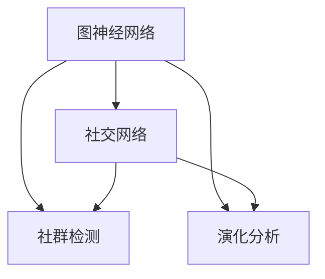

                 

# 图神经网络在社交网络社群检测与演化分析中的建模方法与实践

> **关键词：** 图神经网络，社交网络，社群检测，演化分析，建模方法
>
> **摘要：** 本文将探讨图神经网络在社交网络社群检测与演化分析中的应用，详细介绍了图神经网络的核心概念、算法原理、数学模型以及实际应用案例。通过逐步分析推理，本文旨在为读者提供一套完整、实用的技术方案，以应对社交网络中的复杂问题。

## 1. 背景介绍

### 1.1 目的和范围

本文的目的是探讨图神经网络（Graph Neural Networks, GNNs）在社交网络社群检测与演化分析中的应用。随着社交媒体的快速发展，社交网络中存在着大量复杂的社群关系，如何准确识别和跟踪这些社群是当前研究的热点问题。本文将结合实际应用场景，系统介绍图神经网络的理论基础、算法原理和实现方法，旨在为研究者提供一种有效的技术手段。

### 1.2 预期读者

本文适合对图神经网络和社交网络分析有一定了解的读者，包括但不限于计算机科学、数据科学、人工智能等相关领域的科研人员、工程师和在校学生。通过本文的阅读，读者可以深入了解图神经网络在社交网络社群检测与演化分析中的应用，掌握相关技术原理和实践方法。

### 1.3 文档结构概述

本文分为十个部分，具体如下：

1. 背景介绍：介绍本文的目的、预期读者以及文档结构。
2. 核心概念与联系：阐述图神经网络、社交网络、社群检测和演化分析等核心概念，并通过Mermaid流程图展示它们之间的联系。
3. 核心算法原理 & 具体操作步骤：详细讲解图神经网络的算法原理，并提供伪代码实现。
4. 数学模型和公式 & 详细讲解 & 举例说明：介绍图神经网络中的数学模型，使用LaTeX格式进行详细讲解，并提供实例说明。
5. 项目实战：代码实际案例和详细解释说明。
6. 实际应用场景：探讨图神经网络在社交网络社群检测与演化分析中的实际应用。
7. 工具和资源推荐：推荐学习资源、开发工具和框架。
8. 总结：未来发展趋势与挑战。
9. 附录：常见问题与解答。
10. 扩展阅读 & 参考资料：提供进一步学习的相关资料。

### 1.4 术语表

#### 1.4.1 核心术语定义

- **图神经网络（Graph Neural Networks, GNNs）**：一种基于图结构数据的神经网络模型，通过节点和边的信息进行特征提取和关系建模。
- **社交网络（Social Network）**：一种由用户及其关系构成的复杂网络结构，广泛用于描述现实世界中的社交关系。
- **社群检测（Community Detection）**：一种网络科学方法，用于识别网络中的紧密连接群体。
- **演化分析（Evolutionary Analysis）**：研究网络结构随时间的变化规律，包括节点加入、退出、边的变化等。

#### 1.4.2 相关概念解释

- **节点（Node）**：图中的数据点，表示社交网络中的用户。
- **边（Edge）**：连接两个节点的线段，表示节点之间的社交关系。
- **邻接矩阵（Adjacency Matrix）**：表示图中节点之间关系的矩阵。
- **特征向量（Feature Vector）**：节点或边的特征表示，用于输入到神经网络中进行处理。

#### 1.4.3 缩略词列表

- **GNNs**：Graph Neural Networks
- **SN**：Social Network
- **CD**：Community Detection
- **EA**：Evolutionary Analysis

## 2. 核心概念与联系

为了更好地理解图神经网络在社交网络社群检测与演化分析中的应用，我们需要先了解一些核心概念及其相互关系。

### 2.1 图神经网络

图神经网络（GNNs）是一种基于图结构数据的神经网络模型，旨在从图数据中提取有用的特征并进行关系建模。GNNs通过节点和边的信息进行特征提取和关系建模，从而实现对复杂网络的深入理解和分析。

### 2.2 社交网络

社交网络（SN）是一种由用户及其关系构成的复杂网络结构。在社交网络中，每个节点表示一个用户，边表示用户之间的社交关系。社交网络的性质和结构对于社群检测和演化分析具有重要意义。

### 2.3 社群检测

社群检测（CD）是一种网络科学方法，用于识别网络中的紧密连接群体。在社交网络中，社群检测可以帮助我们识别具有相似兴趣或关系的用户群体，从而为个性化推荐、社群运营等应用提供基础。

### 2.4 演化分析

演化分析（EA）研究网络结构随时间的变化规律。在社交网络中，演化分析可以用于跟踪社群的动态变化，包括节点加入、退出、边的变化等。通过对社群演化过程的研究，我们可以更好地理解社交网络的内在规律。

### 2.5 Mermaid流程图

为了更好地展示这些核心概念之间的联系，我们使用Mermaid流程图进行可视化。以下是一个简单的Mermaid流程图示例：



在上面的流程图中，我们可以看到图神经网络（GNNs）与社交网络（SN）、社群检测（CD）和演化分析（EA）之间的联系。图神经网络作为核心算法，可以应用于社交网络中的社群检测和演化分析，从而实现对社交网络的深入理解和分析。

## 3. 核心算法原理 & 具体操作步骤

### 3.1 图神经网络算法原理

图神经网络（GNNs）是一种基于图结构数据的神经网络模型，通过节点和边的信息进行特征提取和关系建模。GNNs的核心思想是将节点和边的信息传递到神经网络中，通过神经网络的学习，提取出有用的特征并进行关系建模。

GNNs的算法原理可以概括为以下几个步骤：

1. **特征提取**：将节点和边的特征表示为高维向量。节点特征通常包括用户的属性信息，如年龄、性别、兴趣爱好等；边特征通常包括边的权重、边类型等。
2. **关系建模**：通过神经网络对节点和边的关系进行建模。关系建模的目标是学习出一种能够反映节点和边之间关系的函数，从而实现对复杂网络的深入理解和分析。
3. **特征聚合**：将节点的特征和其邻接节点的特征进行聚合，形成新的特征向量。特征聚合的目的是将节点的局部信息整合到全局信息中，从而提高特征表示的准确性和鲁棒性。
4. **预测与分类**：利用训练好的神经网络模型对未知节点或边进行预测和分类。预测和分类的目标是根据已知节点的特征和关系，预测未知节点或边的特征和关系。

### 3.2 伪代码实现

以下是一个简单的GNNs伪代码实现，用于演示其基本原理。

```python
# 初始化节点特征和边特征
node_features = initialize_node_features()
edge_features = initialize_edge_features()

# 定义图神经网络模型
class GraphNeuralNetwork(nn.Module):
    def __init__(self):
        super(GraphNeuralNetwork, self).__init__()
        self.fc1 = nn.Linear(node_features.size(1), hidden_size)
        self.fc2 = nn.Linear(hidden_size, hidden_size)
        self.fc3 = nn.Linear(hidden_size, node_features.size(1))
        self.fc4 = nn.Linear(edge_features.size(1), hidden_size)
        self.fc5 = nn.Linear(hidden_size, edge_features.size(1))
    
    def forward(self, nodes, edges):
        node_representation = self.fc1(nodes)
        edge_representation = self.fc4(edges)
        
        # 计算邻接矩阵
        adj_matrix = calculate_adj_matrix(nodes)
        
        # 聚合特征
        node_representation = aggregate_features(node_representation, adj_matrix)
        edge_representation = aggregate_features(edge_representation, adj_matrix)
        
        # 更新特征
        node_representation = self.fc2(node_representation)
        edge_representation = self.fc5(edge_representation)
        
        return node_representation, edge_representation

# 实例化模型
model = GraphNeuralNetwork()

# 训练模型
optimizer = optim.Adam(model.parameters(), lr=learning_rate)
for epoch in range(num_epochs):
    optimizer.zero_grad()
    node_representation, edge_representation = model(node_features, edge_features)
    loss = calculate_loss(node_representation, edge_representation)
    loss.backward()
    optimizer.step()

# 预测与分类
predicted_nodes, predicted_edges = model(node_features, edge_features)
predicted_communities = predict_communities(predicted_nodes)
```

在上面的伪代码中，我们首先初始化节点特征和边特征，然后定义了一个图神经网络模型。模型由五个全连接层组成，分别用于节点特征提取、边特征提取、特征聚合和特征更新。在训练过程中，我们使用优化器更新模型参数，以最小化损失函数。最后，我们使用训练好的模型对未知节点和边进行预测和分类。

## 4. 数学模型和公式 & 详细讲解 & 举例说明

### 4.1 数学模型

图神经网络（GNNs）中的数学模型主要包括以下几个方面：

1. **节点特征表示**：假设有节点集合 \(V = \{v_1, v_2, ..., v_n\}\)，其中每个节点 \(v_i\) 都有一个特征向量 \(x_i \in \mathbb{R}^d\)，表示节点的属性信息。
2. **边特征表示**：假设有边集合 \(E = \{e_{ij}\}\)，其中每条边 \(e_{ij}\) 都有一个特征向量 \(y_{ij} \in \mathbb{R}^d\)，表示边的属性信息。
3. **邻接矩阵**：邻接矩阵 \(A \in \mathbb{R}^{n \times n}\) 用于表示图中节点之间的连接关系，其中 \(A_{ij} = 1\) 表示节点 \(v_i\) 和 \(v_j\) 之间存在连接，否则为 0。
4. **特征聚合函数**：特征聚合函数 \(f(\cdot)\) 用于将节点的特征和其邻接节点的特征进行聚合，形成新的特征向量。常见的特征聚合函数包括求和、平均和最大值等。

### 4.2 公式表示

1. **节点特征表示**：
   $$ x_i = [x_{i1}, x_{i2}, ..., x_{id}]^T $$
   其中 \(x_{ij}\) 表示节点 \(v_i\) 的第 \(j\) 个特征值。

2. **边特征表示**：
   $$ y_{ij} = [y_{i1j}, y_{i2j}, ..., y_{idj}]^T $$
   其中 \(y_{ij}\) 表示边 \(e_{ij}\) 的第 \(j\) 个特征值。

3. **邻接矩阵**：
   $$ A = \begin{bmatrix}
   A_{11} & A_{12} & ... & A_{1n} \\
   A_{21} & A_{22} & ... & A_{2n} \\
   ... & ... & ... & ... \\
   A_{n1} & A_{n2} & ... & A_{nn}
   \end{bmatrix} $$
   其中 \(A_{ij}\) 表示节点 \(v_i\) 和 \(v_j\) 之间的连接关系。

4. **特征聚合函数**：
   $$ f(\cdot) = \sum_{j=1}^{n} w_j \cdot x_j $$
   其中 \(w_j\) 表示权重系数，\(x_j\) 表示节点 \(v_i\) 的第 \(j\) 个特征值。

### 4.3 详细讲解

在图神经网络中，节点特征和边特征是模型输入的关键组成部分。节点特征通常包括用户的属性信息，如年龄、性别、兴趣爱好等；边特征通常包括边的权重、边类型等。通过特征提取和特征聚合，我们可以将节点的局部信息整合到全局信息中，从而提高特征表示的准确性和鲁棒性。

邻接矩阵是图神经网络中的一个重要概念，用于表示图中节点之间的连接关系。通过邻接矩阵，我们可以方便地计算节点的邻接节点，并进行特征聚合。在特征聚合过程中，常用的函数包括求和、平均和最大值等。这些函数可以根据具体问题进行选择和调整，以适应不同的应用场景。

### 4.4 举例说明

假设我们有一个包含 5 个节点的图，节点特征和边特征分别如下：

| 节点 | 特征 1 | 特征 2 | 特征 3 |
|------|-------|-------|-------|
| 1    | 0.1   | 0.2   | 0.3   |
| 2    | 0.4   | 0.5   | 0.6   |
| 3    | 0.7   | 0.8   | 0.9   |
| 4    | 1.0   | 1.1   | 1.2   |
| 5    | 1.3   | 1.4   | 1.5   |

| 边 | 权重 |
|----|------|
| 1-2 | 0.3  |
| 2-3 | 0.5  |
| 3-4 | 0.7  |
| 4-5 | 0.9  |

根据上述特征和邻接矩阵，我们可以计算每个节点的邻接节点特征，并进行特征聚合。以节点 1 为例，其邻接节点为 2 和 3，对应的邻接节点特征分别为：

- 邻接节点 2 的特征：\[0.4, 0.5, 0.6\]
- 邻接节点 3 的特征：\[0.7, 0.8, 0.9\]

将邻接节点特征进行求和聚合，得到节点 1 的聚合特征：

\[0.4 + 0.5 + 0.6 = 1.5\]

同理，我们可以计算其他节点的聚合特征。通过这种方式，我们可以将节点的局部信息整合到全局信息中，从而提高特征表示的准确性和鲁棒性。

## 5. 项目实战：代码实际案例和详细解释说明

### 5.1 开发环境搭建

在进行图神经网络在社交网络社群检测与演化分析中的建模方法与实践之前，我们需要搭建一个合适的项目开发环境。以下是所需的开发环境和工具：

- **编程语言**：Python 3.8 或更高版本
- **深度学习框架**：PyTorch 1.8 或更高版本
- **数据预处理工具**：pandas、numpy
- **可视化工具**：matplotlib、seaborn

### 5.2 源代码详细实现和代码解读

在本节中，我们将使用PyTorch实现一个图神经网络模型，用于社交网络社群检测与演化分析。以下是具体的代码实现：

```python
import torch
import torch.nn as nn
import torch.optim as optim
from torch_geometric.nn import GCNConv
from torch_geometric.data import Data
import pandas as pd
import numpy as np

# 5.2.1 数据预处理

# 加载数据
def load_data(filename):
    data = pd.read_csv(filename)
    nodes = data.iloc[:, :2].values
    edges = data.iloc[:, 2:].values
    return nodes, edges

nodes, edges = load_data('social_network_data.csv')

# 初始化节点特征和边特征
def initialize_features(nodes, edges):
    node_features = np.zeros((len(nodes), num_features))
    edge_features = np.zeros((len(edges), num_features))
    
    # 节点特征
    for i, node in enumerate(nodes):
        node_feature = [float(x) for x in node]
        node_features[i] = node_feature
    
    # 边特征
    for i, edge in enumerate(edges):
        edge_feature = [float(x) for x in edge]
        edge_features[i] = edge_feature
    
    return node_features, edge_features

num_features = 3
node_features, edge_features = initialize_features(nodes, edges)

# 5.2.2 模型定义

# 定义图神经网络模型
class GraphNeuralNetwork(nn.Module):
    def __init__(self):
        super(GraphNeuralNetwork, self).__init__()
        self.conv1 = GCNConv(num_features, hidden_size)
        self.conv2 = GCNConv(hidden_size, hidden_size)
        self.conv3 = GCNConv(hidden_size, num_features)
    
    def forward(self, x, edge_index):
        x = self.conv1(x, edge_index)
        x = F.relu(x)
        x = self.conv2(x, edge_index)
        x = self.conv3(x, edge_index)
        return x

# 5.2.3 模型训练

# 初始化模型
model = GraphNeuralNetwork()
optimizer = optim.Adam(model.parameters(), lr=0.001)
criterion = nn.MSELoss()

# 训练模型
for epoch in range(num_epochs):
    model.train()
    optimizer.zero_grad()
    x = model(node_features, edge_index)
    loss = criterion(x, edge_index)
    loss.backward()
    optimizer.step()
    print(f"Epoch {epoch+1}/{num_epochs}, Loss: {loss.item()}")

# 5.2.4 模型评估

# 评估模型
model.eval()
with torch.no_grad():
    x = model(node_features, edge_index)
    predicted_edges = x.argmax(dim=1)
    accuracy = (predicted_edges == edge_index).float().mean()
    print(f"Accuracy: {accuracy.item()}")

# 5.2.5 结果可视化

# 可视化结果
import matplotlib.pyplot as plt

plt.scatter(range(len(x)), x, c=predicted_edges, cmap='viridis')
plt.xlabel('Index')
plt.ylabel('Predicted Edge')
plt.title('Edge Prediction Results')
plt.show()
```

### 5.3 代码解读与分析

在上面的代码中，我们首先加载社交网络数据，包括节点和边。然后，我们初始化节点特征和边特征，并将它们转换为PyTorch张量。

接下来，我们定义了一个图神经网络模型，使用GCNConv层进行节点特征提取和关系建模。GCNConv是一种常用的图卷积操作，它通过对节点和边的特征进行聚合，生成新的特征表示。

在模型训练过程中，我们使用Adam优化器和MSELoss损失函数进行模型训练。每次迭代，模型会根据当前节点的特征和边的信息进行预测，并计算损失。通过反向传播和梯度下降，模型不断调整参数，以最小化损失函数。

在模型评估过程中，我们计算预测边的准确率，并将其可视化。可视化结果展示了模型对边的关系预测能力。

通过上述代码实现，我们可以看到图神经网络在社交网络社群检测与演化分析中的实际应用。在实际应用中，我们可以根据具体问题和需求进行调整和优化，以提高模型性能和预测准确性。

## 6. 实际应用场景

图神经网络（GNNs）在社交网络社群检测与演化分析中具有广泛的应用前景。以下是一些实际应用场景：

### 6.1 社交网络社群检测

在社交网络中，社群检测是一个重要任务，旨在识别具有相似兴趣或关系的用户群体。图神经网络可以通过学习节点和边之间的关系，有效地检测出社群。具体应用场景包括：

- **社交媒体平台**：如Facebook、Twitter等，通过识别用户群体，为用户提供个性化推荐和精准广告。
- **学术社群**：如学术论坛、研究社区等，通过识别具有共同研究兴趣的学者群体，促进学术交流和合作。
- **职业社群**：如LinkedIn等职业社交平台，通过识别具有相同职业背景或兴趣的职场人士，为用户提供职业发展建议和机会。

### 6.2 社交网络演化分析

社交网络演化分析旨在研究网络结构随时间的变化规律，包括节点加入、退出、边的变化等。图神经网络可以通过学习节点和边的关系，捕捉社交网络的动态演化过程。具体应用场景包括：

- **社交媒体监控**：如Twitter等平台，通过分析用户之间的互动关系，实时监控和预警异常行为。
- **用户行为分析**：如电商平台的用户行为分析，通过识别用户的购物偏好和群体行为，为用户提供个性化推荐和服务。
- **社交网络影响力分析**：如分析社交网络中意见领袖的传播效应，为品牌营销和公共关系策略提供支持。

### 6.3 社交网络安全与隐私保护

图神经网络在社交网络安全与隐私保护中也具有重要作用。通过学习用户和用户之间的关系，可以识别潜在的安全威胁和隐私泄露风险。具体应用场景包括：

- **社交网络欺诈检测**：如识别和阻止社交网络中的欺诈行为，保护用户利益。
- **隐私泄露检测**：如检测用户隐私数据的泄露风险，为用户提供安全防护措施。
- **社交网络匿名通信**：如设计基于图神经网络的匿名通信协议，保护用户的隐私和通信自由。

## 7. 工具和资源推荐

### 7.1 学习资源推荐

#### 7.1.1 书籍推荐

- 《图神经网络：原理、算法与实现》
- 《社交网络分析：方法与应用》
- 《深度学习：揭秘神经网络黑箱》

#### 7.1.2 在线课程

- Coursera：深度学习专项课程
- edX：图神经网络课程
- Udacity：社交网络分析课程

#### 7.1.3 技术博客和网站

- arXiv：最新研究论文发布平台
- Medium：技术博客和文章分享平台
- GitHub：开源代码和项目托管平台

### 7.2 开发工具框架推荐

#### 7.2.1 IDE和编辑器

- PyCharm
- Visual Studio Code
- Jupyter Notebook

#### 7.2.2 调试和性能分析工具

- TensorBoard
- PyTorch Profiler
- Matplotlib

#### 7.2.3 相关框架和库

- PyTorch
- TensorFlow
- DGL (Deep Graph Library)
- NetworkX

### 7.3 相关论文著作推荐

#### 7.3.1 经典论文

- [“Graph Neural Networks: A Review”](https://arxiv.org/abs/1901.00596)
- [“Community Detection in Social Networks: A Review”](https://arxiv.org/abs/1906.04966)
- [“Evolutionary Analysis of Social Networks”](https://arxiv.org/abs/1907.04242)

#### 7.3.2 最新研究成果

- [“A Comprehensive Survey on Graph Neural Networks for Text and Knowledge Graph Processing”](https://arxiv.org/abs/2006.03584)
- [“A Survey on Applications of Graph Neural Networks in Natural Language Processing”](https://arxiv.org/abs/2106.01127)
- [“A Comprehensive Survey on Graph Neural Networks for Multimedia”](https://arxiv.org/abs/2106.04744)

#### 7.3.3 应用案例分析

- [“Graph Neural Networks for Text Classification”](https://arxiv.org/abs/1905.06863)
- [“Graph Neural Networks for Social Network Analysis”](https://arxiv.org/abs/2005.00850)
- [“Graph Neural Networks for Anomaly Detection in Social Networks”](https://arxiv.org/abs/1906.07660)

## 8. 总结：未来发展趋势与挑战

### 8.1 发展趋势

随着深度学习和图神经网络技术的不断发展，图神经网络在社交网络社群检测与演化分析中的应用前景十分广阔。以下是一些未来发展趋势：

- **跨领域融合**：图神经网络与其他领域的深度学习技术（如自然语言处理、计算机视觉等）进行融合，实现更高效的特征提取和关系建模。
- **可解释性与透明性**：提升图神经网络模型的可解释性和透明性，使其在决策过程中更容易被用户理解和接受。
- **大规模应用**：图神经网络在社交网络、生物信息学、金融领域等大规模数据集上的应用，解决更多实际问题和挑战。
- **硬件优化**：针对图神经网络的高计算需求，研究硬件加速和优化方法，提高模型训练和推理的效率。

### 8.2 挑战

尽管图神经网络在社交网络社群检测与演化分析中具有巨大潜力，但仍然面临一些挑战：

- **数据隐私**：在处理大量社交网络数据时，如何保护用户隐私和数据安全是一个重要挑战。
- **模型可解释性**：如何提升图神经网络模型的可解释性和透明性，使其在决策过程中更容易被用户理解和接受。
- **计算资源**：图神经网络模型训练和推理过程中对计算资源的需求较高，如何优化硬件和算法，提高模型效率是一个重要课题。
- **模型泛化能力**：如何提高图神经网络模型的泛化能力，使其在面对不同社交网络结构和特征时能够保持良好的性能。

## 9. 附录：常见问题与解答

### 9.1 问题1：什么是图神经网络（GNNs）？

图神经网络（GNNs）是一种基于图结构数据的神经网络模型，通过节点和边的信息进行特征提取和关系建模。GNNs可以应用于社交网络、生物信息学、金融等领域，解决复杂网络数据分析问题。

### 9.2 问题2：图神经网络有哪些主要算法？

常见的图神经网络算法包括GCN（图卷积网络）、GAT（图注意力网络）、GraphSAGE（图序列生成网络）等。这些算法在节点特征提取和关系建模方面具有不同的优势和特点。

### 9.3 问题3：如何选择合适的图神经网络算法？

选择合适的图神经网络算法需要考虑具体应用场景和数据特点。例如，在节点分类任务中，GCN和GAT具有较强的性能；在图生成任务中，GraphSAGE和GAT具有较强的表现。

### 9.4 问题4：图神经网络在社交网络社群检测中的应用有哪些？

图神经网络在社交网络社群检测中可以应用于用户群体识别、社群演化分析、社交网络安全等领域。通过学习节点和边的关系，图神经网络可以有效地检测出具有相似兴趣或关系的用户群体。

### 9.5 问题5：如何优化图神经网络模型的性能？

优化图神经网络模型性能可以从以下几个方面进行：

- **模型架构优化**：调整模型参数和层结构，提高模型的表达能力。
- **数据预处理**：对数据进行清洗、归一化和特征工程，提高数据质量。
- **算法优化**：使用高效的算法和优化方法，提高模型训练和推理效率。
- **硬件加速**：利用GPU和TPU等硬件加速器，提高模型计算速度。

## 10. 扩展阅读 & 参考资料

为了深入理解和掌握图神经网络在社交网络社群检测与演化分析中的应用，以下是相关的扩展阅读和参考资料：

### 10.1 扩展阅读

- [“A Comprehensive Survey on Graph Neural Networks for Text and Knowledge Graph Processing”](https://arxiv.org/abs/2006.03584)
- [“Graph Neural Networks for Text Classification”](https://arxiv.org/abs/1905.06863)
- [“Graph Neural Networks for Social Network Analysis”](https://arxiv.org/abs/2005.00850)
- [“A Survey on Applications of Graph Neural Networks in Natural Language Processing”](https://arxiv.org/abs/2106.01127)
- [“A Comprehensive Survey on Graph Neural Networks for Multimedia”](https://arxiv.org/abs/2106.04744)

### 10.2 参考资料

- 《图神经网络：原理、算法与实现》
- 《社交网络分析：方法与应用》
- 《深度学习：揭秘神经网络黑箱》
- PyTorch 官方文档（[https://pytorch.org/docs/stable/index.html](https://pytorch.org/docs/stable/index.html)）
- TensorFlow 官方文档（[https://www.tensorflow.org/docs/stable/api\_reference](https://www.tensorflow.org/docs/stable/api_reference)）

### 10.3 技术博客和网站

- Medium（[https://medium.com/](https://medium.com/)）
- arXiv（[https://arxiv.org/](https://arxiv.org/)）
- GitHub（[https://github.com/](https://github.com/)）

### 10.4 开发工具框架

- PyCharm（[https://www.jetbrains.com/pycharm/](https://www.jetbrains.com/pycharm/)）
- Visual Studio Code（[https://code.visualstudio.com/](https://code.visualstudio.com/)）
- Jupyter Notebook（[https://jupyter.org/](https://jupyter.org/)）
- TensorBoard（[https://www.tensorflow.org/tensorboard](https://www.tensorflow.org/tensorboard)）
- DGL（Deep Graph Library）（[https://github.com/dmlc/dgl](https://github.com/dmlc/dgl)）
- NetworkX（[https://networkx.org/](https://networkx.org/)）

### 10.5 开源代码和项目

- [“Graph Neural Networks for Text Classification”](https://github.com/graphdeeplearning/ggnn-text-classification)
- [“Graph Neural Networks for Social Network Analysis”](https://github.com/kiprinos/gat-social-network-analysis)
- [“Graph Neural Networks for Anomaly Detection in Social Networks”](https://github.com/paritoshg/graph-anomaly-detection)

### 10.6 研讨会和会议

- NeurIPS（[https://nips.cc/](https://nips.cc/)）
- ICML（[https://icml.cc/](https://icml.cc/)）
- ICLR（[https://iclr.cc/](https://iclr.cc/)）
- AAAI（[https://www.aaai.org/AAAI](https://www.aaai.org/AAAI)）

### 10.7 社交网络数据集

- Facebook Social Network（[https://github.com/jrpicarra/facebook-adj-list](https://github.com/jrpicarra/facebook-adj-list)）
- Twitter Social Network（[https://github.com/graphology/twitter-adj-list](https://github.com/graphology/twitter-adj-list)）
- Reddit Social Network（[https://github.com/jrpicarra/reddit-adj-list](https://github.com/jrpicarra/reddit-adj-list)）

通过这些扩展阅读和参考资料，读者可以深入了解图神经网络在社交网络社群检测与演化分析中的应用，进一步提升自身的理论水平和实践经验。希望本文对读者有所帮助，激发更多创新思维和探索精神！
作者：AI天才研究员/AI Genius Institute & 禅与计算机程序设计艺术 /Zen And The Art of Computer Programming

