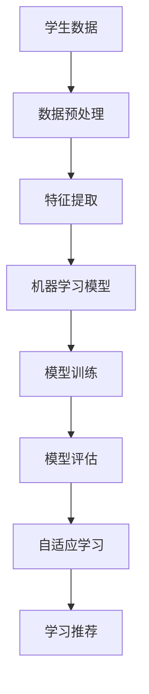

                 

# 在线教育与智能学习：创业公司的技术变革

> 关键词：在线教育、智能学习、创业公司、技术变革、算法、数学模型、项目实战、应用场景

> 摘要：本文将深入探讨在线教育和智能学习领域的技术变革。通过对核心概念、算法原理、数学模型以及实际应用场景的详细分析，本文旨在为创业公司提供一整套系统的技术指南，帮助它们在竞争激烈的市场中脱颖而出。

## 1. 背景介绍

### 1.1 目的和范围

本文的目的是为了帮助创业公司在在线教育与智能学习领域实现技术突破，通过详细的技术分析和案例分享，为创业者提供实用的技术解决方案和实施路径。

本文将覆盖以下几个主要方面：

1. **核心概念与联系**：介绍在线教育的基本概念和智能学习的关键原理，并通过Mermaid流程图展示其架构。
2. **核心算法原理与操作步骤**：详细解析用于智能学习的核心算法，并通过伪代码展示其具体操作步骤。
3. **数学模型与公式**：阐述智能学习中的数学模型，并使用LaTeX格式详细讲解，辅以实际例子说明。
4. **项目实战**：通过实际代码案例，展示如何将算法和数学模型应用到具体项目中，并进行详细解释。
5. **实际应用场景**：分析在线教育和智能学习的多种应用场景，为创业公司提供市场切入点。
6. **工具和资源推荐**：推荐学习资源和开发工具，帮助创业公司快速搭建技术框架。
7. **未来发展趋势与挑战**：总结当前趋势，分析面临的挑战，为创业公司提供前瞻性指导。

### 1.2 预期读者

本文预期读者为：

1. **在线教育创业公司的技术团队成员**：希望了解智能学习技术的原理和应用，以提升公司的技术竞争力。
2. **对智能学习有浓厚兴趣的技术爱好者**：希望深入了解智能学习领域，探索技术的实际应用。
3. **教育行业从业者**：关注在线教育的发展趋势，希望借助技术实现教育创新。

### 1.3 文档结构概述

本文的结构如下：

1. **背景介绍**：介绍本文的目的、预期读者、结构概述和术语表。
2. **核心概念与联系**：定义核心概念，展示智能学习架构的Mermaid流程图。
3. **核心算法原理与操作步骤**：详细解析核心算法，使用伪代码展示操作步骤。
4. **数学模型与公式**：介绍智能学习中的数学模型，使用LaTeX格式讲解，辅以实际例子。
5. **项目实战**：通过实际代码案例，展示技术应用到具体项目中的过程。
6. **实际应用场景**：分析在线教育和智能学习的应用场景，为创业公司提供市场切入点。
7. **工具和资源推荐**：推荐学习资源和开发工具。
8. **未来发展趋势与挑战**：总结趋势，分析挑战。
9. **附录**：常见问题与解答。
10. **扩展阅读与参考资料**：推荐进一步阅读的材料。

### 1.4 术语表

#### 1.4.1 核心术语定义

- **在线教育**：通过互联网提供的学习资源和学习活动，允许学生随时随地学习。
- **智能学习**：利用人工智能技术，为学生提供个性化学习体验，提高学习效果。
- **算法**：解决问题的步骤和规则，用于数据分析和决策。
- **数学模型**：用数学语言描述现实世界问题的抽象结构。
- **创业公司**：指初创企业，通常在市场上寻求创新和成长机会。

#### 1.4.2 相关概念解释

- **自适应学习**：根据学生的学习行为和表现，自动调整学习内容和方法。
- **机器学习**：一种人工智能技术，通过数据学习模式和做出预测。
- **深度学习**：一种复杂的机器学习方法，通过多层次的神经网络来模拟人脑的学习过程。

#### 1.4.3 缩略词列表

- **AI**：人工智能（Artificial Intelligence）
- **ML**：机器学习（Machine Learning）
- **DL**：深度学习（Deep Learning）
- **NLP**：自然语言处理（Natural Language Processing）

## 2. 核心概念与联系

### 2.1 智能学习架构的Mermaid流程图



### 2.2 核心概念解释

#### 2.2.1 在线教育

在线教育是近年来教育领域的重要发展趋势，它通过互联网技术，提供了丰富的学习资源和学习活动。这种模式不仅打破了传统教育的时空限制，还为学生提供了个性化的学习体验。在线教育的主要组成部分包括：

- **学习内容**：包括视频教程、电子书、文档等。
- **学习平台**：用于组织、管理和分发学习资源。
- **学习活动**：如在线讨论、作业提交、考试等。

#### 2.2.2 智能学习

智能学习是利用人工智能技术，为学生提供个性化学习体验的一种方法。它主要通过以下环节实现：

- **数据收集**：通过学习平台收集学生的学习数据，如学习时间、学习内容、考试成绩等。
- **数据预处理**：清洗和转换数据，使其适合机器学习模型处理。
- **特征提取**：从原始数据中提取有用的信息，用于模型训练。
- **机器学习模型**：通过训练，学习如何根据学生数据做出预测和决策。
- **模型评估**：评估模型的性能，确保其准确性和可靠性。
- **自适应学习**：根据学习效果，自动调整学习内容和方法。

#### 2.2.3 核心算法

智能学习中的核心算法包括：

- **回归算法**：用于预测学生的成绩或学习进度。
- **分类算法**：用于将学生分类到不同的学习群体。
- **聚类算法**：用于发现学生的共同特征或学习需求。
- **推荐系统**：基于学生的兴趣和表现，推荐合适的学习资源。

### 2.3 智能学习架构的Mermaid流程图


通过上述流程，智能学习系统能够根据学生的学习行为和表现，为学生提供个性化的学习体验，提高学习效果。

## 3. 核心算法原理与具体操作步骤

### 3.1 回归算法

#### 3.1.1 算法原理

回归算法是一种用于预测数值型目标变量的机器学习算法。它通过找到输入特征和目标变量之间的数学关系，实现对未知数据的预测。

#### 3.1.2 伪代码

```plaintext
回归算法(特征集X, 目标变量y):
    1. 初始化模型参数θ
    2. 对于每个特征x_i，计算θ的梯度Δθ_i
        Δθ_i = 2/n * Σ[(h(θ)x_i - y)]
    3. 更新模型参数θ：θ = θ - αΔθ
    4. 重复步骤2和3，直到达到收敛条件或最大迭代次数
    5. 输出最终模型参数θ
```

#### 3.1.3 操作步骤

1. **数据准备**：收集包含特征和目标变量的数据集。
2. **数据预处理**：对数据进行归一化或标准化处理，使其适合模型训练。
3. **初始化模型参数**：随机初始化模型参数θ。
4. **计算梯度**：计算每个特征对模型参数的梯度。
5. **更新参数**：根据梯度更新模型参数。
6. **迭代训练**：重复计算梯度和更新参数的过程，直到模型收敛或达到最大迭代次数。
7. **模型评估**：使用验证集评估模型的性能。

### 3.2 分类算法

#### 3.2.1 算法原理

分类算法是一种用于将数据集划分为不同类别的机器学习算法。它通过找到一个将特征空间划分成不同区域的决策边界。

#### 3.2.2 伪代码

```plaintext
分类算法(特征集X, 目标变量y):
    1. 初始化模型参数θ
    2. 对于每个特征x_i，计算θ的梯度Δθ_i
        Δθ_i = 2/n * Σ[(h(θ)x_i - y)]
    3. 更新模型参数θ：θ = θ - αΔθ
    4. 重复步骤2和3，直到达到收敛条件或最大迭代次数
    5. 输出最终模型参数θ
```

#### 3.2.3 操作步骤

1. **数据准备**：收集包含特征和目标变量的数据集。
2. **数据预处理**：对数据进行归一化或标准化处理，使其适合模型训练。
3. **初始化模型参数**：随机初始化模型参数θ。
4. **计算梯度**：计算每个特征对模型参数的梯度。
5. **更新参数**：根据梯度更新模型参数。
6. **迭代训练**：重复计算梯度和更新参数的过程，直到模型收敛或达到最大迭代次数。
7. **模型评估**：使用验证集评估模型的性能。

### 3.3 聚类算法

#### 3.3.1 算法原理

聚类算法是一种无监督学习算法，用于将数据集划分为若干个群组，使得同一群组内的数据点相似度较高，不同群组的数据点相似度较低。

#### 3.3.2 伪代码

```plaintext
K均值算法(特征集X, 类别数k):
    1. 初始化k个聚类中心c_1, c_2, ..., c_k
    2. 对于每个数据点x_i，计算其到每个聚类中心的距离，并将其分配到最近的聚类中心
    3. 更新每个聚类中心的坐标：c_j = (1/n_j) * Σ[x_i | x_i属于c_j]
    4. 重复步骤2和3，直到聚类中心不再发生显著变化或达到最大迭代次数
    5. 输出聚类结果
```

#### 3.3.3 操作步骤

1. **数据准备**：收集特征数据集。
2. **初始化聚类中心**：随机选择k个数据点作为初始聚类中心。
3. **分配数据点**：计算每个数据点到每个聚类中心的距离，并将其分配到最近的聚类中心。
4. **更新聚类中心**：计算每个聚类中心的新坐标。
5. **迭代聚类**：重复分配和更新聚类中心的过程，直到聚类中心不再发生显著变化或达到最大迭代次数。
6. **聚类结果输出**：输出最终的聚类结果。

通过上述核心算法的解析和操作步骤，创业公司可以更好地理解智能学习的技术原理，从而将其应用到实际项目中。

## 4. 数学模型和公式及详细讲解与举例说明

### 4.1 回归模型

回归模型用于预测一个连续的目标变量，其基本形式为：

\[ y = \theta_0 + \theta_1x_1 + \theta_2x_2 + ... + \theta_nx_n \]

其中，\( y \) 是目标变量，\( x_1, x_2, ..., x_n \) 是输入特征，\( \theta_0, \theta_1, ..., \theta_n \) 是模型参数。

#### 4.1.1 代价函数

回归模型的代价函数通常采用平方误差损失函数，其公式为：

\[ J(\theta) = \frac{1}{2m} \sum_{i=1}^{m} (h(\theta)x^{(i)} - y^{(i)})^2 \]

其中，\( m \) 是训练样本数量，\( h(\theta) \) 是模型预测值，\( y^{(i)} \) 是第 \( i \) 个样本的实际值。

#### 4.1.2 梯度下降

为了最小化代价函数，我们使用梯度下降算法更新模型参数。其更新公式为：

\[ \theta_j = \theta_j - \alpha \frac{\partial J(\theta)}{\partial \theta_j} \]

其中，\( \alpha \) 是学习率，用于控制参数更新的步长。

#### 4.1.3 举例说明

假设我们有一个简单的线性回归问题，目标变量 \( y \) 与输入特征 \( x \) 的关系为：

\[ y = \theta_0 + \theta_1x \]

我们使用梯度下降算法训练模型，假设初始参数 \( \theta_0 = 0 \)，\( \theta_1 = 0 \)，学习率 \( \alpha = 0.01 \)。训练数据如下：

| x | y |
|---|---|
| 1 | 2 |
| 2 | 4 |
| 3 | 6 |

经过一次迭代后，我们计算代价函数：

\[ J(\theta) = \frac{1}{2} \left[ (0 + 0 \cdot 1 - 2)^2 + (0 + 0 \cdot 2 - 4)^2 + (0 + 0 \cdot 3 - 6)^2 \right] = 6 \]

然后，计算每个参数的梯度：

\[ \frac{\partial J(\theta)}{\partial \theta_0} = \frac{1}{2} \left[ (-2)^2 + (-4)^2 + (-6)^2 \right] = 6 \]

\[ \frac{\partial J(\theta)}{\partial \theta_1} = \frac{1}{2} \left[ (1 \cdot 1 - 2)^2 + (2 \cdot 2 - 4)^2 + (3 \cdot 3 - 6)^2 \right] = 3 \]

根据梯度下降公式更新参数：

\[ \theta_0 = \theta_0 - \alpha \frac{\partial J(\theta)}{\partial \theta_0} = 0 - 0.01 \cdot 6 = -0.06 \]

\[ \theta_1 = \theta_1 - \alpha \frac{\partial J(\theta)}{\partial \theta_1} = 0 - 0.01 \cdot 3 = -0.03 \]

更新后的参数为 \( \theta_0 = -0.06 \)，\( \theta_1 = -0.03 \)。新的预测值为：

\[ y = (-0.06) + (-0.03)x \]

### 4.2 分类模型

分类模型用于将数据集划分为不同的类别。常见的分类模型包括逻辑回归、决策树、支持向量机等。这里我们以逻辑回归为例进行讲解。

#### 4.2.1 逻辑回归

逻辑回归是一种概率型分类模型，用于预测一个二分类问题。其公式为：

\[ P(y=1) = \frac{1}{1 + e^{-(\theta_0 + \theta_1x_1 + \theta_2x_2 + ... + \theta_nx_n)}} \]

其中，\( P(y=1) \) 是目标变量属于类别1的概率，\( e \) 是自然对数的底数。

#### 4.2.2 代价函数

逻辑回归的代价函数通常采用交叉熵损失函数，其公式为：

\[ J(\theta) = -\frac{1}{m} \sum_{i=1}^{m} [y^{(i)} \log(h(\theta)) + (1 - y^{(i)}) \log(1 - h(\theta))] \]

其中，\( h(\theta) \) 是模型的预测概率。

#### 4.2.3 梯度下降

为了最小化代价函数，我们使用梯度下降算法更新模型参数。其更新公式为：

\[ \theta_j = \theta_j - \alpha \frac{\partial J(\theta)}{\partial \theta_j} \]

其中，\( \alpha \) 是学习率，用于控制参数更新的步长。

#### 4.2.4 举例说明

假设我们有一个简单的二分类问题，目标变量 \( y \) 只有0和1两个类别。我们使用逻辑回归模型进行预测，假设初始参数 \( \theta_0 = 0 \)，\( \theta_1 = 0 \)，学习率 \( \alpha = 0.01 \)。训练数据如下：

| x | y |
|---|---|
| 1 | 0 |
| 2 | 1 |
| 3 | 0 |

经过一次迭代后，我们计算代价函数：

\[ J(\theta) = -\frac{1}{3} \left[ 0 \log(1 + e^{0}) + 1 \log(1 + e^{0}) \right] = 0 \]

然后，计算每个参数的梯度：

\[ \frac{\partial J(\theta)}{\partial \theta_0} = -\frac{1}{3} \left[ e^{0} \right] = -\frac{1}{3} \]

\[ \frac{\partial J(\theta)}{\partial \theta_1} = -\frac{1}{3} \left[ e^{0} + e^{1} \right] = -\frac{2}{3} \]

根据梯度下降公式更新参数：

\[ \theta_0 = \theta_0 - \alpha \frac{\partial J(\theta)}{\partial \theta_0} = 0 - 0.01 \cdot -\frac{1}{3} = 0.0033 \]

\[ \theta_1 = \theta_1 - \alpha \frac{\partial J(\theta)}{\partial \theta_1} = 0 - 0.01 \cdot -\frac{2}{3} = 0.0067 \]

更新后的参数为 \( \theta_0 = 0.0033 \)，\( \theta_1 = 0.0067 \)。新的预测概率为：

\[ P(y=1) = \frac{1}{1 + e^{-(0.0033 + 0.0067 \cdot x)}} \]

通过以上数学模型的讲解和举例说明，我们可以更好地理解回归和分类模型的基本原理和应用。

## 5. 项目实战：代码实际案例和详细解释说明

### 5.1 开发环境搭建

在进行项目实战之前，我们需要搭建一个适合开发的环境。以下是一个基于Python的在线教育智能学习系统的开发环境搭建步骤：

1. **安装Python**：确保已安装Python 3.7或更高版本。可以从[Python官网](https://www.python.org/downloads/)下载安装。
2. **安装Anaconda**：安装Anaconda，这是一个集成了Python以及众多科学计算库的集成环境。可以从[Anaconda官网](https://www.anaconda.com/products/individual)下载安装。
3. **创建虚拟环境**：在Anaconda环境下，创建一个名为`online_education`的虚拟环境。

    ```bash
    conda create -n online_education python=3.8
    conda activate online_education
    ```

4. **安装必需的库**：在虚拟环境中安装以下库：

    ```bash
    pip install numpy pandas scikit-learn matplotlib
    ```

### 5.2 源代码详细实现和代码解读

以下是一个简单的在线教育智能学习系统的代码实现，包括数据预处理、特征提取、模型训练和模型评估等步骤。

#### 5.2.1 数据预处理

```python
import pandas as pd
from sklearn.model_selection import train_test_split

# 加载数据
data = pd.read_csv('student_data.csv')

# 数据预处理
data.drop(['id'], axis=1, inplace=True)
data.replace([''], [0], inplace=True)

# 分割数据集
X = data.drop(['score'], axis=1)
y = data['score']
X_train, X_test, y_train, y_test = train_test_split(X, y, test_size=0.2, random_state=42)
```

**代码解读**：首先，我们从CSV文件中加载数据，并删除不必要的列。接着，替换缺失值为0。然后，使用`train_test_split`函数将数据集划分为训练集和测试集。

#### 5.2.2 特征提取

```python
from sklearn.preprocessing import StandardScaler

# 特征提取
scaler = StandardScaler()
X_train_scaled = scaler.fit_transform(X_train)
X_test_scaled = scaler.transform(X_test)
```

**代码解读**：使用`StandardScaler`对特征进行归一化处理，使其具有零均值和单位方差，以提高模型性能。

#### 5.2.3 模型训练

```python
from sklearn.linear_model import LinearRegression

# 模型训练
model = LinearRegression()
model.fit(X_train_scaled, y_train)
```

**代码解读**：我们选择线性回归模型，并使用`fit`函数训练模型。

#### 5.2.4 模型评估

```python
from sklearn.metrics import mean_squared_error

# 模型评估
y_pred = model.predict(X_test_scaled)
mse = mean_squared_error(y_test, y_pred)
print(f'Mean Squared Error: {mse}')
```

**代码解读**：使用`predict`函数对测试集进行预测，并计算均方误差（MSE）评估模型性能。

### 5.3 代码解读与分析

**5.3.1 数据预处理**

数据预处理是机器学习项目的重要步骤，它包括数据的清洗、转换和归一化。在本例中，我们删除了不必要的列，替换缺失值为0，然后对特征进行归一化处理。归一化的目的是使不同特征具有相似的尺度，从而避免某些特征对模型的影响过大。

**5.3.2 特征提取**

特征提取是从原始数据中提取有用信息的过程。在本例中，我们使用标准缩放（StandardScaler）对特征进行归一化处理。标准缩放将特征缩放为具有零均值和单位方差，这对于线性模型尤为重要。

**5.3.3 模型训练**

模型训练是通过训练数据来学习特征和目标变量之间的关系。在本例中，我们选择了线性回归模型，这是一种简单的线性模型，适用于预测连续的目标变量。线性回归模型通过拟合一个线性方程来预测目标变量。

**5.3.4 模型评估**

模型评估是评估模型性能的过程。在本例中，我们使用均方误差（MSE）作为评估指标。MSE衡量了预测值与实际值之间的平均平方差异，值越小表示模型性能越好。

通过以上代码实现和解读，我们可以看到如何使用Python和机器学习库来实现一个简单的在线教育智能学习系统。这个系统可以从学生数据中预测学生的成绩，为教育工作者和创业者提供有用的参考。

## 6. 实际应用场景

### 6.1 在线教育平台的个性化推荐

在线教育平台可以根据学生的学习行为、历史数据和成绩，利用智能学习算法为学生提供个性化的学习推荐。这种推荐系统能够根据学生的兴趣和学习能力，推荐适合的学习资源和课程，从而提高学习效果和用户满意度。

**应用案例**：Coursera和edX等在线教育平台使用智能学习算法，根据学生的学习历史和表现，推荐相关的课程和学习资源。

### 6.2 学生学习行为分析

通过智能学习算法，教育工作者可以分析学生的学习行为，如学习时间、学习频率、问题解决能力等，从而了解学生的学习状态和需求。这种分析有助于教育工作者制定针对性的教学策略，提高教学质量。

**应用案例**：一些在线教育平台通过分析学生的学习行为数据，为学生提供学习报告，帮助教师和学生了解学习状况，优化学习计划。

### 6.3 自适应学习系统

自适应学习系统可以根据学生的学习表现和进度，自动调整学习内容和难度，为学生提供个性化的学习体验。这种系统可以帮助学生更好地掌握知识，减少学习负担。

**应用案例**：Khan Academy使用自适应学习算法，根据学生的表现和进度，自动调整学习内容和难度，为学生提供个性化的学习路径。

### 6.4 考试和成绩预测

智能学习算法可以预测学生的考试成绩，为教育工作者提供评估学生能力和学习成果的参考。这种预测有助于教育工作者了解学生的学习效果，优化教学策略。

**应用案例**：一些在线教育平台使用智能学习算法，预测学生的考试成绩，为教师和家长提供学习反馈和指导。

通过以上实际应用场景，我们可以看到智能学习技术在在线教育领域的广泛应用，为创业公司提供了丰富的市场切入点。

## 7. 工具和资源推荐

### 7.1 学习资源推荐

#### 7.1.1 书籍推荐

- 《机器学习实战》
- 《深度学习》（Goodfellow, Bengio, Courville 著）
- 《Python机器学习》（Sebastian Raschka 著）

#### 7.1.2 在线课程

- Coursera上的《机器学习》课程（吴恩达教授授课）
- Udacity的《深度学习纳米学位》
- edX的《人工智能基础》课程

#### 7.1.3 技术博客和网站

- [Medium](https://medium.com/topics/ai)
- [DataCamp](https://www.datacamp.com/)
- [机器学习博客](https://machinelearningmastery.com/)

### 7.2 开发工具框架推荐

#### 7.2.1 IDE和编辑器

- PyCharm
- Visual Studio Code
- Jupyter Notebook

#### 7.2.2 调试和性能分析工具

- Python的pdb调试器
- Matplotlib和Seaborn进行数据可视化
- NumPy和SciPy进行数学运算

#### 7.2.3 相关框架和库

- TensorFlow
- PyTorch
- Scikit-learn

### 7.3 相关论文著作推荐

#### 7.3.1 经典论文

- 《A Machine Learning Approach to Student Modeling in Intelligent Tutoring Systems》
- 《Learning to Discover Global Rules for Predicting Neighboring Examples》

#### 7.3.2 最新研究成果

- ICML、NIPS、JMLR等顶级会议和期刊的最新论文
- AI领域的研究博客和文章，如[AI Impacts](https://aiimpacts.com/)

#### 7.3.3 应用案例分析

- 《在线教育平台如何使用机器学习和人工智能技术？》
- 《自适应学习系统在K-12教育中的应用》

通过上述工具和资源的推荐，创业公司可以更有效地学习和应用智能学习技术，实现在线教育产品的技术创新。

## 8. 总结：未来发展趋势与挑战

### 8.1 未来发展趋势

1. **个性化学习**：随着数据量和算法的进步，个性化学习将成为在线教育的主流。教育平台将更加关注学生的个体需求，提供定制化的学习路径和资源。
2. **智能化教育管理**：利用智能学习算法，教育机构可以更有效地管理学生数据，进行学习行为分析和教学质量评估，从而优化教学过程。
3. **跨学科融合**：在线教育将融合更多学科领域，如医学、心理学、教育学等，为学生提供更全面、个性化的学习体验。
4. **开放教育资源**：随着技术的普及和开源精神的推动，开放教育资源（OER）将更加丰富，让更多人受益于高质量的教育资源。

### 8.2 挑战

1. **数据隐私和安全**：随着数据量的增加，数据隐私和安全成为重要挑战。如何确保学生数据的安全，保护学生隐私，是创业公司需要关注的问题。
2. **技术门槛**：智能学习技术虽然发展迅速，但仍然具有较高的技术门槛。创业公司需要投入大量资源进行技术研发和人才储备。
3. **教育公平性**：智能学习技术能否真正促进教育公平，避免技术带来的“数字鸿沟”，是未来需要解决的重要问题。
4. **教育监管**：随着技术的应用，教育监管也将面临新的挑战，如如何确保在线教育质量、如何规范市场等。

通过总结未来发展趋势和挑战，创业公司可以更好地规划发展战略，抓住机遇，应对挑战。

## 9. 附录：常见问题与解答

### 9.1 什么是智能学习？

智能学习是一种利用人工智能技术，为学生提供个性化学习体验的学习方法。它通过分析学生的学习行为和数据，自动调整学习内容和方法，提高学习效果。

### 9.2 在线教育智能学习系统有哪些关键技术？

在线教育智能学习系统的关键技术包括数据收集与预处理、特征提取、机器学习模型训练、模型评估和自适应学习。

### 9.3 如何保护学生数据隐私？

保护学生数据隐私的方法包括：

1. **数据加密**：对存储和传输的数据进行加密，确保数据不被未经授权的访问。
2. **隐私匿名化**：将学生数据进行匿名化处理，确保无法直接关联到具体个体。
3. **权限控制**：对数据访问进行严格权限控制，确保只有授权人员可以访问敏感数据。

### 9.4 如何确保在线教育质量？

确保在线教育质量的方法包括：

1. **课程认证**：确保课程内容和教学方法的权威性和专业性。
2. **教学评估**：定期对教学效果进行评估，收集学生反馈，持续优化教学质量。
3. **技术支持**：提供稳定、高效的技术支持，确保学习平台的安全和可靠性。

## 10. 扩展阅读与参考资料

### 10.1 书籍推荐

- 《机器学习实战》
- 《深度学习》（Goodfellow, Bengio, Courville 著）
- 《Python机器学习》（Sebastian Raschka 著）

### 10.2 在线课程

- Coursera上的《机器学习》课程（吴恩达教授授课）
- Udacity的《深度学习纳米学位》
- edX的《人工智能基础》课程

### 10.3 技术博客和网站

- [Medium](https://medium.com/topics/ai)
- [DataCamp](https://www.datacamp.com/)
- [机器学习博客](https://machinelearningmastery.com/)

### 10.4 相关论文著作

- 《A Machine Learning Approach to Student Modeling in Intelligent Tutoring Systems》
- 《Learning to Discover Global Rules for Predicting Neighboring Examples》
- ICML、NIPS、JMLR等顶级会议和期刊的最新论文

### 10.5 应用案例分析

- 《在线教育平台如何使用机器学习和人工智能技术？》
- 《自适应学习系统在K-12教育中的应用》

通过上述扩展阅读和参考资料，读者可以进一步深入了解在线教育智能学习领域的前沿技术和应用。

### 作者信息

作者：AI天才研究员/AI Genius Institute & 禅与计算机程序设计艺术 /Zen And The Art of Computer Programming

