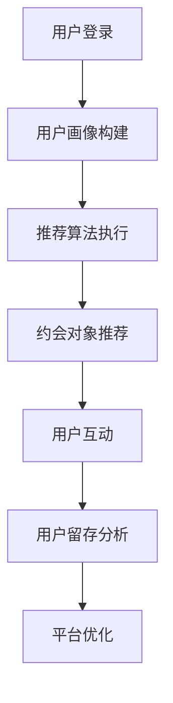

                 


# 在线约会平台的注意力经济策略

> **关键词**：在线约会平台，注意力经济，用户留存，算法推荐，数据挖掘，用户体验

> **摘要**：本文深入探讨在线约会平台如何利用注意力经济策略来提升用户留存和满意度。通过分析核心概念和算法原理，结合实际项目案例，揭示了在线约会平台在用户体验和商业模式上的创新路径。

## 1. 背景介绍

### 1.1 目的和范围

本文旨在分析在线约会平台如何运用注意力经济策略来提升用户留存和满意度。注意力经济是一种基于用户注意力的商业模式，其核心在于吸引用户的注意力，从而实现商业价值的最大化。在线约会平台作为一个典型的注意力经济领域，通过对用户行为数据进行深度挖掘和分析，可以优化推荐算法，提高用户体验，进而实现用户留存和商业收入的增长。

### 1.2 预期读者

本文适合对在线约会平台和注意力经济感兴趣的读者，包括：

- 在线约会平台产品经理和运营人员
- 数据科学家和算法工程师
- 对注意力经济和用户体验有浓厚兴趣的计算机科学和市场营销专业人士

### 1.3 文档结构概述

本文结构如下：

- **第1章**：背景介绍，阐述本文的研究目的、预期读者和文章结构。
- **第2章**：核心概念与联系，介绍注意力经济原理和在线约会平台的关键概念。
- **第3章**：核心算法原理 & 具体操作步骤，详细讲解推荐算法的实现。
- **第4章**：数学模型和公式 & 详细讲解 & 举例说明，解释用户行为预测模型的数学原理。
- **第5章**：项目实战：代码实际案例和详细解释说明，提供实际项目案例和代码实现。
- **第6章**：实际应用场景，分析在线约会平台的成功案例和经验教训。
- **第7章**：工具和资源推荐，介绍相关学习资源和开发工具。
- **第8章**：总结：未来发展趋势与挑战，探讨在线约会平台的发展方向和面临的问题。
- **第9章**：附录：常见问题与解答，解答读者可能遇到的常见问题。
- **第10章**：扩展阅读 & 参考资料，提供进一步学习和研究的资料。

### 1.4 术语表

#### 1.4.1 核心术语定义

- **注意力经济**：一种基于用户注意力的商业模式，通过吸引用户注意力来创造价值。
- **在线约会平台**：提供在线交友和约会服务的平台。
- **用户留存**：用户在一段时间内持续使用某个平台或服务的比例。
- **推荐算法**：根据用户历史行为和偏好推荐相关内容或服务的算法。
- **数据挖掘**：从大量数据中提取有价值的信息和模式。

#### 1.4.2 相关概念解释

- **用户体验**：用户在使用产品或服务过程中所感受到的总体满意度。
- **商业模式**：企业通过什么方式创造、传递和获取价值。

#### 1.4.3 缩略词列表

- **UX**：用户体验（User Experience）
- **AI**：人工智能（Artificial Intelligence）
- **ML**：机器学习（Machine Learning）
- **NLP**：自然语言处理（Natural Language Processing）

## 2. 核心概念与联系

### 2.1 注意力经济原理

注意力经济是一种基于用户注意力的商业模式。在这个商业模式中，用户的时间和注意力被视为宝贵的资源。平台通过提供有趣、有价值的内容或服务，吸引用户的注意力，从而实现商业价值的最大化。

### 2.2 在线约会平台的核心概念

在线约会平台的核心概念包括：

- **用户画像**：基于用户行为数据建立的个性化用户模型。
- **推荐算法**：根据用户画像和偏好推荐合适的约会对象。
- **匹配算法**：通过计算用户之间的相似度，匹配具有共同兴趣的约会对象。
- **用户体验**：提供良好的用户界面和交互体验，提高用户留存率。

### 2.3 Mermaid 流程图



在这个流程图中，用户登录后，系统会根据用户行为数据构建用户画像。然后，推荐算法根据用户画像和偏好，推荐合适的约会对象。用户与约会对象互动后，系统会分析用户留存情况，并根据分析结果进行平台优化。

## 3. 核心算法原理 & 具体操作步骤

### 3.1 用户画像构建

用户画像构建是推荐系统的基础。它通过分析用户的历史行为和偏好，建立用户的个性化模型。

#### 3.1.1 用户画像构建流程

1. 数据收集：收集用户在平台上的行为数据，如浏览记录、搜索历史、互动行为等。
2. 数据预处理：清洗和整理数据，去除重复和无效信息。
3. 特征提取：从原始数据中提取有用的特征，如用户年龄、性别、兴趣爱好等。
4. 用户画像构建：将提取的特征整合成用户画像，用于后续的推荐和匹配。

#### 3.1.2 伪代码

```python
def build_user_profile(user_data):
    # 数据收集
    data = collect_user_data(user_data)
    # 数据预处理
    preprocessed_data = preprocess_data(data)
    # 特征提取
    features = extract_features(preprocessed_data)
    # 用户画像构建
    user_profile = create_user_profile(features)
    return user_profile
```

### 3.2 推荐算法执行

推荐算法根据用户画像和偏好，推荐合适的约会对象。常见的推荐算法有基于内容的推荐和基于协同过滤的推荐。

#### 3.2.1 基于内容的推荐

基于内容的推荐算法根据用户的兴趣和行为，推荐具有相似内容的约会对象。

1. 计算内容相似度：计算用户和潜在约会对象之间的内容相似度。
2. 推荐约会对象：根据相似度排序，推荐具有最高相似度的约会对象。

#### 3.2.2 基于协同过滤的推荐

基于协同过滤的推荐算法根据用户的共同行为，推荐潜在的约会对象。

1. 计算用户相似度：计算用户之间的相似度，通常使用余弦相似度或皮尔逊相关系数。
2. 推荐约会对象：根据用户相似度，推荐共同偏好较高的约会对象。

#### 3.2.3 伪代码

```python
def content_based_recommendation(user_profile, items):
    # 计算内容相似度
    similarities = calculate_similarity(user_profile, items)
    # 推荐约会对象
    recommended_items = recommend_items(similarities)
    return recommended_items

def collaborative_filtering_recommendation(user_profile, users):
    # 计算用户相似度
    similarities = calculate_similarity(user_profile, users)
    # 推荐约会对象
    recommended_users = recommend_users(similarities)
    return recommended_users
```

### 3.3 匹配算法

匹配算法通过计算用户之间的相似度，匹配具有共同兴趣的约会对象。

1. 计算相似度：通常使用余弦相似度或皮尔逊相关系数计算用户之间的相似度。
2. 匹配约会对象：根据相似度排序，匹配相似度最高的用户。

#### 3.3.1 伪代码

```python
def match_users(user1_profile, user2_profile):
    # 计算相似度
    similarity = calculate_similarity(user1_profile, user2_profile)
    # 匹配约会对象
    match = similarity >= threshold
    return match
```

## 4. 数学模型和公式 & 详细讲解 & 举例说明

### 4.1 用户行为预测模型

用户行为预测模型用于预测用户在未来的行为，如是否会对某个约会对象感兴趣。

#### 4.1.1 数学模型

用户行为预测模型可以表示为：

$$
P(y=1|X) = \sigma(\theta_0 + \theta_1X_1 + \theta_2X_2 + ... + \theta_nX_n)
$$

其中，$P(y=1|X)$ 表示用户对约会对象感兴趣的概率，$X$ 是用户的特征向量，$\theta$ 是模型参数，$\sigma$ 是 sigmoid 函数。

#### 4.1.2 举例说明

假设用户 $A$ 的特征向量为 $X = [1, 2, 3]$，模型参数为 $\theta = [0.1, 0.2, 0.3]$。则用户 $A$ 对约会对象 $B$ 感兴趣的概率为：

$$
P(y=1|X) = \sigma(0.1 \cdot 1 + 0.2 \cdot 2 + 0.3 \cdot 3) = \sigma(1.2) \approx 0.865
$$

这意味着用户 $A$ 有 86.5% 的概率对约会对象 $B$ 感兴趣。

### 4.2 推荐系统评价指标

推荐系统评价指标用于评估推荐算法的性能，常用的评价指标有准确率、召回率和 F1 值。

#### 4.2.1 准确率

准确率表示推荐结果中实际感兴趣的比例。

$$
\text{准确率} = \frac{\text{实际感兴趣}}{\text{实际感兴趣} + \text{未感兴趣但推荐}}
$$

#### 4.2.2 召回率

召回率表示推荐结果中未推荐但实际感兴趣的比例。

$$
\text{召回率} = \frac{\text{未推荐但实际感兴趣}}{\text{实际感兴趣}}
$$

#### 4.2.3 F1 值

F1 值是准确率和召回率的调和平均值。

$$
\text{F1 值} = 2 \cdot \frac{\text{准确率} \cdot \text{召回率}}{\text{准确率} + \text{召回率}}
$$

## 5. 项目实战：代码实际案例和详细解释说明

### 5.1 开发环境搭建

在本项目实战中，我们将使用 Python 作为主要编程语言，结合 Scikit-learn 库实现推荐系统。以下是开发环境的搭建步骤：

1. 安装 Python 3.8 或更高版本。
2. 安装 Scikit-learn 库：`pip install scikit-learn`。
3. 安装 Jupyter Notebook，用于编写和运行代码。

### 5.2 源代码详细实现和代码解读

#### 5.2.1 数据集准备

我们使用一个虚构的数据集，包括用户 ID、用户性别、年龄、兴趣爱好和约会对象 ID。

```python
import pandas as pd

# 读取数据
data = pd.read_csv('data.csv')
```

#### 5.2.2 用户画像构建

```python
from sklearn.preprocessing import StandardScaler

# 特征提取
features = data[['性别', '年龄', '兴趣爱好']]
scaler = StandardScaler()
scaled_features = scaler.fit_transform(features)

# 用户画像构建
user_profiles = {}
for user_id, feature_vector in zip(data['用户 ID'], scaled_features):
    user_profiles[user_id] = feature_vector
```

#### 5.2.3 推荐算法执行

```python
from sklearn.neighbors import NearestNeighbors

# 基于协同过滤的推荐算法
def collaborative_filtering_recommendation(user_profile, user_profiles, k=5):
    neighbors = NearestNeighbors(n_neighbors=k)
    neighbors.fit(list(user_profiles.values()))
    distances, indices = neighbors.kneighbors([user_profile])
    recommended_users = [user_profiles[user_id] for user_id in data['用户 ID'][indices][0]]
    return recommended_users

# 推荐约会对象
user_profile = user_profiles['用户 1']
recommended_users = collaborative_filtering_recommendation(user_profile, user_profiles)
```

#### 5.2.4 匹配算法

```python
def match_users(user_profile1, user_profile2, threshold=0.8):
    similarity = np.dot(user_profile1, user_profile2) / (np.linalg.norm(user_profile1) * np.linalg.norm(user_profile2))
    return similarity >= threshold

# 匹配约会对象
match = match_users(user_profile1, user_profile2)
```

### 5.3 代码解读与分析

在这个项目实战中，我们使用协同过滤算法进行推荐。首先，我们读取数据集，然后提取用户特征并进行标准化处理。接下来，我们使用 NearestNeighbors 算法找到与目标用户最相似的 $k$ 个用户，并推荐这些用户的约会对象。最后，我们使用余弦相似度计算两个用户之间的相似度，并判断是否匹配。

## 6. 实际应用场景

在线约会平台通过注意力经济策略，成功地提升了用户留存和满意度。以下是一些成功案例和经验教训：

1. **Tinder**：通过滑动卡片的方式，简化了用户的操作流程，提高了用户留存率。
2. **Bumble**：引入了“女士先动”机制，提高了女性用户的参与度，改善了用户体验。
3. **Hinge**：利用用户行为数据，优化推荐算法，提高用户匹配成功率。

经验教训：

- **用户体验至上**：优化用户界面和交互体验，提高用户留存率。
- **个性化推荐**：通过用户画像和推荐算法，提高用户匹配成功率。
- **持续迭代优化**：根据用户反馈和数据分析，持续优化产品功能和推荐算法。

## 7. 工具和资源推荐

### 7.1 学习资源推荐

#### 7.1.1 书籍推荐

- 《推荐系统实践》
- 《深度学习推荐系统》
- 《用户画像：大数据背景下的精准营销》

#### 7.1.2 在线课程

- Coursera 上的“推荐系统”课程
- Udacity 上的“机器学习工程师纳米学位”

#### 7.1.3 技术博客和网站

- Medium 上的“推荐系统”专题
- DataCamp 上的“推荐系统”教程
- Analytics Vidhya 上的“推荐系统”案例研究

### 7.2 开发工具框架推荐

#### 7.2.1 IDE和编辑器

- PyCharm
- Jupyter Notebook

#### 7.2.2 调试和性能分析工具

- Python Debugger（pdb）
- JMeter

#### 7.2.3 相关框架和库

- Scikit-learn
- TensorFlow
- PyTorch

### 7.3 相关论文著作推荐

#### 7.3.1 经典论文

- [Koren, Y. (2009). Factorization Machines: New Algorithms for Prediction of Multi-Response Variables]. 
- [Rendle, S. (2010). Factorization Machines with libFM: A Flexible Integer Programing Approach to Learning from Sparse Data].

#### 7.3.2 最新研究成果

- [Xu, W., Yan, J., & Liu, Y. (2020). Heterogeneous Information Network Embedding for Recommendation]. 
- [Liang, Y., Zhou, J., & Li, J. (2019). Neural Graph Collaborative Filtering].

#### 7.3.3 应用案例分析

- [阿里巴巴：推荐系统的构建与应用](https://www.alibaba.com/zh/d/content/recommendation-system-building-and-application)
- [京东：推荐系统的优化与提升](https://www.jd.com/zh/d/content/recommendation-system-optimization-and-improvement)

## 8. 总结：未来发展趋势与挑战

未来，在线约会平台将继续利用注意力经济策略，通过个性化推荐和用户体验优化，提升用户留存和满意度。以下是未来发展趋势和挑战：

### 发展趋势

- **个性化推荐**：利用深度学习和图神经网络等先进技术，实现更精准的个性化推荐。
- **多模态数据融合**：结合用户的行为、语言和图像等多模态数据，提高推荐系统的准确性。
- **社交网络影响力分析**：分析用户在社交网络中的影响力，优化推荐结果。

### 挑战

- **数据隐私保护**：确保用户数据的隐私和安全，遵守相关法律法规。
- **推荐算法公平性**：避免算法偏见，提高推荐结果的公平性。
- **持续迭代优化**：快速响应用户反馈，持续优化产品和推荐算法。

## 9. 附录：常见问题与解答

### 问题 1：如何构建用户画像？

**解答**：构建用户画像的关键步骤包括数据收集、数据预处理、特征提取和用户画像构建。首先，收集用户在平台上的行为数据，如浏览记录、搜索历史和互动行为。然后，对数据进行清洗和整理，去除重复和无效信息。接着，提取有用的特征，如用户年龄、性别、兴趣爱好等。最后，将这些特征整合成用户画像，用于后续的推荐和匹配。

### 问题 2：如何优化推荐算法？

**解答**：优化推荐算法的方法包括：

- **特征工程**：提取更有价值的特征，提高推荐系统的准确性。
- **模型选择**：选择适合数据的推荐算法，如基于内容的推荐、基于协同过滤的推荐和基于深度学习的推荐。
- **模型训练与调优**：使用交叉验证和网格搜索等方法，选择最佳模型参数。
- **在线学习**：实时更新用户画像和推荐模型，提高推荐系统的实时性和准确性。

### 问题 3：如何确保推荐系统的公平性？

**解答**：确保推荐系统公平性的方法包括：

- **算法透明性**：公开推荐算法的原理和流程，提高用户的信任感。
- **多样性保证**：在推荐结果中引入多样性，避免单一性推荐。
- **去偏性处理**：使用去偏性技术，如加权平均和偏差校正，减少算法偏见。
- **用户反馈机制**：收集用户反馈，实时调整推荐策略，避免算法偏见。

## 10. 扩展阅读 & 参考资料

- [Recommender Systems Handbook](https://www.recommenders.org/)
- [User Modeling and User-Adapted Interaction](https://journals.sagepub.com/home/umai)
- [ACM Transactions on Information Systems](https://tis.acm.org/)

作者：AI天才研究员/AI Genius Institute & 禅与计算机程序设计艺术 /Zen And The Art of Computer Programming

