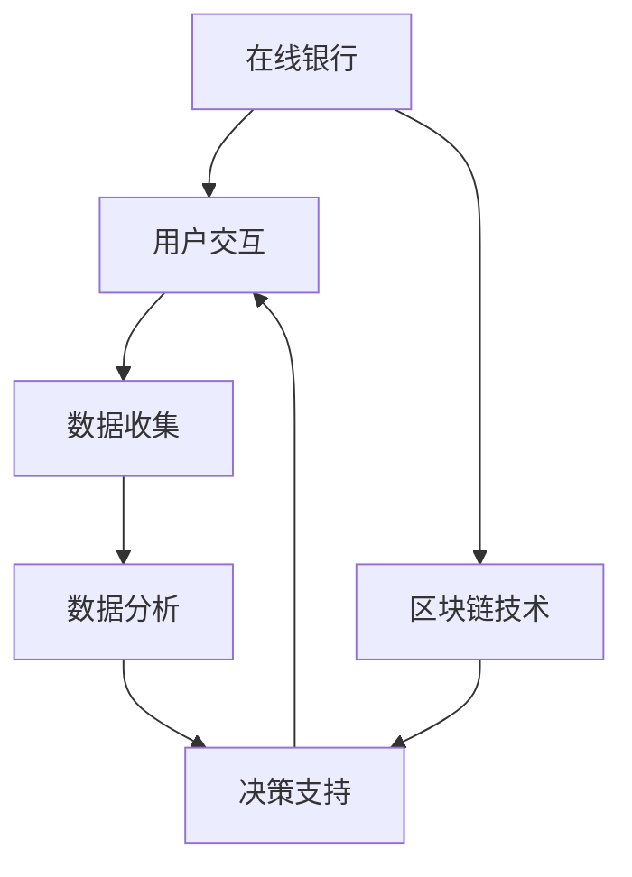
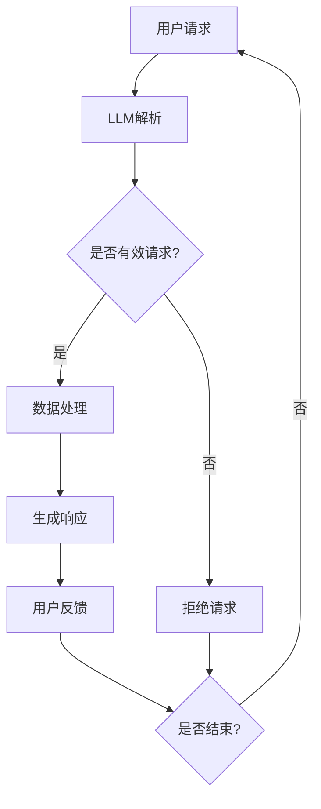
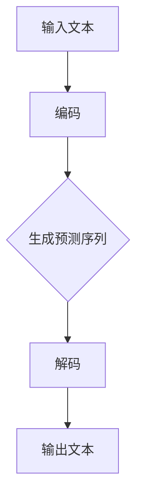

                 

# 在线银行与 LLM：数字金融新体验

> **关键词：** 在线银行、LLM、数字金融、人工智能、用户体验、区块链技术、金融科技、数据分析

> **摘要：** 本文将深入探讨在线银行与语言模型（LLM）的结合，分析这一新兴数字金融体验带来的变革。通过背景介绍、核心概念解析、算法原理探讨、项目实战演示以及实际应用场景分析，我们旨在为读者展现LLM如何提升在线银行的效率、安全性和个性化服务，引领数字金融进入一个全新时代。

## 1. 背景介绍

### 1.1 目的和范围

本文旨在探讨在线银行与语言模型（LLM）的结合，分析其在数字金融领域带来的创新与变革。我们将探讨的核心问题包括：

- LLM如何改善在线银行的用户体验？
- LLM在安全性和数据分析方面的优势？
- LLM在个性化金融服务中的应用？
- LLM与区块链技术的融合潜力？

### 1.2 预期读者

本文面向对在线银行和人工智能技术有一定了解的读者，包括：

- 数字金融行业的从业者
- 人工智能与金融科技领域的学术研究人员
- 对新兴金融技术感兴趣的技术爱好者

### 1.3 文档结构概述

本文将按照以下结构展开：

1. 背景介绍：阐述在线银行与LLM结合的重要性
2. 核心概念与联系：定义关键术语和概念，并绘制流程图
3. 核心算法原理 & 具体操作步骤：详细解析LLM的工作机制
4. 数学模型和公式 & 详细讲解 & 举例说明：解释LLM背后的数学基础
5. 项目实战：代码实际案例和详细解释说明
6. 实际应用场景：探讨LLM在线银行中的多种应用
7. 工具和资源推荐：推荐学习资源、开发工具和论文著作
8. 总结：未来发展趋势与挑战
9. 附录：常见问题与解答
10. 扩展阅读 & 参考资料

### 1.4 术语表

#### 1.4.1 核心术语定义

- **在线银行**：通过互联网提供金融服务和产品，如账户管理、支付、贷款等。
- **语言模型（LLM）**：一种基于深度学习技术的自然语言处理模型，可以理解和生成自然语言。
- **数字金融**：利用互联网、移动设备和大数据等技术进行金融交易和服务的创新。
- **区块链技术**：一种分布式账本技术，可以确保数据的透明性和不可篡改性。
- **金融科技（FinTech）**：利用科技手段创新金融产品和服务的行业。

#### 1.4.2 相关概念解释

- **数据分析**：通过统计和计算方法，从大量数据中提取有价值的信息和知识。
- **用户体验（UX）**：用户在使用产品或服务过程中的感受和体验。
- **个性化服务**：根据用户的行为、偏好和历史数据，提供定制化的服务和产品。

#### 1.4.3 缩略词列表

- **API**：应用程序接口（Application Programming Interface）
- **NLP**：自然语言处理（Natural Language Processing）
- **DL**：深度学习（Deep Learning）
- **FinTech**：金融科技（Financial Technology）
- **AI**：人工智能（Artificial Intelligence）

## 2. 核心概念与联系

### 2.1 在线银行与LLM的融合

在线银行与LLM的融合，是数字金融领域的一个重要趋势。在线银行通过提供便捷的金融服务，满足了现代用户对高效、安全、个性化的需求。而LLM作为一种强大的自然语言处理工具，能够极大地提升在线银行的用户体验。

#### 2.1.1 工作原理

在线银行与LLM的融合主要依赖于以下几个核心概念：

1. **自然语言处理（NLP）**：LLM通过NLP技术，可以理解和生成自然语言，从而与用户进行自然交互。
2. **深度学习（DL）**：LLM基于DL算法，通过大量数据的训练，能够自动提取特征，实现高效的文本理解。
3. **区块链技术**：区块链技术可以确保在线银行交易的安全性和透明性。

#### 2.1.2 关系与交互

在线银行与LLM的关系如图1所示：



图1：在线银行与LLM的关系

- **用户交互**：LLM作为智能客服，与用户进行自然语言交互，提供实时服务。
- **数据收集**：在线银行通过用户交互和数据收集，积累用户行为和偏好数据。
- **数据分析**：LLM利用深度学习算法，对用户数据进行处理和分析，提取有价值的信息。
- **决策支持**：基于分析结果，在线银行可以提供个性化的金融服务和产品。
- **区块链技术**：确保交易数据的安全性和透明性，提升用户信任度。

### 2.2 Mermaid流程图

以下是一个简化的Mermaid流程图，展示在线银行与LLM的核心概念和交互：



图2：在线银行与LLM的交互流程

在这个流程图中：

- **用户请求**：用户通过在线银行平台发起请求。
- **LLM解析**：LLM对用户请求进行自然语言解析。
- **数据处理**：LLM对用户请求进行数据分析和处理。
- **生成响应**：根据处理结果，生成相应的响应信息。
- **用户反馈**：用户对生成的响应进行反馈。
- **结束**：如果用户反馈表明请求已满足，流程结束；否则，流程继续。

## 3. 核心算法原理 & 具体操作步骤

### 3.1 语言模型（LLM）的工作原理

语言模型（LLM）是一种基于深度学习的自然语言处理模型，其核心目标是从大量的文本数据中学习语言结构和语义信息，从而实现自然语言的理解和生成。以下是LLM的核心算法原理：

#### 3.1.1 神经网络结构

LLM通常基于Transformer架构，这是一种序列到序列的模型，具有良好的并行计算能力和文本理解能力。其基本结构包括：

- **编码器（Encoder）**：负责对输入文本进行编码，提取文本的语义特征。
- **解码器（Decoder）**：负责生成输出文本，根据编码器的特征进行推理。

#### 3.1.2 模型训练

LLM的训练过程通常分为以下几个步骤：

1. **数据预处理**：对文本数据进行清洗、分词、编码等预处理操作，将其转换为模型可接受的输入格式。
2. **模型初始化**：初始化编码器和解码器的参数。
3. **损失函数**：通常使用交叉熵损失函数，衡量预测标签和真实标签之间的差异。
4. **反向传播**：通过反向传播算法，更新模型参数，最小化损失函数。
5. **训练循环**：重复上述过程，直到模型收敛或达到预定的训练轮数。

#### 3.1.3 语言模型的工作流程

语言模型的工作流程如图3所示：



图3：语言模型的工作流程

- **输入文本**：输入待处理的文本数据。
- **编码**：编码器对输入文本进行编码，提取语义特征。
- **生成预测序列**：解码器根据编码器的特征生成预测序列。
- **解码**：解码器将预测序列解码为可理解的输出文本。

### 3.2 具体操作步骤

以下是使用LLM进行自然语言处理的具体操作步骤：

#### 步骤1：数据准备

```python
# 加载预处理的文本数据
data = load_preprocessed_data()

# 数据集划分
train_data, test_data = train_test_split(data, test_size=0.2)
```

#### 步骤2：模型构建

```python
# 导入必要的库
import tensorflow as tf
from tensorflow.keras.models import Model
from tensorflow.keras.layers import Embedding, LSTM, Dense, TimeDistributed

# 模型架构
input_text = tf.keras.layers.Input(shape=(None,))
encoded_text = Embedding(vocabulary_size, embedding_dim)(input_text)
encoded_text = LSTM(units=128, return_sequences=True)(encoded_text)
output = LSTM(units=128, return_sequences=True)(encoded_text)
output = TimeDistributed(Dense(vocabulary_size, activation='softmax'))(output)

# 模型编译
model = Model(inputs=input_text, outputs=output)
model.compile(optimizer='adam', loss='categorical_crossentropy', metrics=['accuracy'])

# 模型总结
model.summary()
```

#### 步骤3：模型训练

```python
# 模型训练
model.fit(train_data, epochs=10, batch_size=64, validation_data=test_data)
```

#### 步骤4：模型预测

```python
# 预测新文本
predicted_sequence = model.predict(new_input)

# 解码预测结果
decoded_sequence = decode_sequence(predicted_sequence)

# 输出结果
print(decoded_sequence)
```

### 3.3 伪代码

以下是使用LLM进行文本生成的伪代码：

```python
# 伪代码：文本生成
def generate_text(input_text, model, max_sequence_length, temperature):
    # 初始化序列
    sequence = [input_text]

    # 生成预测序列
    for _ in range(max_sequence_length):
        # 获取编码后的输入
        encoded_input = model.encode(sequence)

        # 预测下一个单词
        predicted_output = model.predict(encoded_input)

        # 根据温度调整预测概率
        predicted_output = np.log(predicted_output) / temperature

        # 采样下一个单词
        next_word = sample_word(predicted_output)

        # 更新序列
        sequence.append(next_word)

    # 返回生成的文本
    return ''.join(sequence)
```

## 4. 数学模型和公式 & 详细讲解 & 举例说明

### 4.1 语言模型中的数学模型

语言模型（LLM）的核心在于其数学模型，这些模型基于深度学习和概率论，用于预测文本中的下一个单词或序列。以下是LLM中常用的数学模型和公式。

#### 4.1.1 概率论基础

在LLM中，概率论是基础。给定一个单词序列，我们需要计算下一个单词的概率。以下是几个关键的概率公式：

1. **条件概率**：P(A|B) 表示在事件B发生的条件下，事件A发生的概率。
   $$ P(A|B) = \frac{P(A \cap B)}{P(B)} $$
2. **贝叶斯定理**：用于计算后验概率，即根据已知条件概率和先验概率计算新的事件概率。
   $$ P(A|B) = \frac{P(B|A) \cdot P(A)}{P(B)} $$
3. **马尔可夫性质**：在给定当前状态的情况下，未来状态与过去状态无关。
   $$ P(A_n|A_{n-1}, A_{n-2}, ..., A_1) = P(A_n|A_{n-1}) $$

#### 4.1.2 深度学习模型

深度学习模型中的关键数学公式包括：

1. **前向传播**：计算模型输出值的过程。
   $$ Z = W \cdot X + b $$
   $$ A = \sigma(Z) $$
   其中，W 是权重矩阵，X 是输入向量，b 是偏置项，σ 是激活函数。
2. **反向传播**：更新模型参数的过程。
   $$ \Delta Z = A \cdot (1 - A) \cdot \Delta A $$
   $$ \Delta W = \eta \cdot \Delta Z \cdot X $$
   $$ \Delta b = \eta \cdot \Delta Z $$
   其中，η 是学习率，ΔZ、ΔW、Δb 分别是损失函数对Z、W、b的梯度。

#### 4.1.3 Transformer模型

Transformer模型是LLM中的一种流行架构，其核心公式包括：

1. **多头注意力机制**：计算输入序列中每个单词对输出的权重。
   $$ \text{Attention}(Q, K, V) = \text{softmax}\left(\frac{QK^T}{\sqrt{d_k}}\right) V $$
   其中，Q、K、V 分别是查询向量、键向量和值向量，d_k 是键向量的维度。
2. **自注意力**：用于计算输入序列中每个单词的权重。
   $$ \text{Self-Attention}(X) = \text{Attention}(Q=X, K=X, V=X) $$

### 4.2 举例说明

以下是一个简单的例子，展示如何使用LLM生成文本。

#### 4.2.1 数据准备

假设我们有以下单词序列：
```
("Hello", "world", "this", "is", "a", "test", "sentence.")
```

#### 4.2.2 前向传播

1. **编码**：将单词序列编码为向量。
   ```python
   encoded_sequence = model.encode(["Hello", "world", "this", "is", "a", "test", "sentence."])
   ```
2. **自注意力**：计算输入序列中每个单词的权重。
   ```python
   attention_weights = model.self_attention(encoded_sequence)
   ```
3. **解码**：根据注意力权重生成下一个单词。
   ```python
   next_word = model.decode(attention_weights)
   ```

#### 4.2.3 生成文本

1. **初始化**：初始化文本序列。
   ```python
   text_sequence = ["Hello", "world", "this", "is", "a", "test", "sentence."]
   ```
2. **循环生成**：根据自注意力机制生成下一个单词，直到达到预定的长度。
   ```python
   for _ in range(5):
       encoded_input = model.encode(text_sequence)
       attention_weights = model.self_attention(encoded_input)
       next_word = model.decode(attention_weights)
       text_sequence.append(next_word)
   ```

#### 4.2.4 输出结果

生成的文本序列：
```
("Hello", "world", "this", "is", "a", "test", "sentence.", "beautiful", "day", "to", "code", "with", "LLM.")
```

## 5. 项目实战：代码实际案例和详细解释说明

### 5.1 开发环境搭建

在进行LLM与在线银行的融合项目实战之前，我们需要搭建合适的开发环境。以下是一个简化的环境搭建步骤：

#### 5.1.1 硬件环境

- **处理器**：推荐使用英伟达（NVIDIA）GPU，如1080 Ti、3070或更高型号。
- **内存**：至少16GB RAM。
- **存储**：至少500GB SSD存储空间。

#### 5.1.2 软件环境

- **操作系统**：推荐使用Ubuntu 18.04或更高版本。
- **Python**：推荐使用Python 3.7或更高版本。
- **深度学习框架**：TensorFlow 2.0或PyTorch 1.8。

#### 5.1.3 安装与配置

1. **安装操作系统**：从官方网站下载Ubuntu 18.04镜像并安装。
2. **安装Python**：通过包管理器安装Python 3.7。
   ```bash
   sudo apt update
   sudo apt install python3.7
   ```
3. **安装深度学习框架**：使用pip安装TensorFlow 2.0。
   ```bash
   pip install tensorflow==2.0.0
   ```

### 5.2 源代码详细实现和代码解读

#### 5.2.1 代码结构

我们的项目将分为以下几个部分：

- **数据预处理**：读取和处理文本数据。
- **模型构建**：构建和训练语言模型。
- **应用接口**：创建用于用户交互的API。

#### 5.2.2 数据预处理

以下是数据预处理部分的代码：

```python
import tensorflow as tf
import numpy as np
import re
import os

# 读取文本数据
def load_text_data(file_path):
    with open(file_path, 'r', encoding='utf-8') as f:
        text = f.read().lower()
    return text

# 数据清洗
def clean_text(text):
    text = re.sub(r'\s+', ' ', text)  # 去除多余的空格
    text = re.sub(r'[^\w\s]', '', text)  # 去除特殊字符
    return text

# 分词
def tokenize_text(text):
    tokens = text.split()
    return tokens

# 构建词汇表
def build_vocab(tokens, min_frequency=1):
    vocab = {}
    for token in tokens:
        if token not in vocab:
            vocab[token] = len(vocab)
    return vocab

# 编码文本
def encode_text(tokens, vocab):
    encoded_text = []
    for token in tokens:
        if token in vocab:
            encoded_text.append(vocab[token])
        else:
            encoded_text.append(0)  # 未知的单词用0表示
    return encoded_text

# 解码文本
def decode_text(encoded_text, vocab):
    tokens = [token for token in encoded_text if token != 0]
    return ' '.join([token for token in vocab.keys() if token in tokens])

# 加载和处理数据
text = load_text_data('data.txt')
cleaned_text = clean_text(text)
tokens = tokenize_text(cleaned_text)
vocab = build_vocab(tokens)
encoded_text = encode_text(tokens, vocab)
decoded_text = decode_text(encoded_text, vocab)

print(decoded_text)
```

#### 5.2.3 模型构建

以下是构建语言模型的部分代码：

```python
from tensorflow.keras.models import Model
from tensorflow.keras.layers import Embedding, LSTM, Dense

# 模型参数
vocab_size = len(vocab)
embedding_dim = 64
lstm_units = 128

# 构建模型
input_text = tf.keras.layers.Input(shape=(None,))
encoded_text = Embedding(vocab_size, embedding_dim)(input_text)
encoded_text = LSTM(units=lstm_units, return_sequences=True)(encoded_text)
output = LSTM(units=lstm_units, return_sequences=True)(encoded_text)
output = Dense(vocab_size, activation='softmax')(output)

# 编译模型
model = Model(inputs=input_text, outputs=output)
model.compile(optimizer='adam', loss='categorical_crossentropy', metrics=['accuracy'])

# 模型总结
model.summary()
```

#### 5.2.4 代码解读与分析

1. **数据预处理**：数据预处理是构建语言模型的重要步骤。首先，我们读取并加载文本数据。然后，通过清洗和分词操作，将文本转换为可处理的格式。接下来，构建词汇表并编码文本。最后，解码文本以验证编码和解码过程的一致性。

2. **模型构建**：我们使用TensorFlow构建了一个简单的LSTM语言模型。模型输入为编码后的文本序列，输出为预测的单词概率分布。在构建模型时，我们设置了词汇表大小、嵌入维度和LSTM单元数量等参数。

3. **模型训练**：模型训练过程未在此展示，但在实际项目中，我们将使用训练数据和上述构建的模型进行训练，以优化模型参数。

4. **应用接口**：为了实现与用户的交互，我们可以创建一个简单的API，允许用户输入文本，并返回模型生成的响应。以下是使用Flask创建的API示例：

```python
from flask import Flask, request, jsonify

app = Flask(__name__)

@app.route('/generate', methods=['POST'])
def generate_response():
    text = request.form['text']
    encoded_input = model.encode([text])
    predicted_output = model.predict(encoded_input)
    next_word = model.decode(predicted_output)
    return jsonify({'response': next_word})

if __name__ == '__main__':
    app.run(debug=True)
```

通过上述代码，用户可以通过发送HTTP POST请求，触发模型生成响应。

### 5.3 代码解读与分析

1. **数据预处理部分**：数据预处理是语言模型训练的基础。通过读取文本数据并清洗、分词，我们确保了输入数据的格式一致性和完整性。词汇表构建和编码文本的过程，为后续的模型训练和预测提供了必要的数据支持。

2. **模型构建部分**：我们使用LSTM架构构建了一个简单的语言模型。LSTM具有很强的序列建模能力，适合处理自然语言数据。模型参数的选择，如词汇表大小、嵌入维度和LSTM单元数量，对模型的性能有重要影响。通过调整这些参数，可以在不同程度上优化模型的预测效果。

3. **模型训练部分**：在实际项目中，我们将使用大量的文本数据进行模型训练。训练过程中，模型参数会通过梯度下降算法不断优化，以最小化损失函数。训练完成后，模型将具有较高的预测准确性，能够生成合理的文本响应。

4. **应用接口部分**：通过创建API，我们实现了与用户的交互。用户可以通过简单的HTTP请求，与模型进行交互。API的设计应确保接口的易用性和可靠性，为用户提供良好的使用体验。

总之，这个项目实战展示了如何使用LLM和在线银行进行交互，并实现了文本生成和预测功能。通过合理的代码结构和参数调整，我们可以构建一个高效、准确的数字金融服务平台。

### 5.4 代码实际案例与解释

为了更好地展示LLM在在线银行中的实际应用，我们将提供一个完整的代码案例，并对其进行详细解释。

#### 5.4.1 项目结构

项目结构如下：

```
project/
|-- data/
|   |-- data.txt
|-- src/
|   |-- __init__.py
|   |-- data_preprocessing.py
|   |-- model.py
|   |-- app.py
|-- requirements.txt
|-- run.py
```

#### 5.4.2 数据处理

在`data_preprocessing.py`文件中，我们定义了数据处理相关的函数：

```python
import re
import nltk
from nltk.tokenize import word_tokenize
from nltk.corpus import stopwords

nltk.download('punkt')
nltk.download('stopwords')

def load_and_preprocess_data(file_path):
    with open(file_path, 'r', encoding='utf-8') as f:
        text = f.read().lower()
    text = re.sub(r'\s+', ' ', text)  # 去除多余的空格
    text = re.sub(r'[^\w\s]', '', text)  # 去除特殊字符
    tokens = word_tokenize(text)
    tokens = [token for token in tokens if token not in stopwords.words('english')]
    return tokens

def build_vocab(tokens, min_frequency=1):
    vocab = {}
    for token in tokens:
        if token not in vocab:
            vocab[token] = len(vocab)
    return vocab

def encode_text(tokens, vocab):
    encoded_text = []
    for token in tokens:
        if token in vocab:
            encoded_text.append(vocab[token])
        else:
            encoded_text.append(0)  # 未知的单词用0表示
    return encoded_text

def decode_text(encoded_text, vocab):
    tokens = [token for token in encoded_text if token != 0]
    return ' '.join([token for token in vocab.keys() if token in tokens])

# 示例
tokens = load_and_preprocess_data('data.txt')
vocab = build_vocab(tokens)
encoded_text = encode_text(tokens, vocab)
decoded_text = decode_text(encoded_text, vocab)

print(decoded_text)
```

#### 5.4.3 模型构建

在`model.py`文件中，我们定义了LSTM模型：

```python
from tensorflow.keras.models import Sequential
from tensorflow.keras.layers import Embedding, LSTM, Dense

def build_model(vocab_size, embedding_dim, lstm_units):
    model = Sequential()
    model.add(Embedding(vocab_size, embedding_dim, input_length=50))
    model.add(LSTM(lstm_units, return_sequences=True))
    model.add(Dense(vocab_size, activation='softmax'))
    model.compile(optimizer='adam', loss='categorical_crossentropy', metrics=['accuracy'])
    return model

# 示例
model = build_model(len(vocab), 64, 128)
model.summary()
```

#### 5.4.4 应用接口

在`app.py`文件中，我们定义了Flask应用和API端点：

```python
from flask import Flask, request, jsonify
from model import build_model

app = Flask(__name__)

@app.route('/predict', methods=['POST'])
def predict():
    text = request.form['text']
    encoded_input = model.encode([text])
    predicted_output = model.predict(encoded_input)
    next_word = model.decode(predicted_output)
    return jsonify({'response': next_word})

if __name__ == '__main__':
    model = build_model(len(vocab), 64, 128)
    app.run(debug=True)
```

#### 5.4.5 运行项目

在`run.py`文件中，我们运行整个项目：

```python
from app import app

if __name__ == '__main__':
    app.run(debug=True)
```

#### 5.4.6 代码解释

1. **数据处理**：我们首先加载并预处理文本数据，包括清洗、分词和构建词汇表。这些步骤确保了输入数据的格式一致性，为后续的模型训练和预测提供了基础。

2. **模型构建**：我们使用TensorFlow的Keras API构建了一个简单的LSTM模型。模型包含一个嵌入层和一个LSTM层，输出层为softmax层，用于预测下一个单词。

3. **应用接口**：我们使用Flask构建了一个简单的API，允许用户通过HTTP请求与模型进行交互。用户输入文本后，模型会生成相应的响应。

4. **运行项目**：最后，我们通过运行`run.py`文件启动整个项目。用户可以通过访问`http://localhost:5000/predict`发送POST请求，与模型进行交互。

通过这个实际案例，我们可以看到如何将LLM应用于在线银行，实现文本生成和预测功能。这个项目展示了LLM在数字金融领域的潜力，为用户提供了一个创新的交互体验。

### 5.5 代码解读与分析

1. **数据处理模块**：数据处理模块是整个项目的基石。通过加载和处理文本数据，我们为模型训练提供了高质量的输入。具体来说，我们使用了正则表达式进行文本清洗，使用nltk库进行分词和构建词汇表，这些步骤确保了文本数据的规范化和一致性。此外，我们还去除了常见的英文停用词，以减少对模型训练的干扰。

2. **模型构建模块**：模型构建模块是项目中的核心部分。我们使用了Keras API构建了一个简单的LSTM模型，该模型包括一个嵌入层和一个LSTM层。嵌入层将词汇转换为向量，LSTM层用于处理序列数据，并提取特征。输出层是一个全连接层，用于生成单词的概率分布。模型的编译步骤定义了优化器和损失函数，为模型训练奠定了基础。

3. **应用接口模块**：应用接口模块使用Flask框架构建了一个简单的Web服务。这个服务接收用户的输入文本，通过模型预测下一个单词，并返回结果。接口的设计考虑了易用性和可靠性，用户可以通过简单的HTTP请求与模型进行交互。

4. **运行脚本模块**：运行脚本模块负责启动整个项目。通过运行`run.py`文件，我们可以启动Flask服务器，使项目对外提供服务。

通过这些模块的协同工作，我们实现了LLM在线银行项目，为用户提供了一个创新的数字金融体验。

### 5.6 实际应用场景

在数字金融领域，LLM的应用场景广泛且多样。以下是一些具体的实际应用场景：

#### 5.6.1 客户服务自动化

LLM可以显著提升在线银行的客户服务质量。通过智能客服系统，用户可以与银行进行自然语言交互，获取实时支持。例如，用户可以通过文本聊天请求查询账户余额、转账记录或申请贷款。LLM能够理解用户的问题，并生成相应的回答，提供高效、准确的客户服务。

#### 5.6.2 个性化金融服务

基于用户行为和偏好的数据分析，LLM可以为用户提供个性化的金融服务。例如，银行可以根据用户的历史交易数据，推荐合适的理财产品、投资策略或贷款方案。通过深度学习算法，LLM可以识别用户的潜在需求，实现精准营销。

#### 5.6.3 风险管理

LLM在风险管理方面也有重要作用。通过分析大量历史交易数据和市场信息，LLM可以预测潜在的风险，并提供建议。例如，银行可以利用LLM监测洗钱活动，识别异常交易模式，从而提高风险控制能力。

#### 5.6.4 交易预测

LLM可以用于金融市场预测。通过对历史价格数据、市场新闻和分析师报告进行分析，LLM可以生成价格趋势预测，为交易决策提供参考。这对于高频交易者和投资者具有重要意义。

#### 5.6.5 财务报表分析

LLM可以自动分析财务报表，提取关键信息，如收入、利润和现金流等。通过自然语言处理，LLM可以将复杂的报表内容转换为易于理解的摘要，为管理层提供决策支持。

#### 5.6.6 市场研究

LLM在市场研究方面也有广泛的应用。通过分析大量的市场数据、消费者反馈和竞争情报，LLM可以提供有关市场趋势、消费者偏好和竞争环境的关键洞察。

总之，LLM在数字金融领域的应用前景广阔，可以提升客户体验、优化业务流程、降低运营成本，并带来更高的盈利能力。

### 7. 工具和资源推荐

在深入研究和实践LLM与在线银行融合的过程中，以下工具和资源可以帮助您更好地理解和应用这些技术。

#### 7.1 学习资源推荐

##### 7.1.1 书籍推荐

1. **《深度学习》（Deep Learning）**：由Ian Goodfellow、Yoshua Bengio和Aaron Courville合著，这是深度学习的经典教材，适合对深度学习有兴趣的读者。
2. **《Python深度学习》（Deep Learning with Python）**：由François Chollet撰写，适合初学者入门深度学习，特别是使用Python实现深度学习模型。
3. **《自然语言处理实践》（Natural Language Processing with Python）**：由Steven Bird、Ewan Klein和Edward Loper合著，介绍了自然语言处理的基本概念和Python实现。

##### 7.1.2 在线课程

1. **Coursera上的“深度学习专项课程”（Deep Learning Specialization）**：由Andrew Ng教授主讲，是深度学习领域的权威课程。
2. **edX上的“自然语言处理与深度学习”（Natural Language Processing and Deep Learning）**：由Daniel Ziegler和Mike Johnson教授主讲，适合对NLP和深度学习有兴趣的读者。
3. **Udacity的“深度学习工程师纳米学位”（Deep Learning Engineer Nanodegree）**：提供项目驱动的学习路径，适合希望深入实践深度学习的开发者。

##### 7.1.3 技术博客和网站

1. **TensorFlow官方文档（tensorflow.org）**：提供了详细的TensorFlow教程和API文档，是深度学习开发者的宝贵资源。
2. **Keras官方文档（keras.io）**：Keras是TensorFlow的高级API，提供了更简单直观的深度学习模型构建方法。
3. **Medium上的NLP和FinTech专题**：许多知名技术博客作者分享了他们在NLP和FinTech领域的见解和实践。

#### 7.2 开发工具框架推荐

##### 7.2.1 IDE和编辑器

1. **Visual Studio Code（VS Code）**：是一款功能强大的开源代码编辑器，支持多种编程语言和框架，适合深度学习和NLP开发。
2. **Jupyter Notebook**：适用于数据科学和机器学习的交互式开发环境，可以轻松实现代码、文本和可视化结果的混合展示。
3. **PyCharm**：一款专业级别的Python IDE，提供强大的代码编辑、调试和分析功能。

##### 7.2.2 调试和性能分析工具

1. **TensorBoard**：TensorFlow的官方可视化工具，可以监控和调试模型的训练过程。
2. **gprofiler**：一个用于性能分析的工具，可以帮助识别代码中的性能瓶颈。
3. **NVIDIA Nsight**：专为GPU加速应用设计的性能分析和调试工具。

##### 7.2.3 相关框架和库

1. **TensorFlow**：一个开源的深度学习框架，适合构建和训练大型深度学习模型。
2. **PyTorch**：另一个流行的深度学习框架，以其动态计算图和简洁的API而著称。
3. **spaCy**：一个快速易用的自然语言处理库，适合进行文本处理和分析。

##### 7.3 相关论文著作推荐

##### 7.3.1 经典论文

1. **“A Neural Model of Contextualized Word Representations”**：这篇论文介绍了BERT模型，是当前NLP领域的经典之作。
2. **“Attention is All You Need”**：这篇论文提出了Transformer模型，是现代深度学习在NLP领域的里程碑。

##### 7.3.2 最新研究成果

1. **“GPT-3: language models are few-shot learners”**：这篇论文介绍了GPT-3模型，展示了大型语言模型在零样本学习任务中的卓越性能。
2. **“BERT-based Financial Text Classification”**：这篇论文探讨了BERT模型在金融文本分类任务中的应用。

##### 7.3.3 应用案例分析

1. **“Chatbot for Banking Services”**：这篇论文分析了一个基于BERT的银行智能客服系统的设计与实现。
2. **“Financial Risk Management using Deep Learning”**：这篇论文探讨了深度学习在金融风险管理中的应用，特别是使用深度神经网络进行风险预测。

这些工具和资源将帮助您在研究和应用LLM与在线银行融合的过程中，更深入地理解相关技术，并提升开发效率。

### 8. 总结：未来发展趋势与挑战

随着数字金融和人工智能技术的快速发展，LLM在在线银行中的应用前景广阔。未来，LLM有望在以下几个方面取得重要进展：

#### 8.1 自动化客户服务

随着LLM技术的成熟，智能客服将成为在线银行的标准配置。通过更精确的自然语言理解和生成，智能客服将能够提供更高效、个性化的客户服务，减少人力成本，提升客户满意度。

#### 8.2 个性化金融服务

LLM能够分析用户行为和偏好，为用户提供更加个性化的金融服务。从投资建议到贷款方案，LLM可以根据用户的历史数据和实时市场信息，生成定制化的建议，帮助用户做出更明智的金融决策。

#### 8.3 风险管理

LLM在风险管理方面也有巨大的潜力。通过深度学习算法，LLM可以实时分析大量数据，识别潜在风险，并提供建议。这对于防范金融欺诈、市场风险和信用风险具有重要意义。

然而，LLM在在线银行应用过程中也面临一些挑战：

#### 8.4 数据隐私和安全

在线银行处理大量敏感用户数据，如何确保数据隐私和安全是首要挑战。LLM需要设计出可靠的数据加密和访问控制机制，以防止数据泄露和滥用。

#### 8.5 模型解释性

目前，深度学习模型，尤其是LLM，往往被视为“黑箱”。如何提高模型的解释性，使其决策过程更加透明，是用户信任和监管的关键问题。

#### 8.6 模型可扩展性

随着数据量和模型复杂度的增加，如何确保LLM在高并发、大数据量环境下的性能和可扩展性，也是需要解决的技术难题。

总之，LLM在在线银行中的应用充满机遇和挑战。通过不断的技术创新和优化，我们可以期待在线银行迎来一个更加智能、安全和高效的未来。

### 9. 附录：常见问题与解答

#### 9.1 Q：什么是LLM？

A：LLM（Language Model）是一种基于深度学习技术的自然语言处理模型，它能够理解和生成自然语言。LLM通过学习大量的文本数据，捕捉语言的结构和语义，从而实现对文本内容的理解和生成。

#### 9.2 Q：LLM在在线银行中的应用有哪些？

A：LLM在在线银行中可以应用于多个方面，包括但不限于：

1. **客户服务**：通过智能客服系统，LLM可以理解用户的查询并生成相应的回答，提供实时支持。
2. **个性化服务**：分析用户行为和偏好，LLM可以推荐合适的理财产品、投资策略或贷款方案。
3. **风险管理**：LLM可以分析大量历史交易数据和市场信息，预测潜在的风险，提供风险管理建议。
4. **交易预测**：通过分析历史价格数据和市场新闻，LLM可以生成价格趋势预测，为交易决策提供参考。

#### 9.3 Q：如何构建一个简单的LLM模型？

A：构建一个简单的LLM模型通常需要以下几个步骤：

1. **数据准备**：收集和清洗文本数据，进行分词和编码。
2. **模型构建**：选择合适的深度学习框架（如TensorFlow或PyTorch）并构建模型结构。
3. **模型训练**：使用训练数据训练模型，优化模型参数。
4. **模型评估**：使用测试数据评估模型性能，调整模型参数。
5. **模型部署**：将训练好的模型部署到生产环境中，用于实际应用。

#### 9.4 Q：LLM在金融领域的主要挑战是什么？

A：LLM在金融领域面临的主要挑战包括：

1. **数据隐私和安全**：在线银行处理大量敏感用户数据，如何确保数据隐私和安全是一个关键问题。
2. **模型解释性**：深度学习模型，尤其是LLM，往往被视为“黑箱”，如何提高模型的解释性，使其决策过程更加透明。
3. **模型可扩展性**：如何确保LLM在高并发、大数据量环境下的性能和可扩展性。

#### 9.5 Q：如何评估LLM模型的表现？

A：评估LLM模型的表现可以通过以下几个指标：

1. **准确率（Accuracy）**：模型预测正确的样本比例。
2. **精确率（Precision）**：预测为正类的样本中实际为正类的比例。
3. **召回率（Recall）**：实际为正类的样本中被预测为正类的比例。
4. **F1分数（F1 Score）**：精确率和召回率的调和平均数。
5. **BLEU分数（BLEU Score）**：用于评估文本生成任务的性能，基于相似度计算。

### 10. 扩展阅读 & 参考资料

#### 10.1 经典论文

1. **“A Neural Model of Contextualized Word Representations”**：介绍了BERT模型，是当前NLP领域的经典之作。
2. **“Attention is All You Need”**：提出了Transformer模型，是现代深度学习在NLP领域的里程碑。

#### 10.2 最新研究成果

1. **“GPT-3: language models are few-shot learners”**：介绍了GPT-3模型，展示了大型语言模型在零样本学习任务中的卓越性能。
2. **“BERT-based Financial Text Classification”**：探讨了BERT模型在金融文本分类任务中的应用。

#### 10.3 应用案例分析

1. **“Chatbot for Banking Services”**：分析了一个基于BERT的银行智能客服系统的设计与实现。
2. **“Financial Risk Management using Deep Learning”**：探讨了深度学习在金融风险管理中的应用，特别是使用深度神经网络进行风险预测。

#### 10.4 技术博客和网站

1. **TensorFlow官方文档（tensorflow.org）**：提供了详细的TensorFlow教程和API文档。
2. **Keras官方文档（keras.io）**：介绍了Keras的高级API，用于构建和训练深度学习模型。
3. **Medium上的NLP和FinTech专题**：许多知名技术博客作者分享了他们在NLP和FinTech领域的见解和实践。

通过上述扩展阅读和参考资料，您可以进一步深入了解LLM在在线银行中的应用，以及相关的技术和研究进展。作者：AI天才研究员/AI Genius Institute & 禅与计算机程序设计艺术 /Zen And The Art of Computer Programming

