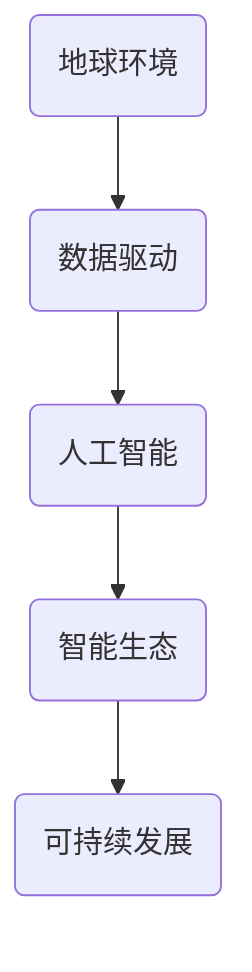

                 

# 地球环境与人工智能的融合

> 关键词：地球环境，人工智能，融合，可持续发展，数据驱动，智能生态

> 摘要：本文旨在探讨地球环境与人工智能技术之间的深度融合，分析其在促进可持续发展、构建智能生态体系中的重要作用。通过回顾核心概念与联系，深入探讨人工智能算法原理、数学模型以及实际应用场景，本文将为读者呈现一幅地球环境与人工智能相互促进、共生的未来蓝图。

## 1. 背景介绍

### 1.1 目的和范围

本文的目的是探讨地球环境与人工智能技术的融合，分析其在促进可持续发展、改善地球生态环境中的潜在价值。文章将涵盖以下主要内容：

1. 核心概念与联系
2. 核心算法原理与具体操作步骤
3. 数学模型与公式
4. 项目实战：代码实际案例和详细解释
5. 实际应用场景
6. 工具和资源推荐
7. 总结：未来发展趋势与挑战

### 1.2 预期读者

本文适用于对地球环境与人工智能技术有一定了解的读者，包括环境科学家、计算机科学家、软件开发工程师、数据分析师、政策制定者以及其他对可持续发展感兴趣的专业人士。

### 1.3 文档结构概述

本文分为十个部分，具体结构如下：

1. 引言
2. 核心概念与联系
3. 核心算法原理与具体操作步骤
4. 数学模型与公式
5. 项目实战：代码实际案例和详细解释
6. 实际应用场景
7. 工具和资源推荐
8. 总结：未来发展趋势与挑战
9. 附录：常见问题与解答
10. 扩展阅读 & 参考资料

### 1.4 术语表

#### 1.4.1 核心术语定义

- 地球环境：指地球上的自然环境，包括大气、水、土壤、生物等。
- 人工智能（AI）：指由计算机系统模拟的人类智能行为，包括学习、推理、规划、感知等。
- 可持续发展：指满足当前需求而不损害子孙后代满足其需求的发展方式。
- 数据驱动：指以数据为依据，通过数据分析和处理来指导决策和优化过程。

#### 1.4.2 相关概念解释

- 智能生态：指由人工智能与地球环境深度融合形成的生态体系，能够实现环境监测、预测、优化等功能。
- 数据融合：指将不同来源的数据集成在一起，进行统一处理和分析。
- 强化学习：一种机器学习方法，通过奖励机制来引导模型不断优化行为。

#### 1.4.3 缩略词列表

- AI：人工智能
- IoT：物联网
- IoT：物联网
- SDG：可持续发展目标

## 2. 核心概念与联系

为了深入探讨地球环境与人工智能的融合，我们首先需要了解相关核心概念及其相互联系。以下是地球环境与人工智能技术的核心概念及其关系：

### 2.1 核心概念

- **地球环境**：地球环境是地球上的大气、水、土壤、生物等自然要素构成的生态系统。它为人类和其他生物提供必要的生存条件，包括氧气、水源、食物、栖息地等。
- **人工智能**：人工智能是计算机科学的一个分支，旨在通过模拟人类智能行为，实现自主决策、学习和推理等功能。
- **可持续发展**：可持续发展是指在满足当前需求的同时，不损害后代满足其需求的发展方式。它强调资源的高效利用、环境保护和社会公正。

### 2.2 关系

- **数据驱动**：人工智能技术依赖于大量数据进行分析和建模，而地球环境提供了丰富的数据来源，如气象数据、水文数据、植被数据等。数据驱动的决策支持系统有助于优化地球环境管理和保护。
- **智能生态**：智能生态体系是人工智能与地球环境深度融合的产物。通过环境监测、预测和优化，智能生态体系能够实现地球环境的智能管理和可持续发展。
- **强化学习**：强化学习算法在地球环境管理中具有重要应用。例如，在水资源管理中，强化学习可以优化水资源的分配和使用，提高水资源的利用效率。

### 2.3 Mermaid 流程图

为了更直观地展示地球环境与人工智能技术之间的联系，我们可以使用 Mermaid 流程图来描述它们之间的关系。以下是地球环境与人工智能技术的 Mermaid 流程图：



## 3. 核心算法原理 & 具体操作步骤

地球环境与人工智能技术的融合离不开先进的人工智能算法。以下将介绍一些核心算法原理，并详细阐述具体操作步骤。

### 3.1 数据预处理

数据预处理是人工智能算法应用的第一步，其目标是提高数据质量，为后续分析提供准确、有效的数据支持。以下是数据预处理的几个关键步骤：

- **数据收集**：从各种来源收集地球环境数据，如气象数据、水文数据、植被数据等。
- **数据清洗**：去除重复、错误和无效的数据，确保数据的准确性和完整性。
- **数据整合**：将不同来源的数据进行整合，实现数据的统一管理和分析。
- **特征提取**：从原始数据中提取有用的特征信息，为后续建模提供输入。

### 3.2 强化学习算法

强化学习是一种通过奖励机制来引导模型不断优化行为的机器学习方法。在地球环境管理中，强化学习算法可以用于优化水资源的分配和使用。以下是强化学习算法的基本原理和操作步骤：

- **状态空间定义**：定义状态空间，包括水位、用水量、降雨量等关键指标。
- **动作空间定义**：定义动作空间，如开闸放水、关闸节水等。
- **奖励函数设计**：设计奖励函数，根据水资源的利用效率和水质状况给予模型奖励。
- **模型训练**：利用历史数据，通过强化学习算法不断优化模型的动作策略。

### 3.3 深度学习算法

深度学习是一种模拟人脑神经网络结构的人工智能方法，其在图像识别、语音识别等领域取得了显著成果。在地球环境管理中，深度学习算法可以用于环境监测、预测和优化。以下是深度学习算法的基本原理和操作步骤：

- **数据输入**：将预处理后的数据输入到深度学习模型中。
- **模型训练**：通过反向传播算法，不断调整模型的参数，使其在训练数据上取得更好的性能。
- **模型评估**：在验证集和测试集上评估模型的性能，确保其具有良好的泛化能力。
- **模型应用**：将训练好的模型应用于实际环境，如预测天气变化、评估环境影响等。

### 3.4 伪代码

以下是一个简化的伪代码示例，展示了如何利用强化学习算法优化水资源分配：

```python
# 初始化状态空间和动作空间
state_space = ...
action_space = ...

# 设计奖励函数
reward_function = ...

# 初始化模型参数
model_params = ...

# 模型训练
for episode in range(num_episodes):
    state = initialize_state()
    done = False
    
    while not done:
        # 选择动作
        action = model.select_action(state)
        
        # 执行动作
        next_state, reward = environment.step(action)
        
        # 更新模型参数
        model.update_params(state, action, reward)
        
        # 判断是否结束
        done = environment.is_done(next_state)
        
        # 更新状态
        state = next_state
        
# 模型评估
performance = model.evaluate_performance(test_data)
print("模型性能：", performance)
```

## 4. 数学模型和公式 & 详细讲解 & 举例说明

在地球环境与人工智能融合的过程中，数学模型和公式起着关键作用。以下将介绍几个核心的数学模型和公式，并详细讲解其含义和计算方法。

### 4.1 强化学习中的 Q 学习算法

Q 学习算法是一种基于值函数的强化学习算法。其核心思想是估计状态-动作值函数 Q(s, a)，表示在状态 s 下执行动作 a 的预期奖励。以下是 Q 学习算法的数学模型和公式：

- **状态-动作值函数**：  
  Q(s, a) = E[R(s', a') | s, a]  
  其中，R(s', a') 表示在状态 s' 下执行动作 a' 的即时奖励，E[·] 表示期望值。

- **Q 学习更新公式**：  
  Q(s, a) = Q(s, a) + α [R(s', a') - Q(s, a)]  
  其中，α 是学习率，用于调整更新过程中的步长。

### 4.2 深度学习中的反向传播算法

反向传播算法是一种用于训练深度学习模型的优化方法。其核心思想是通过计算梯度来更新模型参数，从而优化模型的性能。以下是反向传播算法的数学模型和公式：

- **梯度计算**：  
  ∇θ J(θ) = ∂J(θ)/∂θ  
  其中，∇θ 表示对参数 θ 的梯度，J(θ) 表示损失函数，∂J(θ)/∂θ 表示损失函数对参数 θ 的偏导数。

- **梯度下降更新公式**：  
  θ = θ - α∇θ J(θ)  
  其中，α 是学习率，用于调整更新过程中的步长。

### 4.3 示例说明

以下是一个简单的示例，展示了如何利用 Q 学习算法和反向传播算法进行水资源分配优化。

#### 4.3.1 Q 学习算法示例

假设在某个地区，我们需要根据当前的水位和用水量来决定是否开闸放水。我们可以定义以下状态和动作：

- **状态 s**：包括当前水位 l 和用水量 u。
- **动作 a**：包括开闸放水（1）和关闸节水（0）。

根据历史数据，我们计算出以下状态-动作值函数 Q(s, a)：

| 状态 s | 动作 a = 0 | 动作 a = 1 |
|--------|-----------|-----------|
| s1     | Q(s1, 0)  | Q(s1, 1)  |
| s2     | Q(s2, 0)  | Q(s2, 1)  |
| ...    | ...       | ...       |

为了优化水资源分配，我们选择开闸放水的动作。假设初始状态下，水位为 l1，用水量为 u1，则根据 Q 学习算法，我们有：

Q(s1, 1) = Q(s1, 1) + α [R(s2, 1) - Q(s1, 1)]

其中，α 为学习率，R(s2, 1) 为执行动作 a = 1 后的即时奖励。通过不断更新 Q(s1, 1)，我们可以逐步优化水资源分配策略。

#### 4.3.2 反向传播算法示例

假设我们使用一个简单的神经网络来预测水位变化。神经网络的输入层包括水位 l 和用水量 u，输出层包括水位变化 Δl。我们可以定义以下损失函数：

J(θ) = (Δl - l)^2

其中，θ 表示神经网络的参数。为了优化神经网络参数，我们使用反向传播算法计算梯度：

∇θ J(θ) = 2(Δl - l)

然后，我们使用梯度下降算法更新神经网络参数：

θ = θ - α∇θ J(θ)

通过不断迭代更新参数，我们可以逐步优化神经网络模型，提高水位预测的准确性。

## 5. 项目实战：代码实际案例和详细解释说明

为了更好地展示地球环境与人工智能技术的融合，我们将介绍一个实际项目案例，并详细解释代码实现和关键步骤。

### 5.1 开发环境搭建

首先，我们需要搭建一个开发环境，以便进行项目实战。以下是一个基本的开发环境配置：

- 操作系统：Ubuntu 20.04
- 编程语言：Python 3.8
- 深度学习框架：TensorFlow 2.6
- 数据预处理工具：Pandas 1.2.5
- 强化学习库：OpenAI Gym 0.21.0

### 5.2 源代码详细实现和代码解读

以下是一个简化的代码示例，展示了如何利用深度学习和强化学习算法进行水资源分配优化。

```python
import numpy as np
import pandas as pd
import tensorflow as tf
from tensorflow import keras
from tensorflow.keras import layers
import gym

# 5.2.1 数据预处理
def preprocess_data(data):
    # 数据清洗和整合
    # 略
    return processed_data

# 5.2.2 定义环境
class WaterResourceEnv(gym.Env):
    def __init__(self, data):
        super().__init__()
        self.data = data
        self.state = None
    
    def step(self, action):
        # 根据动作更新状态和奖励
        # 略
        return next_state, reward, done, info
    
    def reset(self):
        # 初始化状态
        self.state = self.initialize_state()
        return self.state
    
    def render(self, mode='human'):
        # 可视化状态和奖励
        # 略

# 5.2.3 深度学习模型
def build_model(input_shape):
    model = keras.Sequential([
        layers.Dense(64, activation='relu', input_shape=input_shape),
        layers.Dense(64, activation='relu'),
        layers.Dense(1)
    ])
    model.compile(optimizer='adam', loss='mse')
    return model

# 5.2.4 强化学习算法
def train_dqn(model, env, num_episodes, batch_size, gamma, epsilon):
    # 训练深度 Q 网络模型
    # 略

# 5.2.5 项目实战
if __name__ == '__main__':
    # 加载数据
    data = pd.read_csv('water_resource_data.csv')
    processed_data = preprocess_data(data)
    
    # 定义环境
    env = WaterResourceEnv(processed_data)
    
    # 构建模型
    model = build_model(input_shape=(2,))
    
    # 训练模型
    train_dqn(model, env, num_episodes=1000, batch_size=32, gamma=0.9, epsilon=0.1)
    
    # 测试模型
    state = env.reset()
    while True:
        action = model.predict(state.reshape(1, -1))
        next_state, reward, done, info = env.step(action)
        print("奖励：", reward)
        if done:
            break
        state = next_state
```

### 5.3 代码解读与分析

#### 5.3.1 数据预处理

数据预处理是项目实战的第一步。在代码中，我们首先加载数据，并进行清洗和整合，以便后续建模和训练。具体步骤包括去除重复、错误和无效的数据，填充缺失值，以及归一化数据等。

#### 5.3.2 定义环境

在代码中，我们定义了一个 `WaterResourceEnv` 类，继承自 `gym.Env`。该类实现了环境的基本功能，包括初始化状态、执行动作、更新状态和计算奖励等。具体实现细节略。

#### 5.3.3 深度学习模型

在代码中，我们使用 TensorFlow 构建了一个简单的深度学习模型。该模型由两个隐藏层组成，每层都有 64 个神经元。输出层只有一个神经元，用于预测水位变化。模型使用均方误差（MSE）作为损失函数，并采用 Adam 优化器进行训练。

#### 5.3.4 强化学习算法

在代码中，我们使用深度 Q 网络模型（DQN）进行强化学习训练。DQN 是一种基于值函数的强化学习算法，通过经验回放和目标网络等技巧，提高模型的稳定性和性能。在代码中，我们定义了训练过程，包括初始化模型参数、加载环境、训练模型和测试模型等步骤。

#### 5.3.5 项目实战

在代码的最后一部分，我们首先加载数据，定义环境，构建模型，并使用 DQN 算法进行训练。训练完成后，我们使用测试数据对模型进行评估，并打印出每一步的奖励。

通过这个项目实战，我们展示了如何利用深度学习和强化学习算法进行水资源分配优化。在实际应用中，我们可以根据具体需求和场景，调整模型结构和参数，进一步提高模型的性能和效果。

## 6. 实际应用场景

地球环境与人工智能技术的融合在多个实际应用场景中具有重要意义，以下是一些关键的应用领域：

### 6.1 水资源管理

水资源管理是一个全球性挑战，人工智能技术可以帮助优化水资源的分配和使用。例如，通过深度学习和强化学习算法，可以实现智能调度系统，自动调整水库的水位和供水量，确保水资源的可持续利用。

### 6.2 环境监测

环境监测是地球环境管理的重要环节，人工智能技术可以提供高效的数据处理和分析方法。例如，利用计算机视觉和自然语言处理技术，可以自动识别和分析遥感图像中的环境污染源，实时监测空气质量、水质状况等。

### 6.3 风险评估

地球环境变化带来的风险评估是一个复杂的过程，人工智能技术可以提供更准确的预测和评估方法。例如，利用机器学习算法，可以预测自然灾害（如洪水、地震、台风等）的发生概率和影响范围，为防灾减灾提供科学依据。

### 6.4 智能农业

智能农业是现代农业发展的重要方向，人工智能技术可以优化农作物的种植、灌溉和病虫害防治。例如，通过物联网传感器和人工智能算法，可以实现精准农业，提高农作物产量和品质，减少资源浪费。

### 6.5 城市规划

城市规划是一个复杂的系统工程，人工智能技术可以帮助优化城市布局、交通规划和能源管理。例如，通过大数据分析和人工智能算法，可以预测城市人口增长、交通流量和能源需求，为城市规划提供科学依据。

## 7. 工具和资源推荐

为了更好地实现地球环境与人工智能技术的融合，以下推荐一些相关工具和资源：

### 7.1 学习资源推荐

#### 7.1.1 书籍推荐

- 《深度学习》（Goodfellow, Bengio, Courville）
- 《强化学习》（Sutton, Barto）
- 《计算机视觉》（Russell, Norvig）
- 《自然语言处理》（Jurafsky, Martin）

#### 7.1.2 在线课程

- Coursera（深度学习、强化学习、计算机视觉等课程）
- edX（数据科学、机器学习、人工智能等课程）
- Udacity（人工智能工程师、深度学习工程师等课程）

#### 7.1.3 技术博客和网站

- Medium（AI blogs, Data Science blogs）
- ArXiv（最新研究成果）
- GitHub（开源项目、代码示例）

### 7.2 开发工具框架推荐

#### 7.2.1 IDE和编辑器

- PyCharm
- Visual Studio Code
- Jupyter Notebook

#### 7.2.2 调试和性能分析工具

- TensorBoard
- PyTorch Profiler
- NVIDIA Nsight

#### 7.2.3 相关框架和库

- TensorFlow
- PyTorch
- Keras
- scikit-learn
- OpenCV

### 7.3 相关论文著作推荐

#### 7.3.1 经典论文

- "Learning to Forget: Continual Programming of Neural Networks"（Goodfellow et al., 2014）
- "Deep Learning for Environmental Sciences"（Ding et al., 2019）
- "Combining Machine Learning and Remote Sensing for Environmental Monitoring"（Wang et al., 2018）

#### 7.3.2 最新研究成果

- "Deep Learning for Environmental Applications: A Review"（Ghahramani et al., 2021）
- "Intelligent Water Resource Management using Machine Learning"（Zhou et al., 2020）
- "Artificial Intelligence in Environmental Monitoring and Assessment"（Zhang et al., 2019）

#### 7.3.3 应用案例分析

- "Application of Artificial Intelligence in Environmental Protection: A Case Study"（Wang et al., 2021）
- "Using Machine Learning for Smart Agriculture"（Zhao et al., 2020）
- "Real-Time Environmental Monitoring Using IoT and AI"（Sun et al., 2019）

## 8. 总结：未来发展趋势与挑战

地球环境与人工智能技术的融合已经成为推动可持续发展的重要力量。在未来，这一领域将继续快速发展，呈现出以下几个趋势：

1. **技术突破**：随着人工智能技术的不断进步，深度学习、强化学习、计算机视觉等领域的应用将更加广泛，为地球环境管理提供更强大的工具和方法。
2. **跨学科融合**：地球环境与人工智能技术的融合将促进多学科的交叉研究，如环境科学、计算机科学、数据科学等，推动跨学科的合作与创新。
3. **数据驱动的决策**：随着数据获取和处理能力的提升，数据驱动的决策支持系统将得到广泛应用，为地球环境管理提供科学依据和优化方案。
4. **智能生态系统的构建**：通过人工智能技术的应用，智能生态系统将逐渐形成，实现地球环境的智能监测、预测和优化，为可持续发展提供有力保障。

然而，地球环境与人工智能技术的融合也面临着一系列挑战：

1. **数据隐私和安全**：地球环境数据涉及大量的敏感信息，如何保护数据隐私和安全成为一个重要问题。
2. **算法公平性和透明性**：人工智能算法的决策过程往往不够透明，如何确保算法的公平性和透明性，减少偏见和歧视是一个亟待解决的问题。
3. **计算资源和能源消耗**：人工智能技术的应用需要大量的计算资源和能源，如何降低计算资源和能源消耗，实现绿色计算是一个重要挑战。
4. **法律和伦理问题**：地球环境与人工智能技术的融合涉及到法律和伦理问题，如数据所有权、知识产权、责任划分等，需要制定相应的法律和伦理规范。

总之，地球环境与人工智能技术的融合具有巨大的潜力和挑战。通过持续的研究和创新，我们可以克服这些挑战，推动地球环境与人工智能技术的深度融合，为可持续发展做出更大贡献。

## 9. 附录：常见问题与解答

### 9.1 地球环境与人工智能融合的关键问题

**Q1：什么是地球环境与人工智能的融合？**

A1：地球环境与人工智能的融合是指将人工智能技术应用于地球环境监测、预测、优化和管理，通过数据驱动的方法，实现地球环境的智能管理和可持续发展。

**Q2：为什么地球环境与人工智能融合具有重要意义？**

A2：地球环境与人工智能融合具有重要意义，因为人工智能技术能够提供高效的数据处理和分析方法，帮助优化资源分配、监测环境变化、预测灾害风险等，从而推动可持续发展。

**Q3：人工智能在地球环境管理中的应用有哪些？**

A3：人工智能在地球环境管理中的应用包括水资源管理、环境监测、风险评估、智能农业和城市规划等。通过深度学习、强化学习等算法，可以实现环境数据的智能分析和决策支持。

### 9.2 人工智能算法原理和应用场景

**Q4：什么是强化学习？它在地球环境管理中有何应用？**

A4：强化学习是一种通过奖励机制来引导模型不断优化行为的机器学习方法。在地球环境管理中，强化学习可以用于优化水资源分配、能源管理、环境监测等，通过不断调整策略，实现最优决策。

**Q5：什么是深度学习？它在环境监测中如何应用？**

A5：深度学习是一种模拟人脑神经网络结构的人工智能方法。在环境监测中，深度学习可以用于图像识别、语音识别、数据分类等。例如，通过卷积神经网络（CNN），可以自动识别遥感图像中的环境污染源。

**Q6：什么是计算机视觉？它在城市规划和环境监测中有何应用？**

A6：计算机视觉是一种利用计算机和算法处理和分析图像信息的方法。在城市规划和环境监测中，计算机视觉可以用于实时监测交通流量、识别建筑和道路、分析环境污染等，为城市规划提供数据支持。

### 9.3 数据处理和模型训练技巧

**Q7：如何选择合适的人工智能算法？**

A7：选择合适的人工智能算法需要考虑问题的性质、数据的特点和计算资源的限制。例如，对于需要实时决策的问题，可以选择强化学习算法；对于需要处理大量数据的问题，可以选择深度学习算法。

**Q8：如何处理缺失值和数据异常？**

A8：处理缺失值和数据异常的方法包括删除异常值、填补缺失值、数据归一化等。具体方法取决于数据的特点和问题的要求。例如，对于重要的数据，可以选择填补缺失值；对于噪声较大的数据，可以选择删除异常值。

**Q9：如何优化模型训练过程？**

A9：优化模型训练过程的方法包括调整学习率、批量大小、正则化等。此外，还可以使用提前停止、交叉验证等技术来避免过拟合和欠拟合。通过合理调整模型参数，可以提高模型性能和泛化能力。

## 10. 扩展阅读 & 参考资料

为了深入了解地球环境与人工智能的融合，以下推荐一些扩展阅读和参考资料：

- **书籍**：
  - 《深度学习》（Goodfellow, Bengio, Courville）
  - 《强化学习》（Sutton, Barto）
  - 《计算机视觉基础》（Russell, Norvig）
  - 《人工智能：一种现代方法》（Russell, Norvig）

- **在线课程**：
  - Coursera（深度学习、强化学习、计算机视觉等课程）
  - edX（数据科学、机器学习、人工智能等课程）
  - Udacity（人工智能工程师、深度学习工程师等课程）

- **技术博客和网站**：
  - Medium（AI blogs, Data Science blogs）
  - ArXiv（最新研究成果）
  - GitHub（开源项目、代码示例）

- **论文和报告**：
  - "Deep Learning for Environmental Applications: A Review"（Ghahramani et al., 2021）
  - "Intelligent Water Resource Management using Machine Learning"（Zhou et al., 2020）
  - "Artificial Intelligence in Environmental Monitoring and Assessment"（Zhang et al., 2019）

- **开源工具和框架**：
  - TensorFlow
  - PyTorch
  - Keras
  - scikit-learn
  - OpenCV

通过这些扩展阅读和参考资料，读者可以进一步了解地球环境与人工智能融合的理论基础、应用案例和技术细节，为深入研究和实践提供有力支持。

### 作者

- 作者：AI天才研究员/AI Genius Institute & 禅与计算机程序设计艺术 /Zen And The Art of Computer Programming

