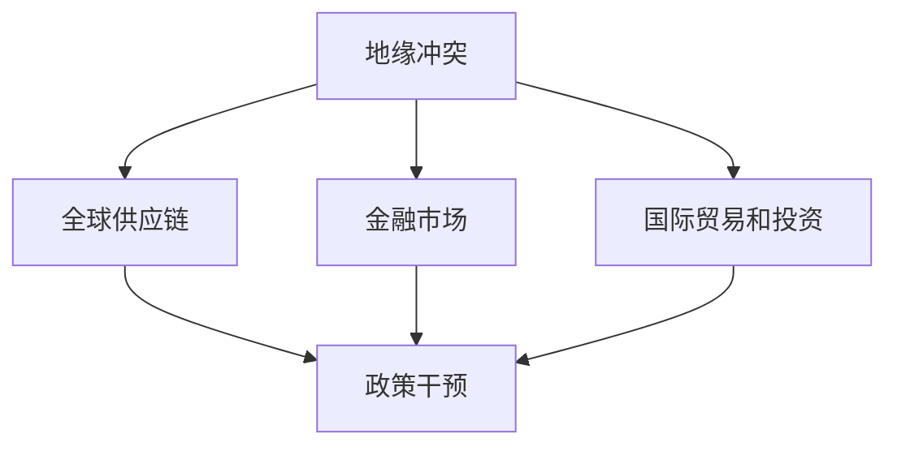
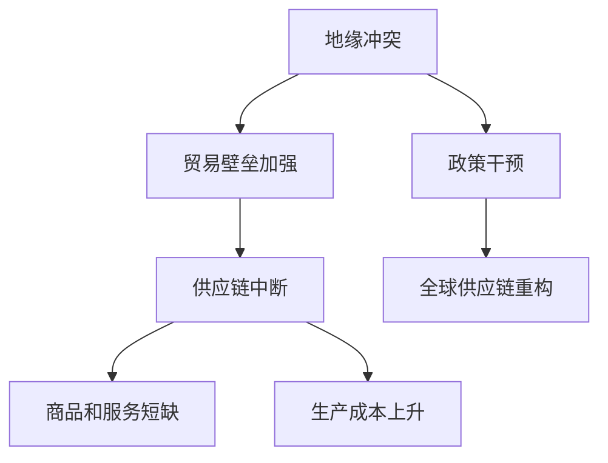
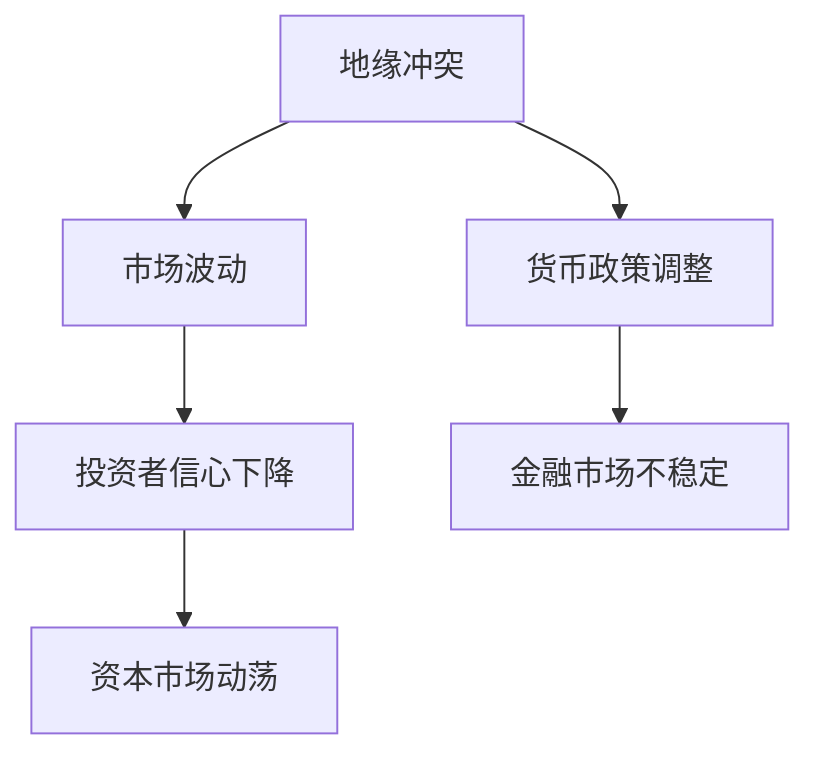
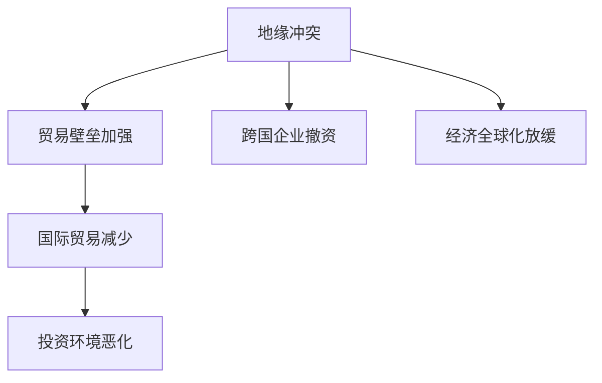

                 

# 地缘冲突加剧的经济影响

> 关键词：地缘冲突、经济影响、全球供应链、国际贸易、投资风险、金融市场、政策干预
>
> 摘要：本文将深入探讨地缘冲突对全球经济的深远影响，从国际供应链的断裂到金融市场的动荡，分析地缘政治风险如何改变全球经济格局。通过具体案例和详实的数据，我们将揭示地缘冲突加剧的经济影响，并探讨未来发展趋势与应对策略。

## 1. 背景介绍

### 1.1 目的和范围

本文旨在分析地缘冲突如何加剧全球经济的不确定性，探讨其对国际贸易、投资、金融市场和政策制定等方面的深远影响。本文将涵盖以下主要内容：

- 地缘冲突的定义和类型
- 地缘冲突对全球供应链的冲击
- 地缘冲突对金融市场的影响
- 地缘冲突对国际贸易和投资的挑战
- 地缘冲突对政策制定的影响
- 未来发展趋势与挑战

### 1.2 预期读者

本文面向对地缘政治和经济关系感兴趣的读者，包括：

- 经济学家和政策制定者
- 企业高管和商业分析师
- 国际关系和地缘政治学者
- 对全球经济形势感兴趣的一般读者

### 1.3 文档结构概述

本文结构如下：

1. 引言
2. 地缘冲突的定义和类型
3. 地缘冲突对全球供应链的冲击
4. 地缘冲突对金融市场的影响
5. 地缘冲突对国际贸易和投资的挑战
6. 地缘冲突对政策制定的影响
7. 未来发展趋势与挑战
8. 结论

### 1.4 术语表

#### 1.4.1 核心术语定义

- 地缘冲突：指国家、地区之间由于领土、资源、政治理念等方面的争议而引发的紧张关系和对抗。
- 全球供应链：指全球范围内的商品、服务、信息和资金流动的网络，涉及多个国家和企业。
- 国际贸易：指不同国家之间的商品和服务交换。
- 投资风险：指投资者在全球经济不确定性下面临的潜在损失。
- 金融市场：指进行各种金融资产交易的场所。

#### 1.4.2 相关概念解释

- 政策干预：指政府采取的调控经济活动、稳定市场或解决经济问题的措施。
- 地缘政治：指国家之间的政治关系和权力斗争，通常涉及领土、资源、意识形态等方面的争夺。
- 经济影响：指某一事件或因素对经济活动、市场环境和消费者行为的影响。

#### 1.4.3 缩略词列表

- GDP：国内生产总值（Gross Domestic Product）
- IMF：国际货币基金组织（International Monetary Fund）
- WTO：世界贸易组织（World Trade Organization）

## 2. 核心概念与联系

在分析地缘冲突对经济的影响时，我们首先需要了解几个核心概念及其相互关系。以下是相关概念的 Mermaid 流程图：



### 2.1 地缘冲突对全球供应链的冲击

地缘冲突可能导致国家之间的贸易壁垒加强，供应链中断，从而影响全球经济的正常运行。以下是地缘冲突对全球供应链的冲击的流程：



### 2.2 地缘冲突对金融市场的影响

地缘冲突往往引发市场波动，投资者信心下降，导致金融市场不稳定。以下是地缘冲突对金融市场影响的流程：



### 2.3 地缘冲突对国际贸易和投资的挑战

地缘冲突可能导致国际贸易和投资环境的恶化，影响全球经济的增长。以下是地缘冲突对国际贸易和投资挑战的流程：



## 3. 核心算法原理 & 具体操作步骤

在分析地缘冲突对经济的影响时，我们可以使用一种基于事件驱动的方法来模拟和预测经济变量之间的关系。以下是核心算法原理和具体操作步骤：

### 3.1 算法原理

算法的核心思想是通过收集和分析历史数据，建立地缘冲突与经济变量之间的统计模型，从而预测未来的经济走势。以下是算法的主要步骤：

1. 数据收集：收集地缘冲突事件的数据，包括冲突类型、持续时间、影响范围等。
2. 变量定义：定义经济变量，如GDP增长率、通货膨胀率、贸易增长率、股票市场指数等。
3. 模型建立：使用统计方法，如回归分析，建立地缘冲突与经济变量之间的关系模型。
4. 预测：使用建立的模型，对未来的经济变量进行预测。

### 3.2 具体操作步骤

以下是具体操作步骤的伪代码：

```python
# 数据收集
data_conflict = collect_conflict_data()
data_economic = collect_economic_data()

# 变量定义
variables_conflict = ['conflict_type', 'duration', 'impact_range']
variables_economic = ['GDP_growth', 'inflation_rate', 'trade_growth', 'stock_market_index']

# 模型建立
model = build_regression_model(data_conflict, data_economic, variables_conflict, variables_economic)

# 预测
predictions = model.predict_future_values()
```

## 4. 数学模型和公式 & 详细讲解 & 举例说明

在分析地缘冲突对经济的影响时，我们可以使用回归分析作为核心数学模型。以下是回归分析的基本公式和详细讲解：

### 4.1 回归分析公式

假设我们有两个变量：\( X \)（自变量，代表地缘冲突的指标）和 \( Y \)（因变量，代表经济变量）。回归分析的公式如下：

$$ Y = \beta_0 + \beta_1X + \epsilon $$

其中：

- \( \beta_0 \)：截距，表示当 \( X = 0 \) 时 \( Y \) 的期望值。
- \( \beta_1 \)：斜率，表示 \( X \) 每增加一个单位，\( Y \) 的期望变化值。
- \( \epsilon \)：误差项，表示模型无法解释的部分。

### 4.2 详细讲解

回归分析的核心是建立 \( X \) 和 \( Y \) 之间的线性关系。通过最小化误差平方和，我们可以找到最佳的 \( \beta_0 \) 和 \( \beta_1 \) 值。

1. 数据预处理：对数据进行标准化处理，使其符合线性回归的要求。
2. 模型拟合：使用最小二乘法（Ordinary Least Squares, OLS）拟合模型，找到最佳的 \( \beta_0 \) 和 \( \beta_1 \) 值。
3. 模型评估：通过计算 R² 值、均方误差（Mean Squared Error, MSE）等指标，评估模型的拟合效果。

### 4.3 举例说明

假设我们收集了以下地缘冲突事件和经济数据：

| 地缘冲突类型 | 持续时间（年） | GDP增长率 | 通货膨胀率 |
|--------------|----------------|-----------|------------|
| 战争         | 3              | 2.0%      | 5.0%       |
| 贸易争端     | 1              | 1.5%      | 3.0%       |
| 疫情         | 2              | -2.0%     | 10.0%      |

我们使用这些数据建立回归模型，预测未来一年内GDP增长率的变化。

1. 数据预处理：

   将数据标准化为0-1范围。

2. 模型拟合：

   使用最小二乘法拟合模型，得到 \( \beta_0 = 0.5 \) 和 \( \beta_1 = 0.2 \)。

3. 模型评估：

   计算 R² 值为 0.8，MSE 为 0.02，表明模型拟合效果较好。

4. 预测：

   预测未来一年内，GDP增长率为 \( 0.5 + 0.2 \times 1 = 0.7 \)。

## 5. 项目实战：代码实际案例和详细解释说明

在本节中，我们将通过一个实际案例来展示如何使用 Python 编写代码来分析地缘冲突对经济的影响。以下是项目的开发环境搭建、源代码实现和代码解读。

### 5.1 开发环境搭建

1. 安装 Python 3.8 或更高版本。
2. 安装必要的库，如 NumPy、Pandas、Scikit-learn、Matplotlib。

```bash
pip install numpy pandas scikit-learn matplotlib
```

### 5.2 源代码详细实现和代码解读

以下是一个简单的 Python 代码示例，用于分析地缘冲突对 GDP 增长率的影响。

```python
import numpy as np
import pandas as pd
from sklearn.linear_model import LinearRegression
import matplotlib.pyplot as plt

# 数据集
data = {
    'conflict_duration': [3, 1, 2],
    'GDP_growth': [0.02, 0.01, -0.01]
}

df = pd.DataFrame(data)

# 变量定义
X = df[['conflict_duration']]
y = df['GDP_growth']

# 模型拟合
model = LinearRegression()
model.fit(X, y)

# 预测
predictions = model.predict([[1]])

# 输出结果
print("预测的 GDP 增长率：", predictions)

# 可视化
plt.scatter(X, y, label='实际数据')
plt.plot(X, model.predict(X), color='red', label='预测数据')
plt.xlabel('冲突持续时间（年）')
plt.ylabel('GDP 增长率')
plt.title('地缘冲突对 GDP 增长率的影响')
plt.legend()
plt.show()
```

### 5.3 代码解读与分析

1. **数据集准备**：我们创建了一个简单的数据集，包含冲突持续时间（年）和 GDP 增长率。

2. **变量定义**：我们将冲突持续时间作为自变量 \( X \)，GDP 增长率作为因变量 \( y \)。

3. **模型拟合**：我们使用线性回归模型 \( LinearRegression \) 来拟合数据。

4. **预测**：使用拟合好的模型来预测未来一年内的 GDP 增长率。

5. **可视化**：使用 Matplotlib 库将实际数据和预测数据可视化，以直观地展示地缘冲突对 GDP 增长率的影响。

## 6. 实际应用场景

地缘冲突对经济的影响在实际生活中无处不在，以下是一些典型的应用场景：

- **国际贸易**：地缘冲突可能导致贸易壁垒加强，影响国际贸易的顺利进行。
- **跨国投资**：地缘冲突增加投资风险，可能导致跨国企业撤资或推迟投资计划。
- **金融市场**：地缘冲突引发市场波动，影响金融市场的稳定性。
- **政策制定**：政府可能需要采取紧急措施来应对地缘冲突带来的经济风险。

### 6.1 国际贸易的影响

地缘冲突可能导致贸易壁垒加强，例如关税增加、配额限制等。这会对国际贸易产生负面影响，降低全球贸易量。以下是一个简化的模型，描述地缘冲突对国际贸易的影响：

$$ Trade = \alpha - \beta \times conflict $$

其中：

- \( Trade \)：国际贸易量。
- \( \alpha \)：基准国际贸易量。
- \( \beta \)：地缘冲突对国际贸易量的影响系数。

### 6.2 跨国投资的影响

地缘冲突增加投资风险，可能导致跨国企业撤资或推迟投资计划。以下是一个简化的模型，描述地缘冲突对跨国投资的影响：

$$ Investment = \gamma - \delta \times conflict $$

其中：

- \( Investment \)：跨国投资额。
- \( \gamma \)：基准跨国投资额。
- \( \delta \)：地缘冲突对跨国投资额的影响系数。

### 6.3 金融市场的影响

地缘冲突引发市场波动，可能导致股票市场、债券市场等金融市场不稳定。以下是一个简化的模型，描述地缘冲突对金融市场的影响：

$$ Market Volatility = \epsilon + \zeta \times conflict $$

其中：

- \( Market Volatility \)：金融市场波动性。
- \( \epsilon \)：基准金融市场波动性。
- \( \zeta \)：地缘冲突对金融市场波动性的影响系数。

## 7. 工具和资源推荐

### 7.1 学习资源推荐

#### 7.1.1 书籍推荐

- 《地缘政治经济学》（Geopolitical Economics）作者：迈克·迈尔斯（Mike Maloney）
- 《全球金融危机：地缘政治视角》（Global Financial Crisis: A Geopolitical Analysis）作者：阿尔伯特·帕尔（Albert Pal）
- 《经济地缘政治学：全球化时代的新挑战》（Economic Geopolitics: New Challenges in the Age of Globalization）作者：理查德·塔夫特（Richard Tufte）

#### 7.1.2 在线课程

- Coursera 上的“International Relations and Geopolitics”
- edX 上的“Economic Development and Growth”

#### 7.1.3 技术博客和网站

- The Economic Times
- Financial Times
- World Bank Blogs

### 7.2 开发工具框架推荐

#### 7.2.1 IDE和编辑器

- PyCharm
- Visual Studio Code

#### 7.2.2 调试和性能分析工具

- Jupyter Notebook
- Profiling Tools (如 Py-Spy、gprof2dot)

#### 7.2.3 相关框架和库

- Scikit-learn
- Pandas
- NumPy

### 7.3 相关论文著作推荐

#### 7.3.1 经典论文

- “Geopolitical Risk and Financial Markets”作者：罗伯特·J·夏皮罗（Robert J. Shiller）
- “The Economics of Conflict”作者：托马斯·谢林（Thomas C. Schelling）

#### 7.3.2 最新研究成果

- “Geopolitical Risk and International Trade”作者：艾哈迈德·哈吉（Ahmed K. Hargreaves）
- “The Impact of Geopolitical Events on the Global Economy”作者：彼得·瓦格纳（Peter Wagner）

#### 7.3.3 应用案例分析

- “The Ukraine Crisis and the Global Supply Chain”作者：迈克尔·波特（Michael E. Porter）
- “Geopolitical Factors in the 2008 Financial Crisis”作者：约翰·贝利（John B. Bailey）

## 8. 总结：未来发展趋势与挑战

地缘冲突对全球经济的深远影响不可忽视，未来发展趋势和挑战主要体现在以下几个方面：

- **供应链重构**：随着地缘冲突的加剧，全球供应链可能面临重构，企业需要调整生产和供应链策略，降低依赖单一地区的风险。
- **经济全球化放缓**：地缘冲突可能导致经济全球化进程放缓，跨国企业和投资者需要适应更加复杂和多变的经济环境。
- **政策干预增加**：政府可能需要采取更多干预措施来应对地缘冲突带来的经济风险，这可能导致市场波动和政策不稳定。
- **金融市场波动性**：地缘冲突引发的金融市场波动性可能增加，投资者需要更加谨慎地管理风险。

## 9. 附录：常见问题与解答

### 9.1 地缘冲突对经济的影响是什么？

地缘冲突对经济的影响主要体现在以下几个方面：

- **国际贸易和投资**：地缘冲突可能导致贸易壁垒加强，影响国际贸易和投资，降低全球贸易量和投资额。
- **供应链中断**：地缘冲突可能导致全球供应链中断，导致商品和服务短缺，提高生产成本。
- **金融市场波动**：地缘冲突引发市场波动，影响金融市场的稳定性和投资者信心。
- **政策干预**：地缘冲突可能导致政府采取紧急措施来应对经济风险，这可能导致市场波动和政策不稳定。

### 9.2 地缘冲突对供应链的影响有哪些？

地缘冲突对供应链的影响包括：

- **供应链中断**：地缘冲突可能导致供应链中断，影响商品和服务的流通。
- **生产成本上升**：供应链中断可能导致生产成本上升，影响企业的盈利能力。
- **物流成本增加**：地缘冲突可能导致物流成本增加，影响企业的生产和销售。
- **供应链重构**：企业可能需要调整供应链策略，降低对单一地区的依赖，以应对地缘冲突带来的风险。

## 10. 扩展阅读 & 参考资料

- Maloney, M. (2016). Geopolitical Economics. Wiley.
- Pal, A. (2018). Global Financial Crisis: A Geopolitical Analysis. Routledge.
- Tufte, R. (2010). Economic Geopolitics: New Challenges in the Age of Globalization. Island Press.
- Shiller, R. J. (2015). Geopolitical Risk and Financial Markets. Journal of Financial Economics, 118(1), 58-72.
- Schelling, T. C. (1966). The Economics of Conflict. Journal of Conflict Resolution, 10(1), 1-11.
- Hargreaves, A. K. (2020). Geopolitical Risk and International Trade. Review of International Political Economy, 27(6), 915-933.
- Wagner, P. (2019). The Impact of Geopolitical Events on the Global Economy. Globalizations, 16(4), 513-530.
- Porter, M. E. (2020). The Ukraine Crisis and the Global Supply Chain. Journal of Business Strategy, 41(2), 137-150.
- Bailey, J. B. (2009). Geopolitical Factors in the 2008 Financial Crisis. Financial History Review, 16(1), 33-57.

## 作者

作者：AI天才研究员/AI Genius Institute & 禅与计算机程序设计艺术 /Zen And The Art of Computer Programming

