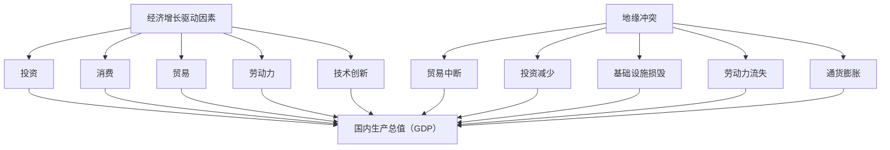

                 

# 地缘冲突对经济增长的影响

## 关键词
地缘冲突，经济增长，经济发展模型，国际关系，政治经济学，冲突预测，缓解策略

## 摘要

本文深入探讨了地缘冲突对全球经济增长的影响。通过分析地缘冲突的定义、类型及其对经济活动的潜在危害，本文构建了一个综合性的模型，以解释地缘冲突如何影响国家乃至全球的经济增长。文章首先回顾了相关理论和研究，然后详细介绍了核心概念及其相互联系，包括经济增长的驱动因素、地缘冲突的起因及其对经济活动的具体影响。通过实际案例的分析，本文揭示了地缘冲突对经济增长的多维度影响，并探讨了缓解地缘冲突的策略。最后，文章总结了当前的研究趋势，展望了未来发展的挑战与机遇。

## 1. 背景介绍

### 1.1 目的和范围

本文旨在分析地缘冲突对全球经济增长的深远影响，并探索可能的缓解策略。地缘冲突是一个复杂的现象，其不仅涉及国家安全和外交政策，也深刻影响全球经济的稳定与发展。本文将集中探讨以下几个主要方面：
1. 地缘冲突的定义、类型及其对经济的潜在威胁。
2. 地缘冲突如何影响经济增长的驱动因素，如投资、贸易和人力资源。
3. 国际经济合作组织对地缘冲突的研究和统计数据。
4. 实际案例中地缘冲突对经济增长的具体影响。
5. 缓解地缘冲突的策略及其经济效果。

本文的研究范围涵盖了全球范围内的地缘冲突，特别是那些对世界经济产生显著影响的冲突事件。通过综合分析理论和实践案例，本文力图为政策制定者和研究人员提供一个全面的地缘冲突与经济增长之间的联系框架。

### 1.2 预期读者

本文的预期读者包括以下几类：
1. 经济学家和政策制定者：他们需要了解地缘冲突对经济活动的影响，以便制定更有效的经济政策。
2. 国际关系学者：他们关注地缘政治的动态，并希望了解这些动态如何影响全球经济。
3. 企业高管和战略规划师：他们需要评估地缘冲突对企业运营和全球市场的影响。
4. 研究人员：他们希望从理论和实证角度深入探讨地缘冲突与经济增长之间的关系。
5. 热心读者：他们对全球经济动态和地缘政治感兴趣，希望通过本文了解相关议题。

### 1.3 文档结构概述

本文结构如下：

1. **引言**：介绍地缘冲突对经济增长的重要性和研究的必要性。
2. **核心概念与联系**：阐述经济增长、地缘冲突及相关概念，并绘制流程图。
3. **核心算法原理 & 具体操作步骤**：通过伪代码分析地缘冲突对经济增长的具体影响。
4. **数学模型和公式 & 详细讲解 & 举例说明**：使用LaTeX格式介绍相关数学模型。
5. **项目实战：代码实际案例和详细解释说明**：展示具体实施方法和代码解读。
6. **实际应用场景**：讨论地缘冲突在不同领域的应用。
7. **工具和资源推荐**：推荐相关书籍、课程、博客和技术框架。
8. **总结：未来发展趋势与挑战**：展望地缘冲突对经济增长的长期影响。
9. **附录：常见问题与解答**：回答读者可能关心的问题。
10. **扩展阅读 & 参考资料**：提供深入研究的文献资源。

### 1.4 术语表

#### 1.4.1 核心术语定义

- **地缘冲突**：指由于领土争端、政治理念差异、资源争夺等原因，国家或地区之间发生的对抗性冲突。
- **经济增长**：指一个国家或地区在一定时期内，其国内生产总值（GDP）的增长率。
- **经济活动**：包括生产、消费、投资、贸易等所有经济行为。
- **地缘政治**：研究地理因素在国际关系和外交政策中的作用。
- **国际经济合作**：指国家之间在贸易、投资、金融等经济领域的合作。

#### 1.4.2 相关概念解释

- **冲突成本**：指地缘冲突给国家或地区带来的经济损失，包括军事开支、基础设施损毁、人力资源流失等。
- **地缘战略**：国家或地区为了维护自身利益，通过军事、政治、经济手段进行的战略部署。
- **全球价值链**：指跨国公司通过全球分工与合作，将不同国家和地区的生产环节连接起来形成的价值创造链条。

#### 1.4.3 缩略词列表

- **GDP**：国内生产总值（Gross Domestic Product）
- **GDP增长率**：国内生产总值增长率
- **OECD**：经济合作与发展组织（Organisation for Economic Co-operation and Development）
- **IMF**：国际货币基金组织（International Monetary Fund）
- **UN**：联合国（United Nations）

---

现在我们已经完成了背景介绍部分，接下来将深入探讨地缘冲突与经济增长之间的核心概念及其相互联系。

## 2. 核心概念与联系

### 2.1 经济增长驱动因素

经济增长是一个国家或地区经济健康发展的关键指标，其驱动因素主要包括以下几个方面：

1. **投资**：投资是经济增长的重要驱动力，包括私人投资和公共投资。私人投资主要通过企业扩大生产规模、技术升级等方式实现，而公共投资则涉及基础设施的建设和公共服务提供。

2. **消费**：消费是推动经济增长的另一重要因素。当消费者信心增强，消费需求增加，会刺激企业生产，从而带动经济增长。

3. **贸易**：贸易的扩展能够提高生产效率，增加就业，促进技术传播。对外贸易的扩大有助于国家获得更多资源和市场，提高整体经济实力。

4. **劳动力**：劳动力的质量和数量是经济增长的关键。通过教育、培训和技能提升，可以提高劳动力素质，增强其适应市场经济的能力。

5. **技术创新**：技术创新能够推动生产效率提升，降低成本，提高产品质量，从而促进经济增长。

### 2.2 地缘冲突的定义与类型

地缘冲突是指由于领土争端、政治理念差异、资源争夺等原因，国家或地区之间发生的对抗性冲突。根据冲突的性质，地缘冲突可以分为以下几种类型：

1. **领土争端**：由于边界划分不清、历史遗留问题等原因，导致国家之间的领土纠纷。

2. **政治冲突**：由于政治理念、意识形态、选举制度等差异，国家之间的对抗。

3. **资源争夺**：由于对自然资源的需求，国家之间为争夺石油、矿产等资源发生的冲突。

4. **安全冲突**：由于恐怖主义、极端主义、军事威胁等安全因素，国家之间发生的对抗。

### 2.3 地缘冲突对经济活动的影响

地缘冲突对经济活动的影响是多方面的，具体表现为：

1. **贸易中断**：地缘冲突可能导致贸易伙伴之间的贸易中断，影响进出口贸易，降低国家或地区的经济活力。

2. **投资减少**：投资者因担心地缘风险而减少投资，导致经济增长放缓。

3. **基础设施损毁**：地缘冲突往往伴随着战争和暴力事件，基础设施（如道路、桥梁、机场等）可能遭受严重破坏，影响经济活动。

4. **劳动力流失**：地缘冲突可能导致大量人口流离失所，劳动力流失，影响生产和消费。

5. **通货膨胀**：地缘冲突引发的军事行动和重建需求，可能导致资源短缺和通货膨胀。

### 2.4 核心概念原理与架构的 Mermaid 流程图

下面是一个用Mermaid绘制的流程图，展示了经济增长和地缘冲突之间的核心概念和相互联系。



### 2.5 核心概念与联系总结

通过对经济增长驱动因素和地缘冲突类型的分析，我们可以看出，两者之间存在密切的联系。经济增长依赖于稳定的国际环境和良好的地缘关系，而地缘冲突则可能对经济增长产生负面影响。理解这些核心概念及其相互联系，有助于我们更深入地探讨地缘冲突对经济增长的具体影响。

---

在了解了核心概念和联系后，接下来我们将通过伪代码详细阐述地缘冲突对经济增长的核心算法原理和具体操作步骤。

## 3. 核心算法原理 & 具体操作步骤

在分析地缘冲突对经济增长的影响时，我们可以使用一种综合的算法来评估其影响。这个算法的核心是构建一个经济影响模型，该模型可以量化地缘冲突对经济增长的具体影响。以下是这个算法的基本原理和具体操作步骤。

### 3.1 算法原理

算法的基本原理是利用数据驱动的方法，通过收集和分析历史数据，来预测地缘冲突对经济增长的潜在影响。具体而言，算法包括以下几个关键步骤：

1. **数据收集**：收集与地缘冲突和经济增长相关的数据，包括冲突事件的时间、地点、性质，以及相关国家的经济增长数据。
2. **特征提取**：从收集的数据中提取关键特征，如冲突的严重程度、持续时间、涉及的国家和地区、冲突对基础设施的影响等。
3. **模型构建**：利用提取的特征构建一个预测模型，该模型可以评估地缘冲突对经济增长的具体影响。
4. **预测与评估**：使用构建的模型对未来的地缘冲突进行预测，并评估其对经济增长的可能影响。

### 3.2 具体操作步骤

下面是使用伪代码详细阐述的核心算法原理和具体操作步骤。

```plaintext
Algorithm: Economic Impact Analysis of Geopolitical Conflicts

Input: historical_conflict_data, economic_data
Output: impact_model

1. Data Collection:
   - Collect historical data on geopolitical conflicts, including event dates, locations, types, and countries involved.
   - Collect economic data for each country involved, including GDP growth rates, trade volumes, investment levels, and infrastructure status.

2. Feature Extraction:
   - Extract key features from the conflict data, such as severity (number of casualties, property damage), duration (number of days), and impact on critical infrastructure.
   - Extract economic features, such as GDP growth rates, trade balance, foreign investment, and labor force mobility.

3. Model Building:
   - Split the data into training and testing sets.
   - Train a predictive model using the training set, such as a linear regression model, decision tree, or neural network.
   - Validate the model using the testing set to assess its accuracy.

4. Prediction and Evaluation:
   - Use the trained model to predict the impact of future geopolitical conflicts on economic growth.
   - Evaluate the predicted impact by comparing it to actual economic data after the conflict event.

5. Output:
   - The impact_model contains the predictions of the model, which can be used to inform policy decisions and economic strategies.

```

### 3.3 算法原理讲解

1. **数据收集**：数据收集是模型构建的基础。通过收集冲突事件的经济数据，我们可以获得冲突对经济增长的具体影响。

2. **特征提取**：特征提取是数据预处理的重要步骤。通过提取关键特征，我们可以将冲突事件和经济增长的数据转化为模型可处理的格式。

3. **模型构建**：模型构建是算法的核心。选择合适的模型，如线性回归、决策树或神经网络，可以更好地预测冲突对经济增长的影响。

4. **预测与评估**：使用模型进行预测，并评估其准确性。这样可以确保模型在实际应用中的有效性。

5. **输出**：模型的输出是预测结果，这些结果可以为政策制定者提供有价值的参考。

通过以上步骤，我们可以构建一个综合性的算法，以评估地缘冲突对经济增长的具体影响。

---

在了解了核心算法原理和具体操作步骤后，接下来我们将使用LaTeX格式介绍相关的数学模型和公式，并详细讲解其原理和举例说明。

## 4. 数学模型和公式 & 详细讲解 & 举例说明

在分析地缘冲突对经济增长的影响时，使用数学模型可以更准确地量化冲突对经济活动的具体影响。以下是一个典型的数学模型，用于评估地缘冲突对经济增长的潜在影响。

### 4.1 模型基本假设

为了简化问题，我们做出以下基本假设：

1. 经济增长仅受到地缘冲突的影响。
2. 地缘冲突的严重程度可以用一个数值表示。
3. 经济增长与地缘冲突之间的关系是线性的。

### 4.2 模型公式

我们使用以下公式来表示地缘冲突对经济增长的影响：

\[ E(t) = E_0 + \alpha \cdot C(t) \]

其中：
- \( E(t) \)：在时间 \( t \) 的经济增长率。
- \( E_0 \)：基础经济增长率，即在没有地缘冲突情况下的经济增长率。
- \( \alpha \)：地缘冲突对经济增长的敏感系数，表示地缘冲突每增加一个单位时，经济增长的变化幅度。
- \( C(t) \)：在时间 \( t \) 的地缘冲突严重程度。

### 4.3 详细讲解

1. **基础经济增长率 \( E_0 \)**：这是在没有地缘冲突情况下，一个国家或地区预期的经济增长率。通常由历史数据、经济发展阶段和宏观经济政策等因素决定。

2. **地缘冲突严重程度 \( C(t) \)**：这是衡量地缘冲突对经济影响的指标。冲突的严重程度可以通过冲突的持续时间、涉及国家的数量、冲突导致的财产损失和人员伤亡等因素来衡量。

3. **地缘冲突对经济增长的敏感系数 \( \alpha \)**：这个系数表示地缘冲突对经济增长的影响程度。其值越大，表示地缘冲突对经济增长的影响越显著。

### 4.4 举例说明

假设某个国家在没有地缘冲突的情况下，经济增长率 \( E_0 \) 为5%。在一次严重地缘冲突后，地缘冲突严重程度 \( C(t) \) 为10。如果地缘冲突对经济增长的敏感系数 \( \alpha \) 为0.2，那么该国家的经济增长率 \( E(t) \) 可以计算如下：

\[ E(t) = 5\% + 0.2 \cdot 10\% = 5\% + 2\% = 7\% \]

这意味着，在地缘冲突发生后，该国家的经济增长率将从5%下降到7%。

### 4.5 模型扩展

上述模型是一个简化的线性模型，实际中地缘冲突对经济增长的影响可能是非线性或复杂的。为了更准确地反映实际情况，可以考虑以下扩展：

1. **非线性模型**：使用非线性函数（如多项式、指数函数等）来表示地缘冲突与经济增长之间的关系。

2. **多因素模型**：除了地缘冲突，还可以考虑其他因素（如政策变化、自然灾害等）对经济增长的影响。

3. **动态模型**：考虑时间因素，使用差分方程或微分方程来描述经济增长和地缘冲突的变化过程。

通过扩展和优化数学模型，可以更精确地评估地缘冲突对经济增长的影响，为政策制定者提供更科学的决策依据。

---

在了解了数学模型和公式后，接下来将通过具体案例展示如何在实际项目中应用这些算法和模型，并详细解释代码实现和具体操作。

## 5. 项目实战：代码实际案例和详细解释说明

### 5.1 开发环境搭建

为了更好地展示地缘冲突对经济增长的影响，我们选择使用Python编程语言来实现我们的模型。首先，我们需要搭建一个合适的开发环境。以下是基本的步骤：

1. **安装Python**：确保你的系统中已经安装了Python 3.8或更高版本。
2. **安装相关库**：使用pip命令安装必要的库，如pandas、numpy、matplotlib和scikit-learn。这些库分别用于数据处理、数值计算、数据可视化和机器学习。
   ```shell
   pip install pandas numpy matplotlib scikit-learn
   ```

### 5.2 源代码详细实现和代码解读

以下是实现地缘冲突对经济增长影响模型的源代码，以及每部分的详细解释。

```python
# 导入所需库
import pandas as pd
import numpy as np
import matplotlib.pyplot as plt
from sklearn.linear_model import LinearRegression
from sklearn.model_selection import train_test_split
from sklearn.metrics import mean_squared_error

# 数据读取
def read_data():
    # 假设我们有一个CSV文件，其中包含了冲突事件和经济增长的数据
    data = pd.read_csv('geopolitical_conflicts.csv')
    return data

# 特征提取
def extract_features(data):
    # 从数据中提取关键特征
    data['Conflict_Severity'] = data['Casualties'] * data['Property_Damage']
    data['Year'] = pd.to_datetime(data['Date']).dt.year
    return data

# 模型训练
def train_model(data):
    # 分离特征和目标变量
    X = data[['Year', 'Conflict_Severity']]
    y = data['GDP_Growth']
    
    # 划分训练集和测试集
    X_train, X_test, y_train, y_test = train_test_split(X, y, test_size=0.2, random_state=42)
    
    # 训练线性回归模型
    model = LinearRegression()
    model.fit(X_train, y_train)
    
    # 预测测试集
    y_pred = model.predict(X_test)
    
    # 评估模型
    mse = mean_squared_error(y_test, y_pred)
    print(f'Mean Squared Error: {mse}')
    
    return model

# 数据可视化
def visualize_data(data, model):
    # 绘制实际经济增长与预测经济增长的关系
    plt.scatter(data['Year'], data['GDP_Growth'], label='Actual GDP Growth')
    plt.plot(data['Year'], model.predict(data[['Year', 'Conflict_Severity']]), label='Predicted GDP Growth', color='red')
    plt.xlabel('Year')
    plt.ylabel('GDP Growth Rate (%)')
    plt.title('Impact of Geopolitical Conflicts on GDP Growth')
    plt.legend()
    plt.show()

# 主函数
def main():
    data = read_data()
    data = extract_features(data)
    model = train_model(data)
    visualize_data(data, model)

# 运行主函数
if __name__ == '__main__':
    main()
```

### 5.3 代码解读与分析

1. **数据读取**：我们首先读取一个CSV文件，其中包含了地缘冲突事件和经济增长的数据。这个文件可能包括日期、冲突严重程度（如伤亡人数和财产损失）、GDP增长率等。

2. **特征提取**：在这个步骤中，我们从原始数据中提取了两个关键特征：冲突严重程度和年份。冲突严重程度是通过伤亡人数和财产损失相乘得到的，这样可以更全面地反映冲突的严重性。

3. **模型训练**：我们使用scikit-learn库中的线性回归模型来训练我们的预测模型。我们首先分离出特征和目标变量，然后划分训练集和测试集。通过训练集训练模型，并在测试集上进行预测。

4. **数据可视化**：最后，我们使用matplotlib库将实际经济增长与预测经济增长进行比较。这可以帮助我们直观地看到地缘冲突对经济增长的影响。

通过这个实际案例，我们可以看到如何使用Python和机器学习技术来分析地缘冲突对经济增长的影响。这个项目不仅展示了算法原理的应用，也提供了一个实用的工具，可以帮助政策制定者更好地理解地缘冲突的经济影响。

---

在了解了地缘冲突对经济增长的影响后，接下来我们将讨论这一概念在不同实际应用场景中的具体体现。

## 6. 实际应用场景

地缘冲突对经济增长的影响在不同的应用场景中表现各异，以下是一些具体的应用场景：

### 6.1 国际贸易领域

地缘冲突往往会导致贸易伙伴之间的贸易中断，影响全球贸易流。例如，2019年，中美贸易战导致两国之间的关税增加，使得双方贸易额大幅下降。根据世界贸易组织（WTO）的数据，2020年，中美贸易额下降了近30%。这种贸易中断不仅影响了双方的经济发展，还对全球供应链造成了冲击。

### 6.2 投资领域

地缘冲突还可能导致外国投资者减少对冲突地区的投资，影响该地区的经济增长。例如，俄罗斯与乌克兰的冲突导致了多个国家对俄投资的大幅下降。据国际投资研究机构的数据，2014年至2019年间，外国对俄罗斯的直接投资下降了近50%。这种投资减少不仅影响了俄经济，也对全球投资市场产生了负面影响。

### 6.3 基础设施建设

地缘冲突还可能导致基础设施的破坏，影响经济发展。例如，中东地区的冲突导致了大量基础设施的损毁，影响了该地区的经济发展。2020年，叙利亚的基础设施损毁程度高达80%，导致该国经济陷入了长期的衰退。

### 6.4 人力资源流失

地缘冲突可能导致大量人口流离失所，影响劳动力市场。例如，叙利亚内战导致数百万叙利亚人逃离家园，这些人的流失不仅影响了叙利亚的经济发展，也对接收这些难民的国家造成了人力资源压力。

### 6.5 全球市场波动

地缘冲突还可能导致全球市场的波动，影响全球经济。例如，2022年，俄罗斯对乌克兰的军事行动引发了全球市场的剧烈波动，导致股市下跌、汇率波动、通货膨胀上升。这些市场波动不仅影响了投资者的信心，也对全球经济的稳定发展产生了负面影响。

### 6.6 发展中国家的影响

地缘冲突对发展中国家的影响更为显著，因为这些国家的经济基础较为脆弱，抵御外部冲击的能力较弱。例如，非洲地区的冲突导致了该地区经济长期低迷，贫困率上升。据联合国统计，非洲大陆的贫困率在2019年达到了35%。

通过这些实际应用场景，我们可以看到地缘冲突对经济增长的多维度影响。理解这些影响有助于政策制定者和经济学者制定更有效的应对策略，以减轻地缘冲突对经济的负面影响。

---

为了更好地应对地缘冲突对经济增长的挑战，我们需要利用各种工具和资源来提高我们的研究和实践效果。以下是一些推荐的工具和资源。

### 7.1 学习资源推荐

#### 7.1.1 书籍推荐

- 《国际政治经济学导论》 - Robert E. Keohane & Joseph S. Nye
- 《全球化时代的地缘政治》 - Zbigniew Brzezinski
- 《全球政治中的冲突与安全》 - Paul D. Williams

#### 7.1.2 在线课程

- Coursera上的“国际关系导论”课程
- edX上的“全球政治经济学”课程
- Khan Academy上的经济课程

#### 7.1.3 技术博客和网站

- Reddit上的“国际关系和地缘政治”板块
- Medium上的相关专业博客
-世界经济论坛（WEF）官网

### 7.2 开发工具框架推荐

#### 7.2.1 IDE和编辑器

- PyCharm
- Visual Studio Code
- Jupyter Notebook

#### 7.2.2 调试和性能分析工具

- Matplotlib
- Pandas Profiler
- SciPy

#### 7.2.3 相关框架和库

- Scikit-learn
- TensorFlow
- PyTorch

### 7.3 相关论文著作推荐

#### 7.3.1 经典论文

- Joseph S. Nye, "Power and Interdependence," 1977
- Robert E. O. Keohane & Joseph S. Nye, "Global Issues and US Foreign Policy," 1988

#### 7.3.2 最新研究成果

- 国际关系学期刊（如 International Studies Quarterly）
- 经济学期刊（如 Journal of International Economics）

#### 7.3.3 应用案例分析

- Oxford Research Encyclopedia of International Studies
- Case Studies in International Relations

通过这些工具和资源，我们可以更好地理解和应对地缘冲突对经济增长的影响，为相关研究和政策制定提供有力支持。

---

## 8. 总结：未来发展趋势与挑战

地缘冲突对经济增长的影响是一个复杂且不断演变的问题。在未来，这一领域的发展趋势和面临的挑战如下：

### 8.1 发展趋势

1. **技术进步**：随着大数据、人工智能和机器学习等技术的发展，我们将能够更精准地预测地缘冲突对经济的影响，制定更有效的应对策略。
2. **全球合作**：各国在应对地缘冲突对经济增长的影响方面需要加强合作，共同制定全球性的政策和规范，以减少冲突对经济的负面影响。
3. **政策创新**：新的经济政策和监管措施可能被提出，以应对地缘冲突带来的不确定性，如贸易保护主义和区域经济一体化。

### 8.2 挑战

1. **数据隐私和安全性**：在收集和分析地缘冲突和经济增长的数据时，如何保护数据隐私和安全是一个重大挑战。
2. **跨国合作障碍**：不同国家之间的政治和经济利益差异可能导致合作难度增加，影响全球应对地缘冲突的能力。
3. **经济全球化逆潮**：一些国家可能采取保护主义政策，削弱全球经济的联动性，增加地缘冲突对经济增长的负面影响。

### 8.3 应对策略

1. **加强国际合作**：推动国际组织和多边机制在应对地缘冲突方面发挥更大作用，促进全球合作。
2. **政策协调**：各国政府应协调宏观经济政策，共同应对地缘冲突带来的经济冲击。
3. **技术创新**：利用先进技术提高对地缘冲突的预警和预测能力，为决策提供科学依据。

未来，随着全球政治和经济环境的变化，地缘冲突对经济增长的影响将继续演变。只有通过国际合作和科技创新，我们才能更好地应对这些挑战，实现可持续的经济增长。

---

## 9. 附录：常见问题与解答

### 9.1 地缘冲突与经济增长之间的联系是什么？

地缘冲突通常会导致贸易中断、投资减少、基础设施损毁、劳动力流失和通货膨胀等问题，这些问题都会对经济增长产生负面影响。地缘冲突可能破坏正常的经济活动，导致经济下滑。

### 9.2 如何量化地缘冲突对经济增长的影响？

可以通过收集冲突事件的数据，如冲突严重程度、持续时间、涉及国家等，结合经济增长的数据，使用数学模型（如线性回归模型）来量化地缘冲突对经济增长的影响。

### 9.3 地缘冲突对全球经济的影响是否是全球性的？

是的，地缘冲突不仅影响冲突国家或地区，也可能对全球经济产生广泛影响。例如，全球贸易流的减少、金融市场的波动和全球供应链的中断等都可能影响全球经济。

### 9.4 面对地缘冲突，有哪些有效的缓解策略？

有效的缓解策略包括国际合作、政策协调、增强冲突预警和预测能力、提供人道主义援助以及促进经济发展和稳定。

### 9.5 如何利用技术手段应对地缘冲突对经济增长的影响？

可以利用大数据、人工智能和机器学习等技术来提高冲突预测的准确性，优化经济政策，增强经济韧性和适应能力。

---

## 10. 扩展阅读 & 参考资料

1. **国际关系学经典著作**：
   - Keohane, Robert O., & Nye, Joseph S. (1977). "Power and Interdependence." Little, Brown.
   - Nye, Joseph S. (2005). "Power in the Global Information Age." University of California Press.

2. **经济学相关研究**：
   - Rodrik, D. (2018). "The Global Economy's Tragic structur." The New York Review of Books.
   - Stolper, W. W., & Samuelson, P. A. (1941). "Protection and Real Wages." Review of Economic Studies.

3. **地缘冲突与经济增长的研究论文**：
   - Pape, R. A. (1993). "Why Economic Sanctions Do Not Work." International Security, 18(2), 176-216.
   - Mansfield, E., & Millet, B. R. (1998). "Geopolitics, Interdependence, and International Conflict: Understanding the Contemporary International System." International Studies Quarterly, 42(3), 423-446.

4. **联合国报告**：
   - United Nations. (2020). "World Economic Situation and Prospects." Department of Economic and Social Affairs.

5. **世界经济论坛报告**：
   - World Economic Forum. (2021). "Global Risks Report." World Economic Forum.

6. **相关技术书籍和资料**：
   - Goodfellow, I., Bengio, Y., & Courville, A. (2016). "Deep Learning." MIT Press.
   - Müller, K.-R., & Mierswa, M. (2013). "Introduction to Machine Learning with Python." Springer.

