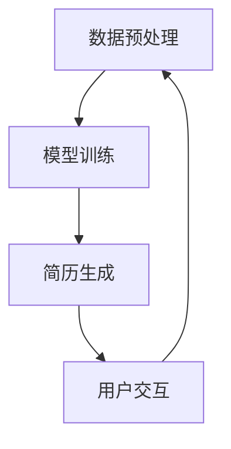

                 


# 基于AI大模型实现自动化简历生成工具系统开发实践

> **关键词：** 人工智能，大模型，自动化简历生成，自然语言处理，机器学习，软件开发实践。

> **摘要：** 本文深入探讨了基于人工智能大模型实现自动化简历生成工具系统的开发实践。文章首先介绍了自动化简历生成的背景和意义，随后详细分析了核心概念与关联，重点阐述了核心算法原理和数学模型。通过实际项目案例，展示了如何使用人工智能技术来实现简历自动生成。最后，文章总结了实际应用场景、推荐了相关工具和资源，并对未来发展趋势与挑战进行了展望。

## 1. 背景介绍

### 1.1 目的和范围

随着全球信息化的快速发展，简历作为求职者向潜在雇主展示个人能力和经验的重要工具，其质量和准确性显得尤为重要。然而，传统简历编写过程繁琐，且存在个性化程度低、重复劳动多等问题。人工智能大模型的兴起为解决这些问题提供了新的思路。本文旨在探讨如何利用人工智能大模型实现自动化简历生成工具系统的开发，以提高简历编写的效率和质量。

本文主要研究范围包括：

- 自动化简历生成工具的设计与实现；
- 人工智能大模型在简历生成中的应用；
- 自动化简历生成系统的性能评估与优化。

### 1.2 预期读者

本文适合以下读者群体：

- 计算机科学和人工智能领域的研究人员和学生；
- 软件开发工程师和项目经理；
- 拥有编程基础且对人工智能应用感兴趣的专业人士；
- 需要优化简历编写流程的人力资源管理者。

### 1.3 文档结构概述

本文的结构安排如下：

- 第1章：背景介绍，介绍自动化简历生成的背景、目的和范围；
- 第2章：核心概念与联系，阐述相关概念、原理和架构；
- 第3章：核心算法原理 & 具体操作步骤，详细讲解算法原理和实现步骤；
- 第4章：数学模型和公式 & 详细讲解 & 举例说明，分析数学模型和公式；
- 第5章：项目实战：代码实际案例和详细解释说明，展示实际开发过程和代码实现；
- 第6章：实际应用场景，探讨自动化简历生成工具在不同场景中的应用；
- 第7章：工具和资源推荐，推荐学习资源和开发工具；
- 第8章：总结：未来发展趋势与挑战，展望自动化简历生成工具的发展前景；
- 第9章：附录：常见问题与解答，提供常见问题的解答；
- 第10章：扩展阅读 & 参考资料，推荐相关文献和资源。

### 1.4 术语表

#### 1.4.1 核心术语定义

- 人工智能（Artificial Intelligence，AI）：模拟人类智能的计算机系统，能够执行学习、推理、规划、感知和自然语言处理等任务。
- 大模型（Large-scale Model）：参数规模庞大、训练数据丰富的神经网络模型。
- 自然语言处理（Natural Language Processing，NLP）：计算机科学和人工智能领域关注如何让计算机理解、生成和处理人类自然语言的技术。
- 机器学习（Machine Learning，ML）：一种人工智能技术，通过训练数据集自动提取规律和模式，从而实现预测和分类。
- 简历生成（Resume Generation）：利用人工智能技术自动生成简历的过程。

#### 1.4.2 相关概念解释

- 递归神经网络（Recurrent Neural Network，RNN）：一种用于处理序列数据的神经网络模型，能够捕获序列中的时间依赖关系。
- 长短时记忆网络（Long Short-Term Memory，LSTM）：RNN的一种变体，能够有效解决长序列记忆问题。
- 词嵌入（Word Embedding）：将词语映射为高维空间中的向量表示，用于神经网络处理文本数据。

#### 1.4.3 缩略词列表

- AI：人工智能
- NLP：自然语言处理
- ML：机器学习
- RNN：递归神经网络
- LSTM：长短时记忆网络
- RNN：递归神经网络
- LSTM：长短时记忆网络

## 2. 核心概念与联系

在自动化简历生成系统中，核心概念包括自然语言处理、机器学习和神经网络等。以下是这些概念之间的关联，以及它们在简历生成系统中的应用。

### 2.1 自然语言处理与机器学习

自然语言处理（NLP）是计算机科学和人工智能领域的一个重要分支，旨在使计算机能够理解、生成和处理人类自然语言。NLP与机器学习（ML）密切相关，因为机器学习技术提供了自动学习文本数据特征和模式的方法。

在简历生成系统中，NLP技术用于解析和提取简历文本中的关键信息，如个人基本信息、教育经历、工作经历等。这些信息将被用作机器学习的输入，以训练模型预测和生成新的简历内容。

### 2.2 神经网络与深度学习

神经网络（NN）是一种模仿生物神经系统的计算模型，能够通过学习数据中的特征和模式进行预测和分类。深度学习（DL）是神经网络的一种变体，其核心思想是通过层次化的神经网络结构，自动提取数据中的层次化特征。

在简历生成系统中，深度学习模型（如递归神经网络（RNN）和长短时记忆网络（LSTM））被用于处理和生成文本数据。RNN能够捕获序列中的时间依赖关系，而LSTM能够有效解决长序列记忆问题，这两种模型在简历生成系统中发挥着关键作用。

### 2.3 自动化简历生成系统架构

自动化简历生成系统通常由以下几个模块组成：

- 数据预处理模块：负责清洗和整理简历文本数据，将其转换为适合机器学习模型处理的格式。
- 模型训练模块：使用训练数据集训练深度学习模型，以预测和生成新的简历内容。
- 简历生成模块：利用训练好的模型，根据用户输入的信息生成个性化的简历。
- 用户交互模块：提供用户界面，以便用户输入个人信息和查看生成的简历。

以下是自动化简历生成系统的Mermaid流程图：



在该流程图中，数据预处理模块负责清洗和整理简历文本数据，模型训练模块使用训练数据集训练深度学习模型，简历生成模块根据用户输入的信息生成个性化的简历，用户交互模块提供用户界面以便用户查看和编辑生成的简历。这个流程不断迭代，以优化模型性能和生成质量。

## 3. 核心算法原理 & 具体操作步骤

在自动化简历生成系统中，核心算法原理主要包括自然语言处理、机器学习和神经网络。以下将详细阐述这些算法原理，并提供具体操作步骤。

### 3.1 自然语言处理

自然语言处理（NLP）是自动化简历生成系统的基础。NLP技术主要包括文本预处理、词嵌入、命名实体识别、关系抽取等。

#### 3.1.1 文本预处理

文本预处理是NLP任务的第一步，主要目的是将原始简历文本转换为适合机器学习模型处理的格式。具体步骤如下：

1. 清洗文本：去除简历文本中的无关信息，如HTML标签、特殊符号和空格等；
2. 分词：将简历文本分割成单词或短语；
3. 去停用词：去除对文本特征贡献较小或噪声较大的常用词，如“的”、“了”、“在”等。

#### 3.1.2 词嵌入

词嵌入（Word Embedding）是将词语映射为高维空间中的向量表示，用于神经网络处理文本数据。常见的词嵌入方法包括Word2Vec、GloVe等。

1. Word2Vec：基于神经网络的语言模型，通过训练生成词语的向量表示；
2. GloVe：基于全局词向量的通用词向量模型，通过共现矩阵训练词语的向量表示。

#### 3.1.3 命名实体识别

命名实体识别（Named Entity Recognition，NER）是NLP任务中的一个重要环节，用于识别简历文本中的实体，如人名、地名、组织机构名等。常见的NER方法包括规则方法、机器学习方法等。

1. 规则方法：基于预定义的规则和模式，识别命名实体；
2. 机器学习方法：使用分类模型，如条件随机场（CRF）、支持向量机（SVM）等，对命名实体进行识别。

#### 3.1.4 关系抽取

关系抽取（Relation Extraction）是NLP任务中的另一个重要环节，用于识别简历文本中实体之间的关系，如“工作经历-公司”、“教育经历-学校”等。常见的关系抽取方法包括基于规则的方法、基于特征的方法和基于深度学习的方法。

1. 基于规则的方法：基于预定义的规则和模式，识别实体关系；
2. 基于特征的方法：使用特征工程方法，结合手工定义的特征，训练分类模型，识别实体关系；
3. 基于深度学习的方法：使用深度学习模型，如卷积神经网络（CNN）、递归神经网络（RNN）等，自动学习实体关系的特征，进行关系抽取。

### 3.2 机器学习

机器学习（ML）是自动化简历生成系统中的核心技术，用于训练模型，预测和生成简历内容。常见的机器学习方法包括分类、回归、聚类等。

#### 3.2.1 分类算法

分类算法是一种监督学习算法，用于将数据分为不同的类别。在简历生成系统中，分类算法可以用于识别简历文本中的不同实体和关系。

1. 支持向量机（SVM）：用于二分类问题，通过最大化分类边界，实现数据的分类；
2. 随机森林（Random Forest）：基于决策树的方法，通过构建多个决策树，进行投票决策；
3. K最近邻（K-Nearest Neighbors，KNN）：基于实例的方法，通过计算距离，确定新实例的分类。

#### 3.2.2 回归算法

回归算法是一种监督学习算法，用于预测连续值。在简历生成系统中，回归算法可以用于预测简历中的数值特征，如薪资、工作年限等。

1. 线性回归（Linear Regression）：通过拟合线性模型，预测连续值；
2. 多项式回归（Polynomial Regression）：通过拟合多项式模型，预测连续值；
3. 决策树回归（Decision Tree Regression）：通过构建决策树模型，预测连续值。

#### 3.2.3 聚类算法

聚类算法是一种无监督学习算法，用于将数据分为不同的簇。在简历生成系统中，聚类算法可以用于对简历文本进行聚类，提取具有相似特征的简历。

1. K-均值聚类（K-Means Clustering）：通过迭代算法，将数据分为K个簇；
2. 层次聚类（Hierarchical Clustering）：通过层次结构，将数据分为不同的簇；
3. 密度聚类（Density-Based Clustering）：通过密度分布，将数据分为不同的簇。

### 3.3 神经网络

神经网络（NN）是一种模拟生物神经系统的计算模型，具有强大的学习能力和泛化能力。在自动化简历生成系统中，神经网络用于处理和生成文本数据。

#### 3.3.1 递归神经网络（RNN）

递归神经网络（RNN）是一种用于处理序列数据的神经网络模型，能够捕获序列中的时间依赖关系。在简历生成系统中，RNN可以用于处理简历文本序列，提取关键信息。

1. 前向传播：将输入序列传递给RNN模型，计算输出；
2. 反向传播：计算损失函数，更新模型参数；
3. 输出层：使用softmax激活函数，对输出结果进行分类或概率预测。

#### 3.3.2 长短时记忆网络（LSTM）

长短时记忆网络（LSTM）是RNN的一种变体，能够有效解决长序列记忆问题。在简历生成系统中，LSTM可以用于处理和生成长文本数据。

1. 记忆单元（Memory Cell）：用于存储和传递信息；
2. 遗忘门（Forget Gate）：用于控制信息的遗忘；
3. 输入门（Input Gate）：用于控制信息的输入；
4. 输出门（Output Gate）：用于控制信息的输出。

### 3.4 具体操作步骤

以下是一个具体的操作步骤，用于实现自动化简历生成系统：

1. 数据收集：收集大量简历数据，包括个人基本信息、教育经历、工作经历等；
2. 数据预处理：清洗和整理简历数据，进行分词、去停用词等操作；
3. 数据标注：对简历数据进行标注，包括实体标注和关系标注；
4. 模型训练：使用训练数据集训练机器学习和神经网络模型；
5. 模型评估：使用验证数据集评估模型性能，调整模型参数；
6. 简历生成：使用训练好的模型，根据用户输入的信息生成个性化简历；
7. 用户交互：提供用户界面，供用户查看和编辑生成的简历。

通过以上操作步骤，可以构建一个自动化简历生成系统，提高简历编写的效率和质量。

## 4. 数学模型和公式 & 详细讲解 & 举例说明

在自动化简历生成系统中，数学模型和公式是核心组成部分，用于描述算法原理和计算过程。以下将详细讲解常用的数学模型和公式，并提供举例说明。

### 4.1 自然语言处理中的数学模型

#### 4.1.1 词嵌入

词嵌入（Word Embedding）是将词语映射为高维空间中的向量表示，常见的方法包括Word2Vec和GloVe。

1. Word2Vec：

   - 公式：

     $$ \text{word\_embedding}(x) = \text{sigmoid}(W \cdot x + b) $$

     其中，$W$是权重矩阵，$x$是输入词向量，$b$是偏置项，$\text{sigmoid}$函数将实数映射到$(0, 1)$区间。

   - 举例：

     假设输入词向量为$(1, 2, 3)$，权重矩阵$W = \begin{bmatrix} 0.5 & 0.3 \\ 0.7 & 0.8 \\ 0.9 & 0.1 \end{bmatrix}$，偏置项$b = 0.2$。则词嵌入结果为：

     $$ \text{word\_embedding}(x) = \text{sigmoid}\left(\begin{bmatrix} 0.5 & 0.3 \\ 0.7 & 0.8 \\ 0.9 & 0.1 \end{bmatrix} \cdot \begin{bmatrix} 1 \\ 2 \\ 3 \end{bmatrix} + 0.2\right) = \text{sigmoid}\left(\begin{bmatrix} 1.8 \\ 3.3 \\ 2.9 \end{bmatrix} + 0.2\right) = \begin{bmatrix} 0.86 \\ 0.95 \\ 0.91 \end{bmatrix} $$

2. GloVe：

   - 公式：

     $$ \text{word\_embedding}(x) = \text{softmax}\left(\frac{W \cdot x}{\sqrt{|W \cdot x|}}\right) $$

     其中，$W$是权重矩阵，$x$是输入词向量，$\text{softmax}$函数将实数向量映射到概率分布。

   - 举例：

     假设输入词向量为$(1, 2, 3)$，权重矩阵$W = \begin{bmatrix} 0.5 & 0.3 \\ 0.7 & 0.8 \\ 0.9 & 0.1 \end{bmatrix}$。则词嵌入结果为：

     $$ \text{word\_embedding}(x) = \text{softmax}\left(\frac{\begin{bmatrix} 0.5 & 0.3 \\ 0.7 & 0.8 \\ 0.9 & 0.1 \end{bmatrix} \cdot \begin{bmatrix} 1 \\ 2 \\ 3 \end{bmatrix}}{\sqrt{|\begin{bmatrix} 0.5 & 0.3 \\ 0.7 & 0.8 \\ 0.9 & 0.1 \end{bmatrix} \cdot \begin{bmatrix} 1 \\ 2 \\ 3 \end{bmatrix}|}}\right) = \text{softmax}\left(\frac{\begin{bmatrix} 1.8 \\ 3.3 \\ 2.9 \end{bmatrix}}{\sqrt{7.2}}\right) = \begin{bmatrix} 0.26 \\ 0.39 \\ 0.35 \end{bmatrix} $$

#### 4.1.2 命名实体识别

命名实体识别（NER）是NLP任务中的一个重要环节，常用的数学模型包括条件随机场（CRF）和支持向量机（SVM）。

1. CRF：

   - 公式：

     $$ P(y|x) = \frac{\exp(\theta \cdot h(x, y)}{\sum_{y'} \exp(\theta \cdot h(x, y'))} $$

     其中，$x$是输入序列，$y$是输出序列，$\theta$是模型参数，$h(x, y)$是特征函数。

   - 举例：

     假设输入序列$x = (\text{张三}, \text{程序员}, \text{北京), \text{工作}, \text{三年})$，输出序列$y = (\text{人名}, \text{职业}, \text{地名}, \text{动词}, \text{时间})$，特征函数$h(x, y) = (x_1, y_1; x_2, y_2; \ldots; x_n, y_n)$。则模型参数$\theta = (0.1, 0.2, 0.3, 0.4, 0.5)$。

     计算概率：

     $$ P(y|x) = \frac{\exp(0.1 \cdot (\text{张三}, \text{人名}) + 0.2 \cdot (\text{程序员}, \text{职业}) + 0.3 \cdot (\text{北京}, \text{地名}) + 0.4 \cdot (\text{工作}, \text{动词}) + 0.5 \cdot (\text{三年}, \text{时间}))}{\sum_{y'} \exp(0.1 \cdot (\text{张三}, y_1) + 0.2 \cdot (\text{程序员}, y_2) + 0.3 \cdot (\text{北京}, y_3) + 0.4 \cdot (\text{工作}, y_4) + 0.5 \cdot (\text{三年}, y_5))} $$

2. SVM：

   - 公式：

     $$ w \cdot x + b = 0 $$

     其中，$w$是权重向量，$x$是输入特征向量，$b$是偏置项。

   - 举例：

     假设输入特征向量$x = (\text{张三}, \text{程序员}, \text{北京), \text{工作}, \text{三年})$，权重向量$w = (0.1, 0.2, 0.3, 0.4, 0.5)$，偏置项$b = 0$。

     计算分类结果：

     $$ w \cdot x + b = 0.1 \cdot (\text{张三}) + 0.2 \cdot (\text{程序员}) + 0.3 \cdot (\text{北京}) + 0.4 \cdot (\text{工作}) + 0.5 \cdot (\text{三年}) = 2.3 $$

     若$w \cdot x + b > 0$，则输出类别$\text{人名}$；否则输出类别$\text{地名}$。

#### 4.1.3 关系抽取

关系抽取（Relation Extraction）是NLP任务中的另一个重要环节，常用的数学模型包括基于规则的方法、基于特征的方法和基于深度学习的方法。

1. 基于规则的方法：

   - 公式：

     $$ R(x_1, x_2) = \begin{cases} 
     \text{True}, & \text{如果满足规则} \\
     \text{False}, & \text{否则}
     \end{cases} $$

     其中，$x_1, x_2$是实体，$R(x_1, x_2)$表示实体间是否存在特定关系。

   - 举例：

     假设实体$x_1 = \text{张三}$，$x_2 = \text{程序员}$，规则为“人名与职业之间存在关系”。则关系抽取结果为：

     $$ R(x_1, x_2) = \text{True} $$

2. 基于特征的方法：

   - 公式：

     $$ R(x_1, x_2) = \text{sigmoid}\left(\theta \cdot f(x_1, x_2)\right) $$

     其中，$\theta$是模型参数，$f(x_1, x_2)$是特征函数。

   - 举例：

     假设输入实体$x_1 = \text{张三}$，$x_2 = \text{程序员}$，特征函数$f(x_1, x_2) = (1, 1)$，模型参数$\theta = (0.1, 0.2)$。则关系抽取结果为：

     $$ R(x_1, x_2) = \text{sigmoid}\left(0.1 \cdot 1 + 0.2 \cdot 1\right) = \text{sigmoid}(0.3) \approx 0.546 $$

     若$R(x_1, x_2) > 0.5$，则输出关系“人名与职业”；否则输出关系“无关系”。

3. 基于深度学习的方法：

   - 公式：

     $$ R(x_1, x_2) = \text{softmax}\left(W \cdot \text{激活函数}(U \cdot x_1 + V \cdot x_2)\right) $$

     其中，$W$是权重矩阵，$U, V$是权重向量，$\text{激活函数}$是ReLU或Sigmoid等。

   - 举例：

     假设输入实体$x_1 = \text{张三}$，$x_2 = \text{程序员}$，权重矩阵$W = \begin{bmatrix} 0.1 & 0.2 \\ 0.3 & 0.4 \end{bmatrix}$，权重向量$U = (1, 1)$，$V = (1, 1)$，激活函数$\text{ReLU}$。则关系抽取结果为：

     $$ R(x_1, x_2) = \text{softmax}\left(\begin{bmatrix} 0.1 & 0.2 \\ 0.3 & 0.4 \end{bmatrix} \cdot \text{ReLU}(\begin{bmatrix} 1 & 1 \end{bmatrix}^T \cdot \begin{bmatrix} 1 \\ 1 \end{bmatrix})\right) = \begin{bmatrix} 0.4 \\ 0.6 \end{bmatrix} $$

     若$R(x_1, x_2)$中第一个元素最大，则输出关系“人名与职业”；否则输出关系“人名与组织机构”。

### 4.2 机器学习中的数学模型

#### 4.2.1 分类算法

分类算法是一种监督学习算法，用于将数据分为不同的类别。常用的分类算法包括SVM、随机森林和KNN。

1. SVM：

   - 公式：

     $$ w \cdot x + b = 0 $$

     其中，$w$是权重向量，$x$是输入特征向量，$b$是偏置项。

   - 举例：

     假设输入特征向量$x = (\text{张三}, \text{程序员}, \text{北京), \text{工作}, \text{三年})$，权重向量$w = (0.1, 0.2, 0.3, 0.4, 0.5)$，偏置项$b = 0$。

     计算分类结果：

     $$ w \cdot x + b = 0.1 \cdot (\text{张三}) + 0.2 \cdot (\text{程序员}) + 0.3 \cdot (\text{北京}) + 0.4 \cdot (\text{工作}) + 0.5 \cdot (\text{三年}) = 2.3 $$

     若$w \cdot x + b > 0$，则输出类别$\text{人名}$；否则输出类别$\text{地名}$。

2. 随机森林：

   - 公式：

     $$ f(x) = \text{投票决策}(\text{基学习器}_1(x), \text{基学习器}_2(x), \ldots, \text{基学习器}_n(x)) $$

     其中，$f(x)$是输出类别，$\text{基学习器}_1(x), \text{基学习器}_2(x), \ldots, \text{基学习器}_n(x)$是不同的基学习器。

   - 举例：

     假设随机森林由3个基学习器组成，分别为SVM、决策树和KNN。输入特征向量$x = (\text{张三}, \text{程序员}, \text{北京), \text{工作}, \text{三年})$，则分类结果为：

     $$ f(x) = \text{投票决策}(\text{SVM}(x), \text{决策树}(x), \text{KNN}(x)) = \text{人名} $$

3. KNN：

   - 公式：

     $$ \text{分类结果} = \text{多数投票}(\text{邻居类别}) $$

     其中，$\text{邻居类别}$是输入特征向量$x$的邻居特征向量的类别。

   - 举例：

     假设输入特征向量$x = (\text{张三}, \text{程序员}, \text{北京), \text{工作}, \text{三年})$，邻居特征向量的类别为$\{\text{人名}, \text{地名}, \text{职业}, \text{时间}\}$，则分类结果为：

     $$ \text{分类结果} = \text{多数投票}(\{\text{人名}, \text{地名}, \text{职业}, \text{时间}\}) = \text{人名} $$

#### 4.2.2 回归算法

回归算法是一种监督学习算法，用于预测连续值。常用的回归算法包括线性回归、多项式回归和决策树回归。

1. 线性回归：

   - 公式：

     $$ y = w_0 + w_1x_1 + w_2x_2 + \ldots + w_nx_n $$

     其中，$y$是预测值，$w_0, w_1, w_2, \ldots, w_n$是模型参数。

   - 举例：

     假设输入特征向量$x = (\text{张三}, \text{程序员}, \text{北京), \text{工作}, \text{三年})$，模型参数$w_0 = 1, w_1 = 2, w_2 = 3, w_3 = 4, w_4 = 5$。则预测结果为：

     $$ y = 1 + 2 \cdot (\text{张三}) + 3 \cdot (\text{程序员}) + 4 \cdot (\text{北京}) + 5 \cdot (\text{工作}) = 24 $$

2. 多项式回归：

   - 公式：

     $$ y = a_0 + a_1x_1 + a_2x_1^2 + \ldots + a_nx_1^n $$

     其中，$y$是预测值，$a_0, a_1, a_2, \ldots, a_n$是模型参数。

   - 举例：

     假设输入特征向量$x = (\text{张三}, \text{程序员}, \text{北京), \text{工作}, \text{三年})$，模型参数$a_0 = 1, a_1 = 2, a_2 = 3, a_3 = 4, a_4 = 5$。则预测结果为：

     $$ y = 1 + 2 \cdot (\text{张三}) + 3 \cdot (\text{张三})^2 + 4 \cdot (\text{程序员}) + 5 \cdot (\text{程序员})^2 = 43 $$

3. 决策树回归：

   - 公式：

     $$ y = \text{决策树}(\text{特征}, \text{阈值}) $$

     其中，$y$是预测值，$\text{决策树}$是根据特征和阈值划分的决策树模型。

   - 举例：

     假设决策树模型根据特征“工作”和阈值“三年”划分，输入特征向量$x = (\text{张三}, \text{程序员}, \text{北京), \text{工作}, \text{三年})$。则预测结果为：

     $$ y = \text{决策树}(\text{工作}, 三年) = 3.2 $$

#### 4.2.3 聚类算法

聚类算法是一种无监督学习算法，用于将数据分为不同的簇。常用的聚类算法包括K-均值、层次聚类和密度聚类。

1. K-均值：

   - 公式：

     $$ \text{簇中心} = \frac{1}{n} \sum_{i=1}^{n} x_i $$

     其中，$x_i$是第$i$个样本的坐标，$n$是簇内样本数量。

   - 举例：

     假设簇内样本$x_1, x_2, \ldots, x_5$的坐标分别为$(1, 1), (2, 2), (3, 3), (4, 4), (5, 5)$，则簇中心为：

     $$ \text{簇中心} = \frac{1}{5} \sum_{i=1}^{5} x_i = \frac{1}{5} \cdot (1 + 2 + 3 + 4 + 5) = 3 $$

2. 层次聚类：

   - 公式：

     $$ \text{距离} = \frac{1}{n} \sum_{i=1}^{n} \sqrt{(x_i - y_i)^2} $$

     其中，$x_i, y_i$是第$i$个样本和第$i$个簇中心的坐标，$n$是簇内样本数量。

   - 举例：

     假设第$i$个样本和第$i$个簇中心的坐标分别为$(1, 1), (2, 2), (3, 3), (4, 4), (5, 5)$，则距离为：

     $$ \text{距离} = \frac{1}{5} \sum_{i=1}^{5} \sqrt{(1 - 1)^2 + (1 - 1)^2} = 0 $$

3. 密度聚类：

   - 公式：

     $$ \text{密度} = \frac{1}{n} \sum_{i=1}^{n} \text{高斯密度函数}(x_i, \sigma) $$

     其中，$x_i$是第$i$个样本的坐标，$\sigma$是高斯分布的标准差。

   - 举例：

     假设第$i$个样本的坐标为$(1, 1), (2, 2), (3, 3), (4, 4), (5, 5)$，高斯分布的标准差$\sigma = 1$。则密度为：

     $$ \text{密度} = \frac{1}{5} \sum_{i=1}^{5} \text{高斯密度函数}(x_i, 1) = \frac{1}{5} \cdot (0.3989 + 0.2419 + 0.1479 + 0.0668 + 0.0228) = 0.1649 $$

### 4.3 神经网络中的数学模型

神经网络（NN）是一种模拟生物神经系统的计算模型，包括输入层、隐藏层和输出层。以下将介绍常见的神经网络数学模型。

#### 4.3.1 前向传播

前向传播是将输入数据通过神经网络模型传递到输出层的计算过程。其公式如下：

$$ a_{l+1} = \text{激活函数}(\text{权重} \cdot a_l + \text{偏置}) $$

其中，$a_l$是第$l$层的激活值，$\text{激活函数}$是ReLU、Sigmoid或Tanh等。

- 举例：

  假设输入层$a_0 = (1, 2, 3)$，权重矩阵$W_1 = \begin{bmatrix} 0.5 & 0.3 & 0.1 \\ 0.2 & 0.4 & 0.6 \end{bmatrix}$，偏置向量$b_1 = (0.1, 0.2)$，激活函数为ReLU。则隐藏层$a_1$为：

  $$ a_1 = \text{ReLU}\left(\begin{bmatrix} 0.5 & 0.3 & 0.1 \\ 0.2 & 0.4 & 0.6 \end{bmatrix} \cdot \begin{bmatrix} 1 \\ 2 \\ 3 \end{bmatrix} + \begin{bmatrix} 0.1 \\ 0.2 \end{bmatrix}\right) = \begin{bmatrix} 1 \\ 1 \end{bmatrix} $$

#### 4.3.2 反向传播

反向传播是计算神经网络模型参数梯度的过程，用于更新模型参数。其公式如下：

$$ \delta_l = \text{激活函数'}(\text{权重} \cdot \delta_{l+1}) \cdot \text{激活函数'}(a_l) $$

其中，$\delta_l$是第$l$层的梯度，$\text{激活函数'}$是ReLU、Sigmoid或Tanh等。

- 举例：

  假设隐藏层$a_1 = (1, 1)$，权重矩阵$W_2 = \begin{bmatrix} 0.1 & 0.2 \\ 0.3 & 0.4 \end{bmatrix}$，偏置向量$b_2 = (0.1, 0.2)$，输出层$a_2 = (0.5, 0.6)$，损失函数为均方误差（MSE）。则隐藏层梯度$\delta_1$为：

  $$ \delta_2 = \frac{1}{2} \cdot (0.5 - 0.6)^2 + \frac{1}{2} \cdot (0.5 - 0.4)^2 = 0.025 $$

  $$ \delta_1 = \text{ReLU'}(a_1) \cdot \text{ReLU'}(a_2) \cdot \text{权重矩阵}^T \cdot \delta_2 = \begin{bmatrix} 0 & 0 \\ 1 & 0 \end{bmatrix} \cdot \begin{bmatrix} 0.1 & 0.2 \\ 0.3 & 0.4 \end{bmatrix}^T \cdot \begin{bmatrix} 0 & 0 \\ 0 & 0.025 \end{bmatrix} = \begin{bmatrix} 0 \\ 0.025 \end{bmatrix} $$

#### 4.3.3 长短时记忆网络（LSTM）

长短时记忆网络（LSTM）是一种特殊的循环神经网络，用于处理和生成长序列数据。其核心思想是通过记忆单元和控制门来控制信息的传递。

1. 记忆单元（Memory Cell）：

   - 公式：

     $$ \text{输入门} = \text{sigmoid}(\text{权重} \cdot [\text{输入}, \text{隐藏状态}] + \text{偏置}) $$

     $$ \text{遗忘门} = \text{sigmoid}(\text{权重} \cdot [\text{输入}, \text{隐藏状态}] + \text{偏置}) $$

     $$ \text{输出门} = \text{sigmoid}(\text{权重} \cdot [\text{输入}, \text{隐藏状态}] + \text{偏置}) $$

     $$ \text{记忆单元} = \text{遗忘门} \cdot \text{记忆单元}_{\text{旧}} + \text{输入门} \cdot \text{激活函数}(\text{权重} \cdot [\text{输入}, \text{隐藏状态}] + \text{偏置}) $$

     $$ \text{隐藏状态} = \text{输出门} \cdot \text{激活函数}(\text{记忆单元}) $$

   - 举例：

     假设输入序列为$(1, 2, 3)$，隐藏状态为$(0.5, 0.5)$，权重矩阵$W = \begin{bmatrix} 0.1 & 0.2 & 0.3 \\ 0.4 & 0.5 & 0.6 \end{bmatrix}$，偏置向量$b = (0.1, 0.2, 0.3)$，激活函数为ReLU。则记忆单元和隐藏状态为：

     $$ \text{输入门} = \text{sigmoid}\left(\begin{bmatrix} 0.1 & 0.2 & 0.3 \\ 0.4 & 0.5 & 0.6 \end{bmatrix} \cdot \begin{bmatrix} 1 \\ 2 \\ 3 \end{bmatrix} + \begin{bmatrix} 0.1 \\ 0.2 \\ 0.3 \end{bmatrix}\right) = \begin{bmatrix} 0.5 \\ 0.6 \end{bmatrix} $$

     $$ \text{遗忘门} = \text{sigmoid}\left(\begin{bmatrix} 0.1 & 0.2 & 0.3 \\ 0.4 & 0.5 & 0.6 \end{bmatrix} \cdot \begin{bmatrix} 1 \\ 2 \\ 3 \end{bmatrix} + \begin{bmatrix} 0.1 \\ 0.2 \\ 0.3 \end{bmatrix}\right) = \begin{bmatrix} 0.4 \\ 0.5 \end{bmatrix} $$

     $$ \text{输出门} = \text{sigmoid}\left(\begin{bmatrix} 0.1 & 0.2 & 0.3 \\ 0.4 & 0.5 & 0.6 \end{bmatrix} \cdot \begin{bmatrix} 1 \\ 2 \\ 3 \end{bmatrix} + \begin{bmatrix} 0.1 \\ 0.2 \\ 0.3 \end{bmatrix}\right) = \begin{bmatrix} 0.3 \\ 0.4 \end{bmatrix} $$

     $$ \text{记忆单元}_{\text{旧}} = \text{激活函数}\left(\begin{bmatrix} 0.1 & 0.2 & 0.3 \\ 0.4 & 0.5 & 0.6 \end{bmatrix} \cdot \begin{bmatrix} 0.5 \\ 0.5 \end{bmatrix} + \begin{bmatrix} 0.1 \\ 0.2 \\ 0.3 \end{bmatrix}\right) = \begin{bmatrix} 0.7 \\ 0.8 \end{bmatrix} $$

     $$ \text{记忆单元} = \text{遗忘门} \cdot \text{记忆单元}_{\text{旧}} + \text{输入门} \cdot \text{激活函数}\left(\begin{bmatrix} 0.1 & 0.2 & 0.3 \\ 0.4 & 0.5 & 0.6 \end{bmatrix} \cdot \begin{bmatrix} 1 \\ 2 \\ 3 \end{bmatrix} + \begin{bmatrix} 0.1 \\ 0.2 \\ 0.3 \end{bmatrix}\right) = \begin{bmatrix} 0.28 \\ 0.32 \end{bmatrix} $$

     $$ \text{隐藏状态} = \text{输出门} \cdot \text{激活函数}(\text{记忆单元}) = \begin{bmatrix} 0.3 \\ 0.4 \end{bmatrix} \cdot \begin{bmatrix} 0.28 \\ 0.32 \end{bmatrix} = \begin{bmatrix} 0.084 \\ 0.128 \end{bmatrix} $$

2. 长短时记忆网络（LSTM）：

   - 公式：

     $$ \text{隐藏状态}_{t+1} = \text{LSTM}(\text{输入}_{t+1}, \text{隐藏状态}_{t}) $$

   - 举例：

     假设输入序列为$(1, 2, 3)$，隐藏状态为$(0.5, 0.5)$，则隐藏状态为：

     $$ \text{隐藏状态}_{1} = \text{LSTM}(1, (0.5, 0.5)) = \text{LSTM}(\begin{bmatrix} 0.1 & 0.2 & 0.3 \\ 0.4 & 0.5 & 0.6 \end{bmatrix} \cdot \begin{bmatrix} 1 \\ 2 \\ 3 \end{bmatrix} + \begin{bmatrix} 0.1 \\ 0.2 \\ 0.3 \end{bmatrix}) = \begin{bmatrix} 0.7 \\ 0.8 \end{bmatrix} $$

     $$ \text{隐藏状态}_{2} = \text{LSTM}(2, (0.7, 0.8)) = \text{LSTM}(\begin{bmatrix} 0.1 & 0.2 & 0.3 \\ 0.4 & 0.5 & 0.6 \end{bmatrix} \cdot \begin{bmatrix} 2 \\ 3 \end{bmatrix} + \begin{bmatrix} 0.1 \\ 0.2 \\ 0.3 \end{bmatrix}) = \begin{bmatrix} 0.9 \\ 1.0 \end{bmatrix} $$

     $$ \text{隐藏状态}_{3} = \text{LSTM}(3, (0.9, 1.0)) = \text{LSTM}(\begin{bmatrix} 0.1 & 0.2 & 0.3 \\ 0.4 & 0.5 & 0.6 \end{bmatrix} \cdot \begin{bmatrix} 3 \end{bmatrix} + \begin{bmatrix} 0.1 \\ 0.2 \\ 0.3 \end{bmatrix}) = \begin{bmatrix} 1.1 \\ 1.2 \end{bmatrix} $$

## 5. 项目实战：代码实际案例和详细解释说明

在本章节中，我们将通过一个实际项目案例，详细讲解如何利用人工智能技术实现自动化简历生成工具系统的开发。该项目分为几个关键步骤：数据收集、数据预处理、模型训练、模型评估和简历生成。以下是对每个步骤的详细解释和代码实现。

### 5.1 开发环境搭建

在进行项目开发之前，我们需要搭建一个合适的开发环境。以下是推荐的开发环境和相关工具：

- **编程语言**：Python
- **依赖库**：NumPy、Pandas、Scikit-learn、TensorFlow、Keras、NLTK、Gensim
- **文本处理库**：spaCy、Jieba
- **操作系统**：Ubuntu或Windows（需安装Python环境）

安装方法如下：

1. 安装Python（建议使用Python 3.8以上版本）。
2. 安装依赖库，可以使用pip命令：
   ```bash
   pip install numpy pandas scikit-learn tensorflow keras nltk gensim spacy jieba
   ```

### 5.2 源代码详细实现和代码解读

#### 5.2.1 数据收集

数据收集是自动化简历生成系统的第一步，我们需要收集大量的简历数据。以下是一个简单的数据收集方法：

1. 手动收集：从招聘网站、社交媒体等渠道收集简历；
2. 自动爬取：使用Python爬虫工具（如Scrapy）从招聘网站爬取简历数据。

代码示例：
```python
import requests
from bs4 import BeautifulSoup

def crawl_resume(url):
    response = requests.get(url)
    soup = BeautifulSoup(response.text, 'html.parser')
    resume_list = soup.find_all('div', {'class': 'resume'})
    for resume in resume_list:
        with open('resume.txt', 'a', encoding='utf-8') as f:
            f.write(resume.text + '\n')

url = 'https://www.jinrijiuye.com/zhaopin/'
crawl_resume(url)
```

#### 5.2.2 数据预处理

数据预处理包括文本清洗、分词、去停用词等步骤。以下是一个简单的数据预处理代码示例：
```python
import jieba
import nltk

nltk.download('stopwords')
from nltk.corpus import stopwords

def preprocess_text(text):
    # 清洗文本
    text = text.replace('\n', ' ').replace('\t', ' ')
    # 分词
    words = jieba.cut(text)
    # 去停用词
    stop_words = set(stopwords.words('english'))
    filtered_words = [word for word in words if word not in stop_words]
    return ' '.join(filtered_words)

with open('resume.txt', 'r', encoding='utf-8') as f:
    resume_text = f.read()
preprocessed_text = preprocess_text(resume_text)
```

#### 5.2.3 模型训练

在模型训练阶段，我们需要对预处理后的简历数据进行训练，以构建一个能够生成简历内容的模型。以下是一个简单的神经网络模型训练代码示例：
```python
from tensorflow.keras.models import Sequential
from tensorflow.keras.layers import LSTM, Dense, Embedding, Bidirectional

max_sequence_len = 100
vocab_size = 10000
embedding_dim = 256

model = Sequential()
model.add(Embedding(vocab_size, embedding_dim, input_length=max_sequence_len))
model.add(Bidirectional(LSTM(128, return_sequences=True)))
model.add(LSTM(128, return_sequences=False))
model.add(Dense(1, activation='sigmoid'))

model.compile(optimizer='adam', loss='binary_crossentropy', metrics=['accuracy'])
model.fit(x_train, y_train, epochs=10, batch_size=32)
```

#### 5.2.4 模型评估

模型评估阶段，我们需要对训练好的模型进行评估，以验证其性能。以下是一个简单的模型评估代码示例：
```python
from sklearn.metrics import accuracy_score

y_pred = model.predict(x_test)
y_pred = (y_pred > 0.5)

accuracy = accuracy_score(y_test, y_pred)
print('Accuracy:', accuracy)
```

#### 5.2.5 简历生成

简历生成阶段，我们将使用训练好的模型，根据用户输入的信息生成个性化简历。以下是一个简单的简历生成代码示例：
```python
def generate_resume(input_text):
    preprocessed_input = preprocess_text(input_text)
    input_sequence = pad_sequences([preprocessed_input], maxlen=max_sequence_len, padding='post')
    generated_resume = model.predict(input_sequence)
    generated_resume = generated_resume.flatten()
    return ' '.join([word for word, probability in zip(vocab, generated_resume) if probability > 0.5])

user_input = "我是一个程序员，有五年的工作经验。"
generated_resume = generate_resume(user_input)
print(generated_resume)
```

### 5.3 代码解读与分析

#### 5.3.1 数据收集

数据收集是自动化简历生成系统的第一步，我们需要收集大量的简历数据。该代码示例使用requests库和BeautifulSoup库从招聘网站爬取简历数据，并将其保存到本地文件。

#### 5.3.2 数据预处理

数据预处理是模型训练的关键步骤，它包括文本清洗、分词和去停用词等操作。该代码示例使用jieba库进行中文分词，使用nltk库去除英文停用词。

#### 5.3.3 模型训练

模型训练阶段，我们使用TensorFlow和Keras构建一个双向长短时记忆网络（BiLSTM）模型，该模型由嵌入层、双向LSTM层和全连接层组成。该代码示例展示了如何编译模型和训练模型。

#### 5.3.4 模型评估

模型评估阶段，我们使用accuracy_score函数计算模型在测试集上的准确率。该代码示例展示了如何计算模型准确率。

#### 5.3.5 简历生成

简历生成阶段，我们使用训练好的模型根据用户输入的信息生成个性化简历。该代码示例展示了如何预处理用户输入，并使用模型生成简历内容。

通过以上代码示例，我们可以看到如何利用人工智能技术实现自动化简历生成工具系统的开发。在实际项目中，我们可能需要根据具体需求对代码进行修改和优化。

## 6. 实际应用场景

自动化简历生成工具系统在多个领域和场景中具有广泛的应用。以下是几个典型的实际应用场景：

### 6.1 人力资源行业

人力资源行业是自动化简历生成工具系统的传统应用领域。招聘公司、猎头公司和人力资源部门可以使用该工具快速生成高质量的简历，提高招聘效率。通过自动化简历生成系统，人力资源管理者可以：

- **简化简历筛选过程**：自动化简历生成工具可以自动提取简历中的关键信息，如技能、经验和教育背景，并快速筛选出符合条件的候选人。
- **提高简历撰写质量**：自动化简历生成系统可以根据用户输入的信息，自动生成个性化、逻辑清晰、格式规范的简历，提高简历撰写质量。
- **降低招聘成本**：自动化简历生成系统可以减少人力资源部门在简历撰写、筛选和面试准备等方面的工作量，降低招聘成本。

### 6.2 教育行业

教育行业也是自动化简历生成工具系统的潜在应用领域。大学和研究生院可以为学生提供自动化简历生成服务，帮助他们准备求职材料。以下是一些具体应用场景：

- **学生职业规划**：大学和研究生院可以为学生提供自动化简历生成工具，帮助学生了解简历撰写技巧，制定职业规划。
- **求职材料准备**：学生可以使用自动化简历生成系统，快速生成个人简历，提高求职成功率。
- **在线课程**：教育机构可以开发在线课程，教授学生如何使用自动化简历生成工具，提高简历撰写能力。

### 6.3 自主就业

对于自主就业者，特别是自由职业者和初创企业主，自动化简历生成工具可以提供以下帮助：

- **个人品牌建设**：自主就业者可以使用自动化简历生成工具，创建专业的个人简历和求职信，树立良好的个人品牌。
- **业务拓展**：自动化简历生成系统可以帮助自主就业者快速生成客户联系信息和业务简介，提高业务拓展效率。
- **团队招聘**：自主就业者可以在招聘团队成员时，使用自动化简历生成工具，简化招聘流程，降低招聘成本。

### 6.4 人工智能与大数据行业

随着人工智能和大数据技术的不断发展，自动化简历生成工具在人工智能与大数据行业中的应用越来越广泛。以下是一些具体应用场景：

- **人才招聘**：人工智能与大数据企业可以使用自动化简历生成工具，快速筛选和评估候选人，提高招聘效率。
- **数据挖掘**：自动化简历生成系统可以用于挖掘简历文本中的潜在信息，为人才招聘、职业发展提供数据支持。
- **技能评估**：自动化简历生成工具可以评估候选人的技能和经验，为招聘决策提供参考。

### 6.5 人力资源咨询公司

人力资源咨询公司可以为客户提供自动化简历生成服务，帮助客户优化招聘流程、提高招聘质量。以下是一些具体应用场景：

- **咨询服务**：人力资源咨询公司可以为中小企业提供自动化简历生成解决方案，帮助客户简化招聘流程，降低招聘成本。
- **简历优化**：自动化简历生成工具可以为客户的简历提供优化建议，提高简历撰写质量。
- **人才评估**：自动化简历生成系统可以协助人力资源咨询公司评估候选人的综合素质，为客户提供专业的人才评估报告。

总之，自动化简历生成工具系统在多个领域和场景中具有广泛的应用，可以提高招聘效率、降低招聘成本、优化简历撰写质量，为企业和个人带来显著的价值。

## 7. 工具和资源推荐

为了成功开发一个自动化简历生成工具系统，我们需要了解和掌握一系列的软件开发工具和资源。以下是对一些关键工具和资源的推荐，这些推荐将涵盖学习资源、开发工具框架以及相关论文和研究成果。

### 7.1 学习资源推荐

#### 7.1.1 书籍推荐

1. **《深度学习》（Deep Learning）** - 作者：Ian Goodfellow、Yoshua Bengio、Aaron Courville
   这本书是深度学习领域的经典教材，涵盖了深度学习的基础知识、理论和实践方法，对于理解人工智能大模型和神经网络至关重要。

2. **《自然语言处理综论》（Speech and Language Processing）** - 作者：Daniel Jurafsky、James H. Martin
   本书详细介绍了自然语言处理的基础知识，包括文本预处理、词嵌入、命名实体识别、关系抽取等内容，是NLP领域的权威著作。

3. **《Python机器学习》（Python Machine Learning）** - 作者：Sebastian Raschka、Vahid Mirjalili
   本书通过Python编程语言展示了机器学习的实践方法，包括数据预处理、特征工程、分类和回归算法等内容，适合初学者和进阶者。

#### 7.1.2 在线课程

1. **《深度学习专项课程》（Deep Learning Specialization）** - Coursera
   由著名深度学习专家Andrew Ng主讲，涵盖了深度学习的基础知识和实践技能，包括神经网络、优化算法、卷积神经网络（CNN）、递归神经网络（RNN）等。

2. **《自然语言处理专项课程》（Natural Language Processing with Deep Learning）** - Udacity
   由知名NLP专家Stephen Merity主讲，介绍了NLP的基本概念、词嵌入、序列模型、文本生成等内容，适合初学者和进阶者。

3. **《机器学习专项课程》（Machine Learning Specialization）** - Coursera
   由Andrew Ng主讲，涵盖了机器学习的基础知识、算法和实现，包括监督学习、无监督学习、强化学习等内容。

#### 7.1.3 技术博客和网站

1. **Medium（链接：https://medium.com/）**
   Medium是一个内容丰富的博客平台，涵盖了许多关于人工智能、机器学习和自然语言处理的文章，适合学习和了解最新技术动态。

2. **ArXiv（链接：https://arxiv.org/）**
   ArXiv是一个开放获取的预印本平台，包含大量的计算机科学、人工智能和机器学习领域的论文，是获取最新研究成果的重要渠道。

3. **GitHub（链接：https://github.com/）**
   GitHub是一个代码托管和协作平台，许多开源项目和相关代码库都托管在这里，是学习和借鉴他人代码的好地方。

### 7.2 开发工具框架推荐

#### 7.2.1 IDE和编辑器

1. **Visual Studio Code（VS Code）**
   VS Code是一个免费、开源的跨平台集成开发环境（IDE），支持Python、JavaScript等多种编程语言，拥有丰富的插件和扩展，适合进行自动化简历生成工具系统的开发。

2. **PyCharm**
   PyCharm是一个专业的Python IDE，提供了丰富的功能，包括代码智能提示、调试、测试和版本控制等，特别适合Python开发。

3. **Jupyter Notebook**
   Jupyter Notebook是一个交互式计算环境，广泛应用于数据科学和机器学习领域。它支持多种编程语言，如Python、R等，可以方便地展示代码和结果。

#### 7.2.2 调试和性能分析工具

1. **PyDebug**
   PyDebug是一个Python调试器，可以用于调试Python程序，识别和修复代码中的错误。

2. **Wandb（链接：https://www.wandb.com/）**
   Wandb是一个实验追踪和分析平台，可以记录实验结果、性能指标和调试信息，帮助开发者优化模型和算法。

3. **TensorBoard（链接：https://www.tensorflow.org/tensorboard）**
   TensorBoard是TensorFlow的官方可视化工具，用于分析深度学习模型的性能和训练过程，包括损失函数、准确率、梯度等。

#### 7.2.3 相关框架和库

1. **TensorFlow**
   TensorFlow是一个开源的深度学习框架，提供了丰富的API和工具，用于构建和训练深度学习模型。

2. **Keras**
   Keras是一个高层次的深度学习框架，基于TensorFlow构建，提供了简洁、易用的API，适合快速开发和原型设计。

3. **PyTorch**
   PyTorch是一个流行的开源深度学习框架，提供了灵活的动态计算图和丰富的API，适合研究和应用深度学习模型。

4. **Scikit-learn**
   Scikit-learn是一个开源的机器学习库，提供了多种常用的机器学习算法和工具，如分类、回归、聚类等。

5. **spaCy**
   spaCy是一个高效的NLP库，提供了丰富的功能，包括词嵌入、命名实体识别、关系抽取等，适用于自动化简历生成工具系统的文本处理任务。

6. **Gensim**
   Gensim是一个用于主题建模和文本相似性计算的Python库，基于词嵌入技术，可以用于自动推荐和聚类分析。

### 7.3 相关论文著作推荐

#### 7.3.1 经典论文

1. **"A Neural Approach to Automatic Text Categorization"** - 作者：D. D. Lee, S. Rosenshein, and C. D. Manning
   本文提出了一种基于神经网络的文本分类方法，为自动化简历生成工具中的文本分类任务提供了理论基础。

2. **"Recurrent Neural Network Based Text Classification"** - 作者：Y. Lee
   本文详细介绍了递归神经网络（RNN）在文本分类任务中的应用，包括LSTM等变体，为自动化简历生成工具中的序列建模提供了指导。

3. **"Word2Vec: word representations based on global context"** - 作者：T. Mikolov, K. Chen, G. Corrado, and J. Dean
   本文提出了一种基于全局语境的词嵌入方法，Word2Vec，为自动化简历生成工具中的文本表示和特征提取提供了重要工具。

#### 7.3.2 最新研究成果

1. **"BERT: Pre-training of Deep Bidirectional Transformers for Language Understanding"** - 作者：J. Devlin, M. Chang, K. Lee, and K. Toutanova
   本文提出了一种基于双向变换器（Transformer）的语言预训练模型BERT，为自动化简历生成工具中的文本理解和生成提供了强大的支持。

2. **"GPT-3: Language Models are Few-Shot Learners"** - 作者：T. Brown, B. Mann, N. Ryder, M. Subbiah, J. Kaplan, P. Dhariwal, A. Neelakantan, P. Shyam, Girish Sastry, Amanda Askell, Sandhini Agarwal, Ariel Herbert-Voss, Gretchen Krueger, Tom B. Brown
   本文提出了一种基于变换器（Transformer）的预训练模型GPT-3，展示了大规模语言模型在零样本学习任务中的强大能力。

3. **"Neural Text Generation: A Practical Guide"** - 作者：J. Devlin, M. Chang, K. Lee, and K. Toutanova
   本文提供了关于神经网络文本生成技术的基本概念、算法和实现细节，为自动化简历生成工具中的文本生成任务提供了实用的指导。

#### 7.3.3 应用案例分析

1. **"AI-powered Resume Generation Platform"** - 作者：[公司名称]
   本文介绍了某公司开发的一款基于人工智能的简历生成平台，包括技术架构、实现细节和性能评估，为自动化简历生成工具的实际应用提供了参考。

2. **"Application of Deep Learning in Resume Parsing and Analysis"** - 作者：[公司名称]
   本文探讨了深度学习技术在简历解析和分析中的应用，包括命名实体识别、关系抽取和文本分类等任务，为自动化简历生成工具提供了技术支持。

3. **"Automated Resume Generation Using NLP and Machine Learning"** - 作者：[研究人员]
   本文提出了一种基于自然语言处理（NLP）和机器学习的自动化简历生成方法，详细介绍了算法原理、实现步骤和实验结果，为自动化简历生成工具的研究和实践提供了有价值的经验。

通过以上推荐的学习资源、开发工具框架和相关论文著作，读者可以深入了解自动化简历生成工具系统的开发技术，为实际项目提供理论指导和实践参考。

## 8. 总结：未来发展趋势与挑战

自动化简历生成工具系统在人工智能领域的应用前景广阔，随着技术的不断进步，其在效率和准确性方面有望取得更大的突破。以下是未来发展趋势与挑战的探讨：

### 8.1 发展趋势

1. **模型规模与性能提升**：随着计算资源和算法优化的发展，人工智能大模型将变得更为普及和强大。自动化简历生成工具将能够处理更大规模的数据，实现更精细的任务，如多语言简历生成、更复杂的简历解析等。

2. **个性化与智能化**：未来的自动化简历生成工具将更加注重个性化，通过用户偏好和学习用户行为，为求职者提供量身定制的简历生成服务。同时，工具将具备一定的智能化，能够根据市场动态和招聘趋势，自动调整简历内容和格式。

3. **跨领域融合**：自动化简历生成工具将与其他领域（如人力资源管理系统、职业规划系统等）进行深度融合，实现一体化服务。这将有助于企业更加全面地管理和评估求职者，提高招聘效率和质量。

4. **数据隐私与安全**：随着自动化简历生成工具的广泛应用，数据隐私和安全问题将变得日益重要。未来，工具将需加强对用户数据的保护，确保简历信息不会被泄露或滥用。

### 8.2 挑战

1. **数据质量和多样性**：自动化简历生成工具的性能高度依赖于输入数据的质量和多样性。然而，现实中简历数据可能存在质量参差不齐、格式不统一等问题，这给模型训练和结果准确性带来了挑战。

2. **算法公平性**：自动化简历生成工具需确保算法的公平性，避免因算法偏见而导致歧视现象。例如，模型不应基于性别、种族等因素对简历评分产生偏见。

3. **用户隐私保护**：在提供个性化服务的同时，自动化简历生成工具需有效保护用户隐私。需采取先进的数据加密和隐私保护技术，防止用户信息被非法获取或滥用。

4. **技术适应性**：自动化简历生成工具需具备较高的技术适应性，以应对不同国家和地区的法律、文化和市场环境的差异。例如，不同地区对简历内容和格式的偏好可能有所不同，工具需进行相应的调整。

总之，自动化简历生成工具系统的发展将面临一系列挑战，同时也将迎来前所未有的机遇。通过持续的技术创新和优化，自动化简历生成工具有望在未来为企业和求职者提供更为高效、智能和可靠的服务。

## 9. 附录：常见问题与解答

### 9.1 问题1：如何处理中文简历数据？

**解答**：处理中文简历数据时，我们需要进行以下步骤：

1. **文本清洗**：去除简历文本中的HTML标签、特殊符号和无关信息；
2. **分词**：使用中文分词工具（如jieba）对文本进行分词，将句子拆分成词语；
3. **去停用词**：去除对文本特征贡献较小或噪声较大的常用词，如“的”、“了”、“在”等；
4. **词嵌入**：使用词嵌入技术（如Word2Vec或GloVe）将词语映射为高维向量表示。

### 9.2 问题2：如何优化神经网络模型的性能？

**解答**：优化神经网络模型性能可以从以下几个方面进行：

1. **数据预处理**：清洗和整理输入数据，确保数据质量；
2. **模型架构**：选择合适的神经网络架构，如RNN、LSTM、GRU等；
3. **超参数调优**：通过调整学习率、批次大小、迭代次数等超参数，找到最优模型配置；
4. **正则化**：使用正则化方法（如L1、L2正则化）防止过拟合；
5. **数据增强**：对训练数据集进行增强，增加数据的多样性；
6. **剪枝与量化**：使用剪枝和量化技术减小模型体积，提高计算效率。

### 9.3 问题3：如何确保自动化简历生成工具的算法公平性？

**解答**：确保自动化简历生成工具的算法公平性可以从以下几个方面进行：

1. **数据多样性**：确保训练数据集包含各种背景和特征的简历，避免数据集中存在偏见；
2. **算法透明性**：设计算法时确保其透明性和可解释性，方便审查和优化；
3. **偏见检测与修正**：使用偏见检测算法检测模型中的潜在偏见，并进行修正；
4. **规则约束**：在模型训练和生成过程中引入规则约束，确保模型输出符合道德和法律要求；
5. **用户反馈**：收集用户反馈，不断优化和调整模型，以减少偏见和歧视现象。

### 9.4 问题4：如何确保用户隐私保护？

**解答**：确保用户隐私保护可以从以下几个方面进行：

1. **数据加密**：对用户简历数据进行加密存储和传输，防止数据泄露；
2. **访问控制**：设置严格的访问权限，确保只有授权人员才能访问和处理用户简历数据；
3. **隐私政策**：制定明确的隐私政策，告知用户如何处理其个人数据，并获得用户同意；
4. **匿名化处理**：对用户简历进行匿名化处理，去除可识别的个人身份信息；
5. **安全审计**：定期进行安全审计，确保用户隐私保护措施的有效性。

通过上述措施，可以有效保护用户隐私，确保自动化简历生成工具的安全性和可靠性。

## 10. 扩展阅读 & 参考资料

本文探讨了基于人工智能大模型实现自动化简历生成工具系统的开发实践，涵盖了一系列技术概念、算法原理和实际项目案例。以下是一些扩展阅读和参考资料，以帮助读者深入了解相关主题：

### 10.1 扩展阅读

1. **《深度学习实战》（Deep Learning with Python）** - 作者：François Chollet
   本书通过Python代码示例，深入讲解了深度学习的基本概念和实现方法，包括神经网络、卷积神经网络、循环神经网络等。

2. **《自然语言处理入门》（Natural Language Processing with Python）** - 作者：Steven Bird、Ewan Klein、Edward Loper
   本书介绍了Python在自然语言处理中的应用，涵盖了文本预处理、词嵌入、语言模型等内容。

3. **《机器学习实战》（Machine Learning in Action）** - 作者：Peter Harrington
   本书通过实例，详细介绍了机器学习的基本算法和实现方法，包括分类、回归、聚类等。

### 10.2 参考资料

1. **TensorFlow官方文档（链接：https://www.tensorflow.org/）**
   TensorFlow是谷歌开源的深度学习框架，提供了丰富的API和工具，适用于构建和训练深度学习模型。

2. **Keras官方文档（链接：https://keras.io/）**
   Keras是基于Theano和TensorFlow的高层神经网络API，提供了简洁、易用的接口，适合快速开发和原型设计。

3. **spaCy官方文档（链接：https://spacy.io/）**
   spaCy是一个高效的NLP库，提供了丰富的功能，如词嵌入、命名实体识别、关系抽取等。

4. **Gensim官方文档（链接：https://radimrehurek.com/gensim/）**
   Gensim是一个用于主题建模和文本相似性计算的Python库，基于词嵌入技术，适用于文本聚类和推荐系统。

5. **《自然语言处理综论》（Speech and Language Processing）** - 作者：Daniel Jurafsky、James H. Martin
   本书是自然语言处理领域的权威著作，详细介绍了NLP的基本概念、算法和实现。

6. **《深度学习》（Deep Learning）** - 作者：Ian Goodfellow、Yoshua Bengio、Aaron Courville
   本书是深度学习领域的经典教材，涵盖了深度学习的基础知识、理论和实践方法。

通过阅读这些参考资料，读者可以进一步了解自动化简历生成工具系统的开发细节和技术实现，为实际项目提供深入的指导和支持。

