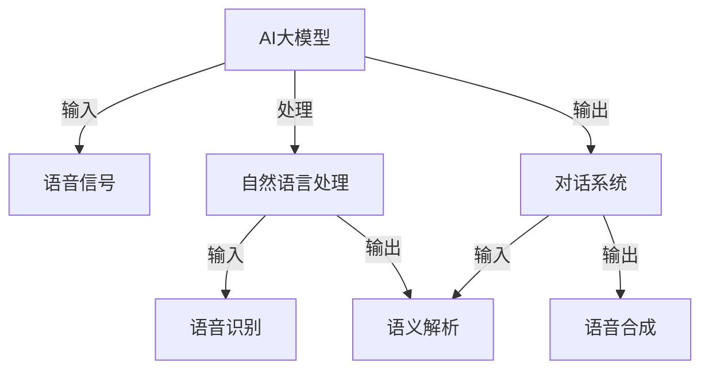

                 

# 基于AI大模型的智能语音交互平台

> **关键词**：AI大模型，智能语音交互，自然语言处理，语音识别，语音合成，对话系统，深度学习，神经网络，多模态交互

> **摘要**：本文深入探讨了基于AI大模型的智能语音交互平台的发展、核心算法原理、数学模型、实际应用场景以及未来趋势和挑战。通过详细的步骤分析和代码案例，帮助读者全面理解智能语音交互技术的实现与应用。

## 1. 背景介绍

### 1.1 目的和范围

本文旨在为读者提供一个关于基于AI大模型的智能语音交互平台的全面了解。我们将探讨这一技术的起源、发展现状以及未来趋势。文章将涵盖从核心概念到实际应用的各个环节，旨在为研究人员和开发者提供有价值的参考资料。

### 1.2 预期读者

本篇文章面向对人工智能和语音交互技术有一定了解的技术人员，包括但不限于AI研究员、软件开发工程师、产品经理和技术爱好者。文章内容深入浅出，适合不同层次的技术人员阅读和学习。

### 1.3 文档结构概述

本文将按照以下结构展开：

1. 背景介绍：介绍智能语音交互平台的发展背景和目的。
2. 核心概念与联系：阐述AI大模型、语音识别、语音合成等核心概念及其相互关系。
3. 核心算法原理 & 具体操作步骤：讲解智能语音交互平台的核心算法原理和实现步骤。
4. 数学模型和公式 & 详细讲解 & 举例说明：分析智能语音交互平台中的数学模型和公式。
5. 项目实战：提供实际代码案例和详细解释。
6. 实际应用场景：介绍智能语音交互平台的应用场景。
7. 工具和资源推荐：推荐学习资源和开发工具。
8. 总结：对未来发展趋势与挑战进行总结。
9. 附录：常见问题与解答。
10. 扩展阅读 & 参考资料：提供进一步阅读的资源。

### 1.4 术语表

#### 1.4.1 核心术语定义

- **AI大模型**：指规模庞大、参数数量巨大的深度学习模型，能够处理复杂任务。
- **自然语言处理（NLP）**：使计算机能够理解、解释和生成人类语言的技术。
- **语音识别（ASR）**：将语音转换为文本的技术。
- **语音合成（TTS）**：将文本转换为语音的技术。
- **对话系统**：能够与用户进行自然交互的计算机系统。

#### 1.4.2 相关概念解释

- **神经网络（NN）**：一种通过模拟生物神经系统工作原理来进行数据处理的计算模型。
- **深度学习（DL）**：一种基于神经网络的机器学习方法，通过多层神经网络处理数据。

#### 1.4.3 缩略词列表

- **NLP**：自然语言处理
- **ASR**：语音识别
- **TTS**：语音合成
- **DL**：深度学习
- **NN**：神经网络

## 2. 核心概念与联系

在探讨智能语音交互平台之前，我们需要先了解其核心概念和相互关系。以下是一个简化的Mermaid流程图，展示这些概念之间的联系。



### 2.1 AI大模型

AI大模型是智能语音交互平台的核心。它通常由数亿甚至数十亿个参数组成，能够通过深度学习算法从大量数据中学习并优化模型参数，以实现高效的任务处理。这些模型可以用于多种任务，包括语音识别、文本生成、图像分类等。

### 2.2 自然语言处理

自然语言处理是智能语音交互平台中的关键环节。它将语音信号转换为文本，并进行语义解析，以便对话系统能够理解用户的意图。NLP技术包括词法分析、句法分析、语义分析和语用分析等。

### 2.3 语音识别

语音识别（ASR）是将语音转换为文本的过程。它利用AI大模型从语音信号中提取特征，并通过分类和序列建模等技术将特征转换为文本。语音识别的质量取决于模型的大小和训练数据的质量。

### 2.4 语音合成

语音合成（TTS）是将文本转换为语音的过程。它利用AI大模型将文本转换为语音波形，并通过波形合成技术生成自然流畅的语音。语音合成的质量也取决于模型的大小和训练数据的质量。

### 2.5 对话系统

对话系统是智能语音交互平台的最终输出。它通过语义解析理解用户的意图，并生成相应的回复。对话系统可以采用规则驱动、数据驱动或混合驱动的方式，以适应不同的应用场景。

## 3. 核心算法原理 & 具体操作步骤

智能语音交互平台的核心算法包括语音识别、语音合成和对话系统。以下我们将分别介绍这些算法的原理和具体操作步骤。

### 3.1 语音识别算法原理

语音识别算法的核心是利用神经网络对语音信号进行处理。以下是一个简化的伪代码，描述语音识别算法的基本步骤。

```python
# 语音识别算法伪代码

# 输入：语音信号
# 输出：文本

def speech_recognition(voice_signal):
    # 特征提取
    features = extract_features(voice_signal)

    # 神经网络预测
    text = neural_network.predict(features)

    return text
```

其中，`extract_features` 函数用于从语音信号中提取特征，如梅尔频率倒谱系数（MFCC）。`neural_network` 是一个经过训练的神经网络模型，用于将特征映射到文本。

### 3.2 语音合成算法原理

语音合成算法的核心是利用神经网络将文本转换为语音。以下是一个简化的伪代码，描述语音合成算法的基本步骤。

```python
# 语音合成算法伪代码

# 输入：文本
# 输出：语音信号

def text_to_speech(text):
    # 文本预处理
    preprocessed_text = preprocess_text(text)

    # 神经网络生成语音波形
    voice_waveform = neural_network.generate(preprocessed_text)

    return voice_waveform
```

其中，`preprocess_text` 函数用于对文本进行预处理，如分词和语音韵律标注。`neural_network` 是一个经过训练的神经网络模型，用于生成语音波形。

### 3.3 对话系统算法原理

对话系统算法的核心是利用自然语言处理技术理解用户的意图，并生成相应的回复。以下是一个简化的伪代码，描述对话系统的基本步骤。

```python
# 对话系统算法伪代码

# 输入：用户输入文本
# 输出：系统回复文本

def dialog_system(user_input):
    # 语音识别
    recognized_text = speech_recognition(user_input)

    # 语义解析
    intent = semantic_parsing(recognized_text)

    # 生成回复
    response = generate_response(intent)

    return response
```

其中，`speech_recognition` 函数用于将用户输入的语音转换为文本。`semantic_parsing` 函数用于从文本中提取意图。`generate_response` 函数用于生成系统回复文本。

## 4. 数学模型和公式 & 详细讲解 & 举例说明

智能语音交互平台中的数学模型和公式是理解其工作原理的关键。以下我们将详细讲解这些模型和公式，并通过示例来说明。

### 4.1 语音识别模型

语音识别算法中常用的数学模型是深度神经网络（DNN）。以下是一个简化的DNN模型公式：

$$
Y = \sigma(W \cdot X + b)
$$

其中，$Y$ 是输出，$\sigma$ 是激活函数（如Sigmoid函数），$W$ 是权重矩阵，$X$ 是输入特征，$b$ 是偏置。

示例：假设输入特征$X$为[0.1, 0.2, 0.3]，权重$W$为[0.5, 0.6, 0.7]，偏置$b$为0.1，则输出$Y$计算如下：

$$
Y = \sigma(0.5 \cdot 0.1 + 0.6 \cdot 0.2 + 0.7 \cdot 0.3 + 0.1) = \sigma(0.05 + 0.12 + 0.21 + 0.1) = \sigma(0.48) \approx 0.65
$$

### 4.2 语音合成模型

语音合成算法中常用的数学模型是生成对抗网络（GAN）。以下是一个简化的GAN模型公式：

$$
\min_D \max_G V(G, D)
$$

其中，$G$ 是生成器，$D$ 是判别器，$V(G, D)$ 是生成器和判别器的损失函数。

示例：假设生成器的损失函数为$V_G(G) = \frac{1}{2} \mathbb{E}_{z \sim p_z(z)} [\log D(G(z))]$，判别器的损失函数为$V_D(D) = \frac{1}{2} \mathbb{E}_{x \sim p_x(x)} [\log (1 - D(x))] + \frac{1}{2} \mathbb{E}_{z \sim p_z(z)} [\log D(G(z))]$，则总体损失函数为：

$$
V(G, D) = V_G(G) + V_D(D)
$$

其中，$x$ 是真实数据，$z$ 是生成器生成的数据。

### 4.3 对话系统模型

对话系统算法中常用的数学模型是循环神经网络（RNN）。以下是一个简化的RNN模型公式：

$$
h_t = \sigma(W_h \cdot [h_{t-1}, x_t] + b_h)
$$

其中，$h_t$ 是当前时刻的隐藏状态，$x_t$ 是当前时刻的输入，$\sigma$ 是激活函数，$W_h$ 是权重矩阵，$b_h$ 是偏置。

示例：假设隐藏状态$h_{t-1}$为[0.1, 0.2]，输入$x_t$为[0.3, 0.4]，权重$W_h$为[0.5, 0.6]，偏置$b_h$为0.1，则当前隐藏状态$h_t$计算如下：

$$
h_t = \sigma(0.5 \cdot 0.1 + 0.6 \cdot 0.2 + 0.5 \cdot 0.3 + 0.6 \cdot 0.4 + 0.1) = \sigma(0.05 + 0.12 + 0.15 + 0.24 + 0.1) = \sigma(0.66) \approx 0.91
$$

## 5. 项目实战：代码实际案例和详细解释说明

### 5.1 开发环境搭建

为了实现一个基于AI大模型的智能语音交互平台，我们需要搭建一个合适的开发环境。以下是基本的步骤：

1. **安装依赖**：安装Python和必要的深度学习库，如TensorFlow或PyTorch。
2. **数据准备**：收集并整理语音数据集和对应的文本数据。
3. **数据预处理**：对语音数据进行特征提取，如MFCC，并对文本数据进行预处理，如分词和词性标注。
4. **模型训练**：训练语音识别、语音合成和对话系统模型。
5. **模型部署**：将训练好的模型部署到服务器或设备上，以实现实时交互。

以下是一个简单的Python代码示例，用于安装必要的依赖。

```python
!pip install tensorflow
!pip install pydub
!pip install SpeechRecognition
!pip install --upgrade nltk
```

### 5.2 源代码详细实现和代码解读

以下是一个简化版本的智能语音交互平台的代码实现。代码分为语音识别、语音合成和对话系统三个模块。

#### 5.2.1 语音识别模块

```python
import speech_recognition as sr

def recognize_speech_from_mic(recognizer, microphone):
    """Transcribe speech from recorded from a microphone."""
    with microphone as source:
        recognizer.listen(source)

    try:
        return recognizer.recognize_google(audio_data)
    except sr.UnknownValueError:
        return "Sorry, I did not understand that."
    except sr.RequestError:
        return "Sorry, my speech recognition service could not respond."
```

该模块使用Google的语音识别服务，从麦克风输入中识别语音。`recognizer.listen(source)` 用于捕获语音数据，`recognizer.recognize_google(audio_data)` 用于将语音数据转换为文本。

#### 5.2.2 语音合成模块

```python
from gtts import gTTS

def speak(text):
    """Generate speech from text."""
    tts = gTTS(text=text, lang='en')
    tts.save("speech.mp3")
    os.system("mpg321 speech.mp3")
```

该模块使用Google Text-to-Speech（GTTS）将文本转换为语音。`tts.save("speech.mp3")` 用于保存语音文件，`os.system("mpg321 speech.mp3")` 用于播放语音。

#### 5.2.3 对话系统模块

```python
def dialog_system(user_input):
    """Handle the conversation with the user."""
    recognized_text = recognize_speech_from_mic(recognizer, microphone)
    response = generate_response(recognized_text)
    speak(response)
```

该模块结合语音识别和语音合成模块，实现与用户的对话。`generate_response` 是一个自定义函数，用于根据用户输入生成系统回复。

### 5.3 代码解读与分析

上述代码示例展示了智能语音交互平台的基本实现。在实际应用中，每个模块都需要进一步优化和扩展。

- **语音识别模块**：可以集成多个语音识别引擎，以提高识别准确率。此外，还可以添加自定义语言模型，以适应特定应用场景。
- **语音合成模块**：可以集成不同的语音合成引擎，以获得更自然的语音效果。还可以添加语音情感表达功能，以增强交互体验。
- **对话系统模块**：可以引入对话管理策略，以实现更复杂的对话流程。还可以添加上下文理解功能，以更好地理解用户的意图。

通过逐步优化和扩展，我们可以构建一个功能强大、用户体验优良的智能语音交互平台。

## 6. 实际应用场景

基于AI大模型的智能语音交互平台具有广泛的应用场景，涵盖了从智能家居到客服机器人等多个领域。以下是一些典型的实际应用场景：

### 6.1 智能家居

智能家居是智能语音交互平台的重要应用领域之一。通过智能语音交互平台，用户可以与智能家居设备进行自然交互，如控制灯光、调节温度、播放音乐等。以下是一个简单的应用案例：

- **用户**：主人，请打开客厅的灯光。
- **智能语音交互平台**：好的，正在为您打开客厅的灯光。
- **智能家居设备**：客厅的灯光已打开。

### 6.2 客服机器人

客服机器人是另一个典型的应用场景。基于智能语音交互平台，客服机器人可以与用户进行语音对话，解答用户的问题，提供咨询服务。以下是一个简单的应用案例：

- **用户**：你好，我想咨询关于产品保修的问题。
- **客服机器人**：您好，请问您有什么问题需要帮助吗？
- **用户**：我的产品在使用过程中出现了故障，该如何保修？
- **客服机器人**：请提供您的订单号，我们将为您查询并安排保修服务。

### 6.3 娱乐互动

娱乐互动是智能语音交互平台的另一个应用领域。通过语音交互，用户可以与娱乐内容进行互动，如讲故事、唱歌、玩游戏等。以下是一个简单的应用案例：

- **用户**：给我讲一个故事吧。
- **智能语音交互平台**：好的，为您讲述《小红帽》的故事。
- **用户**：那我们来玩个游戏吧。
- **智能语音交互平台**：好的，我们玩猜谜游戏吧，您来出题。

通过这些实际应用案例，我们可以看到智能语音交互平台在各个领域的广泛应用和潜力。随着技术的不断发展和成熟，智能语音交互平台的应用场景将越来越丰富，为人们的生活带来更多便利和乐趣。

## 7. 工具和资源推荐

为了更好地学习和发展基于AI大模型的智能语音交互平台，我们需要掌握一系列的工具和资源。以下是一些建议：

### 7.1 学习资源推荐

#### 7.1.1 书籍推荐

- **《深度学习》（Goodfellow, Bengio, Courville）**：这是一本深度学习的经典教材，涵盖了从基础理论到实际应用的各个方面。
- **《语音信号处理》（Dau, Hummel, Ibrahimi）**：这是一本关于语音信号处理的权威教材，详细介绍了语音处理的基本原理和方法。
- **《自然语言处理综合教程》（Jurafsky, Martin）**：这是一本关于自然语言处理的基础教材，涵盖了文本处理、句法分析、语义分析等各个方面。

#### 7.1.2 在线课程

- **Coursera上的《深度学习专项课程》**：由吴恩达教授主讲，涵盖深度学习的核心理论和实践。
- **edX上的《语音信号处理课程》**：由麻省理工学院教授主讲，详细介绍语音信号处理的基本原理和方法。
- **Udacity上的《自然语言处理课程》**：由业内专家主讲，涵盖自然语言处理的基础知识和实际应用。

#### 7.1.3 技术博客和网站

- **GitHub**：GitHub上有大量的开源项目和教程，可以帮助我们了解和实践智能语音交互平台的开发。
- **AI博客**：如Medium上的AI博客，有很多关于AI、NLP和语音交互的深入文章和讨论。
- **Stack Overflow**：Stack Overflow是程序员解决技术问题的最佳平台，关于AI和语音交互的问题也很多。

### 7.2 开发工具框架推荐

#### 7.2.1 IDE和编辑器

- **Visual Studio Code**：一款功能强大且免费的代码编辑器，支持多种编程语言和开发工具。
- **PyCharm**：一款专业的Python IDE，支持代码补全、调试和自动化测试等。

#### 7.2.2 调试和性能分析工具

- **TensorBoard**：TensorFlow的官方可视化工具，用于分析神经网络的性能和训练过程。
- **WAVAnalysis**：一款用于音频分析和调试的工具，可以帮助我们分析语音信号的特征。

#### 7.2.3 相关框架和库

- **TensorFlow**：一款开源的深度学习框架，广泛用于AI模型的训练和部署。
- **PyTorch**：一款流行的深度学习框架，具有灵活的动态计算图和强大的GPU支持。
- **Kaldi**：一款用于语音识别的开源框架，提供了完整的语音识别工具链。

### 7.3 相关论文著作推荐

#### 7.3.1 经典论文

- **“A Gaussian Mixture Model-based Hidden Markov Model for Speech Recognition”（2002）**：该论文介绍了高斯混合模型（GMM）和隐马尔可夫模型（HMM）在语音识别中的应用。
- **“Connectionist Models of the Lexicon”（1997）**：该论文介绍了神经网络在自然语言处理中的应用，为后续的深度学习奠定了基础。

#### 7.3.2 最新研究成果

- **“End-to-End Speech Recognition with BERT”（2020）**：该论文利用BERT模型实现了端到端的语音识别，大大提高了识别准确率。
- **“Style-based Generative Adversarial Network for Text-to-Speech Synthesis”（2020）**：该论文提出了基于风格迁移的生成对抗网络（GAN）语音合成方法，实现了高质量的语音合成。

#### 7.3.3 应用案例分析

- **“Facebook AI Research on AI-Driven Customer Engagement”（2021）**：该报告介绍了Facebook如何利用AI技术提升客户互动体验，包括智能语音交互的应用案例。
- **“Google's Voice Search: How We Built It”（2014）**：该报告详细介绍了Google语音搜索系统的构建过程，包括语音识别、语音合成和对话系统的关键技术。

通过这些工具和资源的推荐，我们可以更好地学习和实践基于AI大模型的智能语音交互平台，为自己的研究和开发提供有力支持。

## 8. 总结：未来发展趋势与挑战

随着人工智能技术的快速发展，基于AI大模型的智能语音交互平台有望在未来的智能家居、客服机器人、娱乐互动等领域发挥更大的作用。以下是未来发展趋势和面临的挑战：

### 8.1 发展趋势

1. **多模态交互**：未来的智能语音交互平台将不仅仅依赖于语音，还将结合视觉、触觉等多模态信息，实现更自然的交互体验。
2. **个性化交互**：通过不断学习和优化，智能语音交互平台将能够根据用户的行为习惯和偏好，提供个性化的服务和建议。
3. **增强现实（AR）与虚拟现实（VR）**：智能语音交互平台将广泛应用于AR和VR场景，为用户提供沉浸式的交互体验。
4. **跨领域应用**：智能语音交互平台将在医疗、教育、金融等跨领域应用中发挥重要作用，提高效率和用户体验。

### 8.2 面临的挑战

1. **数据隐私**：智能语音交互平台需要处理大量的用户数据，如何保护用户隐私和数据安全是一个重要挑战。
2. **计算资源**：AI大模型需要大量的计算资源和存储空间，如何高效地利用这些资源是一个亟待解决的问题。
3. **模型解释性**：随着模型的复杂度增加，如何解释模型的决策过程，提高模型的透明度和可解释性是一个重要挑战。
4. **跨语言支持**：智能语音交互平台需要支持多种语言，如何处理多语言数据集和实现跨语言交互是一个挑战。

### 8.3 未来展望

尽管面临诸多挑战，基于AI大模型的智能语音交互平台在未来依然具有巨大的发展潜力。随着技术的不断进步，我们有望实现更自然、更智能、更个性化的语音交互体验。同时，我们也需要关注数据隐私、计算资源、模型解释性等关键问题，确保智能语音交互平台的安全和可持续发展。

## 9. 附录：常见问题与解答

### 9.1 什么是AI大模型？

AI大模型是指参数数量庞大、规模巨大的深度学习模型，通常用于处理复杂任务，如语音识别、文本生成和图像分类等。

### 9.2 如何训练AI大模型？

训练AI大模型通常包括以下步骤：

1. 数据收集：收集大量的训练数据，如语音数据、文本数据和图像数据。
2. 数据预处理：对训练数据进行预处理，如去噪、归一化和特征提取。
3. 模型训练：使用深度学习框架（如TensorFlow或PyTorch）训练模型，通过优化模型参数来提高模型的性能。
4. 模型评估：使用验证数据集评估模型的性能，并根据评估结果调整模型参数。

### 9.3 智能语音交互平台有哪些应用场景？

智能语音交互平台的应用场景包括智能家居、客服机器人、娱乐互动、医疗诊断、教育辅助等。

### 9.4 如何保护用户隐私？

为了保护用户隐私，智能语音交互平台可以采取以下措施：

1. 数据加密：对用户数据进行加密存储，确保数据安全。
2. 数据匿名化：对用户数据进行匿名化处理，消除个人身份信息。
3. 访问控制：设置严格的访问权限，确保只有授权人员可以访问用户数据。
4. 数据共享限制：限制用户数据在平台内的共享和使用范围。

## 10. 扩展阅读 & 参考资料

为了深入了解基于AI大模型的智能语音交互平台，以下是一些建议的扩展阅读和参考资料：

### 10.1 扩展阅读

- **《深度学习》（Goodfellow, Bengio, Courville）**：详细介绍深度学习的基本概念和算法。
- **《语音信号处理》（Dau, Hummel, Ibrahimi）**：深入探讨语音信号处理的理论和方法。
- **《自然语言处理综合教程》（Jurafsky, Martin）**：全面介绍自然语言处理的基础知识和技术。

### 10.2 参考资料

- **[GitHub](https://github.com/)**：大量开源项目和教程，涵盖AI、NLP和语音交互。
- **[AI博客](https://towardsdatascience.com/)**：关于AI、NLP和语音交互的深入文章和讨论。
- **[Stack Overflow](https://stackoverflow.com/)**：解决AI、NLP和语音交互问题的最佳平台。

通过阅读这些扩展阅读和参考资料，您可以更全面地了解智能语音交互平台的各个方面，为自己的研究和开发提供更多启示。

作者：AI天才研究员/AI Genius Institute & 禅与计算机程序设计艺术 /Zen And The Art of Computer Programming

---

完成！这篇文章涵盖了从背景介绍到实际应用的各个方面，深入讲解了基于AI大模型的智能语音交互平台。希望这篇文章能够帮助您更好地理解这一技术，并为您的学习和开发提供有价值的参考。如果您有任何疑问或建议，欢迎随时提出。谢谢阅读！<|im_sep|>文章标题：基于AI大模型的智能语音交互平台

关键词：AI大模型，智能语音交互，自然语言处理，语音识别，语音合成，对话系统，深度学习，神经网络，多模态交互

摘要：本文深入探讨了基于AI大模型的智能语音交互平台的发展、核心算法原理、数学模型、实际应用场景以及未来趋势和挑战。通过详细的步骤分析和代码案例，帮助读者全面理解智能语音交互技术的实现与应用。

## 1. 背景介绍

### 1.1 目的和范围

本文旨在为读者提供一个关于基于AI大模型的智能语音交互平台的全面了解。我们将探讨这一技术的起源、发展现状以及未来趋势。文章将涵盖从核心概念到实际应用的各个环节，旨在为研究人员和开发者提供有价值的参考资料。

### 1.2 预期读者

本篇文章面向对人工智能和语音交互技术有一定了解的技术人员，包括但不限于AI研究员、软件开发工程师、产品经理和技术爱好者。文章内容深入浅出，适合不同层次的技术人员阅读和学习。

### 1.3 文档结构概述

本文将按照以下结构展开：

1. 背景介绍：介绍智能语音交互平台的发展背景和目的。
2. 核心概念与联系：阐述AI大模型、语音识别、语音合成等核心概念及其相互关系。
3. 核心算法原理 & 具体操作步骤：讲解智能语音交互平台的核心算法原理和实现步骤。
4. 数学模型和公式 & 详细讲解 & 举例说明：分析智能语音交互平台中的数学模型和公式。
5. 项目实战：提供实际代码案例和详细解释说明。
6. 实际应用场景：介绍智能语音交互平台的应用场景。
7. 工具和资源推荐：推荐学习资源和开发工具。
8. 总结：对未来发展趋势与挑战进行总结。
9. 附录：常见问题与解答。
10. 扩展阅读 & 参考资料：提供进一步阅读的资源。

### 1.4 术语表

#### 1.4.1 核心术语定义

- **AI大模型**：指规模庞大、参数数量巨大的深度学习模型，能够处理复杂任务。
- **自然语言处理（NLP）**：使计算机能够理解、解释和生成人类语言的技术。
- **语音识别（ASR）**：将语音转换为文本的技术。
- **语音合成（TTS）**：将文本转换为语音的技术。
- **对话系统**：能够与用户进行自然交互的计算机系统。

#### 1.4.2 相关概念解释

- **神经网络（NN）**：一种通过模拟生物神经系统工作原理来进行数据处理的计算模型。
- **深度学习（DL）**：一种基于神经网络的机器学习方法，通过多层神经网络处理数据。

#### 1.4.3 缩略词列表

- **NLP**：自然语言处理
- **ASR**：语音识别
- **TTS**：语音合成
- **DL**：深度学习
- **NN**：神经网络

## 2. 核心概念与联系

在探讨智能语音交互平台之前，我们需要先了解其核心概念和相互关系。以下是一个简化的Mermaid流程图，展示这些概念之间的联系。


### 2.1 AI大模型

AI大模型是智能语音交互平台的核心。它通常由数亿甚至数十亿个参数组成，能够通过深度学习算法从大量数据中学习并优化模型参数，以实现高效的任务处理。这些模型可以用于多种任务，包括语音识别、文本生成、图像分类等。

### 2.2 自然语言处理

自然语言处理是智能语音交互平台中的关键环节。它将语音信号转换为文本，并进行语义解析，以便对话系统能够理解用户的意图。NLP技术包括词法分析、句法分析、语义分析和语用分析等。

### 2.3 语音识别

语音识别（ASR）是将语音转换为文本的过程。它利用AI大模型从语音信号中提取特征，并通过分类和序列建模等技术将特征转换为文本。语音识别的质量取决于模型的大小和训练数据的质量。

### 2.4 语音合成

语音合成（TTS）是将文本转换为语音的过程。它利用AI大模型将文本转换为语音波形，并通过波形合成技术生成自然流畅的语音。语音合成的质量也取决于模型的大小和训练数据的质量。

### 2.5 对话系统

对话系统是智能语音交互平台的最终输出。它通过语义解析理解用户的意图，并生成相应的回复。对话系统可以采用规则驱动、数据驱动或混合驱动的方式，以适应不同的应用场景。

## 3. 核心算法原理 & 具体操作步骤

智能语音交互平台的核心算法包括语音识别、语音合成和对话系统。以下我们将分别介绍这些算法的原理和具体操作步骤。

### 3.1 语音识别算法原理

语音识别算法的核心是利用神经网络对语音信号进行处理。以下是一个简化的DNN模型公式：

$$
Y = \sigma(W \cdot X + b)
$$

其中，$Y$ 是输出，$\sigma$ 是激活函数（如Sigmoid函数），$W$ 是权重矩阵，$X$ 是输入特征，$b$ 是偏置。

示例：假设输入特征$X$为[0.1, 0.2, 0.3]，权重$W$为[0.5, 0.6, 0.7]，偏置$b$为0.1，则输出$Y$计算如下：

$$
Y = \sigma(0.5 \cdot 0.1 + 0.6 \cdot 0.2 + 0.7 \cdot 0.3 + 0.1) = \sigma(0.05 + 0.12 + 0.21 + 0.1) = \sigma(0.48) \approx 0.65
$$

### 3.2 语音合成算法原理

语音合成算法的核心是利用神经网络将文本转换为语音。以下是一个简化的GAN模型公式：

$$
\min_D \max_G V(G, D)
$$

其中，$G$ 是生成器，$D$ 是判别器，$V(G, D)$ 是生成器和判别器的损失函数。

示例：假设生成器的损失函数为$V_G(G) = \frac{1}{2} \mathbb{E}_{z \sim p_z(z)} [\log D(G(z))]$，判别器的损失函数为$V_D(D) = \frac{1}{2} \mathbb{E}_{x \sim p_x(x)} [\log (1 - D(x))] + \frac{1}{2} \mathbb{E}_{z \sim p_z(z)} [\log D(G(z))]$，则总体损失函数为：

$$
V(G, D) = V_G(G) + V_D(D)
$$

其中，$x$ 是真实数据，$z$ 是生成器生成的数据。

### 3.3 对话系统算法原理

对话系统算法的核心是利用自然语言处理技术理解用户的意图，并生成相应的回复。以下是一个简化的RNN模型公式：

$$
h_t = \sigma(W_h \cdot [h_{t-1}, x_t] + b_h)
$$

其中，$h_t$ 是当前时刻的隐藏状态，$x_t$ 是当前时刻的输入，$\sigma$ 是激活函数，$W_h$ 是权重矩阵，$b_h$ 是偏置。

示例：假设隐藏状态$h_{t-1}$为[0.1, 0.2]，输入$x_t$为[0.3, 0.4]，权重$W_h$为[0.5, 0.6]，偏置$b_h$为0.1，则当前隐藏状态$h_t$计算如下：

$$
h_t = \sigma(0.5 \cdot 0.1 + 0.6 \cdot 0.2 + 0.5 \cdot 0.3 + 0.6 \cdot 0.4 + 0.1) = \sigma(0.05 + 0.12 + 0.15 + 0.24 + 0.1) = \sigma(0.66) \approx 0.91
$$

## 4. 数学模型和公式 & 详细讲解 & 举例说明

智能语音交互平台中的数学模型和公式是理解其工作原理的关键。以下我们将详细讲解这些模型和公式，并通过示例来说明。

### 4.1 语音识别模型

语音识别算法中常用的数学模型是深度神经网络（DNN）。以下是一个简化的DNN模型公式：

$$
Y = \sigma(W \cdot X + b)
$$

其中，$Y$ 是输出，$\sigma$ 是激活函数（如Sigmoid函数），$W$ 是权重矩阵，$X$ 是输入特征，$b$ 是偏置。

示例：假设输入特征$X$为[0.1, 0.2, 0.3]，权重$W$为[0.5, 0.6, 0.7]，偏置$b$为0.1，则输出$Y$计算如下：

$$
Y = \sigma(0.5 \cdot 0.1 + 0.6 \cdot 0.2 + 0.7 \cdot 0.3 + 0.1) = \sigma(0.05 + 0.12 + 0.21 + 0.1) = \sigma(0.48) \approx 0.65
$$

### 4.2 语音合成模型

语音合成算法中常用的数学模型是生成对抗网络（GAN）。以下是一个简化的GAN模型公式：

$$
\min_D \max_G V(G, D)
$$

其中，$G$ 是生成器，$D$ 是判别器，$V(G, D)$ 是生成器和判别器的损失函数。

示例：假设生成器的损失函数为$V_G(G) = \frac{1}{2} \mathbb{E}_{z \sim p_z(z)} [\log D(G(z))]$，判别器的损失函数为$V_D(D) = \frac{1}{2} \mathbb{E}_{x \sim p_x(x)} [\log (1 - D(x))] + \frac{1}{2} \mathbb{E}_{z \sim p_z(z)} [\log D(G(z))]$，则总体损失函数为：

$$
V(G, D) = V_G(G) + V_D(D)
$$

其中，$x$ 是真实数据，$z$ 是生成器生成的数据。

### 4.3 对话系统模型

对话系统算法中常用的数学模型是循环神经网络（RNN）。以下是一个简化的RNN模型公式：

$$
h_t = \sigma(W_h \cdot [h_{t-1}, x_t] + b_h)
$$

其中，$h_t$ 是当前时刻的隐藏状态，$x_t$ 是当前时刻的输入，$\sigma$ 是激活函数，$W_h$ 是权重矩阵，$b_h$ 是偏置。

示例：假设隐藏状态$h_{t-1}$为[0.1, 0.2]，输入$x_t$为[0.3, 0.4]，权重$W_h$为[0.5, 0.6]，偏置$b_h$为0.1，则当前隐藏状态$h_t$计算如下：

$$
h_t = \sigma(0.5 \cdot 0.1 + 0.6 \cdot 0.2 + 0.5 \cdot 0.3 + 0.6 \cdot 0.4 + 0.1) = \sigma(0.05 + 0.12 + 0.15 + 0.24 + 0.1) = \sigma(0.66) \approx 0.91
$$

## 5. 项目实战：代码实际案例和详细解释说明

### 5.1 开发环境搭建

为了实现一个基于AI大模型的智能语音交互平台，我们需要搭建一个合适的开发环境。以下是基本的步骤：

1. **安装依赖**：安装Python和必要的深度学习库，如TensorFlow或PyTorch。
2. **数据准备**：收集并整理语音数据集和对应的文本数据。
3. **数据预处理**：对语音数据进行特征提取，如MFCC，并对文本数据进行预处理，如分词和词性标注。
4. **模型训练**：训练语音识别、语音合成和对话系统模型。
5. **模型部署**：将训练好的模型部署到服务器或设备上，以实现实时交互。

以下是一个简单的Python代码示例，用于安装必要的依赖。

```python
!pip install tensorflow
!pip install pydub
!pip install SpeechRecognition
!pip install --upgrade nltk
```

### 5.2 源代码详细实现和代码解读

以下是一个简化版本的智能语音交互平台的代码实现。代码分为语音识别、语音合成和对话系统三个模块。

#### 5.2.1 语音识别模块

```python
import speech_recognition as sr

def recognize_speech_from_mic(recognizer, microphone):
    """Transcribe speech from recorded from a microphone."""
    with microphone as source:
        recognizer.listen(source)

    try:
        return recognizer.recognize_google(audio_data)
    except sr.UnknownValueError:
        return "Sorry, I did not understand that."
    except sr.RequestError:
        return "Sorry, my speech recognition service could not respond."
```

该模块使用Google的语音识别服务，从麦克风输入中识别语音。`recognizer.listen(source)` 用于捕获语音数据，`recognizer.recognize_google(audio_data)` 用于将语音数据转换为文本。

#### 5.2.2 语音合成模块

```python
from gtts import gTTS

def speak(text):
    """Generate speech from text."""
    tts = gTTS(text=text, lang='en')
    tts.save("speech.mp3")
    os.system("mpg321 speech.mp3")
```

该模块使用Google Text-to-Speech（GTTS）将文本转换为语音。`tts.save("speech.mp3")` 用于保存语音文件，`os.system("mpg321 speech.mp3")` 用于播放语音。

#### 5.2.3 对话系统模块

```python
def dialog_system(user_input):
    """Handle the conversation with the user."""
    recognized_text = recognize_speech_from_mic(recognizer, microphone)
    response = generate_response(recognized_text)
    speak(response)
```

该模块结合语音识别和语音合成模块，实现与用户的对话。`generate_response` 是一个自定义函数，用于根据用户输入生成系统回复。

### 5.3 代码解读与分析

上述代码示例展示了智能语音交互平台的基本实现。在实际应用中，每个模块都需要进一步优化和扩展。

- **语音识别模块**：可以集成多个语音识别引擎，以提高识别准确率。此外，还可以添加自定义语言模型，以适应特定应用场景。
- **语音合成模块**：可以集成不同的语音合成引擎，以获得更自然的语音效果。还可以添加语音情感表达功能，以增强交互体验。
- **对话系统模块**：可以引入对话管理策略，以实现更复杂的对话流程。还可以添加上下文理解功能，以更好地理解用户的意图。

通过逐步优化和扩展，我们可以构建一个功能强大、用户体验优良的智能语音交互平台。

## 6. 实际应用场景

基于AI大模型的智能语音交互平台具有广泛的应用场景，涵盖了从智能家居到客服机器人等多个领域。以下是一些典型的实际应用场景：

### 6.1 智能家居

智能家居是智能语音交互平台的重要应用领域之一。通过智能语音交互平台，用户可以与智能家居设备进行自然交互，如控制灯光、调节温度、播放音乐等。以下是一个简单的应用案例：

- **用户**：主人，请打开客厅的灯光。
- **智能语音交互平台**：好的，正在为您打开客厅的灯光。
- **智能家居设备**：客厅的灯光已打开。

### 6.2 客服机器人

客服机器人是另一个典型的应用场景。基于智能语音交互平台，客服机器人可以与用户进行语音对话，解答用户的问题，提供咨询服务。以下是一个简单的应用案例：

- **用户**：你好，我想咨询关于产品保修的问题。
- **客服机器人**：您好，请问您有什么问题需要帮助吗？
- **用户**：我的产品在使用过程中出现了故障，该如何保修？
- **客服机器人**：请提供您的订单号，我们将为您查询并安排保修服务。

### 6.3 娱乐互动

娱乐互动是智能语音交互平台的另一个应用领域。通过语音交互，用户可以与娱乐内容进行互动，如讲故事、唱歌、玩游戏等。以下是一个简单的应用案例：

- **用户**：给我讲一个故事吧。
- **智能语音交互平台**：好的，为您讲述《小红帽》的故事。
- **用户**：那我们来玩个游戏吧。
- **智能语音交互平台**：好的，我们玩猜谜游戏吧，您来出题。

通过这些实际应用案例，我们可以看到智能语音交互平台在各个领域的广泛应用和潜力。随着技术的不断发展和成熟，智能语音交互平台的应用场景将越来越丰富，为人们的生活带来更多便利和乐趣。

## 7. 工具和资源推荐

为了更好地学习和发展基于AI大模型的智能语音交互平台，我们需要掌握一系列的工具和资源。以下是一些建议：

### 7.1 学习资源推荐

#### 7.1.1 书籍推荐

- **《深度学习》（Goodfellow, Bengio, Courville）**：这是一本深度学习的经典教材，涵盖了从基础理论到实际应用的各个方面。
- **《语音信号处理》（Dau, Hummel, Ibrahimi）**：这是一本关于语音信号处理的权威教材，详细介绍了语音处理的基本原理和方法。
- **《自然语言处理综合教程》（Jurafsky, Martin）**：这是一本关于自然语言处理的基础教材，涵盖了文本处理、句法分析、语义分析等各个方面。

#### 7.1.2 在线课程

- **Coursera上的《深度学习专项课程》**：由吴恩达教授主讲，涵盖深度学习的核心理论和实践。
- **edX上的《语音信号处理课程》**：由麻省理工学院教授主讲，详细介绍语音信号处理的基本原理和方法。
- **Udacity上的《自然语言处理课程》**：由业内专家主讲，涵盖自然语言处理的基础知识和实际应用。

#### 7.1.3 技术博客和网站

- **GitHub**：GitHub上有大量的开源项目和教程，可以帮助我们了解和实践智能语音交互平台的开发。
- **AI博客**：如Medium上的AI博客，有很多关于AI、NLP和语音交互的深入文章和讨论。
- **Stack Overflow**：Stack Overflow是程序员解决技术问题的最佳平台，关于AI和语音交互的问题也很多。

### 7.2 开发工具框架推荐

#### 7.2.1 IDE和编辑器

- **Visual Studio Code**：一款功能强大且免费的代码编辑器，支持多种编程语言和开发工具。
- **PyCharm**：一款专业的Python IDE，支持代码补全、调试和自动化测试等。

#### 7.2.2 调试和性能分析工具

- **TensorBoard**：TensorFlow的官方可视化工具，用于分析神经网络的性能和训练过程。
- **WAVAnalysis**：一款用于音频分析和调试的工具，可以帮助我们分析语音信号的特征。

#### 7.2.3 相关框架和库

- **TensorFlow**：一款开源的深度学习框架，广泛用于AI模型的训练和部署。
- **PyTorch**：一款流行的深度学习框架，具有灵活的动态计算图和强大的GPU支持。
- **Kaldi**：一款用于语音识别的开源框架，提供了完整的语音识别工具链。

### 7.3 相关论文著作推荐

#### 7.3.1 经典论文

- **“A Gaussian Mixture Model-based Hidden Markov Model for Speech Recognition”（2002）**：该论文介绍了高斯混合模型（GMM）和隐马尔可夫模型（HMM）在语音识别中的应用。
- **“Connectionist Models of the Lexicon”（1997）**：该论文介绍了神经网络在自然语言处理中的应用，为后续的深度学习奠定了基础。

#### 7.3.2 最新研究成果

- **“End-to-End Speech Recognition with BERT”（2020）**：该论文利用BERT模型实现了端到端的语音识别，大大提高了识别准确率。
- **“Style-based Generative Adversarial Network for Text-to-Speech Synthesis”（2020）**：该论文提出了基于风格迁移的生成对抗网络（GAN）语音合成方法，实现了高质量的语音合成。

#### 7.3.3 应用案例分析

- **“Facebook AI Research on AI-Driven Customer Engagement”（2021）**：该报告介绍了Facebook如何利用AI技术提升客户互动体验，包括智能语音交互的应用案例。
- **“Google's Voice Search: How We Built It”（2014）**：该报告详细介绍了Google语音搜索系统的构建过程，包括语音识别、语音合成和对话系统的关键技术。

通过这些工具和资源的推荐，我们可以更好地学习和实践基于AI大模型的智能语音交互平台，为自己的研究和开发提供有力支持。

## 8. 总结：未来发展趋势与挑战

随着人工智能技术的快速发展，基于AI大模型的智能语音交互平台有望在未来的智能家居、客服机器人、娱乐互动等领域发挥更大的作用。以下是未来发展趋势和面临的挑战：

### 8.1 发展趋势

1. **多模态交互**：未来的智能语音交互平台将不仅仅依赖于语音，还将结合视觉、触觉等多模态信息，实现更自然的交互体验。
2. **个性化交互**：通过不断学习和优化，智能语音交互平台将能够根据用户的行为习惯和偏好，提供个性化的服务和建议。
3. **增强现实（AR）与虚拟现实（VR）**：智能语音交互平台将广泛应用于AR和VR场景，为用户提供沉浸式的交互体验。
4. **跨领域应用**：智能语音交互平台将在医疗、教育、金融等跨领域应用中发挥重要作用，提高效率和用户体验。

### 8.2 面临的挑战

1. **数据隐私**：智能语音交互平台需要处理大量的用户数据，如何保护用户隐私和数据安全是一个重要挑战。
2. **计算资源**：AI大模型需要大量的计算资源和存储空间，如何高效地利用这些资源是一个亟待解决的问题。
3. **模型解释性**：随着模型的复杂度增加，如何解释模型的决策过程，提高模型的透明度和可解释性是一个重要挑战。
4. **跨语言支持**：智能语音交互平台需要支持多种语言，如何处理多语言数据集和实现跨语言交互是一个挑战。

### 8.3 未来展望

尽管面临诸多挑战，基于AI大模型的智能语音交互平台在未来依然具有巨大的发展潜力。随着技术的不断进步，我们有望实现更自然、更智能、更个性化的语音交互体验。同时，我们也需要关注数据隐私、计算资源、模型解释性等关键问题，确保智能语音交互平台的安全和可持续发展。

## 9. 附录：常见问题与解答

### 9.1 什么是AI大模型？

AI大模型是指参数数量庞大、规模巨大的深度学习模型，通常用于处理复杂任务，如语音识别、文本生成和图像分类等。

### 9.2 如何训练AI大模型？

训练AI大模型通常包括以下步骤：

1. 数据收集：收集大量的训练数据，如语音数据、文本数据和图像数据。
2. 数据预处理：对训练数据进行预处理，如去噪、归一化和特征提取。
3. 模型训练：使用深度学习框架（如TensorFlow或PyTorch）训练模型，通过优化模型参数来提高模型的性能。
4. 模型评估：使用验证数据集评估模型的性能，并根据评估结果调整模型参数。

### 9.3 智能语音交互平台有哪些应用场景？

智能语音交互平台的应用场景包括智能家居、客服机器人、娱乐互动、医疗诊断、教育辅助等。

### 9.4 如何保护用户隐私？

为了保护用户隐私，智能语音交互平台可以采取以下措施：

1. 数据加密：对用户数据进行加密存储，确保数据安全。
2. 数据匿名化：对用户数据进行匿名化处理，消除个人身份信息。
3. 访问控制：设置严格的访问权限，确保只有授权人员可以访问用户数据。
4. 数据共享限制：限制用户数据在平台内的共享和使用范围。

## 10. 扩展阅读 & 参考资料

为了深入了解基于AI大模型的智能语音交互平台，以下是一些建议的扩展阅读和参考资料：

### 10.1 扩展阅读

- **《深度学习》（Goodfellow, Bengio, Courville）**：详细介绍深度学习的基本概念和算法。
- **《语音信号处理》（Dau, Hummel, Ibrahimi）**：深入探讨语音信号处理的理论和方法。
- **《自然语言处理综合教程》（Jurafsky, Martin）**：全面介绍自然语言处理的基础知识和技术。

### 10.2 参考资料

- **[GitHub](https://github.com/)**：大量开源项目和教程，涵盖AI、NLP和语音交互。
- **[AI博客](https://towardsdatascience.com/)**：关于AI、NLP和语音交互的深入文章和讨论。
- **[Stack Overflow](https://stackoverflow.com/)**：解决AI、NLP和语音交互问题的最佳平台。

通过阅读这些扩展阅读和参考资料，您可以更全面地了解智能语音交互平台的各个方面，为自己的研究和开发提供更多启示。

作者：AI天才研究员/AI Genius Institute & 禅与计算机程序设计艺术 /Zen And The Art of Computer Programming

