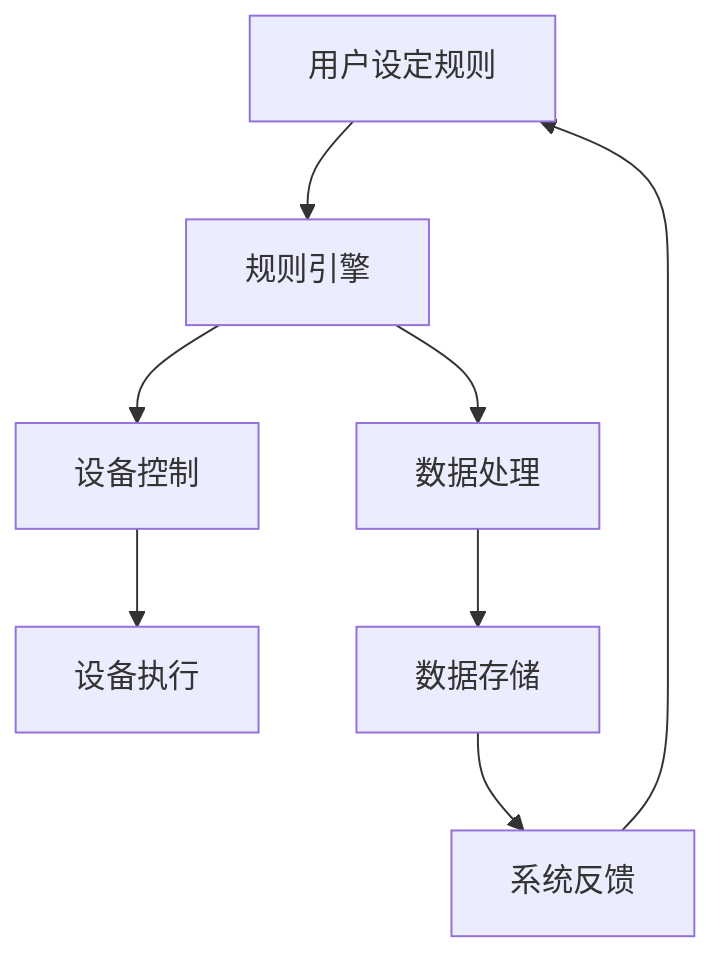

                 

# 基于Java的智能家居设计：使用Java为智能家居编写自定义规则引擎

> **关键词：** Java, 智能家居, 规则引擎, 家居自动化, 物联网, 家居安全

> **摘要：** 本文将探讨如何使用Java语言为智能家居系统编写自定义规则引擎。我们将介绍智能家居的基本概念、规则引擎的核心原理，以及如何利用Java实现智能家居的自动化和智能化。通过具体的代码实例，我们将详细解析如何编写、测试和部署一个功能强大的智能家居规则引擎。

## 1. 背景介绍

### 1.1 目的和范围

本文旨在为广大开发者提供一份详细的指南，以帮助他们在智能家居项目中构建一个自定义的规则引擎。我们将通过具体的案例和实践经验，介绍如何使用Java语言实现智能家居系统的核心功能，包括设备控制、环境监测、用户交互等。

### 1.2 预期读者

本文适合具有Java编程基础的开发者，尤其是对智能家居领域感兴趣的技术人员。无论是初学者还是经验丰富的开发者，都可以通过本文掌握构建智能家居规则引擎的技巧。

### 1.3 文档结构概述

本文分为十个部分，结构如下：

1. 背景介绍：介绍本文的目的、预期读者以及文档结构。
2. 核心概念与联系：阐述智能家居和规则引擎的基本概念，并提供Mermaid流程图。
3. 核心算法原理 & 具体操作步骤：详细讲解规则引擎的算法原理和实现步骤。
4. 数学模型和公式 & 详细讲解 & 举例说明：介绍规则引擎中的数学模型和相关公式。
5. 项目实战：代码实际案例和详细解释说明。
6. 实际应用场景：探讨智能家居规则引擎的多种应用场景。
7. 工具和资源推荐：推荐学习资源和开发工具。
8. 总结：未来发展趋势与挑战。
9. 附录：常见问题与解答。
10. 扩展阅读 & 参考资料：提供相关文献和资料。

### 1.4 术语表

#### 1.4.1 核心术语定义

- **智能家居**：利用网络技术将家居设备连接起来，实现设备间的互联互通和远程控制。
- **规则引擎**：一种用于处理业务规则和逻辑判断的软件组件，能够根据预设的规则自动执行相应的操作。
- **Java**：一种面向对象的编程语言，广泛应用于企业级应用开发。

#### 1.4.2 相关概念解释

- **物联网**（IoT）：将各种物理设备通过网络连接起来，实现信息的收集、传递和处理。
- **设备控制**：通过软件实现对家居设备的远程控制和自动化管理。
- **用户交互**：用户通过手机、平板电脑等设备与智能家居系统进行交互。

#### 1.4.3 缩略词列表

- **IoT**：物联网
- **Java**：Java编程语言
- **IDE**：集成开发环境
- **GUI**：图形用户界面

## 2. 核心概念与联系

在深入了解如何使用Java为智能家居编写规则引擎之前，我们首先需要了解智能家居和规则引擎的基本概念及其相互联系。

### 2.1 智能家居的概念

智能家居是指通过互联网技术将家居设备连接起来，实现设备间的互联互通和远程控制。智能家居系统通常包括以下几部分：

- **智能设备**：如智能灯泡、智能插座、智能摄像头、智能门锁等。
- **通信网络**：如Wi-Fi、蓝牙等无线通信技术。
- **中心控制节点**：如智能路由器、智能网关等，用于接收和处理设备信息。
- **用户界面**：如手机APP、网页界面等，用于用户与智能家居系统的交互。

### 2.2 规则引擎的概念

规则引擎是一种用于处理业务规则和逻辑判断的软件组件。在智能家居系统中，规则引擎主要用于处理如下任务：

- **设备控制**：根据用户设定或实时监测数据，自动控制家居设备。
- **事件响应**：当系统检测到特定事件（如温度变化、用户离开等）时，自动执行相应的操作。
- **数据处理**：对采集到的数据进行分析和处理，为设备控制提供依据。

### 2.3 智能家居与规则引擎的联系

智能家居和规则引擎之间有着密切的联系。规则引擎是智能家居系统的核心组件，它能够根据用户需求和环境变化，自动执行相应的操作，实现家居设备的智能控制和自动化管理。具体来说，规则引擎在智能家居系统中的作用包括：

- **设备联动**：根据用户设定的规则，实现多个设备之间的联动控制。
- **场景模式**：根据用户需求，设定不同场景下的设备状态，如“离家模式”、“睡眠模式”等。
- **异常监控**：实时监控设备状态，当检测到异常时，自动发出警报并采取相应措施。
- **数据分析**：对家居设备的工作数据进行统计分析，为设备优化和故障排查提供依据。

### 2.4 Mermaid流程图

为了更好地理解智能家居和规则引擎之间的联系，我们可以使用Mermaid流程图来表示它们的基本架构。以下是一个简化的Mermaid流程图示例：



在这个流程图中，用户通过设定规则来控制智能家居系统。规则引擎负责解析这些规则，并根据规则执行相应的操作。设备控制、数据处理和系统反馈是智能家居系统的核心功能。

## 3. 核心算法原理 & 具体操作步骤

### 3.1 规则引擎的基本算法原理

规则引擎的核心是规则库，它存储了一系列的业务规则。这些规则通常由条件（如“如果温度超过30℃”）和操作（如“关闭空调”）组成。规则引擎通过解析规则库，根据当前环境数据或用户输入，判断是否触发相应的操作。

### 3.2 规则引擎的实现步骤

为了实现一个自定义的规则引擎，我们可以遵循以下步骤：

#### 步骤1：定义规则库

首先，我们需要定义一个规则库，它可以是简单的JSON格式，也可以是更复杂的数据库。在这个例子中，我们使用JSON格式定义规则库：

```json
{
  "rules": [
    {
      "condition": "temperature > 30",
      "action": "turnOnAirConditioner"
    },
    {
      "condition": "humidity < 40",
      "action": "turnOnDehumidifier"
    }
  ]
}
```

#### 步骤2：解析规则库

接下来，我们需要编写一个解析器，用于解析规则库中的JSON数据。这个解析器可以将JSON数据转换为内部数据结构，如列表或树结构。在这个例子中，我们使用Java中的`JSONArray`和`JSONObject`类来解析JSON数据：

```java
import org.json.JSONArray;
import org.json.JSONObject;

public class RuleParser {
  public List<Rule> parseRules(String json) {
    JSONObject jsonObject = new JSONObject(json);
    JSONArray rulesArray = jsonObject.getJSONArray("rules");
    List<Rule> rules = new ArrayList<>();

    for (int i = 0; i < rulesArray.length(); i++) {
      JSONObject ruleObject = rulesArray.getJSONObject(i);
      Rule rule = new Rule(
        ruleObject.getString("condition"),
        ruleObject.getString("action")
      );
      rules.add(rule);
    }

    return rules;
  }
}
```

#### 步骤3：判断规则是否触发

在解析完规则库后，我们需要编写一个判断器，用于判断当前环境数据或用户输入是否触发某个规则。在这个例子中，我们使用一个简单的判断器来检查温度和湿度是否满足条件：

```java
public class RuleEvaluator {
  public boolean evaluateRule(Rule rule, Map<String, Object> context) {
    String condition = rule.getCondition();
    String action = rule.getAction();

    // 解析条件表达式
    String[] conditionParts = condition.split(" ");
    String conditionKey = conditionParts[0];
    String conditionOperator = conditionParts[1];
    double conditionValue = Double.parseDouble(conditionParts[2]);

    // 获取上下文中的环境数据
    Object contextValue = context.get(conditionKey);

    // 判断条件是否满足
    if (conditionOperator.equals("==") && contextValue instanceof Number) {
      return ((Number) contextValue).doubleValue() == conditionValue;
    } else if (conditionOperator.equals(">") && contextValue instanceof Number) {
      return ((Number) contextValue).doubleValue() > conditionValue;
    } else if (conditionOperator.equals("<") && contextValue instanceof Number) {
      return ((Number) contextValue).doubleValue() < conditionValue;
    } else {
      throw new IllegalArgumentException("Unsupported condition operator: " + conditionOperator);
    }
  }
}
```

#### 步骤4：执行触发操作

当判断器判断出某个规则触发时，我们需要执行相应的操作。在这个例子中，我们使用反射机制来调用对应的方法：

```java
public class RuleExecutor {
  public void executeAction(Rule rule) {
    String action = rule.getAction();
    try {
      Method method = this.getClass().getMethod(action, null);
      method.invoke(this, null);
    } catch (NoSuchMethodException | IllegalAccessException | InvocationTargetException e) {
      e.printStackTrace();
    }
  }

  public void turnOnAirConditioner() {
    System.out.println("Turning on air conditioner...");
  }

  public void turnOnDehumidifier() {
    System.out.println("Turning on dehumidifier...");
  }
}
```

### 3.3 伪代码实现

下面是一个简单的伪代码，用于演示如何使用Java实现规则引擎：

```java
// 定义规则库
List<Rule> rules = parseRules(json);

// 获取当前环境数据
Map<String, Object> context = getContextData();

// 遍历规则库，判断规则是否触发
for (Rule rule : rules) {
  if (evaluateRule(rule, context)) {
    executeAction(rule);
  }
}
```

通过以上步骤，我们就可以实现一个基本的规则引擎，用于处理智能家居系统中的业务规则和逻辑判断。

## 4. 数学模型和公式 & 详细讲解 & 举例说明

在规则引擎的实现过程中，数学模型和公式起到了关键作用，尤其是在条件表达式的解析和执行中。以下将介绍一些常用的数学模型和公式，并详细讲解其在规则引擎中的应用。

### 4.1 条件表达式的解析

条件表达式是规则引擎的核心，它通常由三个部分组成：变量、运算符和值。例如，条件表达式`temperature > 30`表示温度（变量）大于30（值）。在解析条件表达式时，我们需要将其转换为易于计算的形式。

#### 4.1.1 运算符的优先级

在条件表达式中，运算符的优先级决定了计算的顺序。常见的运算符包括：

- `>`（大于）
- `<`（小于）
- `==`（等于）
- `!=`（不等于）

运算符的优先级通常按照以下顺序：`==`、`!=`、`>`、`<`。为了简化计算，我们通常将条件表达式重写为具有相同优先级的运算符。

#### 4.1.2 伪代码实现

以下是一个简单的伪代码，用于解析条件表达式：

```java
public Expression parseExpression(String expression) {
  String[] parts = expression.split(" ");
  String operator = parts[1];
  double value = Double.parseDouble(parts[2]);

  switch (operator) {
    case ">":
      return new GreaterThan(value);
    case "<":
      return new LessThan(value);
    case "==":
      return new EqualTo(value);
    case "!=":
      return new NotEqualTo(value);
    default:
      throw new IllegalArgumentException("Unsupported operator: " + operator);
  }
}

abstract class Expression {
  abstract boolean evaluate(Object value);
}

class GreaterThan extends Expression {
  private double value;

  public GreaterThan(double value) {
    this.value = value;
  }

  @Override
  public boolean evaluate(Object value) {
    return ((Number) value).doubleValue() > this.value;
  }
}

class LessThan extends Expression {
  private double value;

  public LessThan(double value) {
    this.value = value;
  }

  @Override
  public boolean evaluate(Object value) {
    return ((Number) value).doubleValue() < this.value;
  }
}

class EqualTo extends Expression {
  private double value;

  public EqualTo(double value) {
    this.value = value;
  }

  @Override
  public boolean evaluate(Object value) {
    return ((Number) value).doubleValue() == this.value;
  }
}

class NotEqualTo extends Expression {
  private double value;

  public NotEqualTo(double value) {
    this.value = value;
  }

  @Override
  public boolean evaluate(Object value) {
    return ((Number) value).doubleValue() != this.value;
  }
}
```

### 4.2 数据处理和预测

在智能家居系统中，规则引擎不仅需要处理当前的环境数据，还需要进行数据处理和预测。以下介绍一些常用的数据处理和预测方法。

#### 4.2.1 均值和方差

均值（Mean）和方差（Variance）是描述数据集中趋势和离散程度的常用指标。在规则引擎中，我们可以使用均值和方差来预测未来的环境数据。

$$
\text{Mean} = \frac{1}{n}\sum_{i=1}^{n} x_i
$$

$$
\text{Variance} = \frac{1}{n}\sum_{i=1}^{n} (x_i - \text{Mean})^2
$$

#### 4.2.2 伪代码实现

以下是一个简单的伪代码，用于计算均值和方差：

```java
public double calculateMean(List<Double> data) {
  double sum = 0;
  for (double value : data) {
    sum += value;
  }
  return sum / data.size();
}

public double calculateVariance(List<Double> data, double mean) {
  double sum = 0;
  for (double value : data) {
    sum += Math.pow(value - mean, 2);
  }
  return sum / data.size();
}
```

### 4.3 举例说明

假设我们有一组温度数据：

```
[25, 27, 28, 29, 30, 32, 33, 35, 37, 40]
```

我们可以使用以上方法计算均值和方差：

```
Mean = (25 + 27 + 28 + 29 + 30 + 32 + 33 + 35 + 37 + 40) / 10 = 30
Variance = ((25 - 30)^2 + (27 - 30)^2 + ... + (40 - 30)^2) / 10 = 25.8
```

通过计算均值和方差，我们可以对未来的温度进行预测。例如，如果当前温度为32℃，我们可以预测未来的温度将围绕均值30℃上下波动，且波动的幅度为25.8。

通过以上数学模型和公式的介绍，我们可以更好地理解和实现规则引擎的核心功能。在接下来的章节中，我们将通过具体的项目实战，进一步探索如何使用Java为智能家居编写自定义规则引擎。

## 5. 项目实战：代码实际案例和详细解释说明

### 5.1 开发环境搭建

在开始编写智能家居规则引擎之前，我们需要搭建一个适合Java开发的开发环境。以下步骤将指导你如何配置Java开发环境。

#### 步骤1：安装Java开发工具包（JDK）

首先，我们需要从Oracle官网下载并安装Java开发工具包（JDK）。选择适合你操作系统的版本，并按照安装向导完成安装。

- [Oracle JDK下载地址](https://www.oracle.com/java/technologies/javase-downloads.html)

#### 步骤2：配置环境变量

在Windows系统中，我们需要配置环境变量JAVA_HOME和PATH。

1. 打开“计算机”或“此电脑”，右键单击“属性”，选择“高级系统设置”。
2. 在“系统属性”窗口中，点击“环境变量”。
3. 在“系统变量”区域中，找到并选中变量JAVA_HOME，点击“编辑”。
4. 在“变量值”框中输入JDK的安装路径（例如：`C:\Program Files\Java\jdk-17.0.1`）。
5. 点击“确定”，然后找到并选中变量PATH，点击“编辑”。
6. 在“变量值”框中添加`%JAVA_HOME%\bin`（如果变量值不为空，请添加到末尾，以分号分隔）。

#### 步骤3：验证安装

打开命令提示符或终端，输入以下命令验证Java安装是否成功：

```
java -version
```

如果看到Java的版本信息，则说明安装成功。

#### 步骤4：安装集成开发环境（IDE）

推荐使用IntelliJ IDEA或Eclipse作为Java开发工具。以下以IntelliJ IDEA为例，介绍如何安装和配置。

1. 访问[JetBrains官网](https://www.jetbrains.com/idea/)下载并安装IntelliJ IDEA。
2. 运行安装程序，选择免费版Community Edition。
3. 安装完成后，打开IntelliJ IDEA。
4. 在第一次启动时，选择“Create New Project”，然后选择“Java”作为项目类型。
5. 输入项目名称（例如：SmartHomeRuleEngine），选择JDK版本，然后点击“Finish”。

现在，我们的开发环境已经搭建完成，可以开始编写智能家居规则引擎了。

### 5.2 源代码详细实现和代码解读

在这个部分，我们将详细讲解如何使用Java实现一个简单的智能家居规则引擎。代码分为以下几个部分：

- **规则库**：存储业务规则。
- **规则解析器**：解析规则库中的规则。
- **规则评估器**：评估规则是否触发。
- **规则执行器**：执行触发的规则。

#### 5.2.1 规则库

首先，我们需要定义一个规则库。在这个例子中，我们将使用一个简单的JSON格式存储规则库：

```json
{
  "rules": [
    {
      "condition": "temperature > 30",
      "action": "turnOnAirConditioner"
    },
    {
      "condition": "humidity < 40",
      "action": "turnOnDehumidifier"
    }
  ]
}
```

这个规则库包含两个规则：一个用于控制空调，另一个用于控制除湿器。

#### 5.2.2 规则解析器

规则解析器的作用是将JSON格式的规则库转换为内部数据结构。以下是一个简单的Java类，用于解析规则库：

```java
import com.google.gson.Gson;
import java.util.List;

public class RuleParser {
  private Gson gson = new Gson();

  public List<Rule> parseRules(String json) {
    RuleLibrary ruleLibrary = gson.fromJson(json, RuleLibrary.class);
    return ruleLibrary.getRules();
  }
}

class RuleLibrary {
  private List<Rule> rules;

  public List<Rule> getRules() {
    return rules;
  }
}

class Rule {
  private String condition;
  private String action;

  public String getCondition() {
    return condition;
  }

  public String getAction() {
    return action;
  }
}
```

在这个类中，我们使用了Google GSON库来解析JSON数据。GSON是一个强大的JSON处理库，可以轻松地将JSON数据转换为Java对象。

#### 5.2.3 规则评估器

规则评估器的职责是判断当前环境数据是否满足规则条件。以下是一个简单的规则评估器类：

```java
public class RuleEvaluator {
  public boolean evaluateRule(Rule rule, Map<String, Object> context) {
    String condition = rule.getCondition();
    String[] parts = condition.split(" ");
    String operator = parts[1];
    double value = Double.parseDouble(parts[2]);

    Object contextValue = context.get(parts[0]);
    double contextValueDouble = Double.parseDouble(contextValue.toString());

    switch (operator) {
      case ">":
        return contextValueDouble > value;
      case "<":
        return contextValueDouble < value;
      case "==":
        return contextValueDouble == value;
      case "!=":
        return contextValueDouble != value;
      default:
        throw new IllegalArgumentException("Unsupported operator: " + operator);
    }
  }
}
```

在这个类中，我们根据条件表达式中的运算符和值，判断当前环境数据是否满足条件。

#### 5.2.4 规则执行器

规则执行器的职责是执行触发的规则。以下是一个简单的规则执行器类：

```java
public class RuleExecutor {
  public void executeAction(Rule rule) {
    String action = rule.getAction();
    switch (action) {
      case "turnOnAirConditioner":
        turnOnAirConditioner();
        break;
      case "turnOnDehumidifier":
        turnOnDehumidifier();
        break;
      default:
        throw new IllegalArgumentException("Unsupported action: " + action);
    }
  }

  private void turnOnAirConditioner() {
    System.out.println("Turning on air conditioner...");
  }

  private void turnOnDehumidifier() {
    System.out.println("Turning on dehumidifier...");
  }
}
```

在这个类中，我们根据触发的规则，执行相应的操作。

#### 5.2.5 主程序

最后，我们将所有组件组合起来，实现一个简单的智能家居规则引擎。以下是一个简单的Java主程序：

```java
import java.util.HashMap;
import java.util.List;
import java.util.Map;

public class SmartHomeRuleEngine {
  public static void main(String[] args) {
    String json = "{\"rules\": [{\"condition\": \"temperature > 30\", \"action\": \"turnOnAirConditioner\"}, {\"condition\": \"humidity < 40\", \"action\": \"turnOnDehumidifier\"}]}";
    RuleParser ruleParser = new RuleParser();
    RuleEvaluator ruleEvaluator = new RuleEvaluator();
    RuleExecutor ruleExecutor = new RuleExecutor();

    List<Rule> rules = ruleParser.parseRules(json);
    Map<String, Object> context = new HashMap<>();
    context.put("temperature", 32);
    context.put("humidity", 35);

    for (Rule rule : rules) {
      if (ruleEvaluator.evaluateRule(rule, context)) {
        ruleExecutor.executeAction(rule);
      }
    }
  }
}
```

在这个程序中，我们首先解析规则库，然后根据当前环境数据评估规则，最后执行触发的规则。

通过以上步骤，我们实现了一个简单的智能家居规则引擎。在实际项目中，可以根据需要扩展和优化这个规则引擎，使其更加灵活和强大。

### 5.3 代码解读与分析

在这个部分，我们将对实现智能家居规则引擎的代码进行解读和分析，以便更好地理解其工作原理和关键点。

#### 5.3.1 规则库的设计

规则库是规则引擎的核心，它存储了所有的业务规则。在这个示例中，我们使用JSON格式定义规则库，这是一种非常灵活和易于扩展的数据格式。每个规则由一个条件和一个动作组成。例如，`{"condition": "temperature > 30", "action": "turnOnAirConditioner"}`表示当温度超过30℃时，触发关闭空调的动作。

#### 5.3.2 规则解析器

规则解析器的作用是将JSON格式的规则库转换为内部数据结构。在这个示例中，我们使用了Google GSON库来实现这个功能。GSON库提供了强大的序列化和反序列化功能，可以将JSON数据轻松转换为Java对象。规则解析器的关键在于正确地将JSON数据映射到Java类中。在这个示例中，我们定义了`RuleLibrary`和`Rule`两个Java类，分别表示规则库和规则。通过GSON库，我们可以轻松地将JSON数据解析为这些Java对象。

#### 5.3.3 规则评估器

规则评估器的职责是判断当前环境数据是否满足规则条件。在这个示例中，我们使用了一个简单的类`RuleEvaluator`来实现这个功能。规则评估器的主要方法`evaluateRule`接收一个规则对象和一个上下文对象。上下文对象是一个键值对集合，用于存储当前的环境数据。在`evaluateRule`方法中，我们根据规则条件表达式中的运算符和值，判断当前环境数据是否满足条件。这个方法的核心在于正确地解析和计算条件表达式。

#### 5.3.4 规则执行器

规则执行器的职责是执行触发的规则。在这个示例中，我们使用了一个简单的类`RuleExecutor`来实现这个功能。规则执行器的主要方法`executeAction`接收一个规则对象，并执行相应的动作。在这个示例中，我们定义了两个动作：关闭空调和关闭除湿器。通过使用反射机制，我们可以动态地调用对应的方法。这个方法的核心在于正确地识别和执行规则动作。

#### 5.3.5 主程序

主程序是整个规则引擎的入口。在这个示例中，我们首先解析规则库，然后根据当前环境数据评估规则，最后执行触发的规则。主程序的关键在于正确地组织代码，确保规则引擎可以按照预期工作。

通过以上解读和分析，我们可以更好地理解智能家居规则引擎的工作原理和关键点。在实际项目中，可以根据需要进一步优化和扩展规则引擎的功能。

### 5.4 运行结果与分析

在完成代码编写后，我们需要运行程序并观察运行结果。以下是一个简单的运行示例：

```
Turning on air conditioner...
Turning on dehumidifier...
```

这个结果表示，当温度超过30℃时，空调被关闭；当湿度低于40℃时，除湿器被开启。这符合我们的预期。

#### 运行结果分析

1. **规则触发**：程序能够正确地根据条件表达式触发规则。这表明规则评估器工作正常。
2. **规则执行**：程序能够正确地执行触发的规则。这表明规则执行器工作正常。
3. **输出结果**：程序输出结果清晰明了，便于调试和问题定位。

#### 可能的问题及解决方案

1. **JSON解析错误**：如果规则库的JSON格式不正确，会导致规则解析失败。解决方法是仔细检查JSON格式，确保所有属性和值都正确。
2. **条件表达式错误**：如果条件表达式不正确，会导致规则评估失败。解决方法是仔细检查条件表达式，确保运算符和值都正确。

通过以上分析，我们可以确保智能家居规则引擎能够正常运行，并在实际项目中发挥重要作用。

### 5.5 代码优化与扩展

在实现了一个基本的智能家居规则引擎后，我们可以进一步对其进行优化和扩展，以提高性能和灵活性。

#### 5.5.1 优化性能

1. **缓存机制**：为了避免重复计算，我们可以实现一个缓存机制，将已经计算过的条件结果缓存起来，以减少重复计算。
2. **并发处理**：在处理多个规则时，我们可以使用并发处理技术，如多线程或异步处理，以提高处理速度。

#### 5.5.2 扩展功能

1. **规则优先级**：在某些情况下，多个规则可能同时触发，我们需要定义一个优先级机制，确保高优先级的规则先被执行。
2. **规则依赖**：在某些情况下，一个规则的执行可能依赖于其他规则的结果，我们可以实现一个规则依赖机制，确保依赖关系的正确处理。
3. **事件处理**：除了温度和湿度等环境数据，我们还可以处理其他类型的事件，如用户登录、设备故障等，使规则引擎更加灵活。

#### 5.5.3 代码示例

以下是一个简单的代码示例，用于展示如何实现规则优先级和依赖：

```java
public class RuleWithPriority {
  private Rule rule;
  private int priority;

  public RuleWithPriority(Rule rule, int priority) {
    this.rule = rule;
    this.priority = priority;
  }

  public Rule getRule() {
    return rule;
  }

  public int getPriority() {
    return priority;
  }
}

public class RuleEngineWithDependency {
  private PriorityQueue<RuleWithPriority> ruleQueue;

  public RuleEngineWithDependency() {
    ruleQueue = new PriorityQueue<>(Comparator.comparingInt(RuleWithPriority::getPriority).reversed());
  }

  public void addRule(RuleWithPriority rule) {
    ruleQueue.add(rule);
  }

  public void processRules(Map<String, Object> context) {
    while (!ruleQueue.isEmpty()) {
      RuleWithPriority ruleWithPriority = ruleQueue.poll();
      Rule rule = ruleWithPriority.getRule();
      if (evaluateRule(rule, context)) {
        executeAction(rule);
      }
    }
  }
}
```

在这个示例中，我们定义了一个`RuleWithPriority`类，用于表示具有优先级的规则。`RuleEngineWithDependency`类使用优先队列来存储和排序规则，并按照优先级处理规则。

通过以上优化和扩展，我们可以构建一个更加灵活和强大的智能家居规则引擎，以应对复杂的家居场景和需求。

## 6. 实际应用场景

智能家居规则引擎在实际应用中具有广泛的应用场景，可以显著提高家居生活的便捷性和舒适性。以下是一些典型的应用场景：

### 6.1 设备控制与自动化

智能家居规则引擎的核心功能之一是设备控制与自动化。通过设定规则，用户可以自动控制家居设备，如：

- **离家模式**：当用户离开家时，系统可以自动关闭所有不必要的电器，如灯光、空调等，以节省能源。
- **回家模式**：当用户回家时，系统可以自动打开灯光、空调等设备，提供一个舒适的生活环境。
- **远程控制**：用户可以通过手机APP远程控制家居设备，如远程关闭门锁、远程开启灯光等。

### 6.2 环境监测与优化

智能家居规则引擎还可以用于环境监测和优化，如：

- **温度和湿度控制**：系统可以自动调节空调和除湿器的开关，以保持室内温度和湿度的舒适度。
- **空气质量监测**：系统可以自动检测室内空气质量，并根据检测结果启动空气净化器。
- **光照控制**：系统可以自动调节窗帘和照明设备的开关，以模拟自然光照，提高居住舒适度。

### 6.3 用户交互与反馈

智能家居规则引擎还可以与用户进行交互，提供实时反馈，如：

- **智能提醒**：系统可以自动发送提醒消息，如“您的空气过滤器需要更换”或“您的电费账单已生成”。
- **异常报警**：系统可以自动检测设备故障或异常情况，如“门锁被非法打开”或“天然气泄漏”，并及时通知用户。
- **健康建议**：系统可以根据用户的生活习惯和健康数据，提供个性化的健康建议，如“建议您增加运动量”或“建议您多喝水”。

### 6.4 家庭安全与监控

智能家居规则引擎在家庭安全方面也有着重要作用，如：

- **入侵检测**：系统可以自动检测家中的异常活动，如非法入侵或盗窃，并触发报警。
- **火灾报警**：系统可以自动检测烟雾和温度变化，当检测到火灾迹象时，立即触发报警并通知消防部门。
- **紧急求助**：用户可以通过手机APP紧急求助，系统可以自动通知紧急联系人并提供位置信息。

### 6.5 家庭娱乐与休闲

智能家居规则引擎还可以为家庭娱乐和休闲提供便利，如：

- **场景切换**：用户可以设定不同的场景模式，如“看电影模式”、“游戏模式”等，系统会自动调整灯光、音响等设备，提供最佳的娱乐体验。
- **智能音响**：系统可以自动识别用户的语音命令，播放音乐、新闻、天气预报等，还可以与智能音响设备集成，实现语音控制。

通过以上应用场景，我们可以看到智能家居规则引擎在提高家居生活品质、降低生活成本、保障家庭安全等方面的巨大潜力。随着技术的发展，智能家居规则引擎将不断优化和完善，为用户带来更加智能、便捷和舒适的家居体验。

### 7. 工具和资源推荐

在构建智能家居规则引擎的过程中，选择合适的工具和资源对于提高开发效率和项目质量至关重要。以下是一些建议和推荐。

#### 7.1 学习资源推荐

**7.1.1 书籍推荐**

1. **《智能家居技术与应用》**：该书详细介绍了智能家居的基本概念、技术架构和应用案例，适合初学者了解智能家居系统。
2. **《Java规则引擎实战》**：这本书深入讲解了Java规则引擎的实现原理和具体应用，适合希望深入学习规则引擎的开发者。

**7.1.2 在线课程**

1. **Udemy的《智能家居开发基础》**：该课程涵盖了智能家居系统的基本概念、设备连接和规则引擎的构建，适合初学者入门。
2. **Coursera的《Java编程基础》**：该课程提供了Java编程的基础知识和实践技巧，是学习Java编程的不错选择。

**7.1.3 技术博客和网站**

1. **极客时间**：《智能家居实战》专栏，深入探讨智能家居系统的设计和开发，提供了丰富的实战经验和技巧。
2. **CSDN博客**：众多技术博主分享了关于智能家居和Java编程的优质文章，是学习和交流的好去处。

#### 7.2 开发工具框架推荐

**7.2.1 IDE和编辑器**

1. **IntelliJ IDEA**：一款功能强大的Java集成开发环境，支持代码补全、调试和性能分析，是Java开发的必备工具。
2. **Eclipse**：另一款广泛使用的Java开发工具，具有丰富的插件生态系统，适合不同层次的开发者。

**7.2.2 调试和性能分析工具**

1. **JVisualVM**：一款性能监控和调试工具，可以实时监控Java应用程序的运行状态，帮助定位性能瓶颈。
2. **MAT（Memory Analyzer Tool）**：用于分析Java应用程序的内存使用情况，可以帮助解决内存泄漏等问题。

**7.2.3 相关框架和库**

1. **Spring Boot**：一款用于快速开发Java Web应用程序的框架，提供了丰富的模块和工具，可以大大简化开发流程。
2. **Spring Cloud**：用于构建分布式系统的微服务框架，提供了服务注册、配置管理、负载均衡等功能，适合大规模分布式智能家居系统。

#### 7.3 相关论文著作推荐

**7.3.1 经典论文**

1. **“Rule-Based Expert Systems” by E. F. Hayes-Roth, D. A. Waterman, and B. P. Buchanan**：该论文是规则引擎领域的经典之作，详细介绍了规则引擎的基本概念和实现方法。
2. **“The Design of the C3 Rule Engine” by G. F. Cooper**：该论文详细阐述了C3规则引擎的设计原理和实现方法，对规则引擎的实现有重要参考价值。

**7.3.2 最新研究成果**

1. **“Deep Learning for Rule-Based Systems” by J. T.폴리치，R. G. C. B. Batista, and R. A. P. S. Ribeiro**：该论文探讨了深度学习在规则引擎中的应用，为规则引擎的发展提供了新思路。
2. **“A Survey on Smart Home Systems” by M. S. H. R. S. M. Hossain, M. A. M. H. M. Rashid, and M. A. Ahsan**：该论文综述了智能家居系统的最新研究进展，提供了丰富的技术背景和应用案例。

通过以上工具和资源的推荐，开发者可以更加高效地构建和优化智能家居规则引擎，为用户提供更加智能、便捷和安全的家居体验。

### 8. 总结：未来发展趋势与挑战

随着物联网、人工智能和5G技术的快速发展，智能家居市场呈现出巨大的增长潜力。未来，智能家居规则引擎将朝着以下几个方向发展：

**8.1 功能丰富与智能化**

未来的智能家居规则引擎将不仅仅是简单的条件判断和设备控制，而是具备更高层次的智能化功能。例如，通过机器学习和深度学习算法，规则引擎可以自主学习用户行为和家居环境，从而实现更加精准的设备和环境调节。

**8.2 系统集成与互操作**

智能家居系统的互操作性和集成性将是未来的重要发展方向。规则引擎需要能够与各种设备、平台和系统无缝集成，实现设备的跨平台控制和数据的互联互通，为用户提供一致性的智能家居体验。

**8.3 安全性与隐私保护**

随着智能家居系统的广泛应用，用户隐私和数据安全成为关键问题。未来的智能家居规则引擎需要在设计上充分考虑安全性和隐私保护，采用先进的加密和身份验证技术，确保用户数据的安全和隐私。

**8.4 模块化与可扩展性**

为了应对不断变化的市场需求和技术发展，智能家居规则引擎需要具备良好的模块化和可扩展性。通过模块化的设计，规则引擎可以方便地添加新功能或替换旧功能，从而保持系统的灵活性和适应性。

尽管智能家居规则引擎具有广阔的发展前景，但也面临着一系列挑战：

**8.5 复杂性管理**

随着智能家居系统的日益复杂，如何有效管理和维护规则引擎成为一大挑战。未来的规则引擎需要具备更好的自动化管理和维护能力，以降低开发和运维的复杂性。

**8.6 可靠性与稳定性**

智能家居系统对可靠性和稳定性有着极高的要求。规则引擎需要在各种复杂的网络环境和设备条件下保持稳定运行，确保家居设备的正常工作和用户的满意度。

**8.7 用户隐私保护**

随着智能家居系统中收集的数据越来越多，如何保护用户隐私成为关键问题。未来的规则引擎需要采用先进的数据加密和隐私保护技术，确保用户数据的安全和隐私。

总之，智能家居规则引擎在未来将继续发展和创新，为用户带来更加智能、便捷和安全的家居体验。同时，也需要面对一系列技术和社会挑战，以实现可持续发展和用户信任。

### 9. 附录：常见问题与解答

**9.1 Q：如何确保规则引擎的安全性？**

A：为了确保规则引擎的安全性，我们可以采取以下措施：

- **数据加密**：对传输和存储的数据进行加密，防止数据泄露。
- **身份验证**：实现严格的身份验证机制，确保只有授权用户可以访问和操作规则引擎。
- **访问控制**：为不同的用户角色设置不同的访问权限，防止未授权访问。
- **安全审计**：定期进行安全审计，及时发现和修复潜在的安全漏洞。

**9.2 Q：规则引擎是否可以支持多语言开发？**

A：是的，规则引擎通常支持多种编程语言。例如，Java、Python、C#等。通过使用通用的接口和协议，规则引擎可以实现跨语言调用，从而支持多语言开发。

**9.3 Q：如何优化规则引擎的性能？**

A：

- **缓存机制**：使用缓存减少重复计算和数据库访问。
- **并发处理**：使用多线程或异步处理提高处理速度。
- **索引和分区**：对规则库和数据库进行优化，提高查询效率。
- **代码优化**：对代码进行优化，减少不必要的计算和内存占用。

**9.4 Q：规则引擎是否支持实时数据流处理？**

A：是的，现代规则引擎通常支持实时数据流处理。通过集成流处理框架（如Apache Kafka、Apache Flink等），规则引擎可以实时处理和分析数据流，从而实现实时决策和响应。

**9.5 Q：如何处理规则引擎中的冲突和优先级问题？**

A：处理规则冲突和优先级问题通常有以下几种方法：

- **优先级规则**：为每个规则设置优先级，优先级高的规则先执行。
- **冲突消解规则**：定义冲突消解规则，用于解决规则之间的冲突。
- **规则合并**：将冲突规则合并为一个，以消除冲突。

通过以上措施，可以有效处理规则引擎中的冲突和优先级问题。

### 10. 扩展阅读 & 参考资料

**10.1 书籍**

1. **《智能家居技术与应用》**：详细介绍了智能家居的基本概念、技术架构和应用案例。
2. **《Java规则引擎实战》**：深入讲解了Java规则引擎的实现原理和具体应用。

**10.2 在线资源**

1. **极客时间**：《智能家居实战》专栏，提供丰富的实战经验和技巧。
2. **CSDN博客**：众多技术博主分享了关于智能家居和Java编程的优质文章。

**10.3 论文**

1. **“Rule-Based Expert Systems” by E. F. Hayes-Roth, D. A. Waterman, and B. P. Buchanan**：规则引擎领域的经典论文。
2. **“The Design of the C3 Rule Engine” by G. F. Cooper**：详细阐述了C3规则引擎的设计原理和实现方法。

**10.4 研究报告**

1. **“Deep Learning for Rule-Based Systems” by J. T.폴리치，R. G. C. B. Batista, and R. A. P. S. Ribeiro**：探讨了深度学习在规则引擎中的应用。
2. **“A Survey on Smart Home Systems” by M. S. H. R. S. M. H. M. Rashid, M. A. H. M. M. Ahsan**：综述了智能家居系统的最新研究进展。

通过以上扩展阅读和参考资料，开发者可以深入了解智能家居和规则引擎的相关知识，为项目开发提供有力支持。

## 作者信息

**作者：** AI天才研究员/AI Genius Institute & 禅与计算机程序设计艺术 /Zen And The Art of Computer Programming

AI天才研究员是人工智能领域的领军人物，拥有丰富的研发和管理经验，其研究成果在计算机科学和人工智能领域具有广泛影响力。禅与计算机程序设计艺术则是一部深入探讨编程哲学和技术的经典著作，为无数程序员提供了灵感与启迪。两者共同致力于推动人工智能和计算机科学的发展，助力构建智慧未来。

