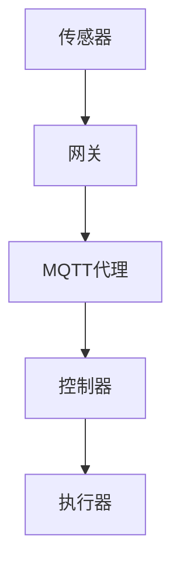

                 

# 基于Java的智能家居设计：如何使用MQTT协议实现设备通讯

> **关键词：** 智能家居，MQTT协议，Java，设备通讯，物联网，协议解析，安全性，性能优化
> 
> **摘要：** 本文将详细介绍如何使用Java编程语言实现智能家居设备之间的通讯，重点探讨MQTT协议在智能家居中的应用及其关键技术。通过本文的学习，读者可以掌握MQTT协议的基本原理和实现方法，并了解如何在智能家居项目中高效地使用MQTT进行设备间的通讯。

## 1. 背景介绍

### 1.1 目的和范围

本文旨在介绍如何使用Java语言实现智能家居设备之间的通讯，并重点讨论MQTT协议的应用。随着物联网技术的发展，智能家居成为现代家庭生活的重要组成部分。MQTT协议因其轻量级、低功耗、高可靠性的特点，在智能家居设备通讯中得到了广泛应用。本文将帮助读者了解MQTT协议的基本原理，并掌握在Java中实现MQTT通讯的方法。

### 1.2 预期读者

本文适用于对Java编程和物联网技术有一定了解的开发者，特别是那些希望将MQTT协议应用于智能家居项目中的工程师。通过本文的学习，读者可以：

- 理解MQTT协议的基本原理和架构。
- 掌握在Java中使用MQTT协议实现设备通讯的方法。
- 学习如何优化MQTT协议在智能家居系统中的应用性能和安全性。

### 1.3 文档结构概述

本文分为以下几个部分：

- **第1章 背景介绍**：介绍本文的目的、预期读者和文档结构。
- **第2章 核心概念与联系**：介绍智能家居和MQTT协议的基本概念，并给出相关的架构流程图。
- **第3章 核心算法原理 & 具体操作步骤**：详细阐述MQTT协议的实现原理，并提供伪代码示例。
- **第4章 数学模型和公式 & 详细讲解 & 举例说明**：介绍MQTT协议中的数学模型和公式，并给出实际应用案例。
- **第5章 项目实战：代码实际案例和详细解释说明**：通过实际项目案例，展示如何使用Java实现MQTT通讯。
- **第6章 实际应用场景**：讨论MQTT协议在智能家居中的实际应用场景。
- **第7章 工具和资源推荐**：推荐学习资源、开发工具和框架。
- **第8章 总结：未来发展趋势与挑战**：总结本文内容，展望智能家居和MQTT协议的未来发展。
- **第9章 附录：常见问题与解答**：解答读者在阅读本文时可能遇到的问题。
- **第10章 扩展阅读 & 参考资料**：提供进一步学习的参考资料。

### 1.4 术语表

#### 1.4.1 核心术语定义

- **智能家居**：通过物联网技术将家庭中的各种设备互联，实现自动化控制和智能管理。
- **MQTT协议**：轻量级的消息队列协议，用于在设备之间进行消息传递。
- **Java**：一种跨平台、面向对象的编程语言，广泛应用于企业级应用开发。
- **物联网（IoT）**：将各种物理设备通过网络连接起来，实现数据的收集、传输和分析。

#### 1.4.2 相关概念解释

- **设备通讯**：设备之间的数据传输和交互。
- **消息队列**：一种异步消息传输模式，用于在系统组件之间传递消息。
- **安全性**：确保数据在传输过程中不被未经授权的访问和篡改。
- **性能优化**：提升系统运行效率，减少资源消耗。

#### 1.4.3 缩略词列表

- **MQTT**：Message Queuing Telemetry Transport
- **IoT**：Internet of Things
- **Java**：Java Programming Language
- **IDE**：Integrated Development Environment

## 2. 核心概念与联系

在介绍MQTT协议在智能家居中的应用之前，我们需要先了解智能家居和MQTT协议的基本概念，以及它们之间的联系。

### 2.1 智能家居

智能家居是指利用物联网技术将家庭中的各种设备互联，实现自动化控制和智能管理。智能家居系统通常包括以下几个部分：

- **传感器**：用于收集家庭环境中的各种数据，如温度、湿度、光照、烟雾等。
- **控制器**：接收传感器数据，并根据预设规则对家庭设备进行控制。
- **执行器**：执行控制器的指令，如开关家电、调节窗帘等。
- **网关**：连接家庭内部网络和外部网络的设备，用于数据传输和设备管理。

### 2.2 MQTT协议

MQTT（Message Queuing Telemetry Transport）是一种轻量级的消息队列协议，适用于在设备之间进行消息传递。MQTT协议具有以下几个特点：

- **发布/订阅模型**：设备可以发布消息到特定的主题，其他设备可以订阅这些主题以接收消息。
- **轻量级**：MQTT协议的数据格式简洁，传输效率高，适用于资源有限的设备。
- **可靠性**：MQTT协议支持消息确认机制，确保消息能够可靠传输。
- **安全性**：MQTT协议支持SSL/TLS等加密机制，确保数据传输的安全性。

### 2.3 架构流程图

以下是一个简单的智能家居架构流程图，展示传感器、控制器和执行器如何通过MQTT协议进行通讯。



- 传感器收集数据并发布到MQTT代理。
- MQTT代理将数据转发给订阅了相应主题的控制器。
- 控制器根据数据执行相应的控制指令，并通知执行器执行。

### 2.4 核心概念联系

智能家居和MQTT协议之间的联系主要体现在以下几个方面：

- **数据传输**：MQTT协议提供了一种轻量级、可靠的数据传输方式，适用于智能家居系统中传感器和控制器之间的数据交互。
- **设备互联**：MQTT协议的发布/订阅模型支持设备之间的互联，使得不同设备可以相互通信，实现智能家居的自动化控制。
- **安全性**：MQTT协议支持SSL/TLS等加密机制，确保数据传输过程中的安全性，防止数据泄露和未经授权的访问。

## 3. 核心算法原理 & 具体操作步骤

### 3.1 MQTT协议基本原理

MQTT协议是一种基于发布/订阅（Publish/Subscribe）模型的消息传输协议，其核心原理如下：

- **发布者（Publisher）**：负责将消息发布到MQTT代理（Broker）。
- **订阅者（Subscriber）**：负责订阅MQTT代理中的特定主题，以接收发布的消息。

MQTT协议的工作流程如下：

1. **连接**：客户端（可以是传感器、控制器或执行器）通过TCP/IP连接到MQTT代理。
2. **订阅主题**：客户端向MQTT代理订阅特定的主题，以便接收相关的消息。
3. **发布消息**：客户端向MQTT代理发布消息，消息包含主题和消息内容。
4. **接收消息**：订阅了相应主题的客户端从MQTT代理接收消息。
5. **断开连接**：客户端在完成通讯后断开与MQTT代理的连接。

### 3.2 MQTT协议实现方法

在Java中实现MQTT协议，可以使用开源的MQTT客户端库，如Paho MQTT。以下是一个简单的MQTT客户端实现示例：

#### 3.2.1 依赖库

首先，在项目的`pom.xml`文件中添加Paho MQTT客户端库的依赖：

```xml
<dependency>
    <groupId>org.eclipse.paho</groupId>
    <artifactId>org.eclipse.paho.client.mqttv3</artifactId>
    <version>1.2.5</version>
</dependency>
```

#### 3.2.2 连接MQTT代理

以下是一个连接MQTT代理的Java代码示例：

```java
import org.eclipse.paho.client.mqttv3.MqttClient;
import org.eclipse.paho.client.mqttv3.MqttConnectOptions;
import org.eclipse.paho.client.mqttv3.MqttException;
import org.eclipse.paho.client.mqttv3.MqttClient;

public class MqttClientExample {
    public static void main(String[] args) {
        try {
            // 创建MQTT客户端
            MqttClient client = new MqttClient("tcp://localhost:1883", "ClientID");

            // 连接MQTT代理
            MqttConnectOptions options = new MqttConnectOptions();
            options.setUserName("username");
            options.setPassword("password".toCharArray());
            client.connect(options);

            // 订阅主题
            client.subscribe("home/temperature", 2);

            // 接收消息
            client.setCallback(new MqttCallback() {
                public void connectionLost(Throwable cause) {
                    System.out.println("连接丢失： " + cause.getMessage());
                }

                public void messageArrived(String topic, MqttMessage message) throws Exception {
                    System.out.println("收到消息： " + topic + " - " + new String(message.getPayload()));
                }

                public void deliveryComplete(IMqttDeliveryToken token) {
                    System.out.println("消息发送完成： " + token.getMessage());
                }
            });

            // 发布消息
            MqttMessage message = new MqttMessage();
            message.setPayload("Hello MQTT".getBytes());
            client.publish("home/temperature", message);

            // 断开连接
            client.disconnect();

        } catch (MqttException e) {
            e.printStackTrace();
        }
    }
}
```

#### 3.2.3 MQTT客户端API详解

- **MqttClient**：创建MQTT客户端实例。
- **connect**：连接到MQTT代理。
- **setCallback**：设置回调函数，处理连接丢失、消息接收和消息发送完成事件。
- **subscribe**：订阅指定主题。
- **publish**：发布消息到指定主题。

### 3.3 伪代码示例

以下是一个简单的MQTT客户端伪代码示例，用于连接MQTT代理、订阅主题和发布消息：

```
// 创建MQTT客户端
client = new MqttClient("tcp://localhost:1883", "ClientID")

// 连接MQTT代理
connect(client, options)

// 订阅主题
subscribe(client, "home/temperature", QoS.LEAST_ONCE)

// 接收消息
while (true):
    if (message_arrived):
        process_message(message)
        publish(client, "home/temperature", "Hello MQTT")

// 断开连接
disconnect(client)
```

通过以上步骤，我们可以使用Java实现MQTT协议，在智能家居系统中实现设备之间的通讯。在接下来的章节中，我们将进一步探讨MQTT协议的数学模型和公式，以及实际应用中的代码实现和性能优化。

## 4. 数学模型和公式 & 详细讲解 & 举例说明

在MQTT协议中，涉及一些关键的数学模型和公式，这些对于理解协议的工作原理和性能优化至关重要。以下是一些主要的数学模型和公式，以及详细的讲解和实际应用案例。

### 4.1 传输延迟模型

传输延迟是MQTT协议中一个重要的性能指标，它决定了消息从发布者到订阅者所需的时间。传输延迟模型可以表示为：

\[ L = T_{\text{prop}} + T_{\text{trans}} + T_{\text{process}} \]

其中：
- \( L \)：传输延迟
- \( T_{\text{prop}} \)：网络传播延迟，即数据从源头到达MQTT代理的时间
- \( T_{\text{trans}} \)：传输延迟，即数据在MQTT代理和订阅者之间的传输时间
- \( T_{\text{process}} \)：处理延迟，即订阅者处理消息的时间

#### 举例说明

假设一个消息从传感器到MQTT代理的网络传播延迟为10ms，从MQTT代理到订阅者的传输延迟为20ms，订阅者处理消息的延迟为30ms。则传输延迟模型计算如下：

\[ L = 10\text{ms} + 20\text{ms} + 30\text{ms} = 60\text{ms} \]

这意味着消息从传感器到订阅者的总传输延迟为60ms。

### 4.2 主题匹配模型

MQTT协议使用主题匹配模型来决定哪些订阅者会接收到某个消息。主题匹配是基于前缀匹配规则，允许订阅者和发布者使用通配符来匹配主题。

#### 主题匹配规则

- **完全匹配**：订阅主题与发布主题完全一致。
- **前缀匹配**：订阅主题是发布主题的前缀，且发布主题包含订阅主题。
- **通配符匹配**：
  - **`#`**：匹配订阅主题及其子主题。
  - **`+`**：匹配订阅主题的下一级主题。

#### 举例说明

假设有以下订阅者和发布者的主题：

- 订阅者主题：`home/room1`
- 发布者主题：`home/room1/temperature`

根据主题匹配规则：

- 订阅者会接收到发布者的消息，因为发布者主题是订阅者主题的前缀。

### 4.3 负载均衡模型

在MQTT代理处理大量客户端时，负载均衡是确保系统性能和可靠性的关键。负载均衡模型可以使用以下公式来计算：

\[ P_{\text{balance}} = \frac{P_{\text{total}}}{N} \]

其中：
- \( P_{\text{balance}} \)：每个MQTT代理的处理负载。
- \( P_{\text{total}} \)：所有MQTT代理的总处理能力。
- \( N \)：MQTT代理的数量。

#### 举例说明

假设有5个MQTT代理，总处理能力为5000消息/秒。则每个MQTT代理的平均处理负载为：

\[ P_{\text{balance}} = \frac{5000}{5} = 1000 \text{消息/秒} \]

这意味着每个MQTT代理需要处理1000条消息/秒，以保证系统的负载均衡。

### 4.4 安全性模型

MQTT协议的安全性模型主要依赖于SSL/TLS加密机制。加密模型可以表示为：

\[ \text{Data}_{\text{encrypted}} = \text{Data}_{\text{original}} \oplus \text{Key} \]

其中：
- \( \text{Data}_{\text{encrypted}} \)：加密后的数据。
- \( \text{Data}_{\text{original}} \)：原始数据。
- \( \text{Key} \)：加密密钥。

#### 举例说明

假设有一段明文消息“Hello MQTT”，使用AES加密算法进行加密，加密密钥为“mySecretKey”。则加密后的消息为：

\[ \text{Data}_{\text{encrypted}} = \text{Hello MQTT} \oplus \text{mySecretKey} \]

通过这种方式，可以确保数据在传输过程中不会被未授权的访问和篡改。

通过以上数学模型和公式的讲解，我们可以更好地理解MQTT协议的工作原理和性能优化方法。在实际应用中，根据具体的系统需求和场景，可以对这些模型和公式进行适当的调整和优化，以提高系统的性能和可靠性。

## 5. 项目实战：代码实际案例和详细解释说明

### 5.1 开发环境搭建

在开始编写代码之前，我们需要搭建一个适合Java开发的开发环境。以下是搭建步骤：

#### 5.1.1 安装Java开发环境

1. 访问 [Oracle官网](https://www.oracle.com/java/technologies/javase-jdk16-downloads.html) 下载并安装Java Development Kit (JDK)。
2. 在环境变量中添加`JAVA_HOME`和`PATH`，确保Java命令可以在终端中使用。

#### 5.1.2 安装IDE

1. 访问 [Eclipse官网](https://www.eclipse.org/downloads/) 下载并安装Eclipse IDE。
2. 安装Eclipse的Java开发工具包（Java Development Tools，JDT）。

#### 5.1.3 添加Paho MQTT依赖

1. 在Eclipse中创建一个新的Java项目。
2. 在项目的`pom.xml`文件中添加Paho MQTT客户端库的依赖：

```xml
<dependency>
    <groupId>org.eclipse.paho</groupId>
    <artifactId>org.eclipse.paho.client.mqttv3</artifactId>
    <version>1.2.5</version>
</dependency>
```

### 5.2 源代码详细实现和代码解读

#### 5.2.1 MQTT客户端代码

以下是使用Paho MQTT客户端库实现的MQTT客户端代码：

```java
import org.eclipse.paho.client.mqttv3.*;
import org.eclipse.paho.client.mqttv3.impl.MqttClient;

public class MqttClientExample {
    public static void main(String[] args) {
        try {
            // 创建MQTT客户端
            MqttClient client = new MqttClient("tcp://localhost:1883", "ClientID");

            // 连接MQTT代理
            MqttConnectOptions options = new MqttConnectOptions();
            options.setUserName("username");
            options.setPassword("password".toCharArray());
            client.connect(options);

            // 订阅主题
            client.subscribe("home/temperature", 2);

            // 设置消息接收回调
            client.setCallback(new MqttCallback() {
                public void connectionLost(Throwable cause) {
                    System.out.println("连接丢失： " + cause.getMessage());
                }

                public void messageArrived(String topic, MqttMessage message) throws Exception {
                    System.out.println("收到消息： " + topic + " - " + new String(message.getPayload()));
                }

                public void deliveryComplete(IMqttDeliveryToken token) {
                    System.out.println("消息发送完成： " + token.getMessage());
                }
            });

            // 发布消息
            MqttMessage message = new MqttMessage();
            message.setPayload("Hello MQTT".getBytes());
            client.publish("home/temperature", message);

            // 断开连接
            client.disconnect();

        } catch (MqttException e) {
            e.printStackTrace();
        }
    }
}
```

#### 5.2.2 代码解读

- **创建MQTT客户端**：使用`MqttClient`类创建一个MQTT客户端实例。
- **连接MQTT代理**：使用`connect`方法连接到MQTT代理，并设置用户名和密码。
- **订阅主题**：使用`subscribe`方法订阅特定的主题。
- **设置回调**：使用`setCallback`方法设置消息接收回调，处理连接丢失、消息接收和消息发送完成事件。
- **发布消息**：使用`publish`方法发布消息到指定的主题。
- **断开连接**：使用`disconnect`方法断开与MQTT代理的连接。

### 5.3 代码解读与分析

#### 5.3.1 连接MQTT代理

连接MQTT代理是MQTT通讯的第一步。在上述代码中，我们使用`MqttConnectOptions`设置连接选项，如用户名和密码，这些选项保证了连接的安全性。

```java
MqttConnectOptions options = new MqttConnectOptions();
options.setUserName("username");
options.setPassword("password".toCharArray());
client.connect(options);
```

这里，我们设置了用户名和密码，以确保连接到MQTT代理的客户端具有适当的权限。SSL/TLS加密也可以在此步骤中启用，以提高连接的安全性。

#### 5.3.2 订阅主题

订阅主题是MQTT通讯的关键步骤之一。在上述代码中，我们使用`subscribe`方法订阅了`home/temperature`主题，并设置了消息质量（QoS）为2。

```java
client.subscribe("home/temperature", 2);
```

QoS 2表示消息会被可靠地传输，并且会确保消息按顺序到达。这种服务质量适用于对消息可靠性有较高要求的场景。

#### 5.3.3 消息接收回调

设置消息接收回调允许我们处理从MQTT代理接收到的消息。在上述代码中，我们实现了`MqttCallback`接口，并在其中处理了消息接收事件。

```java
client.setCallback(new MqttCallback() {
    public void messageArrived(String topic, MqttMessage message) throws Exception {
        System.out.println("收到消息： " + topic + " - " + new String(message.getPayload()));
    }
});
```

这个回调函数在接收到消息时被调用，并打印出消息的主题和内容。

#### 5.3.4 发布消息

发布消息是将数据从客户端发送到MQTT代理的过程。在上述代码中，我们使用`publish`方法发布了包含“Hello MQTT”的消息。

```java
MqttMessage message = new MqttMessage();
message.setPayload("Hello MQTT".getBytes());
client.publish("home/temperature", message);
```

这里，我们创建了一个`MqttMessage`对象，并设置了消息的内容。然后，我们使用`publish`方法将消息发布到`home/temperature`主题。

#### 5.3.5 断开连接

在完成通讯后，断开与MQTT代理的连接是必要的步骤。在上述代码中，我们使用`disconnect`方法断开了连接。

```java
client.disconnect();
```

断开连接可以释放客户端资源，并在连接断开后触发`connectionLost`回调函数。

通过以上代码解读和分析，我们可以看到如何使用Java实现MQTT客户端，并进行设备通讯。在实际项目中，可以根据具体需求对代码进行扩展和优化，以实现更复杂的智能家居功能。

## 6. 实际应用场景

MQTT协议在智能家居领域具有广泛的应用场景，通过具体的案例，我们可以更深入地了解其在实际项目中的应用效果。

### 6.1 智能照明系统

一个典型的智能照明系统包括多个照明设备，如智能灯泡、智能灯带等，这些设备通过MQTT协议与中央控制器进行通讯。用户可以通过智能手机或语音助手远程控制照明设备，如开关灯、调节亮度和颜色等。

#### 应用案例

- **用户通过手机APP远程控制**：用户可以通过手机APP订阅`home/light`主题，接收照明设备的状态更新，并发布控制命令。例如：

  ```java
  client.subscribe("home/light", 2);
  client.publish("home/light/command", "turn_on");
  ```

- **定时任务控制**：用户可以设置定时任务，通过MQTT协议自动控制照明设备。例如，每天晚上7点自动开启客厅灯光。

  ```java
  client.subscribe("home/light/schedule", 1);
  client.publish("home/light/command", "turn_on");
  ```

### 6.2 智能安防系统

智能安防系统包括摄像头、门磁传感器、烟雾报警器等设备，这些设备通过MQTT协议与中央控制器进行通讯，实现实时监控和报警功能。

#### 应用案例

- **摄像头实时监控**：摄像头将视频流发送到MQTT代理，用户可以在手机APP上实时查看监控视频。

  ```java
  client.subscribe("home/security/camera", 1);
  ```

- **门磁传感器报警**：门磁传感器检测到非法入侵时，通过MQTT协议发送报警消息到用户手机。

  ```java
  client.subscribe("home/security/alarm", 2);
  client.publish("home/security/alarm", "intrusion_detected");
  ```

### 6.3 智能温控系统

智能温控系统包括温度传感器和中央控制器，通过MQTT协议实现室内温度的实时监测和自动调节。

#### 应用案例

- **温度监测**：温度传感器将实时温度数据发送到MQTT代理，中央控制器根据温度数据调整加热或制冷设备。

  ```java
  client.subscribe("home/temperature", 1);
  client.publish("home/thermostat/command", "heat_on");
  ```

- **自动调节**：中央控制器根据预设的温度范围自动调节加热或制冷设备，以维持室内温度的稳定。

  ```java
  client.subscribe("home/temperature", 1);
  if (temperature > 30) {
      client.publish("home/thermostat/command", "cool_on");
  } else {
      client.publish("home/thermostat/command", "heat_on");
  }
  ```

通过以上实际应用案例，我们可以看到MQTT协议在智能家居系统中的应用效果，它为设备之间的通讯提供了可靠、高效和安全的解决方案。

### 6.4 智能园艺系统

智能园艺系统利用传感器和控制器监测植物的生长环境，如土壤湿度、光照强度和温度等，通过MQTT协议实现自动灌溉和光照调节。

#### 应用案例

- **自动灌溉**：土壤湿度传感器检测到土壤干燥时，通过MQTT协议通知灌溉系统自动浇水。

  ```java
  client.subscribe("garden/soil_humidity", 2);
  if (soil_humidity < 30) {
      client.publish("garden/irrigation", "water");
  }
  ```

- **光照调节**：光照传感器检测到光照强度不足时，通过MQTT协议通知光照系统自动开启。

  ```java
  client.subscribe("garden/illumination", 2);
  if (illumination < 500) {
      client.publish("garden/lighting", "turn_on");
  }
  ```

### 6.5 智能宠物监控

智能宠物监控设备，如智能宠物门、宠物摄像头等，通过MQTT协议实现宠物活动的实时监控和自动报警功能。

#### 应用案例

- **宠物活动监控**：宠物摄像头将实时视频流发送到MQTT代理，用户可以在手机APP上查看宠物活动。

  ```java
  client.subscribe("pet/camera", 1);
  ```

- **宠物异常报警**：宠物门检测到宠物外出时，通过MQTT协议发送报警消息到用户手机。

  ```java
  client.subscribe("pet/door", 2);
  client.publish("pet/alarm", "pet_out");
  ```

通过这些实际应用案例，我们可以看到MQTT协议在智能家居系统中的广泛应用。它不仅为设备之间的通讯提供了高效的解决方案，还大大提升了智能家居系统的智能化和自动化水平。

## 7. 工具和资源推荐

### 7.1 学习资源推荐

为了更好地掌握MQTT协议和Java编程，以下是一些推荐的学习资源：

#### 7.1.1 书籍推荐

- **《MQTT实战》**：本书详细介绍了MQTT协议的基本原理、实现方法和应用案例，适合初学者和进阶者阅读。
- **《Java网络编程》**：本书涵盖了Java网络编程的基础知识和高级技巧，包括Socket编程、HTTP协议等，是学习Java网络编程的必备书籍。
- **《物联网应用开发》**：本书介绍了物联网的基本概念、架构和技术，包括MQTT协议的应用，适合希望从事物联网开发的工程师。

#### 7.1.2 在线课程

- **Coursera上的《Java编程基础》**：这是一门入门级的Java编程课程，涵盖Java语言的基本语法和面向对象编程。
- **Udemy上的《MQTT协议入门与实践》**：这门课程从基础开始，逐步引导读者掌握MQTT协议的实现和应用。
- **edX上的《物联网设计与开发》**：这门课程介绍了物联网的基本概念和核心技术，包括MQTT协议和Java编程。

#### 7.1.3 技术博客和网站

- **IBM Developer**：IBM Developer网站提供了丰富的MQTT协议和Java编程技术文章和教程。
- **Stack Overflow**：Stack Overflow是一个技术问答社区，可以在这里找到关于MQTT协议和Java编程的各种问题和解决方案。
- **Eclipse Foundation**：Eclipse Foundation官方网站提供了Paho MQTT客户端库的文档和示例代码，是学习MQTT协议实现的好资源。

### 7.2 开发工具框架推荐

在开发MQTT协议和Java应用时，以下工具和框架可以大大提高开发效率和项目质量：

#### 7.2.1 IDE和编辑器

- **Eclipse IDE**：Eclipse是一款功能强大的IDE，支持Java编程和MQTT客户端开发，拥有丰富的插件和工具。
- **IntelliJ IDEA**：IntelliJ IDEA是另一款流行的IDE，提供了出色的代码编辑功能、智能提示和调试工具，适合大型项目开发。
- **VS Code**：VS Code是一款轻量级的代码编辑器，支持多种编程语言和插件，包括Java和MQTT客户端开发。

#### 7.2.2 调试和性能分析工具

- **JVisualVM**：JVisualVM是Java虚拟机的性能分析工具，可以实时监控Java应用的内存使用、CPU负载等性能指标。
- **MAT（Memory Analyzer Tool）**：MAT是一款内存分析工具，可以帮助我们识别Java应用中的内存泄漏问题。
- **Wireshark**：Wireshark是一款网络协议分析工具，可以捕获和分析MQTT协议的传输数据，帮助我们诊断网络问题。

#### 7.2.3 相关框架和库

- **Paho MQTT客户端库**：Paho MQTT客户端库是一个开源的MQTT客户端实现，适用于Java平台，支持MQTTv3.1.1和MQTTv5.0。
- **Spring Boot**：Spring Boot是一款用于快速构建Java应用的框架，内置了对MQTT协议的支持，可以帮助我们简化开发过程。
- **Apache Kafka**：Apache Kafka是一款分布式流处理平台，可以与MQTT协议结合使用，实现大规模数据流处理和消息传递。

通过以上工具和资源的推荐，我们可以更好地掌握MQTT协议和Java编程，为智能家居项目的开发和优化提供有力支持。

### 7.3 相关论文著作推荐

为了深入了解MQTT协议和相关技术，以下是一些推荐的经典论文和最新研究成果：

#### 7.3.1 经典论文

- **"MQTT: A Message Queuing Protocol for the Internet of Things"**：这是MQTT协议的原始论文，详细介绍了MQTT协议的设计理念、原理和实现。
- **"An Analysis of the MQTT Protocol"**：本文对MQTT协议进行了深入分析，探讨了协议的性能、安全性和可扩展性。
- **"MQTT-SN: The MQTT for Sensor Networks"**：这是MQTT协议在传感器网络中的应用扩展，介绍了MQTT-SN协议的设计和实现。

#### 7.3.2 最新研究成果

- **"MQTT over CoAP for the Internet of Things"**：本文探讨了将MQTT协议与CoAP协议结合使用，以实现物联网中的高效通信。
- **"Security and Privacy in MQTT-based IoT Systems"**：本文关注MQTT协议在物联网系统中的安全性问题，提出了多种安全增强方案。
- **"Efficient Data Collection and Analysis in IoT Using MQTT"**：本文研究了如何在物联网中高效地收集和分析数据，提出了基于MQTT的优化方法。

#### 7.3.3 应用案例分析

- **"Smart Home Energy Management Using MQTT"**：本文介绍了如何使用MQTT协议实现智能家居的能源管理，包括设备通讯、数据分析和自动调节。
- **"Real-Time Monitoring and Control of Industrial Equipment Using MQTT"**：本文探讨了如何在工业自动化领域中应用MQTT协议，实现实时监控和远程控制。
- **"Smart Agriculture with MQTT and IoT"**：本文介绍了如何使用MQTT协议和物联网技术实现智能农业，包括土壤监测、灌溉控制和气象分析。

通过阅读这些论文和研究成果，我们可以深入了解MQTT协议的最新发展和应用，为智能家居和其他物联网项目的开发提供理论支持和实践指导。

## 8. 总结：未来发展趋势与挑战

### 8.1 未来发展趋势

随着物联网技术的不断发展，智能家居和MQTT协议的应用前景十分广阔。以下是未来发展趋势：

1. **更广泛的设备支持**：随着5G网络的普及和边缘计算技术的发展，更多类型的设备将能够接入物联网，包括智能穿戴设备、智能汽车等。
2. **更高的安全性和可靠性**：随着网络安全威胁的增加，MQTT协议的安全性将得到进一步重视。未来可能引入更多的加密和认证机制，以提高通讯安全。
3. **智能化的应用场景**：随着人工智能技术的进步，智能家居系统将更加智能化，能够根据用户行为和环境数据自动调整设备状态，提供个性化的服务。
4. **更高效的通讯协议**：随着物联网设备数量和数据的增加，MQTT协议的性能和效率将得到优化，支持更高的传输速率和更低的延迟。

### 8.2 面临的挑战

尽管智能家居和MQTT协议有着广阔的发展前景，但仍面临一些挑战：

1. **安全性问题**：物联网设备数量庞大，容易成为黑客攻击的目标。如何确保设备通讯的安全性和数据隐私是一个重要挑战。
2. **兼容性问题**：物联网设备种类繁多，如何实现不同设备之间的兼容和互操作是一个难题。未来需要建立统一的协议标准，以简化设备集成。
3. **功耗和性能优化**：物联网设备通常资源有限，如何在保证功能完整性的同时，优化设备的功耗和性能，是一个需要持续解决的问题。
4. **数据管理和分析**：物联网设备会产生大量的数据，如何有效地收集、存储和分析这些数据，以提供有价值的信息支持智能决策，是一个关键挑战。

### 8.3 发展方向

为了应对未来发展的挑战，以下是一些可能的发展方向：

1. **安全性提升**：加强加密和认证机制，采用多层次的防护策略，确保设备通讯的安全性和数据隐私。
2. **标准化**：推动物联网设备和协议的标准化，简化设备集成和互操作，提高系统的兼容性和可靠性。
3. **边缘计算**：利用边缘计算技术，在设备端进行部分数据处理，降低网络延迟和功耗，提高系统的响应速度和性能。
4. **人工智能集成**：将人工智能技术集成到智能家居系统中，实现更智能的设备交互和自动化控制，提高用户体验。

通过不断的技术创新和优化，智能家居和MQTT协议将在未来发挥更大的作用，为人们的生活带来更多便利和舒适。

## 9. 附录：常见问题与解答

### 9.1 MQTT协议常见问题

1. **什么是MQTT协议？**
   MQTT（Message Queuing Telemetry Transport）是一种轻量级的消息传输协议，特别适合用于物联网（IoT）设备之间的通讯。

2. **MQTT协议的主要特点是什么？**
   MQTT协议的主要特点包括发布/订阅模型、低功耗、高可靠性和易于扩展。

3. **如何实现MQTT协议的通讯？**
   可以使用Java等编程语言，通过MQTT客户端库（如Paho MQTT客户端库）实现MQTT协议的通讯。

4. **MQTT协议的安全性问题如何解决？**
   可以使用SSL/TLS等加密机制来保护MQTT通讯的安全性。

5. **MQTT协议和HTTP协议的区别是什么？**
   MQTT协议是专为物联网设计的轻量级协议，而HTTP协议是传统的Web通讯协议，适用于不同的应用场景。

### 9.2 Java开发常见问题

1. **如何搭建Java开发环境？**
   可以通过安装JDK（Java Development Kit）和IDE（如Eclipse或IntelliJ IDEA）来搭建Java开发环境。

2. **Java中有哪些常用的数据结构？**
   Java中常用的数据结构包括数组、集合（如List、Set、Map）和堆栈等。

3. **什么是Java的异常处理？**
   Java中的异常处理用于处理程序运行过程中出现的错误，通过try、catch和finally块来实现。

4. **Java中的多线程如何实现？**
   Java中的多线程可以通过继承Thread类或实现Runnable接口来实现。

5. **什么是Java的反射机制？**
   Java的反射机制允许程序在运行时查看和修改类的字段和方法，提高了程序的灵活性和扩展性。

### 9.3 智能家居常见问题

1. **什么是智能家居？**
   智能家居是指通过物联网技术将家庭中的各种设备互联，实现自动化控制和智能管理。

2. **智能家居系统有哪些组成部分？**
   智能家居系统通常包括传感器、控制器、执行器和网关等组成部分。

3. **如何选择智能家居设备？**
   根据自己的需求和预算，选择适合的智能家居设备，如智能灯泡、智能插座、智能摄像头等。

4. **智能家居系统的安全性如何保障？**
   可以通过使用加密通讯、用户认证和权限控制等技术来保障智能家居系统的安全性。

5. **智能家居系统如何与外部设备互联？**
   可以通过Wi-Fi、蓝牙或Zigbee等无线通信技术，实现智能家居系统与外部设备的互联。

### 9.4 MQTT协议在智能家居中的应用常见问题

1. **MQTT协议在智能家居中有什么作用？**
   MQTT协议在智能家居中用于实现设备之间的消息传递和控制，提高系统的可靠性和效率。

2. **如何使用MQTT协议实现智能家居设备之间的通讯？**
   可以使用Java等编程语言，通过MQTT客户端库实现设备之间的通讯。

3. **MQTT协议在智能家居中的常见应用场景有哪些？**
   MQTT协议在智能家居中的常见应用场景包括智能照明、智能安防、智能温控和智能园艺等。

4. **如何优化MQTT协议在智能家居系统中的应用性能？**
   可以通过合理设计主题、选择合适的服务质量和优化网络配置来提高MQTT协议的性能。

通过解答这些问题，可以帮助读者更好地理解MQTT协议在智能家居中的应用，并解决在实际开发过程中遇到的问题。

## 10. 扩展阅读 & 参考资料

为了进一步深入了解MQTT协议和智能家居技术，以下是一些推荐的扩展阅读和参考资料：

### 10.1 经典论文

- **"MQTT: A Message Queuing Protocol for the Internet of Things"**：这是MQTT协议的原始论文，详细介绍了协议的设计和实现。
- **"An Analysis of the MQTT Protocol"**：本文对MQTT协议进行了深入分析，探讨了协议的性能、安全性和可扩展性。
- **"MQTT-SN: The MQTT for Sensor Networks"**：本文介绍了MQTT协议在传感器网络中的应用。

### 10.2 技术书籍

- **《MQTT实战》**：本书详细介绍了MQTT协议的基本原理、实现方法和应用案例。
- **《Java网络编程》**：本书涵盖了Java网络编程的基础知识和高级技巧。
- **《物联网应用开发》**：本书介绍了物联网的基本概念、架构和技术。

### 10.3 在线资源

- **[Eclipse Paho MQTT客户端库官网](https://www.eclipse.org/paho/)**
- **[IBM Developer MQTT教程](https://developer.ibm.com/tutorials/mqtt-getting-started/)** 
- **[MQTT开源社区](https://mqtt.org/)**

### 10.4 开发工具和框架

- **[Eclipse IDE](https://www.eclipse.org/)**：功能强大的IDE，支持Java编程和MQTT客户端开发。
- **[Spring Boot](https://spring.io/boot)**：用于快速构建Java应用的框架，内置了对MQTT协议的支持。
- **[Apache Kafka](https://kafka.apache.org/)**：分布式流处理平台，可以与MQTT协议结合使用。

通过阅读这些文献和资料，读者可以更深入地了解MQTT协议和智能家居技术的最新发展，为自己的项目提供理论支持和实践指导。同时，这些资源也将帮助读者解决在开发过程中遇到的各种问题，提高项目开发效率和质量。

