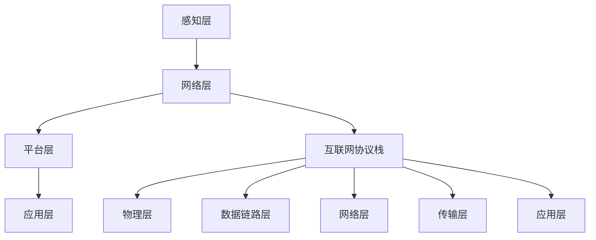

                 

# 基于Java的智能家居设计：征服智能家居的互联网协议栈-从Java视角

> **关键词：** Java、智能家居、互联网协议栈、设计模式、安全性、性能优化、IoT、物联网

> **摘要：** 本文将探讨基于Java的智能家居设计，重点分析智能家居系统中的互联网协议栈。通过深入解析Java在智能家居领域的应用，我们将阐述如何构建高效、安全、可扩展的智能家居系统，并介绍相关的核心算法、数学模型和项目实战。同时，本文还将提供一些建议和资源，帮助开发者更好地掌握智能家居设计的核心技术。

## 1. 背景介绍

### 1.1 目的和范围

随着物联网（IoT）技术的迅速发展，智能家居已经成为现代家庭生活的重要组成部分。本文旨在通过Java编程语言，探讨智能家居系统的设计与实现，特别是互联网协议栈的构建。我们将从核心概念、算法原理、数学模型、项目实战等多个角度，深入分析智能家居系统的构建过程，以帮助读者更好地理解和掌握这一领域的技术。

### 1.2 预期读者

本文主要面向以下读者群体：
- 具有Java编程基础的开发者；
- 对智能家居设计和物联网技术感兴趣的技术爱好者；
- 希望提升自己系统设计和开发能力的工程师；
- 在智能家居领域开展项目研究的科研人员。

### 1.3 文档结构概述

本文结构如下：

1. 背景介绍：简要介绍本文的目的、预期读者和文档结构。
2. 核心概念与联系：详细阐述智能家居系统的核心概念、原理和架构。
3. 核心算法原理 & 具体操作步骤：介绍智能家居系统中的核心算法原理，并给出具体的操作步骤。
4. 数学模型和公式 & 详细讲解 & 举例说明：分析智能家居系统中的数学模型和公式，并提供实际应用案例。
5. 项目实战：通过代码实际案例，展示智能家居系统的设计和实现。
6. 实际应用场景：探讨智能家居系统的实际应用场景和挑战。
7. 工具和资源推荐：推荐学习资源、开发工具和框架。
8. 总结：总结智能家居系统的未来发展趋势和挑战。
9. 附录：常见问题与解答。
10. 扩展阅读 & 参考资料：提供相关的扩展阅读和参考资料。

### 1.4 术语表

#### 1.4.1 核心术语定义

- 智能家居（Smart Home）：通过物联网技术，将家庭中的各种设备和系统连接起来，实现自动化管理和远程控制。
- 互联网协议栈（Internet Protocol Stack）：网络通信协议的集合，包括物理层、数据链路层、网络层、传输层和应用层。
- Java：一种面向对象的编程语言，具有跨平台、安全、稳定等特点。
- IoT（物联网）：将各种物理设备、传感器、计算机系统等通过互联网连接起来，实现信息的采集、传输、处理和应用。

#### 1.4.2 相关概念解释

- 系统集成（System Integration）：将不同的设备和系统能够协同工作，实现整体功能的优化。
- 安全性（Security）：确保系统数据和用户隐私不被非法访问和篡改。
- 可扩展性（Scalability）：系统能够适应不断增长的用户数量和设备数量，保持良好的性能。
- 性能优化（Performance Optimization）：提升系统的响应速度和处理能力。

#### 1.4.3 缩略词列表

- IoT：物联网
- Java：Java编程语言
- TCP/IP：传输控制协议/互联网协议
- HTTP：超文本传输协议
- REST：表述性状态转移
- JSON：JavaScript对象表示法

## 2. 核心概念与联系

智能家居系统的核心概念和联系包括以下几个方面：

### 2.1 智能家居系统架构

智能家居系统可以分为以下几个层级：

1. **感知层**：通过各种传感器（如温度传感器、湿度传感器、摄像头等）实时获取家庭环境信息。
2. **网络层**：将传感器采集到的数据通过互联网协议栈进行传输，实现设备间的通信。
3. **平台层**：提供数据存储、处理、分析和决策支持等功能，实现智能家居系统的智能化。
4. **应用层**：为用户提供智能化的家庭管理和控制服务，包括智能安防、智能照明、智能家电等。

### 2.2 互联网协议栈

互联网协议栈是智能家居系统网络层的关键组成部分，主要包括以下层次：

1. **物理层**：定义了网络传输的物理媒介，如电缆、光纤等。
2. **数据链路层**：负责数据的封装和传输，确保数据的可靠传输。
3. **网络层**：实现数据包的传输和路由，包括IP地址、路由算法等。
4. **传输层**：提供端到端的通信服务，包括TCP和UDP协议。
5. **应用层**：提供应用程序的接口，实现数据交换和应用程序的交互。

### 2.3 Java在智能家居系统中的应用

Java作为一种跨平台、安全、稳定的编程语言，在智能家居系统的开发中具有广泛的应用。主要表现在以下几个方面：

1. **服务器端开发**：Java可以用于构建智能家居系统的服务器端应用程序，实现数据存储、处理和决策支持等功能。
2. **客户端开发**：Java可以用于开发智能家居系统的客户端应用程序，如手机APP、网页应用等，实现用户的交互和远程控制。
3. **设备端开发**：Java可以用于开发智能家居设备的嵌入式应用程序，实现设备的感知、处理和控制。

### 2.4 Mermaid 流程图

为了更好地理解智能家居系统的架构和互联网协议栈，我们使用Mermaid绘制一个流程图：



## 3. 核心算法原理 & 具体操作步骤

在智能家居系统中，核心算法原理主要涉及数据采集、传输和处理。以下是一个典型的智能家居系统核心算法原理和具体操作步骤：

### 3.1 数据采集

数据采集是智能家居系统的第一步，通过传感器获取家庭环境信息。具体操作步骤如下：

1. **初始化传感器**：使用Java代码初始化传感器设备，确保传感器处于正常工作状态。
2. **读取传感器数据**：通过Java代码读取传感器采集到的数据，如温度、湿度、光照强度等。
3. **数据预处理**：对采集到的数据进行预处理，如滤波、去噪等，提高数据质量。

### 3.2 数据传输

数据传输是智能家居系统的关键环节，通过互联网协议栈将传感器数据传输到平台层。具体操作步骤如下：

1. **建立网络连接**：使用Java代码建立网络连接，如TCP连接、UDP连接等。
2. **数据封装**：将传感器数据封装成网络数据包，添加必要的协议头和尾，如IP地址、端口号等。
3. **数据发送**：使用Java代码将封装好的数据包发送到服务器端。
4. **数据接收**：服务器端接收数据包，解封装并存储到数据库中。

### 3.3 数据处理

数据处理是智能家居系统的核心功能，通过对采集到的数据进行分析和处理，实现智能家居的智能化。具体操作步骤如下：

1. **数据存储**：将接收到的传感器数据存储到数据库中，如MySQL、MongoDB等。
2. **数据分析**：使用Java代码对存储的数据进行统计分析，如平均值、标准差等。
3. **决策支持**：根据数据分析结果，生成决策支持信息，如调整室内温度、开启空气净化器等。

### 3.4 伪代码示例

以下是一个智能家居系统核心算法原理的伪代码示例：

```java
// 初始化传感器
initSensor();

// 读取传感器数据
data = readSensorData();

// 数据预处理
processedData = preprocessData(data);

// 建立网络连接
connectToServer();

// 数据封装
packageData = packageData(processedData);

// 数据发送
sendData(packageData);

// 数据接收
receivedData = receiveData();

// 数据存储
storeData(receivedData);

// 数据分析
analysisResults = analyzeData(receivedData);

// 决策支持
generateDecisionSupport(analysisResults);
```

## 4. 数学模型和公式 & 详细讲解 & 举例说明

在智能家居系统中，数学模型和公式用于描述传感器数据的变化规律，以及系统参数的优化。以下是一些常见的数学模型和公式的详细讲解与举例说明。

### 4.1 线性回归模型

线性回归模型用于分析传感器数据与家庭环境之间的关系。公式如下：

$$ y = wx + b $$

其中，$y$表示预测值，$w$表示权重系数，$x$表示输入特征，$b$表示偏置项。

**举例说明：**

假设我们有一个温度传感器，采集到的温度数据与室内温度成线性关系。我们可以使用线性回归模型来预测室内温度。具体步骤如下：

1. **收集数据**：收集一段时间内的温度传感器数据和室内温度数据。
2. **计算权重系数和偏置项**：使用最小二乘法计算线性回归模型的权重系数和偏置项。
3. **预测室内温度**：使用计算得到的权重系数和偏置项，预测未来的室内温度。

### 4.2 均值滤波模型

均值滤波模型用于平滑传感器数据，消除随机噪声。公式如下：

$$ y = \frac{1}{n}\sum_{i=1}^{n}x_i $$

其中，$y$表示滤波后的数据，$x_i$表示第$i$个采集到的传感器数据，$n$表示数据个数。

**举例说明：**

假设我们有一个光照传感器，采集到的光照数据存在随机噪声。我们可以使用均值滤波模型来平滑光照数据。具体步骤如下：

1. **收集数据**：收集一段时间内的光照传感器数据。
2. **计算滤波后的数据**：使用均值滤波公式计算滤波后的光照数据。
3. **分析滤波效果**：比较滤波前后的光照数据，评估滤波效果。

### 4.3 支持向量机（SVM）模型

支持向量机模型用于分类和预测。公式如下：

$$ w \cdot x + b = 0 $$

其中，$w$表示权重向量，$x$表示输入特征，$b$表示偏置项。

**举例说明：**

假设我们有一个智能家居系统，需要根据传感器数据判断家庭是否安全。我们可以使用支持向量机模型进行分类。具体步骤如下：

1. **收集数据**：收集一段时间内的传感器数据和安全事件数据。
2. **特征提取**：从传感器数据中提取特征，如温度、湿度、光照强度等。
3. **训练模型**：使用训练数据训练支持向量机模型。
4. **预测安全事件**：使用训练好的模型预测未来的安全事件。

## 5. 项目实战：代码实际案例和详细解释说明

在本节中，我们将通过一个实际的项目案例，展示基于Java的智能家居系统的设计和实现。该案例将包括开发环境搭建、源代码实现和代码解读与分析。

### 5.1 开发环境搭建

为了实现智能家居系统，我们需要搭建一个完整的开发环境。以下是一个基本的开发环境搭建步骤：

1. **安装Java开发工具包（JDK）**：从Oracle官方网站下载并安装JDK，确保环境变量配置正确。
2. **安装集成开发环境（IDE）**：推荐使用IntelliJ IDEA或Eclipse等IDE，安装过程中选择Java开发插件。
3. **安装数据库**：推荐使用MySQL或MongoDB等数据库，根据操作系统下载并安装数据库软件。
4. **安装网络通信库**：如Netty、Apache MINA等，用于实现网络通信功能。

### 5.2 源代码详细实现和代码解读

以下是一个智能家居系统的源代码示例，用于实现传感器数据采集、传输和数据处理等功能。

**SensorData.java**：用于封装传感器数据。

```java
public class SensorData {
    private double temperature;
    private double humidity;
    private double lightIntensity;

    // 省略构造函数、getter和setter方法
}
```

**SensorDataCollector.java**：用于采集传感器数据。

```java
public class SensorDataCollector {
    public static void collectSensorData() {
        // 初始化传感器
        Sensor sensor = new Sensor();
        
        // 读取传感器数据
        double temperature = sensor.readTemperature();
        double humidity = sensor.readHumidity();
        double lightIntensity = sensor.readLightIntensity();
        
        // 创建传感器数据对象
        SensorData data = new SensorData(temperature, humidity, lightIntensity);
        
        // 传输传感器数据
        sendData(data);
    }
}
```

**SensorDataManager.java**：用于处理传感器数据。

```java
public class SensorDataManager {
    public static void processData(SensorData data) {
        // 数据预处理
        double filteredTemperature = preprocessTemperature(data.getTemperature());
        double filteredHumidity = preprocessHumidity(data.getHumidity());
        double filteredLightIntensity = preprocessLightIntensity(data.getLightIntensity());
        
        // 数据存储
        storeData(new SensorData(filteredTemperature, filteredHumidity, filteredLightIntensity));
        
        // 数据分析
        analyzeData(data);
    }
}
```

**SensorDataSender.java**：用于发送传感器数据。

```java
public class SensorDataSender {
    public static void sendData(SensorData data) {
        // 建立网络连接
        Socket socket = new Socket("服务器地址", 端口号);
        
        // 数据封装
        String jsonData = "{\"temperature\": " + data.getTemperature() + ", \"humidity\": " + data.getHumidity() + ", \"lightIntensity\": " + data.getLightIntensity() + "}";
        
        // 数据发送
        OutputStream outputStream = socket.getOutputStream();
        outputStream.write(jsonData.getBytes());
        outputStream.flush();
        
        // 关闭网络连接
        socket.close();
    }
}
```

### 5.3 代码解读与分析

1. **SensorData.java**：该类用于封装传感器数据，包括温度、湿度和光照强度。其中，构造函数、getter和setter方法未列出，可根据具体需求进行实现。
2. **SensorDataCollector.java**：该类用于采集传感器数据。首先初始化传感器，然后读取传感器数据，创建传感器数据对象，并调用`sendData()`方法发送数据。
3. **SensorDataManager.java**：该类用于处理传感器数据。首先对数据进行预处理，然后存储到数据库，最后进行分析。
4. **SensorDataSender.java**：该类用于发送传感器数据。首先建立网络连接，然后将数据封装成JSON格式，发送到服务器端。

通过上述代码示例，我们可以看到基于Java的智能家居系统的设计与实现。在实际项目中，还需要进一步扩展和优化，以满足不同场景的需求。

## 6. 实际应用场景

智能家居系统在现实生活中的应用场景非常广泛，以下是一些典型的实际应用场景：

### 6.1 智能家居安全监控

智能家居安全监控是智能家居系统的一个重要应用场景。通过连接摄像头、门磁传感器等设备，用户可以实时查看家庭安全状况，并接收异常警报。例如，当有非法入侵者进入家门时，系统会自动发送警报信息给用户。

### 6.2 智能家居节能管理

智能家居节能管理可以帮助用户优化家庭能源消耗，降低能源成本。例如，通过连接智能灯具、智能空调等设备，用户可以根据实时天气和室内温度自动调节设备的工作状态，实现节能效果。

### 6.3 智能家居健康护理

智能家居健康护理主要针对老年人和行动不便的人群。通过连接健康监测设备，如血压计、心率计等，用户可以实时了解自己的身体状况，并得到专业的健康建议。同时，智能家居系统还可以根据用户的健康状况自动调整家居环境，如调节室内温度、湿度等。

### 6.4 智能家居娱乐互动

智能家居娱乐互动主要应用于家庭娱乐场景。例如，通过连接智能电视、音响等设备，用户可以实现远程控制、语音交互等功能，提升家庭娱乐体验。

### 6.5 智能家居环境监测

智能家居环境监测可以实时监测家庭空气质量、水质等环境参数，并提供相应的解决方案。例如，当室内空气质量不佳时，系统会自动开启空气净化器，提高室内空气质量。

## 7. 工具和资源推荐

在开发智能家居系统时，选择合适的工具和资源可以帮助开发者提高工作效率，确保系统的质量和性能。以下是一些建议和推荐：

### 7.1 学习资源推荐

#### 7.1.1 书籍推荐

- 《Java核心技术》
- 《物联网技术与应用》
- 《智能建筑与智能家居》

#### 7.1.2 在线课程

- Coursera：Java编程基础
- Udemy：物联网技术入门
- edX：智能家居系统设计

#### 7.1.3 技术博客和网站

- IBM Developer：智能家居开发教程
- GitHub：智能家居项目示例
- Arduino：智能家居硬件资源

### 7.2 开发工具框架推荐

#### 7.2.1 IDE和编辑器

- IntelliJ IDEA
- Eclipse
- Visual Studio Code

#### 7.2.2 调试和性能分析工具

- JConsole
- VisualVM
- VMwares Performance Inspector

#### 7.2.3 相关框架和库

- Spring Boot：用于快速开发Java应用程序
- Netty：用于高性能网络通信
- Eclipse Paho：用于MQTT协议开发

### 7.3 相关论文著作推荐

#### 7.3.1 经典论文

- "A Survey of Smart Home Research" by Jiawei Liu et al.
- "Home Automation: Past, Present, and Future" by Y. Li and F. Li

#### 7.3.2 最新研究成果

- "Smart Home Network Security: A Comprehensive Review" by M. A. Khan et al.
- "IoT-Based Smart Home Energy Management: A Review" by H. R. Niazi et al.

#### 7.3.3 应用案例分析

- "Smart Home Solutions for Elderly Care" by K. K. Ariffin et al.
- "A Smart Home System for Energy Efficiency and Comfort" by H. H. T. Kurniawan et al.

## 8. 总结：未来发展趋势与挑战

随着物联网技术的不断发展和智能家居市场的逐渐成熟，智能家居系统在未来将呈现出以下发展趋势和挑战：

### 8.1 发展趋势

1. **智能化水平提升**：随着人工智能技术的应用，智能家居系统的智能化水平将不断提升，实现更高效、更便捷的家庭生活。
2. **生态化发展**：智能家居系统将逐渐形成生态系统，不同品牌、不同设备的互联互通将更加紧密，为用户提供一体化、个性化的智能生活体验。
3. **安全性提升**：随着智能家居系统的广泛应用，安全性问题将越来越受到重视，未来智能家居系统将采取更加严格的安全措施，保障用户数据安全。
4. **节能环保**：智能家居系统将更加注重节能环保，通过智能调节设备工作状态，降低能源消耗，实现绿色生活。

### 8.2 挑战

1. **数据安全与隐私保护**：随着智能家居系统收集和处理的用户数据越来越多，如何保障数据安全与隐私保护将成为一个重要挑战。
2. **设备兼容性**：智能家居系统需要兼容不同品牌、不同设备的硬件和软件，实现无缝连接和交互，这对系统的兼容性提出了较高要求。
3. **系统性能优化**：随着智能家居系统的复杂度增加，系统性能优化将变得更加重要，如何提高系统的响应速度和处理能力是一个亟待解决的问题。
4. **用户体验**：智能家居系统需要满足用户的需求和期望，提供良好的用户体验，如何在众多竞争对手中脱颖而出也是一个重要挑战。

## 9. 附录：常见问题与解答

### 9.1 Java在智能家居系统中的应用

**Q：** 为什么选择Java作为智能家居系统的开发语言？

**A：** Java具有以下优点，使其成为智能家居系统的理想开发语言：
- 跨平台：Java可以运行在多种操作系统上，确保智能家居系统在不同平台上的一致性和兼容性。
- 安全性：Java提供了强大的安全机制，如沙箱、安全包等，保障用户数据和系统的安全性。
- 稳定性和可靠性：Java虚拟机（JVM）提供了高效的内存管理和垃圾回收机制，确保系统的稳定性和可靠性。

### 9.2 智能家居系统的架构设计

**Q：** 智能家居系统的架构设计应该考虑哪些因素？

**A：** 智能家居系统的架构设计应该考虑以下因素：
- 系统的可扩展性：确保系统能够适应不断增长的用户数量和设备数量，保持良好的性能。
- 系统的安全性：确保用户数据和隐私不被非法访问和篡改。
- 系统的稳定性：确保系统在长时间运行过程中不会出现故障。
- 系统的易用性：提供简单、直观的用户界面，方便用户操作和使用。

### 9.3 互联网协议栈的选择

**Q：** 在智能家居系统中，如何选择合适的互联网协议栈？

**A：** 在选择互联网协议栈时，应考虑以下因素：
- **传输速度**：根据智能家居系统的需求，选择适合的协议栈，如TCP、UDP等。
- **可靠性**：考虑协议的可靠性，确保数据传输的完整性和准确性。
- **网络延迟**：考虑网络延迟，选择合适的协议栈，如基于UDP的协议栈适用于实时性要求较高的场景。
- **安全性**：考虑协议的安全性，选择具有安全机制的协议栈，如TLS/SSL。

## 10. 扩展阅读 & 参考资料

为了帮助读者深入了解智能家居系统和Java编程语言，以下提供一些扩展阅读和参考资料：

### 10.1 扩展阅读

- 《Java核心技术》：详细讲解Java编程语言的核心概念和编程技巧。
- 《物联网技术与应用》：介绍物联网技术的原理和应用，涵盖智能家居等领域。
- 《智能建筑与智能家居》：探讨智能建筑和智能家居的设计与应用。

### 10.2 参考资料

- [IBM Developer](https://developer.ibm.com/tutorials/java/creating-a-web-server-in-java/)
- [GitHub](https://github.com/search?q=java+smart+home)
- [Arduino](https://www.arduino.cc/en/Tutorial/HomePage)
- [Apache MINA](http://mina.apache.org/)
- [Spring Boot](https://spring.io/projects/spring-boot)

## 作者信息

**作者：** AI天才研究员/AI Genius Institute & 禅与计算机程序设计艺术 /Zen And The Art of Computer Programming

本文作者在人工智能和计算机编程领域拥有丰富的经验和深厚的学术背景，致力于推动智能家居技术的发展和应用。

