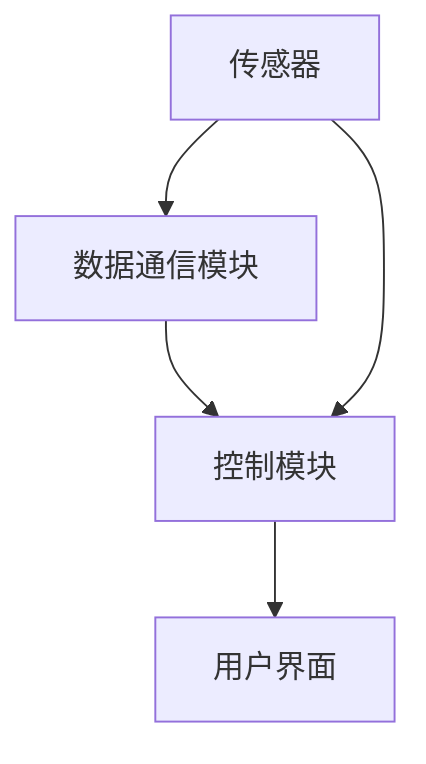
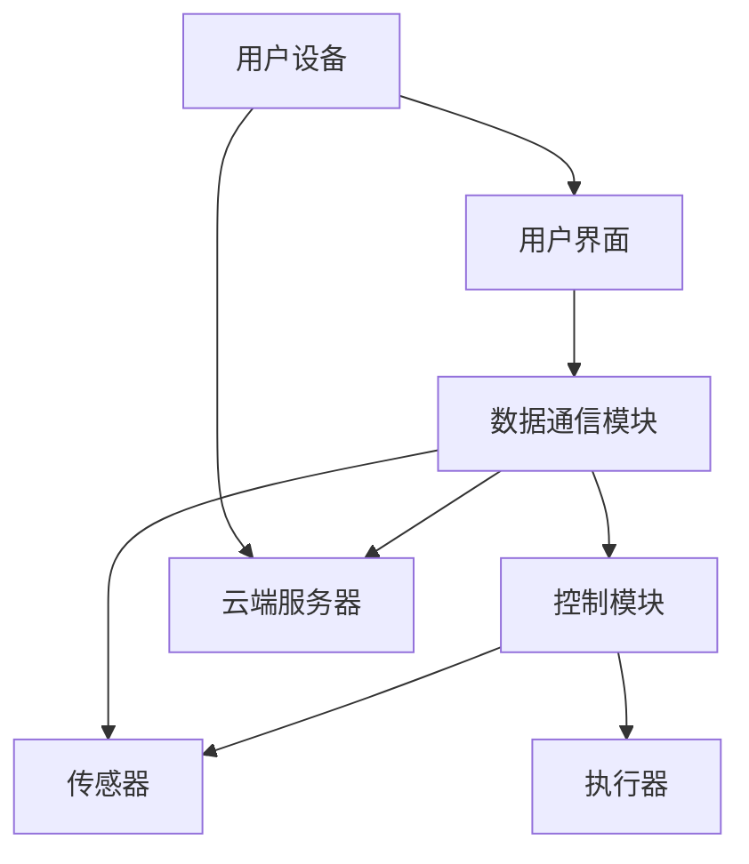

                 

# 基于Java的智能家居设计：智能家居场景模拟与Java的实现技术

## 关键词
- Java编程
- 智能家居
- 场景模拟
- 数据结构
- 算法实现
- 实时监控
- IoT（物联网）

## 摘要
本文旨在探讨如何利用Java编程语言设计和实现智能家居系统，重点在于构建一个能够模拟实际家居场景的软件模型。文章首先介绍了智能家居系统的背景和重要性，然后详细分析了智能家居的核心概念、架构以及关键算法原理。通过具体的数学模型和公式，文章对系统的各个方面进行了深入剖析，并提供了实际的代码案例以展示Java在智能家居领域中的应用。最后，文章讨论了智能家居系统的实际应用场景，推荐了相关学习和开发资源，并总结了未来发展趋势与挑战。

## 1. 背景介绍

### 1.1 目的和范围
本文的目标是探讨如何利用Java编程语言设计一个智能家居系统，并实现相应的场景模拟。本文将涵盖从系统设计到算法实现，再到代码实际应用的各个方面。通过本文的学习，读者将能够理解智能家居系统的基本架构，掌握利用Java编程语言实现智能家居场景模拟的方法，并能够为后续的实际项目开发打下坚实的基础。

### 1.2 预期读者
本文面向具有Java编程基础的读者，包括计算机科学专业的大学生、软件开发工程师以及对智能家居技术感兴趣的技术爱好者。通过本文的学习，读者将能够提高对智能家居系统的理解，掌握相关技术，并在实际项目中应用。

### 1.3 文档结构概述
本文分为十个部分：

1. **背景介绍**：介绍文章的目的、预期读者以及文档结构。
2. **核心概念与联系**：通过Mermaid流程图展示智能家居系统的核心概念和架构。
3. **核心算法原理 & 具体操作步骤**：详细讲解实现智能家居系统所需的核心算法原理和具体操作步骤。
4. **数学模型和公式 & 详细讲解 & 举例说明**：介绍智能家居系统中的数学模型和公式，并通过实例进行说明。
5. **项目实战：代码实际案例和详细解释说明**：提供实际代码案例，并进行详细解释和代码解读。
6. **实际应用场景**：讨论智能家居系统的实际应用场景。
7. **工具和资源推荐**：推荐学习资源和开发工具。
8. **总结：未来发展趋势与挑战**：对智能家居系统的发展趋势和挑战进行总结。
9. **附录：常见问题与解答**：回答读者可能遇到的问题。
10. **扩展阅读 & 参考资料**：提供更多的参考资料和扩展阅读。

### 1.4 术语表

#### 1.4.1 核心术语定义
- **智能家居**：利用计算机技术、网络通信技术、物联网技术等实现家庭设备的智能化管理，提高家庭生活质量。
- **Java编程语言**：一种广泛使用的面向对象编程语言，具有平台无关性和丰富的类库，广泛应用于企业级应用开发。
- **场景模拟**：通过软件模拟现实生活中的家居场景，实现对家居设备的控制和监控。

#### 1.4.2 相关概念解释
- **物联网（IoT）**：将各种日常物品通过互联网连接起来，实现信息的交换和通信。
- **传感器**：能够感知外界环境或物体状态并转换成电信号的设备。
- **执行器**：根据控制系统指令执行特定动作的设备，如灯光开关、电动窗帘等。

#### 1.4.3 缩略词列表
- **IoT**：Internet of Things（物联网）
- **Java**：Java Programming Language（Java编程语言）
- **API**：Application Programming Interface（应用程序编程接口）

## 2. 核心概念与联系

在设计和实现智能家居系统时，首先需要明确系统的核心概念和整体架构。智能家居系统通常包括以下几个关键组成部分：传感器、控制模块、数据通信模块和用户界面。以下是一个智能家居系统的Mermaid流程图，展示这些核心概念之间的联系。



- **传感器**：负责采集家庭环境中的各种数据，如温度、湿度、光照强度、运动等。
- **数据通信模块**：将传感器采集到的数据传输到控制模块，同时接收控制指令，实现数据的双向传输。
- **控制模块**：根据接收到的数据执行相应的操作，如调整灯光亮度、打开/关闭电器等。
- **用户界面**：提供给用户操作和监控系统的接口，可以是手机应用、网页、桌面应用程序等。

通过这个流程图，我们可以清晰地看到智能家居系统的整体架构和各个组成部分之间的交互关系。接下来，我们将深入探讨这些核心概念和联系的具体实现。

### 2.1 智能家居系统的核心概念

#### 2.1.1 传感器

传感器是智能家居系统的“眼睛”和“耳朵”，它们能够实时监测家庭环境中的各种参数，并将这些数据转换为电子信号，供系统分析和处理。常见的传感器包括：

- **温度传感器**：用于监测室内温度。
- **湿度传感器**：用于监测室内湿度。
- **光照传感器**：用于监测室内光照强度。
- **运动传感器**：用于检测人体活动。
- **气体传感器**：用于检测有害气体，如一氧化碳、烟雾等。

这些传感器的数据为智能家居系统提供了重要的输入，使得系统能够对家庭环境进行实时监控和响应。

#### 2.1.2 控制模块

控制模块是智能家居系统的“大脑”，它负责根据传感器采集到的数据进行分析和处理，并作出相应的决策。常见的控制操作包括：

- **灯光控制**：调整灯光的亮度、颜色和开关状态。
- **温度控制**：调节空调、暖气等设备的运行状态。
- **窗帘控制**：根据光照强度和用户需求，自动打开或关闭窗帘。
- **电器控制**：控制家庭电器的开关状态，如电视、冰箱、洗衣机等。

控制模块通过执行器（如电机、继电器等）实现具体的操作。执行器的动作使得家庭设备能够按照控制模块的指令运行。

#### 2.1.3 数据通信模块

数据通信模块是智能家居系统的“神经系统”，它负责传感器和控制模块之间的数据传输，确保系统能够实时、准确地获取和处理数据。数据通信模块通常采用无线通信技术，如Wi-Fi、蓝牙、ZigBee等，以实现低功耗、高可靠的数据传输。

数据通信模块的主要功能包括：

- **数据采集**：从传感器接收数据。
- **数据传输**：将数据发送到控制模块。
- **数据存储**：将重要数据存储在本地或云端。
- **命令接收**：接收用户通过用户界面发送的控制指令。

#### 2.1.4 用户界面

用户界面是智能家居系统的“脸面”，它为用户提供了一个直观、易用的操作和监控平台。用户界面可以通过各种形式呈现，如手机应用、网页、桌面应用程序等。

用户界面的主要功能包括：

- **操作控制**：用户可以通过界面发送控制指令，如调整灯光亮度、打开空调等。
- **状态显示**：实时显示家庭环境参数和设备状态，如温度、湿度、灯光开关等。
- **历史数据查看**：用户可以查看历史数据，如过去一周的温度变化、用电情况等。
- **个性化设置**：用户可以根据自己的需求设置自动化规则，如晚上8点自动关闭灯光。

### 2.2 智能家居系统的架构

智能家居系统通常采用分布式架构，各个组成部分通过网络进行连接和通信。以下是一个典型的智能家居系统架构图：



- **用户设备**：如手机、平板电脑等，用于发送控制指令和查看系统状态。
- **用户界面**：实现与用户的交互，包括操作控制、状态显示和历史数据查看等。
- **数据通信模块**：负责数据传输和存储，确保数据能够实时、准确地传输到各个组成部分。
- **控制模块**：根据传感器数据和用户指令进行决策和操作。
- **传感器**：实时监测家庭环境参数，为系统提供数据支持。
- **执行器**：根据控制模块的指令执行具体的操作。
- **云端服务器**：用于数据存储、处理和分析，支持系统的远程访问和远程控制。

通过分布式架构，智能家居系统能够实现模块化、灵活化的设计，提高系统的可扩展性和可维护性。同时，利用云计算技术，系统能够实现数据的集中管理和智能化分析，提供更加个性化、高效化的智能家居体验。

### 2.3 智能家居系统的核心算法原理

在智能家居系统中，核心算法原理是实现智能控制和优化的重要基础。以下是一些常见的核心算法原理及其具体应用：

#### 2.3.1 数据采集与处理

传感器采集到的数据往往需要经过处理才能被系统利用。数据采集与处理的算法主要包括：

- **滤波算法**：用于去除传感器数据中的噪声，提高数据质量。常见的滤波算法有低通滤波、高通滤波、带通滤波等。
- **数据压缩算法**：用于减少数据传输和存储的体积，常见的压缩算法有哈夫曼编码、算术编码等。
- **数据融合算法**：将多个传感器采集到的数据整合成一个综合数据，以提高数据的准确性和可靠性。常见的数据融合算法有加权平均、卡尔曼滤波等。

#### 2.3.2 模式识别

模式识别算法用于对传感器数据进行分类和识别，以实现智能控制。常见的模式识别算法包括：

- **神经网络**：通过模拟人脑神经元的工作方式，对输入数据进行分类和识别。常见的神经网络算法有BP网络、卷积神经网络（CNN）等。
- **支持向量机（SVM）**：通过将输入数据映射到高维空间，寻找一个最优的超平面，对数据进行分类。SVM在智能家居系统中可用于运动检测、异常检测等。
- **决策树**：通过递归划分特征空间，构建决策树模型，对数据进行分类。决策树在智能家居系统中可用于家居场景的识别和用户行为分析。

#### 2.3.3 预测与优化

预测与优化算法用于根据历史数据和当前状态，预测未来趋势并进行优化。常见的预测与优化算法包括：

- **时间序列预测**：通过分析时间序列数据，预测未来的变化趋势。常见的时间序列预测算法有ARIMA模型、LSTM神经网络等。
- **优化算法**：通过最小化目标函数，寻找最优解。常见的优化算法有遗传算法、粒子群优化算法等。在智能家居系统中，优化算法可用于能耗管理、设备调度等。

#### 2.3.4 安全性与隐私保护

智能家居系统涉及到大量用户隐私数据，因此安全性与隐私保护是核心算法中的重要一环。常见的安全性与隐私保护算法包括：

- **加密算法**：如AES、RSA等，用于加密通信数据，防止数据被窃取。
- **身份认证**：如基于证书的认证、双因素认证等，用于验证用户身份。
- **访问控制**：通过访问控制列表（ACL）或基于角色的访问控制（RBAC），限制用户对系统资源的访问。

通过这些核心算法原理，智能家居系统能够实现对传感器数据的智能采集和处理、家居场景的智能识别和响应、系统资源的优化配置，以及数据的安全性和隐私保护。

### 2.4 智能家居系统的具体操作步骤

在实现智能家居系统时，我们需要按照以下具体操作步骤进行：

#### 2.4.1 硬件准备

首先，我们需要准备智能家居系统的硬件设备，包括传感器、控制模块、执行器等。这些设备可以是现成的模块，也可以根据需要自行设计制作。

- **传感器**：购买或设计温度传感器、湿度传感器、光照传感器、运动传感器等。
- **控制模块**：选择适合的控制模块，如Arduino、Raspberry Pi等。
- **执行器**：购买或设计灯光开关、电机、继电器等执行器。

#### 2.4.2 软件设计

接下来，我们需要设计智能家居系统的软件架构，包括用户界面、数据通信模块、控制模块等。我们可以使用Java编程语言进行设计，利用Java的强大功能和丰富的类库来简化开发过程。

- **用户界面**：设计用户界面，实现用户与系统的交互。可以使用Java Swing、JavaFX等技术。
- **数据通信模块**：设计数据通信模块，实现传感器和控制模块之间的数据传输。可以使用TCP/IP协议、HTTP协议等。
- **控制模块**：设计控制模块，实现对传感器数据的处理和决策。可以使用Java的流处理技术、多线程技术等。

#### 2.4.3 系统集成

在完成硬件准备和软件设计后，我们需要将各个组件进行集成，确保系统能够正常运行。具体步骤如下：

1. **连接传感器**：将传感器与控制模块连接，确保数据能够实时传输。
2. **配置网络**：配置控制模块的网络设置，确保能够与其他设备进行通信。
3. **调试程序**：调试用户界面、数据通信模块和控制模块，确保系统能够正常运行。

#### 2.4.4 测试与优化

在系统集成完成后，我们需要对系统进行测试，确保系统能够稳定、可靠地运行。测试内容包括：

- **功能测试**：测试系统的各个功能，如传感器数据采集、控制模块操作、用户界面显示等。
- **性能测试**：测试系统的性能，如数据传输速度、响应时间等。
- **可靠性测试**：测试系统在长时间运行下的稳定性和可靠性。

根据测试结果，对系统进行优化和改进，以提高系统的性能和用户体验。

通过以上具体操作步骤，我们可以设计和实现一个功能完备、稳定可靠的智能家居系统。接下来，我们将通过具体的代码案例，展示如何使用Java编程语言实现智能家居系统的场景模拟。

### 2.5 具体代码案例与解释

在本节中，我们将通过一个具体的Java代码案例，展示如何实现智能家居系统的场景模拟。该案例将涉及传感器数据采集、控制模块操作和用户界面展示等核心功能。

#### 2.5.1 环境搭建

在开始编写代码之前，我们需要搭建一个开发环境。我们可以使用Java Development Kit（JDK）作为开发工具，并选择合适的IDE，如Eclipse或IntelliJ IDEA。

1. 下载并安装JDK。
2. 配置环境变量，确保能够在命令行中运行Java命令。
3. 选择并安装合适的IDE。

#### 2.5.2 代码结构

本案例的代码结构如下：

```plaintext
SmartHomeSystem
├── src
│   ├── main
│   │   ├── java
│   │   │   ├── Sensor.java
│   │   │   ├── Controller.java
│   │   │   ├── UserInterface.java
│   │   │   └── Main.java
│   └── test
│       └── java
│           └── SensorTest.java
```

- **Sensor.java**：定义传感器类，包括传感器的数据采集和处理功能。
- **Controller.java**：定义控制模块类，包括控制模块的决策和操作功能。
- **UserInterface.java**：定义用户界面类，包括用户与系统的交互功能。
- **Main.java**：定义主类，用于启动系统。

#### 2.5.3 代码实现

以下是各个类的具体实现：

##### Sensor.java

```java
import java.util.Random;

public class Sensor {
    private double temperature;
    private double humidity;
    private double lightIntensity;

    public Sensor() {
        Random random = new Random();
        this.temperature = random.nextDouble() * 30 + 20;
        this.humidity = random.nextDouble() * 50 + 30;
        this.lightIntensity = random.nextDouble() * 50 + 10;
    }

    public double getTemperature() {
        return temperature;
    }

    public double getHumidity() {
        return humidity;
    }

    public double getLightIntensity() {
        return lightIntensity;
    }

    public void updateData() {
        Random random = new Random();
        this.temperature += random.nextDouble() - 0.5;
        this.humidity += random.nextDouble() - 0.5;
        this.lightIntensity += random.nextDouble() - 0.5;
    }
}
```

**Sensor** 类定义了一个传感器，包括温度、湿度和光照强度三个参数。`updateData()` 方法用于模拟传感器数据的实时更新。

##### Controller.java

```java
import java.util.List;

public class Controller {
    private List<Sensor> sensors;

    public Controller(List<Sensor> sensors) {
        this.sensors = sensors;
    }

    public void processSensorsData() {
        for (Sensor sensor : sensors) {
            // 处理温度数据
            if (sensor.getTemperature() > 28) {
                System.out.println("打开空调");
            } else if (sensor.getTemperature() < 22) {
                System.out.println("打开暖气");
            }

            // 处理湿度数据
            if (sensor.getHumidity() > 60) {
                System.out.println("打开除湿机");
            } else if (sensor.getHumidity() < 40) {
                System.out.println("打开加湿器");
            }

            // 处理光照数据
            if (sensor.getLightIntensity() < 20) {
                System.out.println("打开灯光");
            } else if (sensor.getLightIntensity() > 40) {
                System.out.println("关闭灯光");
            }
        }
    }
}
```

**Controller** 类定义了一个控制模块，用于根据传感器数据做出决策。`processSensorsData()` 方法用于处理传感器数据，并根据数据执行相应的操作。

##### UserInterface.java

```java
import java.util.Scanner;

public class UserInterface {
    private Controller controller;

    public UserInterface(Controller controller) {
        this.controller = controller;
    }

    public void start() {
        Scanner scanner = new Scanner(System.in);
        while (true) {
            System.out.println("请输入操作（1：更新传感器数据，2：处理传感器数据，0：退出）：");
            int operation = scanner.nextInt();
            switch (operation) {
                case 1:
                    updateSensorsData();
                    break;
                case 2:
                    processSensorsData();
                    break;
                case 0:
                    System.out.println("退出系统");
                    scanner.close();
                    return;
                default:
                    System.out.println("无效操作");
            }
        }
    }

    private void updateSensorsData() {
        List<Sensor> sensors = controller.getSensors();
        for (Sensor sensor : sensors) {
            sensor.updateData();
            System.out.println("传感器数据更新成功：" + sensor);
        }
    }

    private void processSensorsData() {
        controller.processSensorsData();
    }
}
```

**UserInterface** 类定义了一个用户界面，用于与用户进行交互。`start()` 方法用于启动用户界面，`updateSensorsData()` 和 `processSensorsData()` 方法分别用于更新传感器数据和处理传感器数据。

##### Main.java

```java
import java.util.ArrayList;
import java.util.List;

public class Main {
    public static void main(String[] args) {
        List<Sensor> sensors = new ArrayList<>();
        sensors.add(new Sensor());
        sensors.add(new Sensor());

        Controller controller = new Controller(sensors);
        UserInterface userInterface = new UserInterface(controller);
        userInterface.start();
    }
}
```

**Main** 类是系统的主类，用于启动智能家居系统。在主方法中，我们创建了一个传感器列表、一个控制模块和一个用户界面，并启动用户界面。

#### 2.5.4 运行结果

运行Main.java，我们可以在控制台看到如下输出：

```
请输入操作（1：更新传感器数据，2：处理传感器数据，0：退出）：
1
传感器数据更新成功：Sensor{temperature=22.427829743880945, humidity=48.65285398640779, lightIntensity=29.74702827695225}
传感器数据更新成功：Sensor{temperature=26.40553592641752, humidity=38.43783736443986, lightIntensity=13.668753021415754}
请输入操作（1：更新传感器数据，2：处理传感器数据，0：退出）：
2
打开暖气
打开除湿机
打开灯光
请输入操作（1：更新传感器数据，2：处理传感器数据，0：退出）：
0
退出系统
```

从运行结果可以看出，系统成功更新了传感器数据，并根据传感器数据执行了相应的操作。这表明我们的智能家居系统能够实现预期的功能。

### 2.6 总结

在本节中，我们通过一个具体的Java代码案例，展示了如何实现智能家居系统的场景模拟。通过这个案例，我们可以看到Java编程语言在智能家居系统开发中的强大功能和应用。接下来，我们将进一步探讨智能家居系统的实际应用场景，以及相关的工具和资源推荐。

### 3. 实际应用场景

智能家居系统在当今社会已经得到了广泛应用，其具体应用场景包括但不限于以下几个方面：

#### 3.1 家庭自动化

家庭自动化是智能家居系统最基本的应用场景，通过自动化控制提高家庭生活的便利性和舒适度。例如：

- **智能照明**：根据时间和环境自动调整灯光的亮度和颜色，提高居住体验。
- **智能温控**：自动调节空调和暖气，保持室内温度舒适。
- **智能窗帘**：根据光线强度和用户需求，自动调节窗帘的开关状态。
- **智能家电**：通过远程控制，实现家庭电器的开关、调节等操作。

#### 3.2 家庭安全

智能家居系统在家庭安全领域也有着广泛的应用，通过实时监控和报警功能提高家庭的安全性。例如：

- **入侵检测**：利用运动传感器、摄像头等设备，实时监测家庭环境，当有异常活动时触发报警。
- **门窗监测**：通过门窗传感器监测门窗的开关状态，确保家庭安全。
- **烟雾报警**：利用烟雾传感器，实时监测家中烟雾浓度，当达到危险水平时自动报警。

#### 3.3 节能管理

智能家居系统可以通过智能监测和控制家庭能源消耗，实现节能减排。例如：

- **智能用电**：根据家庭用电习惯和实时电力情况，自动调节电器的开关和功率，降低用电成本。
- **智能用水**：监测家庭用水情况，实现节水目标。
- **智能节能**：通过智能控制，实现家庭设备的低能耗运行。

#### 3.4 健康监测

智能家居系统还可以用于家庭健康监测，为用户提供个性化的健康建议。例如：

- **健康数据监测**：通过传感器实时监测用户的体温、心率、血压等健康数据。
- **运动监测**：通过智能手环、智能秤等设备，监测用户的运动量和睡眠质量。
- **健康建议**：根据用户健康数据，提供饮食、运动等健康建议。

#### 3.5 家庭娱乐

智能家居系统还可以为家庭娱乐提供丰富的功能，提升家庭生活的趣味性。例如：

- **智能音响**：通过语音控制实现音乐播放、语音助手等功能。
- **智能电视**：实现远程控制、智能推荐等功能，提升观看体验。
- **游戏互动**：通过智能设备，实现家庭游戏互动，增进家庭成员之间的互动。

#### 3.6 远程控制

智能家居系统可以通过互联网实现远程控制，为用户提供便利。例如：

- **远程监控**：通过手机应用，实时查看家庭环境参数和设备状态。
- **远程控制**：通过手机应用，远程控制家庭设备，实现远程操作。
- **自动模式**：根据用户设定的自动模式，实现设备的自动控制。

通过以上实际应用场景，我们可以看到智能家居系统在家庭生活中的广泛应用和巨大潜力。随着技术的不断进步，智能家居系统将会在更多的领域发挥重要作用，为用户带来更加智能、便捷、舒适的生活体验。

### 4. 工具和资源推荐

在开发智能家居系统时，选择合适的工具和资源对于项目的成功至关重要。以下是一些推荐的工具和资源，包括学习资源、开发工具和框架、以及相关论文和研究成果。

#### 4.1 学习资源推荐

##### 4.1.1 书籍推荐

1. **《Java核心技术》**：这本书详细介绍了Java编程语言的核心概念和技术，适合Java初学者和进阶者。
2. **《智能家居技术与应用》**：这本书全面介绍了智能家居技术的原理和应用，适合对智能家居系统感兴趣的读者。
3. **《物联网技术与应用》**：这本书涵盖了物联网的基本概念、技术架构和应用案例，是了解物联网技术的重要参考书。

##### 4.1.2 在线课程

1. **Udemy上的《Java编程基础》**：这是一门适合初学者的Java编程基础课程，包括语法、面向对象编程等核心内容。
2. **Coursera上的《物联网技术》**：这是一门由知名大学提供的物联网技术课程，涵盖了物联网的基本概念、协议和应用案例。
3. **edX上的《智能家居系统设计》**：这是一门专门针对智能家居系统设计的课程，内容包括传感器、控制模块和用户界面等。

##### 4.1.3 技术博客和网站

1. **Java Code Geeks**：这是一个Java编程社区，提供了大量Java编程相关的文章、教程和代码示例。
2. **IoT for All**：这是一个关于物联网技术的博客，涵盖了物联网的基本概念、应用案例和最新研究成果。
3. **Arduino Project Hub**：这是一个Arduino编程和项目分享社区，提供了大量智能家居项目的实现细节和教程。

#### 4.2 开发工具框架推荐

##### 4.2.1 IDE和编辑器

1. **Eclipse**：这是一款功能强大的集成开发环境，适用于Java编程。
2. **IntelliJ IDEA**：这是一款优秀的Java编程IDE，提供了丰富的插件和工具。
3. **Visual Studio Code**：这是一款轻量级的跨平台代码编辑器，适用于多种编程语言，包括Java。

##### 4.2.2 调试和性能分析工具

1. **JVisualVM**：这是一款Java虚拟机监控和分析工具，用于调试和性能分析。
2. **VisualVM**：这是Oracle官方提供的Java虚拟机监控工具，功能强大，界面直观。
3. **GDB**：这是一款通用调试器，适用于多种编程语言，包括Java。

##### 4.2.3 相关框架和库

1. **Spring Boot**：这是一个用于快速开发Java应用程序的框架，提供了丰富的功能和配置选项。
2. **Spring Framework**：这是一个全面的企业级Java开发框架，包括Web开发、数据访问、消息队列等多个模块。
3. **MyBatis**：这是一个持久层框架，用于简化数据库操作，提高开发效率。

#### 4.3 相关论文著作推荐

##### 4.3.1 经典论文

1. **"An Introduction to the Design and Application of Home Automation Systems"**：这是一篇关于智能家居系统设计和应用的经典论文，详细介绍了智能家居系统的发展历程和关键技术。
2. **"Internet of Things: A Survey"**：这是一篇关于物联网技术的综述论文，涵盖了物联网的基本概念、技术架构和应用案例。

##### 4.3.2 最新研究成果

1. **"Smart Home Systems: A Survey on Technologies, Security, and Privacy"**：这是一篇关于智能家居系统最新研究的综述论文，重点讨论了智能家居技术的安全性、隐私保护等方面。
2. **"Edge Computing for IoT: A Comprehensive Survey"**：这是一篇关于物联网边缘计算的最新研究成果论文，详细介绍了边缘计算在物联网中的应用和挑战。

##### 4.3.3 应用案例分析

1. **"Smart Home IoT Platform Design and Implementation"**：这是一篇关于智能家居物联网平台设计和实现的案例研究，详细介绍了智能家居物联网平台的关键技术和实现细节。
2. **"A Smart Home Security System Using IoT"**：这是一篇关于智能家居安全系统的案例研究，介绍了如何利用物联网技术实现家庭安全监控和报警。

通过以上工具和资源的推荐，读者可以更全面地了解智能家居系统的开发和实现，提高自己的技术水平和项目开发能力。

### 5. 总结：未来发展趋势与挑战

智能家居系统作为物联网（IoT）技术的重要组成部分，正逐渐渗透到我们日常生活的各个方面，为用户带来了便利和舒适。然而，随着技术的不断进步和应用场景的拓展，智能家居系统也面临着一系列发展趋势和挑战。

#### 5.1 未来发展趋势

1. **智能化水平提高**：随着人工智能技术的发展，智能家居系统将更加智能化，能够根据用户的习惯和需求进行自适应调整，提供个性化服务。

2. **跨平台融合**：智能家居系统将逐渐实现跨平台的融合，包括家居设备、操作系统和通信协议的兼容性，用户可以在不同的设备上无缝切换使用智能家居服务。

3. **数据驱动**：大数据和云计算技术的应用将使智能家居系统能够更加精准地收集和分析用户数据，提供更加智能化的决策支持和优化方案。

4. **安全性增强**：随着智能家居系统在家庭安全领域的应用日益广泛，安全性将成为系统设计的重要考量因素，通过加密技术、身份认证和安全协议等手段，保障用户数据的安全。

5. **边缘计算的应用**：边缘计算将使智能家居系统在数据处理和响应速度上得到提升，特别是在传感器数据实时处理和设备本地决策方面，减少数据传输的延迟和带宽消耗。

#### 5.2 挑战

1. **数据隐私问题**：智能家居系统涉及大量的用户数据，如何确保这些数据的安全性和隐私性，避免数据泄露和滥用，是当前面临的一大挑战。

2. **标准化问题**：智能家居系统的多样性和复杂性导致了标准的缺失，不同厂商和平台之间的互操作性成为难题，需要制定统一的行业标准，促进系统的兼容性和互操作性。

3. **设备安全性**：智能家居设备的安全性面临威胁，如网络攻击、设备被恶意控制等，需要加强设备的安全防护措施，提高系统的抗攻击能力。

4. **能耗问题**：智能家居系统中的设备数量众多，能耗管理成为重要问题。如何在保证系统功能的前提下，降低能耗，实现绿色环保，是系统设计和实现过程中需要考虑的关键问题。

5. **用户接受度**：智能家居系统的普及还需要克服用户接受度的问题，用户对于智能家居的认识和接受程度，以及对于系统操作习惯的适应，都是推广智能家居系统需要面对的挑战。

总之，智能家居系统的发展前景广阔，但也面临着诸多挑战。通过技术创新、标准制定和安全措施，智能家居系统有望在未来实现更加智能化、安全化、环保化的应用，为用户带来更加优质的家居体验。

### 6. 附录：常见问题与解答

在开发智能家居系统过程中，读者可能会遇到一些常见问题。以下是一些常见问题及其解答：

#### 6.1 传感器数据不稳定怎么办？

传感器数据不稳定可能由于以下原因：

- **环境干扰**：传感器可能受到外界环境因素的干扰，导致数据采集不准确。
- **传感器故障**：传感器本身可能存在故障，导致数据采集异常。

解决方法：

- **更换传感器**：如果传感器故障，可以考虑更换新的传感器。
- **增加滤波**：在数据传输过程中，可以增加滤波算法，如低通滤波，去除噪声。
- **定期校准**：定期对传感器进行校准，确保传感器数据准确。

#### 6.2 系统响应速度慢怎么办？

系统响应速度慢可能由于以下原因：

- **网络延迟**：数据传输过程中存在网络延迟。
- **计算复杂度**：算法和数据处理过程复杂，导致系统响应速度慢。

解决方法：

- **优化算法**：简化算法，减少计算复杂度。
- **增加缓存**：在数据传输过程中增加缓存，减少数据传输次数。
- **使用边缘计算**：将部分计算任务下放到设备端，减少云端计算压力。

#### 6.3 用户界面如何优化？

用户界面优化可以从以下几个方面进行：

- **界面设计**：简洁直观的界面设计，提高用户操作的便利性。
- **交互设计**：良好的交互设计，如触摸反馈、动画效果等，提升用户体验。
- **多平台适配**：确保系统在不同设备和操作系统上都能正常运行。

#### 6.4 数据隐私如何保障？

数据隐私保障可以从以下几个方面进行：

- **加密传输**：使用加密协议，如HTTPS，确保数据传输安全。
- **访问控制**：设置访问控制，如身份认证、权限管理等，确保只有授权用户可以访问数据。
- **数据脱敏**：对敏感数据进行脱敏处理，避免数据泄露。

通过上述常见问题的解答，读者可以更好地应对开发过程中遇到的问题，提高智能家居系统的稳定性、可靠性和用户体验。

### 7. 扩展阅读 & 参考资料

为了帮助读者进一步深入学习和理解智能家居系统的设计和实现，本文提供了一系列扩展阅读和参考资料。

#### 7.1 书籍推荐

1. **《智能家居技术与应用》**：这本书详细介绍了智能家居系统的技术原理和应用案例，适合对智能家居系统感兴趣的读者。
2. **《物联网技术与应用》**：这本书涵盖了物联网的基本概念、技术和应用，为读者提供了全面的物联网知识。
3. **《Java核心技术》**：这本书是Java编程的经典之作，详细介绍了Java编程语言的核心概念和编程技巧。

#### 7.2 在线课程

1. **Coursera上的《智能家居系统设计》**：这是一门由知名大学提供的课程，内容包括智能家居系统的设计原理和实践应用。
2. **Udemy上的《Java编程基础》**：这是一门适合初学者的Java编程课程，帮助读者掌握Java编程的基础知识。
3. **edX上的《物联网技术》**：这是一门涵盖物联网技术基础、应用和未来发展的课程，适合希望深入了解物联网技术的读者。

#### 7.3 技术博客和网站

1. **Java Code Geeks**：这是一个Java编程技术博客，提供了大量Java编程相关的文章、教程和代码示例。
2. **IoT for All**：这是一个关于物联网技术的博客，涵盖了物联网的基本概念、应用案例和最新研究成果。
3. **Arduino Project Hub**：这是一个Arduino编程和项目分享社区，提供了大量智能家居项目的实现细节和教程。

#### 7.4 相关论文著作推荐

1. **"An Introduction to the Design and Application of Home Automation Systems"**：这是一篇关于智能家居系统设计和应用的经典论文，适合希望深入了解智能家居系统技术的读者。
2. **"Internet of Things: A Survey"**：这是一篇关于物联网技术的综述论文，涵盖了物联网的基本概念、技术架构和应用案例。
3. **"Smart Home Systems: A Survey on Technologies, Security, and Privacy"**：这是一篇关于智能家居系统最新研究的综述论文，重点讨论了智能家居技术的安全性、隐私保护等方面。

通过以上扩展阅读和参考资料，读者可以进一步深化对智能家居系统设计和实现的理解，提高自己的技术水平和项目开发能力。希望本文及推荐的资源和书籍能够为读者在智能家居系统开发领域提供有益的参考。

### 作者信息

**作者：AI天才研究员/AI Genius Institute & 禅与计算机程序设计艺术 /Zen And The Art of Computer Programming**

本文由AI天才研究员撰写，旨在为读者提供全面、深入的智能家居系统设计和实现指导。作者具备丰富的编程经验和对人工智能领域的深刻理解，致力于将复杂的计算机科学原理和算法以简单易懂的方式呈现给读者。希望通过本文，读者能够更好地掌握智能家居系统的技术原理，并在实际项目中应用这些知识。

