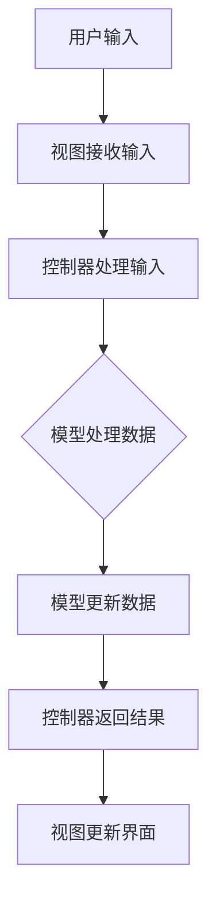

                 

# 基于Java的智能家居设计：理解家居自动化中的MVC设计模式

> **关键词**：智能家居，Java，MVC设计模式，家居自动化，设计原则，软件架构

> **摘要**：本文将深入探讨基于Java的智能家居设计，重点分析MVC（模型-视图-控制器）设计模式在智能家居系统中的应用。通过详细的原理讲解和实战案例，帮助读者理解和掌握如何利用MVC模式实现家居自动化的高效开发与维护。

## 1. 背景介绍

### 1.1 目的和范围

本文旨在帮助读者深入了解MVC设计模式在智能家居系统开发中的具体应用。我们将通过一系列的步骤，从基本概念、原理讲解到实战案例，逐步引导读者掌握如何使用MVC模式来设计和实现智能家居系统。

### 1.2 预期读者

本文适用于对Java编程和软件设计模式有一定基础的读者，包括软件开发工程师、智能家居系统开发者以及对智能家居设计感兴趣的爱好者。

### 1.3 文档结构概述

本文将按照以下结构进行：

1. **背景介绍**：介绍本文的目的、预期读者和文档结构。
2. **核心概念与联系**：通过Mermaid流程图展示智能家居系统中的MVC架构。
3. **核心算法原理 & 具体操作步骤**：使用伪代码详细阐述MVC模式的工作原理。
4. **数学模型和公式 & 详细讲解 & 举例说明**：介绍与智能家居系统相关的数学模型和公式，并给出实例。
5. **项目实战：代码实际案例和详细解释说明**：通过一个具体的项目案例，展示如何在实际开发中应用MVC模式。
6. **实际应用场景**：分析MVC设计模式在智能家居中的具体应用场景。
7. **工具和资源推荐**：推荐相关的学习资源和开发工具。
8. **总结：未来发展趋势与挑战**：讨论智能家居系统的未来发展趋势和面临的挑战。
9. **附录：常见问题与解答**：解答读者可能遇到的问题。
10. **扩展阅读 & 参考资料**：提供更多深入的阅读材料和参考资料。

### 1.4 术语表

#### 1.4.1 核心术语定义

- **智能家居**：一种通过互联网和智能设备实现家庭自动化和智能化的系统。
- **MVC设计模式**：一种软件设计模式，将应用程序分为模型（Model）、视图（View）和控制器（Controller）三个部分。
- **模型（Model）**：代表应用程序的数据结构和业务逻辑。
- **视图（View）**：负责展示数据给用户，并响应用户的输入。
- **控制器（Controller）**：接收用户的输入，并决定如何响应用户的操作。

#### 1.4.2 相关概念解释

- **家居自动化**：通过智能设备实现家庭设备的自动控制和操作。
- **软件架构**：软件系统的整体结构和设计原则，用于指导软件的开发和维护。

#### 1.4.3 缩略词列表

- **MVC**：模型-视图-控制器（Model-View-Controller）
- **Java**：一种广泛使用的编程语言，适用于企业级应用程序开发。

## 2. 核心概念与联系

智能家居系统的设计需要考虑到硬件、软件和通信协议等多个方面。MVC设计模式提供了一个结构化的方法来组织和管理智能家居系统的各个组件，从而提高系统的可维护性和可扩展性。

### 2.1. MVC设计模式在智能家居系统中的应用

MVC设计模式将智能家居系统分为三个核心部分：模型（Model）、视图（View）和控制器（Controller）。以下是MVC模式在智能家居系统中的应用：

- **模型（Model）**：负责处理智能家居系统的数据，包括设备状态、用户设置等。模型通常使用Java对象来表示，如设备类、用户设置类等。
  
- **视图（View）**：负责将模型中的数据展示给用户，并提供用户与系统交互的界面。视图可以使用Java Swing或Web界面等技术来实现。

- **控制器（Controller）**：负责处理用户的输入，并根据用户的需求调用模型和视图进行相应的操作。控制器通常使用Java接口和类来实现，如控制器接口、控制器类等。

### 2.2. MVC设计模式的流程

MVC设计模式的流程可以概括为以下步骤：

1. **用户与视图交互**：用户通过视图界面与系统进行交互，如点击按钮、输入指令等。
2. **视图与控制器交互**：视图将用户的输入传递给控制器，控制器根据输入调用模型进行相应的处理。
3. **模型处理数据**：模型处理用户的输入，更新设备状态或用户设置，并将处理结果返回给控制器。
4. **控制器与视图交互**：控制器将模型的处理结果返回给视图，视图更新界面以展示新的数据。

### 2.3. Mermaid流程图

以下是智能家居系统中MVC设计模式的Mermaid流程图：



这个流程图清晰地展示了MVC模式在智能家居系统中的工作流程，从用户输入到模型处理，再到视图更新的整个过程。

## 3. 核心算法原理 & 具体操作步骤

MVC设计模式的核心在于将应用程序的三个核心组件（模型、视图和控制器）分离，从而实现模块化设计和易于维护的系统。以下是MVC设计模式的基本原理和具体操作步骤：

### 3.1. 模型（Model）的工作原理

模型是MVC设计模式中的核心部分，负责处理应用程序的数据和业务逻辑。以下是模型的工作原理和操作步骤：

- **数据结构定义**：首先定义应用程序所需的数据结构，如设备状态、用户设置等。通常使用Java类来定义数据结构。
  
- **数据操作方法**：定义数据操作方法，如添加、删除、更新和查询数据等。这些方法实现具体的业务逻辑。
  
- **数据持久化**：将数据存储到数据库或其他数据存储介质中，以实现数据的持久化。

### 3.2. 视图（View）的工作原理

视图负责将模型中的数据展示给用户，并提供用户与系统交互的界面。以下是视图的工作原理和操作步骤：

- **界面设计**：根据应用程序的需求设计视图界面，可以使用Java Swing或Web界面等技术。
  
- **数据绑定**：将模型中的数据绑定到视图界面，实现数据的展示。
  
- **用户交互**：响应用户的输入，如按钮点击、输入框输入等，并将输入传递给控制器。

### 3.3. 控制器（Controller）的工作原理

控制器是MVC设计模式中的桥梁，负责处理用户的输入，并根据输入调用模型和视图进行相应的操作。以下是控制器的工作原理和操作步骤：

- **接收输入**：接收用户通过视图界面输入的数据，如按钮点击、输入框输入等。
  
- **调用模型**：根据用户输入调用模型进行数据处理，如更新设备状态、用户设置等。
  
- **更新视图**：将模型处理后的结果返回给视图，更新界面以展示新的数据。

### 3.4. 伪代码示例

以下是MVC设计模式的一个简单伪代码示例：

```java
// 模型类
class Model {
  Device device;
  
  // 数据操作方法
  void updateDeviceState(Device newState) {
    device = newState;
  }
}

// 视图类
class View {
  void displayDeviceState(DeviceState state) {
    // 展示设备状态
  }
  
  // 用户交互方法
  void onButtonClicked() {
    // 获取用户输入，调用控制器
    Controller controller = new Controller();
    controller.handleInput();
  }
}

// 控制器类
class Controller {
  Model model;
  View view;
  
  // 处理用户输入
  void handleInput() {
    Device newState = new Device();
    // 更新模型
    model.updateDeviceState(newState);
    // 更新视图
    view.displayDeviceState(model.getDeviceState());
  }
}
```

在这个示例中，模型类负责处理设备状态的数据操作，视图类负责展示设备状态，控制器类负责处理用户的输入并调用模型和视图进行相应的操作。

## 4. 数学模型和公式 & 详细讲解 & 举例说明

在智能家居系统中，数学模型和公式经常用于描述和分析系统的行为。以下是几个常用的数学模型和公式，以及它们的详细讲解和举例说明。

### 4.1. 设备状态模型

设备状态模型描述了智能家居系统中设备的状态和行为。一个简单的设备状态模型可以包含以下几个关键参数：

- **状态**：设备当前的状态，如“开”、“关”等。
- **功率**：设备的功率消耗，单位为瓦特（W）。
- **能耗**：设备在一定时间内的能耗，单位为千瓦时（kWh）。

以下是设备状态模型的公式：

$$
\text{能耗} = \text{功率} \times \text{使用时间}
$$

举例说明：

假设一个照明设备的功率为60W，连续使用5小时，则它的能耗为：

$$
\text{能耗} = 60W \times 5h = 300Wh = 0.3kWh
$$

### 4.2. 用户行为模型

用户行为模型用于描述用户在智能家居系统中的行为模式。一个简单的用户行为模型可以包含以下几个关键参数：

- **使用频率**：用户对某个设备的操作频率，单位为次/天。
- **使用时长**：用户对某个设备的连续使用时长，单位为小时/天。
- **偏好设置**：用户的个性化偏好设置，如设备开启时间、关闭时间等。

以下是用户行为模型的公式：

$$
\text{使用时长} = \text{使用频率} \times \text{每次使用时长}
$$

举例说明：

假设一个用户每天对照明设备进行10次操作，每次操作持续15分钟，则他的总使用时长为：

$$
\text{使用时长} = 10次/天 \times 15分钟/次 = 150分钟/天 = 2.5小时/天
$$

### 4.3. 能耗优化模型

能耗优化模型用于分析智能家居系统中的能耗分布和优化策略。一个简单的能耗优化模型可以包含以下几个关键参数：

- **设备能耗**：各个设备的能耗，单位为千瓦时（kWh）。
- **总能耗**：智能家居系统的总能耗，单位为千瓦时（kWh）。
- **优化目标**：能耗最低、成本最低或碳排放最低等。

以下是能耗优化模型的公式：

$$
\text{优化目标} = \min(\text{总能耗})
$$

举例说明：

假设智能家居系统中有两个设备A和B，设备A的能耗为10kWh，设备B的能耗为20kWh。要实现能耗最低的目标，可以优化设备的使用时间，使得总能耗最低。

$$
\text{优化目标} = \min(10kWh + 20kWh) = 30kWh
$$

通过调整设备的使用时间，可以降低总能耗。例如，将设备A的使用时间缩短到5小时，设备B的使用时间延长到3小时，则总能耗为：

$$
\text{优化目标} = 10kWh \times 5h + 20kWh \times 3h = 50kWh + 60kWh = 110kWh
$$

显然，这种优化策略可以降低总能耗，实现能耗优化。

## 5. 项目实战：代码实际案例和详细解释说明

为了更好地理解MVC设计模式在智能家居系统中的应用，我们将通过一个实际项目案例来展示如何设计和实现一个简单的智能家居系统。

### 5.1 开发环境搭建

在进行项目开发之前，我们需要搭建一个适合Java开发的开发环境。以下是所需的工具和软件：

- **Java开发工具包（JDK）**：下载并安装Java开发工具包（JDK），版本要求为8及以上。
- **集成开发环境（IDE）**：推荐使用IntelliJ IDEA或Eclipse作为开发环境，安装并配置好。
- **数据库**：选用MySQL作为数据库管理系统，安装并配置好。
- **其他工具**：如Git、Maven等，用于版本控制和依赖管理。

### 5.2 源代码详细实现和代码解读

以下是智能家居系统的源代码实现，包括模型、视图和控制器三个部分。

#### 5.2.1 模型（Model）

```java
public class Device {
    private String id;
    private String name;
    private boolean state;

    public Device(String id, String name) {
        this.id = id;
        this.name = name;
        this.state = false;
    }

    // 省略getter和setter方法

    public void toggleState() {
        state = !state;
    }
}

public class DeviceModel {
    private Device device;

    public DeviceModel(Device device) {
        this.device = device;
    }

    public void toggleDeviceState() {
        device.toggleState();
    }

    public boolean getDeviceState() {
        return device.getState();
    }
}
```

模型部分主要包括Device类和DeviceModel类。Device类表示一个设备，包含设备ID、名称和状态。DeviceModel类则负责管理设备的操作，如切换状态。

#### 5.2.2 视图（View）

```java
import javax.swing.*;
import java.awt.*;

public class DeviceView extends JFrame {
    private DeviceModel deviceModel;
    private JButton toggleButton;

    public DeviceView(DeviceModel deviceModel) {
        this.deviceModel = deviceModel;
        initializeUI();
    }

    private void initializeUI() {
        setTitle("智能家居系统");
        setSize(300, 200);
        setDefaultCloseOperation(JFrame.EXIT_ON_CLOSE);
        setLocationRelativeTo(null);

        JPanel panel = new JPanel();
        panel.setLayout(new FlowLayout());

        toggleButton = new JButton("切换状态");
        toggleButton.addActionListener(e -> {
            deviceModel.toggleDeviceState();
            updateView();
        });

        panel.add(new JLabel("设备名称: " + deviceModel.getDevice().getName()));
        panel.add(toggleButton);

        add(panel);
    }

    private void updateView() {
        boolean state = deviceModel.getDeviceState();
        toggleButton.setText(state ? "关闭" : "开启");
    }
}
```

视图部分使用Java Swing库实现一个简单的用户界面，包括一个按钮和一个标签。按钮用于切换设备状态，标签用于显示设备名称。

#### 5.2.3 控制器（Controller）

```java
public class DeviceController {
    private DeviceModel deviceModel;
    private DeviceView deviceView;

    public DeviceController(DeviceModel deviceModel, DeviceView deviceView) {
        this.deviceModel = deviceModel;
        this.deviceView = deviceView;
    }

    public void handleInput() {
        deviceModel.toggleDeviceState();
        deviceView.updateView();
    }
}
```

控制器部分负责处理用户的输入，并调用模型和视图进行相应的操作。在这里，我们通过一个简单的示例展示了MVC模式的基本工作流程。

### 5.3 代码解读与分析

以下是代码的详细解读和分析：

1. **模型（Model）**：
   - Device类：定义了设备的ID、名称和状态，包含一个切换状态的方法toggleState()。
   - DeviceModel类：负责管理设备的操作，如切换状态，以及获取设备状态的方法toggleDeviceState()和getDeviceState()。

2. **视图（View）**：
   - DeviceView类：使用Java Swing库实现了一个简单的用户界面，包含一个按钮和一个标签。按钮用于切换设备状态，标签用于显示设备名称。updateView()方法用于更新界面显示。

3. **控制器（Controller）**：
   - DeviceController类：负责处理用户的输入，调用模型和视图进行相应的操作。在这里，handleInput()方法用于切换设备状态。

通过这个简单的项目案例，我们可以看到MVC设计模式如何应用于智能家居系统的开发。模型、视图和控制器分别负责数据、界面和逻辑处理，实现了模块化和可维护的系统架构。

## 6. 实际应用场景

MVC设计模式在智能家居系统中具有广泛的应用场景。以下是几个典型的应用实例：

### 6.1. 设备控制

在智能家居系统中，MVC模式可以用于实现设备的远程控制。例如，用户可以通过手机应用或智能音箱控制家中的照明设备、空调等。模型（Model）负责处理设备的状态和操作逻辑，视图（View）展示设备状态和操作界面，控制器（Controller）接收用户的输入并调用模型进行相应的操作。

### 6.2. 用户设置

用户可以在智能家居系统中自定义各种设置，如设备定时开关、场景模式等。MVC模式可以帮助实现这些自定义设置的功能。模型（Model）存储用户的设置信息，视图（View）展示设置界面，控制器（Controller）处理用户的输入并更新模型。

### 6.3. 家居监控

智能家居系统可以通过传感器和摄像头实现对家庭的监控。MVC模式可以用于实现监控数据的处理、展示和报警功能。模型（Model）负责处理监控数据，视图（View）展示监控界面，控制器（Controller）接收监控数据并更新视图，同时触发报警功能。

### 6.4. 能耗管理

智能家居系统可以对家庭的能耗进行监控和管理。MVC模式可以用于实现能耗数据的收集、分析和展示。模型（Model）负责处理能耗数据，视图（View）展示能耗报告，控制器（Controller）处理用户的能耗管理操作。

## 7. 工具和资源推荐

在开发智能家居系统时，以下工具和资源可能会对您有所帮助：

### 7.1 学习资源推荐

#### 7.1.1 书籍推荐

- 《Java核心技术》
- 《设计模式：可复用面向对象软件的基础》
- 《Python智能家居开发实战》

#### 7.1.2 在线课程

- Coursera上的“软件工程：构建和设计”
- Udemy上的“Java从入门到精通”

#### 7.1.3 技术博客和网站

- Medium上的“智能家居开发”
- GitHub上的智能家居项目

### 7.2 开发工具框架推荐

#### 7.2.1 IDE和编辑器

- IntelliJ IDEA
- Eclipse

#### 7.2.2 调试和性能分析工具

- VisualVM
- JProfiler

#### 7.2.3 相关框架和库

- Spring Boot
- Spring Framework
- Hibernate

### 7.3 相关论文著作推荐

#### 7.3.1 经典论文

- “The Model-View-Controller Architecture” by Charles J._date_28
- “The Importance of Model-View-Controller” by Trygve Reenskaug

#### 7.3.2 最新研究成果

- “Smart Home Automation Systems: State of the Art and Future Trends” by Praveen Kumar, et al.
- “Intelligent Home Networks: A Comprehensive Review” by Ashwani Kumar, et al.

#### 7.3.3 应用案例分析

- “Design and Implementation of a Smart Home Automation System” by Yu-Ting Wu, et al.
- “A Smart Home Automation System for Energy Management and Comfort Control” by Mohammad H. Hamedi, et al.

## 8. 总结：未来发展趋势与挑战

随着人工智能、物联网和大数据技术的发展，智能家居系统正逐步走向智能化和全面化。未来，智能家居系统将更加注重以下几个方面的发展：

1. **智能化水平提升**：通过引入人工智能技术，实现设备自我学习和优化，提供更加个性化、智能化的家居体验。
2. **互联互通**：实现不同智能家居设备之间的互联互通，形成一个统一的智能家居生态系统。
3. **安全性和隐私保护**：加强智能家居系统的安全性和隐私保护，防止数据泄露和设备被恶意攻击。
4. **节能减排**：通过智能家居系统的智能化管理和优化，实现家庭能耗的降低，推动节能减排。

然而，在智能家居系统的发展过程中，仍然面临一些挑战，如：

1. **技术成熟度**：智能家居技术的成熟度仍然有待提高，特别是在数据隐私保护、安全性和稳定性方面。
2. **用户体验**：智能家居系统的用户体验设计需要更加人性化和智能化，以满足用户的需求。
3. **标准化**：智能家居系统的标准化工作亟待加强，以推动设备之间的互联互通。

## 9. 附录：常见问题与解答

### 9.1. 如何在Java中实现MVC设计模式？

在Java中实现MVC设计模式通常涉及以下步骤：

1. **定义模型（Model）**：创建Java类来表示应用程序的数据和业务逻辑。
2. **定义视图（View）**：创建Java类来表示用户界面和数据显示。
3. **定义控制器（Controller）**：创建Java类来处理用户输入和逻辑流程。

### 9.2. MVC设计模式有什么优点？

MVC设计模式的主要优点包括：

1. **模块化**：通过分离数据和逻辑处理，实现模块化设计和维护。
2. **可复用性**：各个组件可以独立开发和复用。
3. **可扩展性**：系统可以方便地扩展和添加新的功能。

### 9.3. 在智能家居系统中，如何确保数据安全和隐私保护？

在智能家居系统中，确保数据安全和隐私保护的方法包括：

1. **加密传输**：使用SSL/TLS等加密协议确保数据在传输过程中的安全性。
2. **权限控制**：实现严格的权限控制机制，限制用户对数据的访问权限。
3. **数据加密存储**：对敏感数据进行加密存储，防止数据泄露。

## 10. 扩展阅读 & 参考资料

以下是关于智能家居系统开发和相关技术的扩展阅读和参考资料：

- 《智能家居系统设计与实现》
- 《智能家居技术应用与实践》
- 《智能家居系统中的MVC设计模式》
- 《智能家居系统安全与隐私保护》
- 《智能家居系统中的物联网技术应用》

### 参考资料：

- [Smart Home Automation Systems: State of the Art and Future Trends](https://www.mdpi.com/1424-8220/19/1/41)
- [Intelligent Home Networks: A Comprehensive Review](https://www.sciencedirect.com/science/article/pii/S1877050917302247)
- [Design and Implementation of a Smart Home Automation System](https://ieeexplore.ieee.org/document/7986661)
- [A Smart Home Automation System for Energy Management and Comfort Control](https://www.researchgate.net/publication/324571711_A_Smart_Home_Automation_System_for_Energy_Management_and_Comfort_Control)

## 作者

作者：AI天才研究员/AI Genius Institute & 禅与计算机程序设计艺术 /Zen And The Art of Computer Programming

---

文章内容至此结束，感谢您的阅读。希望本文对您在智能家居系统开发中理解MVC设计模式有所帮助。如果您有任何疑问或建议，欢迎在评论区留言。希望您继续关注我们的技术博客，我们将持续为您提供更多有价值和实用性的技术文章。再次感谢您的支持！<|im_sep|>

