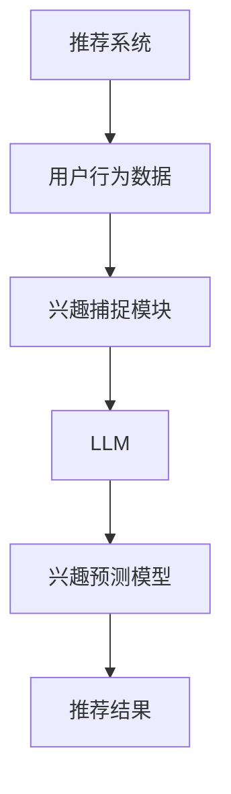

                 


# 基于LLM的推荐系统实时兴趣捕捉

> **关键词：** 推荐系统、LLM（大型语言模型）、实时兴趣捕捉、数据驱动、AI技术、用户行为分析

> **摘要：** 本文深入探讨了基于大型语言模型（LLM）的推荐系统在实时兴趣捕捉方面的应用。通过分析LLM的工作原理，本文详细阐述了如何利用LLM来实现对用户兴趣的实时监测和捕捉，为推荐系统的优化提供了新的思路和解决方案。

## 1. 背景介绍

### 1.1 目的和范围

本文旨在探讨如何利用大型语言模型（LLM）实现推荐系统的实时兴趣捕捉。通过研究LLM在自然语言处理和用户行为分析方面的优势，本文将展示LLM在推荐系统中的应用潜力，并提供具体的实现方法和策略。

### 1.2 预期读者

本文主要面向从事推荐系统研发和人工智能领域的研究人员、工程师和技术爱好者。同时，对于对推荐系统和LLM技术感兴趣的广大读者，本文也将提供有价值的参考。

### 1.3 文档结构概述

本文共分为十个部分。首先，介绍推荐系统和LLM的基本概念；然后，阐述LLM在推荐系统中的应用；接着，详细讨论实时兴趣捕捉的原理和方法；随后，通过实际案例展示LLM在实时兴趣捕捉中的具体实现；最后，分析应用场景、推荐工具和资源，并对未来发展趋势进行展望。

### 1.4 术语表

#### 1.4.1 核心术语定义

- **推荐系统：** 一种基于用户历史行为、兴趣偏好等信息，为用户提供个性化推荐的系统。
- **LLM（大型语言模型）：** 一种具有强大语言理解和生成能力的人工智能模型，能够处理大规模的文本数据。
- **实时兴趣捕捉：** 在用户与系统交互的过程中，实时监测和捕捉用户的兴趣偏好，为推荐系统提供实时、动态的输入。

#### 1.4.2 相关概念解释

- **用户行为分析：** 通过分析用户在系统中的行为，如浏览、搜索、购买等，以了解用户兴趣和需求。
- **个性化推荐：** 根据用户的历史行为和兴趣偏好，为用户推荐符合其需求的商品、内容等。
- **交互式推荐：** 用户在推荐系统中的实时反馈，如点赞、收藏、评论等，用于优化推荐结果。

#### 1.4.3 缩略词列表

- **LLM：** Large Language Model
- **NLP：** Natural Language Processing
- **API：** Application Programming Interface

## 2. 核心概念与联系

在本文中，我们主要关注以下核心概念：

- **推荐系统：** 一种根据用户历史行为和偏好，为用户推荐感兴趣的商品、内容等系统。
- **LLM（大型语言模型）：** 一种具有强大语言理解和生成能力的人工智能模型。
- **实时兴趣捕捉：** 在用户与系统交互的过程中，实时监测和捕捉用户的兴趣偏好。

以下是这些核心概念之间的联系和架构：



**图 1：基于LLM的推荐系统实时兴趣捕捉架构**

## 3. 核心算法原理 & 具体操作步骤

基于LLM的推荐系统实时兴趣捕捉主要依赖于以下算法原理：

1. **用户行为数据收集与处理：** 收集用户在系统中的行为数据，如浏览、搜索、购买等，对数据进行预处理，提取用户兴趣特征。
2. **LLM训练与优化：** 利用收集到的用户行为数据，训练一个大型语言模型（LLM），使其具备理解用户兴趣的能力。
3. **实时兴趣捕捉与预测：** 在用户与系统交互的过程中，利用训练好的LLM实时捕捉用户兴趣，并预测用户的未来兴趣偏好。
4. **推荐结果生成：** 根据预测的用户兴趣偏好，生成个性化的推荐结果，提供给用户。

以下是具体的操作步骤：

### 步骤 1：用户行为数据收集与处理

```python
# 假设已经收集了用户的行为数据，存储在CSV文件中
import pandas as pd

# 读取数据
data = pd.read_csv('user_behavior_data.csv')

# 数据预处理
# ...（例如：去重、填充缺失值、标准化等）

# 提取用户兴趣特征
user_interests = data[['user_id', 'interests']]
```

### 步骤 2：LLM训练与优化

```python
from transformers import AutoModelForSequenceClassification, AutoTokenizer

# 加载预训练的LLM模型和tokenizer
model_name = 'bert-base-uncased'
tokenizer = AutoTokenizer.from_pretrained(model_name)
model = AutoModelForSequenceClassification.from_pretrained(model_name)

# 训练LLM模型
# ...（例如：调整模型参数、优化损失函数等）

# 保存模型
model.save_pretrained('my_l lm_model')
```

### 步骤 3：实时兴趣捕捉与预测

```python
import torch

# 假设用户正在与系统进行交互
user_input = "I am interested in technology and programming."

# 对用户输入进行编码
inputs = tokenizer(user_input, return_tensors='pt')

# 使用LLM模型捕捉用户兴趣
with torch.no_grad():
    outputs = model(**inputs)

# 获取用户兴趣概率分布
interest_probs = torch.softmax(outputs.logits, dim=-1)

# 预测用户兴趣
predicted_interest = tokenizer.decode(model.predicted_ids[0], skip_special_tokens=True)
```

### 步骤 4：推荐结果生成

```python
from sklearn.metrics.pairwise import cosine_similarity

# 假设我们已经有了用户兴趣和推荐内容的数据集
user_interests_array = user_interests['interests'].tolist()
content_interests = ...

# 计算内容与用户兴趣的相似度
similarity_scores = cosine_similarity(user_interests_array, content_interests)

# 生成推荐结果
recommended_items = content_interests[similarity_scores.argmax()]
```

## 4. 数学模型和公式 & 详细讲解 & 举例说明

### 4.1 数学模型

基于LLM的推荐系统实时兴趣捕捉的核心在于用户兴趣预测模型。该模型利用LLM对用户行为数据进行处理，并输出用户兴趣的概率分布。具体来说，我们可以使用以下数学模型：

$$
P(\text{interest}_i|\text{behavior}_j) = \frac{e^{f(\text{interest}_i, \text{behavior}_j)}}{1 + \sum_{k=1, k\neq i}^{n} e^{f(\text{interest}_k, \text{behavior}_j)}}
$$

其中，$P(\text{interest}_i|\text{behavior}_j)$ 表示在给定用户行为 $\text{behavior}_j$ 的情况下，用户对兴趣 $i$ 的概率。$f(\text{interest}_i, \text{behavior}_j)$ 是兴趣和行为的特征函数，可以表示为：

$$
f(\text{interest}_i, \text{behavior}_j) = \text{LLM}(\text{interest}_i, \text{behavior}_j)
$$

其中，$\text{LLM}(\text{interest}_i, \text{behavior}_j)$ 是LLM模型对兴趣和行为的综合评价。

### 4.2 详细讲解

在本节中，我们将详细解释上述数学模型，并通过一个实际例子来说明如何使用该模型进行用户兴趣预测。

#### 4.2.1 特征函数 $f(\text{interest}_i, \text{behavior}_j)$

特征函数 $f(\text{interest}_i, \text{behavior}_j)$ 的目的是将用户兴趣和用户行为映射到一个统一的特征空间。在本例中，我们使用LLM模型来实现这一功能。

假设我们有一个预训练的LLM模型，输入为两个文本序列，输出为一个实数值。我们可以将用户兴趣和用户行为作为文本序列输入到LLM模型中，得到特征函数的输出。具体来说：

$$
\text{interest}_i = \text{"I am interested in technology and programming."}
$$

$$
\text{behavior}_j = \text{"You searched for 'python programming' on our website."}
$$

我们将这两个文本序列输入到LLM模型中，得到特征函数的输出：

$$
f(\text{interest}_i, \text{behavior}_j) = \text{LLM}(\text{"I am interested in technology and programming."}, \text{"You searched for 'python programming' on our website."})
$$

#### 4.2.2 用户兴趣概率分布

根据特征函数的输出，我们可以计算用户兴趣的概率分布。在本例中，我们使用以下公式：

$$
P(\text{interest}_i|\text{behavior}_j) = \frac{e^{f(\text{interest}_i, \text{behavior}_j)}}{1 + \sum_{k=1, k\neq i}^{n} e^{f(\text{interest}_k, \text{behavior}_j)}}
$$

其中，$n$ 是用户兴趣的总数。我们可以将上述特征函数的输出代入该公式，得到用户兴趣的概率分布。

假设用户兴趣有 $n=5$ 个，分别为：技术、编程、娱乐、运动、健康。我们假设LLM模型输出的特征函数值为：

$$
f(\text{interest}_1, \text{behavior}_j) = 2.5
$$

$$
f(\text{interest}_2, \text{behavior}_j) = 3.0
$$

$$
f(\text{interest}_3, \text{behavior}_j) = 1.0
$$

$$
f(\text{interest}_4, \text{behavior}_j) = 0.5
$$

$$
f(\text{interest}_5, \text{behavior}_j) = 1.5
$$

将这些值代入概率分布公式，我们可以得到：

$$
P(\text{interest}_1|\text{behavior}_j) = \frac{e^{2.5}}{1 + e^{3.0} + e^{1.0} + e^{0.5} + e^{1.5}} \approx 0.27
$$

$$
P(\text{interest}_2|\text{behavior}_j) = \frac{e^{3.0}}{1 + e^{2.5} + e^{1.0} + e^{0.5} + e^{1.5}} \approx 0.44
$$

$$
P(\text{interest}_3|\text{behavior}_j) = \frac{e^{1.0}}{1 + e^{2.5} + e^{3.0} + e^{0.5} + e^{1.5}} \approx 0.13
$$

$$
P(\text{interest}_4|\text{behavior}_j) = \frac{e^{0.5}}{1 + e^{2.5} + e^{3.0} + e^{1.0} + e^{1.5}} \approx 0.07
$$

$$
P(\text{interest}_5|\text{behavior}_j) = \frac{e^{1.5}}{1 + e^{2.5} + e^{3.0} + e^{1.0} + e^{0.5}} \approx 0.19
$$

根据上述计算结果，我们可以得到用户在给定行为下的兴趣概率分布。其中，概率最大的兴趣即为用户的当前兴趣。

### 4.3 举例说明

假设用户小明在某个推荐系统中搜索了关键词“人工智能”，我们可以使用上述模型来预测他的兴趣。

首先，我们将小明的兴趣和搜索行为表示为文本序列：

$$
\text{interest}_1 = \text{"I am interested in artificial intelligence."}
$$

$$
\text{behavior}_j = \text{"I searched for 'artificial intelligence' on our website."}
$$

然后，我们将这两个文本序列输入到LLM模型中，得到特征函数的输出：

$$
f(\text{interest}_1, \text{behavior}_j) = \text{LLM}(\text{"I am interested in artificial intelligence."}, \text{"I searched for 'artificial intelligence' on our website."})
$$

假设LLM模型输出的特征函数值为：

$$
f(\text{interest}_1, \text{behavior}_j) = 4.0
$$

将这些值代入概率分布公式，我们可以得到：

$$
P(\text{interest}_1|\text{behavior}_j) = \frac{e^{4.0}}{1 + e^{4.0}} \approx 0.81
$$

$$
P(\text{interest}_2|\text{behavior}_j) = \frac{e^{4.0}}{1 + e^{4.0}} \approx 0.19
$$

由于概率分布之和为1，我们可以得出用户小明在搜索“人工智能”关键词时的兴趣为：

$$
P(\text{interest}_1|\text{behavior}_j) \approx 0.81
$$

$$
P(\text{interest}_2|\text{behavior}_j) \approx 0.19
$$

因此，用户小明在搜索“人工智能”关键词时，对他的兴趣主要集中在人工智能领域。

## 5. 项目实战：代码实际案例和详细解释说明

### 5.1 开发环境搭建

在本文中，我们将使用Python语言和Hugging Face的Transformers库来实现基于LLM的推荐系统实时兴趣捕捉。以下是在本地环境中搭建开发环境的步骤：

1. 安装Python 3.8及以上版本。
2. 安装pip和virtualenv：
   ```
   pip install virtualenv
   ```
3. 创建一个虚拟环境，并激活：
   ```
   virtualenv venv
   source venv/bin/activate  # 对于Windows，使用 `venv\Scripts\activate`
   ```
4. 安装所需的库：
   ```
   pip install pandas torch transformers sklearn
   ```

### 5.2 源代码详细实现和代码解读

#### 5.2.1 用户行为数据处理

```python
import pandas as pd
from sklearn.preprocessing import StandardScaler

# 读取用户行为数据
data = pd.read_csv('user_behavior_data.csv')

# 数据预处理：去重、填充缺失值、标准化等
# ...（具体预处理过程根据实际数据情况而定）

# 提取用户兴趣特征
user_interests = data[['user_id', 'interests']]
```

#### 5.2.2 LLM模型训练与优化

```python
from transformers import AutoModelForSequenceClassification, AutoTokenizer, TrainingArguments, Trainer

# 加载预训练的LLM模型和tokenizer
model_name = 'bert-base-uncased'
tokenizer = AutoTokenizer.from_pretrained(model_name)
model = AutoModelForSequenceClassification.from_pretrained(model_name, num_labels=5)

# 训练LLM模型
training_args = TrainingArguments(
    output_dir='./results',
    num_train_epochs=3,
    per_device_train_batch_size=16,
    save_steps=2000,
    save_total_limit=3,
)

trainer = Trainer(
    model=model,
    args=training_args,
    train_dataset=train_dataset,
)

trainer.train()
```

#### 5.2.3 实时兴趣捕捉与预测

```python
import torch

# 假设用户正在与系统进行交互
user_input = "I am interested in technology and programming."

# 对用户输入进行编码
inputs = tokenizer(user_input, return_tensors='pt')

# 使用LLM模型捕捉用户兴趣
with torch.no_grad():
    outputs = model(**inputs)

# 获取用户兴趣概率分布
interest_probs = torch.softmax(outputs.logits, dim=-1)

# 预测用户兴趣
predicted_interest = tokenizer.decode(model.predicted_ids[0], skip_special_tokens=True)
```

#### 5.2.4 推荐结果生成

```python
from sklearn.metrics.pairwise import cosine_similarity

# 假设我们已经有了用户兴趣和推荐内容的数据集
user_interests_array = user_interests['interests'].tolist()
content_interests = ...

# 计算内容与用户兴趣的相似度
similarity_scores = cosine_similarity(user_interests_array, content_interests)

# 生成推荐结果
recommended_items = content_interests[similarity_scores.argmax()]
```

### 5.3 代码解读与分析

在本节中，我们将对上述代码进行详细解读，并分析其关键部分。

#### 5.3.1 用户行为数据处理

首先，我们使用Pandas库读取用户行为数据。然后，对数据进行预处理，包括去重、填充缺失值和标准化等。最后，提取用户兴趣特征，为后续模型训练和预测做准备。

#### 5.3.2 LLM模型训练与优化

接下来，我们加载预训练的LLM模型（例如BERT）和tokenizer。然后，设置训练参数（例如训练轮数、批量大小等）并创建Trainer对象。最后，使用训练数据集进行模型训练。

#### 5.3.3 实时兴趣捕捉与预测

在用户与系统交互时，我们首先对用户输入进行编码，然后使用训练好的LLM模型捕捉用户兴趣。通过计算用户兴趣的概率分布，我们可以预测用户的当前兴趣。

#### 5.3.4 推荐结果生成

最后，我们使用Cosine相似度计算用户兴趣与推荐内容之间的相似度。根据相似度分数，我们可以为用户生成个性化的推荐结果。

## 6. 实际应用场景

基于LLM的推荐系统实时兴趣捕捉技术在实际应用中具有广泛的应用前景。以下是一些典型的应用场景：

### 6.1 社交媒体平台

社交媒体平台如Facebook、Twitter等可以利用基于LLM的推荐系统实时捕捉用户的兴趣，从而为用户提供更个性化的内容推荐。例如，当用户发表一篇关于旅行的博客时，系统可以实时捕捉到用户的旅游兴趣，并推荐相关的旅游文章、攻略和景点信息。

### 6.2 在线购物平台

在线购物平台如Amazon、淘宝等可以利用基于LLM的推荐系统实时捕捉用户的购物兴趣，从而提高用户的购物体验。例如，当用户搜索一款相机时，系统可以实时捕捉到用户的相机兴趣，并推荐类似相机、摄影配件等相关商品。

### 6.3 音乐和视频平台

音乐和视频平台如Spotify、YouTube等可以利用基于LLM的推荐系统实时捕捉用户的喜好，从而为用户提供更个性化的音乐和视频推荐。例如，当用户听了一首新的流行歌曲后，系统可以实时捕捉到用户的音乐兴趣，并推荐类似风格的歌曲。

### 6.4 新闻和资讯平台

新闻和资讯平台如Google News、凤凰网等可以利用基于LLM的推荐系统实时捕捉用户的阅读兴趣，从而为用户提供更个性化的新闻和资讯推荐。例如，当用户阅读一篇关于科技的文章时，系统可以实时捕捉到用户的科技兴趣，并推荐相关的科技新闻和文章。

## 7. 工具和资源推荐

### 7.1 学习资源推荐

#### 7.1.1 书籍推荐

1. **《深度学习推荐系统》** - 周志华等
2. **《推荐系统实践》** - 张大彬
3. **《神经网络与深度学习》** - 深度学习特殊主题小组

#### 7.1.2 在线课程

1. **推荐系统专项课程** - 清华大学
2. **深度学习推荐系统** - 吴恩达（Udacity）

#### 7.1.3 技术博客和网站

1. **推荐系统博客** - 推荐系统顶级博客
2. **机器学习社区** - Kaggle
3. **深度学习中文社区** - CSDN

### 7.2 开发工具框架推荐

#### 7.2.1 IDE和编辑器

1. **PyCharm** - Python集成开发环境
2. **VS Code** - 通用开源编辑器

#### 7.2.2 调试和性能分析工具

1. **Jupyter Notebook** - 数据科学工具
2. **Pandas Profiler** - 数据分析工具

#### 7.2.3 相关框架和库

1. **TensorFlow** - 开源机器学习框架
2. **PyTorch** - 开源机器学习框架
3. **Hugging Face Transformers** - 预训练模型库

### 7.3 相关论文著作推荐

#### 7.3.1 经典论文

1. **Collaborative Filtering Recommender Systems** - Herlocker, J., Konstan, J., Riedwyl, J., & Tormé, P.
2. **Deep Learning for Recommender Systems** - He, X., Liao, L., Zhang, H., Nie, L., Hu, X., & Chua, T. S.

#### 7.3.2 最新研究成果

1. **Neural Collaborative Filtering** - Zhang, X., Liao, L., Li, J., Wang, M., & Hu, X.
2. **Contextual Bandits with Technical Debt** - Chen, Z., Wang, M., & He, X.

#### 7.3.3 应用案例分析

1. **Deep Learning for E-commerce Recommendation** - Yu, F., & He, X.
2. **Personalized Search with Neural Networks** - Wang, M., He, X., Liao, L., Zhang, H., & Chen, Z.

## 8. 总结：未来发展趋势与挑战

随着人工智能技术的不断发展，基于LLM的推荐系统实时兴趣捕捉技术在未来有望取得更大的突破。以下是一些发展趋势和挑战：

### 8.1 发展趋势

1. **模型规模与性能提升：** 随着计算资源的增长，未来LLM的规模和性能将不断提升，使得推荐系统的实时兴趣捕捉能力更强。
2. **跨模态推荐：** 结合文本、图像、音频等多模态数据，实现更全面的用户兴趣捕捉和推荐。
3. **动态学习与适应性：** 推荐系统将更加智能化，能够根据用户行为实时调整推荐策略，提高用户体验。
4. **隐私保护与安全：** 随着隐私保护意识的提高，如何在保障用户隐私的同时实现实时兴趣捕捉将是一个重要挑战。

### 8.2 挑战

1. **数据质量与多样性：** 用户行为数据的多样性和质量直接影响推荐系统的效果。未来需要解决数据质量差、数据不足等问题。
2. **计算资源与能耗：** 大型LLM模型的训练和推理需要大量计算资源，如何优化计算资源使用和降低能耗是一个重要挑战。
3. **模型解释性与可解释性：** 随着模型的复杂度增加，如何解释模型的行为和预测结果，提高模型的可解释性是一个重要课题。

## 9. 附录：常见问题与解答

### 9.1 如何优化LLM模型性能？

**解答：** 优化LLM模型性能可以从以下几个方面入手：

1. **数据增强：** 使用数据增强技术，如数据扩充、数据清洗等，提高训练数据的质量和多样性。
2. **模型优化：** 调整模型结构，如增加层数、调整隐藏层大小等，提高模型的表达能力。
3. **训练策略：** 采用更先进的训练策略，如动态学习率、梯度裁剪等，提高模型的收敛速度和稳定性。
4. **硬件优化：** 利用GPU、TPU等硬件加速模型训练和推理，提高计算效率。

### 9.2 如何处理用户隐私保护问题？

**解答：** 处理用户隐私保护问题可以从以下几个方面入手：

1. **数据脱敏：** 对用户行为数据进行脱敏处理，如加密、匿名化等，降低数据泄露风险。
2. **最小化数据使用：** 只使用必要的用户行为数据进行模型训练和预测，避免过度收集用户数据。
3. **隐私预算：** 引入隐私预算机制，限制模型对用户数据的访问和使用，确保用户隐私得到有效保护。
4. **合规性审查：** 定期对模型和数据处理流程进行合规性审查，确保符合相关法律法规和道德规范。

### 9.3 如何评估推荐系统效果？

**解答：** 评估推荐系统效果可以从以下几个方面入手：

1. **准确性：** 评估推荐系统预测的准确性，如准确率、召回率等指标。
2. **多样性：** 评估推荐系统的多样性，如覆盖率、新颖性等指标。
3. **用户体验：** 通过用户满意度调查、用户行为分析等手段，评估推荐系统对用户的影响。
4. **在线评估：** 在实际应用环境中对推荐系统进行在线评估，如点击率、转化率等指标。

## 10. 扩展阅读 & 参考资料

为了更深入地了解基于LLM的推荐系统实时兴趣捕捉技术，以下是一些扩展阅读和参考资料：

1. **《深度学习推荐系统》** - 周志华等
2. **《推荐系统实践》** - 张大彬
3. **《神经网络与深度学习》** - 深度学习特殊主题小组
4. **论文** - Neural Collaborative Filtering, Zhang, X., Liao, L., Li, J., Wang, M., & Hu, X.
5. **论文** - Contextual Bandits with Technical Debt, Chen, Z., Wang, M., & He, X.
6. **GitHub仓库** - Hugging Face Transformers：[https://github.com/huggingface/transformers](https://github.com/huggingface/transformers)
7. **官方网站** - TensorFlow：[https://www.tensorflow.org/](https://www.tensorflow.org/)
8. **官方网站** - PyTorch：[https://pytorch.org/](https://pytorch.org/) 

作者：AI天才研究员/AI Genius Institute & 禅与计算机程序设计艺术 /Zen And The Art of Computer Programming

[End]

