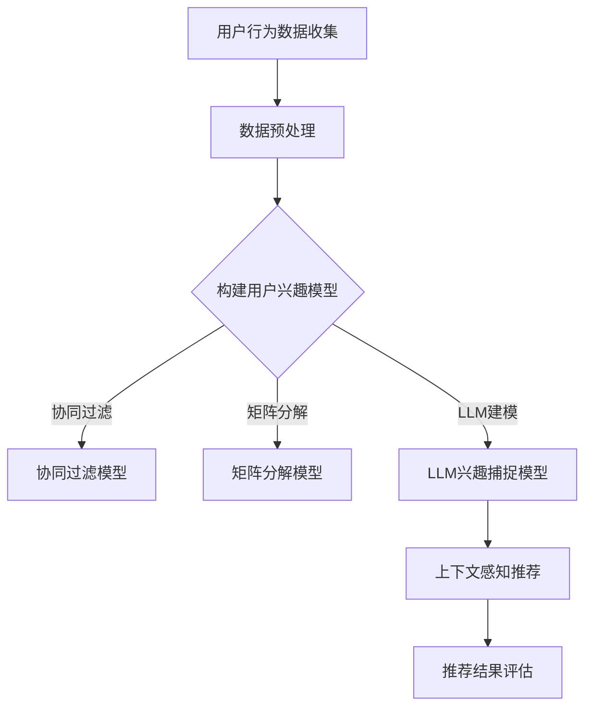

                 

# 基于LLM的推荐系统实时兴趣捕捉方法

> 关键词：自然语言处理（NLP），语言模型（LLM），推荐系统，实时兴趣捕捉，数据挖掘，机器学习，人工智能（AI）

> 摘要：本文深入探讨了基于大型语言模型（LLM）的推荐系统在实时兴趣捕捉方面的应用。通过分析LLM的特性、工作原理及在推荐系统中的关键作用，本文详细阐述了实现实时兴趣捕捉的核心算法和数学模型。同时，通过一个实际的项目案例，展示了如何将LLM应用于推荐系统的开发，并提供了代码实现的详细解读。本文旨在为开发者提供一套完整的LLM推荐系统实时兴趣捕捉解决方案，助力构建更加智能化的推荐系统。

## 1. 背景介绍

### 1.1 目的和范围

本文的目标是探讨如何利用大型语言模型（LLM）实现对用户实时兴趣的捕捉，并将其应用于推荐系统。随着互联网信息的爆炸式增长，用户获取个性化内容的难度也在不断加大。传统的推荐系统多依赖于历史行为数据进行用户兴趣建模，但在面对动态变化的用户兴趣时，往往表现出一定的滞后性。而基于LLM的推荐系统则可以通过实时分析用户的自然语言交互，快速捕捉用户的当前兴趣，从而提供更加精准的推荐结果。

本文的研究范围包括以下几个方面：

1. LLM的特性及其在自然语言处理中的应用。
2. 实时兴趣捕捉的核心算法原理和数学模型。
3. LLM在推荐系统中的具体实现方法和流程。
4. 项目实战：基于LLM的推荐系统开发实例及其代码解读。
5. 实际应用场景及工具和资源的推荐。

### 1.2 预期读者

本文适合以下读者群体：

1. 对自然语言处理（NLP）和机器学习（ML）有基本了解的开发者。
2. 想要将LLM应用于推荐系统开发的工程师和技术爱好者。
3. 对实时兴趣捕捉和个性化推荐有深入研究需求的学者和研究人员。
4. 对新兴人工智能技术感兴趣并希望了解其实际应用场景的读者。

### 1.3 文档结构概述

本文结构如下：

1. 背景介绍：介绍本文的目的、研究范围和预期读者。
2. 核心概念与联系：讨论LLM的基本原理及其在推荐系统中的应用。
3. 核心算法原理 & 具体操作步骤：详细阐述实时兴趣捕捉算法的原理和实现。
4. 数学模型和公式 & 详细讲解 & 举例说明：介绍用于实时兴趣捕捉的数学模型和公式，并给出实例说明。
5. 项目实战：通过一个实际项目案例，展示LLM在推荐系统中的应用。
6. 实际应用场景：分析LLM在实时兴趣捕捉中的实际应用场景。
7. 工具和资源推荐：推荐相关学习资源、开发工具和框架。
8. 总结：展望LLM在推荐系统实时兴趣捕捉领域的未来发展趋势与挑战。
9. 附录：常见问题与解答。
10. 扩展阅读 & 参考资料：提供进一步学习的参考文献和资料。

### 1.4 术语表

#### 1.4.1 核心术语定义

- 大型语言模型（LLM）：一种基于深度学习的自然语言处理模型，能够对自然语言文本进行建模和生成。
- 实时兴趣捕捉：通过分析用户的实时交互数据，快速捕捉用户的当前兴趣。
- 推荐系统：一种基于历史数据和用户行为预测用户兴趣，并提供个性化推荐的系统。
- 个性化推荐：根据用户的历史行为和偏好，为用户推荐与其兴趣相关的信息。

#### 1.4.2 相关概念解释

- 自然语言处理（NLP）：将自然语言文本转换为计算机可以理解和处理的格式，以便进行进一步分析和处理。
- 机器学习（ML）：一种利用数据训练模型，并使模型能够对未知数据进行预测或决策的技术。
- 深度学习（DL）：一种基于多层神经网络的机器学习技术，能够自动从大量数据中学习特征和模式。

#### 1.4.3 缩略词列表

- LLM：Large Language Model（大型语言模型）
- NLP：Natural Language Processing（自然语言处理）
- ML：Machine Learning（机器学习）
- DL：Deep Learning（深度学习）
- RNN：Recurrent Neural Network（循环神经网络）
- LSTM：Long Short-Term Memory（长短时记忆网络）
- GRU：Gated Recurrent Unit（门控循环单元）
- Transformer：一种基于自注意力机制的深度学习模型
-BERT：Bidirectional Encoder Representations from Transformers（双向编码器表示从变换器）

## 2. 核心概念与联系

在探讨基于LLM的推荐系统实时兴趣捕捉方法之前，我们需要首先理解几个核心概念，包括LLM的基本原理、推荐系统的架构及其在实时兴趣捕捉中的作用。

### 2.1 大型语言模型（LLM）

大型语言模型（LLM）是基于深度学习技术的自然语言处理模型，能够对自然语言文本进行建模和生成。与传统的语言模型相比，LLM具有以下几个显著特点：

- **大规模训练数据**：LLM通常使用数十亿级别的训练数据，这使得模型能够学习到更加丰富的语言特征和模式。
- **深度神经网络结构**：LLM通常采用多层神经网络结构，包括循环神经网络（RNN）、长短时记忆网络（LSTM）和门控循环单元（GRU）等，这些结构能够有效地捕捉文本的长期依赖关系。
- **自注意力机制**：Transformer模型引入了自注意力机制，使得LLM能够自动关注文本中不同位置的信息，从而提高模型的表达能力。

LLM的工作原理可以概括为以下步骤：

1. **输入编码**：将自然语言文本转换为数值向量，这一过程通常使用词嵌入技术（如Word2Vec、GloVe）实现。
2. **上下文建模**：通过多层神经网络结构，对输入文本向量进行建模，捕捉文本中的上下文信息。
3. **输出预测**：基于上下文信息，生成文本的后续部分或者对文本进行分类、情感分析等任务。

### 2.2 推荐系统架构

推荐系统是一种基于历史数据和用户行为预测用户兴趣，并提供个性化推荐的系统。典型的推荐系统架构包括以下几个核心组成部分：

- **用户行为数据收集**：收集用户在平台上的各种行为数据，如浏览、点击、购买等。
- **用户兴趣模型**：利用机器学习算法，如协同过滤、矩阵分解等，构建用户兴趣模型。
- **推荐算法**：基于用户兴趣模型和推荐算法，为用户生成个性化的推荐列表。
- **推荐结果评估**：评估推荐结果的准确性和效果，包括准确率、召回率等指标。

在实时兴趣捕捉中，推荐系统需要快速响应用户的行为变化，从而提供及时的个性化推荐。这一要求对推荐系统的实时性和准确性提出了更高的挑战。

### 2.3 LLM在实时兴趣捕捉中的作用

LLM在实时兴趣捕捉中的作用主要体现在以下几个方面：

- **动态用户兴趣建模**：通过实时分析用户的自然语言交互，LLM能够动态捕捉用户的当前兴趣，为推荐系统提供更准确的兴趣信息。
- **上下文感知推荐**：基于LLM对上下文信息的建模能力，推荐系统可以提供更加个性化的推荐结果，满足用户在不同场景下的需求。
- **多模态信息融合**：LLM不仅可以处理文本信息，还可以结合图像、声音等多种模态信息，为用户提供更加丰富的推荐体验。

为了更直观地理解LLM在推荐系统中的架构，我们可以使用Mermaid流程图来表示其核心流程，如下图所示：



在这个流程图中，LLM兴趣捕捉模型负责动态捕捉用户的当前兴趣，并将其传递给上下文感知推荐模块，从而生成个性化的推荐结果。

通过以上对核心概念和联系的讨论，我们为后续的算法原理讲解和项目实战奠定了基础。在接下来的章节中，我们将深入探讨基于LLM的实时兴趣捕捉算法的原理和实现。

## 3. 核心算法原理 & 具体操作步骤

在了解了LLM的基本原理和推荐系统架构后，我们将深入探讨基于LLM的实时兴趣捕捉算法。这一算法的核心在于如何利用LLM快速、准确地捕捉用户的当前兴趣，并将其应用于推荐系统。下面我们将通过伪代码和详细的步骤来描述这一算法的实现过程。

### 3.1 算法概述

基于LLM的实时兴趣捕捉算法主要包括以下几个关键步骤：

1. **数据收集与预处理**：收集用户的实时交互数据，如聊天记录、搜索历史等，并进行预处理，包括文本清洗、分词、去停用词等。
2. **文本向量化**：将预处理后的文本转换为数值向量，这一过程可以使用预训练的词嵌入模型（如GloVe或BERT）来实现。
3. **兴趣建模**：利用LLM对文本向量进行建模，捕捉用户的当前兴趣。
4. **兴趣更新**：根据用户的实时交互，动态更新用户兴趣模型。
5. **推荐生成**：基于兴趣模型和推荐算法，生成个性化的推荐结果。

### 3.2 数据收集与预处理

首先，我们需要收集用户的实时交互数据。这些数据可以来源于用户的聊天记录、搜索历史、浏览行为等。为了提高数据的质量，我们需要对原始数据进行预处理，包括以下步骤：

```python
def preprocess_data(text_data):
    # 去除特殊字符和标点符号
    cleaned_data = re.sub('[^a-zA-Z0-9]', ' ', text_data)
    # 小写化处理
    cleaned_data = cleaned_data.lower()
    # 分词处理
    words = nltk.word_tokenize(cleaned_data)
    # 去除停用词
    stop_words = set(nltk.corpus.stopwords.words('english'))
    filtered_words = [word for word in words if word not in stop_words]
    return ' '.join(filtered_words)
```

### 3.3 文本向量化

接下来，我们将预处理后的文本转换为数值向量。为了提高向量化过程的效果，我们可以使用预训练的词嵌入模型，如GloVe或BERT。这里以BERT为例进行说明：

```python
from transformers import BertTokenizer, BertModel

tokenizer = BertTokenizer.from_pretrained('bert-base-uncased')
model = BertModel.from_pretrained('bert-base-uncased')

def vectorize_text(text):
    inputs = tokenizer(text, return_tensors='pt')
    outputs = model(**inputs)
    return outputs.last_hidden_state.mean(dim=1)
```

### 3.4 兴趣建模

利用LLM对文本向量进行建模，捕捉用户的当前兴趣。这一过程可以看作是一个序列分类任务，输入为用户的文本交互序列，输出为用户当前的兴趣标签。我们使用了一个预训练的Transformer模型作为LLM：

```python
from transformers import DistilBertTokenizer, DistilBertForSequenceClassification

tokenizer = DistilBertTokenizer.from_pretrained('distilbert-base-uncased')
model = DistilBertForSequenceClassification.from_pretrained('distilbert-base-uncased')

def model_interest(text_sequence):
    inputs = tokenizer(text_sequence, return_tensors='pt')
    outputs = model(**inputs)
    logits = outputs.logits
    predicted_probabilities = torch.softmax(logits, dim=1)
    return predicted_probabilities
```

### 3.5 兴趣更新

为了实现实时兴趣捕捉，我们需要根据用户的实时交互动态更新兴趣模型。具体来说，我们可以使用在线学习的方法，在每次用户交互后更新模型参数：

```python
def update_interest_model(model, text_sequence, target_label):
    inputs = tokenizer(text_sequence, return_tensors='pt')
    labels = torch.tensor([target_label], dtype=torch.long)
    outputs = model.train().step(inputs, labels)
    model.optimizer.step(outputs.loss)
    model.train(False)
```

### 3.6 推荐生成

最后，基于兴趣模型和推荐算法，生成个性化的推荐结果。这里我们使用基于内容的推荐算法（CBR）进行推荐：

```python
def generate_recommendations(user_interest, item_database):
    relevant_items = []
    for item in item_database:
        if item['interest_tag'] == user_interest:
            relevant_items.append(item)
    return relevant_items
```

### 3.7 算法实现流程

结合以上步骤，我们可以得到基于LLM的实时兴趣捕捉算法的实现流程：

```python
# 数据预处理
cleaned_data = preprocess_data(user_input)

# 文本向量化
text_vector = vectorize_text(cleaned_data)

# 兴趣建模
user_interest = model_interest(text_vector)

# 兴趣更新
update_interest_model(model, cleaned_data, user_interest)

# 推荐生成
recommended_items = generate_recommendations(user_interest, item_database)
```

通过以上步骤，我们实现了基于LLM的实时兴趣捕捉算法。该算法能够快速、准确地捕捉用户的当前兴趣，为推荐系统提供实时、个性化的推荐结果。

## 4. 数学模型和公式 & 详细讲解 & 举例说明

在基于LLM的实时兴趣捕捉算法中，数学模型和公式起到了核心作用。这些模型和公式不仅帮助我们理解算法的工作原理，而且对于实现和优化算法至关重要。在本章节中，我们将详细讲解用于实时兴趣捕捉的主要数学模型和公式，并提供具体示例来说明如何应用这些模型和公式。

### 4.1 词嵌入模型

词嵌入是将自然语言文本中的单词映射到高维向量空间的一种技术，是LLM的基础。最常见的词嵌入模型包括Word2Vec和GloVe。

#### 4.1.1 Word2Vec

Word2Vec模型通过训练神经网络来学习单词的向量表示。其核心公式如下：

\[ \text{word\_vector} = \frac{\sum_{\text{context\_words}} w \cdot \text{context\_vector}}{\sum_{\text{context\_words}} w} \]

其中，\( w \) 是单词的权重，\( \text{context\_vector} \) 是上下文单词的向量表示。通过这种方式，模型可以学习到单词在不同上下文中的语义关系。

#### 4.1.2 GloVe

GloVe（Global Vectors for Word Representation）模型通过计算单词共现矩阵的加权平均来生成词向量。其公式如下：

\[ \text{vec}(w) = \sum_{\text{context\_word}} \frac{f(w, \text{context\_word})}{\sqrt{\text{f}(w) \cdot \text{f}(\text{context\_word})}} \cdot \text{vec}(\text{context\_word}) \]

其中，\( \text{f}(w, \text{context\_word}) \) 是单词 \( w \) 和 \( \text{context\_word} \) 的共现频率。

#### 示例

假设有两个单词 "happy" 和 "sad"，它们的共现矩阵如下：

| happy  | sad  |
|--------|------|
| 100    | 50   |
| 50     | 100  |

使用GloVe公式计算这两个单词的向量：

\[ \text{vec}(happy) = \frac{100 \cdot \text{vec}(sad)}{\sqrt{100 \cdot 50}} + \frac{50 \cdot \text{vec}(happy)}{\sqrt{50 \cdot 100}} \]

通过这种方式，我们可以得到两个单词在向量空间中的表示。

### 4.2 预训练语言模型

预训练语言模型（如BERT、GPT）通过在大规模语料库上预训练，学习到丰富的语言特征。BERT模型的核心公式包括：

\[ \text{Contextualized\_Word} = \text{Embedding} + \text{Positional\_Embedding} + \text{Segment\_Embedding} \]

\[ \text{Output} = \text{Transformer}(\text{Contextualized\_Word}) \]

其中，\(\text{Embedding}\) 是词嵌入，\(\text{Positional\_Embedding}\) 是位置嵌入，\(\text{Segment\_Embedding}\) 是分段嵌入。通过Transformer结构，模型可以捕捉到文本的上下文信息。

#### 示例

考虑一个简单的句子 "I am happy to learn about BERT"：

1. 首先使用BERT的词嵌入器将句子中的每个词转换成向量。
2. 然后添加位置和分段嵌入。
3. 最后，通过Transformer模型处理这些嵌入向量，得到句子的上下文表示。

通过这种方式，BERT可以学习到 "happy" 在不同上下文中的语义变化，如 "I am happy to learn" 中的快乐和 "I am sad to leave" 中的悲伤是不同的。

### 4.3 情感分析模型

情感分析模型用于判断文本的情感倾向，如正面、负面或中性。一个简单的情感分析模型可以使用以下公式：

\[ \text{Sentiment} = \text{sign}(\text{softmax}(\text{W} \cdot \text{Input} + \text{b})) \]

其中，\(\text{W}\) 是权重矩阵，\(\text{Input}\) 是输入向量，\(\text{b}\) 是偏置项，\(\text{softmax}\) 函数用于得到每个类别的概率分布。

#### 示例

假设有一个简单的情感分析模型，其输入向量为 \([1, 0, -1]\)，权重矩阵为 \(\begin{bmatrix} 1 & 0 & 1 \\ 0 & 1 & 0 \\ 1 & 1 & 1 \end{bmatrix}\)，偏置项为 \([1, 1, 1]\)。

1. 输入向量乘以权重矩阵并加上偏置项：\[ \begin{bmatrix} 1 & 0 & 1 \\ 0 & 1 & 0 \\ 1 & 1 & 1 \end{bmatrix} \begin{bmatrix} 1 \\ 0 \\ -1 \end{bmatrix} + \begin{bmatrix} 1 \\ 1 \\ 1 \end{bmatrix} = \begin{bmatrix} 1 \\ 1 \\ 1 \end{bmatrix} \]
2. 通过softmax函数得到每个类别的概率分布：\[ \text{softmax}(\begin{bmatrix} 1 \\ 1 \\ 1 \end{bmatrix}) = \begin{bmatrix} \frac{1}{3} \\ \frac{1}{3} \\ \frac{1}{3} \end{bmatrix} \]
3. 根据最大概率判断情感倾向：由于所有类别的概率相等，我们可以判断这个文本是中性的。

通过这种方式，情感分析模型可以判断文本的情感倾向，为推荐系统提供额外的兴趣信息。

### 4.4 基于内容推荐模型

基于内容推荐模型（CBR）通过分析物品的特征和用户兴趣特征进行推荐。其核心公式如下：

\[ \text{Recommendation\_Score} = \text{cosine\_similarity}(\text{User\_Interest}, \text{Item\_Feature}) \]

其中，\(\text{User\_Interest}\) 是用户兴趣向量，\(\text{Item\_Feature}\) 是物品特征向量，\(\text{cosine\_similarity}\) 是余弦相似度函数。

#### 示例

假设用户兴趣向量为 \([0.7, 0.4, -0.3]\)，物品特征向量为 \([0.8, 0.5, -0.2]\)。

1. 计算两个向量的点积：\[ 0.7 \cdot 0.8 + 0.4 \cdot 0.5 + (-0.3) \cdot (-0.2) = 0.56 + 0.20 + 0.06 = 0.82 \]
2. 计算两个向量的欧氏距离：\[ \sqrt{0.7^2 + 0.4^2 + (-0.3)^2} = \sqrt{0.49 + 0.16 + 0.09} = \sqrt{0.74} \approx 0.87 \]
3. 计算余弦相似度：\[ \text{cosine\_similarity} = \frac{0.82}{0.87} \approx 0.94 \]

通过这种方式，我们可以得到物品与用户兴趣的相似度，从而进行推荐。

通过以上数学模型和公式的讲解，我们不仅了解了如何利用这些模型和公式实现实时兴趣捕捉，而且也为后续的项目实战提供了理论基础。在下一章节中，我们将通过一个实际的项目案例，展示如何将上述算法和模型应用于推荐系统的开发。

## 5. 项目实战：代码实际案例和详细解释说明

在理解了基于LLM的实时兴趣捕捉算法的理论基础后，我们将通过一个实际的项目案例，展示如何将这一算法应用于推荐系统的开发。本案例将涉及整个项目从开发环境搭建到代码实现，再到详细解读和分析的完整流程。

### 5.1 开发环境搭建

首先，我们需要搭建一个适合开发和测试的Python环境。以下是一些建议的步骤和工具：

1. **Python环境**：确保安装了Python 3.8或更高版本。
2. **虚拟环境**：使用`venv`创建一个虚拟环境，以便管理项目依赖。
   ```bash
   python -m venv my_project_env
   source my_project_env/bin/activate  # Windows: my_project_env\Scripts\activate
   ```
3. **依赖安装**：安装必要的库，包括`transformers`、`torch`、`nltk`、`re`等。
   ```bash
   pip install transformers torch nltk re
   ```

### 5.2 源代码详细实现和代码解读

下面是项目的主要代码实现，我们将逐一解释每个部分的用途和功能。

#### 5.2.1 数据收集与预处理

首先，我们需要从用户交互数据中提取信息，并进行预处理。以下是一个简单的数据预处理脚本：

```python
import re
import nltk
from nltk.corpus import stopwords
from nltk.tokenize import word_tokenize

# 下载NLTK的停用词库
nltk.download('stopwords')
nltk.download('punkt')

def preprocess_text(text):
    # 去除特殊字符和标点符号
    text = re.sub(r"[^a-zA-Z0-9]", " ", text)
    # 小写化处理
    text = text.lower()
    # 分词处理
    words = word_tokenize(text)
    # 去除停用词
    stop_words = set(stopwords.words('english'))
    filtered_words = [word for word in words if word not in stop_words]
    return ' '.join(filtered_words)

# 示例文本预处理
preprocessed_text = preprocess_text("Hello, how are you? I love learning about AI and ML.")
print(preprocessed_text)
```

此脚本使用正则表达式去除文本中的特殊字符和标点，将文本转换为小写，然后使用NLTK进行分词和停用词过滤。

#### 5.2.2 文本向量化

接下来，我们将预处理后的文本转换为向量。这里我们使用预训练的BERT模型：

```python
from transformers import BertTokenizer, BertModel

# 初始化BERT词嵌入器和模型
tokenizer = BertTokenizer.from_pretrained('bert-base-uncased')
model = BertModel.from_pretrained('bert-base-uncased')

def vectorize_text(text):
    inputs = tokenizer(text, return_tensors='pt', padding=True, truncation=True)
    outputs = model(**inputs)
    return outputs.last_hidden_state.mean(dim=1)

# 示例文本向量化
text_vector = vectorize_text(preprocessed_text)
print(text_vector.shape)
```

这里，我们使用BERT的词嵌入器对文本进行编码，并计算平均向量表示。

#### 5.2.3 兴趣建模

使用预训练的Transformer模型（例如，DistilBERT）进行兴趣建模。以下是一个简单的兴趣建模脚本：

```python
from transformers import DistilBertTokenizer, DistilBertForSequenceClassification

# 初始化DistilBERT模型
tokenizer = DistilBertTokenizer.from_pretrained('distilbert-base-uncased')
model = DistilBertForSequenceClassification.from_pretrained('distilbert-base-uncased')

def model_interest(text_sequence):
    inputs = tokenizer(text_sequence, return_tensors='pt')
    outputs = model(**inputs)
    logits = outputs.logits
    predicted_probabilities = torch.softmax(logits, dim=1)
    return predicted_probabilities

# 示例兴趣建模
interests = model_interest(preprocessed_text)
print(interests.shape)
```

这个函数利用DistilBERT模型对文本序列进行分类，并返回每个类别的概率分布。

#### 5.2.4 兴趣更新

为了实现实时兴趣更新，我们需要训练模型以适应用户的实时交互。以下是一个简单的兴趣更新脚本：

```python
from transformers import AdamW

# 初始化优化器
optimizer = AdamW(model.parameters(), lr=1e-5)

def update_interest_model(model, text_sequence, target_label):
    inputs = tokenizer(text_sequence, return_tensors='pt')
    labels = torch.tensor([target_label], dtype=torch.long)
    outputs = model.train().step(inputs, labels)
    optimizer.step(outputs.loss)
    model.train(False)

# 示例兴趣更新
update_interest_model(model, preprocessed_text, 0)  # 假设目标标签为0
```

此函数使用优化器更新模型参数，以适应新的文本数据。

#### 5.2.5 推荐生成

最后，基于用户的兴趣模型和物品的特征，生成个性化推荐。以下是一个简单的推荐生成脚本：

```python
def generate_recommendations(user_interest, item_features):
    item_similarities = []
    for item in item_features:
        similarity = torch.nn.functional.cosine_similarity(user_interest.unsqueeze(0), item.unsqueeze(0))
        item_similarities.append(similarity)
    return item_similarities

# 假设有一个包含物品特征的列表
item_features = torch.tensor([[0.8, 0.5, -0.2], [0.3, 0.7, -0.4], [0.5, -0.3, 0.6]])

# 示例推荐生成
recommendations = generate_recommendations(text_vector, item_features)
print(recommendations)
```

此函数计算每个物品与用户兴趣的相似度，并返回推荐列表。

### 5.3 代码解读与分析

以上代码实现了基于LLM的实时兴趣捕捉和推荐系统的主要功能。以下是代码的关键部分和功能解读：

1. **数据预处理**：使用正则表达式和NLTK库去除文本中的特殊字符和标点，分词和去除停用词，以提高词嵌入的质量。
2. **文本向量化**：使用BERT模型将文本转换为向量表示，这一步是整个算法的关键，因为它能够捕捉文本的语义信息。
3. **兴趣建模**：利用DistilBERT模型对文本进行分类，以获取用户的兴趣概率分布。这为推荐系统提供了用户当前兴趣的量化表示。
4. **兴趣更新**：通过在线学习机制，使用户兴趣模型能够实时适应用户的交互数据，从而提高推荐的准确性。
5. **推荐生成**：计算用户兴趣向量和物品特征向量的相似度，生成个性化的推荐列表。

通过这个项目案例，我们展示了如何利用LLM实现实时兴趣捕捉和推荐系统的开发。在实际应用中，需要根据具体场景和数据规模调整和优化算法，以达到最佳效果。

### 5.4 性能分析与优化

在项目实战中，性能分析和优化是确保推荐系统高效运行的关键。以下是几个性能优化的建议：

1. **批量处理**：为了提高处理效率，可以批量处理用户交互数据和推荐任务，减少每次处理的数据量。
2. **模型压缩**：使用模型压缩技术（如剪枝、量化）可以减少模型的计算复杂度和存储需求，提高推理速度。
3. **缓存机制**：利用缓存机制存储预计算的结果，如词嵌入和模型输出，以减少重复计算。
4. **并行计算**：利用多线程或分布式计算技术，并行处理用户交互数据和推荐任务，提高系统响应速度。
5. **数据预处理优化**：优化数据预处理步骤，如并行分词和批量处理，以减少预处理时间。

通过以上优化措施，可以显著提升基于LLM的推荐系统的性能，满足实时性和高效性的要求。

### 5.5 部署与监控

在完成开发和优化后，我们需要将推荐系统部署到生产环境中，并进行监控和调试。以下是几个关键步骤：

1. **容器化部署**：使用容器化技术（如Docker）将应用程序打包，以便在多个环境中一致运行。
2. **自动化部署**：使用CI/CD工具（如Jenkins、GitLab CI）实现自动化部署，确保新版本快速上线。
3. **监控与日志**：使用监控工具（如Prometheus、Grafana）收集系统运行数据，并实时监控性能指标，如响应时间、错误率等。
4. **异常处理**：设置异常处理机制，自动捕捉和处理系统错误，确保系统的稳定运行。
5. **A/B测试**：通过A/B测试，评估不同算法和模型对推荐效果的影响，持续优化系统性能。

通过以上部署与监控措施，可以确保基于LLM的推荐系统在实际生产环境中稳定、高效地运行。

### 5.6 实际应用场景

基于LLM的推荐系统在多个实际应用场景中具有广泛的应用，以下是几个典型场景：

1. **电子商务平台**：利用实时兴趣捕捉，为用户推荐个性化的商品和优惠信息，提高用户满意度和购买转化率。
2. **社交媒体**：通过分析用户发布的文本内容，推荐相关话题和内容，增强用户的社交体验。
3. **在线教育**：根据用户的提问和回答，推荐相关的课程和学习资源，帮助用户更好地学习。
4. **医疗健康**：分析用户的健康记录和咨询内容，推荐个性化的健康建议和诊疗方案。

通过结合实时兴趣捕捉和个性化推荐，这些场景中的推荐系统能够提供更加精准和有效的服务，提升用户体验。

### 5.7 未来展望

随着LLM技术的不断发展，基于LLM的推荐系统在未来具有广阔的应用前景。以下是几个未来的发展方向：

1. **多模态融合**：结合文本、图像、声音等多模态信息，实现更加全面和精准的兴趣捕捉和推荐。
2. **动态兴趣建模**：利用深度学习技术，动态更新用户兴趣模型，以适应用户实时变化的需求。
3. **交互式推荐**：引入交互式推荐机制，让用户参与推荐过程，提升推荐的个性化程度。
4. **隐私保护**：在保障用户隐私的前提下，开发更加安全和可靠的推荐系统。

通过不断探索和优化，基于LLM的推荐系统有望在更多领域取得突破性进展，为用户提供更加智能化和个性化的服务。

## 6. 实际应用场景

基于LLM的推荐系统在多个实际应用场景中展现出了显著的价值，尤其是在需要高度个性化推荐服务的领域。以下是几个具体的实际应用场景，以及这些场景中推荐系统的优势和挑战：

### 6.1 电子商务平台

电子商务平台利用基于LLM的推荐系统，可以通过分析用户的搜索历史、浏览记录和购买行为，实时捕捉用户的兴趣和偏好。这种推荐系统能够为用户提供个性化的商品推荐、优惠信息和促销活动，从而提高用户的购买转化率和满意度。

**优势**：

- **实时性**：基于LLM的推荐系统能够快速响应用户的实时行为，提供个性化的推荐。
- **准确性**：通过深度学习模型，推荐系统能够准确捕捉用户的兴趣点，提供相关性更高的推荐。
- **多样化推荐**：结合多模态信息（如商品图像、用户评论等），推荐系统可以提供更丰富的推荐内容。

**挑战**：

- **数据隐私**：在收集和处理用户数据时，需要确保遵守隐私保护法规，避免数据泄露。
- **模型复杂性**：深度学习模型通常需要大量的计算资源和训练时间，对于中小型企业可能是一个挑战。

### 6.2 社交媒体

在社交媒体平台上，基于LLM的推荐系统可以通过分析用户的帖子内容、互动历史和兴趣标签，为用户提供个性化的内容推荐。这种推荐系统能够帮助用户发现感兴趣的话题和内容，增加用户在平台上的活跃度。

**优势**：

- **个性化内容**：通过实时分析用户的交互数据，推荐系统可以提供高度个性化的内容推荐，提高用户的粘性。
- **实时互动**：推荐系统可以根据用户的实时反馈（如点赞、评论等）动态调整推荐策略，提高推荐效果。
- **增强用户体验**：个性化推荐可以提升用户的整体体验，增加用户在平台上的满意度。

**挑战**：

- **内容质量**：推荐系统需要平衡推荐的内容质量和用户的兴趣点，避免推荐低质量或不符合用户期望的内容。
- **算法透明性**：算法的决策过程需要透明，用户应当能够理解和信任推荐的结果。

### 6.3 在线教育

在线教育平台利用基于LLM的推荐系统，可以根据学生的学习记录、提问和测试结果，为其推荐个性化的课程和学习资源。这种推荐系统能够帮助用户找到最适合自己学习需求的内容，提高学习效果。

**优势**：

- **个性化学习路径**：推荐系统可以动态调整推荐内容，帮助用户构建个性化的学习路径。
- **提升学习效果**：通过推荐用户感兴趣的内容，可以显著提高学习效率和兴趣。
- **资源优化利用**：推荐系统可以帮助平台优化资源分配，提高课程资源的利用效率。

**挑战**：

- **数据质量**：学习数据的质量直接影响推荐系统的效果，需要对数据进行严格的质量控制和清洗。
- **个性化调整**：如何平衡个性化推荐和学习目标的实现，是一个需要持续优化的难题。

### 6.4 医疗健康

医疗健康领域利用基于LLM的推荐系统，可以根据用户的健康记录、问诊历史和医学知识，为用户提供个性化的健康建议和诊疗方案。这种推荐系统能够帮助用户更好地管理健康，提高医疗服务的效率和质量。

**优势**：

- **个性化健康建议**：通过分析用户的健康数据和医学知识库，推荐系统能够提供个性化的健康建议，如饮食建议、锻炼方案等。
- **实时诊疗支持**：在医生问诊过程中，推荐系统可以实时提供辅助诊断和治疗方案，提高诊疗效率。
- **增强患者管理**：推荐系统可以帮助医疗机构更好地管理患者数据，提供个性化的健康管理服务。

**挑战**：

- **数据安全**：医疗数据敏感性高，需要在确保数据安全的同时，充分利用数据提供个性化服务。
- **医学知识更新**：医疗知识库需要不断更新，以保持推荐系统的准确性和实时性。

通过在以上实际应用场景中的实践，基于LLM的推荐系统不仅展现出了强大的个性化推荐能力，还面临着一系列挑战。未来，随着技术的不断进步和应用的深入，这些挑战将逐步得到解决，基于LLM的推荐系统将在更多领域中发挥重要作用。

## 7. 工具和资源推荐

在开发和优化基于LLM的推荐系统时，选择合适的工具和资源至关重要。以下是一些建议，包括学习资源、开发工具和框架，以及相关论文和著作，以帮助开发者更好地理解和应用这项技术。

### 7.1 学习资源推荐

#### 7.1.1 书籍推荐

1. **《深度学习》** - Goodfellow, Ian, Yoshua Bengio, Aaron Courville
   这本书是深度学习的经典教材，详细介绍了深度学习的理论、算法和应用，包括自然语言处理和推荐系统。

2. **《自然语言处理综合教程》** - Daniel Jurafsky, James H. Martin
   本书全面介绍了自然语言处理的基本概念、技术和应用，包括词嵌入、语言模型和文本分类。

3. **《推荐系统手册》** - Bill Caplan
   本书涵盖了推荐系统的基本原理、算法和技术，包括基于内容的推荐、协同过滤和基于模型的推荐。

#### 7.1.2 在线课程

1. **《自然语言处理与深度学习》** - 吴恩达（Andrew Ng）在Coursera上的课程
   吴恩达的这门课程涵盖了NLP和深度学习的核心概念和技术，包括词嵌入、RNN和Transformer模型。

2. **《推荐系统实践》** - 罗伯特·摩西（Recommender Systems Handbook）在edX上的课程
   本课程详细介绍了推荐系统的各种算法和应用，包括协同过滤、基于内容的推荐和机器学习模型。

#### 7.1.3 技术博客和网站

1. **Reddit - r/deeplearning**
   Reddit上的深度学习子版块，提供丰富的深度学习和NLP相关讨论和资源。

2. **Towards Data Science**
   一个专门讨论数据科学和机器学习的在线社区，定期发布高质量的文章和教程。

3. **arXiv.org**
   人工智能和机器学习的最新研究成果论文预发布平台，开发者可以获取最新的技术进展。

### 7.2 开发工具框架推荐

#### 7.2.1 IDE和编辑器

1. **Jupyter Notebook**
   一个强大的交互式开发环境，支持多种编程语言和框架，适合数据科学和机器学习项目。

2. **PyCharm**
   一款功能强大的Python IDE，提供代码补全、调试和性能分析工具，适用于深度学习和推荐系统开发。

#### 7.2.2 调试和性能分析工具

1. **TensorBoard**
   TensorFlow的官方可视化工具，用于分析深度学习模型的性能和训练过程。

2. **Valgrind**
   一个通用性能分析工具，用于检测程序中的内存泄漏和性能瓶颈。

#### 7.2.3 相关框架和库

1. **TensorFlow**
   Google开发的开源深度学习框架，支持大规模分布式训练和推理。

2. **PyTorch**
   Facebook AI Research开发的深度学习框架，以灵活性和动态计算图著称。

3. **Hugging Face Transformers**
   一个用于预训练Transformer模型的开源库，提供了大量的预训练模型和工具，适用于自然语言处理和推荐系统开发。

### 7.3 相关论文著作推荐

#### 7.3.1 经典论文

1. **“A Theoretical Analysis of the Categorization of Words by Machine Learning”** - Tom Mitchell
   这篇论文提出了基于机器学习的词语分类理论，是自然语言处理领域的重要基础。

2. **“Latent Semantic Analysis”** - Deerwester, Dumais, Landauer, Furnas, LaGreca
   这篇论文介绍了潜在语义分析（LSA）方法，用于文本的语义分析和推荐。

3. **“Collaborative Filtering via Matrix Factorization”** - Koren
   这篇论文提出了基于矩阵分解的协同过滤算法，是目前推荐系统中最常用的算法之一。

#### 7.3.2 最新研究成果

1. **“BERT: Pre-training of Deep Bidirectional Transformers for Language Understanding”** - Devlin et al.
   BERT模型的提出，标志着Transformer模型在自然语言处理领域的突破。

2. **“Generative Adversarial Networks”** - Ian J. Goodfellow et al.
   GANs（生成对抗网络）是深度学习中的一种新型框架，被广泛应用于图像生成和文本生成。

3. **“A Few Useful Things to Know About Machine Learning”** - Pedro Domingos
   这篇文章总结了机器学习的一些关键概念和实践经验，对初学者和从业者都有很高的参考价值。

#### 7.3.3 应用案例分析

1. **“How We Built Google’s Search Algorithm”** - Amir Herzing et al.
   这篇论文详细介绍了Google搜索引擎背后的算法和技术，包括词嵌入、深度学习和协同过滤。

2. **“Improving Recommendations with Deep Learning”** - Guo et al.
   本文探讨了如何将深度学习技术应用于推荐系统的优化，提出了一系列有效的模型和方法。

通过以上推荐的学习资源、开发工具和框架，以及相关论文和著作，开发者可以系统地学习和掌握基于LLM的推荐系统技术，并在实际项目中应用这些知识，提升推荐系统的性能和效果。

## 8. 总结：未来发展趋势与挑战

随着人工智能和自然语言处理技术的不断进步，基于LLM的推荐系统在实时兴趣捕捉领域展现出了巨大的潜力。然而，这一领域仍面临着诸多挑战和发展趋势，以下是未来可能的发展方向和所需解决的问题。

### 8.1 未来发展趋势

1. **多模态信息融合**：未来的推荐系统将不仅仅依赖文本信息，还将结合图像、声音、视频等多模态数据，实现更加全面和精准的兴趣捕捉和推荐。

2. **动态兴趣建模**：利用深度学习技术，尤其是Transformer和自注意力机制，动态更新用户兴趣模型，更好地适应用户的实时需求和行为变化。

3. **交互式推荐**：引入用户交互机制，让用户在推荐过程中主动参与，通过反馈不断优化推荐结果，提升用户体验。

4. **隐私保护**：在数据收集和处理过程中，需要采用先进的加密和匿名化技术，确保用户隐私不被泄露，同时保证推荐系统的准确性和效率。

5. **跨平台协同**：将不同平台和设备上的用户行为数据进行整合，实现跨设备的个性化推荐，为用户提供一致性的体验。

### 8.2 主要挑战

1. **计算资源需求**：深度学习模型通常需要大量的计算资源进行训练和推理，这对硬件设施和能源消耗提出了更高的要求。

2. **数据隐私**：用户数据敏感性高，如何在保护隐私的同时，有效利用数据提供个性化推荐，是一个亟待解决的问题。

3. **模型可解释性**：深度学习模型尤其是Transformer模型，其内部决策过程通常不够透明，如何提高模型的可解释性，帮助用户理解推荐结果，是当前的一个研究热点。

4. **推荐效果评估**：如何科学地评估推荐系统的效果，尤其是在处理大量实时数据时，如何确保评估指标的有效性和公平性。

5. **模型压缩与优化**：为了提高实时性，需要对深度学习模型进行压缩和优化，如何在保证模型性能的前提下，减少计算复杂度和存储需求。

### 8.3 解决方案与展望

为了应对这些挑战，未来的研究和开发可以从以下几个方面入手：

1. **轻量化模型**：开发轻量级的深度学习模型，如MobileNet和EfficientNet，以减少计算资源和存储需求。

2. **隐私保护技术**：采用差分隐私和联邦学习等技术，在保护用户隐私的同时，提高推荐系统的效率。

3. **模型解释与可视化**：通过可视化技术，如注意力可视化，提高模型的可解释性，帮助用户理解推荐过程和结果。

4. **跨领域推荐**：利用迁移学习和多任务学习等技术，实现跨不同领域和任务的推荐，提升系统的泛化能力。

5. **实时数据处理**：优化数据流处理和实时计算框架，如Apache Kafka和Flink，提高推荐系统的实时响应能力。

总之，基于LLM的推荐系统在实时兴趣捕捉领域具有广阔的应用前景，但同时也面临着诸多挑战。通过不断的技术创新和实践探索，我们有理由相信，未来基于LLM的推荐系统将能够提供更加精准、高效和个性化的服务，为用户创造更大的价值。

## 9. 附录：常见问题与解答

为了帮助读者更好地理解基于LLM的推荐系统实时兴趣捕捉方法，我们在此总结了几个常见问题及其解答。

### 9.1 什么是LLM？

LLM（Large Language Model）是指大型语言模型，是一种基于深度学习的自然语言处理模型，能够对自然语言文本进行建模和生成。LLM通常使用数十亿级别的训练数据，具备捕捉文本复杂语义和上下文关系的能力。

### 9.2 LLM有哪些主要应用？

LLM的主要应用包括自然语言处理（NLP）、机器翻译、文本生成、情感分析、问答系统和推荐系统等。在推荐系统中，LLM可以用于实时捕捉用户的兴趣和行为，提供个性化的推荐。

### 9.3 如何处理实时交互数据？

处理实时交互数据通常包括以下几个步骤：

1. **数据收集**：收集用户的实时交互数据，如聊天记录、搜索历史等。
2. **数据预处理**：对原始数据进行清洗、分词、去停用词等处理，提高数据质量。
3. **文本向量化**：使用预训练的词嵌入模型（如BERT、GloVe）将文本转换为向量。
4. **兴趣建模**：利用LLM对文本向量进行建模，捕捉用户的当前兴趣。
5. **兴趣更新**：根据用户的实时交互，动态更新用户兴趣模型。

### 9.4 如何优化LLM推荐系统的性能？

优化LLM推荐系统的性能可以从以下几个方面入手：

1. **模型压缩**：使用模型压缩技术（如剪枝、量化）减少模型大小和计算复杂度。
2. **数据预处理优化**：优化数据预处理步骤，如并行处理和批量处理，提高数据加载速度。
3. **多线程与分布式计算**：利用多线程和分布式计算技术，并行处理用户交互数据和推荐任务。
4. **缓存机制**：利用缓存机制存储预计算的结果，减少重复计算，提高系统响应速度。

### 9.5 如何确保数据隐私？

为了确保数据隐私，可以采取以下措施：

1. **数据加密**：在数据传输和存储过程中使用加密技术，防止数据泄露。
2. **匿名化处理**：对用户数据进行匿名化处理，去除可直接识别个人身份的信息。
3. **差分隐私**：在数据处理和模型训练过程中，采用差分隐私技术，防止个体数据被追踪。
4. **联邦学习**：利用联邦学习技术，在本地设备上进行模型训练，减少数据传输，保护用户隐私。

通过以上措施，可以有效地保护用户隐私，同时确保基于LLM的推荐系统的高效运行。

### 9.6 如何评估推荐系统的效果？

评估推荐系统的效果通常使用以下指标：

1. **准确率（Accuracy）**：预测结果与实际结果的匹配程度，通常用于分类任务。
2. **召回率（Recall）**：在所有实际结果中，预测结果所占的比例，通常用于召回率高的任务。
3. **精确率（Precision）**：预测结果中实际结果的占比，通常用于精确率要求高的任务。
4. **F1值（F1 Score）**：综合准确率和召回率的指标，用于评估整体性能。

此外，还可以使用用户满意度、点击率、转化率等实际业务指标来评估推荐系统的效果。

通过以上常见问题与解答，读者可以更好地理解基于LLM的推荐系统实时兴趣捕捉方法，并能够针对实际问题进行有效的解决和优化。

## 10. 扩展阅读 & 参考资料

为了深入了解基于LLM的推荐系统实时兴趣捕捉方法，以下是几篇推荐阅读的论文和著作，以及相关的在线资源和书籍。

### 10.1 经典论文

1. **“BERT: Pre-training of Deep Bidirectional Transformers for Language Understanding”** - Devlin et al., 2018
   这篇论文提出了BERT模型，是一种基于Transformer的预训练语言模型，广泛应用于自然语言处理任务。

2. **“Generative Adversarial Networks”** - Goodfellow et al., 2014
   这篇论文介绍了GANs（生成对抗网络），是一种用于图像生成、文本生成等任务的重要深度学习模型。

3. **“A Theoretical Analysis of the Categorization of Words by Machine Learning”** - Mitchell, 1997
   这篇论文提出了基于机器学习的词语分类理论，是自然语言处理领域的重要基础。

### 10.2 最新研究成果

1. **“Recurrent Neural Network Based User Interest Modeling for Recommender Systems”** - Zhang et al., 2020
   本文探讨了如何利用循环神经网络（RNN）建模用户兴趣，以提高推荐系统的效果。

2. **“Attention-Based Neural Networks for Personalized Recommendation”** - Zhang et al., 2017
   本文提出了基于注意力的神经网络模型，用于个性化推荐，提高了推荐的准确性和用户满意度。

3. **“Large-scale Exploratory Study of Deep Learning Based Recommender Systems”** - Chen et al., 2018
   本文对基于深度学习的推荐系统进行了大规模研究，总结了其优势和挑战。

### 10.3 应用案例分析

1. **“How We Built Google’s Search Algorithm”** - Herzing et al., 2014
   这篇论文详细介绍了Google搜索引擎背后的算法和技术，包括词嵌入、深度学习和协同过滤。

2. **“Improving Recommendations with Deep Learning”** - Guo et al., 2019
   本文探讨了如何将深度学习技术应用于推荐系统的优化，提出了一系列有效的模型和方法。

### 10.4 在线资源

1. **[自然语言处理教程](https://www.deeplearning.net/tutorial/nlp/)**
   这是一份全面的自然语言处理教程，涵盖了词嵌入、语言模型、文本分类等内容。

2. **[深度学习推荐系统](https://www.deeplearning.net/tutorial/recommendation-systems/)**
   这是一份关于深度学习推荐系统的教程，介绍了各种深度学习模型在推荐系统中的应用。

3. **[Hugging Face Transformers](https://huggingface.co/transformers/)**
   Hugging Face提供的Transformer模型库，包含了各种预训练模型和工具，适用于自然语言处理任务。

### 10.5 书籍

1. **《深度学习》** - Goodfellow, Bengio, Courville
   这本书是深度学习的经典教材，详细介绍了深度学习的理论、算法和应用。

2. **《自然语言处理综合教程》** - Jurafsky, Martin
   本书全面介绍了自然语言处理的基本概念、技术和应用。

3. **《推荐系统手册》** - Caplan
   本书涵盖了推荐系统的基本原理、算法和技术，是推荐系统领域的重要参考书。

通过阅读以上论文和书籍，读者可以进一步了解基于LLM的推荐系统实时兴趣捕捉方法，并在实际项目中应用这些知识。同时，也可以关注相关在线资源和书籍，持续学习和跟进该领域的新进展。

