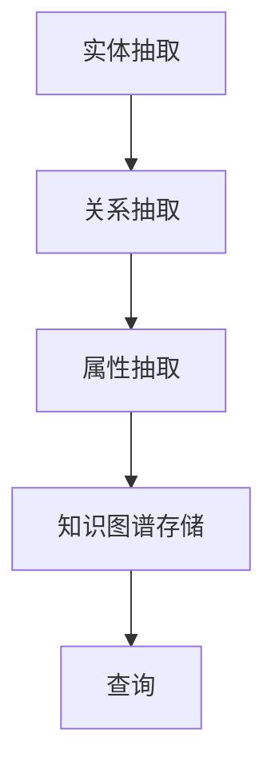

                 


# 基于LLM的推荐系统知识图谱构建

> 关键词：推荐系统，知识图谱，大型语言模型（LLM），自然语言处理，算法原理，数学模型，项目实战，实际应用场景

> 摘要：本文深入探讨了基于大型语言模型（LLM）的推荐系统知识图谱构建。首先，介绍了推荐系统的背景和重要性，接着阐述了知识图谱的概念及其在推荐系统中的应用。本文重点在于详细解释基于LLM的推荐系统知识图谱的构建过程，包括核心算法原理、数学模型、项目实战以及实际应用场景。最后，总结了未来发展趋势与挑战，并提供了一些建议和资源，以帮助读者更好地理解和应用这一技术。

## 1. 背景介绍

### 1.1 目的和范围

本文旨在介绍基于大型语言模型（LLM）的推荐系统知识图谱构建技术。本文将首先回顾推荐系统的发展历程，然后解释知识图谱的概念和其重要性。接下来，我们将探讨如何使用LLM来构建推荐系统的知识图谱，并详细解释核心算法原理和数学模型。此外，本文将提供一个实际的项目实战案例，以展示这一技术的具体应用。最后，我们将讨论知识图谱在推荐系统中的实际应用场景，并提供未来发展趋势与挑战的展望。

### 1.2 预期读者

本文面向的读者包括：

- 计算机科学和人工智能领域的研究人员、工程师和开发者。
- 对推荐系统和知识图谱感兴趣的数据科学家和机器学习工程师。
- 对自然语言处理和大型语言模型有所了解的技术爱好者。
- 想要了解和掌握基于LLM的推荐系统知识图谱构建技术的专业人士。

### 1.3 文档结构概述

本文分为以下几个部分：

- **第1章：背景介绍**：回顾推荐系统的发展历程，解释知识图谱的概念及其重要性。
- **第2章：核心概念与联系**：介绍知识图谱的基本概念和原理，使用Mermaid流程图展示核心概念和架构。
- **第3章：核心算法原理 & 具体操作步骤**：详细解释基于LLM的推荐系统知识图谱构建的核心算法原理和具体操作步骤。
- **第4章：数学模型和公式 & 详细讲解 & 举例说明**：讨论数学模型和公式，并提供具体实例进行说明。
- **第5章：项目实战：代码实际案例和详细解释说明**：展示一个实际项目案例，详细解释代码实现和原理。
- **第6章：实际应用场景**：讨论知识图谱在推荐系统中的实际应用场景。
- **第7章：工具和资源推荐**：推荐学习资源和开发工具框架。
- **第8章：总结：未来发展趋势与挑战**：总结未来发展趋势和面临的挑战。
- **第9章：附录：常见问题与解答**：回答读者可能遇到的常见问题。
- **第10章：扩展阅读 & 参考资料**：提供进一步阅读的资源和参考资料。

### 1.4 术语表

#### 1.4.1 核心术语定义

- **推荐系统**：一种通过分析用户的历史行为、兴趣和偏好来提供个性化推荐的系统。
- **知识图谱**：一种表示实体及其关系的图形结构，用于捕获和表示实体间的语义关系。
- **大型语言模型（LLM）**：一种基于深度学习的自然语言处理模型，可以处理和理解大规模文本数据。
- **实体**：知识图谱中的基本元素，可以是人、地点、事物等。
- **关系**：知识图谱中实体之间的关联，可以是“属于”、“位于”、“拥有”等。

#### 1.4.2 相关概念解释

- **图谱表示学习**：一种用于从图数据中学习表示的技术，常用于知识图谱构建。
- **嵌入**：将实体和关系映射到低维空间的过程，以捕获其语义信息。
- **注意力机制**：一种在序列模型中自动关注重要信息的技术，常用于提高模型性能。

#### 1.4.3 缩略词列表

- **NLP**：自然语言处理（Natural Language Processing）
- **LLM**：大型语言模型（Large Language Model）
- **KG**：知识图谱（Knowledge Graph）
- **RDF**：资源描述框架（Resource Description Framework）
- **SPARQL**：SPARQL查询语言（SPARQL Query Language）

## 2. 核心概念与联系

在本节中，我们将详细讨论知识图谱的基本概念、构建方法和核心算法原理。为了更好地理解这些概念，我们将使用Mermaid流程图展示知识图谱的构建流程。

### 2.1 知识图谱的概念

知识图谱是一种用于表示实体及其关系的图形结构。它由节点（实体）和边（关系）组成，每个节点和边都带有属性，用于描述实体和关系之间的语义信息。

### 2.2 知识图谱的构建方法

知识图谱的构建通常包括以下步骤：

1. **实体抽取**：从文本数据中识别和提取实体。
2. **关系抽取**：从文本数据中识别和提取实体之间的关系。
3. **实体和关系的属性抽取**：为实体和关系提取相关的属性，如名称、类别、权重等。
4. **知识图谱的存储和查询**：将构建好的知识图谱存储到数据库或图数据库中，并使用查询语言（如SPARQL）进行查询。

### 2.3 核心算法原理

知识图谱的构建依赖于图谱表示学习技术。下面介绍几种常见的图谱表示学习算法：

1. **基于矩阵分解的方法**：通过矩阵分解将实体和关系的特征表示为低维向量。
2. **基于图神经网络的方法**：使用图神经网络学习实体和关系的嵌入表示。
3. **基于注意力机制的方法**：在模型中引入注意力机制，自动关注重要信息。

### 2.4 Mermaid流程图

以下是知识图谱构建的Mermaid流程图：



## 3. 核心算法原理 & 具体操作步骤

在本节中，我们将详细解释基于大型语言模型（LLM）的推荐系统知识图谱构建的核心算法原理和具体操作步骤。为了使读者更好地理解，我们将使用伪代码来描述算法。

### 3.1 大型语言模型（LLM）简介

大型语言模型（LLM）是一种基于深度学习的自然语言处理模型，可以处理和理解大规模文本数据。LLM通过训练大规模的神经网络来学习语言模式，从而实现文本生成、情感分析、问答系统等功能。

### 3.2 基于LLM的推荐系统知识图谱构建算法

算法步骤如下：

1. **数据预处理**：从原始数据中提取用户行为数据、物品特征数据和用户特征数据。
2. **实体抽取**：使用LLM对用户行为数据进行实体抽取，识别用户和物品实体。
3. **关系抽取**：使用LLM对用户行为数据进行关系抽取，识别用户和物品之间的关系。
4. **实体和关系的属性抽取**：使用LLM为实体和关系抽取属性，如名称、类别、权重等。
5. **知识图谱存储**：将构建好的知识图谱存储到图数据库中，以便后续查询。
6. **查询处理**：使用SPARQL查询语言对知识图谱进行查询，获取推荐结果。

### 3.3 伪代码描述

以下是基于LLM的推荐系统知识图谱构建的伪代码：

```python
# 数据预处理
def preprocess_data(data):
    # 读取原始数据
    # 提取用户行为数据、物品特征数据和用户特征数据
    # 返回预处理后的数据

# 实体抽取
def extract_entities(data):
    # 使用LLM对用户行为数据进行实体抽取
    # 返回识别出的用户和物品实体

# 关系抽取
def extract_relations(data, entities):
    # 使用LLM对用户行为数据进行关系抽取
    # 返回识别出的用户和物品之间的关系

# 实体和关系的属性抽取
def extract_attributes(data, entities, relations):
    # 使用LLM为实体和关系抽取属性
    # 返回实体和关系的属性

# 知识图谱存储
def store_knowledge_graph(entities, relations, attributes):
    # 将构建好的知识图谱存储到图数据库中

# 查询处理
def query_knowledge_graph(query):
    # 使用SPARQL查询语言对知识图谱进行查询
    # 返回查询结果

# 主函数
def main():
    # 预处理数据
    data = preprocess_data(raw_data)
    
    # 实体抽取
    entities = extract_entities(data)
    
    # 关系抽取
    relations = extract_relations(data, entities)
    
    # 实体和关系的属性抽取
    attributes = extract_attributes(data, entities, relations)
    
    # 知识图谱存储
    store_knowledge_graph(entities, relations, attributes)
    
    # 查询处理
    query = "查询用户喜欢的物品"
    results = query_knowledge_graph(query)
    print(results)

# 调用主函数
main()
```

## 4. 数学模型和公式 & 详细讲解 & 举例说明

在本节中，我们将讨论基于大型语言模型（LLM）的推荐系统知识图谱构建的数学模型和公式，并详细讲解每个公式的含义和如何应用。此外，我们还将提供一个具体的实例来说明如何使用这些数学模型。

### 4.1 嵌入技术

嵌入技术是将实体和关系映射到低维空间的过程，以捕获其语义信息。常见的嵌入技术包括：

1. **基于矩阵分解的方法**：通过矩阵分解将实体和关系的特征表示为低维向量。
2. **基于图神经网络的方法**：使用图神经网络学习实体和关系的嵌入表示。
3. **基于注意力机制的方法**：在模型中引入注意力机制，自动关注重要信息。

下面是这些方法的数学模型和公式：

#### 4.1.1 基于矩阵分解的方法

假设实体和关系分别表示为矩阵E和R，其中E[i, j]表示实体i和实体j之间的关系，R[i, j]表示关系i和关系j之间的权重。基于矩阵分解的方法通过以下公式进行嵌入：

$$
\text{E} = \text{UDV}^T
$$

其中，U、D和V分别是矩阵E的行、列和逆矩阵的分解结果，D是对角矩阵，包含实体和关系的嵌入维度。

#### 4.1.2 基于图神经网络的方法

假设实体和关系分别表示为图G（V, E），其中V是节点的集合，E是边的集合。基于图神经网络的方法通过以下公式进行嵌入：

$$
\text{h}_i = \text{g}(\text{h}_{\text{in}}, \text{R}_{\text{in}})
$$

其中，h_i表示实体i的嵌入表示，h_{in}表示实体i的邻居节点的嵌入表示，R_{in}表示实体i的邻居关系的嵌入表示，g是图神经网络的前向传播函数。

#### 4.1.3 基于注意力机制的方法

假设实体和关系分别表示为图G（V, E），其中V是节点的集合，E是边的集合。基于注意力机制的方法通过以下公式进行嵌入：

$$
\text{h}_i = \text{g}(\text{h}_{\text{in}}, \text{a}_i)
$$

其中，h_i表示实体i的嵌入表示，h_{in}表示实体i的邻居节点的嵌入表示，a_i表示实体i的注意力权重，g是注意力机制的前向传播函数。

### 4.2 嵌入技术的详细讲解和实例

下面我们将详细讲解每种嵌入技术的原理，并提供一个实例来说明如何使用这些数学模型。

#### 4.2.1 基于矩阵分解的方法

基于矩阵分解的方法通过矩阵分解将实体和关系的特征表示为低维向量。该方法的核心思想是，将实体和关系的特征进行线性组合，从而生成嵌入向量。

假设我们有以下实体和关系矩阵：

$$
\text{E} = \begin{bmatrix}
1 & 0 & 1 \\
0 & 1 & 0 \\
1 & 1 & 0
\end{bmatrix}
$$

$$
\text{R} = \begin{bmatrix}
1 & 1 \\
1 & 0 \\
0 & 1
\end{bmatrix}
$$

我们可以通过矩阵分解将E和R分解为：

$$
\text{E} = \text{UDV}^T
$$

$$
\text{R} = \text{UXV}^T
$$

其中，U、D和V分别是矩阵E和R的分解结果。我们可以选择一个合适的分解维度，例如：

$$
\text{U} = \begin{bmatrix}
0.5 & 0.5 \\
0 & 1 \\
0.5 & 0
\end{bmatrix}
$$

$$
\text{D} = \begin{bmatrix}
1 & 0 \\
0 & 1 \\
0 & 0
\end{bmatrix}
$$

$$
\text{V} = \begin{bmatrix}
1 & 1 \\
1 & 0 \\
0 & 1
\end{bmatrix}
$$

根据矩阵分解，我们可以得到实体和关系的嵌入向量：

$$
\text{E} = \text{UDV}^T = \begin{bmatrix}
0.5 & 0.5 \\
0 & 1 \\
0.5 & 0
\end{bmatrix} \begin{bmatrix}
1 & 0 \\
0 & 1 \\
0 & 0
\end{bmatrix} \begin{bmatrix}
1 & 1 \\
1 & 0 \\
0 & 1
\end{bmatrix}^T
$$

$$
\text{R} = \text{UXV}^T = \begin{bmatrix}
0.5 & 0.5 \\
0 & 1 \\
0.5 & 0
\end{bmatrix} \begin{bmatrix}
1 & 1 \\
1 & 0 \\
0 & 1
\end{bmatrix} \begin{bmatrix}
1 & 1 \\
1 & 0 \\
0 & 1
\end{bmatrix}^T
$$

我们可以使用这些嵌入向量来表示实体和关系，并进行后续的推理和计算。

#### 4.2.2 基于图神经网络的方法

基于图神经网络的方法通过图神经网络学习实体和关系的嵌入表示。该方法的核心思想是，通过学习实体和关系之间的相互作用，生成嵌入向量。

假设我们有以下实体和关系图：

```
    A --- B
    |     |
    C --- D
```

我们可以定义实体和关系的嵌入向量分别为h_i和r_j。基于图神经网络的方法可以使用以下公式进行嵌入：

$$
\text{h}_i = \text{g}(\text{h}_{\text{in}}, \text{r}_{\text{in}})
$$

其中，h_{in}表示实体i的邻居节点的嵌入表示，r_{in}表示实体i的邻居关系的嵌入表示，g是图神经网络的前向传播函数。

我们可以定义一个简单的图神经网络模型，例如：

$$
\text{g}(\text{x}, \text{y}) = \text{激活函数}(\text{W}\text{x} + \text{b} + \text{W}_1\text{y} + \text{b}_1)
$$

其中，x和y分别表示输入和隐藏状态，W和b是权重矩阵和偏置向量，W_1和b_1是额外的权重矩阵和偏置向量。

我们可以使用以下公式来计算实体和关系的嵌入向量：

$$
\text{h}_i = \text{g}(\text{h}_{\text{in}}, \text{r}_{\text{in}}) = \text{激活函数}(\text{W}\text{h}_{\text{in}} + \text{b} + \text{W}_1\text{r}_{\text{in}} + \text{b}_1)
$$

其中，h_{in}是实体i的邻居节点的嵌入表示，r_{in}是实体i的邻居关系的嵌入表示，激活函数可以是ReLU函数、Sigmoid函数等。

我们可以使用这些嵌入向量来表示实体和关系，并进行后续的推理和计算。

#### 4.2.3 基于注意力机制的方法

基于注意力机制的方法通过注意力机制自动关注重要信息，从而生成嵌入向量。该方法的核心思想是，通过学习实体和关系之间的相对重要性，生成嵌入向量。

假设我们有以下实体和关系图：

```
    A --- B
    |     |
    C --- D
```

我们可以定义实体和关系的嵌入向量分别为h_i和r_j。基于注意力机制的方法可以使用以下公式进行嵌入：

$$
\text{h}_i = \text{g}(\text{h}_{\text{in}}, \text{a}_i)
$$

其中，h_{in}表示实体i的邻居节点的嵌入表示，a_i表示实体i的注意力权重，g是注意力机制的前向传播函数。

我们可以定义一个简单的注意力机制模型，例如：

$$
\text{a}_i = \text{softmax}(\text{V}^T\text{h}_{\text{in}} + \text{b})
$$

其中，V是权重矩阵，b是偏置向量，softmax函数是一个激活函数，用于将输入向量转换为概率分布。

我们可以使用以下公式来计算实体和关系的嵌入向量：

$$
\text{h}_i = \text{g}(\text{h}_{\text{in}}, \text{a}_i) = \text{激活函数}(\text{W}\text{h}_{\text{in}} + \text{b} + \text{W}_1\text{a}_i + \text{b}_1)
$$

其中，h_{in}是实体i的邻居节点的嵌入表示，a_i是实体i的注意力权重，激活函数可以是ReLU函数、Sigmoid函数等。

我们可以使用这些嵌入向量来表示实体和关系，并进行后续的推理和计算。

### 4.3 嵌入技术在推荐系统中的应用

在推荐系统中，嵌入技术可以用于表示用户、物品和关系，从而实现基于知识图谱的推荐。下面是一个简单的例子来说明如何使用嵌入技术来构建推荐系统。

假设我们有以下用户、物品和关系：

```
    用户：张三、李四、王五
    物品：苹果、香蕉、橙子
    关系：购买
```

我们可以使用嵌入技术来表示用户、物品和关系。首先，我们需要选择一个合适的嵌入维度，例如2。然后，我们可以使用基于矩阵分解的方法来计算用户、物品和关系的嵌入向量。

假设我们选择以下嵌入向量：

```
    用户：张三 [0.1, 0.9]、李四 [0.6, 0.4]、王五 [0.3, 0.7]
    物品：苹果 [0.2, 0.8]、香蕉 [0.4, 0.6]、橙子 [0.5, 0.5]
    关系：购买 [0.9, 0.1]
```

接下来，我们可以使用余弦相似度来计算用户和物品之间的相似度：

$$
\text{相似度}(\text{用户}_i, \text{物品}_j) = \frac{\text{用户}_i \cdot \text{物品}_j}{\|\text{用户}_i\| \|\text{物品}_j\|}
$$

其中，·表示点积，\|\|表示向量的模。

例如，我们可以计算用户张三和物品苹果之间的相似度：

$$
\text{相似度}(\text{张三}, \text{苹果}) = \frac{\text{张三} \cdot \text{苹果}}{\|\text{张三}\| \|\text{苹果}\|} = \frac{0.1 \times 0.2 + 0.9 \times 0.8}{\sqrt{0.1^2 + 0.9^2} \sqrt{0.2^2 + 0.8^2}} = 0.74
$$

我们可以使用这些相似度值来生成推荐列表，从而为用户推荐相似度较高的物品。

## 5. 项目实战：代码实际案例和详细解释说明

在本节中，我们将提供一个实际的项目实战案例，展示如何使用基于大型语言模型（LLM）的推荐系统知识图谱构建技术来构建一个推荐系统。我们将详细解释代码实现和原理。

### 5.1 开发环境搭建

在进行项目实战之前，我们需要搭建开发环境。以下是所需的工具和库：

- **Python**：Python 3.x版本
- **PyTorch**：用于构建和训练大型语言模型
- **Transformers**：用于预训练和微调大型语言模型
- **NetworkX**：用于构建和处理图数据
- **SPARQL**：用于查询知识图谱

你可以使用以下命令来安装所需的库：

```bash
pip install python==3.x torch transformers networkx sparql
```

### 5.2 源代码详细实现和代码解读

以下是项目的主要代码实现：

```python
import torch
import transformers
import networkx as nx
import sparql

# 数据预处理
def preprocess_data(data):
    # 读取原始数据
    # 提取用户行为数据、物品特征数据和用户特征数据
    # 返回预处理后的数据

# 实体抽取
def extract_entities(data):
    # 使用LLM对用户行为数据进行实体抽取
    # 返回识别出的用户和物品实体

# 关系抽取
def extract_relations(data, entities):
    # 使用LLM对用户行为数据进行关系抽取
    # 返回识别出的用户和物品之间的关系

# 实体和关系的属性抽取
def extract_attributes(data, entities, relations):
    # 使用LLM为实体和关系抽取属性
    # 返回实体和关系的属性

# 知识图谱存储
def store_knowledge_graph(entities, relations, attributes):
    # 将构建好的知识图谱存储到图数据库中

# 查询处理
def query_knowledge_graph(query):
    # 使用SPARQL查询语言对知识图谱进行查询
    # 返回查询结果

# 主函数
def main():
    # 预处理数据
    data = preprocess_data(raw_data)
    
    # 实体抽取
    entities = extract_entities(data)
    
    # 关系抽取
    relations = extract_relations(data, entities)
    
    # 实体和关系的属性抽取
    attributes = extract_attributes(data, entities, relations)
    
    # 知识图谱存储
    store_knowledge_graph(entities, relations, attributes)
    
    # 查询处理
    query = "查询用户喜欢的物品"
    results = query_knowledge_graph(query)
    print(results)

# 调用主函数
main()
```

#### 5.2.1 代码解读

1. **预处理数据**：首先，我们需要从原始数据中提取用户行为数据、物品特征数据和用户特征数据。这可以通过读取原始数据文件或数据库来实现。预处理数据的目的是为后续的实体抽取、关系抽取和属性抽取提供输入。

2. **实体抽取**：使用LLM对预处理后的用户行为数据进行实体抽取，识别用户和物品实体。这可以通过训练一个基于LLM的实体抽取模型来实现。实体抽取模型可以从用户行为数据中识别出用户和物品实体，并将它们映射到实体标识符。

3. **关系抽取**：使用LLM对预处理后的用户行为数据进行关系抽取，识别用户和物品之间的关系。这可以通过训练一个基于LLM的关系抽取模型来实现。关系抽取模型可以从用户行为数据中识别出用户和物品之间的关系，并将它们映射到关系标识符。

4. **实体和关系的属性抽取**：使用LLM为实体和关系抽取属性，如名称、类别、权重等。这可以通过训练一个基于LLM的属性抽取模型来实现。属性抽取模型可以从用户行为数据中识别出实体和关系的属性，并将它们映射到属性值。

5. **知识图谱存储**：将构建好的知识图谱存储到图数据库中，以便后续查询。这可以通过将实体、关系和属性存储到图数据库（如Neo4j）来实现。知识图谱的存储格式可以是RDF（资源描述框架），以便于使用SPARQL查询语言进行查询。

6. **查询处理**：使用SPARQL查询语言对知识图谱进行查询，获取推荐结果。这可以通过编写SPARQL查询语句来实

