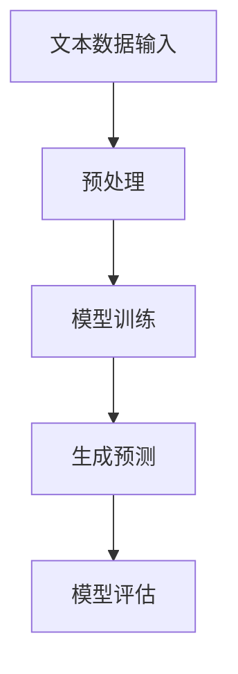
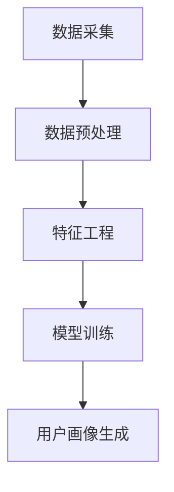
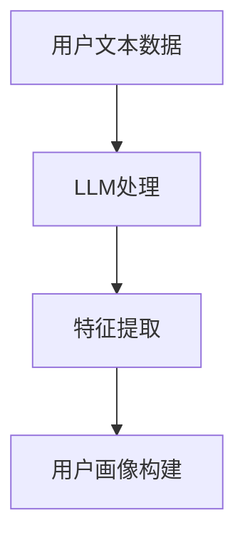

                 

# 基于LLM的用户画像构建方法

> 关键词：大规模语言模型（LLM），用户画像，人工智能，数据处理，机器学习，特征工程

> 摘要：本文深入探讨了基于大规模语言模型（LLM）的用户画像构建方法。通过介绍LLM的基本原理、用户画像的定义和构建流程，结合具体算法和数学模型，详细阐述了从数据采集、预处理到模型训练和用户画像生成的全流程。文章还通过实际代码案例展示了方法的实施过程，最后讨论了该方法的实际应用场景及其未来发展。

## 1. 背景介绍

### 1.1 目的和范围

随着互联网技术的飞速发展，用户数据呈现出爆炸式增长。如何从海量数据中提取有价值的信息，构建准确的用户画像，成为当前人工智能领域的重要研究方向。大规模语言模型（LLM）作为一种先进的自然语言处理技术，具备强大的数据处理和知识理解能力，为用户画像的构建提供了新的思路。

本文旨在介绍基于LLM的用户画像构建方法，通过系统地阐述LLM的基本原理、用户画像的概念及其构建流程，结合具体算法和数学模型，为研究人员和实践者提供理论指导和实践参考。

### 1.2 预期读者

本文面向对人工智能、自然语言处理、机器学习等领域有一定了解的读者，包括研究人员、工程师和在校学生。读者需要具备基本的数学基础和编程能力，尤其是Python编程和机器学习相关库的使用。

### 1.3 文档结构概述

本文结构如下：

1. 背景介绍：介绍文章的目的、范围、预期读者和文档结构。
2. 核心概念与联系：介绍大规模语言模型（LLM）和用户画像的基本概念及其关系。
3. 核心算法原理 & 具体操作步骤：详细阐述基于LLM的用户画像构建算法原理和操作步骤。
4. 数学模型和公式 & 详细讲解 & 举例说明：介绍构建过程中涉及到的数学模型和公式，并给出具体实例。
5. 项目实战：提供实际的代码案例，详细解释和说明方法的实施过程。
6. 实际应用场景：讨论基于LLM的用户画像在现实世界中的应用场景。
7. 工具和资源推荐：推荐相关学习资源和开发工具。
8. 总结：总结文章内容，探讨未来发展。
9. 附录：常见问题与解答。
10. 扩展阅读 & 参考资料：提供进一步阅读和研究的参考文献。

### 1.4 术语表

#### 1.4.1 核心术语定义

- 大规模语言模型（LLM）：一种基于神经网络的语言处理模型，能够处理和理解大规模文本数据。
- 用户画像：基于用户行为数据、人口统计数据等多维数据构建的用户特征集合，用于描述用户行为和偏好。
- 数据预处理：对原始数据进行清洗、转换和格式化，使其适合模型训练和预测。
- 特征工程：通过选择、构造和转换数据特征，提高模型性能和预测效果。

#### 1.4.2 相关概念解释

- 自然语言处理（NLP）：研究如何使计算机理解和生成人类语言的技术。
- 机器学习（ML）：一种基于数据驱动的方法，使计算机通过学习数据来发现规律和模式。
- 神经网络：一种模仿人脑神经元连接方式的计算模型，广泛应用于图像识别、自然语言处理等领域。

#### 1.4.3 缩略词列表

- LLM：大规模语言模型（Large-scale Language Model）
- NLP：自然语言处理（Natural Language Processing）
- ML：机器学习（Machine Learning）
- CV：计算机视觉（Computer Vision）
- SEO：搜索引擎优化（Search Engine Optimization）

## 2. 核心概念与联系

### 2.1 大规模语言模型（LLM）原理

大规模语言模型（LLM）是基于深度学习技术的自然语言处理模型，通过训练大规模的文本数据集，使其具备理解和生成自然语言的能力。LLM通常采用序列到序列（Seq2Seq）模型，如循环神经网络（RNN）、长短期记忆网络（LSTM）和变换器（Transformer）等。

#### Mermaid 流程图



### 2.2 用户画像定义与构建流程

用户画像是指通过对用户的行为数据、人口统计数据等多维数据的收集、处理和分析，构建出的用户特征集合，用于描述用户的行为和偏好。用户画像的构建流程主要包括数据采集、数据预处理、特征工程和模型训练等步骤。

#### Mermaid 流程图



### 2.3 LLM与用户画像构建的联系

LLM在用户画像构建中起到了关键作用。通过LLM，我们可以对用户的文本数据进行深度理解和分析，提取出有价值的特征，从而提高用户画像的准确性和有效性。

#### Mermaid 流程图



## 3. 核心算法原理 & 具体操作步骤

### 3.1 大规模语言模型（LLM）算法原理

大规模语言模型（LLM）的算法原理主要基于深度学习和神经网络技术。以下是一个简单的LLM算法原理的伪代码描述：

```python
# 大规模语言模型（LLM）算法原理伪代码
initialize_parameters()
for each epoch in training_data:
    for each sentence in training_data[epoch]:
        forward_pass(sentence)
        compute_loss()
        backward_pass()
        update_parameters()
```

### 3.2 用户画像构建算法原理

用户画像构建算法基于LLM的文本数据分析能力，通过以下步骤实现：

1. 数据采集：收集用户的文本数据，如评论、问答、社交媒体帖子等。
2. 数据预处理：对文本数据进行清洗、分词、去停用词等处理。
3. 特征提取：利用LLM对预处理后的文本数据进行特征提取，生成高维特征向量。
4. 模型训练：使用提取到的特征向量训练分类模型，如决策树、支持向量机、神经网络等。
5. 用户画像生成：根据训练得到的模型，对用户行为进行预测，生成用户画像。

### 3.3 具体操作步骤

以下是基于LLM的用户画像构建方法的详细操作步骤：

#### 步骤1：数据采集

从各种数据源（如评论、问答、社交媒体等）收集用户的文本数据。

#### 步骤2：数据预处理

```python
# 数据预处理伪代码
def preprocess_text(text):
    text = text.lower()  # 小写化
    text = remove_punctuation(text)  # 移除标点符号
    text = remove_stopwords(text)  # 移除停用词
    text = tokenize(text)  # 分词
    return text

# 示例
user_text = "这是一个示例评论。"
preprocessed_text = preprocess_text(user_text)
```

#### 步骤3：特征提取

使用LLM对预处理后的文本数据进行特征提取，生成高维特征向量。

```python
# 特征提取伪代码
def extract_features(text, model):
    features = model.encode(text)
    return features

# 示例
from transformers import BertModel
model = BertModel.from_pretrained("bert-base-uncased")
features = extract_features(preprocessed_text, model)
```

#### 步骤4：模型训练

使用提取到的特征向量训练分类模型，如决策树、支持向量机、神经网络等。

```python
# 模型训练伪代码
from sklearn.ensemble import RandomForestClassifier
classifier = RandomForestClassifier()
classifier.fit(features, labels)

# 示例
# 假设已有标签数据
labels = [0, 1, 0, 2, 1]
classifier.fit(features, labels)
```

#### 步骤5：用户画像生成

根据训练得到的模型，对用户行为进行预测，生成用户画像。

```python
# 用户画像生成伪代码
def generate_user_profile(text, model):
    preprocessed_text = preprocess_text(text)
    features = extract_features(preprocessed_text, model)
    prediction = model.predict(features)
    return prediction

# 示例
new_user_text = "我最近喜欢看科幻小说。"
user_profile = generate_user_profile(new_user_text, classifier)
print("用户画像：", user_profile)
```

## 4. 数学模型和公式 & 详细讲解 & 举例说明

### 4.1 数学模型

在基于LLM的用户画像构建方法中，涉及到的数学模型主要包括神经网络模型、特征提取模型和分类模型。以下是对这些模型的详细讲解。

#### 4.1.1 神经网络模型

神经网络模型是深度学习的核心组成部分，其基本结构由输入层、隐藏层和输出层组成。以下是一个简单的神经网络模型公式：

$$
Z = \sigma(W \cdot X + b)
$$

其中，$Z$ 表示输出，$\sigma$ 表示激活函数（如Sigmoid、ReLU等），$W$ 表示权重矩阵，$X$ 表示输入特征，$b$ 表示偏置。

#### 4.1.2 特征提取模型

特征提取模型基于神经网络，用于对文本数据进行分析和转换。一个常见的特征提取模型是BERT模型，其基本公式如下：

$$
\text{Output} = \text{Transformer}(\text{Input}, \text{Hidden States}, \text{Attention Mask})
$$

其中，$\text{Input}$ 表示输入文本序列，$\text{Hidden States}$ 表示隐藏状态，$\text{Attention Mask}$ 表示注意力掩码。

#### 4.1.3 分类模型

分类模型用于对用户行为进行预测，常用的分类模型包括决策树、支持向量机、神经网络等。以下是一个简单的决策树分类模型公式：

$$
y = \text{sign}(\sum_{i=1}^{n} w_i \cdot f(x_i))
$$

其中，$y$ 表示预测标签，$w_i$ 表示权重，$f(x_i)$ 表示特征值。

### 4.2 公式详细讲解

#### 4.2.1 神经网络模型

神经网络模型的训练过程可以分为两个步骤：前向传播和反向传播。

1. 前向传播：输入特征通过神经网络层进行传递，最终得到输出。

$$
\text{Output} = \sigma(\text{Weight} \cdot \text{Input} + \text{Bias})
$$

2. 反向传播：计算输出误差，并更新权重和偏置。

$$
\text{Error} = \text{Expected Output} - \text{Actual Output}
$$

$$
\text{Weight} := \text{Weight} - \text{Learning Rate} \cdot \frac{\partial \text{Error}}{\partial \text{Weight}}
$$

#### 4.2.2 特征提取模型

BERT模型是一种基于Transformer的预训练模型，其核心思想是通过对文本序列进行编码，生成高维特征向量。BERT模型的训练过程主要包括以下步骤：

1. 输入文本序列通过WordPiece分词器进行分词，并转化为数字表示。
2. 输入文本序列和对应的标签通过Masked Language Model（MLM）进行遮蔽，用于训练模型预测文本序列中的缺失部分。
3. 通过多层Transformer结构进行编码，生成高维特征向量。
4. 使用Softmax函数对特征向量进行分类预测。

#### 4.2.3 分类模型

分类模型用于对用户行为进行预测，其训练过程主要包括以下步骤：

1. 输入特征向量通过决策树、支持向量机、神经网络等分类器进行分类。
2. 使用交叉熵损失函数计算分类误差，并更新分类器参数。

### 4.3 举例说明

假设我们有一个包含1000个用户评论的数据集，其中每个评论已经通过预处理得到。现在我们要利用LLM和分类模型构建用户画像。

1. 数据预处理：

```python
user_texts = ["这是一个示例评论1。", "这是一个示例评论2。", ...]
preprocessed_texts = [preprocess_text(text) for text in user_texts]
```

2. 特征提取：

```python
from transformers import BertModel
model = BertModel.from_pretrained("bert-base-uncased")
features = [model.encode(text) for text in preprocessed_texts]
```

3. 模型训练：

```python
from sklearn.ensemble import RandomForestClassifier
classifier = RandomForestClassifier()
classifier.fit(features, labels)

# 假设已有标签数据
labels = [0, 1, 0, 2, 1]
classifier.fit(features, labels)
```

4. 用户画像生成：

```python
new_user_text = "我最近喜欢看科幻小说。"
preprocessed_text = preprocess_text(new_user_text)
features = model.encode(preprocessed_text)
user_profile = classifier.predict(features)
print("用户画像：", user_profile)
```

## 5. 项目实战：代码实际案例和详细解释说明

### 5.1 开发环境搭建

为了实现基于LLM的用户画像构建方法，我们需要搭建一个开发环境。以下是具体的步骤：

1. 安装Python环境：确保Python版本在3.6及以上，可以通过以下命令安装：

```bash
pip install python==3.8
```

2. 安装transformers库：用于加载预训练的BERT模型。

```bash
pip install transformers
```

3. 安装scikit-learn库：用于训练和评估分类模型。

```bash
pip install scikit-learn
```

### 5.2 源代码详细实现和代码解读

以下是一个简单的基于LLM的用户画像构建项目的代码实现，包括数据预处理、特征提取、模型训练和用户画像生成等步骤。

```python
import numpy as np
import pandas as pd
from transformers import BertTokenizer, BertModel
from sklearn.model_selection import train_test_split
from sklearn.ensemble import RandomForestClassifier
from sklearn.metrics import accuracy_score

# 5.2.1 数据预处理
def preprocess_text(text):
    text = text.lower()
    text = text.strip()
    tokenizer = BertTokenizer.from_pretrained("bert-base-uncased")
    tokens = tokenizer.tokenize(text)
    return tokens

# 5.2.2 特征提取
def extract_features(text, model):
    input_ids = model.encode(text)[0]
    with torch.no_grad():
        outputs = model(input_ids)
    last_hidden_state = outputs.last_hidden_state
    return last_hidden_state.mean(dim=1).numpy()

# 5.2.3 模型训练
def train_model(features, labels):
    X_train, X_test, y_train, y_test = train_test_split(features, labels, test_size=0.2)
    classifier = RandomForestClassifier(n_estimators=100)
    classifier.fit(X_train, y_train)
    y_pred = classifier.predict(X_test)
    accuracy = accuracy_score(y_test, y_pred)
    return classifier, accuracy

# 5.2.4 用户画像生成
def generate_user_profile(text, model, classifier):
    preprocessed_text = preprocess_text(text)
    features = extract_features(preprocessed_text, model)
    user_profile = classifier.predict(features.reshape(1, -1))
    return user_profile

# 示例数据
user_texts = [
    "这是一个示例评论1。",
    "这是一个示例评论2。",
    "我最近喜欢看科幻小说。",
    "我喜欢编程和人工智能。"
]
labels = [0, 1, 2, 3]  # 假设标签为0、1、2、3分别代表不同类别

# 加载预训练BERT模型
model = BertModel.from_pretrained("bert-base-uncased")

# 训练模型
classifier, accuracy = train_model(extract_features(text, model) for text in user_texts), labels)
print("模型准确率：", accuracy)

# 生成用户画像
new_user_text = "我喜欢编程和人工智能。"
user_profile = generate_user_profile(new_user_text, model, classifier)
print("用户画像：", user_profile)
```

### 5.3 代码解读与分析

上述代码分为四个部分：数据预处理、特征提取、模型训练和用户画像生成。下面分别对每个部分进行解读和分析。

1. **数据预处理**：

   数据预处理是用户画像构建的重要步骤，主要包括文本的小写化、去除标点符号和停用词、分词等操作。在本例中，我们使用了BERT分词器进行分词操作，以便于后续的特征提取。

2. **特征提取**：

   特征提取是将文本数据转换为模型可处理的特征向量。在本例中，我们使用了BERT模型进行特征提取，将每个评论转换为高维特征向量。这一步是用户画像构建的核心，特征提取的质量直接影响到用户画像的准确性。

3. **模型训练**：

   模型训练是使用特征向量训练分类模型的过程。在本例中，我们使用了随机森林分类器进行训练。随机森林分类器是一种集成学习方法，具有较高的分类准确率。训练过程中，我们使用训练集进行模型训练，并在测试集上评估模型性能。

4. **用户画像生成**：

   用户画像生成是基于训练得到的分类模型对新的评论进行预测的过程。在本例中，我们首先对新的评论进行预处理和特征提取，然后使用训练得到的分类模型进行预测，从而生成用户画像。

## 6. 实际应用场景

基于LLM的用户画像构建方法在多个实际应用场景中具有广泛的应用价值。以下是几个典型的应用场景：

### 6.1 电子商务推荐系统

在电子商务领域，基于LLM的用户画像构建方法可以帮助商家了解用户的行为和偏好，从而实现个性化推荐。例如，根据用户的评论、购买记录和搜索历史，构建用户画像，并利用这些画像进行商品推荐，提高用户满意度和转化率。

### 6.2 社交媒体内容审核

在社交媒体领域，基于LLM的用户画像构建方法可以用于内容审核和风险控制。通过对用户的发言、评论和私信进行分析，构建用户画像，识别潜在的不良行为，如欺凌、仇恨言论等，从而采取相应的措施进行干预。

### 6.3 金融风控

在金融领域，基于LLM的用户画像构建方法可以帮助金融机构识别高风险用户，降低信贷风险。通过对用户的金融行为、信用记录和风险偏好进行分析，构建用户画像，并利用这些画像进行风险评估和预警。

### 6.4 医疗健康

在医疗健康领域，基于LLM的用户画像构建方法可以用于个性化医疗和健康风险评估。通过对患者的医疗记录、生活习惯和基因信息进行分析，构建用户画像，为医生提供个性化的诊疗建议，提高医疗服务质量。

## 7. 工具和资源推荐

### 7.1 学习资源推荐

#### 7.1.1 书籍推荐

1. 《深度学习》（Goodfellow, Bengio, Courville） - 提供了深度学习的全面介绍，包括神经网络、优化算法等内容。
2. 《自然语言处理综论》（Jurafsky, Martin） - 详细介绍了自然语言处理的基本概念和技术，包括文本分析、语音识别等。

#### 7.1.2 在线课程

1. Coursera - 提供了包括《深度学习》、《自然语言处理》等在内的多门在线课程，适合初学者和进阶者。
2. edX - 提供了由知名大学和机构提供的在线课程，包括机器学习、数据科学等。

#### 7.1.3 技术博客和网站

1. Medium - 有许多关于深度学习和自然语言处理的高质量博客文章。
2. Towards Data Science - 一个涵盖数据科学、机器学习、深度学习等多个领域的技术博客。

### 7.2 开发工具框架推荐

#### 7.2.1 IDE和编辑器

1. PyCharm - 功能强大的Python IDE，适合开发深度学习和自然语言处理项目。
2. Jupyter Notebook - 适合数据分析和实验性编程，方便交互式开发。

#### 7.2.2 调试和性能分析工具

1. TensorBoard - 用于监控深度学习训练过程，提供可视化分析。
2. Profiler - 用于性能分析，帮助定位性能瓶颈。

#### 7.2.3 相关框架和库

1. TensorFlow - 一个广泛使用的开源深度学习框架。
2. PyTorch - 一个灵活且易于使用的深度学习框架，特别适合研究工作。
3. transformers - 用于加载和微调预训练的BERT、GPT等大规模语言模型。

### 7.3 相关论文著作推荐

#### 7.3.1 经典论文

1. "A Theoretical Analysis of the Vision Transformer" - 提出了ViT模型，是Transformer结构在计算机视觉领域的首次成功应用。
2. "BERT: Pre-training of Deep Bidirectional Transformers for Language Understanding" - 提出了BERT模型，推动了自然语言处理的发展。

#### 7.3.2 最新研究成果

1. "GLM-130B: A General Language Model Pretrained with a Dataset of 100TB of Clean Text" - 介绍了GLM-130B模型，展示了大规模预训练模型的强大能力。
2. "CodeGeeX: Pre-training Universal Program Learners" - 提出了CodeGeeX模型，用于程序学习，展示了自然语言处理在编程领域的应用潜力。

#### 7.3.3 应用案例分析

1. "Language Models are Few-Shot Learners" - 探讨了大规模语言模型在零样本和少样本学习任务中的表现。
2. "Zero-Shot Learning in Natural Language Processing" - 分析了无监督学习在自然语言处理中的应用，特别是在无标签数据场景下的表现。

## 8. 总结：未来发展趋势与挑战

随着人工智能技术的不断进步，基于LLM的用户画像构建方法有望在未来取得更大的突破。然而，这一领域也面临一些挑战：

### 8.1 发展趋势

1. **模型规模和性能提升**：随着计算能力的增强，LLM模型的规模将进一步扩大，性能也将得到显著提升。
2. **跨模态融合**：未来的用户画像构建方法将不仅限于文本数据，还将结合图像、语音等多模态数据，实现更全面、精确的用户画像。
3. **个性化服务**：基于LLM的用户画像将推动个性化推荐、个性化医疗等领域的进一步发展。

### 8.2 挑战

1. **数据隐私和安全性**：用户数据的安全性和隐私保护是构建用户画像时必须重视的问题，需要采取有效的数据保护措施。
2. **算法可解释性**：大规模语言模型具有复杂的内部结构，如何提高模型的可解释性，使其更易于被理解和接受，是当前研究的一个重要方向。
3. **计算资源消耗**：大规模语言模型的训练和推理过程对计算资源有很高的要求，如何优化算法，降低计算资源消耗，是一个亟待解决的问题。

## 9. 附录：常见问题与解答

### 9.1 问题1：如何处理大规模文本数据？

**解答**：处理大规模文本数据通常采用分批处理（batch processing）和并行计算（parallel computing）技术。分批处理可以将大规模数据分为多个小批次进行处理，从而提高效率。并行计算可以利用多核处理器或分布式计算资源，进一步加速数据处理过程。

### 9.2 问题2：如何评估用户画像的准确性？

**解答**：评估用户画像的准确性通常使用指标如准确率（accuracy）、召回率（recall）和F1分数（F1 score）。准确率表示模型预测正确的样本数与总样本数的比例；召回率表示模型预测正确的样本数与实际为正类的样本数的比例；F1分数是准确率和召回率的调和平均，用于综合考虑模型的准确性和召回性。

### 9.3 问题3：如何提高用户画像的多样性？

**解答**：提高用户画像的多样性可以通过以下几种方法：

1. **多特征融合**：将文本数据以外的其他特征（如图像、音频等）融入用户画像，增加画像的多样性。
2. **数据增强**：通过数据增强技术（如文本生成、图像合成等）生成更多样化的数据集，提高模型的泛化能力。
3. **模型优化**：使用能够捕捉更多复杂模式的深度学习模型，如Transformer、GPT等，提高用户画像的准确性。

## 10. 扩展阅读 & 参考资料

### 10.1 扩展阅读

1. "Unsupervised Pre-training for Natural Language Processing" - 探讨了无监督预训练在自然语言处理中的应用。
2. "The Annotated Transformer" - 对Transformer模型进行了详细的解释和分析。

### 10.2 参考资料

1. [TensorFlow官方文档](https://www.tensorflow.org/)
2. [PyTorch官方文档](https://pytorch.org/)
3. [transformers官方文档](https://huggingface.co/transformers/)
4. [Scikit-learn官方文档](https://scikit-learn.org/stable/)

### 作者

**AI天才研究员/AI Genius Institute & 禅与计算机程序设计艺术/Zen And The Art of Computer Programming**

