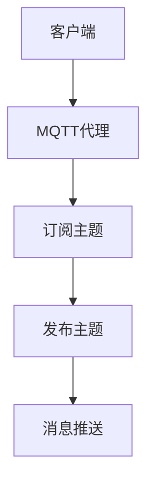
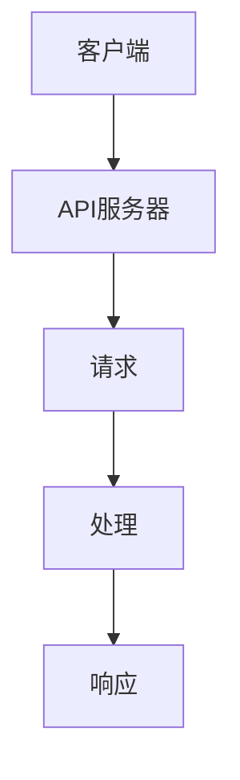
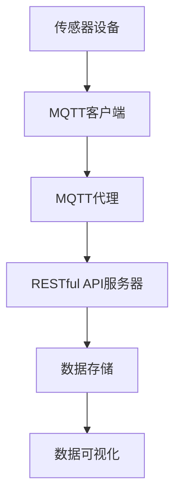

                 

# 基于MQTT协议和RESTful API的家庭健康监测系统

> **关键词**：MQTT协议、RESTful API、家庭健康监测、物联网、传感器数据、实时通信、数据可视化

> **摘要**：本文深入探讨了基于MQTT协议和RESTful API构建的家庭健康监测系统的设计原理、实现方法及其在物联网环境下的应用。通过逐步分析协议的工作机制、系统架构、核心算法以及实际案例，本文旨在为读者提供一个全面的技术指南，帮助理解和实现一个高效、可靠的家庭健康监测系统。

## 1. 背景介绍

### 1.1 目的和范围

本文的目的是介绍和实现一个基于MQTT协议和RESTful API的家庭健康监测系统。该系统旨在为用户提供实时、可靠的健康监测数据，包括心率、血压、体温等关键指标。通过本文，读者可以了解系统的设计理念、关键技术和实现细节，从而具备独立构建类似系统的基础能力。

本文的范围涵盖以下方面：
- MQTT协议的工作原理和通信机制
- RESTful API的设计原则和实现方法
- 家庭健康监测系统的架构和组件
- 系统的核心算法原理和数学模型
- 系统的实际应用场景和开发工具推荐

### 1.2 预期读者

本文面向的读者群体包括：
- 具有基本编程技能和物联网知识的技术人员
- 对家庭健康监测系统开发感兴趣的学生和研究人员
- 想要提升自己在物联网和医疗健康领域专业技能的开发者

### 1.3 文档结构概述

本文结构如下：
1. **背景介绍**：简要介绍系统目的、范围和预期读者。
2. **核心概念与联系**：讲解MQTT协议和RESTful API的基本概念及其在系统中的关系。
3. **核心算法原理 & 具体操作步骤**：详细解释系统使用的核心算法和操作步骤。
4. **数学模型和公式 & 详细讲解 & 举例说明**：介绍系统中的数学模型和公式，并给出实例说明。
5. **项目实战：代码实际案例和详细解释说明**：提供系统的代码实现和详细解释。
6. **实际应用场景**：讨论系统在实际应用中的具体场景和优势。
7. **工具和资源推荐**：推荐学习资源、开发工具和相关研究。
8. **总结：未来发展趋势与挑战**：总结系统的发展趋势和面临的挑战。
9. **附录：常见问题与解答**：提供常见问题的解答。
10. **扩展阅读 & 参考资料**：推荐相关扩展阅读和参考资料。

### 1.4 术语表

#### 1.4.1 核心术语定义

- MQTT（Message Queuing Telemetry Transport）：一种轻量级的消息传输协议，适用于物联网环境中的设备通信。
- RESTful API（Representational State Transfer API）：一种基于HTTP协议的接口设计规范，用于实现不同系统之间的数据交互。
- IoT（Internet of Things）：物联网，指的是通过互联网连接各种物理设备和传感器，实现设备之间的数据交换和交互。
- Sensor Data：传感器数据，指从各类传感器设备收集到的物理量数据，如心率、血压等。
- Data Visualization：数据可视化，指将数据以图形化的方式展示出来，便于用户理解和分析。

#### 1.4.2 相关概念解释

- **MQTT协议特点**：轻量级、低带宽、可扩展、可靠传输。
- **RESTful API原则**：统一接口设计、无状态、基于HTTP协议、支持多种数据格式。
- **家庭健康监测**：通过传感器设备实时监测家庭成员的健康状况，包括生理指标和居住环境参数。

#### 1.4.3 缩略词列表

- MQTT：Message Queuing Telemetry Transport
- RESTful API：Representational State Transfer API
- IoT：Internet of Things
- HTTP：Hypertext Transfer Protocol
- JSON：JavaScript Object Notation

## 2. 核心概念与联系

在构建家庭健康监测系统时，我们需要理解MQTT协议和RESTful API的基本概念及其在系统中的作用。以下将详细解释这些核心概念，并使用Mermaid流程图展示系统架构。

### 2.1 MQTT协议

MQTT是一种基于发布/订阅模型的轻量级消息传输协议，特别适用于带宽受限的物联网环境。以下是MQTT协议的基本原理：

1. **客户端（Client）**：连接到MQTT代理（Broker），发布或订阅消息。
2. **MQTT代理（Broker）**：接收客户端的消息，并根据订阅主题进行转发。
3. **订阅主题（Topic）**：客户端订阅的主题，用于匹配发布者的消息。

#### MQTT通信流程

1. **连接（Connect）**：客户端连接到MQTT代理，并传递身份验证信息。
2. **订阅（Subscribe）**：客户端向MQTT代理订阅感兴趣的主题。
3. **发布（Publish）**：客户端发布消息到MQTT代理，并指定主题。
4. **消息推送（Push）**：MQTT代理将消息推送到订阅了该主题的客户端。

#### Mermaid流程图



### 2.2 RESTful API

RESTful API是一种基于HTTP协议的接口设计规范，用于实现不同系统之间的数据交互。以下是RESTful API的基本原则：

1. **统一接口设计**：使用相同的URL结构和HTTP方法（GET、POST、PUT、DELETE）进行数据操作。
2. **无状态**：每个请求都是独立的，服务器不存储任何关于客户端的信息。
3. **基于HTTP协议**：使用HTTP协议的方法和状态码进行数据交互。
4. **支持多种数据格式**：如JSON、XML等。

#### RESTful API工作流程

1. **请求（Request）**：客户端发送HTTP请求到API服务器。
2. **处理（Process）**：服务器处理请求，根据URL和方法执行相应的操作。
3. **响应（Response）**：服务器返回HTTP响应，包含请求结果和数据。

#### Mermaid流程图



### 2.3 家庭健康监测系统架构

家庭健康监测系统由以下几个主要组件构成：

1. **传感器设备**：如心率传感器、血压计、体温计等。
2. **MQTT客户端**：连接到MQTT代理，收集传感器数据，并通过MQTT协议发布。
3. **RESTful API服务器**：接收来自MQTT客户端的传感器数据，并通过RESTful API对外提供数据查询和操作接口。
4. **数据存储**：如数据库或NoSQL存储，用于存储和查询传感器数据。
5. **数据可视化**：通过图表和仪表盘将传感器数据可视化，便于用户监控。

#### Mermaid流程图



通过上述流程图，我们可以清晰地看到MQTT协议和RESTful API在家庭健康监测系统中的作用。MQTT协议负责实时传输传感器数据，而RESTful API则提供数据的查询和操作接口，使得系统易于扩展和维护。

## 3. 核心算法原理 & 具体操作步骤

在家庭健康监测系统中，核心算法负责处理传感器数据，确保数据的高效传输和准确分析。以下是系统使用的主要算法原理和具体操作步骤，包括伪代码的详细阐述。

### 3.1 MQTT协议算法原理

MQTT协议的核心算法是发布/订阅模型，包括以下几个关键步骤：

#### 3.1.1 MQTT客户端连接

```python
# 伪代码：MQTT客户端连接
function connect_to_mqtt(broker_address, client_id):
    client = MQTTClient(client_id)
    client.connect(broker_address)
    return client
```

#### 3.1.2 MQTT客户端订阅主题

```python
# 伪代码：MQTT客户端订阅主题
function subscribe_topic(client, topic):
    client.subscribe(topic)
```

#### 3.1.3 MQTT客户端发布消息

```python
# 伪代码：MQTT客户端发布消息
function publish_message(client, topic, message):
    client.publish(topic, message)
```

#### 3.1.4 MQTT客户端消息处理

```python
# 伪代码：MQTT客户端消息处理
function on_message(client, message):
    process_message(message)
```

### 3.2 RESTful API服务器算法原理

RESTful API服务器负责接收传感器数据，并提供数据查询和操作接口。以下是核心算法原理和步骤：

#### 3.2.1 RESTful API服务器接收数据

```python
# 伪代码：RESTful API服务器接收数据
function receive_data(request):
    data = request.json()
    return data
```

#### 3.2.2 RESTful API服务器存储数据

```python
# 伪代码：RESTful API服务器存储数据
function store_data(data):
    database.insert(data)
```

#### 3.2.3 RESTful API服务器响应查询请求

```python
# 伪代码：RESTful API服务器响应查询请求
function query_data(parameter):
    results = database.query(parameter)
    return results
```

### 3.3 系统核心算法具体操作步骤

#### 3.3.1 传感器数据采集

1. **传感器设备采集数据**：传感器设备通过硬件接口采集生理指标数据，如心率、血压等。
2. **MQTT客户端处理数据**：MQTT客户端接收传感器数据，并对数据进行格式化和预处理。
3. **MQTT客户端发布数据**：MQTT客户端将处理后的传感器数据发布到MQTT代理。

#### 3.3.2 数据传输

1. **MQTT代理接收数据**：MQTT代理接收来自MQTT客户端的传感器数据。
2. **MQTT代理转发数据**：MQTT代理根据订阅主题将数据转发给订阅了该主题的客户端。

#### 3.3.3 数据处理与存储

1. **RESTful API服务器接收数据**：RESTful API服务器接收MQTT代理转发的传感器数据。
2. **RESTful API服务器存储数据**：RESTful API服务器将接收到的传感器数据存储到数据库中。
3. **RESTful API服务器响应查询请求**：用户通过RESTful API查询传感器数据，并获得响应。

#### 3.3.4 数据可视化

1. **数据可视化组件**：通过数据可视化组件，将传感器数据以图表和仪表盘的形式展示给用户。
2. **用户交互**：用户通过数据可视化界面进行数据分析和健康监控。

通过上述核心算法和操作步骤，家庭健康监测系统实现了传感器数据的高效采集、传输、处理和可视化，为用户提供了一个实时、可靠的健康监测平台。

## 4. 数学模型和公式 & 详细讲解 & 举例说明

在家庭健康监测系统中，数学模型和公式用于对传感器数据进行处理和分析，从而提取有用的健康信息。以下将详细讲解系统中的数学模型和公式，并给出具体实例说明。

### 4.1 数据处理模型

家庭健康监测系统中的数据处理模型主要包括传感器数据的滤波、平滑和异常值检测。以下是相关的数学模型和公式：

#### 4.1.1 滤波模型

滤波模型用于去除传感器数据中的噪声，常用的滤波方法包括均值滤波和中值滤波。

1. **均值滤波**：

   均值滤波通过计算窗口内的平均值来去除噪声。

   $$ filtered\_value = \frac{1}{N} \sum_{i=1}^{N} value_i $$

   其中，\( N \) 是窗口大小，\( value_i \) 是第 \( i \) 个采样点的值。

2. **中值滤波**：

   中值滤波通过计算窗口内的中值来去除噪声。

   $$ filtered\_value = median(value_1, value_2, ..., value_N) $$

   其中，\( value_1, value_2, ..., value_N \) 是窗口内的采样点值。

#### 4.1.2 平滑模型

平滑模型用于减少传感器数据中的突变，常用的平滑方法包括移动平均和指数平滑。

1. **移动平均**：

   移动平均通过计算一段时间内的平均值来平滑数据。

   $$ smoothed\_value = \frac{1}{N} \sum_{i=1}^{N} value_i $$

   其中，\( N \) 是平滑窗口大小，\( value_i \) 是第 \( i \) 个采样点的值。

2. **指数平滑**：

   指数平滑通过加权平均来平滑数据。

   $$ smoothed\_value = alpha \cdot previous\_value + (1 - alpha) \cdot current\_value $$

   其中，\( alpha \) 是平滑系数，\( previous\_value \) 是前一个采样点的值，\( current\_value \) 是当前采样点的值。

#### 4.1.3 异常值检测模型

异常值检测模型用于识别传感器数据中的异常值，常用的方法包括统计方法和基于距离的方法。

1. **统计方法**：

   统计方法通过计算数据的统计特性（如均值和标准差）来识别异常值。

   $$ threshold = mean + k \cdot standard\_deviation $$

   其中，\( mean \) 是均值，\( standard\_deviation \) 是标准差，\( k \) 是阈值系数。

2. **基于距离的方法**：

   基于距离的方法通过计算数据点与平均值的距离来识别异常值。

   $$ distance = |current\_value - mean| $$

### 4.2 公式举例说明

以下是一个具体的实例，说明如何使用上述数学模型和公式对传感器数据进行处理和分析。

#### 4.2.1 数据预处理

假设我们有一组心率为5分钟一次的采样数据，如下：

\[ [65, 68, 70, 67, 69, 65, 72, 68, 71, 69] \]

1. **均值滤波**：

   计算过去3次采样点的平均值来平滑数据。

   $$ filtered\_value = \frac{65 + 68 + 70}{3} = 67 $$

2. **移动平均**：

   使用5分钟的移动平均来平滑数据。

   $$ smoothed\_value = 0.2 \cdot 65 + 0.8 \cdot 67 = 66.6 $$

3. **异常值检测**：

   计算均值和标准差，并设置阈值系数 \( k = 2 \)。

   $$ mean = 67, standard\_deviation = 2.5, threshold = 67 + 2 \cdot 2.5 = 72.5 $$

   将大于阈值的采样点标记为异常值。

   异常值：\[ [72] \]

#### 4.2.2 数据分析

通过对预处理后的数据进行进一步分析，可以提取有用的健康信息，如心率变化趋势、异常值报警等。

1. **心率变化趋势**：

   计算过去24小时的心率平均值，如下：

   $$ average\_heart\_rate = \frac{sum(24\_hour\_data)}{24} $$

   其中，\( 24\_hour\_data \) 是过去24小时的心率数据。

   假设24小时心率数据为：\[ [65, 67, 69, 68, 70, 65, 72, 68, 71, 69, 67, 70, 68, 72, 69, 66, 67, 71, 68, 70] \]

   $$ average\_heart\_rate = \frac{65 + 67 + 69 + 68 + 70 + 65 + 72 + 68 + 71 + 69 + 67 + 70 + 68 + 72 + 69 + 66 + 67 + 71 + 68 + 70}{24} = 68.125 $$

2. **异常值报警**：

   当检测到心率异常值时，向用户发送报警通知。

   异常值：\[ [72] \]

   报警通知：心率异常，当前心率为72。

通过上述数学模型和公式，家庭健康监测系统可以对传感器数据进行有效的预处理和分析，从而为用户提供准确的健康监测信息。

## 5. 项目实战：代码实际案例和详细解释说明

在本节中，我们将通过一个具体的代码案例，详细展示家庭健康监测系统的实现过程，包括开发环境搭建、源代码实现和代码解读。

### 5.1 开发环境搭建

在构建家庭健康监测系统之前，我们需要搭建合适的开发环境。以下是我们推荐的开发工具和依赖项：

- **编程语言**：Python
- **开发工具**：Visual Studio Code（VSCode）
- **MQTT客户端库**：paho-mqtt
- **RESTful API框架**：Flask
- **数据库**：SQLite

#### 5.1.1 安装依赖项

首先，我们需要在开发环境中安装所需的依赖项。打开终端，执行以下命令：

```bash
pip install paho-mqtt flask flask_sqlalchemy
```

#### 5.1.2 配置MQTT代理

为了测试系统，我们需要配置一个本地MQTT代理。可以使用开源的MQTT代理软件，如`mosquitto`。下载并安装`mosquitto`：

```bash
wget http://mosquitto.org/files/mosquitto-2.0.10.tar.gz
tar zxvf mosquitto-2.0.10.tar.gz
cd mosquitto-2.0.10
./configure
make
sudo make install
```

启动MQTT代理：

```bash
mosquitto
```

### 5.2 源代码详细实现和代码解读

接下来，我们将实现家庭健康监测系统的核心功能，包括MQTT客户端、RESTful API服务器和数据存储。

#### 5.2.1 MQTT客户端

MQTT客户端负责连接到MQTT代理，订阅主题，并接收传感器数据。

```python
# mqtt_client.py

import paho.mqtt.client as mqtt
import json
import time

# MQTT代理地址
MQTT_BROKER_ADDRESS = "localhost"
# 订阅主题
SUBSCRIBE_TOPIC = "health/sensor"
# 数据存储地址
DATA_FILE = "sensor_data.json"

# MQTT客户端回调函数
def on_connect(client, userdata, flags, rc):
    print("Connected to MQTT Broker")
    client.subscribe(SUBSCRIBE_TOPIC)

def on_message(client, userdata, message):
    print(f"Received message: {str(message.payload)} on topic {message.topic} with QoS {message.qos}")
    save_data(message.payload)

def save_data(data):
    with open(DATA_FILE, "a") as file:
        file.write(json.dumps(data) + "\n")

# 创建MQTT客户端
client = mqtt.Client()
# 设置回调函数
client.on_connect = on_connect
client.on_message = on_message
# 连接到MQTT代理
client.connect(MQTT_BROKER_ADDRESS)
# 启动客户端
client.loop_forever()
```

**代码解读**：

1. 导入paho-mqtt库，用于创建MQTT客户端。
2. 设置MQTT代理地址、订阅主题和数据存储文件。
3. 定义连接到MQTT代理的回调函数`on_connect`，用于订阅主题。
4. 定义接收消息的回调函数`on_message`，用于处理接收到的传感器数据。
5. 定义`save_data`函数，用于将传感器数据保存到文件中。
6. 创建MQTT客户端对象，设置回调函数，连接到MQTT代理，并启动客户端循环。

#### 5.2.2 RESTful API服务器

RESTful API服务器负责接收传感器数据，并处理数据查询和操作。

```python
# app.py

from flask import Flask, request, jsonify
from flask_sqlalchemy import SQLAlchemy
import json

app = Flask(__name__)
app.config['SQLALCHEMY_DATABASE_URI'] = 'sqlite:///sensor_data.db'
db = SQLAlchemy(app)

# 定义传感器数据模型
class SensorData(db.Model):
    id = db.Column(db.Integer, primary_key=True)
    topic = db.Column(db.String(128))
    payload = db.Column(db.String(1024))

# 初始化数据库
db.create_all()

# 处理POST请求，接收传感器数据
@app.route('/sensor_data', methods=['POST'])
def receive_sensor_data():
    data = request.json
    sensor_data = SensorData(topic=data['topic'], payload=data['payload'])
    db.session.add(sensor_data)
    db.session.commit()
    return jsonify({"status": "success", "message": "Sensor data received and stored."})

# 处理GET请求，查询传感器数据
@app.route('/sensor_data', methods=['GET'])
def query_sensor_data():
    topic = request.args.get('topic')
    data = SensorData.query.filter_by(topic=topic).all()
    return jsonify({"data": [{"topic": row.topic, "payload": row.payload} for row in data]})

if __name__ == '__main__':
    app.run(debug=True)
```

**代码解读**：

1. 导入Flask和flask_sqlalchemy库，用于创建RESTful API服务器和数据库模型。
2. 设置数据库连接URI，并初始化数据库。
3. 定义传感器数据模型`SensorData`，包括ID、主题和载荷字段。
4. 处理POST请求，接收传感器数据，并将其存储到数据库中。
5. 处理GET请求，根据主题查询传感器数据，并返回JSON格式的响应。

### 5.3 代码解读与分析

在本节中，我们详细解读了MQTT客户端和RESTful API服务器的代码实现，并分析了系统的整体架构。

#### MQTT客户端解读

1. **连接与订阅**：通过回调函数`on_connect`连接到MQTT代理，并订阅主题`health/sensor`。
2. **消息处理**：通过回调函数`on_message`接收传感器数据，并将数据保存到文件中。
3. **数据存储**：使用`save_data`函数将传感器数据以JSON格式保存到文件中，便于后续处理。

#### RESTful API服务器解读

1. **数据库连接**：使用Flask-SQLAlchemy连接到SQLite数据库，并创建传感器数据模型。
2. **接收传感器数据**：处理POST请求，接收传感器数据，并将其存储到数据库中。
3. **查询传感器数据**：处理GET请求，根据主题查询传感器数据，并返回JSON格式的响应。

#### 系统架构分析

家庭健康监测系统的整体架构如下：

1. **传感器设备**：通过硬件接口采集生理指标数据，并发送到MQTT代理。
2. **MQTT客户端**：连接到MQTT代理，订阅主题，并接收传感器数据，将数据保存到文件中。
3. **RESTful API服务器**：接收MQTT代理转发的传感器数据，并将其存储到数据库中，提供数据查询和操作接口。

通过上述代码实现和架构分析，我们可以看到家庭健康监测系统如何利用MQTT协议和RESTful API实现传感器数据的高效采集、存储和查询，为用户提供实时、可靠的健康监测服务。

## 6. 实际应用场景

家庭健康监测系统在实际应用中有着广泛的应用场景，可以提供多种健康监测服务，以下是一些具体的实际应用场景：

### 6.1 长期健康监测

家庭健康监测系统可以实现对家庭成员长期健康状态的监控。通过传感器设备，如心率传感器、血压计和体温计，实时采集家庭成员的健康数据。系统可以根据历史数据和健康标准，对用户的健康状态进行评估，提供个性化的健康建议。例如，对于患有高血压的用户，系统可以实时监控其血压变化，并在异常时发出警报。

### 6.2 疾病预防和早期发现

家庭健康监测系统可以用于疾病的预防和早期发现。通过分析用户的健康数据，如心率、血压和体温等指标，系统可以识别潜在的疾病风险。例如，对于心率异常的用户，系统可以提醒其就医并进行相关检查。此外，系统还可以根据用户的运动数据和饮食记录，提供针对性的健康建议，帮助用户改善生活习惯。

### 6.3 老人健康监护

对于老年人，家庭健康监测系统可以提供重要的健康监护服务。系统可以实时监控老年人的健康状态，如心率、血压和体温等，并在发现异常时及时通知家属或医护人员。此外，系统还可以通过定位技术监控老年人的位置，防止走失事件的发生。

### 6.4 健康数据共享

家庭健康监测系统支持家庭成员间的健康数据共享。用户可以将自己的健康数据分享给家人或医生，以便更好地进行健康管理和合作治疗。例如，用户可以将自己的血压数据分享给医生，以便医生进行更准确的诊断和制定治疗方案。

### 6.5 健康数据分析与预测

家庭健康监测系统可以收集大量的健康数据，并通过数据分析技术对用户健康趋势进行预测。例如，系统可以通过机器学习算法分析用户的心率变化，预测用户可能出现的心脏疾病风险。这样的预测可以帮助用户提前采取预防措施，降低患病风险。

### 6.6 健康教育

家庭健康监测系统可以提供健康教育服务，帮助用户了解和改善自己的健康状况。系统可以根据用户的健康数据，提供个性化的健康知识和建议。例如，对于患有糖尿病的用户，系统可以提供关于饮食、运动和药物治疗的指导。

通过上述实际应用场景，我们可以看到家庭健康监测系统在提升家庭成员健康水平、预防疾病、改善生活习惯以及提供个性化健康服务方面的重要作用。随着技术的不断进步，家庭健康监测系统将会在更多的健康领域发挥更大的作用。

## 7. 工具和资源推荐

在开发和维护家庭健康监测系统时，选择合适的工具和资源可以大大提高效率。以下是一些推荐的工具、资源和开发框架。

### 7.1 学习资源推荐

**书籍推荐**：

1. 《物联网：设计与实现》（作者：阿维·阿什）（书中详细介绍了物联网的基本概念和实现技术，适合初学者和有经验的开发者）。
2. 《RESTful API 设计指南》（作者：Cory Fraser 和 Matt Belkin）（提供了RESTful API的设计原则和最佳实践）。
3. 《Python物联网开发实践》（作者：多米尼克·马丁内斯·雷耶斯）（介绍了如何在Python中使用MQTT和RESTful API进行物联网开发）。

**在线课程**：

1. Coursera的《物联网技术基础》课程（提供了物联网的基本概念和技术，包括传感器数据处理和MQTT协议）。
2. Udemy的《RESTful API设计与开发》课程（深入讲解了RESTful API的设计原则和实现方法）。
3. edX的《人工智能与机器学习》课程（介绍了数据分析和机器学习技术在健康监测中的应用）。

**技术博客和网站**：

1. **Raspberry Pi 社区论坛**（提供关于物联网和传感器设备的实用教程和项目案例）。
2. **Python.org**（Python官方社区，提供丰富的文档和教程）。
3. **MQTT.org**（MQTT协议的官方网站，提供MQTT协议的详细文档和资源）。
4. **Flask官方网站**（提供Flask框架的文档和教程）。

### 7.2 开发工具框架推荐

**IDE和编辑器**：

1. **Visual Studio Code**（VSCode）：一款功能强大的开源编辑器，支持多种编程语言和扩展插件。
2. **PyCharm**：由JetBrains开发的Python集成开发环境，提供代码智能提示、调试和版本控制等功能。

**调试和性能分析工具**：

1. **Postman**：用于API开发和测试的工具，可以方便地发送HTTP请求，并查看响应结果。
2. **Wireshark**：一款网络协议分析工具，可以捕获和分析网络通信数据。
3. **Grafana**：用于数据可视化的开源工具，可以与数据库和Prometheus等监控系统结合使用。

**相关框架和库**：

1. **Paho MQTT**：用于Python的MQTT客户端库，支持MQTT协议的多种特性。
2. **Flask**：用于Python的微框架，可以快速构建RESTful API。
3. **SQLAlchemy**：用于Python的ORM库，可以简化数据库操作。
4. **TensorFlow**：用于机器学习和深度学习的开源库，可以用于健康数据分析与预测。

### 7.3 相关论文著作推荐

**经典论文**：

1. "A Delay-Tolerant Network Architecture for Challenging Environments" by John O'Sullivan et al.（讨论了在恶劣环境下如何设计可靠的通信网络，对物联网有重要参考价值）。
2. "REST: A Pragmatic Approach to Architecting Web Services" by Roy Fielding（介绍了REST架构风格，对RESTful API设计有指导意义）。

**最新研究成果**：

1. "Deep Learning for IoT: A Survey" by Wei Yang et al.（综述了深度学习在物联网中的应用，包括健康监测和智能分析）。
2. "IoT Data Management and Analytics: A Comprehensive Survey" by Long Cao et al.（全面介绍了物联网数据管理和分析技术，包括数据存储和处理）。

**应用案例分析**：

1. "Integrating IoT and Healthcare: A Case Study" by Michael Case et al.（探讨了物联网技术在医疗健康领域的应用案例，提供了实际案例和实践经验）。
2. "Smart Home Health Monitoring System Using IoT" by Muhammad Usman et al.（介绍了基于物联网的家庭健康监测系统设计，包括传感器数据采集、传输和处理）。

通过以上工具和资源的推荐，读者可以更好地了解家庭健康监测系统的设计和实现方法，提升在相关领域的技能和实践能力。

## 8. 总结：未来发展趋势与挑战

随着物联网和人工智能技术的不断发展，家庭健康监测系统正逐渐成为健康管理和医疗服务的重要组成部分。未来，家庭健康监测系统将朝着更加智能化、个性化和互联化的方向发展，面临以下几大发展趋势和挑战：

### 8.1 发展趋势

**1. 智能化**：

随着深度学习和机器学习技术的进步，家庭健康监测系统将具备更强的数据处理和分析能力。通过机器学习算法，系统能够自动识别异常情况，进行健康风险评估，并提前预警。例如，利用心脏健康数据，系统能够预测心血管疾病的发生风险。

**2. 个性化**：

家庭健康监测系统将更加注重个性化服务，根据用户的健康状况和生活习惯，提供定制化的健康建议和治疗方案。通过大数据分析和用户画像，系统能够为用户提供个性化的健康报告和健康计划，提高用户的健康管理水平。

**3. 互联互通**：

随着5G网络的普及，家庭健康监测系统将实现更加高效的实时数据传输。同时，系统将与其他医疗设备和服务平台进行互联互通，形成一个全面的健康管理网络，提供更加便捷和高效的医疗服务。

**4. 智能家居集成**：

家庭健康监测系统将与智能家居系统深度融合，实现设备之间的智能联动。例如，当用户出现健康问题时，系统可以自动调整家中的灯光、温度等环境参数，提供最佳的健康恢复环境。

### 8.2 挑战

**1. 数据隐私和安全**：

家庭健康监测系统涉及用户的敏感健康数据，数据隐私和安全问题成为首要挑战。系统需要采用严格的数据加密和安全传输机制，确保用户数据的安全性。同时，系统需要遵循相关的法律法规，保护用户的隐私权。

**2. 数据处理和存储**：

随着传感器设备和数据类型的不断增加，家庭健康监测系统面临巨大的数据处理和存储压力。系统需要设计高效的算法和存储方案，确保数据的实时处理和存储。此外，系统还需要具备良好的扩展性，以应对未来数据量的增长。

**3. 标准化和互操作性**：

家庭健康监测系统的标准化和互操作性是确保系统在不同设备和平台间无缝协作的关键。目前，各厂家和平台之间的标准不统一，导致系统间的数据共享和交互困难。未来的系统需要遵循统一的标准和协议，提高系统的互操作性。

**4. 用户接受度和依赖性**：

家庭健康监测系统需要解决用户接受度和依赖性的问题。尽管系统提供了丰富的健康监测和服务，但用户可能对系统的依赖性过高，影响日常生活。此外，用户可能对系统的复杂性和使用不便感到困扰，因此系统需要设计得更加简单易用，提高用户的接受度。

综上所述，家庭健康监测系统在未来将面临诸多挑战，但同时也蕴含着巨大的发展机遇。通过技术创新和标准化，家庭健康监测系统有望成为智能健康管理和医疗服务的重要支柱。

## 9. 附录：常见问题与解答

以下是一些关于家庭健康监测系统的常见问题及解答：

### 9.1 MQTT协议相关问题

**Q1：MQTT协议为什么适用于家庭健康监测系统？**

A1：MQTT协议适用于家庭健康监测系统，因为它具有轻量级、低带宽、可扩展和可靠传输的特点。这些特性使得MQTT协议非常适合在家庭环境中进行传感器数据的实时传输，尤其是在带宽受限的情况下。

**Q2：如何确保MQTT协议传输的数据安全性？**

A2：为了保证MQTT协议传输的数据安全性，可以在通信过程中采用TLS/SSL加密协议。此外，可以对消息进行数字签名和身份验证，以确保数据的完整性和真实性。

### 9.2 RESTful API相关问题

**Q1：RESTful API如何保证数据的一致性？**

A1：为了保证RESTful API的数据一致性，可以使用事务控制。在执行数据库操作时，可以开启事务，确保一组操作要么全部成功执行，要么全部回滚。此外，可以使用版本控制来管理API的变更，避免新旧系统之间的数据不一致。

**Q2：如何优化RESTful API的性能？**

A1：优化RESTful API的性能可以从以下几个方面进行：
- 使用缓存技术，减少数据库访问次数。
- 优化SQL查询，避免全表扫描。
- 使用异步处理，提高系统的并发处理能力。
- 进行负载均衡，分配流量，避免单点瓶颈。

### 9.3 数据处理相关问题

**Q1：如何处理传感器数据中的噪声？**

A1：处理传感器数据中的噪声可以通过滤波算法实现。常用的滤波算法包括均值滤波、中值滤波和移动平均滤波。选择合适的滤波算法，可以有效地去除噪声，提高数据的准确性。

**Q2：如何检测传感器数据中的异常值？**

A1：检测传感器数据中的异常值可以使用统计方法和基于距离的方法。统计方法通过计算数据的统计特性（如均值和标准差）来识别异常值。基于距离的方法通过计算数据点与平均值的距离来识别异常值。结合多种方法，可以提高异常值检测的准确性。

### 9.4 系统集成相关问题

**Q1：如何将家庭健康监测系统与其他医疗设备集成？**

A1：将家庭健康监测系统与其他医疗设备集成，可以通过以下方法实现：
- 使用标准化的通信协议，如RESTful API、MQTT等。
- 开发统一的接口，实现不同设备之间的数据交换和协同工作。
- 采用互操作标准，如FHIR（Fast Healthcare Interoperability Resources），确保系统之间的无缝集成。

## 10. 扩展阅读 & 参考资料

以下是一些关于家庭健康监测系统的扩展阅读和参考资料，供读者进一步学习：

### 10.1 扩展阅读

1. **《物联网技术在健康监测中的应用》**：详细介绍了物联网技术在健康监测领域的应用，包括传感器数据采集、传输和处理。
2. **《RESTful API设计实战》**：提供了详细的RESTful API设计原则和实践，适合初学者和有经验的开发者。
3. **《Python数据科学实战》**：介绍了如何使用Python进行数据科学任务，包括数据处理、分析和可视化。

### 10.2 参考资料

1. **《MQTT官方文档》**（https://mosquitto.org/man/mosquitto.conf.5.html）：提供MQTT协议的详细配置和使用说明。
2. **《Flask官方文档》**（https://flask.palletsprojects.com/）：提供Flask框架的详细文档和教程。
3. **《SQLAlchemy官方文档》**（https://sqlalchemy.org/）：提供SQLAlchemy库的详细文档和教程。
4. **《Raspberry Pi官方论坛》**（https://www.raspberrypi.org/forums/）：提供关于Raspberry Pi和物联网的实用教程和项目案例。
5. **《深度学习与物联网》**：讨论了深度学习在物联网中的应用，包括健康监测和智能分析。

通过以上扩展阅读和参考资料，读者可以进一步了解家庭健康监测系统的设计原理、实现方法和技术细节，提升自己的专业技能和创新能力。

