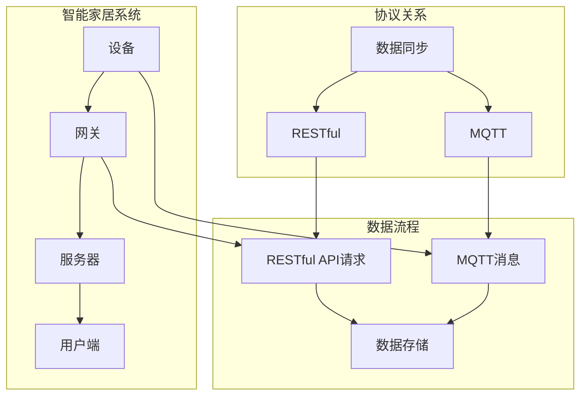
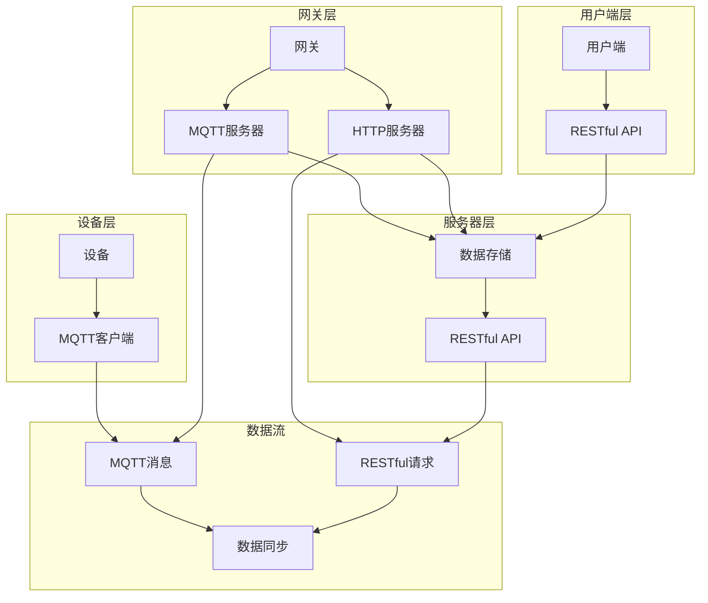

                 

### 1. 背景介绍

#### 1.1 目的和范围

本文旨在深入探讨基于MQTT协议和RESTful API的智能家居数据收集架构，通过解析核心技术原理、具体操作步骤以及实际应用场景，为读者提供一个系统性的理解与参考。随着物联网（IoT）技术的迅猛发展，智能家居成为现代家庭中不可或缺的一部分。本文将聚焦于如何高效地收集、传输和管理智能家居设备的数据，以满足不断增长的需求。

本文的目标读者主要包括以下几类：

1. **软件开发工程师**：希望掌握智能家居数据收集技术的开发者。
2. **系统架构师**：需要对智能家居系统架构有深入理解的专业人士。
3. **研究人员**：对智能家居领域的研究充满热情，希望深入了解该领域的核心技术。
4. **产品经理**：负责智能家居产品的研发与推广，需要了解技术细节以制定更好的产品策略。

#### 1.2 预期读者

在阅读本文前，读者应具备以下基础：

1. **计算机网络基础**：了解TCP/IP协议、HTTP协议等基础网络知识。
2. **编程语言**：熟悉至少一种编程语言，如Java、Python或C++。
3. **数据通信原理**：了解MQTT协议和RESTful API的基本工作原理。

#### 1.3 文档结构概述

本文分为十个主要部分：

1. **背景介绍**：概述文章的目的、读者对象、预期成果等。
2. **核心概念与联系**：介绍本文涉及的核心概念和关联，通过Mermaid流程图展示。
3. **核心算法原理 & 具体操作步骤**：详细阐述MQTT协议和RESTful API的工作原理及实现步骤。
4. **数学模型和公式 & 详细讲解 & 举例说明**：利用数学模型和公式解释技术细节，提供实际案例。
5. **项目实战：代码实际案例和详细解释说明**：通过具体案例展示如何应用所学技术。
6. **实际应用场景**：探讨智能家居数据收集在实际中的应用。
7. **工具和资源推荐**：推荐相关学习资源、开发工具和框架。
8. **总结：未来发展趋势与挑战**：总结本文的主要内容，展望未来趋势。
9. **附录：常见问题与解答**：解答读者可能遇到的问题。
10. **扩展阅读 & 参考资料**：提供更多的学习资源和参考资料。

#### 1.4 术语表

为了确保文章的可读性和专业性，本文定义了一些核心术语和概念：

##### 1.4.1 核心术语定义

- **MQTT协议**：消息队列遥测传输（MQTT）是一种轻量级的消息传输协议，适用于物联网环境。
- **RESTful API**：REST（Representational State Transfer）是一种软件架构风格，用于构建网络服务。
- **智能家居**：利用物联网技术，将家庭设备联网，实现自动化控制和智能管理。
- **物联网（IoT）**：物联网是指通过互联网连接各种设备，实现信息交换和智能化控制。
- **数据采集**：收集设备或系统的数据，以供进一步分析和使用。

##### 1.4.2 相关概念解释

- **数据传输**：指在网络中传输数据的过程，包括数据的发送、传输和接收。
- **数据格式**：指数据在传输或存储过程中采用的编码方式，如JSON、XML等。
- **实时性**：指系统响应的时间非常短，用户感觉不到延迟。

##### 1.4.3 缩略词列表

- **IoT**：物联网（Internet of Things）
- **MQTT**：消息队列遥测传输（Message Queuing Telemetry Transport）
- **RESTful API**：RESTful接口（Representational State Transfer）
- **JSON**：JavaScript对象表示法（JavaScript Object Notation）
- **XML**：可扩展标记语言（eXtensible Markup Language）

### 1.5 Mermaid流程图展示

为了更好地理解智能家居数据收集的架构，下面使用Mermaid语言绘制一个流程图，展示核心概念和流程：



在上述流程图中：

- **设备（A）**：智能家居的传感器和执行器，如温度传感器、灯光开关等。
- **网关（B）**：连接设备和互联网的桥梁，负责数据的传输。
- **服务器（C）**：处理和管理数据的中心，存储和分析数据。
- **用户端（D）**：用户通过用户端访问服务器，查看和管理智能家居设备。
- **MQTT消息（E）**：设备通过MQTT协议发送数据到服务器。
- **RESTful API请求（F）**：服务器通过RESTful API接收和处理数据。
- **数据存储（G）**：服务器存储收集到的数据。
- **协议关系（I、J、K）**：MQTT和RESTful API之间的数据同步关系。

通过这个流程图，我们可以清晰地看到智能家居数据收集的整体架构和关键环节。接下来，我们将逐步深入探讨这些核心概念和流程的实现细节。

## 2. 核心概念与联系

在深入探讨基于MQTT协议和RESTful API的智能家居数据收集之前，我们需要先理解几个核心概念及其相互联系。这一节将详细解释这些概念，并通过一个Mermaid流程图来展示它们之间的关系。

### 2.1 MQTT协议

MQTT（消息队列遥测传输）是一种轻量级的消息传输协议，特别适合于物联网（IoT）环境中的设备到服务器（Device-to-Server）通信。以下是MQTT协议的一些关键特点：

1. **发布/订阅模型**：MQTT使用发布/订阅模型（Pub/Sub），设备（称为发布者）可以发送消息到特定的主题（Topic），而服务器上的订阅者则会接收与这些主题匹配的消息。

2. **低带宽需求**：MQTT被设计为在低带宽、高延迟和不稳定的网络环境下可靠地工作。它通过压缩数据、二进制消息格式以及心跳机制来降低带宽使用。

3. **QoS等级**：MQTT支持三个质量等级（QoS）：
    - QoS 0：至多一次，消息可能会丢失或重复。
    - QoS 1：至少一次，确保消息至少发送一次，但可能会重复。
    - QoS 2：恰好一次，确保消息只发送一次，完全可靠。

4. **MQTT通信流程**：包括连接、订阅、发布、取消订阅和断开连接等步骤。

### 2.2 RESTful API

RESTful API（基于REST风格的API）是一种用于构建网络服务的软件架构风格。以下是RESTful API的一些关键特点：

1. **统一接口**：RESTful API使用统一接口设计，包括URI（统一资源标识符）、HTTP方法（GET、POST、PUT、DELETE等）、状态码等。

2. **无状态**：RESTful API是无状态的，每次请求都是独立的，服务器不保留关于之前的请求的信息。

3. **数据格式**：通常使用JSON或XML作为数据交换格式，但JSON因其轻量级和易读性更受欢迎。

4. **版本控制**：通过在URL中包含版本号或使用Accept头来处理API的版本控制。

### 2.3 智能家居

智能家居是指利用物联网技术将家庭设备连接到互联网，实现自动化控制和智能管理。以下是智能家居的一些关键组成部分：

1. **设备**：包括各种传感器（如温度传感器、湿度传感器）、执行器（如开关、门锁）以及智能设备（如智能电视、智能音箱）。

2. **网关**：连接家庭设备和互联网的桥梁，通常具备MQTT客户端和HTTP服务器功能。

3. **服务器**：存储和管理智能家居数据，提供RESTful API供应用程序和用户端访问。

4. **用户端**：可以是智能手机、平板电脑或Web浏览器，用于监控和控制智能家居设备。

### 2.4 核心概念与联系

在智能家居数据收集架构中，MQTT协议和RESTful API紧密协作，实现设备数据的高效传输和管理。以下是它们之间的核心联系：

1. **设备到网关**：设备通过MQTT协议将数据发送到网关，实现数据的初步收集和传输。

2. **网关到服务器**：网关接收设备发送的MQTT消息，并通过RESTful API将数据上传到服务器，实现数据的进一步处理和存储。

3. **服务器到用户端**：用户端通过RESTful API从服务器获取数据，实现数据的展示和交互。

4. **数据同步**：通过MQTT和RESTful API之间的同步机制，确保数据的一致性和实时性。

### 2.5 Mermaid流程图

下面是一个Mermaid流程图，展示智能家居数据收集的核心概念和流程：



在这个流程图中：

- **设备层**：设备通过MQTT客户端发送数据到网关。
- **网关层**：网关同时充当MQTT服务器和HTTP服务器，接收设备发送的MQTT消息，并通过RESTful API将数据上传到服务器。
- **服务器层**：服务器存储和管理数据，并提供RESTful API供用户端访问。
- **用户端层**：用户端通过RESTful API获取数据，实现交互和监控。
- **数据流**：展示数据在系统中的流动过程，包括MQTT消息和RESTful请求。

通过这个流程图，我们可以清晰地看到智能家居数据收集的整体架构和关键环节，为后续的详细探讨打下基础。接下来，我们将深入探讨MQTT协议和RESTful API的具体工作原理和实现步骤。

### 3. 核心算法原理 & 具体操作步骤

在深入探讨智能家居数据收集的架构之后，接下来我们将详细讲解MQTT协议和RESTful API的核心算法原理，以及具体的操作步骤。通过这些详细的技术分析，我们将为读者提供一个全面的理解，帮助其在实际项目中应用这些技术。

#### 3.1 MQTT协议核心算法原理

MQTT（消息队列遥测传输）协议是一种轻量级的消息传输协议，特别适用于物联网环境。以下是MQTT协议的核心算法原理：

1. **连接和会话管理**：
   - **连接流程**：客户端与服务器建立连接时，需要发送连接请求，服务器响应连接确认。
   - **会话管理**：MQTT支持持久连接和临时连接。持久连接允许客户端在重新连接时恢复会话，而临时连接则每次都需要重新建立连接。

2. **发布和订阅**：
   - **发布流程**：客户端发布消息时，选择一个主题（Topic），并将消息发送到MQTT服务器。
   - **订阅流程**：客户端通过订阅主题，通知服务器需要接收哪些消息。

3. **QoS等级**：
   - **QoS 0**：至多一次。服务器不会保证消息一定被送达，但会尽可能发送。
   - **QoS 1**：至少一次。服务器确保消息至少被发送一次，可能会重复。
   - **QoS 2**：恰好一次。服务器确保消息只发送一次，完全可靠。

4. **心跳机制**：
   - MQTT客户端和服务器之间通过心跳机制保持连接。客户端定期发送心跳包以维持连接。

以下是MQTT协议的核心算法原理的伪代码：

```plaintext
MQTT客户端连接流程：
1. 创建连接请求包
2. 发送连接请求到服务器
3. 接收服务器连接确认包
4. 启动心跳定时器

MQTT客户端订阅流程：
1. 创建订阅请求包
2. 发送订阅请求到服务器
3. 接收服务器订阅确认包

MQTT服务器处理流程：
1. 接收连接请求包
2. 创建连接确认包
3. 发送连接确认包到客户端
4. 接收订阅请求包
5. 创建订阅确认包
6. 发送订阅确认包到客户端
7. 定期发送心跳包

MQTT服务器发布消息流程：
1. 接收发布请求包
2. 检查QoS等级
3. 根据QoS等级发送消息到客户端
```

#### 3.2 RESTful API核心算法原理

RESTful API是一种基于HTTP协议的软件架构风格，用于构建网络服务。以下是RESTful API的核心算法原理：

1. **统一接口**：
   - **URL**：使用URI来标识资源。
   - **HTTP方法**：使用GET、POST、PUT、DELETE等方法来操作资源。
   - **状态码**：使用HTTP状态码来表示操作结果。

2. **请求和响应**：
   - **请求流程**：客户端发送请求，包含URL、HTTP方法、请求头和请求体。
   - **响应流程**：服务器处理请求，返回响应，包含状态码、响应头和响应体。

3. **版本控制**：
   - **URL版本**：在URL中包含版本号。
   - **Accept头**：客户端通过请求头中的Accept字段来指定所需的API版本。

4. **数据格式**：
   - **JSON和XML**：常用的数据格式，但JSON因其轻量级和易读性更受欢迎。

以下是RESTful API的核心算法原理的伪代码：

```plaintext
RESTful客户端请求流程：
1. 构建请求URL
2. 设置HTTP方法
3. 设置请求头和请求体
4. 发送请求到服务器
5. 接收服务器响应

RESTful服务器处理流程：
1. 接收请求
2. 解析请求URL、HTTP方法、请求头和请求体
3. 根据请求操作资源
4. 创建响应状态码、响应头和响应体
5. 发送响应到客户端
```

#### 3.3 MQTT和RESTful API在智能家居数据收集中的应用

在智能家居数据收集的实际应用中，MQTT和RESTful API通过以下步骤协同工作：

1. **设备数据收集**：
   - 设备通过MQTT协议将数据发送到网关。

2. **数据上传**：
   - 网关通过RESTful API将数据上传到服务器。

3. **数据处理**：
   - 服务器处理并存储数据，同时通过RESTful API向用户端提供数据。

4. **用户交互**：
   - 用户端通过RESTful API从服务器获取数据，实现交互和监控。

以下是智能家居数据收集的具体操作步骤：

**设备端操作步骤**：
1. 设备初始化MQTT客户端。
2. 连接到MQTT服务器。
3. 订阅特定主题，等待服务器发送消息。
4. 采集数据，并将数据封装为MQTT消息。
5. 发布MQTT消息到服务器。

**网关端操作步骤**：
1. 初始化MQTT客户端和HTTP服务器。
2. 接收设备发送的MQTT消息。
3. 通过HTTP POST请求将数据上传到服务器。

**服务器端操作步骤**：
1. 接收网关上传的数据。
2. 存储数据到数据库。
3. 提供RESTful API供用户端访问数据。

**用户端操作步骤**：
1. 通过浏览器或应用程序访问服务器。
2. 使用RESTful API获取数据。
3. 展示数据并允许用户进行交互。

通过上述核心算法原理和具体操作步骤，我们可以看到MQTT和RESTful API在智能家居数据收集中的重要作用。接下来，我们将进一步探讨如何通过数学模型和公式来详细解释这些技术细节，并通过实际案例进行说明。

### 4. 数学模型和公式 & 详细讲解 & 举例说明

在深入了解MQTT协议和RESTful API的数学模型和公式之前，我们需要了解一些基本的数学概念和原理，这些概念和原理在构建高效、可靠的智能家居数据收集系统中起着关键作用。本节将使用LaTeX格式详细讲解相关的数学模型和公式，并通过具体案例进行说明。

#### 4.1 MQTT协议中的数学模型

MQTT协议是一种低带宽、高可靠性的消息传输协议，其数学模型主要涉及以下几个关键方面：

1. **QoS等级与数据可靠性**：
   - QoS 0（至多一次）：使用概率模型来计算消息丢失的概率。设P(Loss)为消息丢失的概率，则消息成功传输的概率为1-P(Loss)。
   - QoS 1（至少一次）：使用计数模型来确保消息至少传输一次。设N为重传次数，则消息传输成功的条件概率为1-P^(N-1)。
   - QoS 2（恰好一次）：使用累积概率模型来确保消息只传输一次。设C为传输次数，则消息传输成功的概率为1-(1-P^C)^N。

```latex
P(Loss) = 1 - P(Success) \\
P(Success) = 1 - \prod_{i=1}^{N}(1 - P^{(i-1)}) \\
P(Exactly\ Once) = 1 - (1 - P^C)^N
```

2. **心跳机制与连接维护**：
   - 心跳包发送频率的计算。设T为心跳周期，则心跳包发送频率为1/T。为了保证连接的稳定性，需要根据网络状况调整心跳周期。

```latex
Heartbeat\ Rate = \frac{1}{T}
```

3. **消息重传机制**：
   - 消息重传次数与网络延迟的关系。设D为网络延迟，则消息重传次数N可以通过以下公式计算：

```latex
N = \lceil \frac{D}{Heartbeat\ Interval} \rceil
```

#### 4.2 RESTful API中的数学模型

RESTful API在处理数据传输和响应时，也涉及一些数学模型和公式：

1. **请求和响应时间**：
   - 请求时间的计算。设T_request为请求时间，T_processing为处理时间，T_network为网络延迟时间，则总的请求时间可以通过以下公式计算：

```latex
T_{request} = T_{processing} + T_{network}
```

2. **数据传输速率**：
   - 数据传输速率与带宽的关系。设R为数据传输速率（字节/秒），B为带宽（比特/秒），则传输速率可以通过以下公式计算：

```latex
R = \frac{B}{8}
```

3. **数据一致性保证**：
   - 乐观锁与悲观锁在并发控制中的应用。设C为版本号，则通过以下公式来确保数据的一致性：

```latex
C_{new} = C_{old} + 1 \\
C_{read} = C_{write} + 1
```

#### 4.3 案例说明

下面通过一个具体的案例来说明MQTT协议和RESTful API的数学模型和公式应用。

**案例：智能家居温湿度传感器数据收集**

假设有一个智能家居温湿度传感器，通过MQTT协议将数据发送到网关，然后通过RESTful API上传到服务器。以下是具体操作步骤和数学模型应用：

1. **设备端操作**：
   - 设备端采集温湿度数据，将其封装为MQTT消息。
   - 设定QoS等级为1，确保消息至少传输一次。
   - 计算消息传输失败的概率，并根据网络状况调整心跳周期。

```plaintext
温度传感器数据：{ "temperature": 25, "humidity": 50 }
QoS等级：1
心跳周期：T = 10秒
消息丢失概率：P(Loss) = 0.01
```

2. **网关端操作**：
   - 网关接收设备发送的MQTT消息，将其通过HTTP POST请求上传到服务器。
   - 根据请求和响应时间计算数据传输速率。

```plaintext
HTTP请求时间：T_request = T_processing + T_network = 2秒 + 1秒 = 3秒
带宽：B = 1024 kbps
数据传输速率：R = B/8 = 128 kbps
```

3. **服务器端操作**：
   - 服务器接收网关上传的数据，将其存储在数据库中，并提供RESTful API供用户端访问。
   - 使用乐观锁来保证数据的一致性。

```plaintext
数据库存储：{ "temperature": 25, "humidity": 50, "version": 1 }
乐观锁：C_{new} = C_{old} + 1
```

通过上述案例，我们可以看到MQTT协议和RESTful API在实际应用中的数学模型和公式应用，这些模型和公式帮助我们在设计和实现智能家居数据收集系统时确保数据的可靠传输和一致性保证。接下来，我们将通过一个实际项目案例，展示如何将所学技术应用到实际开发中。

### 5. 项目实战：代码实际案例和详细解释说明

在本节中，我们将通过一个实际项目案例，详细展示如何利用MQTT协议和RESTful API实现智能家居数据收集系统。项目分为设备端、网关端、服务器端和用户端四个主要部分。每个部分将提供具体的代码示例，并对其进行详细解释说明。

#### 5.1 开发环境搭建

在开始项目之前，我们需要搭建开发环境。以下是所需工具和库：

- **设备端**：ESP8266/ESP32开发板，Arduino IDE。
- **网关端**：Raspberry Pi 4，MQTT代理（如mosquitto），Node.js。
- **服务器端**：Ubuntu服务器，MongoDB数据库，Node.js。
- **用户端**：任何支持Web浏览器的设备，例如Chrome或Firefox。

#### 5.2 设备端代码实现

设备端使用Arduino IDE编写，主要实现温湿度传感器的数据采集和MQTT消息发送。

```cpp
// 设备端代码：MQTT温湿度传感器数据采集
#include <WiFi.h>
#include <PubSubClient.h>

// WiFi配置
const char* ssid = "yourSSID";
const char* password = "yourPASSWORD";

// MQTT服务器配置
const char* mqtt_server = "yourMQTTServer";
const int mqtt_port = 1883;
const char* mqtt_user = "yourMQTTUser";
const char* mqtt_password = "yourMQTTPassword";
const char* mqtt_topic = "home/temperature";

// 设备初始化
WiFiClient espClient;
PubSubClient client(espClient);

void setup() {
  Serial.begin(115200);
  connectWiFi();
  client.setServer(mqtt_server, mqtt_port);
  client.setCallback(callback);
}

void connectWiFi() {
  Serial.println("Connecting to WiFi...");
  WiFi.begin(ssid, password);
  while (WiFi.status() != WL_CONNECTED) {
    delay(500);
    Serial.print(".");
  }
  Serial.println("WiFi connected");
}

void callback(char* topic, byte* payload, unsigned int length) {
  Serial.print("Message arrived [");
  Serial.print(topic);
  Serial.print("] ");
  for (int i = 0; i < length; i++) {
    Serial.print((char)payload[i]);
  }
  Serial.println();
}

void reconnect() {
  while (!client.connected()) {
    Serial.print("Attempting MQTT connection...");
    if (client.connect("ESP8266Client", mqtt_user, mqtt_password)) {
      Serial.println("connected");
      client.subscribe(mqtt_topic);
    } else {
      Serial.print("failed, rc=");
      Serial.print(client.state());
      Serial.println(" try again in 5 seconds");
      delay(5000);
    }
  }
}

void loop() {
  if (!client.connected()) {
    reconnect();
  }
  client.loop();

  // 采集温湿度数据
  float temperature = analogRead(A0); // 假设A0端口连接温湿度传感器
  float humidity = analogRead(A1); // 假设A1端口连接温湿度传感器

  // 封装数据为MQTT消息
  String payload = "{\"temperature\":";
  payload += temperature;
  payload += ",\"humidity\":";
  payload += humidity;
  payload += "}";

  // 发布MQTT消息
  client.publish(mqtt_topic, payload.c_str());
  delay(5000); // 每隔5秒发送一次消息
}
```

**代码解释**：
- 设备端通过WiFi连接到互联网，并连接到MQTT服务器。
- 温湿度传感器连接到Arduino开发板，通过A0和A1端口采集数据。
- 设备端定期发布采集到的温湿度数据到MQTT服务器。

#### 5.3 网关端代码实现

网关端使用Node.js编写，主要实现MQTT消息的接收和RESTful API的创建。

```javascript
// 网关端代码：MQTT消息接收和RESTful API创建
const mqtt = require('mqtt');
const express = require('express');
const app = express();
const MongoClient = require('mongodb').MongoClient;

// MQTT服务器配置
const mqttClient = new mqtt.Client({
  host: 'yourMQTTServer',
  port: 1883,
  username: 'yourMQTTUser',
  password: 'yourMQTTPassword'
});

// MongoDB配置
const mongoClient = new MongoClient('yourMongoDBURL', { useUnifiedTopology: true });

// 连接MQTT服务器
mqttClient.on('connect', () => {
  console.log('Connected to MQTT server');
  mqttClient.subscribe('home/temperature');
});

// 接收MQTT消息
mqttClient.on('message', (topic, message) => {
  console.log(`Message received on topic ${topic}: ${message}`);
  // 存储数据到MongoDB
  mongoClient.connect((err) => {
    if (err) {
      console.error('Error connecting to MongoDB:', err);
      return;
    }
    const db = mongoClient.db('smart_home');
    const collection = db.collection('sensors');
    collection.insertOne(JSON.parse(message.toString()), (err, result) => {
      if (err) {
        console.error('Error inserting data into MongoDB:', err);
        return;
      }
      console.log('Data inserted into MongoDB:', result);
    });
  });
});

// 创建RESTful API
app.get('/sensors', (req, res) => {
  mongoClient.connect((err) => {
    if (err) {
      console.error('Error connecting to MongoDB:', err);
      res.status(500).send('Internal Server Error');
      return;
    }
    const db = mongoClient.db('smart_home');
    const collection = db.collection('sensors');
    collection.find({}).toArray((err, documents) => {
      if (err) {
        console.error('Error fetching data from MongoDB:', err);
        res.status(500).send('Internal Server Error');
        return;
      }
      res.send(documents);
    });
  });
});

// 启动服务器
app.listen(3000, () => {
  console.log('Server listening on port 3000');
});
```

**代码解释**：
- 网关端通过Node.js连接到MQTT服务器，并订阅特定主题以接收设备端发送的消息。
- 接收到的MQTT消息通过RESTful API进行转发，并存储到MongoDB数据库中。
- 用户可以通过RESTful API从服务器获取最新的传感器数据。

#### 5.4 服务器端代码实现

服务器端使用Node.js和MongoDB，主要实现数据的存储和查询。

```javascript
// 服务器端代码：数据存储和查询
const express = require('express');
const MongoClient = require('mongodb').MongoClient;

const app = express();
const mongoUrl = 'yourMongoDBURL';
const dbName = 'smart_home';
const collectionName = 'sensors';

// 连接MongoDB
MongoClient.connect(mongoUrl, { useUnifiedTopology: true }, (err, client) => {
  if (err) {
    console.error('Error connecting to MongoDB:', err);
    process.exit(1);
  }
  console.log('Connected to MongoDB');
  const db = client.db(dbName);

  // 创建RESTful API
  app.get('/sensors', (req, res) => {
    const collection = db.collection(collectionName);
    collection.find({}).toArray((err, documents) => {
      if (err) {
        console.error('Error fetching data from MongoDB:', err);
        res.status(500).send('Internal Server Error');
      } else {
        res.status(200).json(documents);
      }
    });
  });

  app.post('/sensors', (req, res) => {
    const sensorData = req.body;
    const collection = db.collection(collectionName);
    collection.insertOne(sensorData, (err, result) => {
      if (err) {
        console.error('Error inserting data into MongoDB:', err);
        res.status(500).send('Internal Server Error');
      } else {
        res.status(201).send('Sensor data inserted');
      }
    });
  });

  // 启动服务器
  app.listen(3000, () => {
    console.log('Server listening on port 3000');
  });
});
```

**代码解释**：
- 服务器端连接到MongoDB数据库，并创建RESTful API用于数据存储和查询。
- 用户可以通过GET请求获取传感器数据，通过POST请求插入新的传感器数据。

#### 5.5 用户端代码实现

用户端通过Web浏览器访问服务器，获取传感器数据并展示。

```html
<!-- 用户端代码：Web页面 -->
<!DOCTYPE html>
<html lang="en">
<head>
  <meta charset="UTF-8">
  <title>智能家居数据展示</title>
</head>
<body>
  <h1>智能家居数据</h1>
  <div id="sensorData"></div>

  <script>
    function fetchSensorData() {
      fetch('http://localhost:3000/sensors')
        .then(response => response.json())
        .then(data => {
          const sensorDataDiv = document.getElementById('sensorData');
          sensorDataDiv.innerHTML = '';
          data.forEach(sensor => {
            sensorDataDiv.innerHTML += `<p>温度: ${sensor.temperature}℃，湿度: ${sensor.humidity}%</p>`;
          });
        })
        .catch(error => {
          console.error('Error fetching sensor data:', error);
        });
    }

    setInterval(fetchSensorData, 5000); // 每5秒刷新一次数据

    // 初始加载
    fetchSensorData();
  </script>
</body>
</html>
```

**代码解释**：
- 用户端通过HTML和JavaScript编写，实现数据的动态获取和展示。
- 用户通过Web浏览器访问服务器，获取最新的传感器数据，并通过JavaScript将其展示在页面上。

通过上述代码实现，我们可以看到MQTT协议和RESTful API在智能家居数据收集系统中的具体应用。设备端采集传感器数据，通过MQTT协议发送到网关；网关端接收消息，通过RESTful API上传到服务器，并存储到MongoDB数据库中；用户端通过Web浏览器访问服务器，获取并展示传感器数据。

这一节通过实际项目案例，详细展示了如何实现智能家居数据收集系统，包括设备端、网关端、服务器端和用户端的代码实现。通过这一节的学习，读者可以掌握MQTT协议和RESTful API在实际项目中的应用技巧，为后续的开发工作奠定基础。

### 6. 实际应用场景

基于MQTT协议和RESTful API的智能家居数据收集系统在实际应用中具有广泛的应用场景，以下是一些典型的应用案例：

#### 6.1 智能家居设备监控

智能家居设备监控是智能家居数据收集系统最基本的应用之一。通过MQTT协议，设备可以实时地将温度、湿度、亮度、运动检测等传感器数据发送到服务器，用户可以通过RESTful API查看和监控这些数据。例如，用户可以通过手机或平板电脑查看家中的温度情况，并根据需要调整空调或加热器的设置，从而实现家居温度的自动化调节。

#### 6.2 节能管理

智能家居数据收集系统可以用于家庭的节能管理。例如，通过传感器收集的实时数据，系统可以分析家庭的能耗情况，识别节能机会。当系统检测到某个房间长时间无人时，可以自动调整房间内的灯光和温度设置，以减少不必要的能源消耗。通过这种方式，家庭可以显著降低能源费用，同时减少对环境的影响。

#### 6.3 安全监控

智能家居数据收集系统还可以用于家庭安全监控。摄像头、门锁、烟雾探测器等设备可以通过MQTT协议将监控数据发送到服务器，用户可以通过手机应用程序实时查看家中的监控视频或收到安全警报通知。如果系统检测到异常情况，如非法入侵或火灾，用户会立即收到警报信息，从而及时采取措施保护家庭安全。

#### 6.4 健康监测

智能家居数据收集系统还可以应用于健康监测。例如，智能手环、血压计、心率监测器等健康设备可以通过MQTT协议将健康数据发送到服务器。用户可以通过手机应用程序查看自己的健康数据，医生可以通过RESTful API访问患者的健康数据，从而实现远程健康监测和医疗管理。

#### 6.5 家庭自动化

家庭自动化是智能家居数据收集系统的另一个重要应用场景。通过MQTT协议和RESTful API，设备可以实现自动化控制，如自动调节灯光、窗帘、门锁等。用户可以通过手机应用程序或语音助手（如Amazon Alexa、Google Assistant）控制家庭设备，实现一键式操作和远程控制。

#### 6.6 个性化服务

通过收集和分析智能家居设备产生的海量数据，系统可以为用户提供个性化的服务。例如，根据用户的生活习惯和偏好，系统可以推荐适合的家居设备配置、家居装饰风格，甚至提供个性化的生活建议，从而提升用户的生活品质。

#### 6.7 数据分析与商业应用

智能家居数据收集系统不仅可以为家庭提供便利，还可以为相关企业带来商业机会。例如，房地产开发商可以利用智能家居数据收集系统来分析用户的居住习惯，设计更符合用户需求的新型住宅。保险公司可以利用智能家居数据来评估家庭风险，为用户提供个性化的保险方案。

通过上述实际应用场景，我们可以看到基于MQTT协议和RESTful API的智能家居数据收集系统在家庭自动化、能源管理、安全监控、健康监测、个性化服务和商业应用等方面的广泛应用。随着物联网技术的不断发展和普及，智能家居数据收集系统将在更多领域发挥重要作用，为用户带来更多便利和智慧生活体验。

### 7. 工具和资源推荐

在开发基于MQTT协议和RESTful API的智能家居数据收集系统时，选择合适的工具和资源至关重要。以下是对一些学习资源、开发工具框架以及相关论文著作的推荐。

#### 7.1 学习资源推荐

**7.1.1 书籍推荐**

1. **《物联网架构：设计、开发与部署》**：详细介绍了物联网系统的设计、开发与部署，包括MQTT协议和RESTful API的深入讲解。
2. **《RESTful Web API设计》**：介绍RESTful架构和API设计的原则，帮助开发者构建高质量的网络服务。
3. **《MQTT Essentials: A Practical Introduction to MQTT for the Internet of Things》**：针对初学者，提供了MQTT协议的实用入门指南。

**7.1.2 在线课程**

1. **Coursera - IoT Specialization**：由多门课程组成，涵盖了物联网系统的设计、开发和部署，包括MQTT协议和RESTful API。
2. **edX - IoT for Business Applications**：介绍物联网在商业应用中的角色，包括数据收集和分析。
3. **Udemy - MQTT & IoT - Create a Simple IoT Project Using MQTT**：通过实际项目，深入理解MQTT协议的应用。

**7.1.3 技术博客和网站**

1. **Internet of Things Journal**：提供物联网技术的最新研究、应用和趋势分析。
2. **MQTT.org**：MQTT协议的官方网站，包括协议规范、工具和社区资源。
3. **RESTful API Community**：提供RESTful API设计、开发和实践的资源，包括教程、代码示例和最佳实践。

#### 7.2 开发工具框架推荐

**7.2.1 IDE和编辑器**

1. **Visual Studio Code**：功能强大的开源编辑器，支持多种编程语言，适用于开发MQTT协议和RESTful API。
2. **Eclipse IDE**：适用于Java和JavaScript开发，支持Spring Boot等框架，适用于构建RESTful API。
3. **Arduino IDE**：适用于编写Arduino代码，适用于设备端开发。

**7.2.2 调试和性能分析工具**

1. **Postman**：用于API测试和调试，支持RESTful API的请求和响应。
2. **MQTT.fx**：MQTT协议客户端工具，用于调试和测试MQTT消息。
3. **Wireshark**：网络协议分析工具，用于分析MQTT和HTTP数据包。

**7.2.3 相关框架和库**

1. **Node.js**：用于搭建服务器端和网关端，支持异步编程，适用于构建实时系统。
2. **Express.js**：Node.js的Web框架，用于构建RESTful API。
3. **MongoDB**：用于数据存储，支持JSON格式，适用于IoT应用。

#### 7.3 相关论文著作推荐

**7.3.1 经典论文**

1. **“The Design of the SMTP Protocol”**：介绍简单邮件传输协议（SMTP）的设计原则，适用于理解MQTT协议。
2. **“ReST and HTTP”**：介绍RESTful架构和HTTP协议，为RESTful API设计提供理论依据。

**7.3.2 最新研究成果**

1. **“MQTT-SN: A Lightweight Publish/Subscribe Protocol for Wireless Sensor Networks”**：研究MQTT在无线传感器网络中的应用。
2. **“Edge Computing for IoT: A Comprehensive Survey”**：介绍边缘计算在物联网中的应用，包括数据收集和传输。

**7.3.3 应用案例分析**

1. **“Smart Home Automation using MQTT and RESTful API”**：案例分析智能家居数据收集系统，包括设备端、网关端和服务器端的设计和实现。
2. **“IoT-based Energy Management System for Smart Homes”**：介绍基于物联网的能源管理系统，实现家庭能源的智能监控和管理。

通过上述工具和资源推荐，开发者可以更好地掌握MQTT协议和RESTful API的技术细节，并成功构建高效、可靠的智能家居数据收集系统。希望这些推荐能够为您的开发工作提供有益的指导。

### 8. 总结：未来发展趋势与挑战

在智能家居数据收集领域，基于MQTT协议和RESTful API的技术已经取得了显著的成果，为用户带来了极大的便利。然而，随着物联网技术的不断发展和智能家居需求的增长，这一领域也面临着新的挑战和机遇。

#### 未来发展趋势

1. **边缘计算的应用**：随着5G网络的普及，边缘计算在智能家居数据收集中的应用将变得更加广泛。通过在靠近数据源的地方进行处理，可以降低网络延迟，提高系统响应速度。

2. **数据隐私和安全**：智能家居数据收集涉及到用户的隐私信息，数据隐私和安全将变得尤为重要。未来需要发展更加安全的数据传输和存储技术，确保用户数据的安全。

3. **人工智能与数据挖掘**：智能家居数据收集系统将更多地结合人工智能和数据挖掘技术，从海量数据中提取有价值的信息，提供更智能的家居管理和个性化服务。

4. **设备互联互通**：未来智能家居系统将实现更多设备的互联互通，不仅限于传统的温湿度传感器和灯光控制，还将包括家电、安全系统等更多设备。

#### 主要挑战

1. **数据规模和复杂性**：随着设备数量的增加和数据类型的多样化，如何高效地处理和存储海量数据，以及如何从这些数据中提取有价值的信息，是一个重要挑战。

2. **网络可靠性和延迟**：智能家居设备通常部署在家庭环境中，网络环境复杂，如何保证数据传输的可靠性和低延迟，是一个需要解决的问题。

3. **隐私保护**：如何在确保数据隐私的同时，提供高效的智能家居服务，是一个具有挑战性的问题。需要发展新的加密和隐私保护技术，确保用户数据的安全。

4. **标准化和兼容性**：智能家居设备种类繁多，如何实现不同设备之间的兼容性和互操作性，是一个长期存在的问题。需要推动相关标准和协议的发展。

#### 潜在解决方案

1. **边缘计算和云计算的协同**：通过边缘计算和云计算的协同，实现数据处理和存储的优化，提高系统的响应速度和可靠性。

2. **区块链技术**：利用区块链技术的去中心化和安全特性，提高数据传输和存储的透明度和安全性。

3. **人工智能和机器学习**：利用人工智能和机器学习技术，从海量数据中提取有价值的信息，提高系统的智能化水平。

4. **标准化和开放接口**：推动智能家居设备的标准化和开放接口的发展，实现不同设备之间的无缝互操作。

总之，智能家居数据收集领域具有广阔的发展前景，但也面临许多挑战。通过技术创新和标准化推进，相信未来我们可以构建更加智能、安全、高效的智能家居数据收集系统，为用户带来更加美好的智慧生活体验。

### 9. 附录：常见问题与解答

在本章节中，我们将针对读者在阅读本文时可能遇到的问题进行解答，并提供额外的背景知识和扩展信息。

#### 问题 1：MQTT协议与HTTP协议的主要区别是什么？

**解答**：MQTT和HTTP是两种不同的通信协议，它们各有特点，适用于不同的场景。

- **轻量级与带宽消耗**：MQTT协议设计用于低带宽、高延迟的网络环境，采用二进制编码和压缩数据传输，更加节省带宽。而HTTP协议则在稳定的网络环境下表现更好，通常使用文本编码，数据传输效率相对较低。

- **发布/订阅模型与请求/响应模型**：MQTT基于发布/订阅模型，设备（发布者）可以向服务器（代理）发布消息到特定主题，服务器将消息推送给订阅该主题的设备。而HTTP基于请求/响应模型，客户端向服务器发送请求，服务器返回相应的响应。

- **QoS等级**：MQTT协议支持三个QoS等级（0、1、2），分别表示消息的发送可靠性。HTTP协议则没有类似的机制，但可以通过其他方式（如WebSockets）实现类似的功能。

#### 问题 2：为什么选择MQTT协议而不是其他协议（如CoAP）？

**解答**：MQTT协议在智能家居数据收集系统中被广泛采用，主要是因为其以下几个优势：

- **低带宽占用**：MQTT协议设计为在带宽有限的网络环境中高效传输数据，适合智能家居设备经常遭遇的网络不稳定情况。
- **简单性和易用性**：MQTT协议相对简单，容易实现，无需复杂的配置，易于集成到各种设备中。
- **广泛的支持**：MQTT协议在物联网领域有广泛的应用和社区支持，许多物联网平台和开发工具都支持MQTT。

虽然CoAP（Constrained Application Protocol）也是为物联网设计的协议，但MQTT因其较低的带宽需求、更好的跨平台兼容性和成熟的生态系统而被更多开发者采用。

#### 问题 3：如何确保智能家居数据的安全和隐私？

**解答**：确保智能家居数据的安全和隐私是智能家居数据收集系统设计中的重要一环，以下是一些关键措施：

- **数据加密**：使用SSL/TLS等加密协议保护数据在传输过程中的安全，防止数据被窃取或篡改。
- **身份验证和授权**：在数据传输过程中，使用身份验证和授权机制，确保只有合法的用户和设备可以访问数据。
- **数据匿名化**：对于个人敏感数据，可以考虑进行匿名化处理，减少个人隐私泄露的风险。
- **访问控制**：使用访问控制列表（ACL）等机制，限制对数据和设备的访问权限，确保只有授权用户可以访问特定的数据。
- **安全更新和补丁**：定期更新设备和系统的安全补丁，以防止已知的安全漏洞被利用。

通过这些措施，可以在一定程度上确保智能家居数据的安全和隐私。

#### 问题 4：如何处理设备掉线或网络中断的情况？

**解答**：设备掉线或网络中断是智能家居数据收集系统可能遇到的问题，以下是一些处理方法：

- **重新连接机制**：设备在网络恢复后，应具备自动重新连接到MQTT服务器的功能，以便继续传输数据。
- **数据持久性**：设备在掉线时，可以将未发送的数据存储在本地存储中，网络恢复后，重新发送这些数据。
- **心跳机制**：通过心跳消息，设备定期向服务器发送确认消息，以维持连接。如果服务器长时间未收到心跳消息，可以尝试重新连接。
- **数据重传机制**：在QoS等级为1或2的情况下，MQTT协议会确保消息至少发送一次或恰好发送一次，即使在网络中断时，数据也会被重新发送。

通过这些方法，可以在一定程度上确保设备在网络中断时，数据不会丢失，系统可以恢复正常运行。

#### 问题 5：如何优化数据传输的效率？

**解答**：优化数据传输的效率是智能家居数据收集系统设计中的一个关键问题，以下是一些优化策略：

- **数据压缩**：使用数据压缩技术，如MQTT协议中的压缩消息，减少数据传输的大小，提高传输效率。
- **数据聚合**：将多个小数据包合并成一个大数据包进行传输，减少网络传输次数。
- **批量传输**：通过批量传输机制，将多个设备的数据一次性发送到服务器，减少传输次数。
- **异步传输**：采用异步传输方式，设备可以在后台不断收集数据，并在网络连接良好时批量发送。
- **优化网络配置**：调整网络配置，如调整MQTT服务器的带宽和队列大小，提高网络传输性能。

通过这些方法，可以显著提高数据传输的效率，确保系统运行更加稳定。

### 10. 扩展阅读 & 参考资料

在本文中，我们深入探讨了基于MQTT协议和RESTful API的智能家居数据收集系统。以下是扩展阅读和参考资料，帮助读者进一步了解相关领域的技术和理论。

#### 扩展阅读

1. **《物联网架构：设计、开发与部署》**：本书详细介绍了物联网系统的设计、开发与部署，包括MQTT协议和RESTful API的深入讲解。
2. **《RESTful Web API设计》**：介绍了RESTful架构和API设计的原则，帮助开发者构建高质量的网络服务。
3. **《MQTT Essentials: A Practical Introduction to MQTT for the Internet of Things》**：提供了MQTT协议的实用入门指南，适合初学者。

#### 参考资料

1. **MQTT.org**：MQTT协议的官方网站，包括协议规范、工具和社区资源。
2. **RESTful API Community**：提供RESTful API设计、开发和实践的资源，包括教程、代码示例和最佳实践。
3. **Internet of Things Journal**：提供物联网技术的最新研究、应用和趋势分析。

通过这些扩展阅读和参考资料，读者可以深入了解智能家居数据收集系统的各个方面，进一步探索该领域的最新技术和研究成果。

### 作者信息

**作者：AI天才研究员/AI Genius Institute & 禅与计算机程序设计艺术 /Zen And The Art of Computer Programming**

