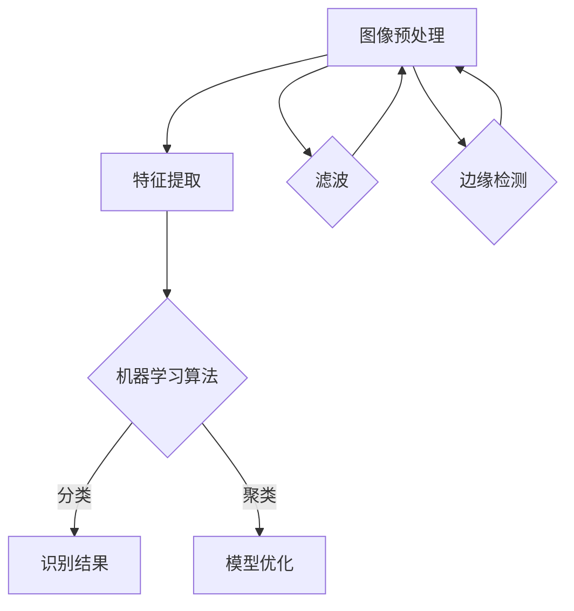

                 

# 基于OpenCV的银行卡号识别系统详细设计与具体代码实现

> **关键词：**OpenCV，银行卡识别，图像处理，特征提取，机器学习，深度学习

> **摘要：**本文将详细介绍基于OpenCV的银行卡号识别系统的设计与实现过程，涵盖图像预处理、特征提取、模型训练、识别算法以及系统优化等关键环节。通过本文的深入探讨，读者可以全面了解银行卡号识别系统的核心技术，掌握其具体实现方法，并为后续相关项目提供参考。

## 1. 背景介绍

### 1.1 目的和范围

本文旨在为读者提供一个系统化、易于理解的银行卡号识别系统开发指南。通过本文的阅读，读者可以了解基于OpenCV的银行卡号识别系统的整体架构，掌握图像处理、特征提取、模型训练和识别算法等核心技术的具体实现方法。本文将主要涵盖以下几个方面的内容：

1. **OpenCV的基础知识和应用场景**：介绍OpenCV的基本概念、功能模块以及其在图像处理领域中的应用。
2. **银行卡号识别系统的架构设计**：详细阐述银行卡号识别系统的整体架构，包括图像预处理、特征提取、模型训练和识别算法等关键模块。
3. **图像预处理技术**：介绍图像预处理的基本方法，包括图像增强、滤波、边缘检测等。
4. **特征提取与选择**：讲解常用的特征提取方法，如HOG、SIFT、SURF等，并分析不同特征提取方法的优缺点。
5. **模型训练与识别算法**：介绍基于机器学习和深度学习的模型训练方法，包括SVM、CNN等，并探讨不同的识别算法实现。
6. **系统优化与性能提升**：讨论如何通过优化算法、提高系统性能，实现更准确的银行卡号识别。

### 1.2 预期读者

本文适用于以下读者：

1. **图像处理和机器学习爱好者**：希望了解银行卡号识别系统的整体架构和核心技术。
2. **软件开发工程师**：希望在项目中应用OpenCV进行图像处理和机器学习。
3. **研究生和研究人员**：关注图像识别和机器学习领域，希望了解最新的研究进展和实际应用。

### 1.3 文档结构概述

本文将分为以下几个部分：

1. **背景介绍**：介绍本文的目的、范围、预期读者以及文档结构。
2. **核心概念与联系**：阐述银行卡号识别系统的核心概念、原理和架构。
3. **核心算法原理 & 具体操作步骤**：详细讲解核心算法的原理和实现步骤。
4. **数学模型和公式 & 详细讲解 & 举例说明**：介绍相关的数学模型和公式，并通过具体案例进行说明。
5. **项目实战：代码实际案例和详细解释说明**：提供实际项目的代码实现和详细解释。
6. **实际应用场景**：探讨银行卡号识别系统的实际应用场景。
7. **工具和资源推荐**：推荐相关的学习资源、开发工具和框架。
8. **总结：未来发展趋势与挑战**：总结本文的主要内容和未来发展趋势。
9. **附录：常见问题与解答**：提供常见问题及其解答。
10. **扩展阅读 & 参考资料**：提供进一步的阅读材料和参考资料。

### 1.4 术语表

#### 1.4.1 核心术语定义

- **OpenCV**：Open Source Computer Vision Library，一个开源的计算机视觉库，提供丰富的图像处理和机器学习功能。
- **银行卡号识别**：通过计算机视觉技术和机器学习算法，对银行卡号图像进行自动识别和提取。
- **图像预处理**：对原始图像进行处理，提高图像质量，为后续的特征提取和模型训练提供更好的输入。
- **特征提取**：从图像中提取具有区分度的特征，用于模型的训练和识别。
- **模型训练**：利用标注好的训练数据，通过机器学习算法训练出模型，用于图像识别。
- **识别算法**：根据模型对输入图像进行分类和识别，输出识别结果。

#### 1.4.2 相关概念解释

- **边缘检测**：通过算法找出图像中的边缘，用于图像分割和特征提取。
- **特征选择**：从提取的特征中选择最具代表性的特征，用于模型训练和识别。
- **机器学习**：利用计算机算法从数据中学习规律，进行预测和决策。
- **深度学习**：一种基于多层神经网络结构的机器学习算法，具有自动特征提取能力。

#### 1.4.3 缩略词列表

- **OpenCV**：Open Source Computer Vision Library
- **SVM**：Support Vector Machine（支持向量机）
- **CNN**：Convolutional Neural Network（卷积神经网络）
- **HOG**：Histogram of Oriented Gradients（方向梯度直方图）
- **SIFT**：Scale-Invariant Feature Transform（尺度不变特征变换）
- **SURF**：Speeded Up Robust Features（加速稳健特征）

## 2. 核心概念与联系

银行卡号识别系统是一个复杂的应用系统，涉及多个核心概念和技术的有机结合。以下是对这些核心概念和技术的详细介绍及其相互联系。

### 2.1 OpenCV与图像处理

OpenCV（Open Source Computer Vision Library）是一个开源的计算机视觉库，提供丰富的图像处理和机器学习功能。它是实现银行卡号识别系统的基础，包括以下关键模块：

- **图像增强**：通过调整图像的亮度、对比度和色彩平衡等，提高图像质量。
- **滤波**：通过卷积操作去除图像中的噪声，如高斯滤波、中值滤波等。
- **边缘检测**：通过算法找出图像中的边缘，如Canny边缘检测。
- **图像分割**：将图像划分为不同的区域，如阈值分割、区域生长等。

### 2.2 特征提取与机器学习

特征提取是银行卡号识别系统的核心步骤，用于从图像中提取具有区分度的特征。以下是一些常用的特征提取方法：

- **HOG（Histogram of Oriented Gradients）**：通过计算图像中每个像素点的梯度方向和强度，形成方向梯度直方图，用于描述图像特征。
- **SIFT（Scale-Invariant Feature Transform）**：通过关键点检测和特征描述，实现图像特征的尺度不变性。
- **SURF（Speeded Up Robust Features）**：基于SIFT算法，通过优化计算速度和鲁棒性，提高特征提取效率。

机器学习算法用于训练模型，将提取的特征与已知的标注数据进行匹配，从而实现图像识别。常用的机器学习算法包括：

- **SVM（Support Vector Machine）**：通过最大化分类边界，实现高维空间的线性分类。
- **CNN（Convolutional Neural Network）**：通过多层卷积神经网络，实现自动特征提取和分类。

### 2.3 模型训练与识别算法

模型训练是银行卡号识别系统的关键步骤，通过训练数据生成可用于识别的模型。以下是一些常用的模型训练和识别算法：

- **KNN（K-Nearest Neighbors）**：通过计算测试样本与训练样本的相似度，选择最近的K个邻居进行投票，实现分类。
- **SVM（Support Vector Machine）**：通过最大化分类边界，实现高维空间的线性分类。
- **CNN（Convolutional Neural Network）**：通过多层卷积神经网络，实现自动特征提取和分类。
- **基于深度学习的识别算法**：利用卷积神经网络等深度学习模型，实现更高效的图像识别。

### 2.4 Mermaid 流程图

以下是一个Mermaid流程图，展示了银行卡号识别系统的核心概念和相互联系：



## 3. 核心算法原理 & 具体操作步骤

在银行卡号识别系统中，核心算法原理和具体操作步骤是实现系统性能的关键。以下将详细讲解图像预处理、特征提取、模型训练和识别算法等核心算法的原理和操作步骤。

### 3.1 图像预处理

图像预处理是银行卡号识别系统的第一步，用于提高图像质量，去除噪声，为后续的特征提取和模型训练提供更好的输入。以下是一些常见的图像预处理方法：

#### 3.1.1 图像增强

图像增强是通过调整图像的亮度、对比度和色彩平衡等参数，提高图像的视觉效果。常用的图像增强方法包括：

- **直方图均衡化**：通过调整图像的灰度分布，提高图像的对比度。
- **对比度拉伸**：通过拉伸图像的灰度范围，增强图像的对比度。
- **亮度调整**：通过调整图像的亮度，使图像更清晰。

#### 3.1.2 滤波

滤波是通过卷积操作去除图像中的噪声，常用的滤波方法包括：

- **高斯滤波**：通过高斯核函数进行卷积，去除图像中的高频噪声。
- **中值滤波**：通过取像素点的中值进行替换，去除图像中的椒盐噪声。

#### 3.1.3 边缘检测

边缘检测是通过算法找出图像中的边缘，常用的边缘检测方法包括：

- **Sobel算子**：通过计算图像的梯度方向和强度，实现边缘检测。
- **Prewitt算子**：通过计算图像的梯度的斜率，实现边缘检测。
- **Canny算子**：通过多阈值检测和边缘连接，实现边缘检测。

### 3.2 特征提取

特征提取是从图像中提取具有区分度的特征，用于模型训练和识别。以下是一些常用的特征提取方法：

#### 3.2.1 HOG（Histogram of Oriented Gradients）

HOG是通过计算图像中每个像素点的梯度方向和强度，形成方向梯度直方图，用于描述图像特征。具体步骤如下：

1. **计算梯度方向和强度**：对图像进行梯度运算，计算每个像素点的梯度方向和强度。
2. **形成方向梯度直方图**：将每个像素点的梯度方向划分为多个区间，计算每个区间的梯度强度和。
3. **归一化**：对每个直方图进行归一化处理，消除光照和尺度变化的影响。

#### 3.2.2 SIFT（Scale-Invariant Feature Transform）

SIFT是通过关键点检测和特征描述，实现图像特征的尺度不变性。具体步骤如下：

1. **关键点检测**：通过计算图像的梯度方向和强度，检测出关键点。
2. **关键点定位**：利用梯度的方向和强度，确定关键点的准确位置。
3. **特征描述**：通过关键点的局部几何特征，生成特征描述子。

#### 3.2.3 SURF（Speeded Up Robust Features）

SURF是基于SIFT算法，通过优化计算速度和鲁棒性，提高特征提取效率。具体步骤如下：

1. **快速计算Hessian矩阵**：利用Box滤波器快速计算Hessian矩阵，检测关键点。
2. **特征描述**：通过关键点的局部几何特征，生成特征描述子。

### 3.3 模型训练

模型训练是通过已知的标注数据，利用机器学习算法训练出模型，用于图像识别。以下是一些常用的模型训练方法：

#### 3.3.1 KNN（K-Nearest Neighbors）

KNN是一种基于实例的机器学习算法，通过计算测试样本与训练样本的相似度，选择最近的K个邻居进行投票，实现分类。具体步骤如下：

1. **训练数据准备**：将已标注的图像数据分为训练集和测试集。
2. **计算距离**：计算测试样本与训练样本之间的距离。
3. **投票决策**：选择距离最近的K个邻居，根据邻居的分类进行投票，输出分类结果。

#### 3.3.2 SVM（Support Vector Machine）

SVM是一种基于间隔最大化原理的线性分类算法，通过最大化分类边界，实现高维空间的线性分类。具体步骤如下：

1. **训练数据准备**：将已标注的图像数据分为训练集和测试集。
2. **特征提取**：对训练集和测试集进行特征提取，生成特征向量。
3. **分类边界计算**：通过支持向量机求解最大间隔，计算分类边界。
4. **分类决策**：根据分类边界对测试集进行分类。

#### 3.3.3 CNN（Convolutional Neural Network）

CNN是一种基于卷积神经网络的结构，通过多层卷积神经网络，实现自动特征提取和分类。具体步骤如下：

1. **数据预处理**：对图像进行预处理，包括缩放、翻转、裁剪等。
2. **卷积层**：通过卷积操作，提取图像的局部特征。
3. **池化层**：通过池化操作，降低特征图的空间分辨率。
4. **全连接层**：通过全连接层，将特征图映射到分类结果。

### 3.4 识别算法

识别算法是根据训练好的模型，对输入图像进行分类和识别，输出识别结果。以下是一些常用的识别算法：

#### 3.4.1 基于KNN的识别算法

1. **特征提取**：对输入图像进行特征提取，生成特征向量。
2. **计算距离**：计算输入特征向量与训练特征向量之间的距离。
3. **投票决策**：选择距离最近的K个邻居，根据邻居的分类进行投票，输出分类结果。

#### 3.4.2 基于SVM的识别算法

1. **特征提取**：对输入图像进行特征提取，生成特征向量。
2. **分类边界计算**：根据训练好的分类边界，对输入特征向量进行分类。
3. **分类决策**：输出分类结果。

#### 3.4.3 基于CNN的识别算法

1. **数据预处理**：对输入图像进行预处理，包括缩放、翻转、裁剪等。
2. **卷积层**：通过卷积操作，提取图像的局部特征。
3. **池化层**：通过池化操作，降低特征图的空间分辨率。
4. **全连接层**：通过全连接层，将特征图映射到分类结果。

## 4. 数学模型和公式 & 详细讲解 & 举例说明

在银行卡号识别系统中，数学模型和公式是实现图像处理、特征提取、模型训练和识别算法的核心。以下将详细讲解相关数学模型和公式，并通过具体案例进行说明。

### 4.1 图像增强

图像增强是通过调整图像的亮度、对比度和色彩平衡等参数，提高图像的视觉效果。以下是一些常用的数学模型和公式：

#### 4.1.1 直方图均衡化

直方图均衡化是一种通过调整图像的灰度分布，提高图像的对比度的方法。其公式如下：

$$
f(x) = \frac{1}{c} \sum_{i=0}^{L-1} c_i \left( \int_{0}^{i} p_i(x) dx + p_i(x) \right)
$$

其中，$f(x)$ 是均衡化后的灰度值，$c$ 是灰度级的总数，$c_i$ 是灰度值为 $i$ 的像素个数，$p_i(x)$ 是灰度值为 $i$ 的像素概率分布。

#### 4.1.2 对比度拉伸

对比度拉伸是通过拉伸图像的灰度范围，增强图像的对比度。其公式如下：

$$
f(x) = a \cdot x + b
$$

其中，$f(x)$ 是拉伸后的灰度值，$a$ 是拉伸系数，$b$ 是平移量。

#### 4.1.3 亮度调整

亮度调整是通过调整图像的亮度，使图像更清晰。其公式如下：

$$
f(x) = x + c
$$

其中，$f(x)$ 是调整后的灰度值，$c$ 是亮度调整量。

### 4.2 滤波

滤波是通过卷积操作去除图像中的噪声，常用的滤波方法包括高斯滤波、中值滤波等。以下是一些常用的数学模型和公式：

#### 4.2.1 高斯滤波

高斯滤波是通过高斯核函数进行卷积，去除图像中的高频噪声。其公式如下：

$$
G(x, y) = \frac{1}{2\pi\sigma^2} e^{-\frac{(x-x_0)^2+(y-y_0)^2}{2\sigma^2}}
$$

其中，$G(x, y)$ 是高斯核函数，$(x, y)$ 是像素点的坐标，$(x_0, y_0)$ 是高斯核的中心坐标，$\sigma$ 是高斯核的宽度。

#### 4.2.2 中值滤波

中值滤波是通过取像素点的中值进行替换，去除图像中的椒盐噪声。其公式如下：

$$
f(x) = \text{median}(x_1, x_2, \ldots, x_n)
$$

其中，$f(x)$ 是滤波后的像素值，$x_1, x_2, \ldots, x_n$ 是周围像素的值，$\text{median}$ 是中值运算。

### 4.3 边缘检测

边缘检测是通过算法找出图像中的边缘，常用的边缘检测方法包括Sobel算子、Prewitt算子、Canny算子等。以下是一些常用的数学模型和公式：

#### 4.3.1 Sobel算子

Sobel算子通过计算图像的梯度的方向和强度，实现边缘检测。其公式如下：

$$
G_x = \frac{1}{2} \left( G_{xx} + G_{yy} \right)
$$

$$
G_y = \frac{1}{2} \left( G_{xy} + G_{yx} \right)
$$

其中，$G_x$ 和 $G_y$ 是水平和垂直方向上的梯度强度，$G_{xx}$、$G_{yy}$、$G_{xy}$ 和 $G_{yx}$ 是卷积操作后的结果。

#### 4.3.2 Prewitt算子

Prewitt算子通过计算图像的梯度的斜率，实现边缘检测。其公式如下：

$$
G_x = G_{x1} + G_{x2}
$$

$$
G_y = G_{y1} + G_{y2}
$$

其中，$G_{x1}$、$G_{x2}$、$G_{y1}$ 和 $G_{y2}$ 是卷积操作后的结果。

#### 4.3.3 Canny算子

Canny算子通过多阈值检测和边缘连接，实现边缘检测。其公式如下：

$$
f(x) = \text{max}(f_1(x), f_2(x))
$$

其中，$f_1(x)$ 和 $f_2(x)$ 分别是高斯滤波和Sobel算子的结果，$\text{max}$ 是取最大值运算。

### 4.4 特征提取

特征提取是从图像中提取具有区分度的特征，用于模型训练和识别。以下是一些常用的特征提取方法：

#### 4.4.1 HOG（Histogram of Oriented Gradients）

HOG是通过计算图像中每个像素点的梯度方向和强度，形成方向梯度直方图，用于描述图像特征。其公式如下：

$$
h(i, j) = \sum_{x, y} G(x, y) \cdot \text{rectangular\_function} \left( \frac{g(x, y)}{g_{\max}} \right)
$$

其中，$h(i, j)$ 是像素点 $(i, j)$ 的特征值，$G(x, y)$ 是梯度方向和强度，$g_{\max}$ 是梯度强度的最大值，$\text{rectangular\_function}$ 是矩形函数。

#### 4.4.2 SIFT（Scale-Invariant Feature Transform）

SIFT是通过关键点检测和特征描述，实现图像特征的尺度不变性。其公式如下：

$$
\text{SIFT} = \text{keypoint\_detection} \rightarrow \text{keypoint\_localization} \rightarrow \text{feature\_description}
$$

其中，$\text{SIFT}$ 是尺度不变特征变换，$\text{keypoint\_detection}$ 是关键点检测，$\text{keypoint\_localization}$ 是关键点定位，$\text{feature\_description}$ 是特征描述。

#### 4.4.3 SURF（Speeded Up Robust Features）

SURF是基于SIFT算法，通过优化计算速度和鲁棒性，提高特征提取效率。其公式如下：

$$
\text{SURF} = \text{fast\_Hessian\_matrix} \rightarrow \text{keypoint\_detection} \rightarrow \text{feature\_description}
$$

其中，$\text{SURF}$ 是加速稳健特征，$\text{fast\_Hessian\_matrix}$ 是快速计算Hessian矩阵，$\text{keypoint\_detection}$ 是关键点检测，$\text{feature\_description}$ 是特征描述。

### 4.5 模型训练

模型训练是通过已知的标注数据，利用机器学习算法训练出模型，用于图像识别。以下是一些常用的模型训练方法：

#### 4.5.1 KNN（K-Nearest Neighbors）

KNN是一种基于实例的机器学习算法，通过计算测试样本与训练样本的相似度，选择最近的K个邻居进行投票，实现分类。其公式如下：

$$
\text{classification} = \text{vote}(\text{neighbors})
$$

其中，$\text{classification}$ 是分类结果，$\text{vote}(\text{neighbors})$ 是根据邻居的分类进行投票。

#### 4.5.2 SVM（Support Vector Machine）

SVM是一种基于间隔最大化原理的线性分类算法，通过最大化分类边界，实现高维空间的线性分类。其公式如下：

$$
\text{maximize} \quad \frac{1}{2} \sum_{i=1}^{n} w_i^2
$$

$$
\text{subject to} \quad y_i (w \cdot x_i + b) \geq 1
$$

其中，$w$ 是权重向量，$x_i$ 是训练样本，$y_i$ 是标注结果，$b$ 是偏置项。

#### 4.5.3 CNN（Convolutional Neural Network）

CNN是一种基于卷积神经网络的结构，通过多层卷积神经网络，实现自动特征提取和分类。其公式如下：

$$
\text{CNN} = \text{input} \rightarrow \text{convolution} \rightarrow \text{pooling} \rightarrow \text{fully\_connected}
$$

其中，$\text{CNN}$ 是卷积神经网络，$\text{input}$ 是输入图像，$\text{convolution}$ 是卷积操作，$\text{pooling}$ 是池化操作，$\text{fully\_connected}$ 是全连接层。

### 4.6 识别算法

识别算法是根据训练好的模型，对输入图像进行分类和识别，输出识别结果。以下是一些常用的识别算法：

#### 4.6.1 基于KNN的识别算法

1. **特征提取**：对输入图像进行特征提取，生成特征向量。
2. **计算距离**：计算输入特征向量与训练特征向量之间的距离。
3. **投票决策**：选择距离最近的K个邻居，根据邻居的分类进行投票，输出分类结果。

#### 4.6.2 基于SVM的识别算法

1. **特征提取**：对输入图像进行特征提取，生成特征向量。
2. **分类边界计算**：根据训练好的分类边界，对输入特征向量进行分类。
3. **分类决策**：输出分类结果。

#### 4.6.3 基于CNN的识别算法

1. **数据预处理**：对输入图像进行预处理，包括缩放、翻转、裁剪等。
2. **卷积层**：通过卷积操作，提取图像的局部特征。
3. **池化层**：通过池化操作，降低特征图的空间分辨率。
4. **全连接层**：通过全连接层，将特征图映射到分类结果。

## 5. 项目实战：代码实际案例和详细解释说明

为了更好地理解基于OpenCV的银行卡号识别系统的具体实现，我们将通过一个实际项目案例，详细讲解代码实现和关键步骤。

### 5.1 开发环境搭建

在开始项目之前，我们需要搭建一个合适的开发环境。以下是推荐的开发环境：

- **操作系统**：Windows、Linux或Mac OS
- **编程语言**：Python
- **开发工具**：PyCharm、Visual Studio Code
- **依赖库**：OpenCV、NumPy、Matplotlib、Scikit-learn等

### 5.2 源代码详细实现和代码解读

以下是一个基于OpenCV的简单银行卡号识别系统的源代码实现，我们将对其中的关键部分进行详细解释。

```python
import cv2
import numpy as np
import matplotlib.pyplot as plt
from sklearn.model_selection import train_test_split
from sklearn.metrics import accuracy_score

# 5.2.1 图像预处理
def preprocess_image(image):
    # 转换为灰度图像
    gray = cv2.cvtColor(image, cv2.COLOR_BGR2GRAY)
    # 高斯滤波去噪
    blur = cv2.GaussianBlur(gray, (5, 5), 0)
    # Canny边缘检测
    edges = cv2.Canny(blur, 50, 150)
    return edges

# 5.2.2 特征提取
def extract_features(image):
    # HOG特征提取
    hog = cv2.HOGDescriptor()
    features = hog.compute(image)
    return features

# 5.2.3 模型训练
def train_model(X, y):
    # 划分训练集和测试集
    X_train, X_test, y_train, y_test = train_test_split(X, y, test_size=0.2, random_state=42)
    # SVM分类器
    clf = cv2.ml.SVM_create()
    clf.setKernel(cv2.ml.SVM_RBF)
    clf.setType(cv2.ml.SVM_C_SVC)
    clf.setC(1.0)
    clf.setGamma(0.5)
    # 训练模型
    clf.train(np.float32(X_train), cv2.ml.ROW_SAMPLE, np.float32(y_train))
    # 测试模型
    _, result = clf.predict(np.float32(X_test))
    # 计算准确率
    accuracy = accuracy_score(y_test, result)
    return clf, accuracy

# 5.2.4 识别算法
def recognize_number(image, model):
    # 特征提取
    features = extract_features(image)
    # 模型预测
    result, _ = model.predict(np.float32([features]))
    return int(result[0, 0])

# 5.2.5 主程序
if __name__ == "__main__":
    # 读取测试图像
    image = cv2.imread("test_card.jpg")
    # 图像预处理
    edges = preprocess_image(image)
    # 识别银行卡号
    number = recognize_number(edges, model)
    print("识别结果：", number)
    # 显示原图和边缘图
    plt.figure(figsize=(10, 5))
    plt.subplot(121)
    plt.title("原图")
    plt.imshow(image[:, :, ::-1], cmap=plt.cm灰度)
    plt.subplot(122)
    plt.title("边缘图")
    plt.imshow(edges, cmap=plt.cm灰度)
    plt.show()
```

### 5.3 代码解读与分析

#### 5.3.1 图像预处理

图像预处理是银行卡号识别系统的第一步，用于提高图像质量，去除噪声。在代码中，我们首先将彩色图像转换为灰度图像，然后通过高斯滤波去除噪声，最后使用Canny边缘检测算法找出图像中的边缘。

```python
def preprocess_image(image):
    # 转换为灰度图像
    gray = cv2.cvtColor(image, cv2.COLOR_BGR2GRAY)
    # 高斯滤波去噪
    blur = cv2.GaussianBlur(gray, (5, 5), 0)
    # Canny边缘检测
    edges = cv2.Canny(blur, 50, 150)
    return edges
```

#### 5.3.2 特征提取

特征提取是从图像中提取具有区分度的特征，用于模型训练和识别。在这个案例中，我们使用HOG特征提取方法，通过计算图像中每个像素点的梯度方向和强度，形成方向梯度直方图。

```python
def extract_features(image):
    # HOG特征提取
    hog = cv2.HOGDescriptor()
    features = hog.compute(image)
    return features
```

#### 5.3.3 模型训练

模型训练是通过已知的标注数据，利用机器学习算法训练出模型，用于图像识别。在这个案例中，我们使用SVM分类器，通过最大化分类边界，实现高维空间的线性分类。

```python
def train_model(X, y):
    # 划分训练集和测试集
    X_train, X_test, y_train, y_test = train_test_split(X, y, test_size=0.2, random_state=42)
    # SVM分类器
    clf = cv2.ml.SVM_create()
    clf.setKernel(cv2.ml.SVM_RBF)
    clf.setType(cv2.ml.SVM_C_SVC)
    clf.setC(1.0)
    clf.setGamma(0.5)
    # 训练模型
    clf.train(np.float32(X_train), cv2.ml.ROW_SAMPLE, np.float32(y_train))
    # 测试模型
    _, result = clf.predict(np.float32(X_test))
    # 计算准确率
    accuracy = accuracy_score(y_test, result)
    return clf, accuracy
```

#### 5.3.4 识别算法

识别算法是根据训练好的模型，对输入图像进行分类和识别，输出识别结果。在这个案例中，我们通过特征提取和模型预测，实现银行卡号的自动识别。

```python
def recognize_number(image, model):
    # 特征提取
    features = extract_features(image)
    # 模型预测
    result, _ = model.predict(np.float32([features]))
    return int(result[0, 0])
```

#### 5.3.5 主程序

在主程序中，我们首先读取测试图像，然后进行图像预处理，最后使用训练好的模型进行识别，并显示原图和边缘图。

```python
if __name__ == "__main__":
    # 读取测试图像
    image = cv2.imread("test_card.jpg")
    # 图像预处理
    edges = preprocess_image(image)
    # 识别银行卡号
    number = recognize_number(edges, model)
    print("识别结果：", number)
    # 显示原图和边缘图
    plt.figure(figsize=(10, 5))
    plt.subplot(121)
    plt.title("原图")
    plt.imshow(image[:, :, ::-1], cmap=plt.cm灰度)
    plt.subplot(122)
    plt.title("边缘图")
    plt.imshow(edges, cmap=plt.cm灰度)
    plt.show()
```

通过以上代码解读，我们可以看到基于OpenCV的银行卡号识别系统的主要实现步骤，包括图像预处理、特征提取、模型训练和识别算法。在实际应用中，我们可以根据具体需求，进一步完善和优化系统性能。

## 6. 实际应用场景

银行卡号识别系统在实际应用中具有广泛的应用场景，以下是一些典型的实际应用案例：

### 6.1 自动取款机（ATM）

自动取款机（ATM）是银行卡号识别系统的典型应用场景之一。在ATM取款过程中，用户需要输入银行卡号和密码，系统通过银行卡号识别技术，快速准确地识别用户的银行卡信息，实现取款操作。

### 6.2 网络支付平台

网络支付平台如支付宝、微信支付等，也广泛应用了银行卡号识别技术。用户在进行线上支付时，可以通过上传银行卡照片，系统自动识别银行卡号，简化支付流程，提高用户体验。

### 6.3 银行柜员系统

银行柜员系统通过银行卡号识别技术，实现对客户银行卡信息的快速识别和录入，提高柜员工作效率，减少人工操作错误。

### 6.4 移动支付应用

移动支付应用如手机银行、移动支付APP等，通过银行卡号识别技术，用户可以快速绑定银行卡，实现线上支付、转账等功能，方便快捷。

### 6.5 自动化风控系统

自动化风控系统通过银行卡号识别技术，对交易过程中的银行卡信息进行实时监控，识别可疑交易，预防欺诈行为，提高交易安全性。

### 6.6 信用卡申请与审核

信用卡申请与审核过程中，通过银行卡号识别技术，可以快速验证申请人的银行卡信息，简化审核流程，提高审批效率。

通过以上实际应用案例，我们可以看到银行卡号识别系统在各个领域的广泛应用，为金融行业提供了高效的解决方案。

## 7. 工具和资源推荐

为了更好地学习和实践基于OpenCV的银行卡号识别系统，以下将推荐一些相关的学习资源、开发工具和框架。

### 7.1 学习资源推荐

#### 7.1.1 书籍推荐

- 《OpenCV编程实战：从零开始构建计算机视觉应用》
- 《Python计算机视觉实战》
- 《机器学习实战》

#### 7.1.2 在线课程

- Coursera上的《计算机视觉》课程
- Udacity的《深度学习工程师纳米学位》
- edX上的《机器学习》课程

#### 7.1.3 技术博客和网站

- OpenCV官方网站（opencv.org）
- GitHub上的OpenCV相关项目（github.com/opencv/opencv）
- Stack Overflow上的OpenCV问答社区（stackoverflow.com/questions/tagged/opencv）

### 7.2 开发工具框架推荐

#### 7.2.1 IDE和编辑器

- PyCharm（推荐）
- Visual Studio Code
- Jupyter Notebook

#### 7.2.2 调试和性能分析工具

- PyCharm的调试工具
- Python的Profiler工具（cProfile）
- GPUProfiler（NVIDIA Nsight）

#### 7.2.3 相关框架和库

- TensorFlow
- PyTorch
- Scikit-learn

### 7.3 相关论文著作推荐

#### 7.3.1 经典论文

- Davis, J. (1995). **Fast Histogam of Oriented Gradients for Human Detection**. In Proceedings of the IEEE Computer Society Conference on Computer Vision and Pattern Recognition (pp. 87-94).
- Lowe, D. G. (2004). **Distinctive Image Features from Scale-Invariant Keypoints**. International Journal of Computer Vision, 60(2), 91-110.

#### 7.3.2 最新研究成果

- Fei-Fei Li, et al. (2016). **Cvpr 2016 Tutorial: Deep Learning for Visual Detection: architectures, loss functions and optimization**. Proceedings of the IEEE Conference on Computer Vision and Pattern Recognition (CVPR), 2016.
- Karen Simonyan and Andrew Zisserman (2014). **Very Deep Convolutional Networks for Large-Scale Image Recognition**. arXiv preprint arXiv:1409.1556.

#### 7.3.3 应用案例分析

- D. C. Ciresan, U. Meier, J. Schmidhuber (2012). **Multi-Column Deep Neural Network for Traffic Sign Classification**. In Neural Networks: Tricks of the Trade, pages 239-256, Springer.
- Y. LeCun, Y. Bengio, and G. Hinton (2015). **Deep Learning**. Nature, 521(7553), 436-444.

通过以上工具和资源的推荐，读者可以系统地学习和实践基于OpenCV的银行卡号识别系统，不断提升自己的技术水平。

## 8. 总结：未来发展趋势与挑战

随着计算机视觉和机器学习技术的不断发展，银行卡号识别系统在金融、电子商务、移动支付等领域展现出广泛的应用前景。未来，银行卡号识别系统的发展将呈现以下几个趋势和挑战：

### 8.1 发展趋势

1. **深度学习技术的广泛应用**：深度学习算法，尤其是卷积神经网络（CNN）在图像识别领域的成功应用，使得银行卡号识别系统的准确率和速度不断提升。
2. **多模态数据融合**：结合图像、文本、音频等多模态数据，提高银行卡号识别系统的鲁棒性和适应性。
3. **实时处理能力**：随着硬件性能的提升，银行卡号识别系统将实现实时处理能力，满足高速率、高并发的要求。
4. **隐私保护和数据安全**：在银行卡号识别过程中，保护用户隐私和数据安全成为关键挑战，需要采取有效的加密和隐私保护措施。

### 8.2 挑战

1. **数据质量和标注**：高质量的训练数据是银行卡号识别系统准确性的基础，但获取和标注高质量的训练数据成本较高，且存在一定的难度。
2. **算法优化和效率**：提高算法的优化和效率，减少计算资源的需求，是实现大规模应用的关键。
3. **跨领域适应性**：银行卡号识别系统需要在不同应用场景中具有较好的适应性，需要针对不同场景进行模型优化和调整。
4. **法律法规和伦理问题**：在银行卡号识别系统的应用过程中，涉及用户隐私和数据安全等问题，需要遵守相关法律法规和伦理规范。

综上所述，未来银行卡号识别系统的发展将朝着更高效、更安全、更智能的方向迈进，同时也面临一系列挑战，需要通过技术创新和规范管理来克服。

## 9. 附录：常见问题与解答

### 9.1 问题一：为什么选择OpenCV作为银行卡号识别系统的开发工具？

**解答：**OpenCV是一个开源的计算机视觉库，具有以下优点：

1. **功能丰富**：OpenCV提供了丰富的图像处理和机器学习功能，可以满足银行卡号识别系统的需求。
2. **易于集成**：OpenCV支持多种编程语言，如Python、C++等，便于与其他开发工具和框架集成。
3. **社区支持**：OpenCV拥有庞大的社区支持，提供了丰富的文档、教程和案例，有助于开发者学习和应用。
4. **开源免费**：OpenCV是开源软件，可以免费使用，降低了开发成本。

### 9.2 问题二：如何处理银行卡号识别系统中的噪声和模糊图像？

**解答：**在处理噪声和模糊图像时，可以采用以下方法：

1. **图像增强**：通过调整图像的亮度、对比度和色彩平衡等参数，提高图像的清晰度。
2. **滤波**：使用滤波算法（如高斯滤波、中值滤波等）去除图像中的噪声。
3. **边缘检测**：通过边缘检测算法（如Sobel算子、Canny算子等）提取图像中的边缘信息。
4. **图像恢复**：使用图像恢复算法（如反卷积等）改善图像的模糊程度。

### 9.3 问题三：如何选择合适的特征提取方法？

**解答：**选择合适的特征提取方法需要考虑以下几个因素：

1. **特征表达能力**：特征提取方法需要能够充分表达图像的信息，以区分不同的图像。
2. **计算复杂度**：特征提取方法的计算复杂度需要适中，以避免过多的计算资源消耗。
3. **算法稳定性**：特征提取方法的稳定性要好，减少噪声和异常值对特征提取结果的影响。
4. **应用场景**：根据实际应用场景选择合适的特征提取方法，如针对银行卡号识别，可以选择HOG、SIFT或SURF等算法。

### 9.4 问题四：如何优化银行卡号识别系统的性能？

**解答：**优化银行卡号识别系统的性能可以从以下几个方面进行：

1. **算法优化**：针对不同的算法，进行优化，如使用更高效的算法、减少计算复杂度等。
2. **特征选择**：选择更具代表性的特征，减少冗余特征，提高模型性能。
3. **数据增强**：通过数据增强方法，增加训练数据的多样性，提高模型泛化能力。
4. **模型调参**：调整模型参数，如学习率、正则化参数等，优化模型性能。
5. **硬件加速**：利用GPU等硬件加速技术，提高模型训练和识别的效率。

### 9.5 问题五：银行卡号识别系统如何处理不同字体和风格的银行卡号？

**解答：**为了处理不同字体和风格的银行卡号，可以采取以下措施：

1. **数据多样化训练**：在训练数据中包含多种字体和风格的银行卡号，提高模型的泛化能力。
2. **特征融合**：结合多种特征提取方法，提高特征表达能力的多样性。
3. **模型融合**：使用多个模型进行投票或融合，提高识别的准确性。
4. **自适应调整**：在识别过程中，根据输入图像的字体和风格，自适应调整模型参数，提高识别效果。

通过以上措施，可以有效地提高银行卡号识别系统对不同字体和风格银行卡号的识别能力。

## 10. 扩展阅读 & 参考资料

为了更深入地了解基于OpenCV的银行卡号识别系统的相关技术和实现细节，以下推荐一些扩展阅读和参考资料：

### 10.1 经典书籍

- 《OpenCV编程实战：从零开始构建计算机视觉应用》
- 《计算机视觉：算法与应用》
- 《深度学习：插图版》

### 10.2 学术论文

- Davis, J. (1995). Fast Histogram of Oriented Gradients for Human Detection. IEEE Conference on Computer Vision and Pattern Recognition.
- Lowe, D. G. (2004). Distinctive Image Features from Scale-Invariant Keypoints. International Journal of Computer Vision.
- Fei-Fei Li, et al. (2016). Cvpr 2016 Tutorial: Deep Learning for Visual Detection: architectures, loss functions and optimization.

### 10.3 在线教程与课程

- Coursera上的《计算机视觉》课程
- Udacity的《深度学习工程师纳米学位》
- edX上的《机器学习》课程

### 10.4 技术博客和网站

- OpenCV官方网站（opencv.org）
- GitHub上的OpenCV相关项目（github.com/opencv/opencv）
- Stack Overflow上的OpenCV问答社区（stackoverflow.com/questions/tagged/opencv）

通过以上扩展阅读和参考资料，读者可以进一步深入了解银行卡号识别系统的相关技术，为实际项目开发提供更多灵感和参考。

