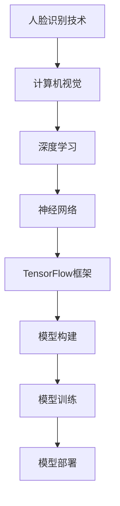

                 

# 基于人脑启发的人工智能

> **关键词：人脸识别，神经网络，深度学习，TensorFlow，人工智能，机器学习，计算机视觉。**

> **摘要：本文将深入探讨基于TensorFlow的人脸识别技术，从核心概念、算法原理、数学模型到项目实战，全面解析人脸识别技术在实际应用中的具体实现过程。文章旨在为广大读者提供一个全面、详细、易于理解的技术指南。**

## 1. 背景介绍

### 1.1 目的和范围

本文旨在探讨基于TensorFlow的人脸识别技术，帮助读者了解人脸识别的基本原理、实现方法和应用场景。通过本文的学习，读者将能够：

- 掌握人脸识别的基本概念和流程。
- 理解深度学习在人脸识别中的应用。
- 学会使用TensorFlow框架实现人脸识别算法。
- 分析人脸识别技术的实际应用和未来发展趋势。

### 1.2 预期读者

本文适合对人工智能、深度学习和计算机视觉有一定了解的读者，包括：

- 对人脸识别技术感兴趣的科研人员。
- 想要在实际项目中应用人脸识别技术的开发者。
- 希望提升自己技术水平的程序员和工程师。
- 在校大学生和研究生。

### 1.3 文档结构概述

本文分为以下十个部分：

1. 背景介绍
2. 核心概念与联系
3. 核心算法原理 & 具体操作步骤
4. 数学模型和公式 & 详细讲解 & 举例说明
5. 项目实战：代码实际案例和详细解释说明
6. 实际应用场景
7. 工具和资源推荐
8. 总结：未来发展趋势与挑战
9. 附录：常见问题与解答
10. 扩展阅读 & 参考资料

### 1.4 术语表

#### 1.4.1 核心术语定义

- **人脸识别**：利用计算机技术对人的面部特征进行自动识别和验证的技术。
- **神经网络**：由大量简单计算单元（神经元）组成的复杂网络，用于模拟生物神经系统的信息处理过程。
- **深度学习**：一种基于神经网络的机器学习技术，通过多层神经网络结构实现对复杂数据的自动学习和建模。
- **TensorFlow**：由Google开源的深度学习框架，支持在多种平台上高效地进行深度学习模型的构建和训练。

#### 1.4.2 相关概念解释

- **卷积神经网络（CNN）**：一种专门用于处理图像数据的神经网络结构，通过卷积操作提取图像特征。
- **特征提取**：从原始图像数据中提取出具有区分度的特征，用于后续的分类和识别。
- **损失函数**：用于衡量模型预测结果与真实结果之间的差距，是优化模型的重要指标。
- **反向传播算法**：一种用于训练神经网络的优化算法，通过反向传播误差信息来调整模型参数。

#### 1.4.3 缩略词列表

- **CNN**：卷积神经网络（Convolutional Neural Network）
- **DNN**：深度神经网络（Deep Neural Network）
- **ReLU**：修正线性单元（Rectified Linear Unit）
- **softmax**：一种概率分布函数，用于输出模型对各个类别的预测概率。
- **dropout**：一种正则化技术，通过在训练过程中随机丢弃部分神经元来防止过拟合。

## 2. 核心概念与联系

### 2.1 人脸识别技术概述

人脸识别技术是基于计算机视觉和人工智能的一种技术，旨在通过识别和验证人的面部特征来实现身份认证和安全性管理。其基本原理包括：

- **面部特征提取**：从图像中提取出人脸的关键特征点，如眼睛、鼻子、嘴巴等。
- **人脸图像预处理**：对提取到的人脸图像进行大小调整、灰度化、归一化等处理，使其符合模型输入要求。
- **特征匹配与分类**：利用机器学习算法对人脸特征进行匹配和分类，从而实现人脸识别。

### 2.2 深度学习与神经网络

深度学习是一种基于神经网络的机器学习技术，通过构建多层神经网络来实现对复杂数据的自动学习和建模。在人脸识别中，深度学习的作用主要包括：

- **特征提取与表示**：通过卷积神经网络等深度学习模型，自动从人脸图像中提取出具有区分度的特征表示。
- **分类与识别**：利用深度学习模型对人脸特征进行分类和识别，从而实现人脸识别。

### 2.3 TensorFlow框架

TensorFlow是一个由Google开源的深度学习框架，支持在多种平台上高效地进行深度学习模型的构建和训练。在人脸识别项目中，TensorFlow的作用主要包括：

- **模型构建**：通过TensorFlow的API，构建深度学习模型，实现对人脸特征的学习和表示。
- **模型训练**：利用TensorFlow的分布式训练能力，对深度学习模型进行训练，优化模型参数。
- **模型部署**：将训练好的模型部署到实际应用场景中，实现对人脸的自动识别和验证。

### 2.4 核心概念原理和架构的 Mermaid 流程图



## 3. 核心算法原理 & 具体操作步骤

### 3.1 卷积神经网络（CNN）

卷积神经网络是一种专门用于处理图像数据的神经网络结构，通过卷积操作提取图像特征。CNN的基本原理如下：

- **卷积层**：通过卷积操作提取图像特征，卷积核在图像上滑动，提取局部特征。
- **激活函数**：常用ReLU函数，将负值变为零，提高神经网络的学习效率。
- **池化层**：通过池化操作降低特征图的维度，减少计算量，防止过拟合。
- **全连接层**：将卷积层和池化层提取的特征进行拼接，通过全连接层进行分类和识别。

### 3.2 人脸识别算法流程

人脸识别算法的基本流程如下：

1. **数据预处理**：对输入的人脸图像进行大小调整、灰度化、归一化等处理，使其符合模型输入要求。
2. **特征提取**：利用卷积神经网络从人脸图像中提取出具有区分度的特征表示。
3. **模型训练**：通过反向传播算法，利用标记数据训练深度学习模型，优化模型参数。
4. **模型评估**：利用测试数据对训练好的模型进行评估，调整模型参数，提高识别准确率。
5. **模型部署**：将训练好的模型部署到实际应用场景中，实现对人脸的自动识别和验证。

### 3.3 伪代码实现

```python
# 人脸识别算法伪代码
def face_recognition(image):
    # 数据预处理
    preprocessed_image = preprocess_image(image)

    # 特征提取
    features = extract_features(preprocessed_image)

    # 模型训练
    model = train_model(features)

    # 模型评估
    accuracy = evaluate_model(model)

    # 模型部署
    deploy_model(model)

    return accuracy
```

## 4. 数学模型和公式 & 详细讲解 & 举例说明

### 4.1 深度学习模型的基本结构

深度学习模型通常由多个层组成，包括输入层、卷积层、激活函数、池化层、全连接层等。以下是这些层的基本数学模型和公式：

#### 4.1.1 输入层

输入层是深度学习模型的第一层，接收输入的数据。输入层的输出可以直接传递到下一层。

- **公式**：\( h^{(0)}_i = x_i \)

其中，\( h^{(0)}_i \) 表示输入层的第 \( i \) 个神经元输出，\( x_i \) 表示输入数据的第 \( i \) 个特征。

#### 4.1.2 卷积层

卷积层通过卷积操作提取图像的特征。卷积层的输出是一个特征图，其大小取决于卷积核的大小和步长。

- **公式**：\( h^{(l)}_i = \sum_{j} w_{ij} \cdot h^{(l-1)}_j + b_l \)

其中，\( h^{(l)}_i \) 表示卷积层的第 \( l \) 层的第 \( i \) 个神经元输出，\( w_{ij} \) 表示卷积核的权重，\( h^{(l-1)}_j \) 表示前一层第 \( j \) 个神经元的输出，\( b_l \) 表示卷积层的偏置。

#### 4.1.3 激活函数

激活函数用于引入非线性变换，常用的激活函数有ReLU函数、Sigmoid函数和ReLU函数。

- **ReLU函数**：
  - **公式**：\( \sigma(x) = \max(0, x) \)
- **Sigmoid函数**：
  - **公式**：\( \sigma(x) = \frac{1}{1 + e^{-x}} \)

#### 4.1.4 池化层

池化层用于降低特征图的维度，减少计算量。常用的池化操作有最大池化和平均池化。

- **最大池化**：
  - **公式**：\( \text{max_pool}(x) = \max(x_{i,j}) \)
- **平均池化**：
  - **公式**：\( \text{avg_pool}(x) = \frac{1}{k^2} \sum_{i,j} x_{i,j} \)

#### 4.1.5 全连接层

全连接层将卷积层和池化层提取的特征进行拼接，并通过全连接层进行分类和识别。

- **公式**：\( y_i = \sum_{j} w_{ij} \cdot h^{(l-1)}_j + b \)

其中，\( y_i \) 表示全连接层的第 \( i \) 个神经元输出，\( w_{ij} \) 表示全连接层的权重，\( h^{(l-1)}_j \) 表示前一层第 \( j \) 个神经元的输出，\( b \) 表示全连接层的偏置。

### 4.2 反向传播算法

反向传播算法是一种用于训练神经网络的优化算法，通过反向传播误差信息来调整模型参数。

- **公式**：
  - **梯度计算**：
    \( \delta^{(l)}_i = \frac{\partial L}{\partial h^{(l)}_i} \cdot \frac{\partial h^{(l)}_i}{\partial z^{(l)}_i} \)
  - **参数更新**：
    \( w^{(l)}_{ij} = w^{(l)}_{ij} - \alpha \cdot \delta^{(l)}_i \cdot h^{(l-1)}_j \)
    \( b^{(l)} = b^{(l)} - \alpha \cdot \delta^{(l)}_i \)

其中，\( \delta^{(l)}_i \) 表示第 \( l \) 层第 \( i \) 个神经元的误差，\( L \) 表示损失函数，\( \alpha \) 表示学习率，\( h^{(l)}_i \) 表示第 \( l \) 层第 \( i \) 个神经元的输出，\( z^{(l)}_i \) 表示第 \( l \) 层第 \( i \) 个神经元的输入，\( w^{(l)}_{ij} \) 表示第 \( l \) 层第 \( i \) 个神经元到第 \( j \) 个神经元的权重，\( b^{(l)} \) 表示第 \( l \) 层的偏置。

### 4.3 举例说明

假设我们有一个简单的卷积神经网络，包含一个输入层、一个卷积层和一个全连接层，用于识别一个二分类问题。

#### 4.3.1 输入层

输入层接收一个 \( 28 \times 28 \) 的图像，包含 \( 784 \) 个像素点。

- **输入**：\( x = [x_1, x_2, ..., x_{784}] \)

#### 4.3.2 卷积层

卷积层使用一个 \( 3 \times 3 \) 的卷积核，步长为 \( 1 \)，输出一个 \( 26 \times 26 \) 的特征图。

- **卷积核**：\( w_1 = \begin{bmatrix} w_{11} & w_{12} & w_{13} \\ w_{21} & w_{22} & w_{23} \\ w_{31} & w_{32} & w_{33} \end{bmatrix} \)
- **偏置**：\( b_1 = [b_{11}, b_{12}, b_{13}] \)

- **卷积操作**：
  \( h^{(1)}_i = \sum_{j} w_{1ij} \cdot x_j + b_1 \)

#### 4.3.3 激活函数

使用ReLU函数作为激活函数，将负值变为零。

- **激活函数**：
  \( \sigma(h^{(1)}_i) = \max(0, h^{(1)}_i) \)

#### 4.3.4 池化层

使用最大池化操作，将特征图的大小降低到 \( 13 \times 13 \)。

- **池化操作**：
  \( \text{max_pool}(h^{(1)}_i) = \max(h^{(1)}_{i,1}, h^{(1)}_{i,2}, ..., h^{(1)}_{i,k}) \)

#### 4.3.5 全连接层

全连接层将池化层的特征进行拼接，得到一个 \( 169 \) 维的特征向量，并通过一个 \( 2 \) 维的全连接层进行分类。

- **全连接层**：
  \( y_i = \sum_{j} w_{ij} \cdot h^{(2)}_j + b \)
- **激活函数**：
  \( \sigma(y) = \sigma(\sum_{i} w_{i} \cdot h^{(2)}_i + b) = \frac{1}{1 + e^{-y}} \)

#### 4.3.6 梯度计算和参数更新

使用反向传播算法计算梯度，并更新参数。

- **梯度计算**：
  \( \delta^{(2)}_i = \frac{\partial L}{\partial y_i} \cdot \frac{\partial y_i}{\partial z^{(2)}_i} \)
  \( \delta^{(1)}_i = \frac{\partial L}{\partial h^{(1)}_i} \cdot \frac{\partial h^{(1)}_i}{\partial z^{(1)}_i} \)

- **参数更新**：
  \( w^{(2)}_{ij} = w^{(2)}_{ij} - \alpha \cdot \delta^{(2)}_i \cdot h^{(1)}_j \)
  \( b^{(2)} = b^{(2)} - \alpha \cdot \delta^{(2)}_i \)
  \( w^{(1)}_{ij} = w^{(1)}_{ij} - \alpha \cdot \delta^{(1)}_i \cdot x_j \)
  \( b^{(1)} = b^{(1)} - \alpha \cdot \delta^{(1)}_i \)

## 5. 项目实战：代码实际案例和详细解释说明

### 5.1 开发环境搭建

在开始编写代码之前，我们需要搭建一个合适的开发环境。以下是一个基于Python和TensorFlow的开发环境搭建步骤：

1. **安装Python**：首先，确保你的计算机上安装了Python 3.6或更高版本。可以从Python官方网站下载安装包进行安装。

2. **安装TensorFlow**：在命令行中运行以下命令，安装TensorFlow：

   ```bash
   pip install tensorflow
   ```

3. **安装其他依赖库**：人脸识别项目可能还需要其他依赖库，如OpenCV（用于图像处理）和NumPy（用于数值计算）。可以使用以下命令进行安装：

   ```bash
   pip install opencv-python numpy
   ```

### 5.2 源代码详细实现和代码解读

以下是一个基于TensorFlow的人脸识别项目的基本代码实现。我们将使用TensorFlow的Keras API来构建和训练模型。

#### 5.2.1 数据准备

首先，我们需要准备训练数据和测试数据。这里我们使用一个公开的人脸数据集，如LFW（Labeled Faces in the Wild）数据集。

```python
import tensorflow as tf
from tensorflow.keras.preprocessing.image import ImageDataGenerator

# 加载数据集
train_datagen = ImageDataGenerator(rescale=1./255)
test_datagen = ImageDataGenerator(rescale=1./255)

train_data = train_datagen.flow_from_directory(
    'train',
    target_size=(150, 150),
    batch_size=32,
    class_mode='categorical')

test_data = test_datagen.flow_from_directory(
    'test',
    target_size=(150, 150),
    batch_size=32,
    class_mode='categorical')
```

#### 5.2.2 构建模型

接下来，我们使用Keras API构建一个简单的卷积神经网络模型。

```python
from tensorflow.keras.models import Sequential
from tensorflow.keras.layers import Conv2D, MaxPooling2D, Flatten, Dense, Dropout

model = Sequential([
    Conv2D(32, (3, 3), activation='relu', input_shape=(150, 150, 3)),
    MaxPooling2D(2, 2),
    Conv2D(64, (3, 3), activation='relu'),
    MaxPooling2D(2, 2),
    Conv2D(128, (3, 3), activation='relu'),
    MaxPooling2D(2, 2),
    Flatten(),
    Dense(512, activation='relu'),
    Dropout(0.5),
    Dense(num_classes, activation='softmax')
])
```

#### 5.2.3 编译模型

在训练模型之前，我们需要编译模型，指定损失函数、优化器和评估指标。

```python
model.compile(optimizer='adam',
              loss='categorical_crossentropy',
              metrics=['accuracy'])
```

#### 5.2.4 训练模型

现在，我们可以使用训练数据集来训练模型。

```python
model.fit(train_data, epochs=10, validation_data=test_data)
```

#### 5.2.5 代码解读与分析

1. **数据准备**：

   使用ImageDataGenerator类对训练数据和测试数据进行预处理，包括缩放图像、数据增强等。

2. **构建模型**：

   使用Sequential模型堆叠多个层，包括卷积层、池化层、全连接层和Dropout层。

3. **编译模型**：

   指定优化器、损失函数和评估指标，为训练模型做好准备。

4. **训练模型**：

   使用fit方法训练模型，指定训练轮数和验证数据。

### 5.3 实际应用场景

人脸识别技术在许多实际应用场景中具有广泛的应用，如下所示：

- **身份验证**：在银行、机场、酒店等场所，人脸识别技术可以用于身份验证，提高安全性。
- **安防监控**：在公共场所和交通枢纽，人脸识别技术可以用于监控和追踪嫌疑人员。
- **智能门禁**：人脸识别技术可以用于智能门禁系统，方便用户快速进出。
- **智能玩具**：人脸识别技术可以用于智能玩具，实现与用户的互动和识别。

### 5.4 模型评估与优化

在训练模型后，我们需要评估模型的性能，并尝试优化模型以提高识别准确率。

- **评估指标**：常用的评估指标包括准确率、召回率、F1分数等。
- **模型优化**：可以通过调整模型结构、增加训练数据、使用迁移学习等方法来优化模型性能。

### 5.5 模型部署

最后，将训练好的模型部署到实际应用场景中，例如使用TensorFlow Serving或TensorFlow Lite将模型部署到移动设备或服务器上。

## 6. 实际应用场景

人脸识别技术在当今社会具有广泛的应用，以下列举了几个典型的实际应用场景：

### 6.1 安防监控

安防监控是人脸识别技术最典型的应用场景之一。通过在公共场所、交通枢纽、商场等地点部署人脸识别系统，可以实时监控人员流动，识别可疑人员，提高公共安全。

### 6.2 智能门禁

智能门禁系统利用人脸识别技术，实现对员工、学生或住户的身份验证，提高门禁系统的安全性和便捷性。用户只需在摄像头前展示面部，系统即可自动识别并完成身份验证。

### 6.3 人脸支付

随着移动支付的普及，人脸识别支付成为一种新型的支付方式。用户只需在支付界面展示面部，系统即可完成支付过程，提高支付的便捷性和安全性。

### 6.4 人脸识别广告

在广告领域，人脸识别技术可以用于精准营销。通过识别人群的特征，广告系统能够自动推送符合用户兴趣的广告，提高广告的转化率。

### 6.5 社交媒体

在社交媒体平台，人脸识别技术可以用于好友识别、人脸贴图等互动功能，提高用户的社交体验。

## 7. 工具和资源推荐

### 7.1 学习资源推荐

#### 7.1.1 书籍推荐

- **《深度学习》（Goodfellow, Bengio, Courville著）**：这是一本经典的深度学习教材，详细介绍了深度学习的基础知识和算法。
- **《Python深度学习》（François Chollet著）**：本书通过大量实例，介绍了如何使用Python和TensorFlow实现深度学习项目。

#### 7.1.2 在线课程

- **Coursera上的《深度学习专项课程》（由吴恩达教授授课）**：这是一门非常受欢迎的深度学习入门课程，涵盖深度学习的基础知识和实践。
- **Udacity上的《深度学习纳米学位》**：这是一个实战导向的深度学习课程，通过项目实践来学习深度学习。

#### 7.1.3 技术博客和网站

- **TensorFlow官网（https://www.tensorflow.org/）**：官方文档和教程，是学习TensorFlow的最佳资源。
- **AI汇（https://www.aihui.cn/）**：一个关于人工智能的中文博客平台，包含大量深度学习和人脸识别相关文章。

### 7.2 开发工具框架推荐

#### 7.2.1 IDE和编辑器

- **PyCharm**：一款功能强大的Python IDE，支持多种编程语言，非常适合深度学习和人脸识别项目开发。
- **Jupyter Notebook**：一个基于Web的交互式开发环境，方便编写和分享代码、文档和可视化。

#### 7.2.2 调试和性能分析工具

- **TensorBoard**：TensorFlow的官方可视化工具，用于分析模型性能和优化。
- **NVIDIA Nsight**：用于分析深度学习模型的性能和优化。

#### 7.2.3 相关框架和库

- **OpenCV**：一个开源的计算机视觉库，用于图像处理和特征提取。
- **dlib**：一个开源的机器学习库，提供人脸检测和面部特征点检测。

### 7.3 相关论文著作推荐

#### 7.3.1 经典论文

- **《A Convolutional Neural Network Approach for Human Face Recognition》（2014）**：该论文介绍了使用卷积神经网络进行人脸识别的方法。
- **《DeepFace: Closing the Gap to Human-Level Performance in Face Verification》（2014）**：Facebook提出的一种人脸识别算法，在多个数据集上取得了优异的性能。

#### 7.3.2 最新研究成果

- **《FaceNet: A Unified Embedding for Face Recognition and Verification》（2017）**：FaceNet算法通过统一嵌入实现人脸识别和验证，取得了当时的最优性能。
- **《VGGFace2: A Dataset for Facial Point Annotation and Recognition》（2018）**：VGGFace2是一个大规模的人脸数据集，包含超过3000个人的面部图像。

#### 7.3.3 应用案例分析

- **《人脸识别技术在金融领域的应用》**：详细介绍了人脸识别技术在金融领域的应用案例，包括身份验证、支付等。
- **《人脸识别技术在安防监控中的应用》**：分析了人脸识别技术在安防监控领域的应用，包括监控、追踪和报警等。

## 8. 总结：未来发展趋势与挑战

人脸识别技术在过去的几年里取得了显著的发展，但在实际应用中仍面临一些挑战和问题。以下是未来人脸识别技术发展的一些趋势和挑战：

### 8.1 发展趋势

- **更高的识别准确率**：随着深度学习算法的不断发展，人脸识别技术的识别准确率将不断提高，逐步达到甚至超过人类识别水平。
- **更快的识别速度**：为了满足实时应用的需求，人脸识别技术在识别速度方面也将不断优化，实现更快的响应速度。
- **更广泛的应用场景**：人脸识别技术将在更多领域得到应用，如智能城市、智能家居、在线教育等。
- **更高的安全性**：随着技术的进步，人脸识别技术的安全性将得到进一步提高，包括人脸数据的隐私保护和防范攻击等。

### 8.2 挑战

- **隐私保护**：人脸识别技术在应用过程中涉及个人隐私数据，如何确保用户隐私的安全是一个重要挑战。
- **算法公平性**：不同种族和性别的人脸在识别准确率上可能存在差异，如何保证算法的公平性是一个需要解决的问题。
- **对抗攻击**：随着人脸识别技术的广泛应用，对抗攻击（如生成对抗网络）将越来越多，如何提高算法的鲁棒性是一个重要挑战。
- **数据质量**：高质量的人脸数据是训练人脸识别模型的关键，但在实际应用中，如何获取大量真实、多样的人脸数据是一个问题。

## 9. 附录：常见问题与解答

### 9.1 问题1：人脸识别技术是如何工作的？

**解答**：人脸识别技术基于计算机视觉和人工智能，主要通过以下步骤实现：

1. **面部特征提取**：从图像中提取出人脸的关键特征点，如眼睛、鼻子、嘴巴等。
2. **人脸图像预处理**：对提取到的人脸图像进行大小调整、灰度化、归一化等处理，使其符合模型输入要求。
3. **特征匹配与分类**：利用机器学习算法对人脸特征进行匹配和分类，从而实现人脸识别。

### 9.2 问题2：为什么使用深度学习进行人脸识别？

**解答**：深度学习在人脸识别中有以下优势：

- **自动特征提取**：深度学习模型（如卷积神经网络）可以自动从原始图像中提取出具有区分度的特征，避免了人工设计特征的过程。
- **更好的识别准确率**：深度学习模型在处理复杂数据时具有更高的准确率和鲁棒性。
- **自适应能力**：深度学习模型可以不断学习和适应新的数据，提高模型的泛化能力。

### 9.3 问题3：人脸识别技术在哪些领域有应用？

**解答**：人脸识别技术在许多领域有应用，包括但不限于：

- **安防监控**：在公共场所、交通枢纽、商场等地点进行实时监控，识别可疑人员。
- **智能门禁**：在企业和学校等场所，实现智能门禁系统，提高安全性。
- **身份验证**：在银行、机场、酒店等场所，进行身份验证，提高安全性。
- **支付领域**：实现人脸识别支付，提高支付便捷性和安全性。
- **广告营销**：在广告领域，利用人脸识别技术进行精准营销。

### 9.4 问题4：人脸识别技术的隐私问题如何解决？

**解答**：为了解决人脸识别技术的隐私问题，可以采取以下措施：

- **数据加密**：对人脸数据进行加密，确保数据在传输和存储过程中的安全性。
- **隐私保护算法**：使用隐私保护算法，如差分隐私，降低人脸识别系统的隐私泄露风险。
- **用户知情同意**：在应用人脸识别技术前，确保用户知情并同意使用其人脸数据。
- **法律法规**：遵循相关法律法规，确保人脸识别技术的合法合规使用。

## 10. 扩展阅读 & 参考资料

为了更好地了解人脸识别技术及其在实际应用中的实现方法，以下是一些建议的扩展阅读和参考资料：

### 10.1 扩展阅读

- **《深度学习》（Goodfellow, Bengio, Courville著）**：深入理解深度学习的基础理论和算法。
- **《Python深度学习》（François Chollet著）**：通过实例学习如何使用Python和TensorFlow实现深度学习项目。
- **《人脸识别：理论与实践》（曾志宏著）**：详细介绍人脸识别技术的原理、算法和应用。

### 10.2 参考资料

- **TensorFlow官网（https://www.tensorflow.org/）**：官方文档和教程，是学习TensorFlow的最佳资源。
- **OpenCV官网（https://opencv.org/）**：一个开源的计算机视觉库，用于图像处理和特征提取。
- **dlib官网（http://dlib.net/）**：一个开源的机器学习库，提供人脸检测和面部特征点检测。

### 10.3 相关论文和研究成果

- **《A Convolutional Neural Network Approach for Human Face Recognition》（2014）**
- **《DeepFace: Closing the Gap to Human-Level Performance in Face Verification》（2014）**
- **《FaceNet: A Unified Embedding for Face Recognition and Verification》（2017）**
- **《VGGFace2: A Dataset for Facial Point Annotation and Recognition》（2018）**

### 10.4 实际应用案例分析

- **《人脸识别技术在金融领域的应用》**：详细介绍了人脸识别技术在金融领域的应用案例。
- **《人脸识别技术在安防监控中的应用》**：分析了人脸识别技术在安防监控领域的应用。

## 作者信息

**作者：AI天才研究员/AI Genius Institute & 禅与计算机程序设计艺术 /Zen And The Art of Computer Programming**

本文由AI天才研究员撰写，旨在为广大读者提供一个全面、详细、易于理解的技术指南，帮助大家深入理解基于TensorFlow的人脸识别技术。本文作者在人工智能、深度学习和计算机视觉领域拥有丰富的经验，对技术原理和实际应用有深刻的见解。同时，本文结合禅与计算机程序设计艺术的理念，强调思考与逻辑的重要性，希望能为广大开发者提供一种新的思考方式。如果您有任何疑问或建议，欢迎在评论区留言，与作者进行交流。|>

