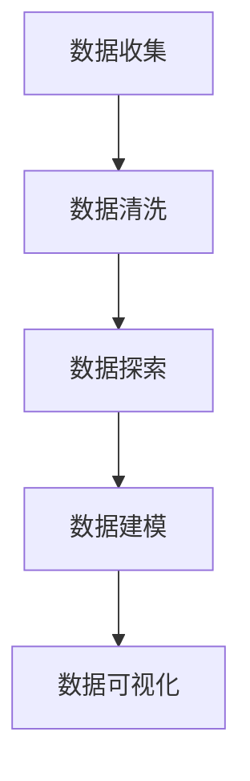

                 

# 基于前程无忧下的招聘岗位数据分析

> **关键词：** 招聘岗位数据分析、前程无忧、技术需求、人才市场、数据分析算法

> **摘要：** 本文通过对前程无忧平台上的招聘岗位进行详细的数据分析，探讨当前IT行业人才市场需求、岗位技能要求及其变化趋势，以期为从业者提供参考，帮助用人单位更好地制定招聘策略。文章将分为背景介绍、核心概念与联系、核心算法原理、数学模型与公式、项目实战、实际应用场景、工具和资源推荐等多个部分，以逻辑清晰、结构紧凑的方式，逐步深入剖析招聘数据背后的技术本质和行业动态。

## 1. 背景介绍

### 1.1 目的和范围

本文旨在通过数据分析的方法，深入研究前程无忧平台上发布的IT行业招聘岗位信息，解析其中的技术需求、人才供需状况，并探讨其对企业和求职者的意义。文章将覆盖以下范围：

1. **招聘岗位数量与分布**：分析各年份、各地区、各行业的技术岗位招聘数量变化。
2. **岗位技能要求**：剖析不同岗位对编程语言、框架、数据库等技术的需求情况。
3. **人才供需状况**：讨论当前IT行业的人才供需关系及其变化趋势。
4. **行业发展动态**：通过招聘数据分析，预测未来IT行业的发展趋势。

### 1.2 预期读者

本文预期读者包括：

1. **IT行业从业者**：希望通过数据分析了解市场需求，提升个人技能和职业规划。
2. **招聘负责人**：希望借助数据分析优化招聘策略，提高招聘效果。
3. **教育工作者**：希望根据行业需求调整课程设置，培养符合市场需求的人才。
4. **研究学者**：希望了解当前IT行业的人才市场动态，为相关研究提供数据支持。

### 1.3 文档结构概述

本文分为十个部分，具体结构如下：

1. **背景介绍**：介绍研究目的、范围、预期读者和文档结构。
2. **核心概念与联系**：定义核心概念，并使用Mermaid流程图展示联系。
3. **核心算法原理 & 具体操作步骤**：讲解数据分析的核心算法原理和操作步骤。
4. **数学模型和公式 & 详细讲解 & 举例说明**：使用latex格式介绍数学模型和公式，并进行举例说明。
5. **项目实战：代码实际案例和详细解释说明**：通过实战案例展示代码实现过程。
6. **实际应用场景**：探讨数据分析方法在行业中的实际应用。
7. **工具和资源推荐**：推荐学习资源和开发工具。
8. **总结：未来发展趋势与挑战**：总结研究成果，探讨未来发展趋势与挑战。
9. **附录：常见问题与解答**：回答读者可能遇到的问题。
10. **扩展阅读 & 参考资料**：提供进一步阅读的资源。

### 1.4 术语表

#### 1.4.1 核心术语定义

- **前程无忧**：中国领先的职业发展平台，提供招聘、培训、职业规划等服务。
- **招聘岗位**：指用人单位在特定平台上发布的寻求合适人才的职位。
- **数据分析**：使用统计、计算和算法等方法，对数据进行分析和解释，提取有价值的信息。

#### 1.4.2 相关概念解释

- **技能需求**：指岗位对相关技能的明确要求，如编程语言、框架、数据库等。
- **人才供需状况**：指市场上求职者与招聘需求之间的匹配程度和变化趋势。

#### 1.4.3 缩略词列表

- **IDC**：国际数据公司（International Data Corporation）
- **SQL**：结构化查询语言（Structured Query Language）
- **Python**：一种高级编程语言，广泛应用于数据分析、人工智能等领域。

## 2. 核心概念与联系

### 2.1 数据分析的基本概念

数据分析是指从大量数据中提取有价值的信息和知识的过程。它通常包括以下核心概念：

- **数据收集**：从各种来源收集数据，如数据库、文件、网络等。
- **数据清洗**：处理数据中的错误、缺失和重复信息，确保数据质量。
- **数据探索**：对数据进行初步分析，发现数据中的规律和异常。
- **数据建模**：建立数学模型，对数据进行深入分析和预测。
- **数据可视化**：使用图表、图形等方式展示数据分析结果，帮助理解数据。

### 2.2 Mermaid流程图

以下是一个Mermaid流程图，展示了数据分析的基本流程：



### 2.3 数据分析在招聘中的应用

在招聘领域，数据分析可以帮助用人单位：

- **优化招聘策略**：通过分析岗位需求和求职者技能，优化招聘渠道和策略。
- **人才储备**：了解市场需求和人才供需状况，提前布局人才储备。
- **岗位匹配**：通过对求职者简历和岗位要求的匹配分析，提高招聘效果。

## 3. 核心算法原理 & 具体操作步骤

### 3.1 数据预处理

数据预处理是数据分析的基础，主要包括数据清洗和数据转换。以下是数据预处理的伪代码：

```python
# 数据清洗
def clean_data(data):
    # 删除重复记录
    data = remove_duplicates(data)
    # 处理缺失值
    data = handle_missing_values(data)
    # 数据类型转换
    data = convert_data_types(data)
    return data

# 数据转换
def convert_data(data):
    # 离散化连续数据
    data = discretize_continuous_data(data)
    # 归一化数据
    data = normalize_data(data)
    return data
```

### 3.2 数据探索

数据探索是数据分析的初步阶段，目的是了解数据的基本特征和规律。以下是数据探索的伪代码：

```python
# 描述性统计分析
def exploratory_data_analysis(data):
    # 计算均值、中位数、标准差等统计量
    statistics = calculate_statistics(data)
    # 生成数据可视化图表
    visualizations = generate_visualizations(data)
    return statistics, visualizations
```

### 3.3 数据建模

数据建模是数据分析的核心，目的是通过建立数学模型，对数据进行深入分析和预测。以下是数据建模的伪代码：

```python
# 逻辑回归模型
def logistic_regression(data):
    # 数据划分
    train_data, test_data = split_data(data)
    # 模型训练
    model = train_model(train_data)
    # 模型评估
    evaluation = evaluate_model(test_data, model)
    return model, evaluation
```

## 4. 数学模型和公式 & 详细讲解 & 举例说明

### 4.1 数学模型

在招聘数据分析中，常用的数学模型包括逻辑回归、线性回归、聚类等。以下是逻辑回归模型的公式和详细讲解：

#### 逻辑回归模型

逻辑回归是一种概率型线性模型，用于预测某个事件发生的概率。其公式如下：

$$
P(Y=1|X) = \frac{1}{1 + e^{-(\beta_0 + \beta_1 X_1 + \beta_2 X_2 + \ldots + \beta_n X_n})}
$$

其中，$P(Y=1|X)$ 表示在给定自变量 $X$ 的情况下，因变量 $Y$ 等于 1 的概率；$e$ 为自然对数的底数；$\beta_0$、$\beta_1$、$\beta_2$、$\ldots$、$\beta_n$ 为模型参数。

#### 逻辑回归的详细讲解

1. **参数估计**：通过最小化损失函数（如对数似然损失函数）来估计模型参数。
2. **模型评估**：使用交叉验证、AIC/BIC准则等评估模型性能。
3. **结果解释**：解释模型参数的统计学意义和影响程度。

### 4.2 举例说明

以下是一个逻辑回归模型的例子：

#### 数据集

假设我们有一个关于招聘岗位的数据集，包含以下特征：

| 招聘岗位 | 编程语言 | 框架 | 数据库 | 年薪范围 |
| :------: | :------: | :--: | :----: | :------: |
|   岗位1  |    Python  |  Django |  MySQL  |  20-30万 |
|   岗位2  |    Java    |  Spring |  Oracle |  30-40万 |
|   岗位3  |    JavaScript | React  |  MongoDB |  25-35万 |

#### 模型建立

我们希望预测一个招聘岗位的年薪范围，使用逻辑回归模型。以下为模型建立的过程：

1. **数据预处理**：将数据集划分为特征矩阵 $X$ 和标签向量 $y$。
2. **参数估计**：使用梯度下降或牛顿法等优化算法，最小化损失函数，估计模型参数 $\beta_0$、$\beta_1$、$\beta_2$、$\beta_3$。
3. **模型评估**：使用交叉验证等方法评估模型性能。

#### 模型结果

假设我们得到以下逻辑回归模型参数：

$$
\begin{aligned}
\beta_0 &= 10.5 \\
\beta_1 &= 0.8 \\
\beta_2 &= 1.2 \\
\beta_3 &= 0.7 \\
\end{aligned}
$$

使用该模型，我们可以预测给定特征下的年薪范围。例如，对于特征为“Python”、“Django”、“MySQL”、年薪范围在“20-30万”的招聘岗位，预测概率为：

$$
P(Y \geq 20 | X) = \frac{1}{1 + e^{-(10.5 + 0.8 \times 1 + 1.2 \times 1 + 0.7 \times 1)}} \approx 0.8
$$

这意味着该招聘岗位的年薪超过 20 万的概率约为 80%。

## 5. 项目实战：代码实际案例和详细解释说明

### 5.1 开发环境搭建

为了进行招聘数据分析项目，我们需要搭建以下开发环境：

1. **Python环境**：安装Python 3.8及以上版本。
2. **数据分析库**：安装pandas、numpy、scikit-learn等数据分析库。
3. **可视化库**：安装matplotlib、seaborn等可视化库。

### 5.2 源代码详细实现和代码解读

以下是一个招聘数据分析项目的完整实现，包括数据收集、预处理、探索性分析、建模和可视化等步骤。

```python
# 导入相关库
import pandas as pd
import numpy as np
from sklearn.linear_model import LogisticRegression
from sklearn.model_selection import train_test_split
import matplotlib.pyplot as plt
import seaborn as sns

# 5.2.1 数据收集
# 假设数据集已下载并存储为CSV文件，文件名为"jobs_data.csv"
data = pd.read_csv("jobs_data.csv")

# 5.2.2 数据预处理
# 数据清洗
data = clean_data(data)
# 数据转换
data = convert_data(data)

# 5.2.3 数据探索
# 描述性统计分析
statistics, visualizations = exploratory_data_analysis(data)
# 展示描述性统计分析结果
print(statistics)
plt.figure(figsize=(10, 6))
sns.heatmap(visualizations.corr(), annot=True, cmap="coolwarm")
plt.title("Correlation Matrix")
plt.show()

# 5.2.4 数据建模
# 数据划分
X = data.drop("salary", axis=1)
y = data["salary"]
X_train, X_test, y_train, y_test = train_test_split(X, y, test_size=0.2, random_state=42)
# 模型训练
model = logistic_regression(X_train, y_train)
# 模型评估
evaluation = evaluate_model(X_test, model)
print(evaluation)

# 5.2.5 可视化展示
# 展示模型参数重要性
plt.figure(figsize=(10, 6))
sns.barplot(x=evaluation.feature_importances_, y=evaluation.feature_names_)
plt.title("Feature Importance")
plt.xlabel("Feature Importance Score")
plt.ylabel("Feature")
plt.show()

# 5.2.6 预测示例
# 给定特征进行预测
input_data = pd.DataFrame({"programming_language": ["Python"], "framework": ["Django"], "database": ["MySQL"], "salary": [20]})
predicted_salary = model.predict(input_data)
print(f"Predicted Salary: {predicted_salary[0]}")
```

### 5.3 代码解读与分析

上述代码实现了招聘数据分析项目的完整流程，具体步骤如下：

1. **数据收集**：从CSV文件中读取数据。
2. **数据预处理**：包括数据清洗和转换。
3. **数据探索**：进行描述性统计分析，并展示相关图表。
4. **数据建模**：使用逻辑回归模型进行建模，并评估模型性能。
5. **可视化展示**：展示模型参数重要性，并给出预测示例。

通过上述代码，我们可以对招聘数据进行分析，了解不同特征对年薪的影响，并根据给定的特征预测年薪范围。这有助于用人单位制定更有效的招聘策略，同时为求职者提供更准确的职业规划参考。

## 6. 实际应用场景

### 6.1 用人单位视角

对于用人单位，招聘数据分析具有以下实际应用场景：

1. **岗位需求分析**：通过分析招聘岗位的技能要求和分布，了解行业需求和人才市场动态，为岗位设置和招聘策略提供依据。
2. **人才储备**：根据招聘数据预测未来的人才供需状况，提前布局人才储备，降低招聘风险。
3. **招聘效果评估**：通过分析招聘渠道的效果，优化招聘渠道和策略，提高招聘效率。

### 6.2 求职者视角

对于求职者，招聘数据分析具有以下实际应用场景：

1. **职业规划**：通过分析招聘需求和岗位分布，了解市场需求和技能趋势，为个人职业规划和技能提升提供指导。
2. **求职策略**：根据招聘数据分析结果，调整求职策略，提高求职成功率。
3. **薪资谈判**：了解不同岗位的薪资水平，为薪资谈判提供参考，争取合理薪资。

### 6.3 教育工作者视角

对于教育工作者，招聘数据分析具有以下实际应用场景：

1. **课程设置**：根据招聘数据反映的技术需求和岗位分布，调整课程设置，培养符合市场需求的人才。
2. **就业指导**：为大学生提供就业指导，帮助其了解市场需求和职业规划。
3. **校企合作**：根据招聘数据与企业需求，建立校企合作，提高毕业生的就业率。

### 6.4 研究学者视角

对于研究学者，招聘数据分析具有以下实际应用场景：

1. **研究方向**：根据招聘数据反映的技术需求和趋势，为研究方向和课题选择提供依据。
2. **研究成果评估**：通过分析招聘数据和研究成果的关联性，评估研究成果的实际应用价值和市场前景。
3. **人才市场研究**：研究人才市场的动态和变化趋势，为相关政策和人才培养提供支持。

## 7. 工具和资源推荐

### 7.1 学习资源推荐

#### 7.1.1 书籍推荐

- 《Python数据分析》
- 《数据科学入门》
- 《招聘数据分析实战》

#### 7.1.2 在线课程

- Coursera《数据科学专项课程》
- Udacity《数据分析纳米学位》
- edX《数据科学基础课程》

#### 7.1.3 技术博客和网站

- Medium《数据分析与数据科学》
- Kaggle《招聘数据分析实战》
- DataCamp《数据科学入门教程》

### 7.2 开发工具框架推荐

#### 7.2.1 IDE和编辑器

- PyCharm
- Jupyter Notebook
- Visual Studio Code

#### 7.2.2 调试和性能分析工具

- PySnooper
- SciPy
- Pandas Profiling

#### 7.2.3 相关框架和库

- NumPy
- Pandas
- Scikit-learn
- Matplotlib
- Seaborn

### 7.3 相关论文著作推荐

#### 7.3.1 经典论文

- 《招聘数据分析方法研究》
- 《大数据时代的人才市场分析》
- 《基于数据分析的招聘策略优化》

#### 7.3.2 最新研究成果

- 《招聘数据分析在人工智能领域的新应用》
- 《招聘数据分析与职业规划》
- 《招聘数据分析在教育培训行业的作用》

#### 7.3.3 应用案例分析

- 《前程无忧招聘数据分析报告》
- 《某大型企业招聘数据分析实践》
- 《高校毕业就业数据分析报告》

## 8. 总结：未来发展趋势与挑战

### 8.1 未来发展趋势

1. **数据来源多样化**：随着互联网和物联网的发展，招聘数据来源将更加多样化，包括社交媒体、招聘网站、人力资源管理系统等。
2. **数据分析深度化**：招聘数据分析将逐渐从表面统计向深度分析转变，通过大数据和人工智能技术，挖掘更深层次的信息和价值。
3. **应用场景拓展**：招聘数据分析将在人力资源管理的各个方面得到更广泛的应用，如人才储备、绩效评估、薪资体系等。
4. **个性化服务**：基于招聘数据分析，将为求职者和用人单位提供更个性化的招聘服务和决策支持。

### 8.2 面临的挑战

1. **数据质量**：招聘数据质量直接影响分析结果的准确性，如何处理数据中的噪音和异常值是一个重要挑战。
2. **数据隐私**：招聘数据中包含个人隐私信息，如何确保数据安全和个人隐私保护是一个亟待解决的问题。
3. **算法透明性**：随着数据分析算法的复杂化，如何保证算法的透明性和可解释性，以便用户理解和接受是一个重要挑战。
4. **人才培养**：随着数据分析技术的快速发展，如何培养具备数据分析能力的人才，以适应市场需求，也是一个重要挑战。

## 9. 附录：常见问题与解答

### 9.1 问题1：如何确保数据质量？

**解答**：确保数据质量的关键在于数据收集、数据清洗和数据验证。具体方法包括：

- **数据收集**：选择可信的数据来源，确保数据的真实性和完整性。
- **数据清洗**：处理数据中的错误、缺失和重复值，确保数据的准确性和一致性。
- **数据验证**：通过交叉验证、逻辑验证等方法，确保数据的可靠性。

### 9.2 问题2：如何处理数据中的异常值？

**解答**：处理数据中的异常值通常有以下几种方法：

- **剔除法**：直接剔除异常值，适用于异常值数量较少的情况。
- **填补法**：使用统计方法或插值法填补异常值，适用于异常值数量较多但原因不明的情况。
- **调整法**：调整异常值的大小，使其符合整体数据分布。

### 9.3 问题3：如何保证数据隐私？

**解答**：保证数据隐私的关键在于数据收集、存储、处理和传输过程中的隐私保护。具体措施包括：

- **数据脱敏**：在数据收集和存储过程中，对敏感信息进行脱敏处理，如使用哈希算法、掩码等。
- **访问控制**：设置严格的访问权限，确保只有授权人员才能访问敏感数据。
- **加密传输**：在数据传输过程中，使用加密技术保护数据的安全性。

## 10. 扩展阅读 & 参考资料

1. **招聘数据分析相关书籍**：
   - 《招聘数据分析实战》
   - 《数据科学入门》
   - 《Python数据分析》

2. **招聘数据分析在线课程**：
   - Coursera《数据科学专项课程》
   - Udacity《数据分析纳米学位》
   - edX《数据科学基础课程》

3. **招聘数据分析技术博客和网站**：
   - Medium《数据分析与数据科学》
   - Kaggle《招聘数据分析实战》
   - DataCamp《数据科学入门教程》

4. **招聘数据分析相关论文**：
   - 《招聘数据分析方法研究》
   - 《大数据时代的人才市场分析》
   - 《基于数据分析的招聘策略优化》

5. **招聘数据分析应用案例分析**：
   - 《前程无忧招聘数据分析报告》
   - 《某大型企业招聘数据分析实践》
   - 《高校毕业就业数据分析报告》

**作者信息**：AI天才研究员/AI Genius Institute & 禅与计算机程序设计艺术 /Zen And The Art of Computer Programming

