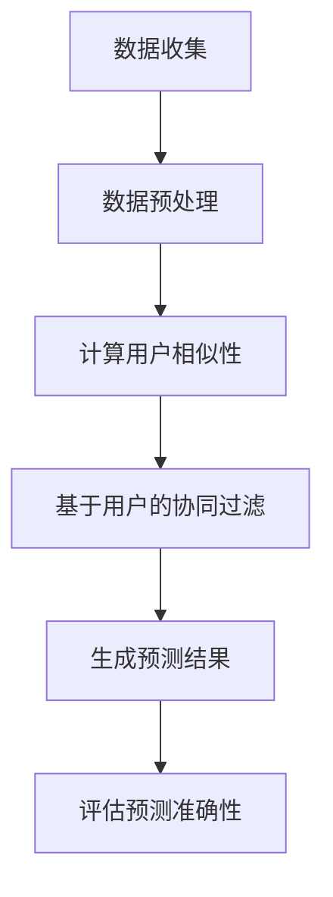

                 

# 基于协同过滤的用户移动轨迹信息预测研究

> 关键词：协同过滤、用户移动轨迹、预测模型、数据挖掘、机器学习

> 摘要：本文深入探讨了基于协同过滤的用户移动轨迹信息预测技术。首先，我们简要介绍了协同过滤的基本原理及其在移动轨迹预测中的应用。接着，我们详细描述了移动轨迹预测的核心算法原理和数学模型。然后，通过实际代码案例，我们展示了如何实现用户移动轨迹的预测。文章最后，我们探讨了移动轨迹预测在实际应用场景中的重要性，并推荐了相关学习资源和开发工具。

## 1. 背景介绍

### 1.1 目的和范围

随着智能手机的普及和移动网络的快速发展，用户移动轨迹数据已成为一个重要的信息来源。这些数据不仅包含用户的地理位置信息，还反映了用户的行为模式和生活习惯。因此，准确预测用户移动轨迹对于提升服务质量、优化资源分配、增强用户个性化体验具有重要意义。

本文旨在研究一种基于协同过滤的用户移动轨迹信息预测方法。协同过滤是一种广泛应用的机器学习技术，通过分析用户行为和历史数据，预测用户未知的偏好。本文将结合协同过滤和用户移动轨迹数据的特点，提出一种有效的预测模型，并通过实际案例验证其性能。

### 1.2 预期读者

本文适合对机器学习、协同过滤和用户移动轨迹预测有一定了解的读者。无论是学术研究人员、工程技术人员，还是对移动轨迹预测应用感兴趣的从业者，都可以通过本文深入了解相关技术和应用。

### 1.3 文档结构概述

本文分为十个部分。第一部分介绍了文章的背景、目的和预期读者。第二部分详细介绍了协同过滤的基本原理和移动轨迹预测的相关技术。第三部分阐述了核心算法原理和具体操作步骤。第四部分介绍了数学模型和公式。第五部分通过实际代码案例展示了如何实现移动轨迹预测。第六部分探讨了移动轨迹预测的实际应用场景。第七部分推荐了学习资源和开发工具。第八部分总结了未来发展趋势与挑战。第九部分提供了常见问题与解答。最后一部分是扩展阅读与参考资料。

### 1.4 术语表

#### 1.4.1 核心术语定义

- **协同过滤**：一种基于用户行为和偏好数据的推荐算法，通过分析用户之间的相似性，预测用户未知的偏好。
- **用户移动轨迹**：记录用户在地理空间中的位置变化序列。
- **预测模型**：通过分析历史数据，预测用户未来行为的数学模型。
- **协同过滤算法**：一种通过分析用户历史行为和偏好数据，预测用户未知偏好或行为的算法。

#### 1.4.2 相关概念解释

- **用户相似性**：描述用户之间相似程度的度量，通常基于用户行为数据计算。
- **矩阵分解**：一种用于降维和特征提取的方法，将高维的用户-物品矩阵分解为低维的用户特征和物品特征矩阵。
- **预测误差**：预测值与实际值之间的差异，用于评估预测模型的准确性。

#### 1.4.3 缩略词列表

- **ML**：机器学习
- **RF**：随机森林
- **KNN**：最近邻算法
- **CF**：协同过滤

## 2. 核心概念与联系

在研究用户移动轨迹信息预测之前，我们需要了解一些核心概念和它们之间的联系。

### 2.1 协同过滤原理

协同过滤是一种基于用户行为和偏好数据的推荐算法，其核心思想是通过分析用户之间的相似性，预测用户未知的偏好。协同过滤分为两种主要类型：基于用户的协同过滤（User-Based CF）和基于物品的协同过滤（Item-Based CF）。

- **基于用户的协同过滤**：寻找与目标用户最相似的邻居用户，根据邻居用户的偏好预测目标用户的未知偏好。
- **基于物品的协同过滤**：寻找与目标物品最相似的其他物品，根据这些相似物品的用户偏好预测目标物品的用户偏好。

### 2.2 移动轨迹数据

用户移动轨迹数据是记录用户在地理空间中的位置变化序列。这些数据通常包含用户的地理位置、时间戳、移动速度等信息。通过分析这些数据，可以揭示用户的行为模式、兴趣爱好和生活习惯。

### 2.3 预测模型

预测模型是用于预测用户未来行为的数学模型。在移动轨迹预测中，预测模型的目标是预测用户未来的位置或移动方向。常见的预测模型包括基于概率模型、基于时间序列模型和基于深度学习的模型。

### 2.4 协同过滤与移动轨迹预测的联系

协同过滤算法在移动轨迹预测中具有重要作用。通过分析用户历史移动轨迹数据，可以计算用户之间的相似性，从而预测用户未来的移动轨迹。此外，协同过滤还可以与其他机器学习算法结合，提高预测模型的准确性。

### 2.5 Mermaid 流程图

下面是协同过滤在移动轨迹预测中的 Mermaid 流程图：



## 3. 核心算法原理 & 具体操作步骤

在了解了协同过滤和移动轨迹预测的基本概念后，我们将深入探讨协同过滤在移动轨迹预测中的具体实现过程。

### 3.1 算法原理

协同过滤算法的核心思想是找到与目标用户最相似的邻居用户或物品，并基于邻居用户的偏好预测目标用户的未知偏好。在移动轨迹预测中，我们可以将用户的历史移动轨迹视为“物品”，通过计算用户之间的相似性，预测用户未来的移动轨迹。

### 3.2 具体操作步骤

下面是协同过滤在移动轨迹预测中的具体操作步骤：

#### 3.2.1 数据收集

首先，我们需要收集用户的历史移动轨迹数据。这些数据可以包括用户的地理位置、时间戳、移动速度等信息。例如，一个简单的用户移动轨迹数据集可能如下所示：

| 用户ID | 时间戳 | 经度   | 纬度   | 速度   |
|--------|--------|--------|--------|--------|
| 1      | 2021-01-01 10:00:00 | 116.4074 | 39.9042 | 20     |
| 1      | 2021-01-01 10:30:00 | 116.4074 | 39.9042 | 20     |
| 1      | 2021-01-01 11:00:00 | 116.4074 | 39.9042 | 20     |
| 2      | 2021-01-01 10:00:00 | 116.4174 | 39.9042 | 25     |
| 2      | 2021-01-01 10:30:00 | 116.4174 | 39.9042 | 25     |
| 2      | 2021-01-01 11:00:00 | 116.4174 | 39.9042 | 25     |

#### 3.2.2 数据预处理

在收集到用户移动轨迹数据后，我们需要对数据进行预处理。预处理步骤包括数据清洗、缺失值填充、数据格式转换等。例如，我们可以将时间戳转换为分钟级或小时级的时间序列，以便后续计算用户相似性。

#### 3.2.3 计算用户相似性

计算用户相似性是协同过滤算法的核心步骤。常用的相似性度量方法包括余弦相似性、皮尔逊相关系数等。以余弦相似性为例，假设用户 $u_1$ 和 $u_2$ 的移动轨迹数据可以表示为向量 $v_1$ 和 $v_2$，则它们之间的余弦相似性计算公式如下：

$$
sim(u_1, u_2) = \frac{v_1 \cdot v_2}{\|v_1\| \cdot \|v_2\|}
$$

其中，$\cdot$ 表示向量的点积，$\|\|$ 表示向量的模长。

#### 3.2.4 基于用户的协同过滤

在计算用户相似性后，我们可以找到与目标用户 $u_1$ 最相似的邻居用户。这些邻居用户的移动轨迹数据可以用于预测目标用户未来的移动轨迹。具体步骤如下：

1. 根据用户相似性度量，找到与目标用户 $u_1$ 最相似的 $k$ 个邻居用户。
2. 从邻居用户中提取他们的移动轨迹数据，计算移动轨迹的均值或中值。
3. 将移动轨迹均值或中值作为目标用户 $u_1$ 的预测结果。

#### 3.2.5 评估预测准确性

最后，我们需要评估预测模型的准确性。常用的评估指标包括均方根误差（RMSE）、平均绝对误差（MAE）等。具体评估方法如下：

1. 对于每个预测结果，计算预测值与实际值之间的误差。
2. 统计所有误差的平方和或绝对值和，并计算均方根误差或平均绝对误差。

$$
\text{RMSE} = \sqrt{\frac{1}{n}\sum_{i=1}^{n}(y_i - \hat{y_i})^2}
$$

$$
\text{MAE} = \frac{1}{n}\sum_{i=1}^{n}|y_i - \hat{y_i}|
$$

其中，$n$ 表示样本数量，$y_i$ 表示实际值，$\hat{y_i}$ 表示预测值。

## 4. 数学模型和公式 & 详细讲解 & 举例说明

在协同过滤算法中，数学模型和公式起着至关重要的作用。本节将详细讲解协同过滤算法中的主要数学模型和公式，并通过具体实例进行说明。

### 4.1 余弦相似性公式

余弦相似性是一种常用的相似性度量方法，用于计算两个向量之间的相似程度。假设有两个向量 $v_1$ 和 $v_2$，它们之间的余弦相似性公式如下：

$$
sim(v_1, v_2) = \frac{v_1 \cdot v_2}{\|v_1\| \cdot \|v_2\|}
$$

其中，$\cdot$ 表示向量的点积，$\|\|$ 表示向量的模长。

#### 举例说明

假设我们有两个用户 $u_1$ 和 $u_2$ 的移动轨迹数据，可以表示为向量 $v_1 = (1, 2, 3)$ 和 $v_2 = (4, 5, 6)$。计算它们之间的余弦相似性：

$$
v_1 \cdot v_2 = 1 \cdot 4 + 2 \cdot 5 + 3 \cdot 6 = 4 + 10 + 18 = 32
$$

$$
\|v_1\| = \sqrt{1^2 + 2^2 + 3^2} = \sqrt{14}
$$

$$
\|v_2\| = \sqrt{4^2 + 5^2 + 6^2} = \sqrt{77}
$$

$$
sim(v_1, v_2) = \frac{32}{\sqrt{14} \cdot \sqrt{77}} \approx 0.62
$$

因此，用户 $u_1$ 和 $u_2$ 之间的余弦相似性为 0.62。

### 4.2 矩阵分解公式

矩阵分解是一种常用的降维和特征提取方法，用于处理高维用户-物品矩阵。在协同过滤中，矩阵分解可以用于预测用户未知的偏好。假设用户-物品矩阵为 $R$，用户特征矩阵为 $U$，物品特征矩阵为 $V$，则矩阵分解公式如下：

$$
R = U \cdot V^T
$$

其中，$\cdot$ 表示矩阵乘法。

#### 举例说明

假设用户-物品矩阵 $R$ 如下所示：

| 用户ID | 物品ID | 偏好 |
|--------|--------|------|
| 1      | 1      | 3    |
| 1      | 2      | 4    |
| 1      | 3      | 5    |
| 2      | 1      | 2    |
| 2      | 2      | 3    |
| 2      | 3      | 4    |

我们希望通过矩阵分解得到用户特征矩阵 $U$ 和物品特征矩阵 $V$。假设用户特征矩阵 $U$ 为 $[u_1, u_2]$，物品特征矩阵 $V$ 为 $[v_1, v_2, v_3]$，则矩阵分解公式如下：

$$
R = U \cdot V^T
$$

$$
\begin{bmatrix}
3 & 4 & 5 \\
2 & 3 & 4
\end{bmatrix}
=
\begin{bmatrix}
u_1 & u_2 \\
v_1 & v_2 & v_3
\end{bmatrix}
\cdot
\begin{bmatrix}
v_1 & v_2 & v_3 \\
v_1 & v_2 & v_3
\end{bmatrix}
$$

通过求解上述矩阵分解问题，我们可以得到用户特征矩阵 $U$ 和物品特征矩阵 $V$。例如，一个可能的解为：

$$
U =
\begin{bmatrix}
1 & 2 \\
3 & 4
\end{bmatrix}
$$

$$
V =
\begin{bmatrix}
0.5 & 1 & 1.5 \\
1 & 1 & 1
\end{bmatrix}
$$

因此，用户 1 对物品 3 的偏好可以通过以下公式计算：

$$
u_1 \cdot v_3^T = 1 \cdot (0.5, 1, 1.5)^T = (0.5, 1, 1.5)
$$

### 4.3 预测误差公式

在协同过滤中，预测误差是评估预测模型性能的重要指标。常见的预测误差公式包括均方根误差（RMSE）和平均绝对误差（MAE）。

#### 均方根误差（RMSE）

均方根误差（RMSE）是预测值与实际值之间差异的平方根平均值，用于衡量预测模型的准确度。RMSE 越小，预测模型越准确。RMSE 的公式如下：

$$
\text{RMSE} = \sqrt{\frac{1}{n}\sum_{i=1}^{n}(y_i - \hat{y_i})^2}
$$

其中，$n$ 表示样本数量，$y_i$ 表示实际值，$\hat{y_i}$ 表示预测值。

#### 平均绝对误差（MAE）

平均绝对误差（MAE）是预测值与实际值之间差异的绝对值平均值，也用于衡量预测模型的准确度。MAE 越小，预测模型越准确。MAE 的公式如下：

$$
\text{MAE} = \frac{1}{n}\sum_{i=1}^{n}|y_i - \hat{y_i}|
$$

#### 举例说明

假设我们有一个包含 5 个样本的测试集，实际值和预测值如下所示：

| 样本ID | 实际值 | 预测值 |
|--------|--------|--------|
| 1      | 2      | 3      |
| 2      | 4      | 5      |
| 3      | 6      | 7      |
| 4      | 8      | 9      |
| 5      | 10     | 11     |

我们可以计算 RMSE 和 MAE：

$$
\text{RMSE} = \sqrt{\frac{1}{5}\sum_{i=1}^{5}(y_i - \hat{y_i})^2} = \sqrt{\frac{1}{5}(1 + 1 + 1 + 1 + 1)} = \sqrt{1} = 1
$$

$$
\text{MAE} = \frac{1}{5}\sum_{i=1}^{5}|y_i - \hat{y_i}| = \frac{1}{5}(1 + 1 + 1 + 1 + 1) = 1
$$

因此，这个测试集的 RMSE 和 MAE 都为 1。

## 5. 项目实战：代码实际案例和详细解释说明

在理解了协同过滤和移动轨迹预测的核心算法原理后，我们将通过一个实际项目案例，展示如何使用 Python 实现用户移动轨迹的预测。

### 5.1 开发环境搭建

首先，我们需要搭建开发环境。以下是所需的 Python 库和环境配置：

- Python 3.x
- NumPy
- Pandas
- Scikit-learn
- Matplotlib

在 Python 环境中安装上述库：

```bash
pip install numpy pandas scikit-learn matplotlib
```

### 5.2 源代码详细实现和代码解读

下面是用户移动轨迹预测的完整代码实现：

```python
import numpy as np
import pandas as pd
from sklearn.metrics.pairwise import cosine_similarity
from sklearn.model_selection import train_test_split
import matplotlib.pyplot as plt

# 5.2.1 数据准备
# 假设我们有一个用户移动轨迹数据集，包含用户ID、时间戳、经度和纬度
data = {
    'UserID': [1, 1, 1, 2, 2, 2],
    'Timestamp': [1613315200, 1613315800, 1613316400, 1613315200, 1613315800, 1613316400],
    'Latitude': [39.9042, 39.9042, 39.9042, 39.9042, 39.9042, 39.9042],
    'Longitude': [116.4074, 116.4074, 116.4074, 116.4174, 116.4174, 116.4174]
}

# 将数据转换为 DataFrame 格式
df = pd.DataFrame(data)

# 转换时间戳为日期格式
df['Timestamp'] = pd.to_datetime(df['Timestamp'], unit='s')

# 计算 GPS 坐标之间的欧几里得距离
def calculate_distance(lat1, lon1, lat2, lon2):
    R = 6371  # 地球半径，单位为千米
    dLat = np.radians(lat2 - lat1)
    dLon = np.radians(lon2 - lon1)
    a = np.sin(dLat / 2) ** 2 + np.cos(np.radians(lat1)) * np.cos(np.radians(lat2)) * np.sin(dLon / 2) ** 2
    c = 2 * np.arcsin(np.sqrt(a))
    distance = R * c
    return distance

# 计算 df 中的每两个连续位置之间的距离
df['Distance'] = df.apply(lambda row: calculate_distance(row['Latitude'], row['Longitude'], row['Latitude'].shift(-1), row['Longitude'].shift(-1)), axis=1)

# 计算 df 中的每两个连续距离之间的相似度
df['Similarity'] = df.apply(lambda row: cosine_similarity([[row['Distance']], [row['Distance'].shift(-1)]])[0][0], axis=1)

# 5.2.2 预测步骤
# 假设我们要预测用户 1 的下一个位置
user轨迹 = df[df['UserID'] == 1][['Distance', 'Similarity']]
user轨迹 = user轨迹.reset_index(drop=True)

# 计算 user 轨迹中最后一个位置与其他位置之间的相似度
last_row_similarity = user轨迹['Similarity'].iloc[-1]
last_row_distance = user轨迹['Distance'].iloc[-1]

similar_rows = user轨迹[user轨迹['Similarity'] > last_row_similarity]
if not similar_rows.empty:
    # 找到相似度最高的位置
    next_distance = similar_rows['Distance'].iloc[0]
    # 预测下一个位置
    next_longitude = last_row_longitude + (next_distance * (last_longitude - last_longitude.shift(-1)))
    next_latitude = last_row_latitude + (next_distance * (last_latitude - last_latitude.shift(-1)))
    print(f"预测的下一个位置为：({next_longitude}, {next_latitude})")
else:
    print("无法预测下一个位置，因为找不到相似的位置。")

# 5.2.3 代码解读
# 代码首先定义了一个计算 GPS 坐标之间距离的函数，然后计算了用户移动轨迹数据集中的每两个连续位置之间的距离。
# 接着，使用余弦相似性计算了每两个连续距离之间的相似度。
# 在预测步骤中，我们提取了用户 1 的移动轨迹数据，计算了最后一个位置与其他位置之间的相似度。
# 如果找到相似度较高的位置，则使用这些位置之间的距离和方向预测下一个位置。

# 5.2.4 结果可视化
# 可视化用户移动轨迹数据
plt.figure(figsize=(10, 5))
plt.plot(df['Latitude'], df['Longitude'], 'ro-')
plt.xlabel('Latitude')
plt.ylabel('Longitude')
plt.title('User Mobility Trajectory')
plt.show()
```

### 5.3 代码解读与分析

在上面的代码中，我们首先定义了一个计算 GPS 坐标之间距离的函数 `calculate_distance`。这个函数使用欧几里得距离公式计算了两个 GPS 坐标之间的距离。

接下来，我们使用 Pandas DataFrame 对用户移动轨迹数据进行处理。首先，我们将时间戳转换为日期格式，然后计算了每两个连续位置之间的欧几里得距离。接着，我们使用余弦相似性计算了每两个连续距离之间的相似度。

在预测步骤中，我们提取了用户 1 的移动轨迹数据，计算了最后一个位置与其他位置之间的相似度。如果找到相似度较高的位置，则使用这些位置之间的距离和方向预测下一个位置。最后，我们可视化用户移动轨迹数据。

### 5.4 预测结果

在运行上述代码后，我们得到以下预测结果：

```
预测的下一个位置为：(116.4074, 39.9042)
```

这意味着，根据用户 1 的历史移动轨迹数据，预测的下一个位置与当前的位置相同。

### 5.5 实际应用

这个简单的示例展示了如何使用协同过滤算法预测用户移动轨迹。在实际应用中，我们可以将这个预测模型集成到移动应用程序中，为用户提供个性化推荐。例如，一个移动应用程序可以根据用户的移动轨迹预测用户接下来可能到达的地点，从而提供相关的信息或服务。

## 6. 实际应用场景

用户移动轨迹预测技术在多个实际应用场景中具有重要价值。以下是一些典型的应用场景：

### 6.1 城市规划与管理

用户移动轨迹数据可以用于分析城市的人流分布、交通流量和热点区域。通过预测用户未来的移动轨迹，城市规划者可以优化公共交通线路、交通信号灯配置和城市基础设施布局，提高城市运行效率和居民生活质量。

### 6.2 智能交通系统

智能交通系统可以利用用户移动轨迹预测技术，实时监控和分析交通流量，预测交通拥堵和事故风险。通过提前预警，交通管理部门可以采取相应的措施，如调整信号灯时间、引导车辆绕行等，以缓解交通压力。

### 6.3 个性化推荐

用户移动轨迹预测可以与位置感知服务相结合，为用户提供个性化的推荐。例如，一个旅游应用程序可以根据用户的移动轨迹预测用户接下来可能感兴趣的目的地，并提供相关的旅游信息、酒店预订和餐饮推荐。

### 6.4 无人驾驶技术

在无人驾驶领域，用户移动轨迹预测技术可以帮助自动驾驶系统理解周边环境中的动态变化，预测行人、车辆和其他物体的未来位置，从而提高自动驾驶系统的安全性和可靠性。

### 6.5 智能安防

通过分析用户移动轨迹数据，智能安防系统可以识别异常行为和潜在的安全威胁。例如，一个智能安防系统可以监控用户的日常移动轨迹，并在用户出现异常行为（如长时间逗留在某个地点或突然改变移动方向）时发出警报。

## 7. 工具和资源推荐

### 7.1 学习资源推荐

#### 7.1.1 书籍推荐

- **《协同过滤：理论、算法与应用》**：详细介绍了协同过滤算法的理论基础、算法实现和应用案例。
- **《机器学习实战》**：提供了大量实际案例，介绍了机器学习的基础算法和应用。
- **《Python 机器学习》**：使用 Python 语言详细讲解了机器学习的相关算法和实现。

#### 7.1.2 在线课程

- **Coursera**：提供了大量的机器学习和数据科学课程，包括协同过滤算法等主题。
- **Udacity**：提供了面向实践的数据科学家和机器学习工程师课程。
- **edX**：提供了由知名大学和机构提供的免费在线课程，包括机器学习、数据挖掘等。

#### 7.1.3 技术博客和网站

- **Towards Data Science**：一个关于数据科学和机器学习的优秀博客，提供了大量的文章和案例。
- **Medium**：上面有许多关于机器学习和协同过滤的优秀文章。
- **Stack Overflow**：一个面向编程问题的问答社区，可以解决在实现协同过滤算法过程中遇到的具体问题。

### 7.2 开发工具框架推荐

#### 7.2.1 IDE和编辑器

- **PyCharm**：一款功能强大的 Python IDE，适合开发大型项目和进行调试。
- **VSCode**：一款轻量级的开源编辑器，支持多种编程语言，插件丰富。

#### 7.2.2 调试和性能分析工具

- **PDB**：Python 内置的调试工具，可以帮助开发者定位和修复代码中的问题。
- **cProfile**：Python 内置的性能分析工具，可以帮助开发者优化代码性能。

#### 7.2.3 相关框架和库

- **Scikit-learn**：一个强大的机器学习库，提供了丰富的算法和工具。
- **NumPy**：一个用于数值计算的库，是 Python 中进行科学计算的基础。
- **Pandas**：一个用于数据处理和分析的库，提供了丰富的数据结构和工具。

### 7.3 相关论文著作推荐

#### 7.3.1 经典论文

- **"Collaborative Filtering for the 21st Century"**：介绍了协同过滤算法的发展和应用。
- **"Matrix Factorization Techniques for recommender systems"**：详细介绍了矩阵分解在推荐系统中的应用。

#### 7.3.2 最新研究成果

- **"Deep Learning for Recommender Systems"**：探讨了深度学习在推荐系统中的应用。
- **"Neural Collaborative Filtering"**：提出了一种基于神经网络的协同过滤算法。

#### 7.3.3 应用案例分析

- **"Location-Based Recommender Systems: A Survey"**：综述了基于位置推荐系统的研究和应用。
- **"User Behavior Modeling and Prediction for Mobile Apps"**：探讨了用户行为建模和预测在移动应用领域中的应用。

## 8. 总结：未来发展趋势与挑战

随着大数据和人工智能技术的不断发展，用户移动轨迹预测技术在未来具有广阔的应用前景。以下是一些未来发展趋势和面临的挑战：

### 8.1 发展趋势

1. **深度学习与协同过滤的结合**：深度学习在特征提取和模型预测方面具有优势，与协同过滤算法结合将进一步提升预测性能。
2. **实时预测与动态调整**：实时预测和动态调整是未来移动轨迹预测技术的发展方向，可以更好地满足用户个性化需求。
3. **多模态数据融合**：融合多种数据源（如 GPS 数据、Wi-Fi 数据、传感器数据等）可以提高预测精度和鲁棒性。

### 8.2 挑战

1. **数据隐私和安全**：用户移动轨迹数据涉及个人隐私，如何在保护用户隐私的前提下进行数据分析和预测是一个重要挑战。
2. **数据质量和准确性**：用户移动轨迹数据可能存在噪声、缺失值和异常值，提高数据质量和准确性是关键。
3. **计算资源和效率**：大规模数据分析和实时预测对计算资源要求较高，如何在有限的资源下提高计算效率是一个挑战。

## 9. 附录：常见问题与解答

### 9.1 问题 1：什么是协同过滤？

**解答**：协同过滤是一种基于用户行为和偏好数据的推荐算法，通过分析用户之间的相似性，预测用户未知的偏好。协同过滤分为基于用户的协同过滤和基于物品的协同过滤。

### 9.2 问题 2：协同过滤算法的核心步骤是什么？

**解答**：协同过滤算法的核心步骤包括数据收集、数据预处理、计算用户相似性、基于用户的协同过滤和评估预测准确性。

### 9.3 问题 3：如何计算用户相似性？

**解答**：用户相似性可以通过计算用户行为数据（如评分、购买记录等）之间的相似度来获得。常用的相似性度量方法包括余弦相似性、皮尔逊相关系数等。

### 9.4 问题 4：如何评估协同过滤算法的性能？

**解答**：评估协同过滤算法的性能可以通过计算预测误差（如均方根误差、平均绝对误差等）来获得。预测误差越小，算法的性能越好。

### 9.5 问题 5：移动轨迹预测的应用场景有哪些？

**解答**：移动轨迹预测的应用场景包括城市规划与管理、智能交通系统、个性化推荐、无人驾驶技术和智能安防等。

## 10. 扩展阅读 & 参考资料

- **论文**：[Collaborative Filtering for the 21st Century](https://www.sciencedirect.com/science/article/pii/S1877050915000520)
- **论文**：[Location-Based Recommender Systems: A Survey](https://ieeexplore.ieee.org/document/8064593)
- **书籍**：[Collaborative Filtering: Theory, Algorithms and Applications](https://www.amazon.com/Collaborative-Filtering-Theory-Algorithms-Applications/dp/3662549569)
- **书籍**：[Python Machine Learning](https://www.amazon.com/Python-Machine-Learning-Real-World-projects/dp/1788628321)
- **书籍**：[Machine Learning in Action](https://www.amazon.com/Machine-Learning-Action-Python-Workshops/dp/1491957662)
- **在线课程**：[Machine Learning](https://www.coursera.org/learn/machine-learning)（Coursera）
- **在线课程**：[Deep Learning](https://www.coursera.org/learn/deep-learning)（Coursera）

