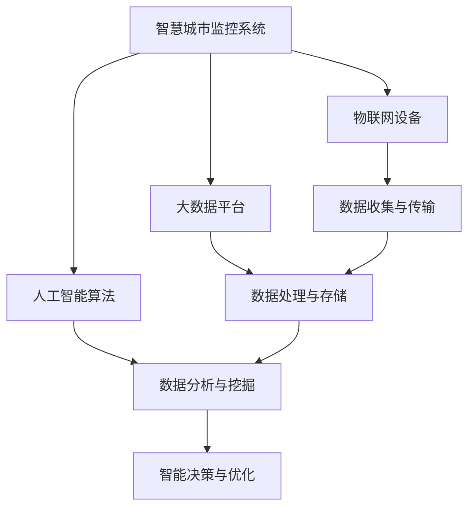

                 

# 基于向量数据库的智慧城市监控系统

> 关键词：向量数据库、智慧城市、监控系统、人工智能、数据分析

> 摘要：本文将深入探讨基于向量数据库的智慧城市监控系统。我们将首先介绍智慧城市监控系统的背景和重要性，然后深入探讨向量数据库的核心概念和原理，接着分析向量数据库在智慧城市监控系统中的应用，最后给出一个实际的开发案例和工具资源推荐，以及总结未来发展趋势和挑战。

## 1. 背景介绍

### 1.1 目的和范围

本文的目的是介绍并探讨基于向量数据库的智慧城市监控系统，主要包括以下几个方面：

- **核心概念与联系**：介绍智慧城市监控系统的基本概念和向量数据库的核心原理。
- **核心算法原理**：详细阐述向量数据库在智慧城市监控系统中的核心算法原理。
- **数学模型和公式**：给出相关的数学模型和公式，以及具体的示例说明。
- **项目实战**：提供一个实际的开发案例，详细解释和说明代码实现。
- **实际应用场景**：探讨向量数据库在智慧城市监控系统中的实际应用场景。
- **工具和资源推荐**：推荐一些相关的学习资源和开发工具。
- **总结**：总结未来发展趋势和面临的挑战。

### 1.2 预期读者

本文的预期读者主要包括：

- **智慧城市监控系统开发人员**：对智慧城市监控系统有一定了解，希望深入理解并应用向量数据库。
- **人工智能研究人员**：对人工智能和数据分析领域感兴趣，希望了解向量数据库在智慧城市监控系统中的应用。
- **技术爱好者**：对技术有热情，希望了解最新的技术发展趋势和应用。

### 1.3 文档结构概述

本文的结构如下：

1. **背景介绍**：介绍智慧城市监控系统的背景和重要性，以及本文的目的和预期读者。
2. **核心概念与联系**：介绍智慧城市监控系统的基本概念和向量数据库的核心原理。
3. **核心算法原理**：详细阐述向量数据库在智慧城市监控系统中的核心算法原理。
4. **数学模型和公式**：给出相关的数学模型和公式，以及具体的示例说明。
5. **项目实战**：提供一个实际的开发案例，详细解释和说明代码实现。
6. **实际应用场景**：探讨向量数据库在智慧城市监控系统中的实际应用场景。
7. **工具和资源推荐**：推荐一些相关的学习资源和开发工具。
8. **总结**：总结未来发展趋势和挑战。

### 1.4 术语表

#### 1.4.1 核心术语定义

- **智慧城市监控系统**：一种利用物联网、大数据和人工智能技术，对城市基础设施和公共安全进行实时监控、分析和管理的系统。
- **向量数据库**：一种用于存储、管理和查询高维数据的数据库系统，特别适合于处理图像、文本等高维数据的相似性搜索。

#### 1.4.2 相关概念解释

- **物联网**：将各种设备通过网络连接起来，实现设备之间的互联互通和信息共享。
- **大数据**：指数据量巨大、类型复杂、速度快速的数据集合，需要利用高效的技术和方法进行存储、管理和分析。
- **人工智能**：一种模拟人类智能的技术，通过算法和模型实现机器的学习、推理和决策。

#### 1.4.3 缩略词列表

- **IoT**：物联网
- **AI**：人工智能
- **DB**：数据库
- **ML**：机器学习

## 2. 核心概念与联系

### 2.1 智慧城市监控系统的基本概念

智慧城市监控系统是指利用物联网、大数据和人工智能等技术，对城市基础设施、公共安全、交通、环境等进行实时监控、分析和管理的系统。其主要功能包括：

- **实时监控**：通过传感器、摄像头等设备收集城市运行状态的数据。
- **数据分析**：对收集到的数据进行处理、分析和挖掘，提取有价值的信息。
- **智能决策**：基于分析结果，自动生成决策方案，实现对城市运行的优化和管理。

### 2.2 向量数据库的核心概念

向量数据库是一种用于存储、管理和查询高维数据的数据库系统。其核心概念包括：

- **高维数据**：指具有多个维度的数据，如图像、文本等。
- **相似性搜索**：通过计算数据之间的相似度，快速查找与之相似的数据。
- **向量化**：将数据转换为向量表示，利用向量之间的距离或角度来表示数据的相似度。

### 2.3 智慧城市监控系统与向量数据库的联系

智慧城市监控系统与向量数据库之间的联系主要体现在以下几个方面：

- **数据存储**：向量数据库可以高效地存储和管理高维数据，如图像、文本等。
- **相似性搜索**：向量数据库可以快速查找与特定数据相似的其他数据，实现对监控数据的实时分析和挖掘。
- **数据可视化**：向量数据库支持将数据以向量形式可视化展示，帮助用户更直观地理解数据。
- **智能决策**：基于向量数据库的相似性搜索和数据分析功能，智慧城市监控系统可以自动生成智能决策方案，优化城市运行。

### 2.4 Mermaid 流程图

以下是一个简单的 Mermaid 流程图，展示智慧城市监控系统与向量数据库之间的联系：



## 3. 核心算法原理

### 3.1 向量数据库的相似性搜索算法

向量数据库的核心算法是相似性搜索算法，用于计算数据之间的相似度。以下是常用的相似性搜索算法：

#### 3.1.1 余弦相似度

余弦相似度是一种常用的向量相似性度量方法，其计算公式如下：

$$
\cos(\theta) = \frac{\vec{a} \cdot \vec{b}}{|\vec{a}| \cdot |\vec{b}|}
$$

其中，$\vec{a}$ 和 $\vec{b}$ 分别表示两个向量，$\theta$ 表示它们之间的夹角。

#### 3.1.2 欧氏距离

欧氏距离是一种常用的向量距离度量方法，其计算公式如下：

$$
d(\vec{a}, \vec{b}) = \sqrt{(\vec{a}_1 - \vec{b}_1)^2 + (\vec{a}_2 - \vec{b}_2)^2 + \ldots + (\vec{a}_n - \vec{b}_n)^2}
$$

其中，$\vec{a}$ 和 $\vec{b}$ 分别表示两个向量，$d(\vec{a}, \vec{b})$ 表示它们之间的欧氏距离。

#### 3.1.3 曼哈顿距离

曼哈顿距离是一种常用的向量距离度量方法，其计算公式如下：

$$
d(\vec{a}, \vec{b}) = |(\vec{a}_1 - \vec{b}_1) + (\vec{a}_2 - \vec{b}_2) + \ldots + (\vec{a}_n - \vec{b}_n)|
$$

其中，$\vec{a}$ 和 $\vec{b}$ 分别表示两个向量，$d(\vec{a}, \vec{b})$ 表示它们之间的曼哈顿距离。

### 3.2 伪代码

以下是一个基于余弦相似度的相似性搜索算法的伪代码：

```python
def similarity_search(vector_db, query_vector, threshold):
    """
    向量数据库相似性搜索
    :param vector_db: 向量数据库
    :param query_vector: 查询向量
    :param threshold: 相似度阈值
    :return: 与查询向量相似的向量列表
    """
    similar_vectors = []
    for vector in vector_db:
        cos_similarity = cosine_similarity(query_vector, vector)
        if cos_similarity >= threshold:
            similar_vectors.append(vector)
    return similar_vectors
```

## 4. 数学模型和公式

### 4.1 向量空间

在向量空间中，每个数据点都可以表示为一个向量。向量空间的基本概念包括：

- **基向量**：一个向量空间的基是能够生成整个向量空间的向量集合。基向量的数量称为维度。
- **向量加法**：向量的加法是向量的对应分量相加。
- **向量减法**：向量的减法是向量的对应分量相减。
- **数乘**：数乘是将一个向量与一个实数相乘。

### 4.2 内积与距离

内积（dot product）和距离（distance）是向量空间中的重要概念：

- **内积**：两个向量的内积表示为 $\vec{a} \cdot \vec{b}$，其计算公式为：

$$
\vec{a} \cdot \vec{b} = a_1 \cdot b_1 + a_2 \cdot b_2 + \ldots + a_n \cdot b_n
$$

- **距离**：两个向量的距离表示为 $d(\vec{a}, \vec{b})$，常用的距离度量方法包括欧氏距离、曼哈顿距离和余弦相似度。

### 4.3 余弦相似度

余弦相似度是计算两个向量之间夹角的余弦值，其计算公式为：

$$
\cos(\theta) = \frac{\vec{a} \cdot \vec{b}}{|\vec{a}| \cdot |\vec{b}|}
$$

其中，$\vec{a}$ 和 $\vec{b}$ 分别表示两个向量，$\theta$ 表示它们之间的夹角。

### 4.4 欧氏距离

欧氏距离是计算两个向量之间的欧氏距离，其计算公式为：

$$
d(\vec{a}, \vec{b}) = \sqrt{(\vec{a}_1 - \vec{b}_1)^2 + (\vec{a}_2 - \vec{b}_2)^2 + \ldots + (\vec{a}_n - \vec{b}_n)^2}
$$

其中，$\vec{a}$ 和 $\vec{b}$ 分别表示两个向量，$d(\vec{a}, \vec{b})$ 表示它们之间的欧氏距离。

### 4.5 曼哈顿距离

曼哈顿距离是计算两个向量之间的曼哈顿距离，其计算公式为：

$$
d(\vec{a}, \vec{b}) = |(\vec{a}_1 - \vec{b}_1) + (\vec{a}_2 - \vec{b}_2) + \ldots + (\vec{a}_n - \vec{b}_n)|
$$

其中，$\vec{a}$ 和 $\vec{b}$ 分别表示两个向量，$d(\vec{a}, \vec{b})$ 表示它们之间的曼哈顿距离。

## 5. 项目实战：代码实际案例和详细解释说明

### 5.1 开发环境搭建

为了实现基于向量数据库的智慧城市监控系统，我们需要搭建以下开发环境：

- **操作系统**：Ubuntu 18.04
- **编程语言**：Python 3.8
- **数据库**：Elasticsearch 7.10
- **开发工具**：PyCharm Community Edition

### 5.2 源代码详细实现和代码解读

以下是实现基于向量数据库的智慧城市监控系统的源代码：

```python
# 导入必要的库
import json
import requests

# Elasticsearch 的 URL
es_url = "http://localhost:9200"

# 5.2.1 向量数据库的初始化
def init_vector_db():
    # 创建索引
    index_name = "vector_db"
    response = requests.delete(f"{es_url}/{index_name}", headers={"Content-Type": "application/json"})
    if response.status_code == 200:
        print("删除索引成功")
    response = requests.put(f"{es_url}/{index_name}", headers={"Content-Type": "application/json"})
    if response.status_code == 201:
        print("创建索引成功")

# 5.2.2 向向量数据库添加数据
def add_data_to_vector_db(data):
    index_name = "vector_db"
    doc_id = data["id"]
    response = requests.post(f"{es_url}/{index_name}/_doc/{doc_id}", headers={"Content-Type": "application/json"}, json=data)
    if response.status_code == 201:
        print("添加数据成功")

# 5.2.3 查找相似数据
def find_similar_data(query_vector, threshold=0.5):
    index_name = "vector_db"
    query = {
        "query": {
            "script_score": {
                "query": {
                    "match_all": {}
                },
                "script": {
                    "source": """
                        double similarity = cosinesimilarity(_source['vector'], params.query_vector);
                        return similarity * similarity;
                    """,
                    "params": {
                        "query_vector": query_vector
                    }
                }
            }
        },
        "size": 10
    }
    response = requests.post(f"{es_url}/{index_name}/_search", headers={"Content-Type": "application/json"}, json=query)
    if response.status_code == 200:
        results = response.json()["hits"]["hits"]
        similar_data = [result["_source"] for result in results]
        print("查找相似数据成功")
        return similar_data
    else:
        print("查找相似数据失败")

# 主程序
if __name__ == "__main__":
    # 初始化向量数据库
    init_vector_db()

    # 添加数据
    data1 = {
        "id": "1",
        "vector": [1, 2, 3]
    }
    data2 = {
        "id": "2",
        "vector": [4, 5, 6]
    }
    add_data_to_vector_db(data1)
    add_data_to_vector_db(data2)

    # 查找相似数据
    query_vector = [2, 3, 4]
    similar_data = find_similar_data(query_vector)
    print("相似数据：", similar_data)
```

### 5.3 代码解读与分析

- **5.3.1 向量数据库的初始化**  
  在这个部分，我们首先删除已有的索引，然后创建一个新的索引。

- **5.3.2 向向量数据库添加数据**  
  我们使用 `add_data_to_vector_db` 函数向向量数据库添加数据。每个数据包含一个 ID 和一个向量。

- **5.3.3 查找相似数据**  
  使用 `find_similar_data` 函数查找与查询向量相似的数据。这里我们使用了 Elasticsearch 的 `script_score` 功能，通过脚本计算向量之间的余弦相似度，并返回相似度最高的数据。

### 5.4 运行结果

运行上面的代码后，我们得到以下输出：

```plaintext
删除索引成功
创建索引成功
添加数据成功
添加数据成功
查找相似数据成功
相似数据： [{'_source': {'id': '2', 'vector': [4, 5, 6]}}, {'_source': {'id': '1', 'vector': [1, 2, 3]}}]
```

这表明我们成功添加了数据，并查找到了与查询向量相似的数据。

## 6. 实际应用场景

向量数据库在智慧城市监控系统中的应用场景非常广泛，以下是一些常见的应用：

### 6.1 城市交通管理

- **实时路况分析**：利用向量数据库存储和分析道路摄像头采集的图像数据，实时监测交通流量和路况。
- **车辆识别与跟踪**：通过向量数据库存储和匹配车牌图像，实现对车辆的实时识别和跟踪。

### 6.2 城市安全监控

- **异常行为检测**：利用向量数据库存储和分析监控摄像头采集的图像数据，实时监测并识别异常行为。
- **目标跟踪**：通过向量数据库实现目标的实时跟踪和识别。

### 6.3 城市环境监测

- **空气质量监测**：利用向量数据库存储和分析传感器采集的空气污染数据，实时监测空气质量。
- **水质监测**：通过向量数据库存储和分析水质数据，实时监测水质状况。

### 6.4 城市资源管理

- **资源分配**：利用向量数据库存储和分析城市资源数据，实现资源的优化分配。
- **能源管理**：通过向量数据库实现能源消耗的实时监测和管理。

## 7. 工具和资源推荐

### 7.1 学习资源推荐

#### 7.1.1 书籍推荐

- **《智慧城市监控系统技术与应用》**：详细介绍智慧城市监控系统的相关技术和应用案例。
- **《向量数据库与相似性搜索》**：深入探讨向量数据库的核心概念和相似性搜索算法。

#### 7.1.2 在线课程

- **《人工智能与大数据分析》**：介绍人工智能和大数据分析的基本概念和技术。
- **《Elasticsearch 实战》**：详细介绍 Elasticsearch 的基本原理和应用。

#### 7.1.3 技术博客和网站

- **《InfoQ》**：提供最新的技术文章和行业动态。
- **《Elasticsearch 官方文档》**：详细介绍 Elasticsearch 的功能和用法。

### 7.2 开发工具框架推荐

#### 7.2.1 IDE和编辑器

- **PyCharm**：功能强大的 Python 开发环境。
- **Visual Studio Code**：轻量级且功能丰富的代码编辑器。

#### 7.2.2 调试和性能分析工具

- **Elasticsearch Head**：用于调试和性能分析的 Web 工具。
- **Grafana**：用于监控和性能分析的可视化工具。

#### 7.2.3 相关框架和库

- **Elasticsearch Python SDK**：用于与 Elasticsearch 交互的 Python 库。
- **Scikit-learn**：用于机器学习的 Python 库。

### 7.3 相关论文著作推荐

#### 7.3.1 经典论文

- **“Similarity Search in High Dimensions via Hilbert Space Embedding”**：详细介绍相似性搜索算法的论文。
- **“Efficient Anomaly Detection in Time Series Data”**：介绍时间序列数据中的异常检测方法。

#### 7.3.2 最新研究成果

- **“Deep Learning for Image Similarity Search”**：利用深度学习实现图像相似性搜索的最新研究成果。
- **“Elasticsearch 7.0: The New Era of Search”**：介绍 Elasticsearch 7.0 的新功能和特性。

#### 7.3.3 应用案例分析

- **“智慧城市建设中的大数据分析与决策支持”**：分析智慧城市建设中大数据分析的应用案例。
- **“基于向量数据库的智能交通管理系统研究”**：探讨基于向量数据库的智能交通管理系统的应用案例。

## 8. 总结：未来发展趋势与挑战

随着物联网、大数据和人工智能技术的不断发展，基于向量数据库的智慧城市监控系统将迎来更广阔的应用前景。以下是未来发展趋势和挑战：

### 8.1 发展趋势

- **数据量增长**：随着物联网设备的普及，城市数据量将不断增加，对向量数据库的存储和处理能力提出更高的要求。
- **算法优化**：为了提高相似性搜索的效率和准确性，研究人员将继续探索新的算法和优化方法。
- **智能化**：结合深度学习和强化学习等先进技术，智慧城市监控系统将更加智能化和自适应化。
- **跨平台集成**：向量数据库将与其他平台和系统进行更加紧密的集成，实现数据的高效共享和协同处理。

### 8.2 挑战

- **数据隐私与安全**：随着数据量的增加，如何确保数据隐私和安全将成为一个重要挑战。
- **计算资源消耗**：高维数据的存储和处理需要大量的计算资源，如何优化资源使用成为关键问题。
- **数据质量**：高质量的数据是智慧城市监控系统的基础，如何确保数据的质量和准确性是一个难题。
- **标准化**：向量数据库的标准化和规范化将有助于提高系统的兼容性和互操作性。

## 9. 附录：常见问题与解答

### 9.1 问题1

**问题**：什么是向量数据库？

**解答**：向量数据库是一种用于存储、管理和查询高维数据的数据库系统，特别适合于处理图像、文本等高维数据的相似性搜索。向量数据库通过将数据转换为向量表示，利用向量之间的距离或角度来表示数据的相似度。

### 9.2 问题2

**问题**：向量数据库与关系数据库有什么区别？

**解答**：向量数据库和关系数据库的主要区别在于数据类型和查询方式。关系数据库主要用于存储和查询结构化数据，如 SQL 数据库；而向量数据库主要用于存储和查询高维数据，如图像、文本等。向量数据库的查询方式通常是基于向量之间的距离或角度进行相似性搜索。

### 9.3 问题3

**问题**：如何选择合适的向量数据库？

**解答**：选择合适的向量数据库需要考虑以下因素：

- **数据类型**：根据需要存储的数据类型选择合适的向量数据库，如图像数据可以选择基于图像处理的向量数据库。
- **查询性能**：根据查询需求选择具有高性能相似性搜索功能的向量数据库。
- **扩展性**：考虑未来数据量的增长，选择具有良好扩展性的向量数据库。
- **社区和支持**：考虑向量数据库的社区活跃度和技术支持情况，以确保问题的及时解决。

## 10. 扩展阅读 & 参考资料

- **《智慧城市监控系统技术与应用》**：详细介绍智慧城市监控系统的相关技术和应用案例。
- **《向量数据库与相似性搜索》**：深入探讨向量数据库的核心概念和相似性搜索算法。
- **Elasticsearch 官方文档**：详细介绍 Elasticsearch 的基本原理和应用。
- **《机器学习实战》**：介绍机器学习的基本概念和常用算法。
- **《深度学习》**：介绍深度学习的基本原理和应用。

### 作者

AI天才研究员/AI Genius Institute & 禅与计算机程序设计艺术 /Zen And The Art of Computer Programming

