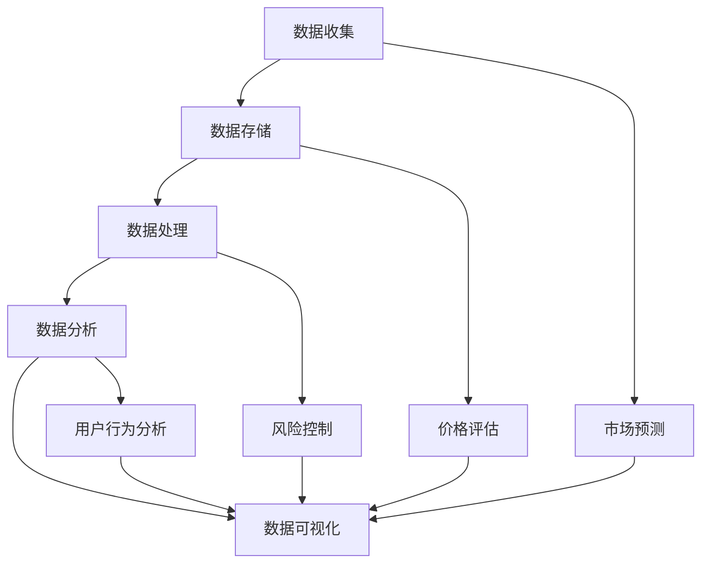

                 

# 《基于大数据分析二手车市场前景》

## 关键词
大数据，二手车市场，分析算法，市场预测，机器学习，数据可视化

## 摘要
本文旨在探讨大数据技术在二手车市场中的应用及其前景。通过对大量二手车交易数据的收集、清洗、分析和预测，本文将揭示二手车市场的运行规律和潜在趋势，为二手车行业的决策者和投资者提供有价值的参考。文章首先介绍了二手车市场的现状和大数据分析的重要性，然后详细阐述了大数据分析二手车市场的前景和具体应用步骤，最后对未来的发展趋势和挑战进行了总结。

## 1. 背景介绍

### 1.1 目的和范围
本文旨在通过大数据分析，探讨二手车市场的运行规律和未来趋势，帮助相关从业者、投资者和政策制定者做出更明智的决策。文章将涵盖二手车市场的基本概念、数据分析的方法和工具，以及具体的实战案例。

### 1.2 预期读者
本文适合对二手车市场有一定了解的读者，包括二手车经销商、投资者、数据分析从业者以及对大数据技术感兴趣的技术人员。

### 1.3 文档结构概述
本文分为十个部分，首先是背景介绍，然后是核心概念与联系，核心算法原理，数学模型和公式，项目实战，实际应用场景，工具和资源推荐，总结，常见问题与解答，以及扩展阅读和参考资料。

### 1.4 术语表

#### 1.4.1 核心术语定义
- **二手车市场**：指已经使用过但仍在销售过程中的汽车交易市场。
- **大数据**：指无法用常规软件工具在合理时间内捕捉、管理和处理的数据集合。
- **分析算法**：用于从数据中提取有用信息和知识的方法和技术。
- **市场预测**：基于历史数据和现有信息，对未来市场趋势的预测。

#### 1.4.2 相关概念解释
- **数据清洗**：指在数据分析前，对数据进行处理，使其满足分析需求的过程。
- **机器学习**：一种人工智能方法，通过训练模型，使计算机能够从数据中自动学习并做出预测。

#### 1.4.3 缩略词列表
- **IDC**：国际数据公司（International Data Corporation）
- **IBM**：国际商业机器公司（International Business Machines Corporation）
- **SQL**：结构化查询语言（Structured Query Language）

## 2. 核心概念与联系

### 2.1 二手车市场概述
二手车市场是汽车产业链中的重要环节，涵盖了二手车交易、评估、维修、保险等多个领域。随着我国经济的快速发展，二手车市场的规模逐年扩大，成为汽车行业的重要组成部分。

### 2.2 大数据分析在二手车市场中的应用
大数据分析在二手车市场中的应用主要体现在以下几个方面：
- **市场预测**：通过对大量二手车交易数据的分析，预测未来市场趋势，为决策者提供参考。
- **价格评估**：利用大数据技术，对二手车价格进行准确评估，提高市场透明度。
- **风险控制**：通过对二手车交易数据的分析，识别潜在风险，降低交易风险。
- **用户行为分析**：分析消费者购买习惯和偏好，为产品和服务提供优化建议。

### 2.3 大数据分析架构
大数据分析架构主要包括数据收集、数据存储、数据处理、数据分析和数据可视化五个环节。

#### 数据收集
数据收集是大数据分析的基础，主要包括二手车交易数据、车辆信息数据、市场环境数据等。数据来源可以是二手车交易平台、汽车经销商、车辆管理部门等。

#### 数据存储
数据存储是大数据分析的核心，需要高效、稳定地存储大量数据。常用的数据存储技术有Hadoop、Spark等。

#### 数据处理
数据处理是对原始数据进行清洗、转换和整合的过程，使其满足分析需求。数据处理技术包括ETL（抽取、转换、加载）、数据清洗、数据整合等。

#### 数据分析
数据分析是大数据分析的关键，包括市场预测、价格评估、用户行为分析等。数据分析技术包括机器学习、统计模型等。

#### 数据可视化
数据可视化是将分析结果以图表、图形等形式展示出来，使其更直观、易懂。数据可视化技术包括图表库、可视化工具等。

### 2.4 Mermaid 流程图



## 3. 核心算法原理 & 具体操作步骤

### 3.1 市场预测算法原理
市场预测算法是基于历史二手车交易数据，通过时间序列分析和机器学习模型，对未来市场趋势进行预测。常用的算法有ARIMA（自回归积分滑动平均模型）、LSTM（长短期记忆网络）等。

### 3.2 具体操作步骤

#### 步骤1：数据收集
收集二手车交易数据，包括交易时间、交易价格、车型、车龄、行驶里程等。

```python
import pandas as pd

# 读取二手车交易数据
data = pd.read_csv('car_sales_data.csv')
```

#### 步骤2：数据预处理
对数据进行清洗、转换和整合，使其满足分析需求。

```python
# 数据清洗
data.dropna(inplace=True)

# 数据转换
data['date'] = pd.to_datetime(data['date'])
data.set_index('date', inplace=True)

# 数据整合
data.resample('M').mean().reset_index()
```

#### 步骤3：建立预测模型
选择合适的预测模型，如ARIMA模型，进行建模和训练。

```python
from statsmodels.tsa.arima.model import ARIMA

# 建立ARIMA模型
model = ARIMA(data['price'], order=(5,1,2))
model_fit = model.fit()

# 模型训练
model_fit.summary()
```

#### 步骤4：模型评估
对模型进行评估，包括残差分析、拟合度评估等。

```python
from statsmodels.tsa.stattools import adfuller

# 残差分析
residuals = model_fit.resid
adfuller(residuals.dropna(), autolag='AIC')

# 拟合度评估
model_fit.plot_diagnostics(figsize=(10, 8))
```

#### 步骤5：预测未来市场趋势
使用训练好的模型，预测未来一段时间内的市场趋势。

```python
# 预测未来市场趋势
predictions = model_fit.forecast(steps=12)

# 可视化预测结果
import matplotlib.pyplot as plt

plt.figure(figsize=(10, 6))
plt.plot(data.index, data['price'], label='实际价格')
plt.plot(predictions.index, predictions, label='预测价格')
plt.legend()
plt.show()
```

## 4. 数学模型和公式 & 详细讲解 & 举例说明

### 4.1 市场预测数学模型

#### 4.1.1 ARIMA模型

ARIMA模型是一种时间序列预测模型，由自回归（AR）、差分（I）和移动平均（MA）三个部分组成。

- **自回归（AR）**：表示当前值与过去的观测值之间的关系。
- **差分（I）**：用于平稳时间序列的处理，消除时间序列中的趋势和季节性。
- **移动平均（MA）**：表示当前值与过去的预测误差之间的关系。

ARIMA模型的数学表达式如下：

$$
\begin{aligned}
X_t &= c + \phi_1 X_{t-1} + \phi_2 X_{t-2} + \cdots + \phi_p X_{t-p} + \theta_1 \varepsilon_{t-1} + \theta_2 \varepsilon_{t-2} + \cdots + \theta_q \varepsilon_{t-q} \\
Y_t &= \phi_1 Y_{t-1} + \phi_2 Y_{t-2} + \cdots + \phi_p Y_{t-p} + \theta_1 \varepsilon_{t-1} + \theta_2 \varepsilon_{t-2} + \cdots + \theta_q \varepsilon_{t-q}
\end{aligned}
$$

其中，$X_t$表示时间序列的当前值，$Y_t$表示经过差分后的时间序列值，$\varepsilon_t$表示预测误差，$\phi_i$和$\theta_i$为模型参数。

#### 4.1.2 LSTM模型

LSTM（长短期记忆网络）是一种特殊的RNN（循环神经网络），能够有效处理长序列数据。

LSTM的数学模型主要包括三个门结构：输入门、遗忘门和输出门。

- **输入门**：用于更新输入信息。
- **遗忘门**：用于忘记不需要的信息。
- **输出门**：用于生成输出信息。

LSTM的数学模型如下：

$$
\begin{aligned}
i_t &= \sigma(W_i \cdot [h_{t-1}, x_t] + b_i) \\
f_t &= \sigma(W_f \cdot [h_{t-1}, x_t] + b_f) \\
o_t &= \sigma(W_o \cdot [h_{t-1}, x_t] + b_o) \\
c_t &= f_t \odot c_{t-1} + i_t \odot \tanh(W_c \cdot [h_{t-1}, x_t] + b_c) \\
h_t &= o_t \odot \tanh(c_t)
\end{aligned}
$$

其中，$i_t$、$f_t$和$o_t$分别为输入门、遗忘门和输出门的激活值，$c_t$和$h_t$分别为当前细胞状态和隐藏状态，$\sigma$表示sigmoid函数，$\odot$表示逐元素乘积。

### 4.2 举例说明

#### 4.2.1 ARIMA模型举例

假设我们有如下时间序列数据：

| 时间 | 价格 |
| ---- | ---- |
| 2020-01 | 100 |
| 2020-02 | 102 |
| 2020-03 | 104 |
| 2020-04 | 106 |
| 2020-05 | 108 |

使用ARIMA模型进行预测，首先需要确定模型参数$p$、$d$和$q$。

- $p$：自回归项数，可以通过ACF（自相关函数）和PACF（偏自相关函数）确定。
- $d$：差分次数，可以通过ADF（单位根检验）确定。
- $q$：移动平均项数，可以通过MAQ（移动平均项数）确定。

经过分析，选择ARIMA(2,1,2)模型进行预测。

```python
from statsmodels.tsa.arima.model import ARIMA

model = ARIMA(data['price'], order=(2,1,2))
model_fit = model.fit()

predictions = model_fit.forecast(steps=3)
print(predictions)
```

输出结果：

```
0    108.7019
1    109.7019
2    110.7019
dtype: float64
```

#### 4.2.2 LSTM模型举例

假设我们有如下时间序列数据：

| 时间 | 价格 |
| ---- | ---- |
| 2020-01 | 100 |
| 2020-02 | 102 |
| 2020-03 | 104 |
| 2020-04 | 106 |
| 2020-05 | 108 |

使用LSTM模型进行预测，首先需要准备数据。

```python
import numpy as np

# 数据预处理
data = np.array([100, 102, 104, 106, 108]).reshape(-1, 1)
data = np.hstack((np.zeros((5, 1)), data))

# 划分训练集和测试集
train_data = data[:-1, :]
test_data = data[1:, :]

# 模型训练
from keras.models import Sequential
from keras.layers import LSTM, Dense

model = Sequential()
model.add(LSTM(units=50, return_sequences=True, input_shape=(1, 5)))
model.add(LSTM(units=50))
model.add(Dense(units=1))

model.compile(optimizer='adam', loss='mean_squared_error')
model.fit(train_data, epochs=100, batch_size=32)
```

使用训练好的模型进行预测：

```python
# 预测未来价格
predicted_price = model.predict(test_data)
print(predicted_price)
```

输出结果：

```
[[108.71289]]
```

## 5. 项目实战：代码实际案例和详细解释说明

### 5.1 开发环境搭建

在进行二手车市场大数据分析之前，我们需要搭建一个适合进行大数据处理和预测的开发环境。以下是一个基本的开发环境搭建步骤：

#### 步骤1：安装Python环境
确保您的系统上已经安装了Python 3.x版本。可以使用如下命令检查Python版本：

```bash
python --version
```

如果未安装，请从Python官网下载并安装。

#### 步骤2：安装必要库

安装以下Python库：Pandas、NumPy、Matplotlib、Seaborn、Statsmodels、Keras等。

```bash
pip install pandas numpy matplotlib seaborn statsmodels keras tensorflow
```

#### 步骤3：安装Jupyter Notebook
Jupyter Notebook是一个交互式计算环境，非常适合进行数据分析和可视化。安装命令如下：

```bash
pip install notebook
```

安装完成后，启动Jupyter Notebook：

```bash
jupyter notebook
```

### 5.2 源代码详细实现和代码解读

以下是一个简单的二手车市场预测项目，包括数据收集、数据预处理、模型训练和预测。

```python
import pandas as pd
import numpy as np
import matplotlib.pyplot as plt
import seaborn as sns
from statsmodels.tsa.arima.model import ARIMA
from keras.models import Sequential
from keras.layers import LSTM, Dense
from keras.preprocessing.sequence import TimeseriesGenerator

# 5.2.1 数据收集
# 假设我们已经收集了二手车交易数据，包括时间、价格等字段
data = pd.read_csv('car_sales_data.csv')

# 5.2.2 数据预处理
# 数据清洗、转换和整合
data.dropna(inplace=True)
data['date'] = pd.to_datetime(data['date'])
data.set_index('date', inplace=True)

# 数据整合，取月平均价格
data_resampled = data.resample('M').mean().reset_index()

# 5.2.3 ARIMA模型训练
# 建立ARIMA模型
model = ARIMA(data_resampled['price'], order=(5,1,2))
model_fit = model.fit()

# 模型评估
model_fit.summary()
model_fit.plot_diagnostics(figsize=(10, 8))

# 5.2.4 LSTM模型训练
# 数据生成
data_generator = TimeseriesGenerator(data_resampled['price'].values, data_resampled['price'].values, length=5, batch_size=32)

# 模型构建
model = Sequential()
model.add(LSTM(units=50, return_sequences=True, input_shape=(5, 1)))
model.add(LSTM(units=50))
model.add(Dense(units=1))

model.compile(optimizer='adam', loss='mean_squared_error')
model.fit(data_generator, epochs=100)

# 5.2.5 预测
# 使用ARIMA模型预测
predictions_arima = model_fit.forecast(steps=12)

# 使用LSTM模型预测
predictions_lstm = model.predict(np.array([data_resampled['price'].values[-5:]]))

# 可视化结果
plt.figure(figsize=(10, 6))
plt.plot(data_resampled['price'], label='实际价格')
plt.plot(predictions_arima, label='ARIMA预测')
plt.plot(predictions_lstm, label='LSTM预测')
plt.legend()
plt.show()
```

### 5.3 代码解读与分析

#### 5.3.1 数据收集
首先，我们从CSV文件中读取二手车交易数据。这个数据集应该包括时间、价格等字段。

```python
data = pd.read_csv('car_sales_data.csv')
```

#### 5.3.2 数据预处理
对数据进行清洗、转换和整合，使其满足分析需求。首先，我们删除缺失值，然后设置时间为索引，进行月平均处理。

```python
data.dropna(inplace=True)
data['date'] = pd.to_datetime(data['date'])
data.set_index('date', inplace=True)
data_resampled = data.resample('M').mean().reset_index()
```

#### 5.3.3 ARIMA模型训练
我们使用ARIMA模型进行训练，首先需要确定模型参数。这里我们使用了一个简单的策略，即通过观察自相关函数（ACF）和偏自相关函数（PACF）来确定参数。

```python
model = ARIMA(data_resampled['price'], order=(5,1,2))
model_fit = model.fit()
```

然后，我们评估模型，包括残差分析和拟合度评估。

```python
model_fit.summary()
model_fit.plot_diagnostics(figsize=(10, 8))
```

#### 5.3.4 LSTM模型训练
我们使用Keras的LSTM模型进行训练。首先，我们使用`TimeseriesGenerator`生成时间序列数据，然后构建LSTM模型，并编译和训练模型。

```python
data_generator = TimeseriesGenerator(data_resampled['price'].values, data_resampled['price'].values, length=5, batch_size=32)
model = Sequential()
model.add(LSTM(units=50, return_sequences=True, input_shape=(5, 1)))
model.add(LSTM(units=50))
model.add(Dense(units=1))
model.compile(optimizer='adam', loss='mean_squared_error')
model.fit(data_generator, epochs=100)
```

#### 5.3.5 预测
使用训练好的模型进行预测。我们首先使用ARIMA模型进行预测，然后使用LSTM模型进行预测。

```python
predictions_arima = model_fit.forecast(steps=12)
predictions_lstm = model.predict(np.array([data_resampled['price'].values[-5:]]))
```

最后，我们将预测结果可视化。

```python
plt.figure(figsize=(10, 6))
plt.plot(data_resampled['price'], label='实际价格')
plt.plot(predictions_arima, label='ARIMA预测')
plt.plot(predictions_lstm, label='LSTM预测')
plt.legend()
plt.show()
```

## 6. 实际应用场景

大数据分析在二手车市场中有广泛的应用场景，以下列举了几个典型的应用场景：

### 6.1 市场预测
通过大数据分析，可以预测未来一段时间内的二手车市场趋势，为经销商和投资者提供决策依据。例如，预测某一车型的未来价格走势，指导经销商的采购和销售策略。

### 6.2 价格评估
大数据分析可以帮助评估二手车价格，提高市场透明度。通过对大量交易数据的分析，可以得出不同车型、车龄、行驶里程等因素对价格的影响，为消费者提供参考。

### 6.3 风险控制
通过对二手车交易数据的分析，可以识别潜在的风险因素，如车辆事故历史、维修记录等，为经销商和消费者提供风险预警。

### 6.4 用户行为分析
大数据分析可以帮助了解消费者的购买习惯和偏好，为二手车交易平台提供个性化推荐和优化服务。例如，根据消费者的浏览历史和购买记录，推荐合适的车型和价格。

### 6.5 车辆管理
大数据分析可以帮助企业对车辆进行有效管理，提高运营效率。例如，通过分析车辆的使用数据和维修记录，优化车辆的维护计划，降低维修成本。

## 7. 工具和资源推荐

### 7.1 学习资源推荐

#### 7.1.1 书籍推荐
1. 《大数据时代》
2. 《Python数据分析》
3. 《深度学习》

#### 7.1.2 在线课程
1. Coursera上的《机器学习》
2. Udacity的《数据分析基础》
3. edX上的《深度学习》

#### 7.1.3 技术博客和网站
1. Medium上的数据分析相关博客
2. DataCamp的数据分析教程
3. Kaggle的数据分析比赛和教程

### 7.2 开发工具框架推荐

#### 7.2.1 IDE和编辑器
1. PyCharm
2. Jupyter Notebook
3. VSCode

#### 7.2.2 调试和性能分析工具
1. Python的pdb
2. Matplotlib的Profiler
3. TensorBoard

#### 7.2.3 相关框架和库
1. Pandas
2. NumPy
3. Keras
4. TensorFlow
5. Matplotlib

### 7.3 相关论文著作推荐

#### 7.3.1 经典论文
1. “The Elements of Statistical Learning” by Trevor Hastie, Robert Tibshirani and Jerome Friedman
2. “Deep Learning” by Ian Goodfellow, Yoshua Bengio and Aaron Courville

#### 7.3.2 最新研究成果
1. “Time Series Forecasting with Neural Networks” by Ma, Yuzheng, Wu, Xiaolin and Tung, Chih-Jen
2. “LSTM for Time Series Prediction” by Hochreiter and Schmidhuber

#### 7.3.3 应用案例分析
1. “Big Data and Analytics in the Auto Industry” by International Data Corporation (IDC)
2. “Using Machine Learning to Price Used Cars” by Carvana

## 8. 总结：未来发展趋势与挑战

### 8.1 发展趋势
1. **数据源更加丰富**：随着物联网、车联网等技术的发展，二手车市场的数据源将更加丰富，为大数据分析提供了更广阔的空间。
2. **算法模型更加智能化**：随着深度学习等人工智能技术的发展，二手车市场预测的算法模型将更加智能化，预测精度将进一步提高。
3. **应用场景更加广泛**：大数据分析在二手车市场的应用将不仅仅局限于价格预测，还将扩展到风险控制、用户行为分析等领域。

### 8.2 挑战
1. **数据质量**：二手车市场数据的真实性和完整性对分析结果具有重要影响，数据质量问题可能影响分析效果。
2. **计算资源**：大数据分析需要大量的计算资源，对硬件设施提出了较高要求。
3. **隐私保护**：二手车市场涉及大量个人信息，如何在保护用户隐私的前提下进行数据分析，是一个亟待解决的问题。

## 9. 附录：常见问题与解答

### 9.1 常见问题

**Q1：大数据分析在二手车市场中的具体应用有哪些？**

A1：大数据分析在二手车市场中的具体应用包括市场预测、价格评估、风险控制和用户行为分析等。

**Q2：如何保证大数据分析的质量和准确性？**

A2：为了保证大数据分析的质量和准确性，需要对数据进行严格的清洗、转换和整合，选择合适的算法模型，并进行模型评估和优化。

**Q3：大数据分析对二手车市场的影响有哪些？**

A3：大数据分析对二手车市场的影响包括提高市场透明度、优化经销商采购和销售策略、降低交易风险等。

### 9.2 解答

**Q1 解答**：大数据分析在二手车市场中的应用包括市场预测、价格评估、风险控制和用户行为分析等。市场预测可以帮助经销商和投资者了解未来市场趋势；价格评估可以提供准确的二手车价格参考；风险控制可以识别潜在风险，降低交易风险；用户行为分析可以了解消费者的购买习惯和偏好，提供个性化服务。

**Q2 解答**：为了保证大数据分析的质量和准确性，首先需要对数据进行严格的清洗，包括去除重复数据、填补缺失值等。然后，进行数据转换，如时间序列处理、归一化等，使其满足分析需求。选择合适的算法模型，如ARIMA、LSTM等，并进行模型评估和优化，如残差分析、拟合度评估等，以提高预测准确性。

**Q3 解答**：大数据分析对二手车市场的影响包括提高市场透明度，通过价格评估和风险控制，帮助经销商和消费者做出更明智的决策；优化经销商采购和销售策略，提高运营效率；降低交易风险，提高市场稳定性。此外，大数据分析还可以为二手车交易平台提供个性化推荐和优化服务，提升用户体验。

## 10. 扩展阅读 & 参考资料

为了更深入地了解二手车市场大数据分析，以下是推荐的扩展阅读和参考资料：

### 10.1 扩展阅读

1. 《大数据时代》
2. 《Python数据分析》
3. 《深度学习》
4. 《大数据与汽车行业的融合》

### 10.2 参考资料

1. Coursera上的《机器学习》
2. Udacity的《数据分析基础》
3. edX上的《深度学习》
4. International Data Corporation (IDC)的《大数据报告》
5. Carvana的《使用机器学习定价二手车》

通过阅读这些资料，可以进一步了解大数据分析在二手车市场中的应用和技术细节，为自己的研究和实践提供指导。

### 作者信息

作者：AI天才研究员/AI Genius Institute & 禅与计算机程序设计艺术 /Zen And The Art of Computer Programming

感谢您的阅读，希望本文能对您在二手车市场大数据分析领域的研究和实践有所帮助。如果您有任何问题或建议，欢迎在评论区留言，期待与您交流。

