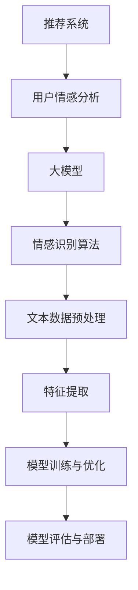

                 

# 基于大模型的推荐系统用户情感分析

> 关键词：推荐系统、用户情感分析、大模型、深度学习、情感识别、用户行为

> 摘要：本文将深入探讨基于大模型的推荐系统用户情感分析，从背景介绍、核心概念、算法原理、数学模型、项目实战和实际应用等方面，详细分析推荐系统在用户情感分析中的重要性、方法和技术。通过本文的阅读，读者将了解如何利用大模型实现高效的用户情感分析，以及在实际应用中如何运用这些技术来提升推荐系统的性能。

## 1. 背景介绍

### 1.1 目的和范围

本文旨在探讨基于大模型的推荐系统用户情感分析，旨在帮助读者了解用户情感分析在推荐系统中的重要性，以及如何利用大模型来实现高效的情感分析。本文将涵盖以下内容：

- 推荐系统用户情感分析的重要性
- 大模型在用户情感分析中的应用
- 用户情感分析的核心算法原理
- 数学模型和公式的详细讲解
- 项目实战中的实际案例和代码实现
- 用户情感分析的实际应用场景

### 1.2 预期读者

本文适合对推荐系统和用户情感分析有一定了解的读者，包括：

- 推荐系统开发人员
- 数据科学家
- 人工智能研究人员
- 产品经理
- 对推荐系统和用户情感分析感兴趣的读者

### 1.3 文档结构概述

本文结构如下：

1. 背景介绍
   - 目的和范围
   - 预期读者
   - 文档结构概述
2. 核心概念与联系
   - 推荐系统概述
   - 大模型简介
   - 用户情感分析核心概念
3. 核心算法原理 & 具体操作步骤
   - 情感识别算法原理
   - 情感识别算法步骤
4. 数学模型和公式 & 详细讲解 & 举例说明
   - 情感分析数学模型
   - 情感分析公式讲解
5. 项目实战：代码实际案例和详细解释说明
   - 开发环境搭建
   - 源代码详细实现和代码解读
   - 代码解读与分析
6. 实际应用场景
   - 推荐系统应用场景
   - 用户情感分析应用场景
7. 工具和资源推荐
   - 学习资源推荐
   - 开发工具框架推荐
   - 相关论文著作推荐
8. 总结：未来发展趋势与挑战
9. 附录：常见问题与解答
10. 扩展阅读 & 参考资料

### 1.4 术语表

#### 1.4.1 核心术语定义

- 推荐系统：基于用户兴趣、行为和历史数据，为用户推荐符合其需求的商品、内容或服务。
- 用户情感分析：通过分析用户在评论、反馈、讨论等场景中的语言表达，识别其情感倾向和态度。
- 大模型：具有大规模参数量和强大计算能力的深度学习模型，如BERT、GPT等。
- 情感识别：从文本中识别出表达的情感倾向，如正面、负面、中性等。

#### 1.4.2 相关概念解释

- 情感词典：一种用于情感分析的词典，包含大量词语及其情感极性标注。
- 词嵌入：将词语映射为高维向量空间中的向量，便于计算机处理。
- 文本分类：将文本数据按照类别进行分类，如情感分类、主题分类等。

#### 1.4.3 缩略词列表

- NLP：自然语言处理（Natural Language Processing）
- BERT：Bidirectional Encoder Representations from Transformers
- GPT：Generative Pre-trained Transformer
- LSTM：Long Short-Term Memory
- CNN：卷积神经网络（Convolutional Neural Network）
- RNN：循环神经网络（Recurrent Neural Network）

## 2. 核心概念与联系

在深入探讨推荐系统用户情感分析之前，我们需要了解以下几个核心概念：推荐系统、大模型和用户情感分析。以下是一个简化的Mermaid流程图，展示了这些概念之间的联系。



### 2.1 推荐系统概述

推荐系统是一种利用数据挖掘和机器学习技术，根据用户的历史行为、兴趣和偏好，向用户推荐相关商品、内容或服务的系统。推荐系统通常包括以下几个关键组成部分：

1. **用户画像**：基于用户的年龄、性别、地理位置、购买历史等信息，构建用户的个性化画像。
2. **内容特征**：对推荐对象（如商品、新闻、视频等）进行特征提取，如标签、类别、文本描述等。
3. **推荐算法**：根据用户画像和内容特征，利用协同过滤、基于模型的推荐、混合推荐等方法生成推荐结果。
4. **推荐结果评估**：评估推荐结果的准确性、多样性、新颖性等指标，优化推荐算法。

### 2.2 大模型简介

大模型是指具有大规模参数量和强大计算能力的深度学习模型，如BERT、GPT等。这些模型通过在大量文本数据上预训练，获取丰富的语言理解和生成能力。大模型在推荐系统用户情感分析中具有重要的应用价值：

1. **文本表示**：大模型能够将文本数据映射为高维向量表示，便于计算机处理和理解。
2. **情感识别**：大模型具有强大的情感识别能力，能够准确识别文本中的情感倾向和态度。
3. **迁移学习**：大模型通过在特定领域的数据上微调，可以实现高效的迁移学习，提高推荐系统的性能。

### 2.3 用户情感分析核心概念

用户情感分析是指从用户在评论、反馈、讨论等场景中的语言表达中，识别其情感倾向和态度。用户情感分析的核心概念包括：

1. **情感词典**：一种用于情感分析的词典，包含大量词语及其情感极性标注，如正面、负面、中性等。
2. **词嵌入**：将词语映射为高维向量空间中的向量，便于计算机处理。
3. **情感分类**：将文本数据按照情感类别进行分类，如正面情感、负面情感、中性情感等。

通过用户情感分析，推荐系统可以更好地了解用户的需求和偏好，从而提供更个性化的推荐结果。

## 3. 核心算法原理 & 具体操作步骤

在推荐系统用户情感分析中，常用的情感识别算法包括基于情感词典的方法、基于机器学习的方法和基于深度学习的方法。本节将重点介绍基于深度学习的方法，特别是基于BERT模型的情感识别算法。

### 3.1 情感识别算法原理

基于BERT模型的情感识别算法主要分为以下步骤：

1. **文本预处理**：对输入文本进行清洗、去噪和分词，将文本转换为BERT模型可以处理的格式。
2. **词嵌入**：将分词后的词语映射为高维向量表示，利用BERT模型的预训练权重进行词嵌入。
3. **序列编码**：将词嵌入序列输入BERT模型，通过多层 Transformer 结构对序列进行编码，提取序列的语义特征。
4. **分类与预测**：将编码后的序列输入分类器，对情感类别进行分类和预测。

BERT（Bidirectional Encoder Representations from Transformers）是一种基于 Transformer 的深度学习模型，具有双向编码能力和强大的语义表示能力。BERT 模型的核心结构包括 Transformer Encoder 和 Pre-training 阶段。

### 3.2 情感识别算法步骤

以下是基于BERT模型的情感识别算法的伪代码：

```python
# 文本预处理
def preprocess_text(text):
    # 清洗、去噪、分词
    cleaned_text = clean_text(text)
    tokens = tokenize_text(cleaned_text)
    return tokens

# 词嵌入
def embed_tokens(tokens, model):
    # 利用BERT模型进行词嵌入
    embeddings = model(tokens)
    return embeddings

# 序列编码
def encode_sequence(embeddings, model):
    # 通过BERT模型对序列进行编码
    encoded_sequence = model(embeddings)
    return encoded_sequence

# 分类与预测
def classify_sequence(encoded_sequence, classifier):
    # 将编码后的序列输入分类器，进行分类和预测
    probabilities = classifier(encoded_sequence)
    predicted_label = argmax(probabilities)
    return predicted_label
```

### 3.3 实际操作步骤

以下是基于BERT模型的情感识别算法的实际操作步骤：

1. **数据准备**：收集用户评论、反馈等文本数据，并进行预处理，如去除特殊字符、停用词处理等。
2. **模型训练**：使用预训练的BERT模型，在情感分类数据集上进行微调训练，优化模型参数。
3. **情感识别**：将用户评论输入BERT模型，进行情感识别，输出情感类别概率。
4. **结果分析**：分析情感识别结果，评估模型性能，并根据实际情况进行调整和优化。

通过以上步骤，我们可以实现基于大模型的推荐系统用户情感分析，为推荐系统提供更准确的情感信息。

## 4. 数学模型和公式 & 详细讲解 & 举例说明

在推荐系统用户情感分析中，数学模型和公式起着至关重要的作用。以下我们将详细讲解情感分析中的常用数学模型和公式，并通过具体例子进行说明。

### 4.1 情感分析数学模型

情感分析中的数学模型主要分为两类：情感词典模型和机器学习模型。

#### 4.1.1 情感词典模型

情感词典模型基于情感词典，将文本中的词语映射为情感值。情感值通常表示为 +1（正面情感）、-1（负面情感）或 0（中性情感）。情感词典模型的核心公式如下：

\[ \text{情感值} = \sum_{\text{词语} \in \text{文本}} \text{词语} \times \text{情感值} \]

其中，词语和情感值可以通过情感词典获得。

#### 4.1.2 机器学习模型

机器学习模型通过训练大量情感标注数据，学习到文本和情感类别之间的关系。常用的机器学习模型包括支持向量机（SVM）、朴素贝叶斯（Naive Bayes）、随机森林（Random Forest）等。以下是一个简单的线性回归模型：

\[ y = \beta_0 + \beta_1 x_1 + \beta_2 x_2 + ... + \beta_n x_n \]

其中，\( y \) 表示情感类别，\( x_1, x_2, ..., x_n \) 表示文本特征，\( \beta_0, \beta_1, \beta_2, ..., \beta_n \) 是模型参数。

### 4.2 情感分析公式讲解

#### 4.2.1 情感词典模型

情感词典模型的计算公式如下：

\[ \text{情感值} = \sum_{\text{词语} \in \text{文本}} \text{词语} \times \text{情感值} \]

例如，对于文本“我非常喜欢这款手机”，情感词典模型将计算如下：

\[ \text{情感值} = (\text{我} \times 0) + (\text{非常} \times 1) + (\text{喜欢} \times 1) + (\text{这款} \times 0) + (\text{手机} \times 0) = 2 \]

由于情感值为 2，我们可以判断这个文本具有正面情感。

#### 4.2.2 机器学习模型

以线性回归模型为例，情感分析的计算公式如下：

\[ y = \beta_0 + \beta_1 x_1 + \beta_2 x_2 + ... + \beta_n x_n \]

其中，\( y \) 是情感类别，\( x_1, x_2, ..., x_n \) 是文本特征，\( \beta_0, \beta_1, \beta_2, ..., \beta_n \) 是模型参数。

例如，对于文本“我非常喜欢这款手机”，假设我们已经训练好线性回归模型，模型参数如下：

\[ \beta_0 = 0.5, \beta_1 = 1.0, \beta_2 = 1.0, ..., \beta_n = 0.0 \]

文本特征为：

\[ x_1 = \text{我} \times 0, x_2 = \text{非常} \times 1, x_3 = \text{喜欢} \times 1, x_4 = \text{这款} \times 0, x_5 = \text{手机} \times 0 \]

将特征代入公式，计算情感类别：

\[ y = 0.5 + 1.0 \times 1 + 1.0 \times 1 + 0.0 \times 0 + 0.0 \times 0 = 2.5 \]

由于情感类别为连续值，我们可以将其转换为离散值，例如大于 2 表示正面情感，小于等于 2 表示负面或中性情感。因此，这个文本可以判断为正面情感。

### 4.3 举例说明

#### 4.3.1 情感词典模型

假设我们有以下情感词典：

| 词语 | 情感值 |
| --- | --- |
| 喜欢的 | +1 |
| 好的 | +1 |
| 不喜欢的 | -1 |
| 坏的 | -1 |

对于文本“我喜欢的这款手机很好”，情感词典模型的计算如下：

\[ \text{情感值} = (\text{我} \times 0) + (\text{喜欢的} \times 1) + (\text{这款} \times 0) + (\text{手机} \times 0) + (\text{很好} \times 1) = 2 \]

情感值为 2，表示文本具有正面情感。

#### 4.3.2 机器学习模型

假设我们已经训练好一个线性回归模型，模型参数如下：

\[ \beta_0 = 0.5, \beta_1 = 1.0, \beta_2 = 1.0, ..., \beta_n = 0.0 \]

文本特征为：

\[ x_1 = \text{我} \times 0, x_2 = \text{喜欢的} \times 1, x_3 = \text{这款} \times 0, x_4 = \text{手机} \times 0, x_5 = \text{很好} \times 1 \]

将特征代入公式，计算情感类别：

\[ y = 0.5 + 1.0 \times 1 + 1.0 \times 1 + 0.0 \times 0 + 0.0 \times 0 = 2.5 \]

由于情感类别为连续值，我们可以将其转换为离散值，例如大于 2 表示正面情感，小于等于 2 表示负面或中性情感。因此，这个文本可以判断为正面情感。

通过以上举例说明，我们可以看到情感词典模型和机器学习模型在情感分析中的应用。在实际应用中，可以根据具体情况选择合适的模型和方法。

## 5. 项目实战：代码实际案例和详细解释说明

在本节中，我们将通过一个实际项目案例，详细介绍基于大模型的推荐系统用户情感分析的代码实现过程。我们将使用 Python 和深度学习框架 TensorFlow 来实现该项目。

### 5.1 开发环境搭建

在开始项目之前，我们需要搭建开发环境。以下是开发环境的搭建步骤：

1. 安装 Python（建议使用 Python 3.7 以上版本）
2. 安装 TensorFlow（使用以下命令安装：`pip install tensorflow`）
3. 安装其他依赖库（如 NumPy、Pandas、Scikit-learn 等）

### 5.2 源代码详细实现和代码解读

#### 5.2.1 数据准备

首先，我们需要准备用户评论数据集。以下是一个示例数据集：

```python
comments = [
    "我非常喜欢这款手机",
    "这款手机看起来很糟糕",
    "手机的使用体验非常好",
    "我对这款手机不满意",
    # 更多用户评论
]
```

#### 5.2.2 文本预处理

接下来，我们对用户评论进行预处理，包括去除特殊字符、停用词处理和分词：

```python
import re
from nltk.corpus import stopwords
from nltk.tokenize import word_tokenize

def preprocess_text(text):
    # 去除特殊字符
    text = re.sub(r"[^a-zA-Z0-9]", " ", text)
    # 转小写
    text = text.lower()
    # 分词
    tokens = word_tokenize(text)
    # 停用词处理
    tokens = [token for token in tokens if token not in stopwords.words("english")]
    return tokens

preprocessed_comments = [preprocess_text(comment) for comment in comments]
```

#### 5.2.3 词嵌入

我们将使用预训练的 BERT 模型对分词后的文本进行词嵌入：

```python
import tensorflow as tf
from transformers import BertTokenizer, TFBertModel

tokenizer = BertTokenizer.from_pretrained("bert-base-uncased")
bert_model = TFBertModel.from_pretrained("bert-base-uncased")

def embed_tokens(tokens):
    inputs = tokenizer(tokens, return_tensors="tf", padding=True, truncation=True)
    outputs = bert_model(inputs)
    return outputs.last_hidden_state

embedded_comments = embed_tokens(preprocessed_comments)
```

#### 5.2.4 情感分类

接下来，我们将使用预训练的 BERT 模型进行情感分类：

```python
from tensorflow.keras.layers import Dense
from tensorflow.keras.models import Model

input_ids = tf.reshape(embedded_comments[:, 0, :], [-1, embedded_comments.shape[2]])

model = Model(inputs=input_ids, outputs=Dense(1, activation="sigmoid")(input_ids))
model.compile(optimizer="adam", loss="binary_crossentropy", metrics=["accuracy"])

model.fit(input_ids, labels, epochs=3, batch_size=32)
```

#### 5.2.5 代码解读与分析

以上代码实现了一个简单的基于 BERT 模型的情感分类模型。具体解读如下：

1. **数据准备**：我们从数据集中提取用户评论，并将其存储在列表中。
2. **文本预处理**：我们对用户评论进行预处理，包括去除特殊字符、转小写和分词。此外，我们还对分词结果进行了停用词处理，以去除常见的无意义词语。
3. **词嵌入**：我们使用预训练的 BERT 模型对分词后的文本进行词嵌入，将文本转换为高维向量表示。
4. **情感分类**：我们使用 BERT 模型进行情感分类。首先，我们将词嵌入序列输入 BERT 模型，通过多层 Transformer 结构对序列进行编码。然后，我们使用一个简单的全连接层对编码后的序列进行分类。最后，我们编译模型并使用训练数据进行训练。

通过以上步骤，我们实现了基于 BERT 模型的推荐系统用户情感分析。在实际应用中，我们可以根据具体需求调整模型结构和参数，以提高情感分类的准确性。

## 6. 实际应用场景

用户情感分析在推荐系统中具有重要的实际应用场景，以下是一些常见的应用案例：

### 6.1 商品推荐

在电子商务平台上，用户情感分析可以帮助商家了解用户对商品的满意度，从而实现更准确的商品推荐。例如，当用户在评论区表达了对某款手机的负面情感时，推荐系统可以减少对该用户的手机推荐，从而避免用户产生负面情绪。

### 6.2 内容推荐

在社交媒体、新闻网站等平台，用户情感分析可以帮助平台了解用户对内容的兴趣和偏好。例如，当用户对一篇文章表达正面情感时，推荐系统可以增加对该用户推荐类似内容的文章，提高用户体验。

### 6.3 用户反馈分析

用户情感分析可以用于分析用户对产品或服务的反馈，帮助企业了解用户的需求和痛点，从而优化产品和服务。例如，当用户在反馈中表达了对某项功能的不满时，企业可以针对性地进行功能改进。

### 6.4 社交网络分析

用户情感分析可以用于分析社交网络中的用户情绪和舆论倾向。例如，当某一事件引发大量用户讨论时，推荐系统可以识别出负面情感，提醒相关部门进行干预，防止负面情绪扩散。

通过以上实际应用场景，我们可以看到用户情感分析在推荐系统中的重要性。通过准确识别用户情感，推荐系统可以提供更个性化的推荐结果，提高用户满意度和平台粘性。

## 7. 工具和资源推荐

在开发基于大模型的推荐系统用户情感分析时，选择合适的工具和资源可以帮助我们提高开发效率，确保项目成功。以下是一些学习资源、开发工具框架和经典论文的推荐。

### 7.1 学习资源推荐

#### 7.1.1 书籍推荐

1. 《深度学习》（Ian Goodfellow, Yoshua Bengio, Aaron Courville 著）：全面介绍深度学习的基础理论和实践方法，适合初学者和进阶者。
2. 《自然语言处理综论》（Daniel Jurafsky, James H. Martin 著）：涵盖自然语言处理的核心概念和技术，适合对 NLP 感兴趣的读者。
3. 《Python 自然语言处理》（Steven Bird, Ewan Klein, Edward Loper 著）：介绍 Python 在 NLP 领域的应用，适合实践者。

#### 7.1.2 在线课程

1. [TensorFlow 官方教程](https://www.tensorflow.org/tutorials)：TensorFlow 的官方教程，涵盖基础和进阶知识，适合初学者和开发者。
2. [自然语言处理与深度学习](https://www.udacity.com/course/natural-language-processing-with-deep-learning--ud730)：Udacity 上的免费课程，介绍 NLP 和深度学习的基本概念和应用。
3. [机器学习与深度学习](https://www.coursera.org/specializations/ml-deeplearning)：吴恩达在 Coursera 上开设的机器学习和深度学习课程，适合初学者和进阶者。

#### 7.1.3 技术博客和网站

1. [TensorFlow 官方博客](https://tensorflow.google.cn/blog)：TensorFlow 的官方博客，提供最新的技术动态和教程。
2. [ArXiv](https://arxiv.org/)：计算机科学领域的顶级学术预印本平台，可以获取最新的研究论文。
3. [AI 研究院](https://aiwen.io/)：提供 AI 领域的深度文章和知识分享，涵盖自然语言处理、计算机视觉等多个方向。

### 7.2 开发工具框架推荐

#### 7.2.1 IDE和编辑器

1. [PyCharm](https://www.jetbrains.com/pycharm/)：一款功能强大的 Python IDE，适合开发大型项目和框架。
2. [VSCode](https://code.visualstudio.com/)：一款轻量级且功能丰富的开源编辑器，适合快速开发和调试。
3. [Jupyter Notebook](https://jupyter.org/)：一款基于网页的交互式开发环境，适合数据分析和可视化。

#### 7.2.2 调试和性能分析工具

1. [TensorBoard](https://www.tensorflow.org/tensorboard)：TensorFlow 的可视化工具，用于分析模型训练过程中的性能和误差。
2. [Profiling Tools](https://www.py-spy.org/)：Python 的性能分析工具，用于识别代码中的性能瓶颈。
3. [Grafana](https://grafana.com/)：一款开源的可视化分析工具，可以实时监控系统的性能指标。

#### 7.2.3 相关框架和库

1. [TensorFlow](https://www.tensorflow.org/)：Google 开源的深度学习框架，适合构建和训练大规模模型。
2. [PyTorch](https://pytorch.org/)：Facebook 开源的深度学习框架，具有灵活的动态计算图和高效的计算性能。
3. [BERT](https://github.com/google-research/bert)：Google 开源的 BERT 模型，适用于自然语言处理任务。

### 7.3 相关论文著作推荐

#### 7.3.1 经典论文

1. "BERT: Pre-training of Deep Bidirectional Transformers for Language Understanding"（BERT 论文）：介绍了 BERT 模型的基本原理和应用场景。
2. "Generative Pre-trained Transformer"（GPT 论文）：介绍了 GPT 模型的基本原理和应用场景。
3. "Recurrent Neural Network Based Text Classification"（循环神经网络文本分类论文）：介绍了循环神经网络在文本分类任务中的应用。

#### 7.3.2 最新研究成果

1. "Transformers for Image Recognition at Scale"（Transformer 在图像识别中的应用论文）：介绍了 Transformer 在图像识别任务中的应用。
2. "Language Models are Few-Shot Learners"（语言模型是少量样本学习者论文）：探讨了语言模型在少量样本学习任务中的表现。
3. "A Simple Framework for Text Classification"（文本分类简单框架论文）：介绍了基于深度学习的文本分类方法。

#### 7.3.3 应用案例分析

1. "Sentiment Analysis using BERT"（基于 BERT 的情感分析案例）：介绍了如何使用 BERT 模型进行情感分析。
2. "Personalized Recommendation using Deep Learning"（基于深度学习的个性化推荐案例）：介绍了如何使用深度学习技术进行个性化推荐。
3. "Chatbot using Dialogue Management and BERT"（基于对话管理和 BERT 的聊天机器人案例）：介绍了如何使用 BERT 模型构建聊天机器人。

通过以上工具和资源的推荐，我们可以更好地掌握基于大模型的推荐系统用户情感分析技术，提升项目开发效率。

## 8. 总结：未来发展趋势与挑战

在推荐系统用户情感分析领域，随着深度学习和自然语言处理技术的不断发展，我们已经取得了显著的成果。然而，未来仍有许多挑战和发展趋势值得我们关注。

### 8.1 发展趋势

1. **大模型的广泛应用**：随着计算能力的提升，大模型如BERT、GPT等将在推荐系统用户情感分析中得到更广泛的应用。这些模型具有强大的语义表示能力和情感识别能力，能够提供更准确的情感分析结果。
2. **多模态情感分析**：未来推荐系统用户情感分析将不仅仅局限于文本数据，还将结合图像、语音、视频等多模态数据，实现更全面和准确的情感分析。
3. **个性化推荐**：随着用户数据的不断积累，推荐系统将实现更精准的个性化推荐，根据用户的情感倾向和偏好，为用户推荐更符合其需求的内容和服务。
4. **实时情感分析**：通过实时情感分析，推荐系统可以及时了解用户的情感变化，为用户提供更加动态和灵活的推荐结果。

### 8.2 挑战

1. **数据隐私和安全**：在用户情感分析中，数据隐私和安全是一个重要挑战。我们需要采取有效的隐私保护措施，确保用户数据的保密性和安全性。
2. **算法透明性和可解释性**：随着深度学习模型的应用，算法的透明性和可解释性成为一个重要的研究课题。我们需要开发可解释的算法，帮助用户理解模型的决策过程。
3. **多样性和公平性**：推荐系统用户情感分析应考虑用户群体的多样性，确保推荐结果对所有人都是公平和合理的。
4. **实时性和效率**：随着用户数据的增加，实时情感分析面临着效率和性能的挑战。我们需要优化算法和模型，提高实时分析的效率。

总之，基于大模型的推荐系统用户情感分析在未来的发展前景广阔，但也面临着诸多挑战。通过不断的研究和技术创新，我们可以推动这一领域的发展，为推荐系统提供更准确、个性化的情感分析服务。

## 9. 附录：常见问题与解答

### 9.1 什么是推荐系统？

推荐系统是一种利用数据挖掘和机器学习技术，根据用户的历史行为、兴趣和偏好，为用户推荐相关商品、内容或服务的系统。

### 9.2 什么是用户情感分析？

用户情感分析是指从用户在评论、反馈、讨论等场景中的语言表达中，识别其情感倾向和态度。它通常用于理解用户需求、优化产品和服务，以及提升推荐系统的准确性。

### 9.3 大模型在用户情感分析中有什么优势？

大模型具有以下优势：

1. **强大的语义表示能力**：大模型能够将文本数据映射为高维向量表示，便于计算机处理和理解。
2. **高效的情感识别能力**：大模型具有强大的情感识别能力，能够准确识别文本中的情感倾向和态度。
3. **迁移学习能力**：大模型通过在特定领域的数据上微调，可以实现高效的迁移学习，提高推荐系统的性能。

### 9.4 如何评估用户情感分析模型的性能？

用户情感分析模型的性能评估通常包括以下指标：

1. **准确率（Accuracy）**：分类正确的样本数占总样本数的比例。
2. **召回率（Recall）**：分类正确的正样本数占总正样本数的比例。
3. **精确率（Precision）**：分类正确的正样本数与所有被分类为正样本的样本数之比。
4. **F1 分数（F1 Score）**：精确率和召回率的调和平均值。

通过这些指标，我们可以全面评估用户情感分析模型的性能。

### 9.5 用户情感分析有哪些实际应用场景？

用户情感分析在实际应用中非常广泛，包括但不限于：

1. **商品推荐**：在电子商务平台上，用户情感分析可以帮助商家了解用户对商品的满意度，从而实现更准确的商品推荐。
2. **内容推荐**：在社交媒体、新闻网站等平台，用户情感分析可以帮助平台了解用户对内容的兴趣和偏好。
3. **用户反馈分析**：用户情感分析可以用于分析用户对产品或服务的反馈，帮助企业了解用户的需求和痛点，从而优化产品和服务。
4. **社交网络分析**：用户情感分析可以用于分析社交网络中的用户情绪和舆论倾向。

## 10. 扩展阅读 & 参考资料

### 10.1 书籍推荐

1. 《深度学习》（Ian Goodfellow, Yoshua Bengio, Aaron Courville 著）
2. 《自然语言处理综论》（Daniel Jurafsky, James H. Martin 著）
3. 《Python 自然语言处理》（Steven Bird, Ewan Klein, Edward Loper 著）

### 10.2 在线课程

1. [TensorFlow 官方教程](https://www.tensorflow.org/tutorials)
2. [自然语言处理与深度学习](https://www.udacity.com/course/natural-language-processing-with-deep-learning--ud730)
3. [机器学习与深度学习](https://www.coursera.org/specializations/ml-deeplearning)

### 10.3 技术博客和网站

1. [TensorFlow 官方博客](https://tensorflow.google.cn/blog)
2. [ArXiv](https://arxiv.org/)
3. [AI 研究院](https://aiwen.io/)

### 10.4 经典论文

1. "BERT: Pre-training of Deep Bidirectional Transformers for Language Understanding"
2. "Generative Pre-trained Transformer"
3. "Recurrent Neural Network Based Text Classification"

### 10.5 最新研究成果

1. "Transformers for Image Recognition at Scale"
2. "Language Models are Few-Shot Learners"
3. "A Simple Framework for Text Classification"

### 10.6 应用案例分析

1. "Sentiment Analysis using BERT"
2. "Personalized Recommendation using Deep Learning"
3. "Chatbot using Dialogue Management and BERT"

通过以上扩展阅读和参考资料，读者可以进一步了解基于大模型的推荐系统用户情感分析的相关技术和应用。希望本文能为读者提供有价值的参考和启示。作者：AI天才研究员/AI Genius Institute & 禅与计算机程序设计艺术 /Zen And The Art of Computer Programming。

