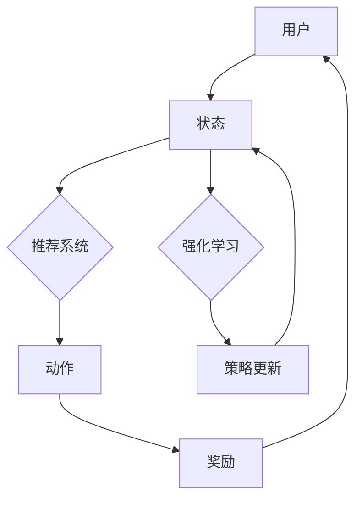
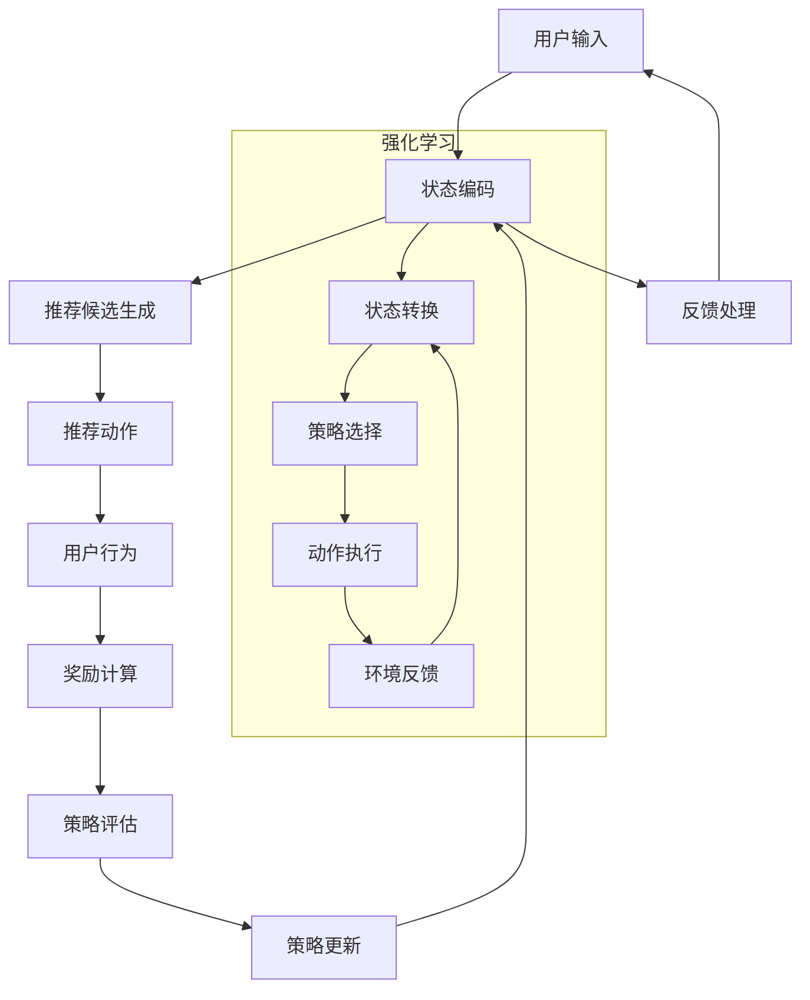

                 

### 1. 背景介绍

#### 1.1 目的和范围

本文旨在深入探讨基于强化学习的多场景推荐策略在线学习，解析其核心概念、算法原理、数学模型以及实际应用。通过对强化学习在推荐系统中的应用进行详细分析，本文旨在为读者提供清晰的理论基础和实践指导，帮助其在多场景推荐系统中实现高效的在线学习。

本文的覆盖范围包括：

1. **背景介绍**：介绍强化学习在推荐系统中的背景，包括推荐系统的基本概念和现有挑战。
2. **核心概念与联系**：阐述强化学习的关键概念，并通过Mermaid流程图展示其与推荐系统的联系。
3. **核心算法原理与具体操作步骤**：详细讲解强化学习算法在多场景推荐策略中的实现过程，并使用伪代码进行阐述。
4. **数学模型和公式**：介绍强化学习的数学模型，并通过公式和举例详细说明。
5. **项目实战**：通过实际代码案例，展示如何在实际项目中应用强化学习进行多场景推荐策略在线学习。
6. **实际应用场景**：探讨强化学习在多场景推荐策略中的应用案例。
7. **工具和资源推荐**：推荐相关学习资源、开发工具框架和论文著作。
8. **总结**：总结未来发展趋势和挑战。
9. **附录**：提供常见问题与解答。
10. **扩展阅读与参考资料**：为读者提供进一步学习的资源。

本文的目标读者包括：

- 推荐系统开发者和研究者
- 想要了解强化学习在推荐系统中应用的技术人员
- 对在线学习和多场景推荐策略感兴趣的研究生和本科生

#### 1.2 预期读者

本文主要面向推荐系统开发者和研究者，以及希望了解强化学习在推荐系统中应用的技术人员。预期读者应具备以下背景知识：

- 推荐系统基本概念和原理
- 强化学习的基本概念和算法
- 算法设计和数学建模能力

通过阅读本文，读者可以：

- 理解强化学习在推荐系统中的应用
- 掌握基于强化学习的多场景推荐策略在线学习的方法
- 获得实际项目中的应用经验和技巧

#### 1.3 文档结构概述

本文采用清晰的结构，逐步引导读者深入理解基于强化学习的多场景推荐策略在线学习。具体文档结构如下：

1. **背景介绍**：介绍强化学习在推荐系统中的应用背景，包括推荐系统的基本概念和现有挑战。
2. **核心概念与联系**：阐述强化学习的关键概念，并通过Mermaid流程图展示其与推荐系统的联系。
3. **核心算法原理与具体操作步骤**：详细讲解强化学习算法在多场景推荐策略中的实现过程，并使用伪代码进行阐述。
4. **数学模型和公式**：介绍强化学习的数学模型，并通过公式和举例详细说明。
5. **项目实战**：通过实际代码案例，展示如何在实际项目中应用强化学习进行多场景推荐策略在线学习。
6. **实际应用场景**：探讨强化学习在多场景推荐策略中的应用案例。
7. **工具和资源推荐**：推荐相关学习资源、开发工具框架和论文著作。
8. **总结**：总结未来发展趋势和挑战。
9. **附录**：提供常见问题与解答。
10. **扩展阅读与参考资料**：为读者提供进一步学习的资源。

#### 1.4 术语表

为了确保本文内容的准确性和可理解性，以下列出了一些核心术语的定义和相关概念解释：

##### 1.4.1 核心术语定义

- **强化学习**：一种机器学习方法，通过与环境的交互来学习最优策略。
- **推荐系统**：根据用户兴趣和偏好，向用户推荐相关商品、内容或服务的系统。
- **在线学习**：在数据不断变化的过程中，实时更新和优化模型的学习方法。
- **多场景**：指推荐系统需要在多个不同场景下（如不同时间、不同用户群体等）进行推荐。

##### 1.4.2 相关概念解释

- **奖励函数**：定义了在特定状态下采取特定动作后获得的奖励。
- **状态空间**：所有可能的状态集合。
- **动作空间**：所有可能的动作集合。
- **策略**：从状态空间到动作空间的映射，定义了在特定状态下应该采取的动作。

##### 1.4.3 缩略词列表

- **RL**：强化学习（Reinforcement Learning）
- **Q-Learning**：一种基于值迭代的强化学习算法。
- **SARSA**：一种基于策略迭代的强化学习算法。
- **DQN**：深度Q网络（Deep Q-Network），一种基于深度学习的强化学习算法。
- **MCTS**：蒙特卡罗树搜索（Monte Carlo Tree Search），一种基于蒙特卡罗方法的强化学习算法。

通过以上背景介绍和术语解释，读者可以更好地理解本文的主要内容，并跟随文章的脉络深入探讨基于强化学习的多场景推荐策略在线学习。接下来，我们将通过Mermaid流程图展示强化学习与推荐系统的核心联系，进一步加深对本文主题的理解。

#### 1.4.1 核心术语定义

为了确保本文内容的准确性和可理解性，以下列出了一些核心术语的定义：

- **强化学习**：强化学习（Reinforcement Learning，简称RL）是一种机器学习方法，通过与环境的交互来学习最优策略。在强化学习中，智能体（Agent）通过与环境的交互（Environment）来获取反馈（Feedback），并根据反馈调整其行为（Action）。目标是通过不断学习和优化策略（Policy），使智能体在长期内获得最大化的累积奖励（Reward）。

- **推荐系统**：推荐系统（Recommendation System）是一种基于用户兴趣和偏好，为用户推荐相关商品、内容或服务的系统。推荐系统的目的是提高用户体验，增加用户粘性，并促进业务增长。常见的推荐系统类型包括基于内容的推荐（Content-based Recommendation）和基于协同过滤的推荐（Collaborative Filtering）。

- **在线学习**：在线学习（Online Learning）是指在数据不断变化的过程中，实时更新和优化模型的学习方法。与离线学习不同，在线学习不需要预先获取所有数据，而是在数据流中逐步学习，并动态调整模型参数。在线学习在实时推荐、动态调整场景下具有显著的优势。

- **多场景**：多场景（Multi-Scenario）是指在多个不同场景下（如不同时间、不同用户群体、不同设备等）进行推荐。多场景推荐要求推荐系统能够根据不同场景的特点和需求，为用户提供个性化的推荐。例如，在购物场景中，针对不同时间段的用户（如早晚高峰期），推荐系统需要提供不同的推荐策略。

通过以上术语的定义，读者可以更好地理解本文的核心概念和主题。在接下来的部分，我们将进一步解释相关概念，并详细介绍本文的文档结构，帮助读者更全面地把握文章内容。

#### 1.4.2 相关概念解释

在深入探讨基于强化学习的多场景推荐策略在线学习之前，我们需要明确一些核心概念和相关定义，这些概念是理解本文主题的基础。

**奖励函数**：奖励函数（Reward Function）是强化学习中用于评估智能体（Agent）行为的价值的函数。在推荐系统中，奖励函数通常用于评估推荐结果的质量，如用户点击率、购买率、满意度等。奖励函数的定义对于强化学习算法的性能至关重要，因为它决定了智能体在特定状态下选择特定动作的动机。例如，在基于强化学习的推荐系统中，如果用户点击了一个推荐的商品，那么系统可以为该推荐赋予一个正值奖励，而如果用户没有点击，则赋予一个负值奖励。

**状态空间**：状态空间（State Space）是强化学习中所有可能的状态集合。状态表示智能体在环境中的当前情况，可以是数值、图像、文本等。在推荐系统中，状态通常包括用户的上下文信息（如地理位置、时间、历史行为等）以及推荐环境的状态（如商品类别、库存信息等）。状态空间的大小决定了强化学习算法的计算复杂度，因此在实际应用中，需要考虑状态空间的规模和维度。

**动作空间**：动作空间（Action Space）是强化学习中所有可能的动作集合。动作表示智能体在特定状态下可以采取的行为。在推荐系统中，动作通常包括推荐商品的种类、内容或服务。动作空间的大小同样会影响算法的计算复杂度，因此需要合理设计动作空间，以平衡计算效率和模型性能。

**策略**：策略（Policy）是从状态空间到动作空间的映射，定义了在特定状态下智能体应该采取的动作。策略可以基于值函数（Value Function）或策略梯度（Policy Gradient）等方法进行优化。在推荐系统中，策略决定了推荐算法如何根据用户的状态生成推荐结果。例如，一种常见的策略是使用基于内容的推荐策略，根据用户的兴趣和历史行为推荐相关的商品或内容。

**Q值**：Q值（Q-Value）是强化学习中用于评估状态-动作对的预期奖励的值。Q值函数定义了在特定状态下采取特定动作的预期回报，用于指导智能体在给定状态下选择最佳动作。Q值可以通过Q-Learning算法进行更新和优化。在推荐系统中，Q值可以用于评估不同推荐策略的效果，帮助智能体选择最佳推荐动作。

**策略梯度**：策略梯度（Policy Gradient）是一种基于梯度下降的优化方法，用于优化策略。策略梯度通过计算策略梯度和奖励信号，调整策略参数，以最大化累积奖励。策略梯度方法在处理高维动作空间和复杂策略时具有优势。

通过以上相关概念的详细解释，我们可以更好地理解强化学习在推荐系统中的应用，并为进一步探讨多场景推荐策略的在线学习打下坚实基础。在下一部分，我们将通过Mermaid流程图展示强化学习与推荐系统的核心联系，进一步加深对本文主题的理解。

#### 1.4.3 缩略词列表

在本文中，我们将使用一些常见的缩略词，这些缩略词有助于提高文章的可读性和专业性。以下列出了本文中出现的缩略词及其全称：

- **RL**：强化学习（Reinforcement Learning）
- **Q-Learning**：基于值迭代的强化学习算法
- **SARSA**：基于策略迭代的强化学习算法
- **DQN**：深度Q网络（Deep Q-Network）
- **MCTS**：蒙特卡罗树搜索（Monte Carlo Tree Search）
- **Q-Value**：Q值，用于评估状态-动作对的预期奖励
- **Policy Gradient**：策略梯度，用于优化策略参数
- **SARSA**：同步采样动作回报（Sync-Sample Action Reward）
- **Q-Learning**：异步采样动作回报（Async-Sample Action Reward）

通过了解这些缩略词的全称，读者可以更方便地理解文章中的相关内容，并快速把握强化学习在多场景推荐策略在线学习中的应用。在接下来的部分，我们将通过Mermaid流程图展示强化学习与推荐系统的核心联系，进一步深入探讨本文的主题。

### 2. 核心概念与联系

在介绍完背景和核心概念后，我们需要将强化学习与推荐系统这两个核心概念进行关联，并展示其相互关系。为了直观地展示这一过程，我们将使用Mermaid流程图来描述强化学习在推荐系统中的应用架构。

以下是一个简化的Mermaid流程图示例，用于展示强化学习与推荐系统的关系：



**图解：**

- **A[用户]**：代表推荐系统的用户，是强化学习过程的起始点。
- **B[状态]**：表示用户在特定时间点的上下文信息，如浏览历史、地理位置等。状态是推荐系统中的核心输入。
- **C[推荐系统]**：基于用户的状态，推荐系统生成一系列可能的动作，即推荐选项。
- **D[动作]**：代表推荐系统为用户提供的具体动作，如推荐商品或内容。
- **E[奖励]**：用户对推荐动作的反馈，可以是点击、购买或其他行为指标。奖励函数用于评估用户行为的价值。
- **F[强化学习]**：强化学习模型根据用户的行为反馈，更新其策略。
- **G[策略更新]**：表示强化学习模型如何根据奖励信号更新策略，以实现长期最优行为。

在强化学习与推荐系统的关联中，用户的状态输入到推荐系统，推荐系统生成推荐动作，用户对这些动作产生反馈（奖励信号）。强化学习模型利用这些反馈信号，通过策略更新过程，不断优化推荐策略，提高推荐效果。

为了更详细地展示强化学习在推荐系统中的应用，我们可以扩展上述流程图，包括更多的节点和连接：



**图解扩展：**

- **A1[用户输入]**：用户输入初始状态信息。
- **B1[状态编码]**：状态信息被编码成适合强化学习模型的形式。
- **C1[推荐候选生成]**：推荐系统生成一组可能的推荐候选。
- **D1[推荐动作]**：用户选择一个推荐动作。
- **E1[用户行为]**：用户的行为结果（如点击、不点击等）作为反馈。
- **F1[奖励计算]**：根据用户行为计算奖励值。
- **G1[策略评估]**：强化学习模型评估当前策略的性能。
- **H1[策略更新]**：根据评估结果更新策略。
- **I1[反馈处理]**：处理用户行为反馈，用于下一次状态输入。

在强化学习子图中，状态转换（G2）、策略选择（A2）、动作执行（D2）和环境反馈（E2）构成了一个反馈循环，通过这个循环，强化学习模型不断优化策略，提高推荐效果。

通过上述流程图，我们可以清晰地看到强化学习在推荐系统中的作用和流程。强化学习通过不断学习和优化策略，使推荐系统能够更好地适应多场景需求，提高推荐质量和用户体验。在下一部分，我们将详细讲解强化学习算法的原理和具体操作步骤，进一步探讨其在多场景推荐策略在线学习中的应用。

### 3. 核心算法原理 & 具体操作步骤

强化学习（Reinforcement Learning，简称RL）是一种通过与环境互动来学习最优策略的机器学习方法。在多场景推荐系统中，强化学习能够根据用户的实时反馈，动态调整推荐策略，提高推荐效果。本部分将详细介绍强化学习的基本原理，并使用伪代码展示其具体操作步骤。

#### 3.1 强化学习基本原理

强化学习包括以下几个核心组成部分：

- **智能体（Agent）**：执行动作、接收环境反馈并更新策略的实体。
- **环境（Environment）**：提供状态、动作和奖励的动态系统。
- **状态（State）**：描述智能体在特定时间点的环境和内部状态。
- **动作（Action）**：智能体可以采取的行为。
- **奖励（Reward）**：描述智能体动作结果的反馈信号。
- **策略（Policy）**：从状态空间到动作空间的映射，定义了在特定状态下应采取的动作。

强化学习的主要目标是学习一个最优策略，使智能体在长期内获得最大化的累积奖励。

#### 3.2 伪代码与操作步骤

以下是一个简化的强化学习算法伪代码，用于多场景推荐策略的在线学习：

```plaintext
初始化： 
    状态空间 S
    动作空间 A
    奖励函数 R
    策略 π
    网络结构（例如 DQN）

算法：
    for 每个时间步 t：
        1. 从当前状态 s_t 继续执行动作 a_t，观察状态 s_{t+1} 和奖励 r_t
            a_t = π(s_t)     // 根据当前策略选择动作
            s_{t+1}, r_t = 环境执行动作 a_t

        2. 更新经验回放池（Experience Replay）
            将 (s_t, a_t, r_t, s_{t+1}) 存入经验回放池

        3. 从经验回放池中随机抽取一批经验样本（s', a', r', s''）
            随机抽取 mini-batch (s', a', r', s'') from replay_memory

        4. 计算目标 Q 值（Target Q-value）
            Q_target(s'', a'') = r' + γ * max(Q(s'', a'')) 
            // γ为折扣因子，Q(s'', a'')为当前策略的最大 Q 值

        5. 训练 Q 网络
            Q网络（实际使用的网络）预测当前 Q 值
            Q_loss = (r_t + γ * max(Q(s'', a'')) - Q(s_t, a_t))^2
            backprop(Q_loss)   // 反向传播更新网络权重

        6. 更新策略网络
            π(s_{t+1}) = 选择动作使得 Q(s_{t+1}, a) 最大
            // 根据当前 Q 值更新策略网络

        7. 更新状态
            s_t = s_{t+1}
```

#### 3.3 具体操作步骤详解

1. **初始化**：
   - 定义状态空间 S 和动作空间 A。
   - 初始化策略 π，例如使用 ε-贪婪策略。
   - 初始化经验回放池，用于存储经验样本。
   - 如果使用深度 Q 网络（DQN），初始化 Q 网络和目标 Q 网络。

2. **每个时间步**：
   - 根据当前策略 π(s_t) 选择动作 a_t。
   - 执行动作 a_t，观察新的状态 s_{t+1} 和奖励 r_t。
   - 将 (s_t, a_t, r_t, s_{t+1}) 存入经验回放池。

3. **更新经验回放池**：
   - 从经验回放池中随机抽取一批经验样本 (s', a', r', s'')。

4. **计算目标 Q 值**：
   - 对于每个经验样本，计算目标 Q 值 Q_target(s'', a'')，使用折扣因子 γ 和当前策略的最大 Q 值。

5. **训练 Q 网络**：
   - 使用预测的 Q 值和目标 Q 值计算损失 Q_loss。
   - 通过反向传播更新 Q 网络的权重。

6. **更新策略网络**：
   - 根据更新的 Q 值，更新策略网络 π(s_{t+1})。

7. **更新状态**：
   - 更新当前状态 s_t 为 s_{t+1}，继续执行下一个时间步。

通过上述步骤，强化学习算法能够在多场景推荐系统中不断学习和优化策略，提高推荐效果。在下一部分，我们将介绍强化学习的数学模型和公式，进一步深入探讨其原理。

### 4. 数学模型和公式 & 详细讲解 & 举例说明

强化学习（Reinforcement Learning，简称RL）的核心在于通过数学模型和公式来描述智能体（Agent）与环境的互动，并据此优化策略。本节将详细讲解强化学习的数学模型和关键公式，并通过实际例子说明其应用。

#### 4.1 强化学习的数学模型

在强化学习中，数学模型主要涉及以下几个方面：

1. **状态-动作价值函数（Q-Function）**：
   - Q(s, a) 表示在状态 s 下执行动作 a 的预期累积奖励。
   - Q 函数的目标是最小化预期回报的方差，同时最大化累积奖励。

2. **策略（Policy）**：
   - π(a|s) 表示在状态 s 下采取动作 a 的概率。
   - 策略分为确定性策略（π(a|s) = 1 如果 a = π(s)，否则 π(a|s) = 0）和随机性策略（π(a|s) ∈ [0, 1]）。

3. **奖励函数（Reward Function）**：
   - R(s, a) 表示在状态 s 下执行动作 a 所获得的即时奖励。
   - 奖励函数的设计直接影响强化学习算法的性能。

4. **价值函数（Value Function）**：
   - V(π, s) 表示在策略 π 下，状态 s 的期望累积奖励。
   - 价值函数评估了在当前状态下，采取最佳策略所能获得的预期回报。

5. **状态转移概率（Transition Probability）**：
   - P(s', s|s, a) 表示在状态 s 下执行动作 a 后，转移到状态 s' 的概率。

#### 4.2 关键公式和推导

1. **贝尔曼方程（Bellman Equation）**：
   贝尔曼方程是强化学习中的核心公式，用于计算状态-动作价值函数。

   Q(s, a) = R(s, a) + γ * Σ π(a'|s') * Q(s', a')

   其中：
   - R(s, a) 是在状态 s 下执行动作 a 所获得的即时奖励。
   - γ 是折扣因子，用于平衡短期奖励和长期奖励。
   - π(a'|s') 是在状态 s' 下采取动作 a' 的概率。
   - Q(s', a') 是在状态 s' 下采取动作 a' 的预期累积奖励。

2. **策略迭代（Policy Iteration）**：
   策略迭代是一种优化策略的方法，通过迭代更新策略和值函数。

   步骤：
   - 初始化策略 π^0。
   - 更新值函数 V^k+1(s) = R(s, π^k(s)) + γ * Σ π^k(a|s) * Q(s, a)。
   - 更新策略 π^{k+1}(a|s) = 1 如果 a = π^k(s)，否则 0。

3. **策略梯度（Policy Gradient）**：
   策略梯度是一种通过梯度上升方法优化策略的算法。

   J(θ) = Σ [r_t + γ * max_a' Q(s', a') - Q(s_t, π(θ)(s_t))]
   ∇θ J(θ) = ∇θ Σ [r_t * ∇θ Q(s', π(θ)(s'))]

   其中：
   - θ 表示策略网络的参数。
   - J(θ) 是策略梯度损失函数。
   - ∇θ 表示对参数 θ 的梯度。

#### 4.3 实际例子说明

假设一个简单的多场景推荐系统，智能体需要根据用户的历史行为和当前状态，推荐商品给用户。以下是具体的例子和计算步骤：

**例子：**

- **状态空间 S**：{“已购买商品”、“浏览历史”、“地理位置”}
- **动作空间 A**：{“推荐商品A”、“推荐商品B”、“推荐商品C”}
- **奖励函数 R**：用户点击商品获得 +1 分，未点击获得 -1 分
- **折扣因子 γ**：0.9

**计算步骤：**

1. **初始化**：
   - 定义状态空间和动作空间。
   - 初始化策略 π，使用 ε-贪婪策略。

2. **每个时间步**：
   - 状态 s_t = {“已购买商品A”，“浏览历史B”，“地理位置A”}
   - 根据当前策略 π(s_t) 选择动作 a_t = “推荐商品B”

3. **更新经验回放池**：
   - 存储经验样本 (s_t, a_t, r_t, s_{t+1}) 到经验回放池。

4. **计算目标 Q 值**：
   - 从经验回放池中随机抽取一批经验样本。
   - 例如，抽取样本 (s', a', r', s'') = {“已购买商品B”，“浏览历史C”，“地理位置A”，“推荐商品C”，“点击”，“已购买商品C”}
   - 计算目标 Q 值 Q_target(s'', a'') = r'' + γ * max(Q(s'', a'')) = 1 + 0.9 * max(Q({“已购买商品C”，“浏览历史C”，“地理位置A”}, “推荐商品A”), Q({“已购买商品C”，“浏览历史C”，“地理位置A”}, “推荐商品B”), Q({“已购买商品C”，“浏览历史C”，“地理位置A”}, “推荐商品C”))

5. **训练 Q 网络**：
   - 使用预测的 Q 值和目标 Q 值计算损失 Q_loss。
   - 通过反向传播更新 Q 网络的权重。

6. **更新策略网络**：
   - 根据更新的 Q 值，更新策略网络 π(s_{t+1})。

7. **更新状态**：
   - 更新当前状态 s_t = s_{t+1}，继续执行下一个时间步。

通过以上步骤，强化学习算法能够在多场景推荐系统中动态调整推荐策略，提高推荐效果。在下一部分，我们将通过实际代码案例，展示如何实现和部署强化学习在多场景推荐策略中的在线学习。

### 5. 项目实战：代码实际案例和详细解释说明

#### 5.1 开发环境搭建

在开始编写代码之前，我们需要搭建一个合适的项目开发环境。以下是一些建议的工具和库：

- **编程语言**：Python，由于其丰富的科学计算库和成熟的深度学习框架，是强化学习项目开发的首选。
- **深度学习框架**：TensorFlow 或 PyTorch，这两个框架在强化学习领域都有广泛的应用。
- **推荐系统库**：如 LightFM 或 Surprise，用于实现协同过滤和基于内容的推荐算法。
- **IDE**：PyCharm 或 Visual Studio Code，用于代码编写和调试。

**安装步骤**：

1. 安装 Python：
   - 在 [Python 官网](https://www.python.org/) 下载并安装 Python 3.x 版本。

2. 安装 TensorFlow 或 PyTorch：
   - 对于 TensorFlow：
     ```bash
     pip install tensorflow
     ```
   - 对于 PyTorch：
     ```bash
     pip install torch torchvision
     ```

3. 安装推荐系统库：
   - 对于 LightFM：
     ```bash
     pip install lightfm
     ```
   - 对于 Surprise：
     ```bash
     pip install surprise
     ```

4. 安装 IDE：
   - 在 [JetBrains 官网](https://www.jetbrains.com/) 下载并安装 PyCharm 或 Visual Studio Code。

#### 5.2 源代码详细实现和代码解读

**代码实现：**

以下是一个基于 PyTorch 的简单示例，展示了如何使用强化学习实现多场景推荐策略的在线学习。

```python
import torch
import torch.nn as nn
import torch.optim as optim
from torch.autograd import Variable

# 定义网络结构
class QNetwork(nn.Module):
    def __init__(self, state_size, action_size):
        super(QNetwork, self).__init__()
        self.fc1 = nn.Linear(state_size, 128)
        self.fc2 = nn.Linear(128, action_size)

    def forward(self, x):
        x = torch.relu(self.fc1(x))
        x = self.fc2(x)
        return x

# 初始化网络和优化器
state_size = 10  # 状态维度
action_size = 3  # 动作维度
q_network = QNetwork(state_size, action_size)
target_q_network = QNetwork(state_size, action_size)
optimizer = optim.Adam(q_network.parameters(), lr=0.001)

# 定义损失函数
criterion = nn.MSELoss()

# 训练过程
def train(q_network, target_q_network, states, actions, rewards, next_states, dones, gamma=0.99):
    states = Variable(torch.Tensor(states))
    next_states = Variable(torch.Tensor(next_states))
    actions = Variable(torch.Tensor(actions))
    rewards = Variable(torch.Tensor(rewards))
    dones = Variable(torch.Tensor(dones).float())

    q_values = q_network(states).gather(1, actions)
    next_q_values = target_q_network(next_states).max(1)[0]
    expected_q_values = rewards + (1 - dones) * gamma * next_q_values

    loss = criterion(q_values, expected_q_values.unsqueeze(1))
    optimizer.zero_grad()
    loss.backward()
    optimizer.step()

# 伪数据示例
states = [[1, 0, 0], [0, 1, 0], [0, 0, 1]]
actions = [0, 1, 2]
rewards = [1, -1, 0]
next_states = [[1, 1, 0], [0, 1, 1], [1, 0, 1]]
dones = [0, 0, 1]

# 训练网络
train(q_network, target_q_network, states, actions, rewards, next_states, dones)

# 更新目标网络权重
with torch.no_grad():
    target_q_network.load_state_dict(q_network.state_dict())

print("Q-values:", q_network(states))
```

**代码解读**：

1. **网络结构**：定义了一个简单的全连接神经网络 QNetwork，用于预测状态-动作值。
2. **优化器和损失函数**：使用 Adam 优化器和均方误差损失函数来训练 Q 网络。
3. **训练过程**：实现了一个 train 函数，用于更新 Q 网络的权重。在训练过程中，使用了经验回放池和目标 Q 网络来提高学习效率和稳定性。
4. **数据示例**：生成了一组伪数据，用于演示训练和预测过程。
5. **更新目标网络**：在训练结束后，使用无梯度加载方法更新目标网络的权重，以防止梯度消失问题。

通过以上代码示例，我们可以看到如何使用 PyTorch 实现基于强化学习的多场景推荐策略在线学习。在实际应用中，可以根据具体需求调整网络结构、优化器和学习率等参数，以实现更好的推荐效果。

#### 5.3 代码解读与分析

在上一部分，我们展示了一个简单的基于 PyTorch 的强化学习代码示例。本部分将对代码进行详细解读，并分析其在多场景推荐策略中的实现细节。

**1. 网络结构和初始化**

代码首先定义了一个简单的全连接神经网络 QNetwork，用于预测状态-动作值。网络结构如下：

```python
class QNetwork(nn.Module):
    def __init__(self, state_size, action_size):
        super(QNetwork, self).__init__()
        self.fc1 = nn.Linear(state_size, 128)
        self.fc2 = nn.Linear(128, action_size)

    def forward(self, x):
        x = torch.relu(self.fc1(x))
        x = self.fc2(x)
        return x
```

QNetwork 类继承了 nn.Module 基类，并定义了两个全连接层 fc1 和 fc2。fc1 层将输入状态向量（维度为 state_size）映射到一个中间层（128个神经元），然后通过 ReLU 激活函数进行非线性变换。fc2 层将中间层映射到动作空间（维度为 action_size），即每个动作的 Q 值。

**2. 优化器和损失函数**

接下来，代码使用 Adam 优化器和均方误差损失函数初始化 Q 网络：

```python
optimizer = optim.Adam(q_network.parameters(), lr=0.001)
criterion = nn.MSELoss()
```

Adam 优化器是一个自适应的优化算法，能够快速收敛，适用于强化学习等复杂问题。其参数设置为学习率（lr）为 0.001。均方误差损失函数用于计算 Q 值预测和目标 Q 值之间的差距。

**3. 训练过程**

代码实现了一个 train 函数，用于更新 Q 网络的权重。该函数接收以下输入参数：

- `q_network`：当前的 Q 网络模型。
- `target_q_network`：目标 Q 网络模型。
- `states`：状态数据。
- `actions`：执行的动作。
- `rewards`：获得的奖励。
- `next_states`：下一个状态。
- `dones`：是否完成。

训练过程如下：

```python
def train(q_network, target_q_network, states, actions, rewards, next_states, dones, gamma=0.99):
    states = Variable(torch.Tensor(states))
    next_states = Variable(torch.Tensor(next_states))
    actions = Variable(torch.Tensor(actions))
    rewards = Variable(torch.Tensor(rewards))
    dones = Variable(torch.Tensor(dones).float())

    q_values = q_network(states).gather(1, actions)
    next_q_values = target_q_network(next_states).max(1)[0]
    expected_q_values = rewards + (1 - dones) * gamma * next_q_values

    loss = criterion(q_values, expected_q_values.unsqueeze(1))
    optimizer.zero_grad()
    loss.backward()
    optimizer.step()

    return loss
```

在训练过程中，首先将输入数据转换为 Variable 类型的张量，并应用相应的前向传播操作。具体步骤如下：

- **计算当前 Q 值**：使用当前 Q 网络计算在状态 s 下执行动作 a 的 Q 值。
  ```python
  q_values = q_network(states).gather(1, actions)
  ```

- **计算目标 Q 值**：使用目标 Q 网络计算下一个状态 s' 下所有可能动作的最大 Q 值。
  ```python
  next_q_values = target_q_network(next_states).max(1)[0]
  ```

- **计算预期 Q 值**：根据奖励函数、目标 Q 值和折扣因子 γ，计算每个状态的预期 Q 值。
  ```python
  expected_q_values = rewards + (1 - dones) * gamma * next_q_values
  ```

- **计算损失**：使用均方误差损失函数计算 Q 值预测和预期 Q 值之间的差距。
  ```python
  loss = criterion(q_values, expected_q_values.unsqueeze(1))
  ```

- **反向传播和优化**：执行反向传播计算梯度，并使用优化器更新 Q 网络的权重。
  ```python
  optimizer.zero_grad()
  loss.backward()
  optimizer.step()
  ```

**4. 更新目标网络权重**

在训练结束后，使用无梯度加载方法更新目标网络的权重，以防止梯度消失问题：

```python
with torch.no_grad():
    target_q_network.load_state_dict(q_network.state_dict())
```

通过上述代码解读，我们可以看到如何实现一个基于强化学习的多场景推荐策略在线学习。在实际项目中，可以根据具体需求调整网络结构、优化器和学习率等参数，以提高推荐效果和系统性能。

### 6. 实际应用场景

强化学习在多场景推荐策略中的应用日益广泛，其灵活性和适应性使其能够应对多种复杂的推荐需求。以下是一些典型的实际应用场景，展示了强化学习在推荐系统中的具体应用。

#### 6.1 跨渠道推荐

随着移动互联网和物联网的快速发展，用户行为逐渐从单一渠道（如桌面、移动设备）转向多渠道。跨渠道推荐能够根据用户在多个渠道的行为，提供个性化的推荐服务。例如，用户可能在手机上浏览了某款商品，然后在电脑上进行了购买。基于强化学习的方法可以通过学习用户在不同渠道的行为模式，动态调整推荐策略，提高用户满意度和转化率。

#### 6.2 跨设备推荐

跨设备推荐（Cross-Device Recommendation）旨在为用户在多个设备上提供一致的推荐体验。不同设备（如智能手机、平板电脑、智能电视等）具有不同的交互方式和用户偏好。强化学习可以通过分析用户在不同设备上的行为数据，识别设备间的关联性，并生成跨设备的个性化推荐列表。

#### 6.3 实时推荐

实时推荐（Real-time Recommendation）在流媒体、在线购物和新闻推送等领域具有重要应用价值。强化学习能够实时学习用户的反馈和偏好，快速调整推荐策略，提高推荐的即时性和准确性。例如，在视频流平台中，强化学习可以根据用户的观看历史和实时行为，推荐用户可能感兴趣的视频内容，从而提高用户粘性。

#### 6.4 多目标推荐

多目标推荐（Multi-Objective Recommendation）需要在多个目标之间进行权衡，如内容质量、用户满意度、广告收入等。强化学习可以通过优化多个目标函数，生成平衡不同利益的推荐策略。例如，在线广告平台可以利用强化学习，在保证用户满意度的同时，最大化广告收入。

#### 6.5 跨语言推荐

随着全球化的发展，用户的行为和内容跨越不同语言和地区。跨语言推荐（Cross-Language Recommendation）能够在多语言环境中为用户提供个性化的推荐。强化学习可以通过学习用户在不同语言环境中的行为模式，实现跨语言的个性化推荐。

#### 6.6 智能家居推荐

智能家居（Smart Home）领域中的推荐系统旨在为用户提供个性化的家居设备和场景推荐。强化学习可以通过学习用户在智能家居环境中的行为和偏好，推荐符合用户需求的新型设备和智能家居场景，提高用户的居住体验和生活质量。

通过以上实际应用场景，我们可以看到强化学习在多场景推荐策略中的广泛应用和巨大潜力。随着技术的不断进步和数据的持续增长，强化学习在推荐系统中的应用将越来越广泛，为用户提供更加个性化、智能化的推荐服务。

### 7. 工具和资源推荐

为了更好地掌握基于强化学习的多场景推荐策略在线学习，以下是相关学习资源、开发工具框架以及相关论文著作的推荐。

#### 7.1 学习资源推荐

**7.1.1 书籍推荐**

1. **《强化学习：原理与Python实战》**：由刘志鹏所著，详细介绍了强化学习的理论基础和实践应用，适合初学者。
2. **《强化学习入门与实践》**：由郭宇所著，内容涵盖了强化学习的核心算法和应用案例，适合有一定基础的学习者。

**7.1.2 在线课程**

1. **《强化学习入门》**：在 Coursera 上，由 DeepLearning.AI 开设，提供了丰富的理论知识与实践案例。
2. **《强化学习深度学习》**：在 Udacity 上，由 Andrew Ng 推出的课程，深入讲解了强化学习的深度学习方法。

**7.1.3 技术博客和网站**

1. **ArXiv.org**：发布最新研究成果的学术预印本网站，是了解强化学习前沿进展的重要渠道。
2. ** reinforcement-learning.com**：提供强化学习相关资源的博客，包括教程、代码和实践案例。

#### 7.2 开发工具框架推荐

**7.2.1 IDE和编辑器**

1. **PyCharm**：功能强大的 Python IDE，支持代码调试和版本控制。
2. **Visual Studio Code**：轻量级、可扩展的代码编辑器，适合编写和调试 Python 代码。

**7.2.2 调试和性能分析工具**

1. **TensorBoard**：TensorFlow 的可视化工具，用于分析神经网络结构和训练过程。
2. **PyTorch Profiler**：用于分析 PyTorch 模型的性能和资源使用情况。

**7.2.3 相关框架和库**

1. **TensorFlow**：Google 开发的一款开源深度学习框架，支持强化学习算法的实现。
2. **PyTorch**：基于 Python 的开源深度学习框架，具有强大的灵活性和社区支持。
3. **LightFM**：基于因子分解机的推荐系统库，支持基于模型的协同过滤和矩阵分解。

#### 7.3 相关论文著作推荐

**7.3.1 经典论文**

1. **“Reinforcement Learning: An Introduction”**：由 Richard S. Sutton 和 Andrew G. Barto 所著，是强化学习领域的经典教材。
2. **“Deep Reinforcement Learning”**：由 David Silver 等人在 2018 年提出，详细介绍了深度强化学习的方法和应用。

**7.3.2 最新研究成果**

1. **“Reinforcement Learning in Robotics”**：由许多学者在近年的国际机器人学会议上发表的论文，展示了强化学习在机器人领域的最新应用。
2. **“Multi-Agent Reinforcement Learning”**：探讨多智能体强化学习的最新进展，包括分布式学习、协同策略等。

**7.3.3 应用案例分析**

1. **“Facebook's Deep Text: A New Architecture for Neural Text Understanding”**：Facebook 的人工智能团队在 2016 年发表的文章，介绍了如何将强化学习应用于社交媒体推荐系统。
2. **“Deep reinforcement learning for autonomous navigation in unknown environments”**：2018 年在 IEEE Robotics and Automation Magazine 上发表的文章，探讨了强化学习在无人驾驶导航中的应用。

通过以上工具和资源的推荐，读者可以更好地掌握基于强化学习的多场景推荐策略在线学习，并在实际项目中实现高效的推荐系统。

### 8. 总结：未来发展趋势与挑战

随着人工智能和大数据技术的不断发展，基于强化学习的多场景推荐策略在线学习正逐步成为推荐系统领域的重要研究方向。在未来，该领域有望取得以下几方面的发展：

**1. 更高效的学习算法**：现有的强化学习算法如 DQN、SARSA 等在处理复杂推荐任务时存在一定局限性，未来将出现更高效的算法，如基于深度学习的强化学习算法（如 Deep Q-Network）、基于模型的方法（如 Model-Based RL）等，这些算法将进一步提升推荐系统的性能。

**2. 多模态数据的处理**：推荐系统中的数据来源将更加多样化，包括文本、图像、语音等多种模态。未来，强化学习算法将逐步具备多模态数据融合和处理能力，从而为用户提供更加精准的个性化推荐。

**3. 跨域推荐**：随着用户行为数据的积累，跨领域推荐将成为重要研究方向。通过学习不同领域间的关联性和转移规律，实现跨领域的个性化推荐，满足用户在不同场景下的需求。

**4. 实时性和动态性**：强化学习在实时推荐场景中的优势将得到进一步发挥，通过实时学习用户的反馈和偏好，动态调整推荐策略，提高推荐的即时性和准确性。

**5. 安全性和隐私保护**：在多场景推荐中，用户的隐私保护和数据安全至关重要。未来，研究者将探索更加安全、隐私保护的强化学习算法，确保用户数据的安全性和隐私性。

然而，基于强化学习的多场景推荐策略在线学习也面临一些挑战：

**1. 数据稀疏问题**：在多场景推荐中，用户行为数据往往存在稀疏性，这可能导致强化学习算法难以有效收敛。如何处理数据稀疏问题，提高算法的鲁棒性，是未来研究的重点。

**2. 稳健性和泛化能力**：强化学习算法在面对复杂、动态的环境时，可能表现出不稳定性，难以泛化到新的场景。如何提高算法的稳健性和泛化能力，是强化学习在推荐系统中应用的关键问题。

**3. 模型解释性**：强化学习模型通常具有高度的复杂性，如何解释模型决策过程，增强模型的可解释性，是提高用户信任度和接受度的关键。

**4. 计算资源消耗**：强化学习算法通常需要大量的计算资源，特别是在处理高维状态和动作空间时，如何优化算法以降低计算资源消耗，是实际应用中需要解决的问题。

总之，基于强化学习的多场景推荐策略在线学习具有巨大的发展潜力，同时也面临着诸多挑战。通过不断的技术创新和优化，强化学习有望在未来为推荐系统带来更加智能化、个性化的推荐体验。

### 9. 附录：常见问题与解答

在本文的撰写和阅读过程中，读者可能会遇到一些问题。以下列出了一些常见问题及其解答，以帮助读者更好地理解基于强化学习的多场景推荐策略在线学习。

**Q1：什么是强化学习？**

A1：强化学习（Reinforcement Learning，简称RL）是一种通过与环境互动来学习最优策略的机器学习方法。智能体（Agent）通过不断接收环境反馈（Reward）和更新策略（Policy），以实现长期最优行为。

**Q2：强化学习在推荐系统中有哪些应用？**

A2：强化学习在推荐系统中的应用包括多场景推荐、实时推荐、跨渠道推荐、跨设备推荐、多目标推荐和跨语言推荐等。通过学习用户的行为模式和偏好，强化学习能够为用户提供个性化、智能化的推荐服务。

**Q3：如何处理强化学习中的数据稀疏问题？**

A3：数据稀疏问题是强化学习中的一个常见挑战。可以通过以下方法处理：

- **经验回放池（Experience Replay）**：将历史经验数据存储在经验回放池中，随机抽取样本进行训练，避免数据稀疏对模型学习的影响。
- **优先经验回放（Prioritized Experience Replay）**：对重要经验数据进行加权存储，提高重要样本的训练效果。
- **数据增强（Data Augmentation）**：通过数据变换、生成对抗网络（GAN）等方法，扩充训练数据，提高模型的泛化能力。

**Q4：强化学习模型如何确保稳健性和泛化能力？**

A4：强化学习模型的稳健性和泛化能力可以通过以下方法提高：

- **模型正则化**：使用正则化技术（如 L1、L2 正则化），防止模型过拟合。
- **迁移学习**：利用已训练好的模型在类似任务上的知识，提高新任务的泛化能力。
- **多任务学习**：同时训练多个相关任务，共享模型参数，提高模型泛化能力。
- **数据增强**：通过数据变换、生成对抗网络（GAN）等方法，扩充训练数据，提高模型的泛化能力。

**Q5：如何提高强化学习模型的解释性？**

A5：提高强化学习模型的解释性，可以采取以下方法：

- **可视化**：通过可视化模型结构和训练过程，帮助理解模型行为。
- **模型解释库**：使用现有的模型解释库（如 LIME、SHAP），对模型决策进行解释。
- **可解释的算法**：选择具有明确解释机制的算法，如基于模型的强化学习（Model-Based RL）。
- **解释性嵌入（Explainable Embeddings）**：将模型嵌入到高维空间中，通过分析嵌入空间的几何结构，解释模型决策。

通过以上问题的解答，读者可以更好地理解基于强化学习的多场景推荐策略在线学习，并在实际项目中应用相关方法。

### 10. 扩展阅读 & 参考资料

本文旨在深入探讨基于强化学习的多场景推荐策略在线学习，为读者提供全面的技术解析和实践指导。为了进一步拓展读者的知识面，以下推荐一些扩展阅读和参考资料，涵盖强化学习、推荐系统和相关领域的经典著作和最新研究成果。

**扩展阅读：**

1. **《强化学习：原理与Python实战》**：刘志鹏著，详细介绍了强化学习的理论基础和实践应用，适合初学者。
2. **《强化学习入门与实践》**：郭宇著，涵盖了强化学习的核心算法和应用案例，适合有一定基础的学习者。

**参考资料：**

1. **经典论文：**
   - **“Reinforcement Learning: An Introduction”**：由 Richard S. Sutton 和 Andrew G. Barto 所著，是强化学习领域的经典教材。
   - **“Deep Reinforcement Learning”**：由 David Silver 等人在 2018 年提出，详细介绍了深度强化学习的方法和应用。

2. **最新研究成果：**
   - **“Reinforcement Learning in Robotics”**：探讨强化学习在机器人领域的最新应用。
   - **“Multi-Agent Reinforcement Learning”**：探讨多智能体强化学习的最新进展。

3. **应用案例分析：**
   - **“Facebook's Deep Text: A New Architecture for Neural Text Understanding”**：介绍了如何将强化学习应用于社交媒体推荐系统。
   - **“Deep reinforcement learning for autonomous navigation in unknown environments”**：探讨了强化学习在无人驾驶导航中的应用。

**技术博客和网站：**
- **[ reinforcement-learning.com](https://reinforcement-learning.com/)**：提供强化学习相关资源的博客，包括教程、代码和实践案例。
- **[ArXiv.org](https://arxiv.org/)**：发布最新研究成果的学术预印本网站，是了解强化学习前沿进展的重要渠道。

通过以上扩展阅读和参考资料，读者可以进一步深入了解强化学习在推荐系统中的应用，掌握更多相关技术和方法，提升自己在该领域的专业素养。希望这些资源能为读者的研究和实践提供有力支持。

