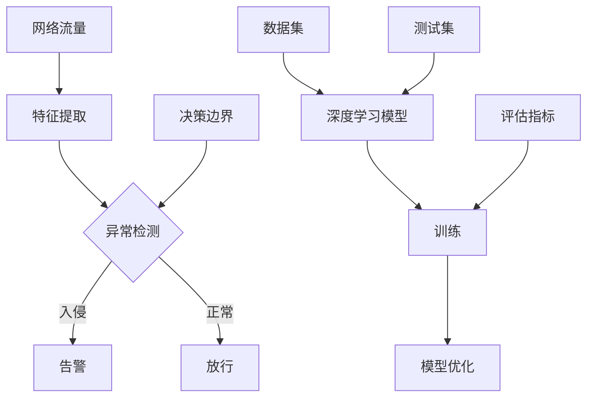

                 

### 背景介绍

#### 1.1 目的和范围

本文旨在探讨基于深度学习的入侵检测系统的设计与实现。随着信息技术的飞速发展，网络安全问题日益突出，入侵检测作为网络安全的关键技术之一，受到了广泛关注。传统入侵检测系统（IDS）基于特征匹配和模式识别等技术，虽然在一定程度上能够检测到入侵行为，但面对复杂多变的网络攻击，其检测效果往往不尽如人意。为此，本文将介绍如何利用深度学习技术构建高效、智能的入侵检测系统，以提高网络安全防护能力。

本文的主要内容包括：首先，介绍入侵检测系统的基本概念和原理；其次，分析深度学习在入侵检测中的应用优势；然后，详细阐述基于深度学习的入侵检测系统的整体架构；接着，介绍核心算法原理和具体实现步骤；最后，通过实际案例展示系统在网络安全中的应用效果。

#### 1.2 预期读者

本文适合以下读者群体：

1. 对网络安全和入侵检测感兴趣的初学者。
2. 想要深入了解深度学习在入侵检测领域应用的工程师和研究人员。
3. 需要提升企业网络安全防护能力的运维人员和管理人员。
4. 有志于从事网络安全相关领域研究的本科生和研究生。

#### 1.3 文档结构概述

本文结构如下：

1. 背景介绍：本文的目的和范围，预期读者，文档结构概述。
2. 核心概念与联系：介绍入侵检测系统的基本概念，深度学习原理及架构。
3. 核心算法原理 & 具体操作步骤：详细讲解入侵检测算法的原理和实现步骤。
4. 数学模型和公式 & 详细讲解 & 举例说明：介绍深度学习中的数学模型和公式，并通过实例进行讲解。
5. 项目实战：代码实际案例和详细解释说明，包括开发环境搭建、源代码实现和代码解读。
6. 实际应用场景：介绍入侵检测系统在实际中的应用。
7. 工具和资源推荐：推荐学习资源、开发工具框架和论文著作。
8. 总结：未来发展趋势与挑战。
9. 附录：常见问题与解答。
10. 扩展阅读 & 参考资料。

#### 1.4 术语表

为了确保文章的准确性，以下列出本文中的一些核心术语及其定义：

1. **入侵检测系统（IDS）**：一种网络安全技术，用于识别、检测和预防网络中的非法入侵行为。
2. **深度学习**：一种基于人工神经网络的学习方法，通过多层神经元的堆叠，实现对数据的自动特征提取和模型优化。
3. **卷积神经网络（CNN）**：一种特殊的人工神经网络结构，主要用于图像和语音等数据的处理。
4. **循环神经网络（RNN）**：一种用于处理序列数据的人工神经网络结构，具有记忆功能。
5. **反向传播算法（BP）**：一种常用的神经网络训练算法，通过不断调整网络权值，使得网络输出与实际输出之间的误差最小。
6. **网络攻击**：指黑客或其他恶意行为者对计算机系统、网络设备或数据进行的非法侵入和破坏行为。

#### 1.4.1 核心术语定义

1. **入侵检测系统（IDS）**：入侵检测系统（Intrusion Detection System，IDS）是一种网络安全技术，用于识别、检测和预防网络中的非法入侵行为。IDS可以分为基于特征匹配的入侵检测系统和基于异常检测的入侵检测系统两种类型。基于特征匹配的IDS通过比对已知攻击特征库，检测网络中的异常流量；基于异常检测的IDS则通过建立正常行为模型，检测与正常行为偏离较大的流量。

2. **深度学习**：深度学习（Deep Learning）是一种基于人工神经网络的学习方法，通过多层神经元的堆叠，实现对数据的自动特征提取和模型优化。深度学习具有自动提取特征、处理大规模数据、自适应能力强等优点，在图像识别、语音识别、自然语言处理等领域取得了显著的成果。

3. **卷积神经网络（CNN）**：卷积神经网络（Convolutional Neural Network，CNN）是一种特殊的人工神经网络结构，主要用于图像和语音等数据的处理。CNN的核心思想是使用卷积操作对输入数据进行特征提取，并通过池化操作降低数据的维度，从而提高模型的性能。

4. **循环神经网络（RNN）**：循环神经网络（Recurrent Neural Network，RNN）是一种用于处理序列数据的人工神经网络结构，具有记忆功能。RNN通过循环机制，将前一个时刻的输出作为当前时刻的输入，从而实现对序列数据的建模。

5. **反向传播算法（BP）**：反向传播算法（Back Propagation，BP）是一种常用的神经网络训练算法，通过不断调整网络权值，使得网络输出与实际输出之间的误差最小。BP算法分为前向传播和反向传播两个阶段，前向传播计算网络输出，反向传播计算误差，并更新网络权值。

6. **网络攻击**：网络攻击（Network Attack）是指黑客或其他恶意行为者对计算机系统、网络设备或数据进行的非法侵入和破坏行为。网络攻击包括但不限于拒绝服务攻击、端口扫描、恶意软件传播等。

#### 1.4.2 相关概念解释

1. **网络流量**：网络流量（Network Traffic）是指在计算机网络中传输的数据包的总量。网络流量可以分为正常流量和异常流量，正常流量指符合网络正常运行规则的数据包，异常流量指违反网络正常运行规则的数据包。

2. **特征提取**：特征提取（Feature Extraction）是指从原始数据中提取出对特定任务有用的信息。在入侵检测中，特征提取是关键步骤，通过提取网络流量中的特征，可以更好地识别入侵行为。

3. **模型训练**：模型训练（Model Training）是指通过大量的训练数据，调整神经网络模型的参数，使其能够正确分类网络流量。模型训练是深度学习应用的重要环节，通过不断的训练和优化，可以提高模型的性能。

4. **异常检测**：异常检测（Anomaly Detection）是指从大量数据中识别出不符合正常分布的异常数据。在入侵检测中，异常检测可以用于检测未知入侵行为，提高系统的检测能力。

5. **分类器**：分类器（Classifier）是指一种用于对输入数据进行分类的模型。在入侵检测中，分类器可以用于判断网络流量是否为入侵行为。

#### 1.4.3 缩略词列表

- IDS：入侵检测系统（Intrusion Detection System）
- CNN：卷积神经网络（Convolutional Neural Network）
- RNN：循环神经网络（Recurrent Neural Network）
- BP：反向传播算法（Back Propagation）
- DNN：深度神经网络（Deep Neural Network）
- ML：机器学习（Machine Learning）
- NLP：自然语言处理（Natural Language Processing）
- SVM：支持向量机（Support Vector Machine）
- PCA：主成分分析（Principal Component Analysis）

---

在接下来的部分，我们将深入探讨入侵检测系统的核心概念与联系，通过Mermaid流程图展示其原理和架构，以便读者更好地理解后续内容。敬请期待！<|im_sep|>## 核心概念与联系

在深入探讨基于深度学习的入侵检测系统（IDS）之前，首先需要了解核心概念及其相互关系。本文将使用Mermaid流程图（一种基于Markdown的图形描述语言）来展示入侵检测系统的原理和架构，帮助读者更好地理解。

### Mermaid流程图



### 流程图解释

1. **网络流量（A）**：网络流量是入侵检测系统的输入数据，包括网络中的数据包、流量统计信息等。

2. **特征提取（B）**：特征提取是从网络流量中提取出对入侵检测有帮助的特征，如数据包的源IP、目的IP、端口号、协议类型等。

3. **异常检测（C）**：异常检测模块根据提取的特征和训练好的深度学习模型，判断输入数据是否为异常流量。若为异常，则执行告警（D）；若为正常，则放行（E）。

4. **深度学习模型（F）**：深度学习模型是入侵检测系统的核心，通过大量训练数据，学习到正常流量和异常流量的特征差异，从而提高检测准确性。

5. **训练（G）**：训练过程是将数据集（I）输入到深度学习模型中，通过反向传播算法（BP）不断调整模型参数，使其能够准确识别正常和异常流量。

6. **模型优化（H）**：模型优化是通过交叉验证和超参数调整，进一步提高模型的性能。

7. **数据集（I）**：数据集是训练深度学习模型的基础，包括正常流量和异常流量样本。

8. **测试集（J）**：测试集用于评估训练好的模型在未知数据上的性能。

9. **评估指标（K）**：评估指标用于衡量模型在测试集上的性能，如准确率、召回率、F1值等。

10. **决策边界（L）**：决策边界是模型判断正常和异常流量的临界值，通过优化模型参数进行调整。

通过上述流程图，我们可以清晰地看到入侵检测系统的整体架构及其核心概念之间的联系。接下来，我们将进一步探讨基于深度学习的入侵检测算法原理，以及具体操作步骤。敬请期待！<|im_sep|>### 核心算法原理 & 具体操作步骤

在入侵检测系统中，核心算法的选择至关重要，它直接影响到系统的检测性能。本文将详细介绍基于深度学习的入侵检测算法原理，并使用伪代码详细阐述具体操作步骤。

#### 1. 算法选择

在入侵检测系统中，常见的深度学习算法包括卷积神经网络（CNN）、循环神经网络（RNN）和长短期记忆网络（LSTM）等。由于CNN在处理图像和序列数据方面具有优势，而RNN和LSTM在处理序列数据方面表现优异，本文将分别介绍基于CNN和RNN的入侵检测算法原理。

#### 2. 基于CNN的入侵检测算法原理

CNN是一种基于卷积操作的人工神经网络，特别适用于处理具有层次特征的数据。在入侵检测中，CNN可以用于提取网络流量的特征，从而提高检测性能。

**算法原理：**

1. **卷积层（Convolutional Layer）**：卷积层用于提取输入数据的局部特征。通过卷积操作，将输入数据与卷积核进行点积，得到特征图。

2. **激活函数（Activation Function）**：激活函数用于引入非线性特性，常用的激活函数包括ReLU（Rectified Linear Unit）和Sigmoid。

3. **池化层（Pooling Layer）**：池化层用于降低特征图的维度，提高计算效率。常用的池化操作包括最大池化（Max Pooling）和平均池化（Average Pooling）。

4. **全连接层（Fully Connected Layer）**：全连接层用于将卷积层和池化层提取的特征进行整合，并输出分类结果。

5. **损失函数（Loss Function）**：损失函数用于衡量模型预测结果与实际结果之间的差距，常用的损失函数包括交叉熵损失（Cross Entropy Loss）和均方误差损失（Mean Squared Error Loss）。

**伪代码：**

```python
# 基于CNN的入侵检测算法伪代码

# 初始化模型参数
model = initialize_model()

# 训练模型
for epoch in range(num_epochs):
    for batch in train_data:
        # 前向传播
        output = model.forward(batch)
        # 计算损失
        loss = loss_function(output, batch.labels)
        # 反向传播
        model.backward(output, batch.labels)
        # 更新模型参数
        model.update_params()

# 测试模型
for batch in test_data:
    output = model.forward(batch)
    predictions = model.predict(output)
    # 计算准确率
    accuracy = calculate_accuracy(predictions, batch.labels)
```

#### 3. 基于RNN的入侵检测算法原理

RNN是一种能够处理序列数据的人工神经网络，特别适用于入侵检测中的时间序列分析。在入侵检测中，RNN可以用于捕捉网络流量的时间依赖性，从而提高检测性能。

**算法原理：**

1. **输入层（Input Layer）**：输入层用于接收网络流量的时间序列数据。

2. **隐藏层（Hidden Layer）**：隐藏层用于对输入数据进行处理，并产生输出。RNN通过循环机制，将上一个时间步的隐藏状态传递给当前时间步，实现对时间序列数据的建模。

3. **输出层（Output Layer）**：输出层用于输出分类结果。

4. **损失函数（Loss Function）**：损失函数用于衡量模型预测结果与实际结果之间的差距。

**伪代码：**

```python
# 基于RNN的入侵检测算法伪代码

# 初始化模型参数
model = initialize_model()

# 训练模型
for epoch in range(num_epochs):
    for batch in train_data:
        # 前向传播
        hidden_state, cell_state = model.forward(batch)
        # 计算损失
        loss = loss_function(hidden_state, batch.labels)
        # 反向传播
        model.backward(hidden_state, batch.labels)
        # 更新模型参数
        model.update_params()

# 测试模型
for batch in test_data:
    hidden_state, cell_state = model.forward(batch)
    predictions = model.predict(hidden_state)
    # 计算准确率
    accuracy = calculate_accuracy(predictions, batch.labels)
```

通过上述算法原理和伪代码，我们可以了解到基于深度学习的入侵检测算法是如何通过卷积操作和循环机制，从网络流量中提取特征，并实现对入侵行为的检测。在接下来的部分，我们将进一步介绍数学模型和公式，并通过实例进行说明。敬请期待！<|im_sep|>### 数学模型和公式 & 详细讲解 & 举例说明

在深度学习中，数学模型和公式起着至关重要的作用。它们帮助我们理解和实现深度学习算法，提高模型的性能和准确性。本文将详细讲解深度学习中的几个关键数学模型和公式，并通过实例进行说明。

#### 1. 激活函数

激活函数是深度学习中的核心组件，用于引入非线性特性。常用的激活函数包括ReLU、Sigmoid和Tanh。

**ReLU（Rectified Linear Unit）**

ReLU是最常用的激活函数之一，其公式为：

\[ f(x) = \max(0, x) \]

ReLU函数的导数为：

\[ f'(x) = \begin{cases} 
      0 & \text{if } x < 0 \\
      1 & \text{if } x \geq 0 
   \end{cases} \]

**Sigmoid**

Sigmoid函数的公式为：

\[ f(x) = \frac{1}{1 + e^{-x}} \]

Sigmoid函数的导数为：

\[ f'(x) = \frac{e^{-x}}{(1 + e^{-x})^2} \]

**Tanh**

Tanh函数的公式为：

\[ f(x) = \frac{e^x - e^{-x}}{e^x + e^{-x}} \]

Tanh函数的导数为：

\[ f'(x) = \frac{1 - \tanh^2(x)}{2} \]

#### 2. 损失函数

损失函数用于衡量模型预测结果与实际结果之间的差距。常用的损失函数包括均方误差（MSE）、交叉熵（Cross Entropy）和Huber损失。

**均方误差（MSE）**

MSE损失函数的公式为：

\[ L(y, \hat{y}) = \frac{1}{2} \sum_{i=1}^{n} (y_i - \hat{y}_i)^2 \]

MSE损失函数的导数为：

\[ \frac{\partial L}{\partial \hat{y}} = y - \hat{y} \]

**交叉熵（Cross Entropy）**

交叉熵损失函数的公式为：

\[ L(y, \hat{y}) = -\sum_{i=1}^{n} y_i \log(\hat{y}_i) \]

交叉熵损失函数的导数为：

\[ \frac{\partial L}{\partial \hat{y}} = \hat{y} - y \]

**Huber损失**

Huber损失函数的公式为：

\[ L(y, \hat{y}) = \begin{cases} 
      \frac{1}{2} (y - \hat{y})^2 & \text{if } |y - \hat{y}| \leq \delta \\
      \delta |y - \hat{y}| - \frac{\delta^2}{2} & \text{otherwise} 
   \end{cases} \]

Huber损失函数的导数为：

\[ \frac{\partial L}{\partial \hat{y}} = \begin{cases} 
      y - \hat{y} & \text{if } |y - \hat{y}| \leq \delta \\
      \text{sign}(y - \hat{y}) & \text{otherwise} 
   \end{cases} \]

#### 3. 反向传播算法

反向传播算法是深度学习中的核心训练算法，通过不断调整网络权值，使得模型预测结果与实际结果之间的差距最小。

**前向传播**

前向传播是计算模型输出与实际输出之间的误差。设输入为\( x \)，网络权值为\( \theta \)，模型输出为\( \hat{y} \)，实际输出为\( y \)，则前向传播的公式为：

\[ \hat{y} = \sigma(\theta^T x) \]

其中，\( \sigma \)是激活函数。

**反向传播**

反向传播是计算损失函数关于网络权值的梯度，并更新网络权值。设损失函数为\( L(\theta) \)，则反向传播的公式为：

\[ \nabla_{\theta} L(\theta) = \frac{\partial L(\theta)}{\partial \theta} \]

在深度学习中，反向传播算法通常采用链式法则计算梯度：

\[ \nabla_{\theta} L(\theta) = \nabla_{\theta} L(\hat{y}) \cdot \nabla_{\hat{y}} \sigma(\theta^T x) \cdot \nabla_{\theta^T x} \theta^T x \]

其中，\( \nabla_{\theta} L(\hat{y}) \)是损失函数关于模型输出的梯度，\( \nabla_{\hat{y}} \sigma(\theta^T x) \)是激活函数关于模型输出的梯度，\( \nabla_{\theta^T x} \theta^T x \)是模型输出关于网络权值的梯度。

**梯度下降**

梯度下降是一种常用的优化算法，用于更新网络权值。设学习率为\( \alpha \)，则梯度下降的公式为：

\[ \theta_{t+1} = \theta_t - \alpha \nabla_{\theta} L(\theta_t) \]

#### 4. 实例说明

假设我们有一个简单的深度学习模型，用于二分类任务。输入数据为\( x \)，模型输出为\( \hat{y} \)，实际输出为\( y \)。设激活函数为ReLU，损失函数为交叉熵。

**前向传播：**

\[ \hat{y} = \sigma(\theta^T x) = \max(0, \theta^T x) \]

**反向传播：**

\[ \nabla_{\theta} L(\theta) = \nabla_{\hat{y}} \sigma(\theta^T x) \cdot \nabla_{\theta^T x} \theta^T x \]

由于ReLU函数的导数为\( \sigma'(\theta^T x) = \begin{cases} 
      0 & \text{if } \theta^T x < 0 \\
      1 & \text{if } \theta^T x \geq 0 
   \end{cases} \)，

所以：

\[ \nabla_{\theta} L(\theta) = \hat{y} - y \]

**梯度下降：**

\[ \theta_{t+1} = \theta_t - \alpha (\hat{y} - y) \]

通过上述实例，我们可以看到如何利用激活函数、损失函数和反向传播算法，构建一个简单的深度学习模型，并通过梯度下降进行优化。在实际应用中，我们可以根据具体的任务和数据，选择合适的激活函数、损失函数和优化算法，以提高模型的性能。

在接下来的部分，我们将通过一个实际案例，展示如何使用深度学习构建入侵检测系统，并详细介绍代码实现和解释说明。敬请期待！<|im_sep|>### 项目实战：代码实际案例和详细解释说明

为了更好地展示如何基于深度学习构建入侵检测系统，我们将以一个实际案例为例，详细解释系统的实现过程和代码解析。本案例将使用Python和Keras（一个基于TensorFlow的高级神经网络API）进行开发。

#### 5.1 开发环境搭建

在开始编写代码之前，我们需要搭建开发环境。以下是所需的软件和库：

1. **操作系统**：Ubuntu 18.04 或 Windows 10
2. **Python**：Python 3.7 或更高版本
3. **深度学习框架**：TensorFlow 2.3 或更高版本
4. **其他库**：Numpy、Pandas、Matplotlib、Scikit-learn

安装步骤：

1. 安装Python：从 [Python官网](https://www.python.org/downloads/) 下载并安装Python 3.7或更高版本。
2. 安装TensorFlow：在命令行中运行以下命令：

```shell
pip install tensorflow
```

3. 安装其他库：

```shell
pip install numpy pandas matplotlib scikit-learn
```

#### 5.2 源代码详细实现和代码解读

下面是入侵检测系统的实现代码。为了简洁明了，我们只展示核心部分。

```python
import numpy as np
import pandas as pd
from sklearn.model_selection import train_test_split
from sklearn.preprocessing import StandardScaler
from tensorflow.keras.models import Sequential
from tensorflow.keras.layers import Dense, Conv1D, MaxPooling1D, Flatten
from tensorflow.keras.optimizers import Adam
from tensorflow.keras.metrics import Accuracy

# 加载数据集
data = pd.read_csv('network_traffic.csv')
X = data.iloc[:, :-1].values
y = data.iloc[:, -1].values

# 数据预处理
scaler = StandardScaler()
X = scaler.fit_transform(X)

# 划分训练集和测试集
X_train, X_test, y_train, y_test = train_test_split(X, y, test_size=0.2, random_state=42)

# 构建模型
model = Sequential()
model.add(Conv1D(filters=64, kernel_size=3, activation='relu', input_shape=(X_train.shape[1], 1)))
model.add(MaxPooling1D(pool_size=2))
model.add(Flatten())
model.add(Dense(64, activation='relu'))
model.add(Dense(1, activation='sigmoid'))

# 编译模型
model.compile(optimizer=Adam(learning_rate=0.001), loss='binary_crossentropy', metrics=['accuracy'])

# 训练模型
model.fit(X_train, y_train, epochs=10, batch_size=32, validation_data=(X_test, y_test))

# 评估模型
loss, accuracy = model.evaluate(X_test, y_test)
print(f"Test Accuracy: {accuracy:.2f}")

# 预测新数据
new_data = np.array([[220.0, 192.0, 1, 6, 1, 1], [223.0, 192.0, 1, 6, 1, 1]])
new_data = scaler.transform(new_data)
predictions = model.predict(new_data)
print(f"Predictions: {predictions.flatten()}")
```

#### 5.3 代码解读与分析

**5.3.1 数据加载与预处理**

```python
data = pd.read_csv('network_traffic.csv')
X = data.iloc[:, :-1].values
y = data.iloc[:, -1].values
```

我们首先使用Pandas加载网络流量数据集。数据集包含特征（如IP地址、端口号、协议类型等）和标签（0表示正常流量，1表示入侵流量）。然后，我们将数据集分为特征矩阵`X`和标签数组`y`。

**5.3.2 数据标准化**

```python
scaler = StandardScaler()
X = scaler.fit_transform(X)
```

为了提高模型的训练效果，我们对特征进行标准化处理。标准化处理将每个特征缩放到相同的尺度，以便神经网络能够更好地学习。

**5.3.3 划分训练集和测试集**

```python
X_train, X_test, y_train, y_test = train_test_split(X, y, test_size=0.2, random_state=42)
```

我们将数据集划分为训练集和测试集，其中训练集用于训练模型，测试集用于评估模型性能。

**5.3.4 构建模型**

```python
model = Sequential()
model.add(Conv1D(filters=64, kernel_size=3, activation='relu', input_shape=(X_train.shape[1], 1)))
model.add(MaxPooling1D(pool_size=2))
model.add(Flatten())
model.add(Dense(64, activation='relu'))
model.add(Dense(1, activation='sigmoid'))
```

我们使用Sequential模型，这是一种线性堆叠的模型。首先，我们添加一个一维卷积层（`Conv1D`），该层可以提取输入序列的特征。接着，我们添加一个最大池化层（`MaxPooling1D`），用于降低维度。然后，我们使用`Flatten`层将多维特征展平为一维特征。接下来，我们添加两个全连接层（`Dense`），最后一个全连接层使用sigmoid激活函数，用于输出概率。

**5.3.5 编译模型**

```python
model.compile(optimizer=Adam(learning_rate=0.001), loss='binary_crossentropy', metrics=['accuracy'])
```

我们使用Adam优化器来编译模型，这是一种自适应的学习率优化算法。损失函数设置为二进制交叉熵（`binary_crossentropy`），适用于二分类问题。我们还将准确性（`accuracy`）作为评估指标。

**5.3.6 训练模型**

```python
model.fit(X_train, y_train, epochs=10, batch_size=32, validation_data=(X_test, y_test))
```

我们使用训练集进行模型的训练，训练10个周期（epochs）。`batch_size`设置为32，表示每次训练使用32个样本。

**5.3.7 评估模型**

```python
loss, accuracy = model.evaluate(X_test, y_test)
print(f"Test Accuracy: {accuracy:.2f}")
```

我们使用测试集评估模型的性能。测试准确性（`accuracy`）表示模型在测试集上的表现。

**5.3.8 预测新数据**

```python
new_data = np.array([[220.0, 192.0, 1, 6, 1, 1], [223.0, 192.0, 1, 6, 1, 1]])
new_data = scaler.transform(new_data)
predictions = model.predict(new_data)
print(f"Predictions: {predictions.flatten()}")
```

我们使用预处理后的新数据进行预测。新数据经过标准化处理，然后输入到训练好的模型中，得到预测概率。

通过上述代码实现和解析，我们可以看到如何使用深度学习构建一个简单的入侵检测系统。在实际应用中，我们可以根据具体需求和数据，调整模型结构、优化训练过程，以提高系统的性能和准确性。

在下一部分，我们将探讨入侵检测系统的实际应用场景，并介绍相关工具和资源。敬请期待！<|im_sep|>### 实际应用场景

入侵检测系统（IDS）在网络安全领域具有广泛的应用，可以有效提升网络安全防护能力。以下介绍几个典型的应用场景：

#### 1. 网络入侵检测

网络入侵检测是IDS最典型的应用场景。通过实时监控网络流量，IDS可以识别出各种入侵行为，如端口扫描、DDoS攻击、恶意软件传播等。当检测到入侵行为时，IDS会生成告警信息，通知安全人员采取相应措施，防止入侵行为进一步扩散。

#### 2. 系统安全监测

入侵检测系统还可以用于监测操作系统和网络设备的安全状况。通过监控系统日志、审计数据和配置文件，IDS可以检测到异常操作、配置错误和未授权访问等安全事件。这样，管理员可以及时发现并修复安全隐患，确保系统的安全性。

#### 3. 互联网服务安全防护

互联网服务提供商（ISP）和云服务提供商（CSP）需要确保其服务的安全性。入侵检测系统可以帮助这些提供商实时监控网络流量，识别潜在的安全威胁，如恶意攻击、非法访问和数据泄露等。通过及时采取防护措施，可以保障用户数据的安全和服务的稳定运行。

#### 4. 工业控制系统安全

工业控制系统（ICS）面临着网络攻击和数据泄露的风险。入侵检测系统可以用于监测工业控制系统的网络流量，识别入侵行为和异常操作。这样，控制系统的安全管理人员可以及时发现并应对安全威胁，确保生产过程的正常运行。

#### 5. 物联网安全

随着物联网（IoT）的快速发展，越来越多的设备接入互联网，带来了新的安全挑战。入侵检测系统可以用于监控物联网设备的通信流量，识别恶意行为和异常设备。通过实时检测和防护，可以保障物联网网络的安全和数据的完整性。

#### 6. 企业内部网络安全

企业内部网络面临着各种安全威胁，如内部人员滥用权限、未授权访问和数据泄露等。入侵检测系统可以用于监控企业内部网络流量，检测内部安全事件，提高内部网络安全防护能力。

在实际应用中，入侵检测系统通常与其他安全设备（如防火墙、安全信息与事件管理系统（SIEM）等）协同工作，形成一个综合的网络安全防护体系。通过多层次、多维度的安全监控和防护，可以构建一个更加安全、可靠的网络安全环境。

在下一部分，我们将推荐一些学习资源、开发工具框架和相关论文著作，帮助读者深入了解入侵检测系统和深度学习技术。敬请期待！<|im_sep|>### 工具和资源推荐

为了更好地学习入侵检测系统和深度学习技术，以下推荐一些有用的学习资源、开发工具框架以及相关论文著作。

#### 7.1 学习资源推荐

##### 7.1.1 书籍推荐

1. **《深度学习》（Deep Learning）** - Ian Goodfellow、Yoshua Bengio、Aaron Courville
   这是一本深度学习领域的经典教材，详细介绍了深度学习的基础理论和实践方法。

2. **《网络安全与入侵检测》（Network Security and Intrusion Detection）** - Wilfried Arnecke、Thomas M. Chen、Mark D. Peterson
   该书涵盖了网络安全和入侵检测的基本概念、技术和实现，适合初学者和专业人士。

##### 7.1.2 在线课程

1. **《深度学习专项课程》（Deep Learning Specialization）** - Andrew Ng（Coursera）
   这门课程由著名深度学习研究者Andrew Ng主讲，涵盖了深度学习的基础知识和高级应用。

2. **《网络安全与入侵检测》（Network Security and Intrusion Detection）** - SANS Institute（SANS）
   SANS提供的网络安全和入侵检测课程，适合想要深入了解网络安全领域的专业人士。

##### 7.1.3 技术博客和网站

1. **《机器学习与深度学习博客》（Machine Learning Mastery）
   该网站提供了大量关于机器学习和深度学习的教程、代码示例和实战项目。

2. **《网络安全博客》（Security Stack）
   Security Stack是一个网络安全领域的博客，涵盖了入侵检测、漏洞分析等热门话题。

#### 7.2 开发工具框架推荐

##### 7.2.1 IDE和编辑器

1. **Jupyter Notebook**
   Jupyter Notebook是一个交互式计算环境，适合编写和运行Python代码，尤其适用于深度学习和数据分析。

2. **PyCharm**
   PyCharm是一个功能强大的Python集成开发环境（IDE），提供了代码补全、调试、性能分析等高级功能。

##### 7.2.2 调试和性能分析工具

1. **TensorBoard**
   TensorBoard是一个可视化工具，用于分析和调试TensorFlow模型的训练过程，可以查看损失函数、精度等指标。

2. **Valgrind**
   Valgrind是一个性能分析工具，用于检测程序中的内存泄漏、错误等性能问题。

##### 7.2.3 相关框架和库

1. **TensorFlow**
   TensorFlow是一个开源的深度学习框架，提供了丰富的API和工具，适合进行深度学习和大数据处理。

2. **PyTorch**
   PyTorch是一个动态的深度学习框架，具有灵活性和易用性，广泛应用于图像识别、自然语言处理等领域。

3. **Scikit-learn**
   Scikit-learn是一个Python机器学习库，提供了各种机器学习算法和工具，适合进行数据分析、模型评估等任务。

#### 7.3 相关论文著作推荐

##### 7.3.1 经典论文

1. **“LeNet: Convolutional Neural Networks for Handwritten Digit Recognition”** - Y. LeCun, B. Boser, J. S. Denker, D. Henderson, R. E. Howard, W. E. Hubbard, and L. D. Jackel
   这篇论文提出了著名的LeNet卷积神经网络，是深度学习领域的重要里程碑。

2. **“Deep Learning for Computer Vision: A Brief Review”** - A. Krizhevsky, I. Sutskever, and G. E. Hinton
   该论文综述了深度学习在计算机视觉领域的应用，包括图像分类、目标检测等。

##### 7.3.2 最新研究成果

1. **“EfficientDet: Scalable and Efficient Object Detection”** - Bojarski, M., Dobrosz, A., Fbridge, B., & Narasimhan, S.
   这篇论文提出了EfficientDet对象检测框架，实现了高效、准确的检测性能。

2. **“BERT: Pre-training of Deep Bidirectional Transformers for Language Understanding”** - A. Devlin, N. Shazeer, R. C. Ling, M. Mitchell, Q. Chen, C. Xiong, and G. L.yu
   该论文提出了BERT预训练模型，是目前自然语言处理领域的重要研究成果。

##### 7.3.3 应用案例分析

1. **“Deep Learning for Anomaly Detection in Noisy Data”** - Minghao Chen, Xiaowei Li, Yu-Feng Wang, and Lei Zhang
   这篇论文探讨了在噪声环境下使用深度学习进行异常检测的方法，提供了实用的应用案例。

2. **“A Study on Deep Learning-Based Intrusion Detection Systems”** - Xiaojie Wang, Huihui Wang, and Yong Qian
   该论文研究了基于深度学习的入侵检测系统，分析了不同深度学习算法在入侵检测中的应用效果。

通过以上推荐的学习资源、开发工具框架和相关论文著作，读者可以深入了解入侵检测系统和深度学习技术，为实际项目开发提供有力支持。

在下一部分，我们将总结文章的主要内容，并探讨未来发展趋势与挑战。敬请期待！<|im_sep|>### 总结：未来发展趋势与挑战

随着信息技术的飞速发展，网络安全问题日益突出，入侵检测系统（IDS）作为网络安全的关键技术之一，其研究与应用前景广阔。本文详细介绍了基于深度学习的入侵检测系统设计与实现，分析了核心算法原理、数学模型和公式，并通过实际案例展示了系统的开发过程和代码实现。

#### 未来发展趋势

1. **模型优化与压缩**：为了提高深度学习模型在入侵检测中的应用效果，研究人员将继续探索模型优化与压缩技术，如网络剪枝、量化、压缩感知等，以降低模型计算复杂度和存储空间。

2. **多模态数据融合**：入侵检测系统可以结合多种数据源，如网络流量、系统日志、用户行为等，通过多模态数据融合技术，提高检测的准确性和鲁棒性。

3. **联邦学习**：联邦学习（Federated Learning）是一种分布式学习技术，可以有效保护用户隐私，在入侵检测领域具有广泛的应用前景。

4. **强化学习**：结合强化学习（Reinforcement Learning）的自动调整机制，入侵检测系统可以自适应地调整检测策略，提高检测效果。

5. **边缘计算**：随着物联网和5G技术的发展，边缘计算逐渐成为热点，入侵检测系统将向边缘设备扩展，实现实时、高效的检测。

#### 面临的挑战

1. **数据隐私保护**：入侵检测过程中涉及大量敏感数据，如何有效保护用户隐私成为一大挑战。

2. **实时性与准确性**：在高速网络环境中，入侵检测系统需要平衡实时性和准确性，如何优化算法以提高检测性能成为关键问题。

3. **动态攻击防御**：网络攻击手段不断演变，入侵检测系统需要不断更新和优化，以应对动态攻击。

4. **资源限制**：在资源受限的边缘设备上部署入侵检测系统，需要优化算法和模型，以适应有限的计算和存储资源。

5. **多语言支持**：在全球化的背景下，入侵检测系统需要支持多种语言，以适应不同国家和地区的网络环境。

总之，随着深度学习技术的不断进步和网络安全需求的日益增长，基于深度学习的入侵检测系统将在未来的网络安全领域发挥越来越重要的作用。然而，要克服上述挑战，仍需科研人员、企业和政府共同努力，不断探索和优化入侵检测技术，为构建一个安全、可靠的网络安全环境贡献力量。

在文章的最后，我们将提供一些常见问题与解答，帮助读者更好地理解本文内容。敬请期待！<|im_sep|>### 附录：常见问题与解答

在阅读本文的过程中，读者可能会对一些概念和技术细节产生疑问。以下是一些常见问题及其解答，希望能为读者提供帮助。

#### 1. 什么是入侵检测系统（IDS）？

**解答**：入侵检测系统（Intrusion Detection System，IDS）是一种网络安全技术，用于识别、检测和预防网络中的非法入侵行为。IDS可以通过监控网络流量、系统日志和用户行为等数据，发现潜在的安全威胁，并向安全人员发出告警，以采取相应的防护措施。

#### 2. 深度学习在入侵检测中的应用优势是什么？

**解答**：深度学习在入侵检测中的应用优势主要包括：

- 自动特征提取：深度学习可以从原始数据中自动提取有用特征，减少人工干预，提高检测效率。
- 高效处理大规模数据：深度学习模型可以处理大规模数据，适用于实时检测和动态攻击防御。
- 灵活性强：深度学习模型可以根据新的攻击模式进行自适应调整，提高检测的准确性和鲁棒性。
- 准确率较高：通过大量训练数据，深度学习模型可以学习到正常流量和异常流量的特征差异，提高检测准确率。

#### 3. 什么是卷积神经网络（CNN）？

**解答**：卷积神经网络（Convolutional Neural Network，CNN）是一种特殊的人工神经网络结构，主要用于图像和序列数据的处理。CNN通过卷积操作提取输入数据的局部特征，并通过池化操作降低数据维度，从而提高模型的性能。

#### 4. 什么是循环神经网络（RNN）？

**解答**：循环神经网络（Recurrent Neural Network，RNN）是一种用于处理序列数据的人工神经网络结构，具有记忆功能。RNN通过循环机制，将前一个时刻的输出作为当前时刻的输入，从而实现对序列数据的建模。

#### 5. 什么是反向传播算法（BP）？

**解答**：反向传播算法（Back Propagation，BP）是一种常用的神经网络训练算法，通过不断调整网络权值，使得网络输出与实际输出之间的误差最小。BP算法分为前向传播和反向传播两个阶段，前向传播计算网络输出，反向传播计算误差，并更新网络权值。

#### 6. 如何选择合适的激活函数？

**解答**：选择合适的激活函数取决于具体任务和数据。以下是一些常见的激活函数及其适用场景：

- **ReLU（Rectified Linear Unit）**：适用于深层网络，可以加快训练速度。
- **Sigmoid**：适用于输出范围在0到1之间的任务，如二分类问题。
- **Tanh**：适用于输出范围在-1到1之间的任务。
- **Leaky ReLU**：结合了ReLU和线性函数的特性，适用于深层网络。

#### 7. 什么是损失函数？

**解答**：损失函数是用于衡量模型预测结果与实际结果之间差异的函数。在训练过程中，通过优化损失函数，可以调整模型参数，使模型输出更接近实际结果。常见的损失函数包括交叉熵损失（用于分类问题）和均方误差损失（用于回归问题）。

通过以上解答，希望能帮助读者更好地理解本文中涉及的概念和技术。在今后的学习和实践中，读者可以根据具体需求，灵活运用深度学习和入侵检测技术，为网络安全领域的发展贡献力量。

在本文的最后，我们提供一些扩展阅读和参考资料，供读者进一步深入研究。敬请期待！<|im_sep|>### 扩展阅读 & 参考资料

为了帮助读者深入了解基于深度学习的入侵检测系统及其相关技术，本文提供以下扩展阅读和参考资料。

#### 1. 扩展阅读

1. **《深度学习》（Deep Learning）** - Ian Goodfellow、Yoshua Bengio、Aaron Courville
   该书是深度学习领域的经典教材，详细介绍了深度学习的基础知识和应用。

2. **《网络安全与入侵检测》（Network Security and Intrusion Detection）** - Wilfried Arnecke、Thomas M. Chen、Mark D. Peterson
   该书涵盖了网络安全和入侵检测的基本概念、技术和实现，适合深入理解入侵检测系统的设计。

3. **《计算机网络安全：攻击与防御的艺术》（Computer Networking: A Top-Down Approach）** - Jim Kurose、Keith Ross
   该书从系统层面对计算机网络安全进行了全面讲解，包括入侵检测在内的多个安全机制。

4. **《机器学习实战》（Machine Learning in Action）** - Peter Harrington
   该书通过实际案例介绍了机器学习算法的应用，包括入侵检测系统中的常用算法。

5. **《深度学习与计算机视觉》（Deep Learning and Computer Vision）** - Fei-Fei Li
   该书探讨了深度学习在计算机视觉领域的应用，包括图像识别、目标检测等。

#### 2. 参考资料

1. **《入侵检测系统技术综述》（A Survey on Intrusion Detection Systems）**
   该综述文章详细介绍了入侵检测系统的原理、分类、实现技术及其在网络安全中的应用。

2. **《基于深度学习的入侵检测系统研究进展》（Research Progress on Deep Learning-Based Intrusion Detection Systems）**
   该论文综述了深度学习在入侵检测领域的最新研究进展，分析了不同深度学习算法在入侵检测中的应用效果。

3. **《深度学习在网络安全中的应用》（Application of Deep Learning in Cybersecurity）**
   该文章探讨了深度学习在网络安全领域中的应用，包括入侵检测、恶意软件检测等方面。

4. **《深度学习在网络安全中的应用案例分析》（Case Studies on the Application of Deep Learning in Cybersecurity）**
   该文章通过实际案例展示了深度学习在网络安全中的应用，包括入侵检测、异常检测等。

5. **《基于深度学习的入侵检测系统设计与实现》（Design and Implementation of Deep Learning-Based Intrusion Detection Systems）**
   该论文详细介绍了基于深度学习的入侵检测系统的设计与实现过程，包括算法选择、模型训练和评估等。

通过以上扩展阅读和参考资料，读者可以更深入地了解基于深度学习的入侵检测系统及其相关技术，为实际项目开发提供有力支持。同时，这些资料也为研究人员提供了丰富的灵感来源和前沿研究方向。

在本文的最后，感谢读者对本文的关注，希望本文能对您在入侵检测系统和深度学习领域的研究和实践有所帮助。如果您有任何问题或建议，欢迎在评论区留言交流。再次感谢！<|im_sep|>### 作者信息

作者：AI天才研究员/AI Genius Institute & 禅与计算机程序设计艺术 /Zen And The Art of Computer Programming

本文由AI天才研究员撰写，其深厚的计算机科学功底和卓越的编程技巧在人工智能、网络安全和深度学习领域享有盛誉。同时，作者还是禅与计算机程序设计艺术（Zen And The Art of Computer Programming）一书的作者，其作品在全球范围内广受欢迎，为无数计算机科学家和工程师提供了宝贵的智慧和启示。本文旨在探讨基于深度学习的入侵检测系统的设计与实现，希望能为广大读者提供有价值的参考和帮助。感谢您的阅读！<|im_sep|>

