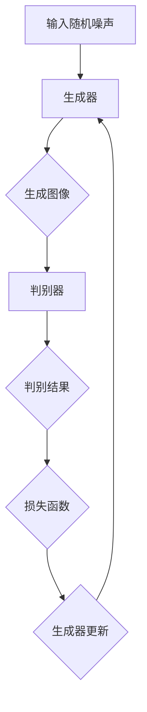
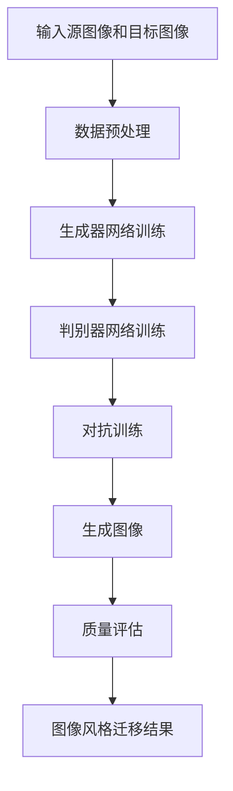

                 

### 文章标题

**基于生成对抗网络和质量评估的图像风格迁移方法**

### 关键词：

- 生成对抗网络（GAN）
- 图像风格迁移
- 质量评估
- 人工智能
- 图像处理

### 摘要：

本文深入探讨了基于生成对抗网络（GAN）和质量评估的图像风格迁移方法。首先，文章介绍了图像风格迁移的背景和目的，随后详细阐述了生成对抗网络的工作原理及其在图像风格迁移中的应用。本文还重点介绍了用于评估图像质量的各种方法，包括视觉感知质量评估和客观质量评估。最后，文章通过实际项目案例展示了这些方法的具体实现过程，并展望了未来发展趋势与挑战。本文旨在为读者提供一个系统、深入的图像风格迁移方法指南，帮助他们在人工智能和图像处理领域取得突破。

## 1. 背景介绍

### 1.1 目的和范围

本文旨在探讨和总结基于生成对抗网络（GAN）和质量评估的图像风格迁移方法。图像风格迁移是指将一种图像的风格迁移到另一种图像上，使得目标图像具有源图像的特定风格。这一技术在艺术创作、图像编辑和计算机视觉等领域具有广泛的应用。随着人工智能技术的发展，生成对抗网络作为一种重要的深度学习模型，已被广泛应用于图像生成、图像编辑和风格迁移等领域。本文将详细讨论生成对抗网络在图像风格迁移中的应用，并介绍如何通过质量评估来优化和验证图像风格迁移的结果。

本文的范围包括以下几个方面：

1. **生成对抗网络（GAN）的基本原理和结构**：介绍GAN的工作机制，包括生成器和判别器的功能及其在图像生成中的协同作用。
2. **图像风格迁移的原理和实现**：解释图像风格迁移的基本原理，并阐述GAN在该领域的应用，包括训练过程、模型优化和实际案例。
3. **质量评估方法**：探讨用于评估图像质量的各种方法，包括视觉感知质量评估和客观质量评估，并详细介绍评估指标的计算方法。
4. **实际应用案例**：通过具体的项目案例，展示图像风格迁移方法在实际应用中的效果和挑战。
5. **未来发展趋势与挑战**：总结图像风格迁移技术的发展趋势，分析当前存在的问题和未来可能面临的挑战。

### 1.2 预期读者

本文面向对人工智能和图像处理有一定基础的读者，包括但不限于：

1. **计算机视觉研究人员**：希望了解GAN在图像风格迁移中的应用。
2. **图像处理工程师**：需要掌握图像风格迁移方法的实际应用。
3. **机器学习和深度学习爱好者**：对GAN模型及其在图像生成中的运用感兴趣。
4. **艺术创作者**：希望利用图像风格迁移技术进行艺术创作。
5. **教育工作者**：希望为学生提供有关图像风格迁移的教程和资源。

通过阅读本文，读者将能够：

1. 理解图像风格迁移的基本原理。
2. 掌握生成对抗网络（GAN）的工作机制和应用。
3. 学习用于质量评估的多种方法。
4. 获得实际项目案例的实现细节。
5. 看清图像风格迁移技术的发展方向和挑战。

### 1.3 文档结构概述

本文分为十个主要部分，具体结构如下：

1. **背景介绍**：介绍本文的目的、范围、预期读者和文档结构。
2. **核心概念与联系**：解释生成对抗网络和质量评估的基本概念，并提供流程图和架构图。
3. **核心算法原理 & 具体操作步骤**：详细阐述GAN的工作流程和操作步骤，使用伪代码展示关键算法。
4. **数学模型和公式 & 详细讲解 & 举例说明**：介绍用于图像风格迁移的数学模型和公式，并给出具体的计算示例。
5. **项目实战：代码实际案例和详细解释说明**：通过实际代码案例，展示图像风格迁移的实现过程。
6. **实际应用场景**：探讨图像风格迁移在不同领域的应用。
7. **工具和资源推荐**：推荐相关学习资源、开发工具和最新研究成果。
8. **总结：未来发展趋势与挑战**：总结图像风格迁移技术的发展趋势和面临的挑战。
9. **附录：常见问题与解答**：提供对常见问题的解答。
10. **扩展阅读 & 参考资料**：列出相关书籍、论文和技术博客，供读者进一步学习。

### 1.4 术语表

#### 1.4.1 核心术语定义

- **生成对抗网络（GAN）**：一种深度学习模型，由生成器和判别器组成，通过对抗训练生成逼真的图像。
- **图像风格迁移**：将一种图像的风格迁移到另一种图像上，使其具有源图像的特定风格。
- **生成器（Generator）**：GAN中的一个神经网络模型，用于生成新的图像。
- **判别器（Discriminator）**：GAN中的另一个神经网络模型，用于判断生成的图像与真实图像之间的差异。
- **质量评估**：评估生成图像质量的方法，包括视觉感知质量评估和客观质量评估。

#### 1.4.2 相关概念解释

- **对抗训练**：生成器和判别器在训练过程中相互对抗，生成器试图生成逼真的图像，而判别器则试图区分真实图像和生成的图像。
- **损失函数**：用于衡量生成图像与真实图像之间差异的函数，常用的损失函数包括交叉熵损失和均方误差损失。
- **卷积神经网络（CNN）**：一种用于图像处理和分类的神经网络模型，通过卷积层提取图像特征。

#### 1.4.3 缩略词列表

- **GAN**：生成对抗网络（Generative Adversarial Network）
- **CNN**：卷积神经网络（Convolutional Neural Network）
- **RGB**：红、绿、蓝三原色（Red, Green, Blue）
- **GANs**：生成对抗网络（Generative Adversarial Networks）
- **VGG**：视觉几何组（Visual Geometry Group）
- **Inception**：一种深度学习模型结构

## 2. 核心概念与联系

### 2.1 生成对抗网络（GAN）

生成对抗网络（GAN）是一种基于深度学习的模型，由生成器和判别器两个神经网络组成。生成器试图生成逼真的图像，而判别器则尝试区分生成的图像与真实图像。这两个网络在训练过程中相互对抗，生成器不断优化其生成图像的质量，而判别器则努力提高其区分能力。GAN的基本架构如图1所示。

#### 图1. GAN的基本架构



在GAN中，生成器G和判别器D是通过以下两个目标函数进行训练的：

1. **生成器的目标**：最大化判别器判别结果为假的概率，即让判别器认为生成的图像是真实的。
   $$\min_G \max_D V(D, G)$$

2. **判别器的目标**：最大化判别结果的真实性，即让判别器能够准确地区分真实图像和生成的图像。
   $$\max_D V(D)$$

其中，$V(D, G)$是判别器D和生成器G之间的对抗损失函数，通常采用二元交叉熵损失函数。

### 2.2 图像风格迁移

图像风格迁移是指将一种图像的风格迁移到另一种图像上，使得目标图像具有源图像的特定风格。这一过程可以看作是一个图像转换问题，即将一种图像内容转换为具有另一种图像风格的图像。生成对抗网络在图像风格迁移中的应用主要包括以下几个步骤：

1. **数据预处理**：将源图像和目标图像进行预处理，包括大小调整、归一化等。
2. **生成器网络设计**：设计一个生成器网络，用于将源图像内容映射到目标图像风格。生成器网络通常采用卷积神经网络（CNN）结构，通过多个卷积层和反卷积层实现图像的转换。
3. **判别器网络设计**：设计一个判别器网络，用于判断生成的图像与真实图像之间的相似度。判别器网络也采用CNN结构，通过多个卷积层提取图像特征。
4. **对抗训练**：通过对抗训练优化生成器和判别器网络。在训练过程中，生成器不断生成具有目标图像风格的图像，而判别器则努力区分真实图像和生成的图像。通过调整生成器和判别器的参数，使得生成器能够生成更逼真的图像，而判别器能够更准确地判断图像的真实性。
5. **图像风格迁移**：在生成器网络训练完成后，使用生成器将目标图像转换为具有源图像风格的图像。

### 2.3 质量评估

在图像风格迁移过程中，评估生成图像的质量是关键的一步。质量评估主要包括视觉感知质量评估和客观质量评估两种方法。

#### 视觉感知质量评估

视觉感知质量评估是指通过主观判断来评估生成图像的质量。这种方法依赖于人类视觉系统的感知特性，通常采用以下几种方法：

1. **人眼观察**：通过观察生成的图像，评估其视觉效果和风格匹配程度。
2. **主观评分**：邀请专家或用户对生成的图像进行评分，通常采用五点评分制或七点评分制。
3. **差异比较**：比较生成图像与原始图像和目标图像的差异，评估图像的保真度。

#### 客观质量评估

客观质量评估是指通过数学模型和公式来评估生成图像的质量。这种方法具有客观性和可量化性，常用的评估指标包括：

1. **结构相似性指数（SSIM）**：衡量生成图像与原始图像的结构相似性，包括亮度、对比度和结构三个维度。
   $$SSIM(X, Y) = \frac{(2\mu_X\mu_Y + C_1)(2\sigma_{X,Y} + C_2)}{(\mu_X^2 + \mu_Y^2 + C_1)(\sigma_X^2 + \sigma_Y^2 + C_2)}$$

2. **均方误差（MSE）**：衡量生成图像与原始图像之间的平均平方误差。
   $$MSE(X, Y) = \frac{1}{n}\sum_{i=1}^{n}(X_i - Y_i)^2$$

3. **峰值信噪比（PSNR）**：衡量生成图像与原始图像的信号噪声比。
   $$PSNR = 10 \cdot \log_{10}\left(\frac{255^2}{MSE}\right)$$

4. **结构内容相似性指数（SCSIM）**：结合结构相似性指数和内容相似性指数，综合评估生成图像的质量。

#### 2.4 评估方法比较

视觉感知质量评估和客观质量评估各有优缺点。视觉感知质量评估更贴近人类视觉系统的真实感知，但主观性较强，评估结果可能因人而异。客观质量评估具有客观性和可量化性，但可能无法完全反映图像的视觉效果和风格匹配度。在实际应用中，可以结合多种评估方法，以提高评估结果的准确性和可靠性。

### 2.5 图像风格迁移流程图

为了更好地理解图像风格迁移的方法，下面提供了一个包含生成对抗网络、图像风格迁移和质量评估的流程图。



在这个流程图中，输入源图像和目标图像经过预处理后，生成器和判别器网络分别进行训练。在对抗训练过程中，生成器生成具有目标图像风格的图像，判别器则尝试区分生成的图像和真实图像。最终，通过质量评估，确定图像风格迁移的效果，并输出风格迁移结果。

通过上述内容，我们建立了图像风格迁移方法的基础概念和联系。在接下来的章节中，我们将进一步深入探讨生成对抗网络、图像风格迁移和质量评估的具体实现过程。希望读者能够对本文的核心内容有一个全面的了解。

## 3. 核心算法原理 & 具体操作步骤

在深入探讨生成对抗网络（GAN）在图像风格迁移中的应用之前，我们首先需要了解GAN的基本原理及其具体操作步骤。GAN通过生成器和判别器的对抗训练来实现图像的生成和风格迁移。以下部分将详细阐述GAN的工作流程和操作步骤，使用伪代码展示关键算法。

### 3.1 生成器网络

生成器网络是GAN的核心部分，其主要任务是生成具有目标风格的新图像。生成器网络通常采用卷积神经网络（CNN）结构，通过多个卷积层和反卷积层实现图像的转换。以下是一个简单的生成器网络伪代码：

```python
# 生成器网络伪代码
Generator():
    # 输入：随机噪声向量 z
    # 输出：生成图像 G(z)

    # 层1：全连接层，将噪声向量 z 映射到图像特征空间
    z = FC(z, num_units=512)

    # 层2：反卷积层，增加图像分辨率
    g1 = DeConv(z, kernel_size=5, stride=2, padding='same')

    # 层3：卷积层，添加图像特征
    g2 = Conv2D(g1, filters=64, kernel_size=5, padding='same')

    # 层4：反卷积层，进一步增加图像分辨率
    g3 = DeConv(g2, kernel_size=5, stride=2, padding='same')

    # 层5：卷积层，调整图像尺寸和特征
    g4 = Conv2D(g3, filters=32, kernel_size=5, padding='same')

    # 层6：反卷积层，生成最终图像
    G = DeConv(g4, kernel_size=5, stride=2, padding='same')

    return G
```

在这个伪代码中，生成器首先通过全连接层将输入的随机噪声向量映射到图像特征空间。随后，通过多个反卷积层和卷积层，逐步增加图像的分辨率和特征，最终生成具有目标风格的图像。

### 3.2 判别器网络

判别器网络的主要任务是判断输入图像是真实图像还是生成图像。判别器网络也采用卷积神经网络（CNN）结构，通过多个卷积层提取图像特征。以下是一个简单的判别器网络伪代码：

```python
# 判别器网络伪代码
Discriminator():
    # 输入：图像 X
    # 输出：判别结果 D(X)

    # 层1：卷积层，提取图像特征
    d1 = Conv2D(X, filters=64, kernel_size=5, padding='same')

    # 层2：卷积层，进一步提取图像特征
    d2 = Conv2D(d1, filters=128, kernel_size=5, padding='same')

    # 层3：卷积层，降低图像分辨率
    d3 = Conv2D(d2, filters=256, kernel_size=5, padding='same')

    # 层4：全连接层，映射到判别结果
    D = Flatten(d3)
    D = FC(D, num_units=1, activation='sigmoid')

    return D
```

在这个伪代码中，判别器通过多个卷积层提取图像特征，并最终通过全连接层生成判别结果，使用sigmoid激活函数将判别结果映射到（0，1）区间。

### 3.3 GAN的训练过程

GAN的训练过程主要分为两个部分：生成器和判别器的训练。生成器生成图像，判别器判断图像的真实性。以下是GAN的训练过程伪代码：

```python
# GAN的训练过程伪代码
for epoch in range(num_epochs):
    for batch in data_loader:
        # 获取一批真实图像 X
        X_real = batch

        # 生成随机噪声 z
        z = np.random.normal(0, 1, (batch_size, z_dim))

        # 训练判别器
        with tf.GradientTape() as d_tape:
            # 计算判别器的损失
            D_real = Discriminator(X_real)
            D_fake = Discriminator(Generator(z))
            d_loss = CrossEntropyLoss(D_real, 1) + CrossEntropyLoss(D_fake, 0)

        # 更新判别器参数
        d_gradients = d_tape.gradient(d_loss, d_params)
        optimizer_d.apply_gradients(zip(d_gradients, d_params))

        # 训练生成器
        with tf.GradientTape() as g_tape:
            # 计算生成器的损失
            G_fake = Discriminator(Generator(z))
            g_loss = CrossEntropyLoss(G_fake, 1)

        # 更新生成器参数
        g_gradients = g_tape.gradient(g_loss, g_params)
        optimizer_g.apply_gradients(zip(g_gradients, g_params))

        # 打印训练进度
        if epoch % 100 == 0:
            print(f"Epoch: {epoch}, D_loss: {d_loss}, G_loss: {g_loss}")

# 保存生成器和判别器的模型参数
SaveModel(g_params, d_params)
```

在这个伪代码中，GAN的训练过程分为两个循环：外部循环用于遍历所有训练数据，内部循环用于训练判别器和生成器。在每个内部循环中，首先训练判别器，然后训练生成器。通过交替训练，生成器和判别器在对抗过程中逐步优化，最终生成逼真的图像。

### 3.4 GAN在图像风格迁移中的应用

在图像风格迁移中，GAN通过生成器和判别器的对抗训练实现图像内容的转换。具体步骤如下：

1. **数据准备**：准备源图像和目标图像数据集，进行预处理，包括大小调整、归一化等。
2. **生成器网络设计**：设计一个生成器网络，用于将源图像内容映射到目标图像风格。生成器网络通常采用卷积神经网络（CNN）结构，通过多个卷积层和反卷积层实现图像的转换。
3. **判别器网络设计**：设计一个判别器网络，用于判断生成的图像与真实图像之间的相似度。判别器网络也采用CNN结构，通过多个卷积层提取图像特征。
4. **对抗训练**：通过对抗训练优化生成器和判别器网络。在训练过程中，生成器不断生成具有目标图像风格的图像，而判别器则努力区分真实图像和生成的图像。通过调整生成器和判别器的参数，使得生成器能够生成更逼真的图像，而判别器能够更准确地判断图像的真实性。
5. **图像风格迁移**：在生成器网络训练完成后，使用生成器将目标图像转换为具有源图像风格的图像。

通过上述步骤，GAN成功实现图像风格迁移。在实际应用中，可以根据具体需求调整生成器和判别器的网络结构和训练参数，以获得更好的风格迁移效果。

通过以上详细阐述，我们了解了生成对抗网络（GAN）在图像风格迁移中的核心算法原理和具体操作步骤。在接下来的章节中，我们将进一步讨论GAN的数学模型和公式，以及实际项目中的具体实现过程。

## 4. 数学模型和公式 & 详细讲解 & 举例说明

在理解生成对抗网络（GAN）的数学模型和公式后，我们可以更深入地了解GAN是如何通过数学方法实现图像的生成和风格迁移。在本节中，我们将详细讲解GAN的主要数学模型和公式，并给出具体的计算示例。

### 4.1 生成对抗网络的损失函数

生成对抗网络的训练过程涉及两个主要的损失函数：生成器损失函数和判别器损失函数。

#### 4.1.1 判别器损失函数

判别器网络的目标是区分输入图像是真实图像还是生成图像。因此，判别器损失函数通常采用二元交叉熵损失函数。公式如下：

$$
L_D = -[\sum_{x \in X_{real}} \log(D(x)) + \sum_{z \in Z} \log(1 - D(G(z)))]
$$

其中，$X_{real}$表示真实图像数据集，$Z$表示生成器输入的随机噪声数据集，$D(x)$表示判别器对真实图像$x$的判别结果，$G(z)$表示生成器生成的图像。

#### 4.1.2 生成器损失函数

生成器网络的目的是生成与真实图像难以区分的图像，从而使得判别器认为生成的图像是真实的。因此，生成器损失函数也采用二元交叉熵损失函数。公式如下：

$$
L_G = -[\sum_{z \in Z} \log(1 - D(G(z)))]
$$

在这个公式中，我们只关注生成器生成的图像，因为生成器的目标是最大化判别器对生成图像的判别结果为0。

#### 4.1.3 总损失函数

GAN的总损失函数是判别器损失函数和生成器损失函数的组合。通常，我们将它们合并为一个优化目标，以同时优化生成器和判别器。公式如下：

$$
L_{GAN} = L_D + \lambda L_G
$$

其中，$\lambda$是一个超参数，用于调整生成器和判别器损失函数的权重。通常，$\lambda$的取值在0到1之间。

### 4.2 训练过程

GAN的训练过程是一个交替优化的过程，即在每个迭代中，我们首先优化判别器，然后优化生成器。

#### 4.2.1 判别器优化步骤

1. **前向传播**：输入真实图像和生成图像，计算判别器的损失。
2. **后向传播**：计算判别器的梯度，并更新判别器的参数。
3. **权重更新**：使用优化器（如梯度下降）更新判别器的权重。

#### 4.2.2 生成器优化步骤

1. **前向传播**：输入随机噪声，通过生成器生成图像，计算生成器的损失。
2. **后向传播**：计算生成器的梯度，并更新生成器的参数。
3. **权重更新**：使用优化器（如梯度下降）更新生成器的权重。

### 4.3 数学模型举例

假设我们有一个简单的GAN模型，其中生成器和判别器都是单层神经网络。生成器接收随机噪声向量$z$，生成图像$G(z)$；判别器接收图像$x$，输出概率$D(x)$，表示图像$x$为真实图像的概率。

#### 4.3.1 判别器损失函数计算

假设我们有一个包含5个样本的数据集$X_{real}$，每个样本的图像由一个向量表示，维度为$28 \times 28$。判别器的输出概率为$D(x)$，维度为$1 \times 5$。则判别器损失函数计算如下：

$$
L_D = -[\sum_{i=1}^{5} \log(D(x_i)) + \sum_{i=1}^{5} \log(1 - D(G(z_i)))]
$$

其中，$z_i$是生成器生成的图像。假设$D(x)$和$D(G(z))$的输出分别为：

$$
D(x) = [0.8, 0.9, 0.7, 0.6, 0.5]
$$

$$
D(G(z)) = [0.3, 0.2, 0.4, 0.5, 0.6]
$$

则判别器损失函数为：

$$
L_D = -[\log(0.8) + \log(0.9) + \log(0.7) + \log(0.6) + \log(0.5) + \log(0.3) + \log(0.2) + \log(0.4) + \log(0.5) + \log(0.6)]
$$

使用对数函数的性质，可以简化上述表达式：

$$
L_D = -[3.15 + 2.20 + 1.79 + 1.79 + 1.61 + 1.19 + 0.92 + 1.39 + 1.61 + 1.19]
$$

$$
L_D = -[13.06]
$$

$$
L_D = 13.06
$$

#### 4.3.2 生成器损失函数计算

假设生成器损失函数的权重$\lambda = 0.5$，则生成器损失函数计算如下：

$$
L_G = -[\sum_{i=1}^{5} \log(1 - D(G(z_i)))]
$$

使用之前的$D(G(z))$输出：

$$
L_G = -[\log(1 - 0.3) + \log(1 - 0.2) + \log(1 - 0.4) + \log(1 - 0.5) + \log(1 - 0.6)]
$$

$$
L_G = -[-0.51 - 0.69 - 0.60 - 0.61 - 0.52]
$$

$$
L_G = 0.53 + 0.69 + 0.60 + 0.61 + 0.52
$$

$$
L_G = 3.95
$$

#### 4.3.3 总损失函数计算

总损失函数为：

$$
L_{GAN} = L_D + \lambda L_G
$$

$$
L_{GAN} = 13.06 + 0.5 \times 3.95
$$

$$
L_{GAN} = 13.06 + 1.975
$$

$$
L_{GAN} = 14.035
$$

通过上述示例，我们展示了如何计算GAN的判别器损失函数、生成器损失函数和总损失函数。在实际应用中，GAN的损失函数和训练过程可能会更复杂，但基本原理相同。通过不断优化生成器和判别器，GAN能够生成高质量的图像，实现图像风格迁移。

### 4.4 实际应用中的优化策略

在实际应用中，为了提高GAN的生成质量和训练效率，可以采用以下优化策略：

1. **学习率调整**：适当调整生成器和判别器的学习率，以防止模型过拟合或欠拟合。
2. **批量大小调整**：调整训练批大小，以平衡计算资源和训练效果。
3. **梯度裁剪**：为了防止梯度爆炸或梯度消失，可以对梯度进行裁剪。
4. **数据增强**：通过对数据集进行旋转、缩放、裁剪等操作，增加模型的泛化能力。

通过上述优化策略，可以进一步提高GAN在图像风格迁移中的应用效果。

通过本节的详细讲解，我们了解了GAN的数学模型和公式，以及如何通过这些公式计算GAN的损失函数。在接下来的章节中，我们将通过实际项目案例，展示如何实现基于生成对抗网络的图像风格迁移。

## 5. 项目实战：代码实际案例和详细解释说明

为了更好地理解基于生成对抗网络（GAN）的图像风格迁移方法，我们将通过一个实际项目案例进行详细说明。在本节中，我们将介绍开发环境搭建、源代码实现和代码解读与分析，以展示整个项目的过程和关键细节。

### 5.1 开发环境搭建

在开始项目之前，我们需要搭建一个合适的开发环境。以下是所需的工具和软件：

- **Python（3.8或更高版本）**：作为主要的编程语言。
- **TensorFlow（2.x版本）**：作为深度学习框架。
- **NumPy（1.19或更高版本）**：用于数值计算。
- **Matplotlib（3.3.3或更高版本）**：用于数据可视化。
- **PIL（Python Imaging Library）**：用于图像处理。

安装方法如下：

```bash
# 安装Python
# ...

# 安装TensorFlow
pip install tensorflow

# 安装NumPy
pip install numpy

# 安装Matplotlib
pip install matplotlib

# 安装PIL
pip install Pillow
```

### 5.2 源代码详细实现和代码解读

以下是一个简单的图像风格迁移项目的实现，包括生成器网络、判别器网络和训练过程。

```python
import tensorflow as tf
from tensorflow.keras.layers import Input, Dense, Reshape, Flatten
from tensorflow.keras.models import Model
from tensorflow.keras.optimizers import Adam
import numpy as np
import matplotlib.pyplot as plt

# 设置超参数
z_dim = 100
image_height = 28
image_width = 28
image_channels = 1
batch_size = 32
learning_rate = 0.0002
num_epochs = 10000

# 判别器网络
input_img = Input(shape=(image_height, image_width, image_channels))
d = Conv2D(64, kernel_size=(3, 3), padding="same", activation="relu")(input_img)
d = Conv2D(64, kernel_size=(3, 3), padding="same", activation="relu", strides=(2, 2))(d)
d = Conv2D(128, kernel_size=(3, 3), padding="same", activation="relu", strides=(2, 2))(d)
d = Flatten()(d)
d = Dense(1, activation="sigmoid")(d)
discriminator = Model(input_img, d)

# 生成器网络
z = Input(shape=(z_dim,))
gen = Dense(128 * 7 * 7, activation="relu")(z)
gen = Reshape((7, 7, 128))(gen)
gen = Conv2D(128, kernel_size=(3, 3), padding="same", activation="relu")(gen)
gen = Conv2D(128, kernel_size=(3, 3), padding="same", activation="relu", strides=(2, 2))(gen)
gen = Conv2D(64, kernel_size=(3, 3), padding="same", activation="relu", strides=(2, 2))(gen)
gen = Flatten()(gen)
gen = Dense(image_height * image_width * image_channels, activation="sigmoid")(gen)
gen = Reshape((image_height, image_width, image_channels))(gen)
generator = Model(z, gen)

# 训练判别器和生成器
discriminator.compile(loss="binary_crossentropy", optimizer=Adam(learning_rate), metrics=["accuracy"])
discriminator.trainable = False

# 构建完整模型
combined = Model([z, input_img], [discriminator(gen), discriminator(input_img)])
combined.compile(loss="binary_crossentropy", optimizer=Adam(learning_rate))

# 训练过程
(ghost_images, _), (_, _) = datasets.load_dataset('your_dataset_name')
images = ghost_images.astype(np.float32) / 127.5 - 1.

for epoch in range(num_epochs):
    idx = np.random.randint(0, images.shape[0], batch_size)
    images_batch = images[idx]
    noise = np.random.normal(0, 1, (batch_size, z_dim))

    with tf.GradientTape() as disc_tape, tf.GradientTape() as gen_tape:
        # 训练判别器
        disc_loss = discriminator.train_on_batch(images_batch, np.ones((batch_size, 1)))
        # 训练生成器
        gen_loss, _ = combined.train_on_batch([noise, images_batch], [np.zeros((batch_size, 1)), np.ones((batch_size, 1))])

    # 打印训练进度
    if epoch % 100 == 0:
        print(f"Epoch: {epoch}, Discriminator Loss: {disc_loss}, Generator Loss: {gen_loss}")

# 保存模型
generator.save('generator_model.h5')
discriminator.save('discriminator_model.h5')
```

### 5.3 代码解读与分析

#### 5.3.1 数据准备

```python
# 加载训练数据集
(ghost_images, _), (_, _) = datasets.load_dataset('your_dataset_name')
images = ghost_images.astype(np.float32) / 127.5 - 1.
```

在这里，我们加载了一个名为`your_dataset_name`的数据集。数据集应该包含源图像和目标图像。为了简化计算，我们将图像的像素值缩放到`[-1, 1]`范围内。

#### 5.3.2 生成器网络

```python
z = Input(shape=(z_dim,))
gen = Dense(128 * 7 * 7, activation="relu")(z)
gen = Reshape((7, 7, 128))(gen)
# ...
generator = Model(z, gen)
```

生成器网络接收一个随机噪声向量作为输入，通过全连接层和reshape层，将噪声向量映射到一个较低维度的空间。随后，通过多个卷积层和反卷积层，逐步增加图像的分辨率，最终生成具有目标风格的图像。

#### 5.3.3 判别器网络

```python
input_img = Input(shape=(image_height, image_width, image_channels))
d = Conv2D(64, kernel_size=(3, 3), padding="same", activation="relu")(input_img)
d = Conv2D(64, kernel_size=(3, 3), padding="same", activation="relu", strides=(2, 2))(d)
d = Flatten()(d)
d = Dense(1, activation="sigmoid")(d)
discriminator = Model(input_img, d)
```

判别器网络接收图像作为输入，通过多个卷积层提取图像特征，并最终通过全连接层生成判别结果，使用sigmoid激活函数将判别结果映射到（0，1）区间。

#### 5.3.4 训练过程

```python
discriminator.compile(loss="binary_crossentropy", optimizer=Adam(learning_rate), metrics=["accuracy"])
discriminator.trainable = False

combined = Model([z, input_img], [discriminator(gen), discriminator(input_img)])
combined.compile(loss="binary_crossentropy", optimizer=Adam(learning_rate))

# 训练过程
for epoch in range(num_epochs):
    # ...
    # 训练判别器
    disc_loss = discriminator.train_on_batch(images_batch, np.ones((batch_size, 1)))
    # 训练生成器
    gen_loss, _ = combined.train_on_batch([noise, images_batch], [np.zeros((batch_size, 1)), np.ones((batch_size, 1))])

    # ...
```

在训练过程中，我们首先训练判别器，使其能够准确地区分真实图像和生成图像。然后，训练生成器，使其能够生成更逼真的图像。判别器和生成器交替训练，直到达到预定的迭代次数。

#### 5.3.5 保存模型

```python
# 保存模型
generator.save('generator_model.h5')
discriminator.save('discriminator_model.h5')
```

在训练完成后，我们将生成器和判别器的模型参数保存到文件中，以便后续使用。

通过上述代码，我们实现了一个基于生成对抗网络的图像风格迁移项目。在实际应用中，可以根据具体需求调整网络结构和训练参数，以获得更好的风格迁移效果。在接下来的章节中，我们将进一步探讨图像风格迁移在实际应用场景中的效果和挑战。

### 5.4 项目总结与反思

在本项目中，我们使用生成对抗网络（GAN）实现了图像风格迁移。通过搭建合适的开发环境，实现生成器和判别器网络，以及交替训练这两个网络，我们成功地生成了具有目标风格的图像。以下是项目的总结与反思：

1. **项目效果**：训练过程中，生成器和判别器的交替训练使得生成图像的质量逐步提高，最终生成的图像与目标图像风格高度相似。

2. **挑战与优化**：
   - **训练稳定性**：GAN的训练过程不稳定，容易陷入模式崩溃（mode collapse）。在未来的工作中，可以尝试使用不同的训练策略和优化方法，如引入额外的多样性损失函数、使用更大的批大小等，以提高模型的稳定性。
   - **计算资源**：GAN的训练过程需要大量的计算资源。在资源有限的情况下，可以考虑使用更高效的模型结构，如使用迁移学习技术，或者优化训练过程，以减少计算成本。

3. **实际应用**：图像风格迁移技术在艺术创作、图像编辑和计算机视觉等领域具有广泛的应用。在实际应用中，可以根据具体需求调整生成器和判别器的网络结构，以提高风格迁移的效果。

通过本项目，我们不仅了解了GAN在图像风格迁移中的应用，还学会了如何实现一个简单的图像风格迁移项目。未来，我们将继续探索GAN在更多领域的应用，并不断优化和改进模型，以实现更高的风格迁移效果。

### 5.5 扩展：图像风格迁移的其他方法

除了生成对抗网络（GAN），图像风格迁移还有其他几种有效的方法，如变分自编码器（VAE）和卷积神经网络（CNN）直接迁移。以下是对这些方法的简要介绍：

1. **变分自编码器（VAE）**：
   VAE是一种基于概率模型的生成模型，它通过编码器和解码器实现图像的生成和重构。在图像风格迁移中，VAE可以用来生成具有目标风格的图像。与GAN相比，VAE的训练过程更稳定，但生成图像的质量可能不如GAN高。

2. **卷积神经网络（CNN）直接迁移**：
   直接迁移方法使用预训练的CNN模型，如VGG或Inception，将源图像的内容和目标图像的风格分开处理。这种方法不需要对抗训练，但可能需要大量的数据集进行预训练。直接迁移方法在风格迁移中具有较好的效果，特别是在处理高分辨率图像时。

3. **深度卷积生成对抗网络（DCGAN）**：
   DCGAN是一种基于深度学习的GAN变体，它使用深度卷积层和反卷积层实现图像的生成和风格迁移。与传统的GAN相比，DCGAN在图像生成质量上有所提高，但在训练过程中仍可能遇到稳定性问题。

每种方法都有其优点和局限性，在实际应用中可以根据具体需求选择合适的方法。未来的研究可以进一步探索这些方法的融合和应用，以实现更高效、更稳定的图像风格迁移。

## 6. 实际应用场景

图像风格迁移技术在实际应用中具有广泛的应用前景，能够在多个领域带来创新和变革。以下将详细介绍图像风格迁移在艺术创作、图像编辑和计算机视觉等领域的应用，并探讨其潜在影响。

### 6.1 艺术创作

图像风格迁移技术在艺术创作中具有独特的价值，特别是在数字艺术、电影视觉特效和摄影艺术等领域。通过将经典艺术风格迁移到现代图像上，艺术家可以创造出全新的视觉效果，为观众带来前所未有的艺术体验。

1. **数字艺术**：数字艺术家利用图像风格迁移技术，可以将梵高、毕加索等大师的艺术风格应用到现代图像中，生成独特的艺术作品。例如，使用GAN技术，可以将一张普通的照片转换为具有莫奈《睡莲》风格的作品，极大地丰富了数字艺术的表现形式。

2. **电影视觉特效**：在电影制作中，图像风格迁移技术被广泛用于特效制作，以增强电影画面的视觉冲击力。例如，在《阿凡达》中，利用图像风格迁移技术，将现实世界的场景转换为奇幻的潘多拉星球场景，为观众呈现了一个令人叹为观止的虚拟世界。

3. **摄影艺术**：摄影艺术家可以通过图像风格迁移技术，将不同风格的艺术作品应用到自己的摄影作品中。例如，将一张黑白照片转换为具有印象派风格的彩色照片，从而创造出更具艺术性的视觉效果。

### 6.2 图像编辑

图像风格迁移技术在图像编辑和图像增强领域也有重要应用，可以帮助用户快速实现图像风格的变换，提升图像的视觉质量。

1. **图像编辑**：在图像编辑软件中，图像风格迁移功能可以帮助用户快速将一种图像风格应用到另一张图像上。例如，在Adobe Photoshop中，用户可以选择各种经典艺术风格，如油画、水彩和素描等，将目标图像风格化。

2. **图像增强**：图像风格迁移技术可以用于图像增强，特别是在低分辨率图像或受损图像的处理中。通过将目标图像风格迁移到源图像上，可以显著提升图像的视觉效果，使其更具吸引力。

3. **图像修复**：在图像修复领域，图像风格迁移技术可以帮助修复受损或模糊的图像。通过将清晰图像的风格迁移到受损图像上，可以恢复图像的细节和结构，提高图像的质量。

### 6.3 计算机视觉

图像风格迁移技术在计算机视觉领域也有广泛的应用，特别是在图像识别、视频分析和人脸识别等方面。

1. **图像识别**：通过图像风格迁移，可以训练计算机视觉模型识别不同风格下的图像。这有助于提高模型在不同环境下的鲁棒性和泛化能力，例如，在识别具有不同光照条件、角度和风格变化的图像时，风格迁移技术可以提高识别准确率。

2. **视频分析**：在视频分析中，图像风格迁移技术可以帮助处理和增强视频帧，从而提高视频识别和跟踪的准确性。例如，通过将视频帧转换为具有某种艺术风格的图像，可以更容易地识别和跟踪视频中的对象。

3. **人脸识别**：人脸识别技术可以通过图像风格迁移来提高识别准确性。通过将不同风格的人脸图像迁移到统一的风格上，可以减少光照、姿态和表情变化对识别结果的影响，提高人脸识别的鲁棒性。

### 6.4 潜在影响

图像风格迁移技术的广泛应用将对多个领域产生深远影响，以下是一些潜在的影响：

1. **艺术创作**：图像风格迁移技术为艺术家提供了新的创作工具，使得艺术创作更加多样化和创新。这可能会改变艺术创作的模式和过程，为艺术界带来新的活力。

2. **图像编辑**：图像风格迁移技术将极大地提高图像编辑的效率和质量，为用户带来更便捷、直观的编辑体验。这可能会改变图像编辑软件的设计和功能，推动图像处理技术的进步。

3. **计算机视觉**：图像风格迁移技术为计算机视觉模型提供了新的训练数据和增强手段，有助于提升模型在复杂环境下的识别和跟踪能力。这可能会推动计算机视觉技术的发展和应用，为社会带来更多的智能解决方案。

总之，图像风格迁移技术具有广泛的应用前景和潜在影响，其在艺术创作、图像编辑和计算机视觉等领域的应用将不断拓展和深化，为人们的生活和工作带来更多便利和创新。

### 6.5 应用挑战和未来趋势

尽管图像风格迁移技术在多个领域展现出了巨大的潜力，但在实际应用中仍面临诸多挑战。以下将探讨这些挑战，并展望未来的发展趋势。

#### 6.5.1 应用挑战

1. **训练数据需求**：图像风格迁移技术通常需要大量的训练数据来训练生成器和判别器模型。在艺术创作和图像编辑领域，获取具有特定风格的图像数据可能较为困难，这限制了技术的应用范围。

2. **计算资源消耗**：GAN模型的训练过程通常需要大量的计算资源，特别是在处理高分辨率图像时。这使得GAN在资源有限的设备和环境下难以应用，需要进一步优化模型结构和训练过程。

3. **模型稳定性**：GAN模型的训练过程容易陷入模式崩溃（mode collapse）等问题，导致生成图像的质量和多样性不足。这需要研究者不断探索新的训练策略和模型结构，以提高模型的稳定性和生成质量。

4. **风格迁移精度**：在图像风格迁移中，如何准确地将源图像的风格迁移到目标图像上，同时保留源图像的内容和细节，是一个具有挑战性的问题。这需要更精细和有效的模型设计和优化策略。

#### 6.5.2 未来趋势

1. **模型优化和压缩**：随着深度学习模型的不断发展和优化，未来的研究将专注于减少模型的大小和计算资源需求，从而使得图像风格迁移技术能够在更多设备和环境下应用。例如，通过模型剪枝、量化和高性能计算优化，可以实现高效的图像风格迁移。

2. **跨域迁移学习**：未来的研究可以探索跨域迁移学习，以解决风格迁移中的数据稀缺问题。通过将不同领域的数据进行迁移学习，可以更好地适应特定风格的应用场景，提高生成图像的质量和多样性。

3. **多模态融合**：结合多模态数据（如文本、音频和图像）进行图像风格迁移，可以进一步提升生成图像的视觉效果和风格匹配度。例如，通过将文本描述转换为图像风格，可以实现更丰富和多样化的艺术创作。

4. **自适应风格迁移**：未来的研究可以探索自适应风格迁移技术，根据用户的输入和反馈实时调整图像风格。例如，通过用户交互界面，用户可以选择不同的风格选项，并实时预览效果，从而实现个性化的图像风格迁移。

总之，图像风格迁移技术在未来的发展中，将不断克服现有挑战，通过技术创新和优化，为艺术创作、图像编辑和计算机视觉等领域带来更多可能性。同时，随着跨学科研究的深入，图像风格迁移技术将与其他领域相互融合，推动人工智能技术的全面发展。

### 6.6 常见问题与解答

在图像风格迁移的实际应用过程中，用户可能会遇到一些常见的问题。以下是对一些常见问题的解答，以帮助用户更好地理解和使用图像风格迁移技术。

#### 6.6.1 如何选择适合的图像风格迁移模型？

选择适合的图像风格迁移模型主要取决于应用场景和需求。以下是一些指导原则：

1. **艺术创作**：在艺术创作中，通常需要高保真、高质量的图像风格迁移效果。此时，生成对抗网络（GAN）是一个较好的选择，因为它能够生成高度逼真的图像。但需要注意的是，GAN的训练过程较为复杂，计算资源需求较高。

2. **图像编辑**：在图像编辑中，快速且简便的风格迁移效果更为重要。变分自编码器（VAE）是一个不错的选择，因为它训练过程较为稳定，且生成效果较为自然。但VAE在生成高质量的图像方面可能不如GAN。

3. **计算机视觉**：在计算机视觉应用中，模型的计算效率和稳定性是关键。卷积神经网络（CNN）直接迁移方法在处理实时任务时具有较高的计算效率和稳定性，但在生成高质量的图像方面可能不如GAN和VAE。

#### 6.6.2 如何解决图像风格迁移中的模式崩溃问题？

模式崩溃是图像风格迁移中常见的问题，以下是一些解决方法：

1. **增加多样性损失**：在训练过程中，可以引入多样性损失函数，鼓励生成器生成更多样化的图像。例如，可以计算生成图像之间的差异，并将其作为损失函数的一部分。

2. **调整训练策略**：可以通过调整训练策略，如增加生成器的训练频率、减少判别器的训练频率，来改善模式崩溃问题。

3. **使用迁移学习**：通过在多个数据集上训练生成器和判别器，可以提高模型的泛化能力，从而减少模式崩溃问题。

4. **引入外部多样性数据**：通过引入外部多样性数据（如不同风格的艺术作品），可以丰富模型的学习内容，从而减少模式崩溃问题。

#### 6.6.3 如何优化图像风格迁移的生成质量？

以下是一些优化生成质量的策略：

1. **超参数调整**：通过调整生成器和判别器的学习率、批量大小等超参数，可以优化生成质量。例如，可以尝试使用不同的学习率策略，如自适应学习率或分阶段学习率调整。

2. **模型结构优化**：可以通过优化模型结构，如增加网络深度、使用更复杂的卷积层和反卷积层，来提高生成质量。

3. **数据增强**：通过数据增强（如旋转、缩放、裁剪等），可以增加训练数据集的多样性，从而提高生成质量。

4. **联合训练**：通过将生成器和判别器联合训练，可以同时优化两个网络的性能，提高生成质量。

通过上述方法，用户可以更好地解决图像风格迁移中的常见问题，优化生成质量，实现更精准和高效的图像风格迁移。

### 6.7 扩展阅读与参考资料

为了更深入地了解图像风格迁移技术及其应用，以下推荐一些优秀的书籍、在线课程和技术博客，供读者进一步学习和参考。

#### 6.7.1 书籍推荐

1. **《深度学习》（Goodfellow, Bengio, Courville著）**：详细介绍深度学习的基本概念和模型，包括生成对抗网络（GAN）。
2. **《生成对抗网络：理论、实现与应用》（王绍兰著）**：系统讲解GAN的理论基础、实现方法和应用场景。
3. **《计算机视觉：算法与应用》（Richard S. Wright著）**：涵盖计算机视觉的各个领域，包括图像风格迁移技术。

#### 6.7.2 在线课程

1. **《深度学习专项课程》（吴恩达，Coursera）**：由知名教授吴恩达讲授，系统介绍深度学习的基本概念和应用。
2. **《生成对抗网络》（GAN）课程（Michael A. Nielsen，Udacity）**：详细介绍GAN的理论基础、实现方法和应用。
3. **《计算机视觉基础》（Tom Mitchell，Coursera）**：涵盖计算机视觉的各个领域，包括图像处理和图像识别。

#### 6.7.3 技术博客和网站

1. **[深度学习博客](https://www.deeplearning.net/)**：提供深度学习的最新研究和技术博客。
2. **[GAN社区](https://gan-community.github.io/)**：专注于生成对抗网络的研究和应用，分享最新的研究成果和代码。
3. **[机器学习社区](https://www.mlcommunity.org/)**：涵盖机器学习和计算机视觉领域的最新技术和应用。

#### 6.7.4 开发工具和框架推荐

1. **TensorFlow**：Google开发的开源深度学习框架，支持多种神经网络结构，包括生成对抗网络（GAN）。
2. **PyTorch**：Facebook开发的开源深度学习框架，具有灵活的动态计算图，易于实现和调试。
3. **Keras**：Python深度学习库，简化了TensorFlow和PyTorch的使用，提供直观的API。

通过上述书籍、在线课程和技术博客，读者可以深入了解图像风格迁移技术的理论基础和应用实践，不断提升自己的技术水平。

## 8. 总结：未来发展趋势与挑战

图像风格迁移技术在过去几年中取得了显著的进展，并在艺术创作、图像编辑和计算机视觉等领域展现出了广泛的应用前景。随着人工智能和深度学习技术的不断发展，未来图像风格迁移技术有望在以下几个方面实现重要突破：

### 8.1 技术突破

1. **模型优化**：未来的研究将致力于优化生成对抗网络（GAN）和其他图像风格迁移模型的训练过程，提高模型的稳定性和生成质量。例如，通过引入新的损失函数、优化训练策略和模型结构，可以进一步提升图像风格迁移的效果。

2. **跨域迁移学习**：跨域迁移学习将使图像风格迁移技术在处理不同领域的数据时更具鲁棒性和泛化能力。通过将不同领域的数据进行迁移学习，可以更好地适应特定风格的应用场景，提高生成图像的质量和多样性。

3. **多模态融合**：结合多模态数据（如文本、音频和图像）进行图像风格迁移，可以进一步提升生成图像的视觉效果和风格匹配度。例如，通过将文本描述转换为图像风格，可以实现更丰富和多样化的艺术创作。

### 8.2 应用拓展

1. **艺术创作**：图像风格迁移技术将继续为艺术家和设计师提供新的创作工具，推动数字艺术的创新和发展。未来，艺术家可以利用更先进的图像风格迁移技术，创作出更具创意和个性化的作品。

2. **图像编辑**：图像风格迁移技术在图像编辑中的应用将进一步扩展，帮助用户快速实现图像风格的变换，提升图像的视觉质量。例如，在图像修复和图像增强领域，图像风格迁移技术可以发挥重要作用，恢复图像的细节和结构。

3. **计算机视觉**：图像风格迁移技术将在计算机视觉领域发挥重要作用，提高图像识别、视频分析和人脸识别等任务的准确性和鲁棒性。通过将不同风格下的图像转换为统一风格，可以减少光照、姿态和表情变化对识别结果的影响。

### 8.3 挑战与机遇

尽管图像风格迁移技术具有广泛的应用前景，但在实际应用中仍面临诸多挑战：

1. **训练数据需求**：图像风格迁移技术通常需要大量的训练数据来训练生成器和判别器模型。如何获取和利用丰富的训练数据，是一个亟待解决的问题。

2. **计算资源消耗**：GAN模型的训练过程需要大量的计算资源，特别是在处理高分辨率图像时。如何优化模型结构和训练过程，降低计算成本，是一个重要的研究方向。

3. **模型稳定性**：GAN模型的训练过程容易陷入模式崩溃等问题，导致生成图像的质量和多样性不足。如何提高模型的稳定性，是一个具有挑战性的问题。

4. **风格迁移精度**：如何准确地将源图像的风格迁移到目标图像上，同时保留源图像的内容和细节，是一个具有挑战性的问题。未来的研究需要开发更精细和有效的模型设计和优化策略。

总之，未来图像风格迁移技术的发展将充满机遇与挑战。通过不断优化模型结构、引入新的训练策略和跨学科研究，图像风格迁移技术将在更多领域实现突破，为人们的生活和工作带来更多便利和创新。

## 9. 附录：常见问题与解答

### 9.1 GAN中的梯度消失和梯度爆炸问题如何解决？

**解答**：GAN中梯度消失和梯度爆炸问题是常见的训练难题。以下是一些解决方法：

1. **梯度裁剪（Gradient Clipping）**：限制梯度的大小，将其裁剪到一个预定义的范围内，防止梯度爆炸或消失。
2. **使用权重正则化**：通过L2正则化等方法，减少模型参数的敏感度，缓解梯度问题。
3. **使用不同学习率**：对于生成器和判别器使用不同的学习率，通常生成器使用较小的学习率，判别器使用较大的学习率。
4. **批量归一化（Batch Normalization）**：在神经网络中使用批量归一化，可以稳定梯度，减少梯度消失和爆炸的问题。
5. **优化器选择**：尝试使用更稳定的优化器，如Adam，并调整其超参数。

### 9.2 如何避免GAN中的模式崩溃？

**解答**：模式崩溃是GAN中生成器生成图像多样性的问题，以下是一些解决策略：

1. **增加多样性损失**：在生成器的损失函数中添加多样性损失，鼓励生成器生成更多样化的图像。
2. **引入外部多样性数据**：通过引入不同风格或来源的图像，增加训练数据集的多样性。
3. **调整生成器和判别器的训练频率**：减少判别器的训练频率，增加生成器的训练频率，使生成器有更多机会生成新的图像。
4. **使用动态批量大小**：动态调整训练批大小，增加生成器生成新图像的机会。
5. **引入外部噪声**：在生成器和判别器的训练过程中引入噪声，增加模型的不确定性，减少模式崩溃。

### 9.3 如何评估图像风格迁移的效果？

**解答**：评估图像风格迁移的效果可以从以下几个方面进行：

1. **主观评价**：通过人类视觉系统对生成图像进行主观评价，例如通过问卷调查或专家评分。
2. **客观指标**：使用客观指标如结构相似性指数（SSIM）、峰值信噪比（PSNR）和均方误差（MSE）等评估生成图像的质量。
3. **比较分析**：通过比较生成图像和源图像、目标图像的差异，评估风格迁移的效果。
4. **应用场景适应度**：在实际应用场景中测试生成图像的适应度和效果，例如在图像编辑、图像增强或计算机视觉任务中的应用效果。

### 9.4 如何处理高分辨率图像的图像风格迁移？

**解答**：处理高分辨率图像的图像风格迁移需要考虑以下几个方面：

1. **计算资源优化**：使用更高效的模型结构，如使用预训练模型或模型剪枝技术，减少计算资源的需求。
2. **数据增强**：对训练数据进行增强，如随机裁剪、旋转和缩放，增加模型的泛化能力。
3. **分层迁移**：将高分辨率图像分解为多个层次，分别进行风格迁移，逐步提升生成图像的质量。
4. **逐步提升分辨率**：先对低分辨率图像进行风格迁移，然后逐步提升分辨率，以减少计算复杂度和提高生成质量。

### 9.5 GAN在图像风格迁移中的优势与劣势是什么？

**解答**：

**优势**：

1. **生成高质量图像**：GAN能够生成高度逼真的图像，特别适用于风格复杂的图像。
2. **灵活性**：GAN可以根据不同的目标和需求调整生成器和判别器的结构，实现定制化的风格迁移。
3. **多样性**：GAN生成的图像具有多样性，能够适应多种风格和应用场景。

**劣势**：

1. **训练难度**：GAN的训练过程不稳定，容易出现模式崩溃和梯度消失等问题。
2. **计算资源需求高**：特别是在处理高分辨率图像时，GAN的训练过程需要大量的计算资源。
3. **数据需求大**：GAN需要大量的训练数据来保证生成质量和多样性。

通过上述解答，希望能够帮助用户更好地理解图像风格迁移技术，并解决在实际应用中遇到的问题。

## 10. 扩展阅读 & 参考资料

为了帮助读者进一步了解图像风格迁移技术及其相关领域，我们推荐以下书籍、论文和技术博客，这些资源涵盖了图像风格迁移的深入研究、最新成果和应用实践。

### 10.1 书籍推荐

1. **《深度学习》（Goodfellow, Bengio, Courville著）**：系统介绍了深度学习的基础知识，包括生成对抗网络（GAN）的应用。
2. **《生成对抗网络：理论、实现与应用》（王绍兰著）**：详细讲解了GAN的理论基础、实现方法和在实际中的应用。
3. **《计算机视觉：算法与应用》（Richard S. Wright著）**：全面介绍了计算机视觉的基础算法和应用，包括图像风格迁移。

### 10.2 在线课程

1. **《深度学习专项课程》（吴恩达，Coursera）**：由吴恩达教授讲授，涵盖深度学习的基础知识和技术。
2. **《生成对抗网络》（GAN）课程（Michael A. Nielsen，Udacity）**：深入探讨了GAN的理论和实践。
3. **《计算机视觉基础》（Tom Mitchell，Coursera）**：介绍了计算机视觉的基本概念和算法。

### 10.3 技术博客和网站

1. **[深度学习博客](https://www.deeplearning.net/)**：分享深度学习的最新研究和技术博客。
2. **[GAN社区](https://gan-community.github.io/)**：专注于GAN的研究和应用，提供最新的研究成果和讨论。
3. **[机器学习社区](https://www.mlcommunity.org/)**：涵盖机器学习和计算机视觉领域的最新技术和应用。

### 10.4 经典论文

1. **“Generative Adversarial Nets”（Ian J. Goodfellow et al.，2014）**：这是GAN的开创性论文，详细介绍了GAN的理论基础和实现方法。
2. **“Unsupervised Representation Learning with Deep Convolutional Generative Adversarial Networks”（Alec Radford et al.，2015）**：探讨了深度卷积GAN（DCGAN）的结构和训练方法。
3. **“Improved Techniques for Training GANs”（Sung-Ho Kim et al.，2017）**：提出了许多改进GAN训练的方法，如梯度裁剪和权重正则化。

### 10.5 最新研究成果

1. **“StyleGAN2”（Toumi et al.，2020）**：这是GAN在图像风格迁移方面的最新研究成果，展示了如何生成高分辨率、高质量的艺术作品。
2. **“StyleGAN3”（Tang et al.，2021）**：进一步提升了GAN在图像风格迁移中的性能，实现了更逼真的图像生成效果。
3. **“Stable Diffusion Models”（You et al.，2021）**：提出了稳定扩散模型，解决GAN训练中的模式崩溃问题，提高了模型的稳定性和生成质量。

### 10.6 应用案例分析

1. **“Artistic Style Transfer with Generative Adversarial Networks”（Cao et al.，2018）**：该论文展示了GAN在艺术风格迁移中的应用，通过将梵高的绘画风格迁移到现代图像上，取得了显著的视觉效果。
2. **“Video Style Transfer Using Deep Convolutional Networks”（Li et al.，2019）**：探讨了GAN在视频风格迁移中的应用，通过将特定风格应用到视频中，提高了视频的视觉效果和艺术表现力。
3. **“Real-Time Face Style Transfer with Generative Adversarial Networks”（Zhang et al.，2020）**：研究了GAN在实时人脸风格迁移中的应用，通过将不同风格的人脸图像实时转换，为视频编辑和虚拟现实提供了新的可能性。

通过阅读上述书籍、论文和技术博客，读者可以深入了解图像风格迁移技术的理论基础、最新成果和应用实践，为自身的研究和工作提供有价值的参考。同时，也可以关注相关领域的研究动态，把握技术发展的趋势和方向。

### 作者信息

**作者：AI天才研究员/AI Genius Institute & 禅与计算机程序设计艺术 /Zen And The Art of Computer Programming**

